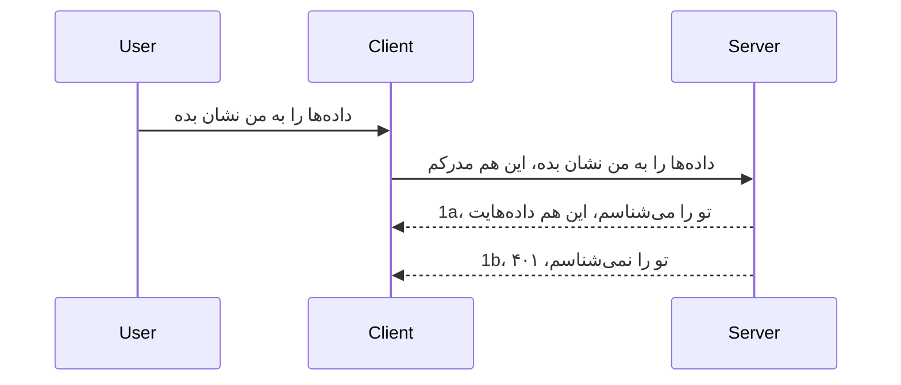

# احراز هویت ساده

کیت‌های توسعه MCP از استفاده از OAuth 2.1 پشتیبانی می‌کنند که باید اعتراف کرد فرایندی نسبتاً پیچیده است و مفاهیمی مانند سرور احراز هویت، سرور منابع، ارسال اعتبارنامه، دریافت کد، تبدیل کد به توکن حامل تا نهایتاً دریافت داده‌های منبع را در بر می‌گیرد. اگر با OAuth که پیاده‌سازی آن بسیار مفید است آشنا نیستید، ایده خوبی است که با یک سطح پایه از احراز هویت شروع کنید و به سمت امنیت بهتر و بهتر پیش بروید. به همین دلیل این فصل وجود دارد، تا شما را به سطوح پیشرفته‌تر احراز هویت برساند.

## احراز هویت، منظور چیست؟

احراز هویت خلاصه authentication و authorization است. منظور این است که ما باید دو کار انجام دهیم:

- **احراز هویت (Authentication)**، فرآیند تشخیص اینکه آیا به فرد اجازه ورود به خانه خود را می‌دهیم، اینکه او حق حضور "اینجا" را دارد یعنی به سرور منبع ما که ویژگی‌های MCP Server ما در آن قرار دارد دسترسی دارد.
- **مجوزدهی (Authorization)**، فرآیند تشخیص اینکه آیا یک کاربر باید به این منابع خاصی که درخواست کرده دسترسی داشته باشد، مثلاً این سفارش‌ها یا این محصولات، یا اینکه مجاز است فقط محتوا را بخواند اما مثلاً حذف نکند.

## اعتبارنامه‌ها: چگونه به سیستم می‌گوییم که ما کی هستیم

خب، اکثر توسعه‌دهندگان وب فکر می‌کنند که ما باید یک اعتبارنامه به سرور بدهیم، معمولاً یک راز که بگوید آیا اجازه ورود داریم یا نه "احراز هویت". این اعتبارنامه معمولاً نسخه‌ای base64 شده از نام کاربری و رمز عبور است یا یک کلید API که کاربر خاصی را به طور منحصر به فرد شناسایی می‌کند.

این با ارسال در هدر به نام "Authorization" انجام می‌شود، به این شکل:

```json
{ "Authorization": "secret123" }
```
  
این معمولاً به عنوان احراز هویت پایه (basic authentication) شناخته می‌شود. نحوه کلی روند به شکل زیر است:


حالا که از نظر روند می‌فهمیم چگونه کار می‌کند، چگونه آن را پیاده‌سازی کنیم؟ خب، اکثر سرورهای وب مفهومی به نام middleware دارند، قطعه ای از کد که به عنوان بخشی از درخواست اجرا می‌شود و می‌تواند اعتبارنامه‌ها را بررسی کند و اگر اعتبارنامه‌ها معتبر باشند اجازه عبور درخواست را بدهد. اگر درخواست اعتبارنامه معتبر نداشته باشد، خطای احراز هویت دریافت می‌کنید. بگذارید ببینیم چگونه می‌توان این را پیاده‌سازی کرد:

**پایتون**

```python
class AuthMiddleware(BaseHTTPMiddleware):
    async def dispatch(self, request, call_next):

        has_header = request.headers.get("Authorization")
        if not has_header:
            print("-> Missing Authorization header!")
            return Response(status_code=401, content="Unauthorized")

        if not valid_token(has_header):
            print("-> Invalid token!")
            return Response(status_code=403, content="Forbidden")

        print("Valid token, proceeding...")
       
        response = await call_next(request)
        # افزودن هر هدر مشتری یا تغییر به روشی در پاسخ
        return response


starlette_app.add_middleware(CustomHeaderMiddleware)
```
  
اینجا ما:

- یک middleware به نام `AuthMiddleware` ایجاد کرده‌ایم که متد `dispatch` آن توسط سرور وب فراخوانی می‌شود.
- middleware را به سرور وب اضافه کرده‌ایم:

    ```python
    starlette_app.add_middleware(AuthMiddleware)
    ```
  
- منطق اعتبارسنجی نوشته‌ایم که چک می‌کند آیا هدر Authorization موجود است و آیا راز ارسالی معتبر است یا خیر:

    ```python
    has_header = request.headers.get("Authorization")
    if not has_header:
        print("-> Missing Authorization header!")
        return Response(status_code=401, content="Unauthorized")

    if not valid_token(has_header):
        print("-> Invalid token!")
        return Response(status_code=403, content="Forbidden")
    ```
  
اگر راز وجود داشته باشد و معتبر باشد، اجازه می‌دهیم درخواست عبور کند با فراخوانی `call_next` و پاسخ را برمی‌گردانیم.

    ```python
    response = await call_next(request)
    # افزودن هر هدر مشتری یا تغییر به نوعی در پاسخ
    return response
    ```
  
نحوه کار این است که اگر درخواست وب به سمت سرور ارسال شود، middleware فراخوانی می‌شود و با توجه به پیاده‌سازی آن یا اجازه عبور درخواست را می‌دهد یا خطایی برمی‌گرداند که نشان می‌دهد مشتری اجازه ادامه ندارد.

**تایپ‌اسکریپت**

اینجا یک middleware با فریمورک محبوب Express ایجاد می‌کنیم و درخواست را قبل از رسیدن به MCP Server رهگیری می‌کنیم. کد آن به صورت زیر است:

```typescript
function isValid(secret) {
    return secret === "secret123";
}

app.use((req, res, next) => {
    // ۱. آیا هدر احراز هویت وجود دارد؟
    if(!req.headers["Authorization"]) {
        res.status(401).send('Unauthorized');
    }
    
    let token = req.headers["Authorization"];

    // ۲. صحت را بررسی کنید.
    if(!isValid(token)) {
        res.status(403).send('Forbidden');
    }

   
    console.log('Middleware executed');
    // ۳. درخواست را به مرحله بعدی در خط لوله درخواست ارسال می‌کند.
    next();
});
```
  
در این کد:

1. بررسی می‌کنیم آیا هدر Authorization اصلاً وجود دارد، اگر نه، خطای ۴۰۱ ارسال می‌کنیم.
2. از معتبر بودن اعتبارنامه/توکن اطمینان حاصل می‌کنیم، در غیر این صورت خطای ۴۰۳ ارسال می‌کنیم.
3. نهایتاً درخواست را در مسیر پردازش ادامه می‌دهیم و منبع مورد درخواست را باز می‌گردانیم.

## تمرین: پیاده‌سازی احراز هویت

بگذارید دانش خود را بکار بگیریم و سعی کنیم آن را پیاده کنیم. برنامه به شرح زیر است:

سرور

- ایجاد یک سرور وب و نمونه MCP.
- پیاده‌سازی یک middleware برای سرور.

کلاینت

- ارسال درخواست وب، با اعتبارنامه از طریق هدر.

### -1- ایجاد سرور وب و نمونه MCP

در اولین مرحله، باید نمونه سرور وب و MCP Server را ایجاد کنیم.

**پایتون**

اینجا یک نمونه MCP Server ایجاد می‌کنیم، یک اپ starlette وب می‌سازیم و آن را با uvicorn میزبانی می‌کنیم.

```python
# ایجاد سرور MCP

app = FastMCP(
    name="MCP Resource Server",
    instructions="Resource Server that validates tokens via Authorization Server introspection",
    host=settings["host"],
    port=settings["port"],
    debug=True
)

# ایجاد برنامه وب starlette
starlette_app = app.streamable_http_app()

# ارائه برنامه از طریق uvicorn
async def run(starlette_app):
    import uvicorn
    config = uvicorn.Config(
            starlette_app,
            host=app.settings.host,
            port=app.settings.port,
            log_level=app.settings.log_level.lower(),
        )
    server = uvicorn.Server(config)
    await server.serve()

run(starlette_app)
```
  
در این کد:

- MCP Server را ایجاد می‌کنیم.
- اپ وب starlette را از MCP Server می‌سازیم، `app.streamable_http_app()`.
- اپ وب را با uvicorn میزبانی و سرو می‌کنیم `server.serve()`.

**تایپ‌اسکریپت**

اینجا یک نمونه MCP Server ایجاد می‌کنیم.

```typescript
const server = new McpServer({
      name: "example-server",
      version: "1.0.0"
    });

    // ... تنظیم منابع سرور، ابزارها و درخواست‌ها ...
```
  
ایجاد MCP Server باید در تعریف مسیر POST /mcp انجام شود، پس کد بالا را به شکل زیر منتقل می‌کنیم:

```typescript
import express from "express";
import { randomUUID } from "node:crypto";
import { McpServer } from "@modelcontextprotocol/sdk/server/mcp.js";
import { StreamableHTTPServerTransport } from "@modelcontextprotocol/sdk/server/streamableHttp.js";
import { isInitializeRequest } from "@modelcontextprotocol/sdk/types.js"

const app = express();
app.use(express.json());

// نقشه برای ذخیره ترنسپورت‌ها بر اساس شناسه نشست
const transports: { [sessionId: string]: StreamableHTTPServerTransport } = {};

// رسیدگی به درخواست‌های POST برای ارتباط کلاینت به سرور
app.post('/mcp', async (req, res) => {
  // بررسی وجود شناسه نشست
  const sessionId = req.headers['mcp-session-id'] as string | undefined;
  let transport: StreamableHTTPServerTransport;

  if (sessionId && transports[sessionId]) {
    // استفاده مجدد از ترنسپورت موجود
    transport = transports[sessionId];
  } else if (!sessionId && isInitializeRequest(req.body)) {
    // درخواست مقداردهی اولیه جدید
    transport = new StreamableHTTPServerTransport({
      sessionIdGenerator: () => randomUUID(),
      onsessioninitialized: (sessionId) => {
        // ذخیره ترنسپورت بر اساس شناسه نشست
        transports[sessionId] = transport;
      },
      // محافظت در برابر تغییر انتساب DNS به صورت پیش‌فرض به منظور سازگاری با نسخه‌های قدیمی غیرفعال است. اگر این سرور را اجرا می‌کنید
      // به صورت محلی، مطمئن شوید که تنظیم می‌کنید:
      // enableDnsRebindingProtection: true,
      // allowedHosts: ['127.0.0.1'],
    });

    // پاکسازی ترنسپورت هنگام بسته شدن
    transport.onclose = () => {
      if (transport.sessionId) {
        delete transports[transport.sessionId];
      }
    };
    const server = new McpServer({
      name: "example-server",
      version: "1.0.0"
    });

    // ... راه‌اندازی منابع، ابزارها و درخواست‌های سرور ...

    // اتصال به سرور MCP
    await server.connect(transport);
  } else {
    // درخواست نامعتبر
    res.status(400).json({
      jsonrpc: '2.0',
      error: {
        code: -32000,
        message: 'Bad Request: No valid session ID provided',
      },
      id: null,
    });
    return;
  }

  // رسیدگی به درخواست
  await transport.handleRequest(req, res, req.body);
});

// هندلری قابل استفاده مجدد برای درخواست‌های GET و DELETE
const handleSessionRequest = async (req: express.Request, res: express.Response) => {
  const sessionId = req.headers['mcp-session-id'] as string | undefined;
  if (!sessionId || !transports[sessionId]) {
    res.status(400).send('Invalid or missing session ID');
    return;
  }
  
  const transport = transports[sessionId];
  await transport.handleRequest(req, res);
};

// رسیدگی به درخواست‌های GET برای اعلان‌های سرور به کلاینت از طریق SSE
app.get('/mcp', handleSessionRequest);

// رسیدگی به درخواست‌های DELETE برای خاتمه نشست
app.delete('/mcp', handleSessionRequest);

app.listen(3000);
```
  
حالا می‌بینید ایجاد MCP Server داخل `app.post("/mcp")` منتقل شده است.

بیایید به مرحله بعد یعنی ایجاد middleware برای اعتبارسنجی اعتبارنامه وارد شویم.

### -2- پیاده‌سازی middleware برای سرور

بیایید به بخش middleware برویم. اینجا یک middleware ایجاد می‌کنیم که به دنبال اعتبارنامه در هدر `Authorization` می‌گردد و آن را اعتبارسنجی می‌کند. اگر قابل قبول بود، درخواست ادامه می‌یابد تا کارهای مورد نیاز انجام شود (مثلاً فهرست کردن ابزارها، خواندن یک منبع یا هر عملکرد دیگری که MCP درخواست کرده است).

**پایتون**

برای ایجاد middleware، باید کلاسی ایجاد کنیم که از `BaseHTTPMiddleware` ارث‌بری کند. دو بخش جالب وجود دارد:

- درخواست `request`، که هدر را از آن می‌خوانیم.
- `call_next` تابعی که باید اگر مشتری اعتبارنامه قابل قبول ارائه داده آن را فراخوانی کنیم.

ابتدا باید حالتی را مدیریت کنیم که هدر `Authorization` وجود ندارد:

```python
has_header = request.headers.get("Authorization")

# هیچ هدر موجود نیست، با وضعیت ۴۰۱ شکست بخور، در غیر این صورت ادامه بده.
if not has_header:
    print("-> Missing Authorization header!")
    return Response(status_code=401, content="Unauthorized")
```
  
اینجا پیام ۴۰۱ unauthorized ارسال می‌کنیم چون مشتری در احراز هویت شکست خورده است.

بعد، اگر اعتبارنامه ارسال شده، باید اعتبار آن را به این صورت بررسی کنیم:

```python
 if not valid_token(has_header):
    print("-> Invalid token!")
    return Response(status_code=403, content="Forbidden")
```
  
دقت کنید که بالا پیام ۴۰۳ forbidden ارسال می‌کنیم. اجازه دهید middleware کامل را که همه موارد قبلی را پیاده‌سازی کرده است ببینیم:

```python
class AuthMiddleware(BaseHTTPMiddleware):
    async def dispatch(self, request, call_next):

        has_header = request.headers.get("Authorization")
        if not has_header:
            print("-> Missing Authorization header!")
            return Response(status_code=401, content="Unauthorized")

        if not valid_token(has_header):
            print("-> Invalid token!")
            return Response(status_code=403, content="Forbidden")

        print("Valid token, proceeding...")
        print(f"-> Received {request.method} {request.url}")
        response = await call_next(request)
        response.headers['Custom'] = 'Example'
        return response

```
  
عالی‌ است، اما در مورد تابع `valid_token` که چه؟ اینجا آن است:

```python
# برای تولید استفاده نکنید - آن را بهبود دهید !!
def valid_token(token: str) -> bool:
    # پیشوند "Bearer " را حذف کنید
    if token.startswith("Bearer "):
        token = token[7:]
        return token == "secret-token"
    return False
```
  
طبیعتاً این باید بهتر شود.

مهم: هرگز نباید رازها اینگونه به صورت کد سخت‌کد شده باشند. بهتر است مقدار قابل مقایسه را از یک منبع داده‌ای یا ارائه‌دهنده هویت (IDP) دریافت کنید یا بهتر اینکه اجازه دهید IDP اعتبارسنجی را انجام دهد.

**تایپ‌اسکریپت**

برای پیاده‌سازی این با Express، باید متد `use` را صدا بزنیم که توابع middleware را قبول می‌کند.

باید:

- با متغیر درخواست کار کنیم تا اعتبارنامه ارسال شده در مشخصه `Authorization` بررسی شود.
- اعتبارسنجی اعتبارنامه و اگر معتبر بود اجازه دهیم درخواست ادامه یابد و درخواست MCP کلاینت انجام شود (مثلاً فهرست کردن ابزارها، خواندن منبع یا موارد دیگر مرتبط با MCP).

اینجا بررسی می‌کنیم که هدر `Authorization` وجود دارد و اگر ندارد، درخواست را متوقف می‌کنیم:

```typescript
if(!req.headers["authorization"]) {
    res.status(401).send('Unauthorized');
    return;
}
```
  
اگر هدر اصلاً ارسال نشده باشد، کد خطای ۴۰۱ دریافت می‌کنید.

بعد اعتبارسنجی اعتبارنامه را انجام می‌دهیم، اگر نامعتبر بود دوباره درخواست را متوقف می‌کنیم اما با پیامی متفاوت:

```typescript
if(!isValid(token)) {
    res.status(403).send('Forbidden');
    return;
} 
```
  
دقت کنید حالا خطای ۴۰۳ دریافت می‌کنید.

در اینجا کد کامل است:

```typescript
app.use((req, res, next) => {
    console.log('Request received:', req.method, req.url, req.headers);
    console.log('Headers:', req.headers["authorization"]);
    if(!req.headers["authorization"]) {
        res.status(401).send('Unauthorized');
        return;
    }
    
    let token = req.headers["authorization"];

    if(!isValid(token)) {
        res.status(403).send('Forbidden');
        return;
    }  

    console.log('Middleware executed');
    next();
});
```
  
وب سرور را تنظیم کرده‌ایم تا middleware ای قبول کند که اعتبارنامه ارسال شده توسط کلاینت را بررسی کند. خود کلاینت چه وضعیتی دارد؟

### -3- ارسال درخواست وب با اعتبارنامه در هدر

باید مطمئن شویم کلاینت اعتبارنامه را از طریق هدر ارسال می‌کند. چون قرار است از کلاینت MCP استفاده کنیم، باید بفهمیم چطور این کار انجام می‌شود.

**پایتون**

برای کلاینت، باید هدر را با اعتبارنامه به این شکل بفرستیم:

```python
# مقدار را به صورت ثابت ننویسید، حداقل آن را در یک متغیر محیطی یا در محلی امن‌تر نگهداری کنید
token = "secret-token"

async with streamablehttp_client(
        url = f"http://localhost:{port}/mcp",
        headers = {"Authorization": f"Bearer {token}"}
    ) as (
        read_stream,
        write_stream,
        session_callback,
    ):
        async with ClientSession(
            read_stream,
            write_stream
        ) as session:
            await session.initialize()
      
            # کارهای انجام‌دادنی، اینکه می‌خواهید در کلاینت چه کاری انجام شود، مثلاً لیست کردن ابزارها، فراخوانی ابزارها و غیره.
```
  
دقت کنید که چطور ویژگی `headers` را به شکل `headers = {"Authorization": f"Bearer {token}"}` پر می‌کنیم.

**تایپ‌اسکریپت**

می‌توانیم این را در دو مرحله حل کنیم:

1. یک شیء پیکربندی با اعتبارنامه‌مان پر کنیم.
2. شیء پیکربندی را به ترنسپورت ارسال کنیم.

```typescript

// مقدار را به صورت کد ثابت مثل اینجا قرار ندهید. حداقل آن را به صورت یک متغیر محیطی داشته باشید و چیزی مثل dotenv (در حالت توسعه) استفاده کنید.
let token = "secret123"

// تعریف یک شیء گزینه‌های انتقال کلاینت
let options: StreamableHTTPClientTransportOptions = {
  sessionId: sessionId,
  requestInit: {
    headers: {
      "Authorization": "secret123"
    }
  }
};

// شیء گزینه‌ها را به انتقال پاس دهید
async function main() {
   const transport = new StreamableHTTPClientTransport(
      new URL(serverUrl),
      options
   );
```
  
در بالا می‌بینید چگونه یک شیء `options` ساخته‌ایم و هدرها را زیر ویژگی `requestInit` قرار داده‌ایم.

مهم: چگونه از اینجا بهترش کنیم؟ خب، پیاده‌سازی فعلی مشکلاتی دارد. اول اینکه ارسال اعتبارنامه به این شکل بسیار پرخطر است مگر اینکه حداقل HTTPS داشته باشید. حتی در آن صورت، اعتبارنامه می‌تواند دزدیده شود پس باید سیستمی داشته باشید که توکن را به راحتی باطل کند و بررسی‌های اضافی مثل اینکه توکن از کجا آمده است، آیا درخواست خیلی زیاد است (رفتار ربات مانند)، خلاصه نگرانی‌های زیادی دارد.

اما این را باید گفت که برای API های بسیار ساده که نمی‌خواهید بدون احراز هویت کسی آن‌ها را صدا بزند، نسخه فعلی شروع خوبی است.

با این حال، بیا کمی امنیت را با استفاده از فرمت استانداردی مانند JSON Web Token که به JWT یا توکن‌های "JOT" هم معروف است، بالا ببریم.

## توکن‌های وب JSON، JWT

خب، سعی داریم بهتر شویم نسبت به ارسال اعتبارنامه‌های خیلی ساده. چه بهبودهای فوری با پذیرش JWT بدست می‌آوریم؟

- **بهبود امنیت**. در احراز هویت پایه، شما نام کاربری و رمز عبور را به صورت یک توکن base64 (یا کلید API) مکرراً ارسال می‌کنید که خطر را افزایش می‌دهد. با JWT، ابتدا نام کاربری و رمز عبور ارسال می‌شود و توکن دریافت می‌کنید که همچنین زمان‌بندی شده است یعنی منقضی می‌شود. JWT اجازه استفاده از کنترل دسترسی دقیق با نقش‌ها، دامنه‌ها و مجوزها را می‌دهد.
- **بدون حالت بودن و مقیاس‌پذیری**. JWT ها خودکفا هستند، کل اطلاعات کاربر را حمل می‌کنند و نیاز به ذخیره‌سازی نشست سرور ندارد. توکن همچنین می‌تواند به صورت محلی اعتبارسنجی شود.
- **تعامل‌پذیری و اتحاد**. JWT ها مرکز Open ID Connect هستند و با ارائه‌دهندگان هویت شناخته شده‌ای مانند Entra ID، Google Identity و Auth0 استفاده می‌شوند. همچنین استفاده از ورود یکپارچه و موارد دیگر را ممکن می‌سازند که آن‌ها را برای سازمان‌ها مناسب می‌کند.
- **ماژولار بودن و انعطاف‌پذیری**. JWT ها همچنین می‌توانند با API Gateway هایی مانند Azure API Management، NGINX و غیره استفاده شوند. از سناریوهای احراز هویت و ارتباط سرور به سرور شامل نمایندگی و واگذاری پشتیبانی می‌کنند.
- **کارایی و کشینگ**. JWT ها پس از رمزگشایی قابل کش کردن هستند که نیاز به تحلیل مجدد را کاهش می‌دهد. این به خصوص برای برنامه‌های با ترافیک بالا مفید است چون توان عملیاتی را افزایش و بار را روی زیرساخت کاهش می‌دهد.
- **ویژگی‌های پیشرفته**. همچنین از introspection (بررسی اعتبار روی سرور) و revocation (باطل کردن توکن) پشتیبانی می‌کند.

با همه این مزایا، بیایید ببینیم چگونه می‌توانیم پیاده‌سازی خود را به سطح بعدی بریم.

## تبدیل احراز هویت پایه به JWT

پس تغییرات کلی که لازم است انجام دهیم عبارتند از:

- **یادگیری ساخت توکن JWT** و آماده کردن آن برای ارسال از کلاینت به سرور.
- **اعتبارسنجی توکن JWT**، و اگر معتبر بود، اجازه دادن به کلاینت برای دسترسی به منابع.
- **ذخیره امن توکن**. چگونه این توکن را ذخیره کنیم.
- **حفاظت از مسیرها**. ما باید مسیرها را حفاظت کنیم، در حالت ما باید از مسیرها و ویژگی‌های خاص MCP حفاظت کنیم.
- **افزودن توکن‌های رفرش**. اطمینان از اینکه توکن‌های کوتاه‌مدت ایجاد می‌کنیم و توکن‌های رفرش طولانی‌مدت که می‌توانند برای گرفتن توکن جدید در صورت انقضا استفاده شوند. همچنین اطمینان از وجود نقطه پایان رفرش و استراتژی چرخش.

### -1- ساخت توکن JWT

ابتدا، یک توکن JWT بخش‌های زیر را دارد:

- **هدر**، الگوریتم استفاده شده و نوع توکن.
- **بارگذاری (payload)**، ادعاها، مثل sub (کاربر یا موجودیتی که توکن نمایندگی می‌کند؛ در سناریوی احراز هویت معمولاً id کاربر)، exp (زمان انقضا) role (نقش)
- **امضا**، با یک راز یا کلید خصوصی امضا شده است.

برای این، باید هدر، بارگذاری و توکن رمزگذاری شده بسازیم.

**پایتون**

```python

import jwt
import jwt
from jwt.exceptions import ExpiredSignatureError, InvalidTokenError
import datetime

# کلید مخفی استفاده‌شده برای امضای JWT
secret_key = 'your-secret-key'

header = {
    "alg": "HS256",
    "typ": "JWT"
}

# اطلاعات کاربر و ادعاها و زمان انقضای آن
payload = {
    "sub": "1234567890",               # موضوع (شناسه کاربر)
    "name": "User Userson",                # ادعای سفارشی
    "admin": True,                     # ادعای سفارشی
    "iat": datetime.datetime.utcnow(),# تاریخ صدور
    "exp": datetime.datetime.utcnow() + datetime.timedelta(hours=1)  # انقضا
}

# رمزگذاری آن
encoded_jwt = jwt.encode(payload, secret_key, algorithm="HS256", headers=header)
```
  
تابع بالا:

- هدر را با الگوریتم HS256 و نوع JWT تعریف کرده‌ایم.
- بارگذاری شامل موضوع یا شناسه کاربر، نام کاربری، نقش، زمان صدور و زمان انقضا است و به این ترتیب جنبه زمان‌بندی شده که قبلاً گفتیم را پیاده می‌کند.

**تایپ‌اسکریپت**

برای اینجا به وابستگی‌هایی نیاز داریم که به ما در ساخت توکن JWT کمک کنند.

وابستگی‌ها

```sh

npm install jsonwebtoken
npm install --save-dev @types/jsonwebtoken
```
  
حالا که این‌ها را نصب کرده‌ایم، بیایید هدر، بارگذاری و از طریق آن توکن رمزگذاری شده را بسازیم.

```typescript
import jwt from 'jsonwebtoken';

const secretKey = 'your-secret-key'; // استفاده از متغیرهای محیطی در محیط تولید

// تعریف داده بار
const payload = {
  sub: '1234567890',
  name: 'User usersson',
  admin: true,
  iat: Math.floor(Date.now() / 1000), // زمان صدور
  exp: Math.floor(Date.now() / 1000) + 60 * 60 // انقضا در ۱ ساعت
};

// تعریف هدر (اختیاری، jsonwebtoken پیش‌فرض‌ها را تنظیم می‌کند)
const header = {
  alg: 'HS256',
  typ: 'JWT'
};

// ایجاد توکن
const token = jwt.sign(payload, secretKey, {
  algorithm: 'HS256',
  header: header
});

console.log('JWT:', token);
```
  
این توکن:

با HS256 امضا شده  
برای ۱ ساعت معتبر است  
شامل ادعاهایی مثل sub، name، admin، iat و exp می‌باشد.

### -2- اعتبارسنجی توکن

ما همچنین باید توکن را اعتبارسنجی کنیم، این کاری است که در سرور انجام می‌دهیم تا اطمینان حاصل شود آنچه کلاینت ارسال می‌کند واقعاً معتبر است. بررسی‌های زیادی باید انجام شود از اعتبارسنجی ساختار تا اعتبار. همچنین توصیه می‌شود چک‌های دیگری اضافه کنید که ببینید آیا کاربر در سیستم شما وجود دارد یا خیر و موارد بیشتر.

برای اعتبارسنجی توکن، باید آن را رمزگشایی کنیم تا بتوانیم بخوانیم و سپس اعتبار آن را بررسی کنیم:

**پایتون**

```python

# رمزگشایی و تأیید JWT
try:
    decoded = jwt.decode(token, secret_key, algorithms=["HS256"])
    print("✅ Token is valid.")
    print("Decoded claims:")
    for key, value in decoded.items():
        print(f"  {key}: {value}")
except ExpiredSignatureError:
    print("❌ Token has expired.")
except InvalidTokenError as e:
    print(f"❌ Invalid token: {e}")

```
  
در این کد، تابع `jwt.decode` را با توکن، کلید مخفی و الگوریتم انتخابی صدا می‌زنیم. دقت کنید که از ساختار try-catch استفاده کرده‌ایم چون اعتبارسنجی ناموفق باعث پرتاب خطا می‌شود.

**تایپ‌اسکریپت**

اینجا باید `jwt.verify` را صدا بزنیم تا نسخه رمزگشایی شده توکن را بگیریم که بتوانیم بیشتر آن را تحلیل کنیم. اگر این فراخوانی شکست بخورد، یعنی ساختار توکن نادرست است یا دیگر معتبر نیست.

```typescript

try {
  const decoded = jwt.verify(token, secretKey);
  console.log('Decoded Payload:', decoded);
} catch (err) {
  console.error('Token verification failed:', err);
}
```
  
توجه: همانطور که قبلاً گفتیم، باید چک‌های بیشتری انجام دهیم تا مطمئن شویم این توکن به یک کاربر در سیستم ما اشاره دارد و مطمئن شویم کاربر حقوقی که ادعا می‌کند دارد را دارد.

در مرحله بعد، به کنترل دسترسی مبتنی بر نقش یا RBAC می‌پردازیم.
## افزودن کنترل دسترسی مبتنی بر نقش

ایده این است که ما می‌خواهیم بیان کنیم که نقش‌های مختلف مجوزهای متفاوتی دارند. برای مثال، فرض می‌کنیم یک مدیر می‌تواند همه کارها را انجام دهد و کاربران عادی می‌توانند خواندن/نوشتن کنند و یک مهمان فقط می‌تواند بخواند. بنابراین، سطوح مجوز ممکن عبارتند از:

- Admin.Write  
- User.Read  
- Guest.Read  

بیایید ببینیم چگونه می‌توانیم چنین کنترل دسترسی را با میان‌افزار پیاده‌سازی کنیم. میان‌افزارها می‌توانند برای هر مسیر به صورت جداگانه و یا برای همه مسیرها اضافه شوند.

**پایتون**

```python
from starlette.middleware.base import BaseHTTPMiddleware
from starlette.responses import JSONResponse
import jwt

# رمز مخفی را داخل کد نگذارید، این فقط برای اهداف نمایشی است. آن را از مکانی امن بخوانید.
SECRET_KEY = "your-secret-key" # این را در متغیر محیطی قرار دهید
REQUIRED_PERMISSION = "User.Read"

class JWTPermissionMiddleware(BaseHTTPMiddleware):
    async def dispatch(self, request, call_next):
        auth_header = request.headers.get("Authorization")
        if not auth_header or not auth_header.startswith("Bearer "):
            return JSONResponse({"error": "Missing or invalid Authorization header"}, status_code=401)

        token = auth_header.split(" ")[1]
        try:
            decoded = jwt.decode(token, SECRET_KEY, algorithms=["HS256"])
        except jwt.ExpiredSignatureError:
            return JSONResponse({"error": "Token expired"}, status_code=401)
        except jwt.InvalidTokenError:
            return JSONResponse({"error": "Invalid token"}, status_code=401)

        permissions = decoded.get("permissions", [])
        if REQUIRED_PERMISSION not in permissions:
            return JSONResponse({"error": "Permission denied"}, status_code=403)

        request.state.user = decoded
        return await call_next(request)


```
  
روش‌های مختلفی برای افزودن میان‌افزار به شکل زیر وجود دارد:

```python

# روش ۱: افزودن میدل‌ور هنگام ساخت برنامه استارلت
middleware = [
    Middleware(JWTPermissionMiddleware)
]

app = Starlette(routes=routes, middleware=middleware)

# روش ۲: افزودن میدل‌ور پس از اینکه برنامه استارلت قبلاً ساخته شده است
starlette_app.add_middleware(JWTPermissionMiddleware)

# روش ۳: افزودن میدل‌ور برای هر مسیر
routes = [
    Route(
        "/mcp",
        endpoint=..., # هندلر
        middleware=[Middleware(JWTPermissionMiddleware)]
    )
]
```
  
**تایپ‌اسکریپت**

می‌توانیم از `app.use` و یک میان‌افزار که برای همه درخواست‌ها اجرا می‌شود استفاده کنیم.

```typescript
app.use((req, res, next) => {
    console.log('Request received:', req.method, req.url, req.headers);
    console.log('Headers:', req.headers["authorization"]);

    // ۱. بررسی اینکه آیا هدر مجوز ارسال شده است

    if(!req.headers["authorization"]) {
        res.status(401).send('Unauthorized');
        return;
    }
    
    let token = req.headers["authorization"];

    // ۲. بررسی اینکه توکن معتبر است
    if(!isValid(token)) {
        res.status(403).send('Forbidden');
        return;
    }  

    // ۳. بررسی اینکه کاربر توکن در سیستم ما وجود دارد
    if(!isExistingUser(token)) {
        res.status(403).send('Forbidden');
        console.log("User does not exist");
        return;
    }
    console.log("User exists");

    // ۴. تأیید اینکه توکن مجوزهای صحیح را دارد
    if(!hasScopes(token, ["User.Read"])){
        res.status(403).send('Forbidden - insufficient scopes');
    }

    console.log("User has required scopes");

    console.log('Middleware executed');
    next();
});

```
  
چند کار هست که می‌توانیم به میان‌افزار بسپاریم و میان‌افزار ما باید انجام دهد، یعنی:

1. بررسی وجود هدر مجوز (authorization header)  
2. بررسی اعتبار توکن، ما متدی به نام `isValid` داریم که تمامیت و اعتبار توکن JWT را چک می‌کند.  
3. اطمینان از وجود کاربر در سیستم، ما باید این را بررسی کنیم.  

   ```typescript
    // کاربران در پایگاه داده
   const users = [
     "user1",
     "User usersson",
   ]

   function isExistingUser(token) {
     let decodedToken = verifyToken(token);

     // کارهای باقیمانده، بررسی وجود کاربر در پایگاه داده
     return users.includes(decodedToken?.name || "");
   }
   ```
  
   بالاتر، لیست بسیار ساده‌ای از کاربران ایجاد کردیم که البته باید در یک پایگاه داده باشد.

4. علاوه بر این، باید بررسی کنیم که توکن مجوزهای درست را دارد.

   ```typescript
   if(!hasScopes(token, ["User.Read"])){
        res.status(403).send('Forbidden - insufficient scopes');
   }
   ```
  
   در کد بالا در میان‌افزار، بررسی می‌کنیم که توکن شامل مجوز User.Read است، در غیر این صورت خطای 403 ارسال می‌کنیم. در زیر متد کمکی `hasScopes` آمده است.

   ```typescript
   function hasScopes(scope: string, requiredScopes: string[]) {
     let decodedToken = verifyToken(scope);
    return requiredScopes.every(scope => decodedToken?.scopes.includes(scope));
  }  
   ```

Have a think which additional checks you should be doing, but these are the absolute minimum of checks you should be doing.

Using Express as a web framework is a common choice. There are helpers library when you use JWT so you can write less code.

- `express-jwt`, helper library that provides a middleware that helps decode your token.
- `express-jwt-permissions`, this provides a middleware `guard` that helps check if a certain permission is on the token.

Here's what these libraries can look like when used:

```typescript
const express = require('express');
const jwt = require('express-jwt');
const guard = require('express-jwt-permissions')();

const app = express();
const secretKey = 'your-secret-key'; // put this in env variable

// Decode JWT and attach to req.user
app.use(jwt({ secret: secretKey, algorithms: ['HS256'] }));

// Check for User.Read permission
app.use(guard.check('User.Read'));

// multiple permissions
// app.use(guard.check(['User.Read', 'Admin.Access']));

app.get('/protected', (req, res) => {
  res.json({ message: `Welcome ${req.user.name}` });
});

// Error handler
app.use((err, req, res, next) => {
  if (err.code === 'permission_denied') {
    return res.status(403).send('Forbidden');
  }
  next(err);
});

```
  
اکنون دیدید که میان‌افزار چگونه می‌تواند برای احراز هویت و مجوزها استفاده شود، اما در مورد MCP چطور؟ آیا روش انجام احراز هویت تغییر می‌کند؟ در بخش بعدی خواهیم فهمید.

### -3- افزودن RBAC به MCP

تا اینجا دیدید چگونه می‌توانید RBAC را از طریق میان‌افزار اضافه کنید، اما برای MCP هیچ روش آسانی برای اضافه کردن RBAC به ازای هر ویژگی MCP وجود ندارد، پس چه کار کنیم؟ خوب، فقط باید مثل این کد اضافه کنیم که بررسی کند در این حالت آیا کلاینت حق صدا زدن یک ابزار خاص را دارد یا خیر:

چندین انتخاب دارید تا RBAC را به ازای هر ویژگی پیاده کنید، بعضی از آنها این‌ها هستند:

- بررسی برای هر ابزار، منبع، یا درخواست که نیازمند بررسی سطح مجوز است.

   **پایتون**

   ```python
   @tool()
   def delete_product(id: int):
      try:
          check_permissions(role="Admin.Write", request)
      catch:
        pass # مشتری مجوز را دریافت نکرد، خطای مجوز صادر شود
   ```
  
   **تایپ‌اسکریپت**

   ```typescript
   server.registerTool(
    "delete-product",
    {
      title: Delete a product",
      description: "Deletes a product",
      inputSchema: { id: z.number() }
    },
    async ({ id }) => {
      
      try {
        checkPermissions("Admin.Write", request);
        // انجام شود، ارسال شناسه به productService و remote entry
      } catch(Exception e) {
        console.log("Authorization error, you're not allowed");  
      }

      return {
        content: [{ type: "text", text: `Deletected product with id ${id}` }]
      };
    }
   );
   ```


- استفاده از رویکرد پیشرفته سرور و هندلرهای درخواست تا تعداد نقاط لازم برای بررسی را به حداقل برسانید.

   **پایتون**

   ```python
   
   tool_permission = {
      "create_product": ["User.Write", "Admin.Write"],
      "delete_product": ["Admin.Write"]
   }

   def has_permission(user_permissions, required_permissions) -> bool:
      # دسترسی‌های کاربر: لیستی از دسترسی‌هایی که کاربر دارد
      # دسترسی‌های مورد نیاز: لیستی از دسترسی‌های لازم برای ابزار
      return any(perm in user_permissions for perm in required_permissions)

   @server.call_tool()
   async def handle_call_tool(
     name: str, arguments: dict[str, str] | None
   ) -> list[types.TextContent]:
    # فرض کنید request.user.permissions لیستی از دسترسی‌های کاربر است
     user_permissions = request.user.permissions
     required_permissions = tool_permission.get(name, [])
     if not has_permission(user_permissions, required_permissions):
        # خطا ایجاد کن "شما اجازه دسترسی به ابزار {name} را ندارید"
        raise Exception(f"You don't have permission to call tool {name}")
     # ادامه بده و ابزار را فراخوانی کن
     # ...
   ```   
    

   **تایپ‌اسکریپت**

   ```typescript
   function hasPermission(userPermissions: string[], requiredPermissions: string[]): boolean {
       if (!Array.isArray(userPermissions) || !Array.isArray(requiredPermissions)) return false;
       // اگر کاربر حداقل یک مجوز لازم را دارد، مقدار true را بازگردان
       
       return requiredPermissions.some(perm => userPermissions.includes(perm));
   }
  
   server.setRequestHandler(CallToolRequestSchema, async (request) => {
      const { params: { name } } = request;
  
      let permissions = request.user.permissions;
  
      if (!hasPermission(permissions, toolPermissions[name])) {
         return new Error(`You don't have permission to call ${name}`);
      }
  
      // ادامه بده..
   });
   ```
  
   توجه داشته باشید باید اطمینان حاصل کنید که میان‌افزار شما توکن رمزگشایی شده را به پراپرتی user درخواست اختصاص می‌دهد تا کد بالا ساده شود.

### خلاصه

حالا که درباره نحوه اضافه کردن پشتیبانی از RBAC به طور کلی و به ویژه برای MCP صحبت کردیم، وقت آن است که خودتان امنیت را پیاده‌سازی کنید تا مطمئن شوید مفاهیمی که به شما ارائه شد را درک کرده‌اید.

## تمرین 1: ساخت یک سرور mcp و کلاینت mcp با استفاده از احراز هویت پایه

در این قسمت آنچه را که درباره ارسال اطلاعات کاربری از طریق هدرها یاد گرفتید، به کار ببرید.

## راه‌حل 1

[راه‌حل 1](./code/basic/README.md)

## تمرین 2: ارتقاء راه‌حل تمرین 1 برای استفاده از JWT

راه‌حل اول را بگیرید اما این بار آن را بهبود ببخشید.

به جای استفاده از احراز هویت پایه، از JWT استفاده کنیم.

## راه‌حل 2

[راه‌حل 2](./solution/jwt-solution/README.md)

## چالش

افزودن RBAC به ازای هر ابزار که در بخش "افزودن RBAC به MCP" توصیف شده است.

## خلاصه

امیدواریم در این فصل چیزهای زیادی یاد گرفته باشید، از عدم امنیت، تا امنیت پایه، تا JWT و نحوه افزودنش به MCP.

ما پایه‌ای قوی با JWTهای سفارشی ساخته‌ایم، اما هر چه بزرگ‌تر می‌شویم، به سمت مدل هویتی مبتنی بر استانداردها حرکت می‌کنیم. پذیرش یک IdP مانند Entra یا Keycloak به ما اجازه می‌دهد تا صدور، اعتبارسنجی و مدیریت چرخه عمر توکن را به یک پلتفرم قابل اعتماد بسپاریم — و انرژی خود را روی منطق اپلیکیشن و تجربه کاربری متمرکز کنیم.

برای این منظور، یک [فصل پیشرفته درباره Entra](../../05-AdvancedTopics/mcp-security-entra/README.md) داریم.

## قدم بعدی

- بعدی: [راه‌اندازی میزبان‌های MCP](../12-mcp-hosts/README.md)

---

<!-- CO-OP TRANSLATOR DISCLAIMER START -->
**توضیح تکمیلی**:
این سند با استفاده از سرویس ترجمه هوش مصنوعی [Co-op Translator](https://github.com/Azure/co-op-translator) ترجمه شده است. در حالی که ما در تلاش برای دقت هستیم، لطفاً توجه داشته باشید که ترجمه‌های خودکار ممکن است شامل خطاها یا نادرستی‌هایی باشند. نسخه اصلی سند به زبان بومی آن باید به عنوان منبع معتبر در نظر گرفته شود. برای اطلاعات حیاتی، استفاده از ترجمه حرفه‌ای انسانی توصیه می‌شود. ما مسئول هیچ گونه سوءتفاهم یا تفسیر نادرستی که ناشی از استفاده از این ترجمه باشد، نیستیم.
<!-- CO-OP TRANSLATOR DISCLAIMER END -->