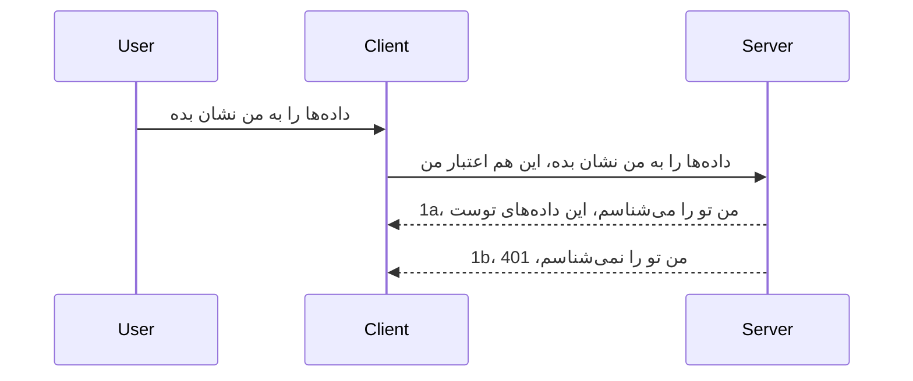

# احراز هویت ساده

SDKهای MCP از استفاده از OAuth 2.1 پشتیبانی می‌کنند که اگر بخواهیم منصف باشیم، فرآیند نسبتاً پیچیده‌ای است شامل مفاهیمی مانند سرور احراز هویت، سرور منبع، ارسال مدارک، دریافت کد، تبدیل کد به توکن حامل تا اینکه در نهایت بتوانید داده منبع خود را دریافت کنید. اگر با OAuth آشنا نیستید که کار بسیار خوبی است برای پیاده‌سازی، ایده خوبی است که با سطوح پایه‌ای احراز هویت شروع کنید و به سمت امنیت بهتر و بهتر پیش بروید. به همین دلیل این فصل وجود دارد، تا شما را به احراز هویت پیشرفته‌تر برساند.

## احراز هویت، منظور ما چیست؟

احراز هویت مخفف authentication و authorization است. ایده این است که باید دو کار انجام دهیم:

- **تأیید هویت**، که فرآیند تشخیص این است که آیا اجازه می‌دهیم یک فرد وارد خانه ما شود، اینکه او حق "حضور" دارد یعنی به سرور منبع ما که ویژگی‌های سرور MCP ما در آن قرار دارد دسترسی داشته باشد.
- **مجوز دادن**، فرآیند تعیین این است که آیا کاربر باید به منابع خاصی که درخواست می‌کند دسترسی داشته باشد، برای مثال این سفارش‌ها یا این محصولات یا اینکه اجازه دارد محتوا را بخواند اما نه حذف کند به عنوان یک مثال دیگر.

## مدارک: چگونه به سیستم می‌گوییم که ما کی هستیم

خوب، اکثر توسعه‌دهندگان وب شروع به فکر کردن در قالب ارائه مدرکی به سرور می‌کنند، معمولاً یک راز که می‌گوید آیا آنها اجازه حضور دارند "Authentication". این مدرک معمولاً نسخه‌ای کدگذاری شده به base64 از نام کاربری و رمز عبور است یا یک کلید API که یک کاربر خاص را به طور منحصربه‌فرد شناسایی می‌کند.

این شامل ارسال آن از طریق هدر "Authorization" به این صورت است:

```json
{ "Authorization": "secret123" }
```

این معمولاً به عنوان احراز هویت پایه شناخته می‌شود. جریان کلی کار به این صورت است:


```mermaid
sequenceDiagram
   participant User
   participant Client
   participant Server

   User->>Client: داده‌ها را به من نشان بده
   Client->>Server: داده‌ها را به من نشان بده، این هم اعتبار من
   Server-->>Client: 1a، من تو را می‌شناسم، این داده‌های توست
   Server-->>Client: 1b، من تو را نمی‌شناسم، 401 
```

اکنون که نحوه کار کردن آن را از دیدگاه جریان درک کردیم، چگونه آن را پیاده‌سازی کنیم؟ خوب، اکثر وب سرورها یک مفهوم به نام middleware دارند، یک تکه کد که به عنوان بخشی از درخواست اجرا می‌شود که می‌تواند مدارک را تأیید کند و اگر مدارک معتبر باشند اجازه عبور درخواست را می‌دهد. اگر درخواست دارای مدارک معتبر نباشد شما با خطای احراز هویت مواجه می‌شوید. بگذارید ببینیم چگونه می‌توان این را پیاده‌سازی کرد:

**پایتون**

```python
class AuthMiddleware(BaseHTTPMiddleware):
    async def dispatch(self, request, call_next):

        has_header = request.headers.get("Authorization")
        if not has_header:
            print("-> Missing Authorization header!")
            return Response(status_code=401, content="Unauthorized")

        if not valid_token(has_header):
            print("-> Invalid token!")
            return Response(status_code=403, content="Forbidden")

        print("Valid token, proceeding...")
       
        response = await call_next(request)
        # هر هدر مشتری را اضافه کنید یا به نحوی پاسخ را تغییر دهید
        return response


starlette_app.add_middleware(CustomHeaderMiddleware)
```

اینجا ما داریم: 

- یک middleware به نام `AuthMiddleware` ایجاد کردیم که متد `dispatch` آن توسط وب سرور فراخوانی می‌شود.
- middleware را به وب سرور اضافه کردیم:

    ```python
    starlette_app.add_middleware(AuthMiddleware)
    ```

- منطق اعتبارسنجی نوشته‌ایم که بررسی می‌کند آیا هدر Authorization وجود دارد و آیا راز ارسال شده معتبر است:

    ```python
    has_header = request.headers.get("Authorization")
    if not has_header:
        print("-> Missing Authorization header!")
        return Response(status_code=401, content="Unauthorized")

    if not valid_token(has_header):
        print("-> Invalid token!")
        return Response(status_code=403, content="Forbidden")
    ```

    اگر راز موجود و معتبر بود، اجازه می‌دهیم درخواست عبور کند با فراخوانی `call_next` و پاسخ را بازمی‌گردانیم.

    ```python
    response = await call_next(request)
    # افزودن هر هدر دلخواه مشتری یا تغییر پاسخ به شکلی خاص
    return response
    ```

نحوه کار این است که اگر یک درخواست وب به سمت سرور ارسال شود middleware فراخوانی خواهد شد و با توجه به پیاده‌سازی آن یا اجازه عبور درخواست را می‌دهد یا خطایی که نشان می‌دهد مشتری اجازه ادامه ندارد را بازمی‌گرداند.

**TypeScript**

اینجا middleware با فریم‌ورک محبوب Express ایجاد می‌کنیم و درخواست را قبل از رسیدن به سرور MCP رهگیری می‌کنیم. کد آن به شرح زیر است:

```typescript
function isValid(secret) {
    return secret === "secret123";
}

app.use((req, res, next) => {
    // ۱. آیا هدر مجوز موجود است؟
    if(!req.headers["Authorization"]) {
        res.status(401).send('Unauthorized');
    }
    
    let token = req.headers["Authorization"];

    // ۲. اعتبارسنجی را بررسی کنید.
    if(!isValid(token)) {
        res.status(403).send('Forbidden');
    }

   
    console.log('Middleware executed');
    // ۳. درخواست را به مرحله بعدی در خط لوله درخواست می‌فرستد.
    next();
});
```

در این کد ما:

1. بررسی می‌کنیم که آیا هدر Authorization وجود دارد یا خیر، اگر وجود نداشت، خطای 401 ارسال می‌کنیم.
2. اطمینان حاصل می‌کنیم که مدرک/توکن معتبر است، اگر نه، خطای 403 ارسال می‌کنیم.
3. در نهایت درخواست را در خط لوله درخواست‌ها پاس می‌دهیم و منبع درخواست شده را بازمی‌گردانیم.

## تمرین: پیاده‌سازی احراز هویت

بیایید دانش خود را بگیریم و سعی کنیم آن را پیاده‌سازی کنیم. برنامه به این صورت است:

سرور

- یک وب سرور و نمونه MCP ایجاد کنید.
- middleware برای سرور پیاده‌سازی کنید.

مشتری

- ارسال درخواست وب، با مدرک، از طریق هدر.

### -1- ایجاد یک وب سرور و نمونه MCP

> [!WARNING]
> مثال TypeScript زیر هدفش MCP `2025-11-25` است. این نسخه انتقال‌ها را
> با شناسه جلسه `mcp-session-id` ردیابی می‌کند و یک مثال جاری  `2026-07-28` انتقال نیست. نسخه MCP
> `2026-07-28` حذف چک دست دادن `initialize` و شناسه جلسه پروتکل؛ پیاده‌سازی‌های جدید
> درخواست‌های خودکفا (self-contained) را استفاده می‌کنند. ببینید
> [چه تغییراتی در MCP: مشخصات ۲۰۲۶-۰۷-۲۸](../../01-CoreConcepts/mcp-2026-07-28.md).

در اولین قدم، باید نمونه وب سرور و سرور MCP را ایجاد کنیم.

**پایتون**

اینجا یک نمونه سرور MCP ایجاد می‌کنیم، یک اپ وب starlette می‌سازیم و آن را با uvicorn میزبانی می‌کنیم.

```python
# ایجاد سرور MCP

app = FastMCP(
    name="MCP Resource Server",
    instructions="Resource Server that validates tokens via Authorization Server introspection",
    host=settings["host"],
    port=settings["port"],
    debug=True
)

# ایجاد برنامه وب starlette
starlette_app = app.streamable_http_app()

# ارائه برنامه از طریق uvicorn
async def run(starlette_app):
    import uvicorn
    config = uvicorn.Config(
            starlette_app,
            host=app.settings.host,
            port=app.settings.port,
            log_level=app.settings.log_level.lower(),
        )
    server = uvicorn.Server(config)
    await server.serve()

run(starlette_app)
```

در این کد ما:

- سرور MCP را ایجاد کرده‌ایم.
- اپ وب starlette را از سرور MCP ساخته‌ایم، `app.streamable_http_app()`.
- اپ وب را با استفاده از uvicorn میزبانی و اجرا می‌کنیم `server.serve()`.

**TypeScript**

اینجا یک نمونه سرور MCP ایجاد می‌کنیم.

```typescript
const server = new McpServer({
      name: "example-server",
      version: "1.0.0"
    });

    // ... تنظیم منابع سرور، ابزارها و پرسش‌ها ...
```

این ایجاد سرور MCP باید داخل تعریف مسیر POST /mcp ما انجام شود، بنابراین بیایید کد بالا را به صورت زیر منتقل کنیم:

```typescript
import express from "express";
import { randomUUID } from "node:crypto";
import { McpServer } from "@modelcontextprotocol/sdk/server/mcp.js";
import { StreamableHTTPServerTransport } from "@modelcontextprotocol/sdk/server/streamableHttp.js";
import { isInitializeRequest } from "@modelcontextprotocol/sdk/types.js"

const app = express();
app.use(express.json());

// نقشه برای ذخیره ترنسپورت‌ها بر اساس شناسه جلسه
const transports: { [sessionId: string]: StreamableHTTPServerTransport } = {};

// رسیدگی به درخواست‌های POST برای ارتباط مشتری به سرور
app.post('/mcp', async (req, res) => {
  // بررسی وجود شناسه جلسه
  const sessionId = req.headers['mcp-session-id'] as string | undefined;
  let transport: StreamableHTTPServerTransport;

  if (sessionId && transports[sessionId]) {
    // استفاده مجدد از ترنسپورت موجود
    transport = transports[sessionId];
  } else if (!sessionId && isInitializeRequest(req.body)) {
    // درخواست جدید برای مقداردهی اولیه
    transport = new StreamableHTTPServerTransport({
      sessionIdGenerator: () => randomUUID(),
      onsessioninitialized: (sessionId) => {
        // ذخیره ترنسپورت بر اساس شناسه جلسه
        transports[sessionId] = transport;
      },
      // محافظت در برابر تغییر دوباره DNS به طور پیش‌فرض برای سازگاری با نسخه‌های قبلی غیرفعال است. اگر این سرور را
      // به صورت محلی اجرا می‌کنید، مطمئن شوید که تنظیم کنید:
      // enableDnsRebindingProtection: true,
      // allowedHosts: ['127.0.0.1'],
    });

    // پاک‌سازی ترنسپورت هنگام بسته شدن
    transport.onclose = () => {
      if (transport.sessionId) {
        delete transports[transport.sessionId];
      }
    };
    const server = new McpServer({
      name: "example-server",
      version: "1.0.0"
    });

    // ... راه‌اندازی منابع سرور، ابزارها و راهنمایی‌ها ...

    // اتصال به سرور MCP
    await server.connect(transport);
  } else {
    // درخواست نامعتبر
    res.status(400).json({
      jsonrpc: '2.0',
      error: {
        code: -32000,
        message: 'Bad Request: No valid session ID provided',
      },
      id: null,
    });
    return;
  }

  // رسیدگی به درخواست
  await transport.handleRequest(req, res, req.body);
});

// هندلر قابل استفاده مجدد برای درخواست‌های GET و DELETE
const handleSessionRequest = async (req: express.Request, res: express.Response) => {
  const sessionId = req.headers['mcp-session-id'] as string | undefined;
  if (!sessionId || !transports[sessionId]) {
    res.status(400).send('Invalid or missing session ID');
    return;
  }
  
  const transport = transports[sessionId];
  await transport.handleRequest(req, res);
};

// رسیدگی به درخواست‌های GET برای اعلان‌های سرور به مشتری از طریق SSE
app.get('/mcp', handleSessionRequest);

// رسیدگی به درخواست‌های DELETE برای خاتمه جلسه
app.delete('/mcp', handleSessionRequest);

app.listen(3000);
```

اکنون می‌بینید چگونه ایجاد سرور MCP درون `app.post("/mcp")` منتقل شده است.

بیایید به مرحله بعدی یعنی ایجاد middleware برای اعتبارسنجی مدرک ورودی برویم.

### -2- پیاده‌سازی middleware برای سرور

حالا بخش middleware را انجام می‌دهیم. اینجا ما یک middleware ایجاد می‌کنیم که به دنبال مدرک در هدر `Authorization` می‌گردد و آن را اعتبارسنجی می‌کند. اگر قابل قبول بود، اجازه می‌دهیم درخواست به انجام کاری که لازم دارد (مثلاً فهرست کردن ابزارها، خواندن منبع یا هر عملکرد MCPای که مشتری درخواست کرده) ادامه دهد.

**پایتون**

برای ایجاد middleware، باید یک کلاس ایجاد کنیم که از `BaseHTTPMiddleware` ارث‌بری کند. دو بخش جالب دارد:

- درخواست `request` ، که از آن اطلاعات هدر را می‌خوانیم.
- `call_next` که callback است و باید اگر مشتری مدرکی آورد که قبول داریم آن را فراخوانی کنیم.

اول، باید حالت نبودن هدر `Authorization` را مدیریت کنیم:

```python
has_header = request.headers.get("Authorization")

# هدر موجود نیست، با کد ۴۰۱ رد شود، در غیر این صورت ادامه دهید.
if not has_header:
    print("-> Missing Authorization header!")
    return Response(status_code=401, content="Unauthorized")
```

اینجا یک پیام 401 unauthorized ارسال می‌کنیم چرا که مشتری احراز هویت را به درستی انجام نداده است.

بعد، اگر مدرکی ارسال شده، باید اعتبار آن را بررسی کنیم به این شکل:

```python
 if not valid_token(has_header):
    print("-> Invalid token!")
    return Response(status_code=403, content="Forbidden")
```

ببینید چگونه یک پیام 403 forbidden ارسال می‌کنیم. بیایید middleware کامل را که همه موارد گفته‌شده را پیاده‌سازی کرده مشاهده کنیم:

```python
class AuthMiddleware(BaseHTTPMiddleware):
    async def dispatch(self, request, call_next):

        has_header = request.headers.get("Authorization")
        if not has_header:
            print("-> Missing Authorization header!")
            return Response(status_code=401, content="Unauthorized")

        if not valid_token(has_header):
            print("-> Invalid token!")
            return Response(status_code=403, content="Forbidden")

        print("Valid token, proceeding...")
        print(f"-> Received {request.method} {request.url}")
        response = await call_next(request)
        response.headers['Custom'] = 'Example'
        return response

```

عالی است، اما تابع `valid_token` چیست؟ در زیر آن را می‌بینید:

```python
# از آن در تولید استفاده نکنید - آن را بهبود دهید !!
def valid_token(token: str) -> bool:
    # پیشوند "Bearer " را حذف کنید
    if token.startswith("Bearer "):
        token = token[7:]
        return token == "secret-token"
    return False
```

این البته باید بهتر شود.

مهم: شما نباید هیچگاه چنین اسراری را در کد قرار دهید. بهتر است مقداری برای مقایسه را از منبع داده یا ارائه‌دهنده هویت (IDP) گرفته یا بهتر از آن، تأیید اعتبار را به IDP بسپارید.

**TypeScript**

برای پیاده‌سازی این موضوع با Express، باید متد `use` را که توابع middleware را می‌پذیرد فراخوانی کنیم.

ما باید:

- با متغیر درخواست تعامل کنیم تا مدرک ارسال شده در ویژگی `Authorization` را بررسی کنیم.
- اعتبار سنجی مدرک، و اگر درست بود اجازه دهیم درخواست ادامه پیدا کند و درخواست MCP مشتری انجام شود (مثلاً فهرست ابزارها، خواندن منبع یا هر موضوع دیگر مرتبط با MCP).

اینجا بررسی می‌کنیم که آیا هدر `Authorization` هست و اگر نیست، درخواست را متوقف می‌کنیم:

```typescript
if(!req.headers["authorization"]) {
    res.status(401).send('Unauthorized');
    return;
}
```

اگر هدر در ابتدا ارسال نشود، کد 401 دریافت می‌کنید.

سپس اعتبار مدرک را بررسی می‌کنیم، اگر درست نباشد دوباره درخواست را متوقف می‌کنیم اما با پیامی کمی متفاوت:

```typescript
if(!isValid(token)) {
    res.status(403).send('Forbidden');
    return;
} 
```

ببینید چگونه اکنون خطای 403 دریافت می‌کنید.

در اینجا کد کامل است:

```typescript
app.use((req, res, next) => {
    console.log('Request received:', req.method, req.url, req.headers);
    console.log('Headers:', req.headers["authorization"]);
    if(!req.headers["authorization"]) {
        res.status(401).send('Unauthorized');
        return;
    }
    
    let token = req.headers["authorization"];

    if(!isValid(token)) {
        res.status(403).send('Forbidden');
        return;
    }  

    console.log('Middleware executed');
    next();
});
```

ما وب سرور را طوری تنظیم کرده‌ایم که middleware ای را بپذیرد که مدرک مشتری که امیدواریم ارسال کند را بررسی کند. خود مشتری چگونه رفتار می‌کند؟

### -3- ارسال درخواست وب با مدرک از طریق هدر

باید اطمینان پیدا کنیم مشتری مدرک را از طریق هدر ارسال می‌کند. چون می‌خواهیم از یک کلاینت MCP استفاده کنیم، باید بفهمیم چگونه این کار انجام می‌شود.

**پایتون**

برای کلاینت باید هدر را به این صورت با مدرک پر کنیم:

```python
# مقدار را به صورت سخت کدگذاری شده قرار ندهید، حداقل آن را در یک متغیر محیطی یا یک ذخیره‌سازی امن‌تر نگه دارید
token = "secret-token"

async with streamablehttp_client(
        url = f"http://localhost:{port}/mcp",
        headers = {"Authorization": f"Bearer {token}"}
    ) as (
        read_stream,
        write_stream,
        session_callback,
    ):
        async with ClientSession(
            read_stream,
            write_stream
        ) as session:
            await session.initialize()
      
            # TODO، کاری که می‌خواهید در کلاینت انجام شود، مثلاً لیست کردن ابزارها، فراخوانی ابزارها و غیره.
```

ببینید چگونه ویژگی `headers` را به این شکل مقداردهی می‌کنیم ` headers = {"Authorization": f"Bearer {token}"}`.

**TypeScript**

این موضوع را می‌توانیم در دو مرحله حل کنیم:

1. شیء پیکربندی را با مدرک خود مقداردهی می‌کنیم.
2. شیء پیکربندی را به ترنسپورت پاس می‌دهیم.

```typescript

// مقدار را به صورت سخت‌کد شده مانند نمونه نشان داده شده قرار ندهید. حداقل آن را به صورت یک متغیر محیطی داشته باشید و از چیزی مانند dotenv (در حالت توسعه) استفاده کنید.
let token = "secret123"

// تعریف یک شیء گزینه‌های ترابری کلاینت
let options: StreamableHTTPClientTransportOptions = {
  sessionId: sessionId,
  requestInit: {
    headers: {
      "Authorization": "secret123"
    }
  }
};

// شیء گزینه‌ها را به ترابری پاس دهید
async function main() {
   const transport = new StreamableHTTPClientTransport(
      new URL(serverUrl),
      options
   );
```

اینجا می‌بینید چگونه ما باید یک شیء `options` ایجاد کنیم و هدرها را زیر ویژگی `requestInit` قرار دهیم.

مهم: حالا چگونه آن را بهتر کنیم؟ پیاده‌سازی فعلی معایبی دارد. اول اینکه ارسال یک مدرک به این شکل نسبتاً پرخطر است مگر اینکه حداقل HTTPS داشته باشید. حتی در این صورت، مدرک قابل سرقت است بنابراین به سیستمی نیاز دارید که بتوانید به راحتی توکن را لغو کنید و بررسی‌های دیگری مانند منبع جغرافیایی درخواست، فرکانس درخواست (رفتار بات مانند) و خلاصه حجم زیادی از نگرانی‌ها را در نظر بگیرید.

البته باید گفت برای APIهای بسیار ساده که نمی‌خواهید بدون احراز هویت کاربران بتوانند از API شما استفاده کنند، آنچه اینجا داشتیم شروع خوب است.

با این اوصاف، بیایید امنیت را کمی با استفاده از فرمت استاندارد شده ای مانند JSON Web Token یا همان JWT یا توکن‌های JOT بیشتر کنیم.

## JSON Web Token، JWT

پس، ما در تلاشیم که از ارسال مدارک بسیار ساده بهتر عمل کنیم. مزایای فوری پذیرش JWT چیست؟

- **بهبود امنیت**. در احراز هویت پایه، شما نام کاربری و رمز عبور را به عنوان توکن کدگذاری شده base64 (یا کلید API) بارها ارسال می‌کنید که ریسک را افزایش می‌دهد. با JWT، نام کاربری و رمز عبور ارسال شده و یک توکن دریافت می‌کنید که زمان‌دار است یعنی منقضی می‌شود. JWT امکان کنترل دسترسی دقیق بر اساس نقش‌ها، حوزه‌ها و مجوزها را به آسانی فراهم می‌کند.
- **بدون وضعیت و مقیاس‌پذیری**. JWT‌ها خودکفا هستند، تمام اطلاعات کاربر را حمل می‌کنند و نیازی به ذخیره‌سازی جلسه سمت سرور ندارند. توکن همچنین می‌تواند محلی اعتبارسنجی شود.
- **تعامل‌پذیری و فدراسیون**. JWT ها بخش مرکزی Open ID Connect هستند و با ارائه‌دهندگان هویت شناخته شده مانند Entra ID، Google Identity و Auth0 استفاده می‌شوند. همچنین امکان استفاده از single sign on و قابلیت‌های متعدد دیگر دارد که آن را در سطح سازمانی می‌کند.
- **مدولار بودن و انعطاف‌پذیری**. JWTها می‌توانند با API Gatewayهایی مانند Azure API Management، NGINX و بیشتر استفاده شوند. همچنین سناریوهای احراز هویت کاربری و ارتباط سرویس با سرویس از جمله جایگزینی و واگذاری قدرت را پشتیبانی می‌کند.
- **کارایی و کشینگ**. JWTها پس از رمزگشایی می‌توانند کش شوند که نیاز به تجزیه مکرر را کاهش می‌دهد. این امر مخصوصاً در برنامه‌های پرترافیک مفید است زیرا توان عملیاتی را بهبود می‌بخشد و بار روی زیرساخت انتخابی‌تان را کاهش می‌دهد.
- **ویژگی‌های پیشرفته**. همچنین introspection (بررسی اعتبار توکن روی سرور) و revocation (باطل کردن توکن) را پشتیبانی می‌کند.

با این همه مزایا، بیایید ببینیم چگونه می‌توانیم پیاده‌سازی خود را به سطح بعدی ببریم.

## چگونه احراز هویت پایه را به JWT تبدیل کنیم

تغییرات کلان لازم عبارتند از:

- **یادگیری ساخت توکن JWT** و آماده کردن آن برای ارسال از کلاینت به سرور.
- **اعتبارسنجی توکن JWT** و در صورت صحت اجازه دادن به کلاینت برای دسترسی به منابع.
- **ذخیره امن توکن**. نحوه ذخیره این توکن.
- **حفاظت از مسیرها**. باید مسیرها و ویژگی‌های خاص MCP را محافظت کنیم.
- **افزودن توکن‌های تازه‌سازی**. اطمینان از ایجاد توکن‌هایی با عمر کوتاه اما توکن‌های تازه‌سازی با عمر طولانی که بتوانند توکن جدید بگیرند اگر منقضی شدند. همچنین باید endpoint تازه‌سازی و استراتژی چرخش باشد.

### -1- ساخت توکن JWT

ابتدا، یک توکن JWT بخش‌های زیر را دارد:

- **header**، الگوریتم استفاده شده و نوع توکن.
- **payload**، ادعاها (claims) مانند sub (کاربر یا موجودیت توکن را نشان می‌دهد. در سناریوی احراز هویت معمولاً شناسه کاربری است)، exp (تاریخ انقضاء)، role (نقش)
- **signature**، امضاء شده با یک راز یا کلید خصوصی.

برای این مورد باید هدر، payload و توکن رمزگذاری شده را بسازیم.

**پایتون**

```python

import jwt
import jwt
from jwt.exceptions import ExpiredSignatureError, InvalidTokenError
import datetime

# کلید مخفی استفاده شده برای امضای JWT
secret_key = 'your-secret-key'

header = {
    "alg": "HS256",
    "typ": "JWT"
}

# اطلاعات کاربر و ادعاها و زمان انقضای آن
payload = {
    "sub": "1234567890",               # موضوع (شناسه کاربر)
    "name": "User Userson",                # ادعای سفارشی
    "admin": True,                     # ادعای سفارشی
    "iat": datetime.datetime.utcnow(),# صادر شده در
    "exp": datetime.datetime.utcnow() + datetime.timedelta(hours=1)  # انقضا
}

# آن را رمزگذاری کنید
encoded_jwt = jwt.encode(payload, secret_key, algorithm="HS256", headers=header)
```

در کد بالا ما:

- هدر را با الگوریتم HS256 و نوع JWT تعریف کردیم.
- payloadی ساختیم که شامل شناسه موضوع یا کاربر، نام کاربری، نقش، زمان صدور و زمان انقضا است که جنبه زمان‌بندی را پیاده‌سازی می‌کند.

**TypeScript**

اینجا به چند وابستگی نیاز داریم که به ما در ساخت توکن JWT کمک کنند.

وابستگی‌ها

```sh

npm install jsonwebtoken
npm install --save-dev @types/jsonwebtoken
```

حالا که آماده‌ایم، هدر، payload را ایجاد کرده و از آن توکن رمزگذاری‌شده ساخته‌ایم.

```typescript
import jwt from 'jsonwebtoken';

const secretKey = 'your-secret-key'; // استفاده از متغیرهای محیطی در تولید

// تعریف داده‌ی بار
const payload = {
  sub: '1234567890',
  name: 'User usersson',
  admin: true,
  iat: Math.floor(Date.now() / 1000), // صادر شده در
  exp: Math.floor(Date.now() / 1000) + 60 * 60 // منقضی در ۱ ساعت
};

// تعریف هدر (اختیاری، jsonwebtoken مقادیر پیش‌فرض را تنظیم می‌کند)
const header = {
  alg: 'HS256',
  typ: 'JWT'
};

// ایجاد توکن
const token = jwt.sign(payload, secretKey, {
  algorithm: 'HS256',
  header: header
});

console.log('JWT:', token);
```

این توکن:

با HS256 امضاء شده
به مدت ۱ ساعت اعتبار دارد
شامل ادعاهایی مانند sub ، name ، admin ، iat و exp است.

### -2- اعتبارسنجی توکن

ما همچنین نیاز داریم توکن را اعتبارسنجی کنیم، این کاری است که باید روی سرور انجام دهیم تا اطمینان پیدا کنیم آنچه مشتری ارسال می‌کند در واقع معتبر است. چک‌های زیادی باید اینجا انجام دهیم از بررسی ساختار تا اعتبار آن. همچنین توصیه می‌شود بررسی‌های دیگری اضافه کنید تا ببینید آیا کاربر در سیستم شما هست و موارد بیشتر.

برای اعتبارسنجی توکن، باید آن را رمزگشایی کنیم تا بتوانیم بخوانیم و سپس شروع به بررسی اعتبار آن کنیم:

**پایتون**

```python

# رمزگشایی و تأیید JWT
try:
    decoded = jwt.decode(token, secret_key, algorithms=["HS256"])
    print("✅ Token is valid.")
    print("Decoded claims:")
    for key, value in decoded.items():
        print(f"  {key}: {value}")
except ExpiredSignatureError:
    print("❌ Token has expired.")
except InvalidTokenError as e:
    print(f"❌ Invalid token: {e}")

```


در این کد، ما `jwt.decode` را با استفاده از توکن، کلید مخفی و الگوریتم انتخاب شده به عنوان ورودی صدا می‌زنیم. توجه کنید که چگونه از ساختار try-catch استفاده می‌کنیم زیرا اعتبارسنجی ناموفق منجر به بروز خطا می‌شود.

**TypeScript**

در اینجا باید `jwt.verify` را فراخوانی کنیم تا نسخه رمزگشایی شده توکن را بدست آوریم که بتوانیم آن را بیشتر تحلیل کنیم. اگر این فراخوانی ناموفق باشد، به این معنی است که ساختار توکن نادرست است یا دیگر معتبر نیست.

```typescript

try {
  const decoded = jwt.verify(token, secretKey);
  console.log('Decoded Payload:', decoded);
} catch (err) {
  console.error('Token verification failed:', err);
}
```

توجه: همانطور که قبلاً گفته شد، ما باید بررسی‌های اضافی انجام دهیم تا اطمینان حاصل کنیم که این توکن نشان‌دهنده یک کاربر در سیستم ما است و مطمئن شویم که کاربر دارای حقوق ادعا شده است.

حالا بیایید نگاهی به کنترل دسترسی مبتنی بر نقش، که به عنوان RBAC نیز شناخته می‌شود، بیندازیم.

## افزودن کنترل دسترسی مبتنی بر نقش

ایده این است که می‌خواهیم بیان کنیم نقش‌های مختلف دسترسی‌های مختلفی دارند. برای مثال، فرض می‌کنیم یک مدیر می‌تواند همه کارها را انجام دهد، یک کاربر عادی می‌تواند خواندن/نوشتن انجام دهد و یک مهمان فقط می‌تواند بخواند. بنابراین، این سطوح دسترسی ممکن است وجود داشته باشند:

- Admin.Write 
- User.Read
- Guest.Read

بیایید ببینیم چگونه می‌توانیم چنین کنترلی را با میان‌افزار پیاده‌سازی کنیم. میان‌افزارها می‌توانند برای هر مسیر جداگانه یا برای همه مسیرها اضافه شوند.

**Python**

```python
from starlette.middleware.base import BaseHTTPMiddleware
from starlette.responses import JSONResponse
import jwt

# رمز مخفی را در کد نداشته باشید، این فقط برای اهداف نمایشی است. آن را از جای امنی بخوانید.
SECRET_KEY = "your-secret-key" # این را در متغیر محیطی قرار دهید
REQUIRED_PERMISSION = "User.Read"

class JWTPermissionMiddleware(BaseHTTPMiddleware):
    async def dispatch(self, request, call_next):
        auth_header = request.headers.get("Authorization")
        if not auth_header or not auth_header.startswith("Bearer "):
            return JSONResponse({"error": "Missing or invalid Authorization header"}, status_code=401)

        token = auth_header.split(" ")[1]
        try:
            decoded = jwt.decode(token, SECRET_KEY, algorithms=["HS256"])
        except jwt.ExpiredSignatureError:
            return JSONResponse({"error": "Token expired"}, status_code=401)
        except jwt.InvalidTokenError:
            return JSONResponse({"error": "Invalid token"}, status_code=401)

        permissions = decoded.get("permissions", [])
        if REQUIRED_PERMISSION not in permissions:
            return JSONResponse({"error": "Permission denied"}, status_code=403)

        request.state.user = decoded
        return await call_next(request)


```

چندین روش مختلف برای اضافه کردن میان‌افزار مانند نمونه زیر وجود دارد:

```python

# گزینه ۱: افزودن میدل‌ور در حین ساخت اپ استارلت
middleware = [
    Middleware(JWTPermissionMiddleware)
]

app = Starlette(routes=routes, middleware=middleware)

# گزینه ۲: افزودن میدل‌ور پس از ساخت اپ استارلت
starlette_app.add_middleware(JWTPermissionMiddleware)

# گزینه ۳: افزودن میدل‌ور برای هر مسیر
routes = [
    Route(
        "/mcp",
        endpoint=..., # هندلر
        middleware=[Middleware(JWTPermissionMiddleware)]
    )
]
```

**TypeScript**

می‌توانیم از `app.use` و یک میان‌افزار استفاده کنیم که برای همه درخواست‌ها اجرا شود.

```typescript
app.use((req, res, next) => {
    console.log('Request received:', req.method, req.url, req.headers);
    console.log('Headers:', req.headers["authorization"]);

    // ۱. بررسی کنید که آیا هدر مجوز ارسال شده است

    if(!req.headers["authorization"]) {
        res.status(401).send('Unauthorized');
        return;
    }
    
    let token = req.headers["authorization"];

    // ۲. بررسی کنید که آیا توکن معتبر است
    if(!isValid(token)) {
        res.status(403).send('Forbidden');
        return;
    }  

    // ۳. بررسی کنید که آیا کاربر توکن در سیستم ما وجود دارد
    if(!isExistingUser(token)) {
        res.status(403).send('Forbidden');
        console.log("User does not exist");
        return;
    }
    console.log("User exists");

    // ۴. تأیید کنید که توکن مجوزهای صحیح را دارد
    if(!hasScopes(token, ["User.Read"])){
        res.status(403).send('Forbidden - insufficient scopes');
    }

    console.log("User has required scopes");

    console.log('Middleware executed');
    next();
});

```

چندین کار وجود دارد که می‌توانیم به میان‌افزار خود بسپاریم و باید انجام دهد، از جمله:

1. بررسی وجود هدر authorization
2. بررسی اعتبار توکن؛ ما `isValid` را فرا می‌خوانیم، که متدی است که نوشتیم و صحت و اعتبار توکن JWT را بررسی می‌کند.
3. بررسی وجود کاربر در سیستم ما، باید این را بررسی کنیم.

   ```typescript
    // کاربران در پایگاه داده
   const users = [
     "user1",
     "User usersson",
   ]

   function isExistingUser(token) {
     let decodedToken = verifyToken(token);

     // انجام شود، بررسی کنید که آیا کاربر در پایگاه داده وجود دارد
     return users.includes(decodedToken?.name || "");
   }
   ```

   در بالا، ما یک لیست ساده `users` ایجاد کردیم که در عمل باید در یک پایگاه داده باشد.

4. علاوه بر این، باید بررسی کنیم که توکن دارای سطوح دسترسی صحیح است.

   ```typescript
   if(!hasScopes(token, ["User.Read"])){
        res.status(403).send('Forbidden - insufficient scopes');
   }
   ```

   در کد بالا از میان‌افزار، بررسی می‌کنیم که توکن شامل دسترسی User.Read است؛ در غیر این صورت، خطای 403 ارسال می‌کنیم. پایین‌تر متد کمکی `hasScopes` آورده شده است.

   ```typescript
   function hasScopes(scope: string, requiredScopes: string[]) {
     let decodedToken = verifyToken(scope);
    return requiredScopes.every(scope => decodedToken?.scopes.includes(scope));
  }
   ```

Have a think which additional checks you should be doing, but these are the absolute minimum of checks you should be doing.

Using Express as a web framework is a common choice. There are helpers library when you use JWT so you can write less code.

- `express-jwt`, helper library that provides a middleware that helps decode your token.
- `express-jwt-permissions`, this provides a middleware `guard` that helps check if a certain permission is on the token.

Here's what these libraries can look like when used:

```typescript
const express = require('express');
const jwt = require('express-jwt');
const guard = require('express-jwt-permissions')();

const app = express();
const secretKey = 'your-secret-key'; // put this in env variable

// Decode JWT and attach to req.user
app.use(jwt({ secret: secretKey, algorithms: ['HS256'] }));

// Check for User.Read permission
app.use(guard.check('User.Read'));

// multiple permissions
// app.use(guard.check(['User.Read', 'Admin.Access']));

app.get('/protected', (req, res) => {
  res.json({ message: `Welcome ${req.user.name}` });
});

// Error handler
app.use((err, req, res, next) => {
  if (err.code === 'permission_denied') {
    return res.status(403).send('Forbidden');
  }
  next(err);
});

```

حالا که دیدید چگونه می‌توان از میان‌افزار هم برای احراز هویت و هم برای مجوز استفاده کرد، اما در مورد MCP چطور؟ آیا به گونه‌ای که احراز هویت را انجام می‌دهیم تغییر می‌دهد؟ در بخش بعدی خواهیم فهمید.

### -3- افزودن RBAC به MCP

تا اینجا دیدید چگونه می‌توانید از طریق میان‌افزار RBAC را اضافه کنید، با این حال، برای MCP راه آسانی برای اضافه کردن RBAC مختص هر ویژگی MCP وجود ندارد، پس چه می‌کنیم؟ خوب، فقط باید کدی مانند این اضافه کنیم که در این حالت بررسی کند آیا کلاینت حق صدازدن یک ابزار خاص را دارد یا خیر:

چندین روش مختلف برای انجام RBAC مختص هر ویژگی وجود دارد، به عنوان مثال:

- افزودن چک برای هر ابزار، منبع، پرامپت که باید سطح مجوزها بررسی شود.

   **python**

   ```python
   @tool()
   def delete_product(id: int):
      try:
          check_permissions(role="Admin.Write", request)
      catch:
        pass # مشتری احراز هویت نشد، خطای احراز هویت را ایجاد کنید
   ```

   **typescript**

   ```typescript
   server.registerTool(
    "delete-product",
    {
      title: Delete a product",
      description: "Deletes a product",
      inputSchema: { id: z.number() }
    },
    async ({ id }) => {
      
      try {
        checkPermissions("Admin.Write", request);
        // انجام شود، ارسال شناسه به productService و ورودی از راه دور
      } catch(Exception e) {
        console.log("Authorization error, you're not allowed");  
      }

      return {
        content: [{ type: "text", text: `Deletected product with id ${id}` }]
      };
    }
   );
   ```


- استفاده از رویکرد سرور پیشرفته و هندلرهای درخواست به طوری که تعداد مکان‌هایی که باید چک انجام شود را به حداقل برسانید.

   **Python**

   ```python
   
   tool_permission = {
      "create_product": ["User.Write", "Admin.Write"],
      "delete_product": ["Admin.Write"]
   }

   def has_permission(user_permissions, required_permissions) -> bool:
      # user_permissions: فهرستی از مجوزهایی که کاربر دارد
      # required_permissions: فهرستی از مجوزهای لازم برای ابزار
      return any(perm in user_permissions for perm in required_permissions)

   @server.call_tool()
   async def handle_call_tool(
     name: str, arguments: dict[str, str] | None
   ) -> list[types.TextContent]:
    # فرض کنید request.user.permissions فهرستی از مجوزهای کاربر است
     user_permissions = request.user.permissions
     required_permissions = tool_permission.get(name, [])
     if not has_permission(user_permissions, required_permissions):
        # خطا ایجاد کنید "شما اجازه دسترسی به ابزار {name} را ندارید"
        raise Exception(f"You don't have permission to call tool {name}")
     # ادامه دهید و ابزار را فراخوانی کنید
     # ...
   ```   
   

   **TypeScript**

   ```typescript
   function hasPermission(userPermissions: string[], requiredPermissions: string[]): boolean {
       if (!Array.isArray(userPermissions) || !Array.isArray(requiredPermissions)) return false;
       // اگر کاربر حداقل یک مجوز لازم را دارد، مقدار درست بازگردانده شود
       
       return requiredPermissions.some(perm => userPermissions.includes(perm));
   }
  
   server.setRequestHandler(CallToolRequestSchema, async (request) => {
      const { params: { name } } = request;
  
      let permissions = request.user.permissions;
  
      if (!hasPermission(permissions, toolPermissions[name])) {
         return new Error(`You don't have permission to call ${name}`);
      }
  
      // ادامه دهید..
   });
   ```

   توجه کنید، شما باید اطمینان حاصل کنید که میان‌افزار شما توکن رمزگشایی شده را به ویژگی user درخواست اختصاص می‌دهد تا کد بالا ساده شود.

### جمع‌بندی

اکنون که درباره چگونگی افزودن پشتیبانی از RBAC به طور کلی و به ویژه برای MCP صحبت کردیم، زمان آن است که خودتان امنیت را پیاده‌سازی کنید تا مطمئن شوید مفاهیم ارائه شده را درک کرده‌اید.

## تکلیف ۱: ساخت یک سرور MCP و کلاینت MCP با استفاده از احراز هویت پایه

در اینجا شما آنچه را که درباره ارسال مشخصات کاربری از طریق هدرها آموخته‌اید، به کار خواهید گرفت.

## راه‌حل ۱

[Solution 1](./code/basic/README.md)

## تکلیف ۲: ارتقاء راه‌حل تکلیف ۱ به استفاده از JWT

راه‌حل اول را بگیرید اما این بار، بیایید پیشرفت کنیم.

به جای استفاده از احراز هویت پایه، از JWT استفاده کنیم.

## راه‌حل ۲

[Solution 2](./solution/jwt-solution/README.md)

## چالش

افزودن RBAC مختص هر ابزار که در بخش "افزودن RBAC به MCP" شرح داده شده است.

## خلاصه

امیدوارم در این فصل چیزهای زیادی آموخته باشید، از امنیت صفر، تا امنیت پایه، تا JWT و نحوه افزودن آن به MCP.

ما پایه محکمی با JWTهای سفارشی ساخته‌ایم، اما با رشد، به سمت مدلی مبتنی بر استانداردهای هویتی حرکت می‌کنیم. استفاده از یک IdP مانند Entra یا Keycloak به ما اجازه می‌دهد صادر، اعتبارسنجی و مدیریت دوره عمر توکن‌ها را به یک پلتفرم مطمئن بسپاریم — و تمرکز خود را بر روی منطق برنامه و تجربه کاربری بگذاریم.

برای این موضوع، فصل پیشرفته‌تری با عنوان [Entra](../../05-AdvancedTopics/mcp-security-entra/README.md) داریم

## مراحل بعدی

- بعدی: [تنظیم میزبان‌های MCP](../12-mcp-hosts/README.md)

---

<!-- CO-OP TRANSLATOR DISCLAIMER START -->
**سلب مسئولیت**:
این سند با استفاده از سرویس ترجمه هوش مصنوعی [Co-op Translator](https://github.com/Azure/co-op-translator) ترجمه شده است. در حالی که ما در تلاش برای دقت هستیم، لطفاً توجه داشته باشید که ترجمه‌های خودکار ممکن است شامل خطاها یا نادرستی‌هایی باشند. سند اصلی به زبان مادری خود باید به عنوان منبع معتبر در نظر گرفته شود. برای اطلاعات حیاتی، ترجمه حرفه‌ای انسانی توصیه می‌شود. ما در قبال هرگونه سوء تفاهم یا برداشت نادرست ناشی از استفاده از این ترجمه مسئولیتی نداریم.
<!-- CO-OP TRANSLATOR DISCLAIMER END -->