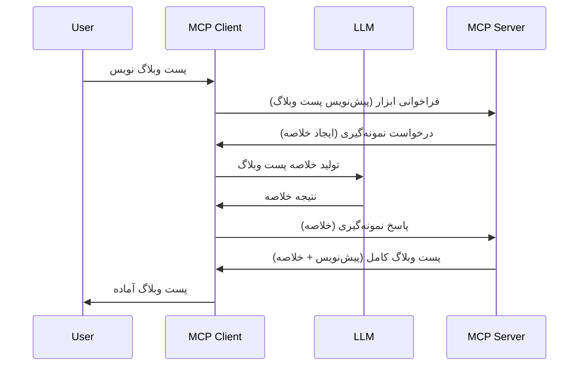

> [!WARNING]
> نمونه‌برداری در MCP `2026-07-28` منسوخ شده است. این درس برای
> پیاده‌سازی‌های قدیمی حفظ شده است. سرورهای جدید باید مستقیماً با API
> ارائه‌دهنده LLM یکپارچه شوند.

# نمونه‌برداری - واگذاری ویژگی‌ها به مشتری

> نمونه‌برداری در مشخصات `2026-07-28` برای سازگاری باقی مانده است و
> ممکن است در اولین بازنگری که در یا پس از ۲۸ جولای ۲۰۲۷ منتشر شود حذف شود.
> مثال‌های این درس ممکن است از APIهای SDK استفاده کنند که `2025-11-25` را پیاده‌سازی می‌کنند.
> ببینید [چه چیزهایی در MCP تغییر کرده است: مشخصات ۲۰۲۶-۰۷-۲۸](../../01-CoreConcepts/mcp-2026-07-28.md).

در پیاده‌سازی‌های قدیمی، نمونه‌برداری اجازه می‌دهد سرور MCP برای کمک از یک LLM
که توسط مشتری مدیریت می‌شود درخواست کند. برای پیاده‌سازی‌های جدید، به‌طور مستقیم با
ارائه‌دهنده LLM انتخاب‌شده تماس بگیرید.

بیایید برخی موارد استفاده را بررسی کنیم و ببینیم چگونه یک راه‌حل شامل نمونه‌برداری بسازیم.

## مرور کلی

در این درس، بر توضیح اینکه چه زمانی و کجا از نمونه‌برداری استفاده کنیم و چگونه آن را پیکربندی کنیم تمرکز داریم.

## اهداف یادگیری

در این فصل، ما:

- توضیح می‌دهیم نمونه‌برداری چیست و چه زمانی باید استفاده شود.
- نشان می‌دهیم چگونه نمونه‌برداری را در MCP پیکربندی کنیم.
- نمونه‌هایی از نمونه‌برداری در عمل ارائه می‌دهیم.

## نمونه‌برداری چیست و چرا باید از آن استفاده کرد؟

نمونه‌برداری یک ویژگی پیشرفته است که به صورت زیر کار می‌کند:



### درخواست نمونه‌برداری

خوب، حالا که یک دید کلی از یک سناریوی معتبر داریم، بیایید درباره درخواست نمونه‌برداری که سرور به مشتری ارسال می‌کند صحبت کنیم. چنین درخواستی می‌تواند به شکل زیر در قالب JSON-RPC باشد:

```json
{
  "jsonrpc": "2.0",
  "id": 1,
  "method": "sampling/createMessage",
  "params": {
    "messages": [
      {
        "role": "user",
        "content": {
          "type": "text",
          "text": "Create a blog post summary of the following blog post: <BLOG POST>"
        }
      }
    ],
    "modelPreferences": {
      "hints": [
        {
          "name": "claude-3-sonnet"
        }
      ],
      "intelligencePriority": 0.8,
      "speedPriority": 0.5
    },
    "systemPrompt": "You are a helpful assistant.",
    "maxTokens": 100
  }
}
```

چند نکته در اینجا ارزش ذکر دارد:

- Prompt، زیر content -> text، دستور ما برای LLM است تا محتوای پست وبلاگ را خلاصه کند.

- **modelPreferences**. این بخش فقط یک ترجیح است، توصیه‌ای برای کدام پیکربندی با LLM استفاده شود. کاربر می‌تواند این توصیه‌ها را قبول کند یا تغییر دهد. در این مورد توصیه‌هایی درباره مدل، سرعت و اولویت هوشمندی وجود دارد.
- **systemPrompt**، این همان پیام سیستم معمولی است که شخصیت به LLM شما می‌دهد و شامل دستورالعمل‌های راهنما است.
- **maxTokens**، این ویژگی برای مشخص کردن تعداد توکنی است که توصیه می‌شود برای این کار استفاده شود.

### پاسخ نمونه‌برداری

این پاسخ همان چیزی است که MCP Client در نهایت به MCP Server می‌فرستد و نتیجه تماس مشتری با LLM، انتظار برای دریافت پاسخ و سپس ساخت این پیام است. چنین پاسخی می‌تواند به شکل زیر در JSON-RPC باشد:

```json
{
  "jsonrpc": "2.0",
  "id": 1,
  "result": {
    "role": "assistant",
    "content": {
      "type": "text",
      "text": "Here's your abstract <ABSTRACT>"
    },
    "model": "gpt-5",
    "stopReason": "endTurn"
  }
}
```

توجه کنید که پاسخ خلاصه پست وبلاگ است همانطور که درخواست کردیم. همچنین توجه کنید که مدل استفاده شده "gpt-5" است نه همان مدلی که خواستیم "claude-3-sonnet". این نشان می‌دهد که کاربر می‌تواند نظرش را درباره انتخاب مدل تغییر دهد و درخواست نمونه‌برداری شما فقط یک توصیه است.

حالا که جریان اصلی را فهمیدیم، و استفاده مفیدی برای آن "ساخت پست وبلاگ + خلاصه" دیدیم، بیایید ببینیم چه کارهایی برای راه‌اندازی آن لازم است انجام دهیم.

### نوع پیام‌ها

پیام‌های نمونه‌برداری محدود به متن نیستند بلکه شما می‌توانید تصاویر و صدا نیز بفرستید. اینجا شکل JSON-RPC متفاوت است:

**متن**

```json
{
  "type": "text",
  "text": "The message content"
}
```

**محتوای تصویر**

```json
{
  "type": "image",
  "data": "base64-encoded-image-data",
  "mimeType": "image/jpeg"
}
```

**محتوای صوتی**

```json
{
  "type": "audio",
  "data": "base64-encoded-audio-data",
  "mimeType": "audio/wav"
}
```

> NOTE: برای وضعیت فعلی و راهنمای مهاجرت، به
> [مستندات نمونه‌برداری منسوخ‌شده](https://modelcontextprotocol.io/specification/2026-07-28/client/sampling) مراجعه کنید.

## چگونه نمونه‌برداری را در مشتری پیکربندی کنیم

> توجه: اگر فقط در حال ساخت سرور هستید، نیازی نیست کار زیادی اینجا انجام دهید.

در یک مشتری، باید ویژگی زیر را اینگونه مشخص کنید:

```json
{
  "capabilities": {
    "sampling": {}
  }
}
```

سپس این هنگام مقداردهی اولیه مشتری انتخاب‌شده شما با سرور دریافت خواهد شد.

## مثال عملی نمونه‌برداری - ساخت یک پست وبلاگ

بیایید با هم یک سرور نمونه‌برداری بنویسیم، ما باید اقدامات زیر را انجام دهیم:

1. ابزار را روی سرور بسازیم.
1. آن ابزار باید یک درخواست نمونه‌برداری ایجاد کند.
1. ابزار باید منتظر پاسخ درخواست نمونه‌برداری مشتری بماند.
1. سپس نتیجه ابزار تولید شود.

بیایید کد را گام به گام ببینیم:

### -1- ساخت ابزار

**python**

```python
@mcp.tool()
async def create_blog(title: str, content: str, ctx: Context[ServerSession, None]) -> str:
    """Create a blog post and generate a summary"""

```

### -2- ایجاد درخواست نمونه‌برداری

ابزار خود را با کد زیر گسترش دهید:

**python**

```python
post = BlogPost(
        id=len(posts) + 1,
        title=title,
        content=content,
        abstract=""
    )

prompt = f"Create an abstract of the following blog post: title: {title} and draft: {content} "

result = await ctx.session.create_message(
        messages=[
            SamplingMessage(
                role="user",
                content=TextContent(type="text", text=prompt),
            )
        ],
        max_tokens=100,
)

```

### -3- انتظار برای پاسخ و بازگشت پاسخ

**python**

```python
post.abstract = result.content.text

posts.append(post)

# محصول کامل را بازگردانید
return json.dumps({
    "id": post.title,
    "abstract": post.abstract
})
```

### -4- کد کامل

**python**

```python
from starlette.applications import Starlette
from starlette.routing import Mount, Host

from mcp.server.fastmcp import Context, FastMCP

from mcp.server.session import ServerSession
from mcp.types import SamplingMessage, TextContent

import json


from uuid import uuid4
from typing import List
from pydantic import BaseModel


mcp = FastMCP("Blog post generator")

# اپلیکیشن = FastAPI()

posts = []

class BlogPost(BaseModel):
    id: int
    title: str
    content: str
    abstract: str

posts: List[BlogPost] = []

@mcp.tool()
async def create_blog(title: str, content: str, ctx: Context[ServerSession, None]) -> str:
    """Create a blog post and generate a summary"""

    post = BlogPost(
        id=len(posts) + 1,
        title=title,
        content=content,
        abstract=""
    )

    prompt = f"Create an abstract of the following blog post: title: {title} and draft: {content} "

    result = await ctx.session.create_message(
        messages=[
            SamplingMessage(
                role="user",
                content=TextContent(type="text", text=prompt),
            )
        ],
        max_tokens=100,
    )

    post.abstract = result.content.text

    posts.append(post)

    # بازگرداندن پست کامل وبلاگ
    return json.dumps({
        "id": post.title,
        "abstract": post.abstract
    })

if __name__ == "__main__":
    print("Starting server...")
    # mcp.run()
    mcp.run(transport="streamable-http")

# اجرای اپلیکیشن با: python server.py
```

### -5- تست در Visual Studio Code

برای تست این در Visual Studio Code، مراحل زیر را انجام دهید:

1. سرور را در ترمینال راه‌اندازی کنید
1. آن را به *mcp.json* اضافه کنید (و اطمینان حاصل کنید که راه‌اندازی شده است) مثلا چیزی شبیه به:

   ```json
   "servers": {
      "blog-server": {
        "type": "http",
        "url": "http://localhost:8000/mcp"
      }
   }
   ```

1. یک پرسش تایپ کنید:

   ```text
   create a blog post named "Where Python comes from", the content is "Python is actually named after Monty Python Flying Circus"
   ```

1. اجازه دهید نمونه‌برداری انجام شود. اولین بار که این را تست می‌کنید یک دیالوگ اضافی نمایش داده می‌شود که باید قبول کنید، سپس دیالوگ معمول برای درخواست اجرای یک ابزار نمایش داده می‌شود.

1. نتایج را بررسی کنید. نتایج هم به صورت زیبا در GitHub Copilot Chat نمایش داده می‌شود و هم می‌توانید پاسخ JSON خام را مشاهده کنید.

**پاداش**. ابزارهای Visual Studio Code پشتیبانی عالی از نمونه‌برداری دارند. می‌توانید دسترسی نمونه‌برداری را در سرور نصب‌شده خود اینگونه پیکربندی کنید:

1. به بخش افزونه‌ها بروید.
1. آیکون چرخ‌دنده سرور نصب شده خود را در بخش "MCP SERVERS - INSTALLED" انتخاب کنید.
1 "Configure Model Access" را انتخاب کنید، در اینجا می‌توانید مشخص کنید GitHub Copilot هنگام نمونه‌برداری می‌تواند از کدام مدل‌ها استفاده کند. همچنین می‌توانید همه درخواست‌های نمونه‌برداری اخیر را با انتخاب "Show Sampling requests" ببینید.

## تمرین

در این تمرین، شما نمونه‌برداری کمی متفاوتی یعنی یک انتگراسیون نمونه‌برداری که تولید توضیحات محصول را پشتیبانی می‌کند، خواهید ساخت. سناریوی شما به این شکل است:

**سناریو**: کارمند بخش پشتیبانی در یک فروشگاه اینترنتی به کمک نیاز دارد، تولید توضیحات محصول بسیار وقت‌گیر است. بنابراین باید راه‌حلی بسازید که بتوانید با فراخوانی ابزاری به نام "create_product" با آرگومان‌های "title" و "keywords"، یک محصول کامل شامل فیلد "description" تولید کند که این فیلد باید توسط LLM مشتری پر شود.

نکته: از آنچه قبلاً یاد گرفتید استفاده کنید تا این سرور و ابزار آن را با استفاده از درخواست نمونه‌برداری بسازید.

## راه‌حل

[راه‌حل](./solution/README.md)

## نکات کلیدی

نمونه‌برداری یک ویژگی قدرتمند است که اجازه می‌دهد سرور کارها را به مشتری واگذار کند وقتی به کمک یک LLM نیاز دارد.

## مرحله بعدی

- [فصل ۴ - پیاده‌سازی عملی](../../04-PracticalImplementation/README.md)

---

<!-- CO-OP TRANSLATOR DISCLAIMER START -->
**سلب مسئولیت**:
این سند با استفاده از سرویس ترجمه هوش مصنوعی [Co-op Translator](https://github.com/Azure/co-op-translator) ترجمه شده است. در حالی که ما در تلاش برای دقت هستیم، لطفاً توجه داشته باشید که ترجمه‌های خودکار ممکن است شامل خطاها یا نادرستی‌هایی باشند. سند اصلی به زبان مادری خود باید به عنوان منبع معتبر در نظر گرفته شود. برای اطلاعات حیاتی، ترجمه حرفه‌ای انسانی توصیه می‌شود. ما در قبال هرگونه سوء تفاهم یا برداشت نادرست ناشی از استفاده از این ترجمه مسئولیتی نداریم.
<!-- CO-OP TRANSLATOR DISCLAIMER END -->