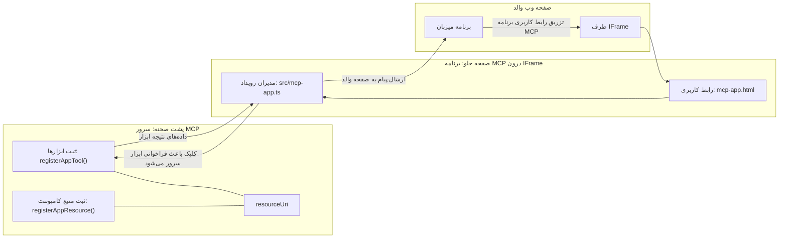
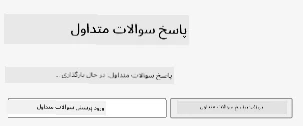
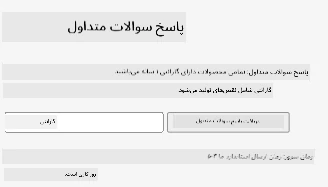
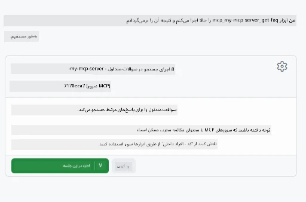

# برنامه‌های MCP

برنامه‌های MCP یک پارادایم جدید در MCP هستند. ایده این است که نه تنها با داده‌ها به تماس ابزار پاسخ می‌دهید، بلکه اطلاعاتی درباره چگونگی تعامل با این اطلاعات نیز ارائه می‌دهید. این بدان معناست که نتایج ابزار اکنون می‌توانند شامل اطلاعات رابط کاربری باشند. اما چرا بخواهیم این کار را انجام دهیم؟ خب، تصور کنید امروزه چگونه کار می‌کنید. شما احتمالاً نتایج یک MCP Server را با قراردادن نوعی رابط کاربری جلو آن مصرف می‌کنید، که کدی است که باید بنویسید و نگهداری کنید. گاهی اوقات این چیزی است که می‌خواهید، اما گاهی اوقات عالی است که بتوانید فقط یک قطعه اطلاعات خودکفا بیاورید که همه چیز را از داده تا رابط کاربری دارد.

## نمای کلی

این درس راهنمایی‌های عملی در مورد برنامه‌های MCP، نحوه شروع و نحوه یکپارچه‌سازی آن‌ها در برنامه‌های وب موجود شما ارائه می‌دهد. برنامه‌های MCP یک افزودنی بسیار جدید به استاندارد MCP هستند.

## اهداف یادگیری

تا پایان این درس، قادر خواهید بود:

- توضیح دهید برنامه‌های MCP چیستند.
- زمان استفاده از برنامه‌های MCP را تشخیص دهید.
- برنامه‌های MCP خود را بسازید و یکپارچه کنید.

## برنامه‌های MCP - چگونه کار می‌کند

ایده برنامه‌های MCP این است که پاسخی ارائه دهند که اساساً یک کامپوننت برای رندر کردن باشد. چنین کامپوننتی می‌تواند هم بصری و هم تعاملی باشد، مثلاً کلیک دکمه‌ها، ورودی کاربر و غیره. بیایید با سمت سرور و MCP Server شروع کنیم. برای ایجاد یک کامپوننت برنامه MCP، باید هم یک ابزار و هم منبع برنامه را ایجاد کنید. این دو نیمه با resourceUri به هم متصل می‌شوند.

در اینجا مثالی است. بیایید سعی کنیم آنچه درگیر است و هر بخش چه کاری انجام می‌دهد را نمایان کنیم:

```text
server.ts -- responsible for registering tools and the component as a UI component
src/
  mcp-app.ts -- wiring up event handlers
mcp-app.html -- the user interface
```

این تصویر معماری ایجاد یک کامپوننت و منطق آن را توضیح می‌دهد.


بیایید بعداً مسئولیت‌ها را برای Backend و Frontend به ترتیب شرح دهیم.

### سمت Backend

دو چیز باید اینجا انجام شود:

- ثبت ابزارهایی که می‌خواهیم با آن‌ها تعامل داشته باشیم.
- تعریف کامپوننت.

**ثبت ابزار**

```typescript
registerAppTool(
    server,
    "get-time",
    {
      title: "Get Time",
      description: "Returns the current server time.",
      inputSchema: {},
      _meta: { ui: { resourceUri } }, // این ابزار را به منبع رابط کاربری آن متصل می‌کند
    },
    async () => {
      const time = new Date().toISOString();
      return { content: [{ type: "text", text: time }] };
    },
  );

```

کد بالا رفتار را توصیف می‌کند، جایی که ابزاری به نام `get-time` ارائه می‌دهد. این ابزار ورودی ندارد اما در نهایت زمان فعلی را تولید می‌کند. ما توانایی تعریف یک `inputSchema` برای ابزارهایی که باید ورودی کاربر را بپذیرند داریم.

**ثبت کامپوننت**

در همان فایل، باید کامپوننت را نیز ثبت کنیم:

```typescript
const resourceUri = "ui://get-time/mcp-app.html";

// منبع را ثبت کنید، که HTML/جاوااسکریپت بسته‌بندی شده برای رابط کاربری را بازمی‌گرداند.
registerAppResource(
  server,
  resourceUri,
  resourceUri,
  { mimeType: RESOURCE_MIME_TYPE },
  async () => {
    const html = await fs.readFile(path.join(DIST_DIR, "mcp-app.html"), "utf-8");

    return {
    contents: [
        { uri: resourceUri, mimeType: RESOURCE_MIME_TYPE, text: html },
    ],
    };
  },
);
```

توجه کنید که چگونه از `resourceUri` برای اتصال کامپوننت به ابزارهایش استفاده می‌شود. همچنین callbackی که فایل UI را بارگذاری کرده و کامپوننت را بازمی‌گرداند، جالب است.

### سمت Frontend کامپوننت

مانند Backend، دو بخش وجود دارد:

- یک فرانت‌اند نوشته شده با HTML خالص.
- کدی که رویدادها را مدیریت می‌کند و تعیین می‌کند چه کاری انجام شود، مثلاً فراخوانی ابزارها یا ارسال پیام به پنجره والد.

**رابط کاربری**

بیایید نگاهی به رابط کاربری بیندازیم.

```html
<!-- mcp-app.html -->
<!DOCTYPE html>
<html lang="en">
  <head>
    <meta charset="UTF-8" />
    <title>Get Time App</title>
  </head>
  <body>
    <p>
      <strong>Server Time:</strong> <code id="server-time">Loading...</code>
    </p>
    <button id="get-time-btn">Get Server Time</button>
    <script type="module" src="/src/mcp-app.ts"></script>
  </body>
</html>
```

**وصل کردن رویدادها**

آخرین بخش وصل کردن رویدادها است. این یعنی تشخیص اینکه کدام بخش در UI ما نیاز به هندلرهای رویداد دارد و اگر رویدادی ایجاد شود چه کار باید کرد:

```typescript
// mcp-app.ts

import { App } from "@modelcontextprotocol/ext-apps";

// گرفتن ارجاعات عناصر
const serverTimeEl = document.getElementById("server-time")!;
const getTimeBtn = document.getElementById("get-time-btn")!;

// ساخت نمونه اپلیکیشن
const app = new App({ name: "Get Time App", version: "1.0.0" });

// پردازش نتایج ابزار از سرور. قبل از `app.connect()` تنظیم شود تا از
// از دست رفتن نتیجه اولیه ابزار جلوگیری شود.
app.ontoolresult = (result) => {
  const time = result.content?.find((c) => c.type === "text")?.text;
  serverTimeEl.textContent = time ?? "[ERROR]";
};

// اتصال کلیک دکمه
getTimeBtn.addEventListener("click", async () => {
  // `app.callServerTool()` اجازه می‌دهد UI داده‌های تازه را از سرور درخواست کند
  const result = await app.callServerTool({ name: "get-time", arguments: {} });
  const time = result.content?.find((c) => c.type === "text")?.text;
  serverTimeEl.textContent = time ?? "[ERROR]";
});

// اتصال به میزبان
app.connect();
```

همانطور که از کد بالا می‌بینید، این کد عادی برای وصل کردن عناصر DOM به رویدادهاست. شایان ذکر است که فراخوانی `callServerTool` که باعث فراخوانی ابزاری در سمت Backend می‌شود.

## مدیریت ورودی کاربر

تا الآن، ما یک کامپوننت دیده‌ایم که دارای دکمه‌ای است که با کلیک کردن آن ابزاری فراخوانی می‌شود. بگذارید ببینیم آیا می‌توانیم اجزای UI بیشتری مانند یک فیلد ورودی اضافه کنیم و ببینیم آیا می‌توانیم آرگومان‌هایی به یک ابزار ارسال کنیم. بیایید یک قابلیت FAQ پیاده‌سازی کنیم. نحوه کار باید به این صورت باشد:

- باید یک دکمه و یک المان ورودی باشد که کاربر برای جستجو یک کلمه کلیدی مثلاً "Shipping" را تایپ کند. این باید ابزاری در سمت Backend را فراخوانی کند که در داده‌های سوالات متداول (FAQ) جستجو انجام می‌دهد.
- ابزاری که از جستجوی FAQ ذکر شده پشتیبانی کند.

ابتدا پشتیبانی لازم را در Backend اضافه کنیم:

```typescript
const faq: { [key: string]: string } = {
    "shipping": "Our standard shipping time is 3-5 business days.",
    "return policy": "You can return any item within 30 days of purchase.",
    "warranty": "All products come with a 1-year warranty covering manufacturing defects.",
  }

registerAppTool(
    server,
    "get-faq",
    {
      title: "Search FAQ",
      description: "Searches the FAQ for relevant answers.",
      inputSchema: zod.object({
        query: zod.string().default("shipping"),
      }),
      _meta: { ui: { resourceUri: faqResourceUri } }, // این ابزار را به منبع رابط کاربری آن متصل می‌کند
    },
    async ({ query }) => {
      const answer: string = faq[query.toLowerCase()] || "Sorry, I don't have an answer for that.";
      return { content: [{ type: "text", text: answer }] };
    },
  );
```

آنچه اینجا می‌بینید نحوه پر کردن `inputSchema` و دادن یک اسکیما `zod` شبیه به این است:

```typescript
inputSchema: zod.object({
  query: zod.string().default("shipping"),
})
```

در اسکیما بالا اعلام می‌کنیم که یک پارامتر ورودی به نام `query` داریم که اختیاری است و مقدار پیش‌فرض "shipping" است.

خوب، بیایید به *mcp-app.html* برویم تا ببینیم چه UI باید بسازیم:

```html
<div class="faq">
    <h1>FAQ response</h1>
    <p>FAQ Response: <code id="faq-response">Loading...</code></p>
    <input type="text" id="faq-query" placeholder="Enter FAQ query" />
    <button id="get-faq-btn">Get FAQ Response</button>
  </div>
```

عالی، حالا یک المان ورودی و دکمه داریم. بیایید به *mcp-app.ts* برویم تا این رویدادها را وصل کنیم:

```typescript
const getFaqBtn = document.getElementById("get-faq-btn")!;
const faqQueryInput = document.getElementById("faq-query") as HTMLInputElement;

getFaqBtn.addEventListener("click", async () => {
  const query = faqQueryInput.value;
  const result = await app.callServerTool({ name: "get-faq", arguments: { query } });
  const faq = result.content?.find((c) => c.type === "text")?.text;
  faqResponseEl.textContent = faq ?? "[ERROR]";
});
```

در کد بالا ما:

- مراجع به المان‌های UI جالب را ایجاد می‌کنیم.
- کلیک دکمه را مدیریت می‌کنیم تا مقدار المان ورودی را استخراج کنیم و همچنین `app.callServerTool()` را با `name` و `arguments` فراخوانی می‌کنیم که در آن پارامتر `query` ارسال می‌شود.

در واقع زمانی که `callServerTool` فراخوانی می‌شود، پیامی به پنجره والد ارسال می‌کند و آن پنجره در نهایت MCP Server را فراخوانی می‌کند.

### امتحان کنید

با امتحان این باید موارد زیر را ببینیم:



و اینجا هنگام وارد کردن داده‌ای مانند "warranty" است



برای اجرای این کد، به [بخش کد](./code/README.md) مراجعه کنید.

## تست در Visual Studio Code

Visual Studio Code پشتیبانی عالی برای برنامه‌های MCP دارد و احتمالاً یکی از آسان‌ترین روش‌ها برای تست برنامه‌های MCP شما است. برای استفاده از Visual Studio Code، یک ورودی سرور به *mcp.json* اضافه کنید به شکل زیر:

```json
"my-mcp-server-7178eca7": {
    "url": "http://localhost:3001/mcp",
    "type": "http"
  }
```

سپس سرور را شروع کنید، باید بتوانید از طریق پنجره چت با برنامه MVP خود ارتباط برقرار کنید به شرطی که GitHub Copilot نصب شده باشد.

با فعال کردن از طریق پرامپت، مثلاً "#get-faq":



و درست مانند زمانی که از طریق مرورگر اجرا کردید، همانند آن به صورت UI رندر می‌شود:


## تمرین

یک بازی سنگ-کاغذ-قیچی ایجاد کنید. باید شامل موارد زیر باشد:

رابط کاربری:

- یک فهرست کشویی با گزینه‌ها
- یک دکمه برای ارسال انتخاب
- یک برچسب که نشان دهد چه کسی چه انتخابی کرده و چه کسی برنده شده است

سرور:

- باید ابزاری برای سنگ-کاغذ-قیچی داشته باشد که ورودی "choice" را بپذیرد. همچنین باید انتخاب کامپیوتر را رندر کند و برنده را تعیین کند.

## راه‌حل

[راه‌حل](./assignment/README.md)

## خلاصه

ما درباره پارادایم جدید برنامه‌های MCP آموختیم. این یک پارادایم جدید است که به MCP Servers اجازه می‌دهد نه تنها درباره داده بلکه درباره چگونگی ارائه این داده نیز نظر داشته باشند.

علاوه بر این، یاد گرفتیم که این برنامه‌های MCP در یک IFrame میزبانی می‌شوند و برای ارتباط با MCP Serverها، باید پیام‌ها را به برنامه وب والد ارسال کنند. کتابخانه‌های مختلفی برای جاوا اسکریپت ساده و React و غیره وجود دارد که این ارتباط را آسان‌تر می‌کند.

## نکات کلیدی

آنچه یاد گرفتید:

- برنامه‌های MCP یک استاندارد جدید است که می‌تواند زمانی که می‌خواهید داده‌ها و قابلیت‌های UI را همزمان تحویل دهید مفید باشد.
- این نوع برنامه‌ها به دلایل امنیتی در یک IFrame اجرا می‌شوند.

## مرحله بعد

- [فصل 4](../../04-PracticalImplementation/README.md)

---

<!-- CO-OP TRANSLATOR DISCLAIMER START -->
**توجه**:  
این سند با استفاده از سرویس ترجمه هوش مصنوعی [Co-op Translator](https://github.com/Azure/co-op-translator) ترجمه شده است. با اینکه ما تلاش می‌کنیم دقت بالایی داشته باشیم، لطفاً آگاه باشید که ترجمه‌های خودکار ممکن است حاوی اشتباهات یا نواقص باشند. سند اصلی به زبان بومی خود باید به عنوان منبع معتبر در نظر گرفته شود. برای اطلاعات حیاتی، ترجمه حرفه‌ای انسانی توصیه می‌شود. ما مسئول هیچگونه سوء تفاهم یا تفسیر نادرستی که از استفاده این ترجمه ناشی شود، نیستیم.
<!-- CO-OP TRANSLATOR DISCLAIMER END -->