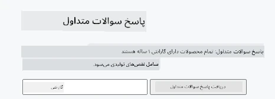
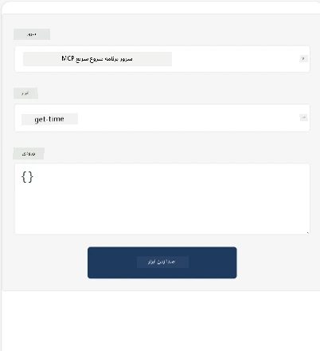
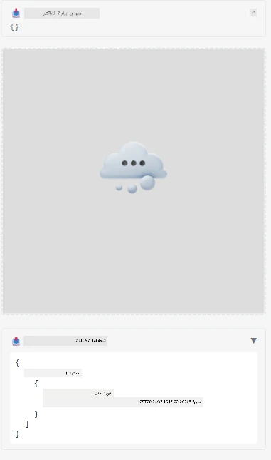

در اینجا یک نمونه که MCP App را نشان می‌دهد ارائه شده است

## نصب

1. به پوشه *mcp-app* بروید
1. اجرای `npm install` که وابستگی‌های فرانت‌اند و بک‌اند را نصب می‌کند

برای بررسی اینکه بک‌اند کامپایل می‌شود، دستور زیر را اجرا کنید:

```sh
npx tsc --noEmit
```

اگر همه چیز درست باشد، خروجی‌ای نخواهید دید.

## اجرای بک‌اند

> این کار اگر شما روی یک دستگاه ویندوزی هستید کمی اضافی است چون راه‌حل MCP Apps از کتابخانه `concurrently` استفاده می‌کند که باید جایگزینی برای آن پیدا کنید. در اینجا خط مشکل‌ساز در فایل *package.json* در MCP App آورده شده‌است:

    ```json
    "start": "concurrently \"cross-env NODE_ENV=development INPUT=mcp-app.html vite build --watch\" \"tsx watch main.ts\""
    ```

این اپلیکیشن از دو بخش تشکیل شده، یک بخش بک‌اند و یک بخش میزبان.

برای شروع بک‌اند، فرمان زیر را اجرا کنید:

```sh
npm start
```

این باید بک‌اند را در `http://localhost:3001/mcp` راه‌اندازی کند.

> توجه داشته باشید، اگر در Codespace هستید، ممکن است لازم باشد دسترسی پورت را به عمومی تغییر دهید. بررسی کنید که بتوانید از طریق https://<نام Codespace>.app.github.dev/mcp به نقطه انتهایی دسترسی داشته باشید

## انتخاب -1 تست برنامه در Visual Studio Code

برای تست راه‌حل در Visual Studio Code، کارهای زیر را انجام دهید:

- یک ورودی سرور به `mcp.json` اضافه کنید به شکل زیر:

    ```json
    {
        "servers": {
            "my-mcp-server-7178eca7": {
                "url": "http://localhost:3001/mcp",
                "type": "http"
            }
        },
        "inputs": []
    }
    ```

1. روی دکمه "start" در *mcp.json* کلیک کنید
1. مطمئن شوید یک پنجره چت باز است و دستور `get-faq` را تایپ کنید، باید نتیجه‌ای شبیه به تصویر زیر را ببینید:

    

## انتخاب -2- تست برنامه با یک میزبان

مخزن <https://github.com/modelcontextprotocol/ext-apps> چندین میزبان مختلف دارد که می‌توانید برای تست برنامه‌های MVP خود استفاده کنید.

در اینجا دو گزینه مختلف را ارائه می‌کنیم:

### دستگاه محلی

- پس از کلون کردن مخزن، به پوشه *ext-apps* بروید.

- وابستگی‌ها را نصب کنید

   ```sh
   npm install
   ```

- در یک ترمینال جداگانه، به *ext-apps/examples/basic-host* بروید

    > اگر در Codespace هستید، باید به فایل serve.ts و خط ۲۷ رفته و آدرس http://localhost:3001/mcp را با URL Codespace خود برای بک‌اند جایگزین کنید، مثلا https://psychic-xylophone-657rpjgvxpc5g64-3001.app.github.dev/mcp

- میزبان را اجرا کنید:

    ```sh
    npm start
    ```

    این باید میزبان را به بک‌اند متصل کند و باید برنامه را به این صورت اجرا شده ببینید:

    

### Codespace

راه‌اندازی محیط Codespace کمی اضافی است. برای استفاده از میزبان از طریق Codespace:

- پوشه *ext-apps* را باز کرده و به *examples/basic-host* بروید.
- دستور `npm install` را برای نصب وابستگی‌ها اجرا کنید
- دستور `npm start` را برای شروع میزبان اجرا کنید.

## تست برنامه

برنامه را به شکل زیر امتحان کنید:

- دکمه "Call Tool" را انتخاب کنید و باید نتایجی مانند تصویر زیر ببینید:

    

بسیار خوب، همه چیز کار می‌کند.

---

<!-- CO-OP TRANSLATOR DISCLAIMER START -->
**سلب مسئولیت**:  
این سند با استفاده از سرویس ترجمه ماشینی [Co-op Translator](https://github.com/Azure/co-op-translator) ترجمه شده است. در حالی که ما تلاش می‌کنیم تا دقت را حفظ کنیم، لطفاً توجه داشته باشید که ترجمه‌های خودکار ممکن است حاوی خطاها یا نواقصی باشند. سند اصلی به زبان بومی آن باید به عنوان منبع معتبر در نظر گرفته شود. برای اطلاعات حیاتی، ترجمه حرفه‌ای انسانی توصیه می‌شود. ما مسئولیتی در قبال هرگونه سوء تفاهم یا تعبیر نادرست ناشی از استفاده این ترجمه نداریم.
<!-- CO-OP TRANSLATOR DISCLAIMER END -->