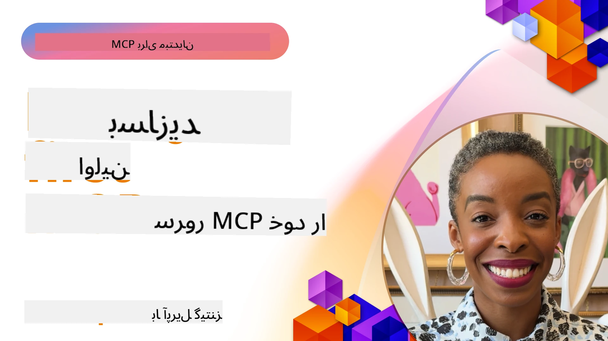

## شروع کار  

_(برای دیدن ویدیو این درس روی تصویر بالا کلیک کنید)_

این بخش شامل چندین درس است:

- **1 سرور اول شما**، در این درس اول، یاد خواهید گرفت چگونه سرور اول خود را بسازید و با ابزار Inspektor آن را بررسی کنید، روشی ارزشمند برای تست و اشکال‌زدایی سرور شما، [به درس](01-first-server/README.md)

- **2 کلاینت**، در این درس، یاد خواهید گرفت چگونه کلاینتی بنویسید که بتواند به سرور شما متصل شود، [به درس](02-client/README.md)

- **3 کلاینت با LLM**، روش بهتر نوشتن کلاینت افزودن LLM به آن است تا بتواند با سرور شما روی کارهای مختلف "مذاکره" کند، [به درس](03-llm-client/README.md)

- **4 مصرف حالت عامل GitHub Copilot سرور در Visual Studio Code**. در اینجا، به اجرای سرور MCP خود از داخل Visual Studio Code نگاه می‌کنیم، [به درس](04-vscode/README.md)

- **5 سرور حمل و نقل stdio** حمل و نقل stdio استاندارد توصیه شده برای ارتباط محلی سرور MCP به کلاینت است که ارتباط امن مبتنی بر فرآیند فرعی با جداسازی فرآیند داخلی ارائه می‌دهد [به درس](05-stdio-server/README.md)

- **6 پخش HTTP با MCP (HTTP قابل پخش)**. درباره حمل و نقل مدرن پخش HTTP (روش توصیه شده برای سرورهای از راه دور MCP طبق [مشخصات MCP 2025-11-25](https://spec.modelcontextprotocol.io/specification/2025-11-25/basic/transports/#streamable-http))، اطلاعیه‌های پیشرفت و چگونگی پیاده‌سازی سرورها و کلاینت‌های MCP مقیاس‌پذیر و بلادرنگ با استفاده از HTTP قابل پخش بیاموزید. [به درس](06-http-streaming/README.md)

- **7 استفاده از جعبه‌ابزار AI برای VSCode** برای مصرف و تست کلاینت‌ها و سرورهای MCP شما [به درس](07-aitk/README.md)

- **8 تست**. تمرکز ویژه اینجا روی چگونگی تست سرور و کلاینت به روش‌های مختلف است، [به درس](08-testing/README.md)

- **9 استقرار**. این فصل به بررسی راه‌های مختلف استقرار راه‌حل‌های MCP شما می‌پردازد، [به درس](09-deployment/README.md)

- **10 استفاده پیشرفته از سرور**. این فصل استفاده پیشرفته از سرور را پوشش می‌دهد، [به درس](./10-advanced/README.md)

- **11 احراز هویت**. این فصل نحوه افزودن احراز هویت ساده، از Basic Auth تا استفاده از JWT و RBAC را پوشش می‌دهد. توصیه می‌شود از اینجا شروع کنید و سپس به موضوعات پیشرفته در فصل ۵ نگاهی بیندازید و سخت‌سازی امنیتی اضافی را طبق توصیه‌های فصل ۲ انجام دهید، [به درس](./11-simple-auth/README.md)

- **12 میزبان‌های MCP**. پیکربندی و استفاده از کلاینت‌های محبوب میزبان MCP شامل Claude Desktop، Cursor، Cline، و Windsurf. یادگیری انواع حمل و نقل و عیب‌یابی، [به درس](./12-mcp-hosts/README.md)

- **13 Inspektor MCP**. اشکال‌زدایی و تست تعاملی سرورهای MCP شما با ابزار Inspektor MCP. یادگیری عیب‌یابی ابزارها، منابع و پیام‌های پروتکل، [به درس](./13-mcp-inspector/README.md)

- **14 نمونه‌برداری**. ساخت سرورهای MCP که با کلاینت‌های MCP روی وظایف مرتبط با LLM همکاری می‌کنند. [به درس](./14-sampling/README.md)

- **15 برنامه‌های MCP**. ساخت سرورهای MCP که همچنین با دستورالعمل‌های رابط کاربری پاسخ می‌دهند، [به درس](./15-mcp-apps/README.md)

پروتکل زمینه مدل (MCP) یک پروتکل باز است که استانداردسازی می‌کند چگونه برنامه‌ها زمینه را به LLM‌ها ارائه می‌دهند. MCP را مانند یک درگاه USB-C برای برنامه‌های هوش مصنوعی تصور کنید - روشی استاندارد برای اتصال مدل‌های هوش مصنوعی به منابع داده و ابزارهای مختلف فراهم می‌کند.

## اهداف یادگیری

تا پایان این درس، قادر خواهید بود:

- راه‌اندازی محیط‌های توسعه برای MCP در C#، جاوا، پایتون، تایپ‌اسکریپت و جاوااسکریپت
- ساخت و استقرار سرورهای پایه MCP با ویژگی‌های سفارشی (منابع، پرامپت‌ها و ابزارها)
- ایجاد برنامه‌های میزبان که به سرورهای MCP متصل می‌شوند
- تست و اشکال‌زدایی پیاده‌سازی‌های MCP
- درک چالش‌های رایج راه‌اندازی و راه‌حل‌های آن‌ها
- اتصال پیاده‌سازی‌های MCP خود به سرویس‌های محبوب LLM

## راه‌اندازی محیط MCP شما

قبل از شروع کار با MCP، آماده‌سازی محیط توسعه و درک جریان کاری پایه اهمیت دارد. این بخش شما را در مراحل اولیه راه‌اندازی همراهی می‌کند تا شروعی روان با MCP داشته باشید.

### پیش‌نیازها

قبل از ورود به توسعه MCP، اطمینان حاصل کنید که دارید:

- **محیط توسعه**: برای زبان انتخابی شما (C#، جاوا، پایتون، تایپ‌اسکریپت یا جاوااسکریپت)
- **محیط توسعه/ویرایشگر**: Visual Studio، Visual Studio Code، IntelliJ، Eclipse، PyCharm یا هر ویرایشگر کد مدرن دیگر
- **مدیر بسته‌ها**: NuGet، Maven/Gradle، pip، یا npm/yarn
- **کلیدهای API**: برای هر سرویس هوش مصنوعی که قصد استفاده در برنامه‌های میزبان خود دارید

### کیت‌های توسعه نرم‌افزار رسمی

در فصل‌های پیش رو راه‌حل‌هایی را با استفاده از پایتون، تایپ‌اسکریپت، جاوا و .NET خواهید دید. در اینجا همه SDKهای رسمی پشتیبانی شده آورده شده است.

MCP کیت‌های توسعه (SDK) رسمی برای چند زبان فراهم می‌کند (مطابق با [مشخصات MCP 2025-11-25](https://spec.modelcontextprotocol.io/specification/2025-11-25/)):
- [SDK سی‌شارپ](https://github.com/modelcontextprotocol/csharp-sdk) - نگهداری شده با همکاری مایکروسافت
- [SDK جاوا](https://github.com/modelcontextprotocol/java-sdk) - نگهداری شده با همکاری Spring AI
- [SDK تایپ‌اسکریپت](https://github.com/modelcontextprotocol/typescript-sdk) - پیاده‌سازی رسمی تایپ‌اسکریپت
- [SDK پایتون](https://github.com/modelcontextprotocol/python-sdk) - پیاده‌سازی رسمی پایتون (FastMCP)
- [SDK کاتلین](https://github.com/modelcontextprotocol/kotlin-sdk) - پیاده‌سازی رسمی کاتلین
- [SDK سوئیفت](https://github.com/modelcontextprotocol/swift-sdk) - نگهداری شده با همکاری Loopwork AI
- [SDK راست](https://github.com/modelcontextprotocol/rust-sdk) - پیاده‌سازی رسمی راست
- [SDK گو](https://github.com/modelcontextprotocol/go-sdk) - پیاده‌سازی رسمی گو

## نکات کلیدی

- راه‌اندازی محیط توسعه MCP با SDKهای مخصوص زبان آسان است
- ساخت سرورهای MCP شامل ایجاد و ثبت ابزارها با طرح‌واره‌های واضح است
- کلاینت‌های MCP به سرورها و مدل‌ها متصل می‌شوند تا قابلیت‌های گسترش یافته را بهره‌مند شوند
- تست و اشکال‌زدایی برای پیاده‌سازی‌های قابل اعتماد MCP ضروری است
- گزینه‌های استقرار از توسعه محلی تا راه‌حل‌های ابری متغیر است

## تمرین

ما مجموعه‌ای از نمونه‌ها داریم که تمرین‌های ارائه شده در همه فصل‌های این بخش را تکمیل می‌کند. علاوه بر این، هر فصل تمرین‌ها و تکالیف مخصوص خود را نیز دارد.

- [ماشین حساب جاوا](./samples/java/calculator/README.md)
- [ماشین حساب .Net](../../../03-GettingStarted/samples/csharp)
- [ماشین حساب جاوااسکریپت](./samples/javascript/README.md)
- [ماشین حساب تایپ‌اسکریپت](./samples/typescript/README.md)
- [ماشین حساب پایتون](../../../03-GettingStarted/samples/python)

## منابع بیشتر

- [ساخت عامل‌ها با استفاده از پروتکل زمینه مدل در Azure](https://learn.microsoft.com/azure/developer/ai/intro-agents-mcp)
- [MCP از راه دور با Azure Container Apps (Node.js/TypeScript/JavaScript)](https://learn.microsoft.com/samples/azure-samples/mcp-container-ts/mcp-container-ts/)
- [عامل MCP OpenAI .NET](https://learn.microsoft.com/samples/azure-samples/openai-mcp-agent-dotnet/openai-mcp-agent-dotnet/)

## مرحله بعد

با درس اول شروع کنید: [ساخت اولین سرور MCP خود](01-first-server/README.md)

پس از اتمام این ماژول، ادامه دهید به: [ماژول ۴: پیاده‌سازی عملی](../04-PracticalImplementation/README.md)

---

<!-- CO-OP TRANSLATOR DISCLAIMER START -->
**سلب مسئولیت**:
این سند با استفاده از سرویس ترجمه هوش مصنوعی [Co-op Translator](https://github.com/Azure/co-op-translator) ترجمه شده است. در حالی که ما برای دقت تلاش می‌کنیم، لطفاً توجه داشته باشید که ترجمه‌های خودکار ممکن است حاوی اشتباهات یا نادرستی‌هایی باشند. سند اصلی به زبان مبدأ باید به عنوان منبع معتبر در نظر گرفته شود. برای اطلاعات حیاتی، استفاده از ترجمه حرفه‌ای انسانی توصیه می‌شود. ما مسئول هیچ گونه سوتفاهم یا تفسیر نادرستی که ناشی از استفاده از این ترجمه باشد، نمی‌باشیم.
<!-- CO-OP TRANSLATOR DISCLAIMER END -->