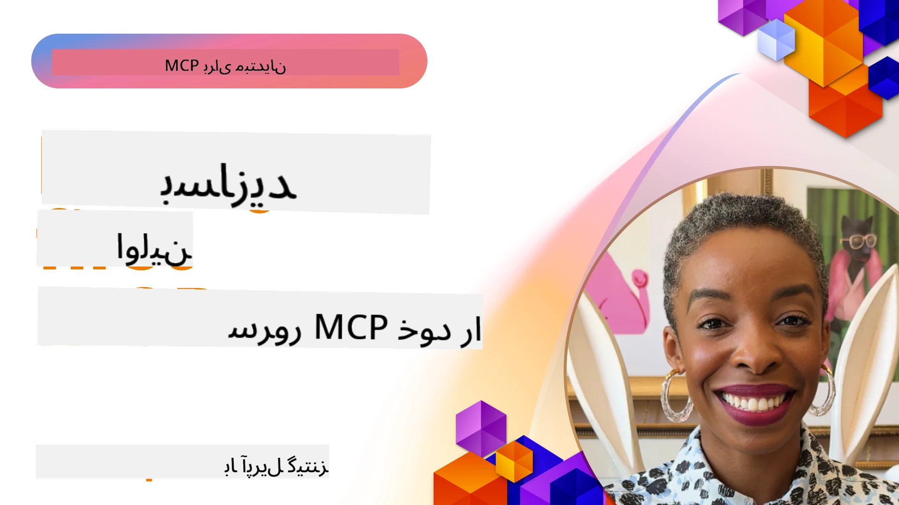

## شروع کار  

_(برای مشاهده ویدیوی این درس روی تصویر بالا کلیک کنید)_

این بخش شامل چندین درس است:

- **1 سرور اول شما**، در این درس اول، خواهید آموخت چگونه اولین سرور خود را ایجاد کرده و با ابزار بازرسی آن را بررسی کنید؛ روشی با ارزش برای آزمون و اشکال‌زدایی سرور شما، [به درس](01-first-server/README.md)

- **2 کلاینت**، در این درس خواهید آموخت چگونه یک کلاینت بنویسید که بتواند به سرور شما متصل شود، [به درس](02-client/README.md)

- **3 کلاینت با LLM**، راه بهتری برای نوشتن کلاینت اضافه کردن یک مدل زبان بزرگ (LLM) به آن است تا بتواند «مذاکره» کند با سرور شما درباره آنچه باید انجام شود، [به درس](03-llm-client/README.md)

- **4 استفاده از حالت عامل GitHub Copilot در Visual Studio Code**. در اینجا به اجرای سرور MCP خود درون Visual Studio Code نگاه می‌کنیم، [به درس](04-vscode/README.md)

- **5 سرور انتقال stdio** انتقال stdio استاندارد پیشنهادی برای ارتباط محلی سرور MCP به کلاینت است، که ارتباط امن مبتنی بر زیرفرآیند با جداسازی فرآیند داخلی را فراهم می‌کند [به درس](05-stdio-server/README.md)

- **6 پخش HTTP با MCP (پخش HTTP قابل استریم)**. درباره استاندارد
	انتقال از راه دور در [مشخصات MCP 2026-07-28](https://modelcontextprotocol.io/specification/2026-07-28/basic/transports/streamable-http) بیاموزید،
	و همچنین پیاده‌سازی قدیمی مبتنی بر نشست که در درس حفظ شده است.
	[به درس](06-http-streaming/README.md)

- **7 استفاده از جعبه‌ابزار AI برای VSCode** جهت مصرف و آزمایش کلاینت‌ها و سرورهای MCP خود [به درس](07-aitk/README.md)

- **8 آزمایش**. در اینجا به ویژه بر روی چگونگی آزمایش سرور و کلاینت خود به روش‌های مختلف تمرکز خواهیم کرد، [به درس](08-testing/README.md)

- **9 استقرار**. این فصل به راه‌های مختلف استقرار راه‌حل‌های MCP شما خواهد پرداخت، [به درس](09-deployment/README.md)

- **10 استفاده پیشرفته سرور**. این فصل به استفاده پیشرفته سرور می‌پردازد، [به درس](./10-advanced/README.md)

- **11 احراز هویت**. این فصل پوشش می‌دهد چگونه احراز هویت ساده اضافه کنید، از احراز هویت پایه تا استفاده از JWT و RBAC. توصیه می‌شود از اینجا شروع کنید و سپس به موضوعات پیشرفته در فصل 5 نگاه کنید و سخت‌سازی امنیتی اضافی را از طریق توصیه‌های فصل 2 انجام دهید، [به درس](./11-simple-auth/README.md)

- **12 میزبان‌های MCP**. پیکربندی و استفاده از کلاینت‌های میزبان محبوب MCP از جمله Claude Desktop، Cursor، Cline و Windsurf. درباره انواع انتقال و عیب‌یابی بیاموزید، [به درس](./12-mcp-hosts/README.md)

- **13 بازرس MCP**. اشکال‌زدایی و آزمایش سرورهای MCP خود را به صورت تعاملی با ابزار MCP Inspector انجام دهید. یاد بگیرید چگونه ابزارها، منابع و پیام‌های پروتکل را عیب‌یابی کنید، [به درس](./13-mcp-inspector/README.md)

- **14 نمونه‌برداری**. درباره نمونه‌برداری قدیمی در `2025-11-25` و
	چگونگی مهاجرت طراحی‌های جدید به یکپارچه‌سازی مستقیم ارائه‌دهنده LLM بیاموزید. نمونه‌برداری
	در MCP `2026-07-28` منسوخ شده است. [به درس](./14-sampling/README.md)

- **15 برنامه‌های MCP**. ساخت سرورهای MCP که همچنین با دستورالعمل‌های UI پاسخ می‌دهند، [به درس](./15-mcp-apps/README.md)

پروتکل زمینه مدل (MCP) یک پروتکل باز است که استانداردسازی می‌کند چگونه برنامه‌ها زمینه را به مدل‌های زبان بزرگ ارائه می‌دهند. MCP را مانند یک درگاه USB-C برای برنامه‌های هوش مصنوعی در نظر بگیرید - روشی استاندارد برای اتصال مدل‌های هوش مصنوعی به منابع داده و ابزارهای مختلف فراهم می‌کند.

## اهداف یادگیری

تا پایان این درس خواهید توانست:

- راه‌اندازی محیط‌های توسعه MCP در C#، Java، Python، TypeScript و JavaScript
- ساخت و استقرار سرورهای پایه MCP با ویژگی‌های سفارشی (منابع، اعلان‌ها و ابزارها)
- ایجاد برنامه‌های میزبان که به سرورهای MCP متصل می‌شوند
- آزمایش و اشکال‌زدایی پیاده‌سازی‌های MCP
- درک چالش‌ها و راه‌حل‌های رایج در راه‌اندازی
- اتصال پیاده‌سازی‌های MCP شما به خدمات محبوب LLM

## راه‌اندازی محیط MCP شما

پیش از شروع به کار با MCP، مهم است که محیط توسعه خود را آماده کرده و جریان کاری پایه را درک کنید. این بخش شما را در مراحل اولیه راه‌اندازی برای شروع روان با MCP راهنمایی خواهد کرد.

### پیش‌نیازها

پیش از شروع توسعه MCP، اطمینان حاصل کنید که دارید:

- **محیط توسعه**: برای زبان انتخابی شما (C#، Java، Python، TypeScript، یا JavaScript)
- **IDE/ویرایشگر**: Visual Studio، Visual Studio Code، IntelliJ، Eclipse، PyCharm، یا هر ویرایشگر کد مدرن دیگر
- **مدیریت بسته‌ها**: NuGet، Maven/Gradle، pip، یا npm/yarn
- **کلیدهای API**: برای هر سرویس هوش مصنوعی که قصد استفاده در برنامه‌های میزبان خود دارید

### کیت‌های توسعه رسمی

در فصل‌های آینده خواهید دید راه‌حل‌هایی با استفاده از Python، TypeScript،
Java و .NET ساخته شده‌اند. در اینجا کیت‌های توسعه رسمی آمده است.

پشتیبانی از SDK برای MCP `2026-07-28` به صورت مستقل توسط زبان در حال عرضه است.
پیش از اجرای یک نمونه، نسخه بسته آن و یادداشت‌های انتشار SDK را برای بررسی نسخه‌های پروتکل پشتیبانی شده بررسی کنید.
به
[فهرست رسمی SDK](https://modelcontextprotocol.io/docs/sdk) مراجعه کنید:
- [کیست توسعه C#](https://github.com/modelcontextprotocol/csharp-sdk) - با همکاری مایکروسافت نگهداری می‌شود
- [کیت توسعه Java](https://github.com/modelcontextprotocol/java-sdk) - با همکاری Spring AI نگهداری می‌شود
- [کیت توسعه TypeScript](https://github.com/modelcontextprotocol/typescript-sdk) - پیاده‌سازی رسمی TypeScript
- [کیت توسعه Python](https://github.com/modelcontextprotocol/python-sdk) - پیاده‌سازی رسمی Python (FastMCP)
- [کیت توسعه Kotlin](https://github.com/modelcontextprotocol/kotlin-sdk) - پیاده‌سازی رسمی Kotlin
- [کیت توسعه Swift](https://github.com/modelcontextprotocol/swift-sdk) - با همکاری Loopwork AI نگهداری می‌شود
- [کیت توسعه Rust](https://github.com/modelcontextprotocol/rust-sdk) - پیاده‌سازی رسمی Rust
- [کیت توسعه Go](https://github.com/modelcontextprotocol/go-sdk) - پیاده‌سازی رسمی Go

## نکات کلیدی

- راه‌اندازی یک محیط توسعه MCP با کیت‌های توسعه مخصوص زبان ساده است
- ساخت سرورهای MCP به معنای ایجاد و ثبت ابزارها با схемای واضح است
- کلاینت‌های MCP به سرورها و مدل‌ها متصل می‌شوند تا قابلیت‌های گسترش‌یافته را به کار بگیرند
- آزمایش و اشکال‌زدایی برای پیاده‌سازی‌های مطمئن MCP ضروری است
- گزینه‌های استقرار از توسعه محلی تا راه‌حل‌های مبتنی بر ابر متنوع هستند

## تمرین

ما مجموعه‌ای از نمونه‌ها داریم که تمرین‌هایی را که در همه فصل‌های این بخش مشاهده خواهید کرد، تکمیل می‌کند. همچنین هر فصل تمرین‌ها و تکالیف خاص خود را دارد.

- [ماشین حساب Java](./samples/java/calculator/README.md)
- [ماشین حساب .NET](../../../03-GettingStarted/samples/csharp)
- [ماشین حساب JavaScript](./samples/javascript/README.md)
- [ماشین حساب TypeScript](./samples/typescript/README.md)
- [ماشین حساب Python](../../../03-GettingStarted/samples/python)

## منابع بیشتر

- [ساخت عامل‌ها با استفاده از پروتکل زمینه مدل در Azure](https://learn.microsoft.com/azure/developer/ai/intro-agents-mcp)
- [MCP از راه دور با Azure Container Apps (Node.js/TypeScript/JavaScript)](https://learn.microsoft.com/samples/azure-samples/mcp-container-ts/mcp-container-ts/)
- [عامل OpenAI MCP در .NET](https://learn.microsoft.com/samples/azure-samples/openai-mcp-agent-dotnet/openai-mcp-agent-dotnet/)

## بعدی چیست

با درس اول شروع کنید: [ایجاد اولین سرور MCP خود](01-first-server/README.md)

وقتی این ماژول را به پایان رساندید، ادامه دهید به: [ماژول 4: پیاده‌سازی عملی](../04-PracticalImplementation/README.md)

---

<!-- CO-OP TRANSLATOR DISCLAIMER START -->
**سلب مسئولیت**:
این سند با استفاده از سرویس ترجمه هوش مصنوعی [Co-op Translator](https://github.com/Azure/co-op-translator) ترجمه شده است. در حالی که ما در تلاش برای دقت هستیم، لطفاً توجه داشته باشید که ترجمه‌های خودکار ممکن است شامل خطاها یا نادرستی‌هایی باشند. سند اصلی به زبان مادری خود باید به عنوان منبع معتبر در نظر گرفته شود. برای اطلاعات حیاتی، ترجمه حرفه‌ای انسانی توصیه می‌شود. ما در قبال هرگونه سوء تفاهم یا برداشت نادرست ناشی از استفاده از این ترجمه مسئولیتی نداریم.
<!-- CO-OP TRANSLATOR DISCLAIMER END -->