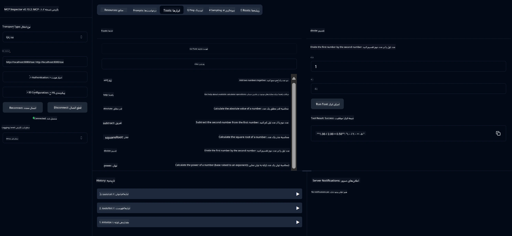

# سرویس ماشین حساب پایه MCP

> [!NOTE]
> این نمونه از انتقال قدیمی HTTP+SSE استفاده می‌کند و هدف آن یک SDK سازگار با MCP با نسخه `2025-11-25` است. سرورهای جدید باید از پشتیبانی HTTP قابل استریم `2026-07-28` استفاده کنند.
> 
> 

این سرویس عملیات پایه ماشین حساب را از طریق پروتکل Model Context (MCP) با استفاده از Spring Boot و انتقال WebFlux ارائه می‌دهد. این یک مثال ساده برای مبتدیان برای یادگیری پیاده‌سازی‌های MCP است.

برای اطلاعات بیشتر، سند مرجع [MCP Server Boot Starter](https://docs.spring.io/spring-ai/reference/api/mcp/mcp-server-boot-starter-docs.html) را ببینید.

## مرور کلی

این سرویس نشان می‌دهد:
- پشتیبانی از SSE (رویدادهای ارسال شده از سرور)
- ثبت خودکار ابزارها با استفاده از توضیح `@Tool` در Spring AI
- عملکردهای پایه ماشین حساب:
  - جمع، تفریق، ضرب، تقسیم
  - محاسبه توان و جذر مربع
  - باقی‌مانده (مدولس) و قدر مطلق
  - تابع راهنما برای توضیح عملیات‌ها

## ویژگی‌ها

این سرویس ماشین حساب قابلیت‌های زیر را ارائه می‌دهد:

1. **عملیات اصلی حسابی**:
   - جمع دو عدد
   - تفریق یک عدد از عدد دیگر
   - ضرب دو عدد
   - تقسیم یک عدد بر عدد دیگر (با بررسی تقسیم بر صفر)

2. **عملیات پیشرفته**:
   - محاسبه توان (بالا بردن پایه به توان)
   - محاسبه جذر مربع (با بررسی عدد منفی)
   - محاسبه باقی‌مانده (مدولس)
   - محاسبه قدر مطلق

3. **سیستم راهنما**:
   - تابع راهنمای داخلی که همه عملیات‌های موجود را توضیح می‌دهد

## استفاده از سرویس

این سرویس نقاط انتهایی API زیر را از طریق پروتکل MCP ارائه می‌دهد:

- `add(a, b)`: جمع دو عدد
- `subtract(a, b)`: تفریق عدد دوم از اول
- `multiply(a, b)`: ضرب دو عدد
- `divide(a, b)`: تقسیم عدد اول بر دوم (با بررسی صفر)
- `power(base, exponent)`: محاسبه توان عدد
- `squareRoot(number)`: محاسبه جذر مربع (با بررسی عدد منفی)
- `modulus(a, b)`: محاسبه باقی‌مانده تقسیم
- `absolute(number)`: محاسبه قدر مطلق
- `help()`: دریافت اطلاعات درباره عملیات‌های موجود

## کلاینت تست

یک کلاینت تست ساده در پکیج `com.microsoft.mcp.sample.client` موجود است. کلاس `SampleCalculatorClient` عملیات‌های موجود در سرویس ماشین حساب را نشان می‌دهد.

## استفاده از کلاینت LangChain4j

پروژه شامل یک کلاینت نمونه LangChain4j در `com.microsoft.mcp.sample.client.LangChain4jClient` است که نشان می‌دهد چگونه سرویس ماشین حساب را با LangChain4j و مدل‌های GitHub ادغام کنیم:

### پیش‌نیازها

1. **راه‌اندازی توکن GitHub**:
   
   برای استفاده از مدل‌های هوش مصنوعی GitHub (مانند phi-4)، به یک توکن دسترسی شخصی GitHub نیاز دارید:

   a. به تنظیمات حساب GitHub خود بروید: https://github.com/settings/tokens
   
   b. روی "Generate new token" → "Generate new token (classic)" کلیک کنید
   
   c. به توکن خود نامی توصیفی بدهید
   
   d. موارد زیر را انتخاب کنید:
      - `repo` (کنترل کامل مخازن خصوصی)
      - `read:org` (خواندن عضویت سازمان و تیم، خواندن پروژه‌های سازمان)
      - `gist` (ساخت گیس‌ها)
      - `user:email` (دسترسی به آدرس ایمیل کاربران (فقط خواندنی))
   
   e. روی "Generate token" کلیک کرده و توکن جدید را کپی کنید
   
   f. آن را به عنوان متغیر محیطی تنظیم کنید:
      
      روی ویندوز:
      ```
      set GITHUB_TOKEN=your-github-token
      ```
      
      روی macOS/Linux:
      ```bash
      export GITHUB_TOKEN=your-github-token
      ```

   g. برای تنظیم دائمی، آن را از طریق تنظیمات سیستم به متغیرهای محیطی اضافه کنید

2. وابستگی LangChain4j GitHub را به پروژه خود اضافه کنید (قبلا در pom.xml گنجانده شده):
   ```xml
   <dependency>
       <groupId>dev.langchain4j</groupId>
       <artifactId>langchain4j-github</artifactId>
       <version>${langchain4j.version}</version>
   </dependency>
   ```

3. اطمینان حاصل کنید که سرور ماشین حساب روی `localhost:8080` اجرا می‌شود

### اجرای کلاینت LangChain4j

این مثال نشان می‌دهد:
- اتصال به سرور ماشین حساب MCP از طریق انتقال SSE
- استفاده از LangChain4j برای ساخت ربات چت که از عملیات‌های ماشین حساب بهره می‌برد
- ادغام با مدل‌های هوش مصنوعی GitHub (اکنون با مدل phi-4)

کلاینت نمونه‌های زیر را برای نشان دادن عملکرد ارسال می‌کند:
1. محاسبه مجموع دو عدد
2. یافتن جذر مربع یک عدد
3. دریافت اطلاعات راهنما درباره عملیات‌های موجود در ماشین حساب

مثال را اجرا کنید و خروجی کنسول را بررسی کنید تا ببینید مدل هوش مصنوعی چگونه از ابزارهای ماشین حساب برای پاسخ به پرسش‌ها استفاده می‌کند.

### پیکربندی مدل GitHub

کلاینت LangChain4j برای استفاده از مدل phi-4 گیت‌هاب با تنظیمات زیر پیکربندی شده است:

```java
ChatLanguageModel model = GitHubChatModel.builder()
    .apiKey(System.getenv("GITHUB_TOKEN"))
    .timeout(Duration.ofSeconds(60))
    .modelName("phi-4")
    .logRequests(true)
    .logResponses(true)
    .build();
```

برای استفاده از مدل‌های مختلف GitHub، کافی است پارامتر `modelName` را به مدل دیگری که پشتیبانی می‌شود تغییر دهید (مثلا "claude-3-haiku-20240307"، "llama-3-70b-8192" و غیره).

## وابستگی‌ها

پروژه به وابستگی‌های کلیدی زیر نیاز دارد:

```xml
<!-- For MCP Server -->
<dependency>
    <groupId>org.springframework.ai</groupId>
    <artifactId>spring-ai-starter-mcp-server-webflux</artifactId>
</dependency>

<!-- For LangChain4j integration -->
<dependency>
    <groupId>dev.langchain4j</groupId>
    <artifactId>langchain4j-mcp</artifactId>
    <version>${langchain4j.version}</version>
</dependency>

<!-- For GitHub models support -->
<dependency>
    <groupId>dev.langchain4j</groupId>
    <artifactId>langchain4j-github</artifactId>
    <version>${langchain4j.version}</version>
</dependency>
```

## ساخت پروژه

پروژه را با استفاده از Maven بسازید:
```bash
./mvnw clean install -DskipTests
```

## اجرای سرور

### استفاده از جاوا

```bash
java -jar target/calculator-server-0.0.1-SNAPSHOT.jar
```

### استفاده از MCP Inspector

MCP Inspector ابزار مفیدی برای تعامل با سرویس‌های MCP است. برای استفاده از آن با این سرویس ماشین حساب:

1. **MCP Inspector را نصب و اجرا کنید** در یک پنجره ترمینال جدید:
   ```bash
   npx @modelcontextprotocol/inspector
   ```

2. **به رابط وب دسترسی پیدا کنید** با کلیک روی URL نشان داده شده توسط برنامه (معمولاً http://localhost:6274)

3. **اتصال را پیکربندی کنید**:
   - نوع انتقال را روی "SSE" تنظیم کنید
   - URL را روی نقطه انتهایی SSE سرور در حال اجرای شما تنظیم کنید: `http://localhost:8080/sse`
   - روی "Connect" کلیک کنید

4. **استفاده از ابزارها**:
   - روی "List Tools" کلیک کنید تا عملیات‌های ماشین حساب را ببینید
   - یک ابزار را انتخاب کرده و روی "Run Tool" کلیک کنید تا عملیات اجرا شود



### استفاده از داکر

پروژه شامل یک Dockerfile برای استقرار در کانتینر است:

1. **ایجاد تصویر داکر**:
   ```bash
   docker build -t calculator-mcp-service .
   ```

2. **اجرای کانتینر داکر**:
   ```bash
   docker run -p 8080:8080 calculator-mcp-service
   ```

این کار:
- یک تصویر چندمرحله‌ای داکر با Maven 3.9.9 و Eclipse Temurin 24 JDK می‌سازد
- یک تصویر کانتینر بهینه‌شده ایجاد می‌کند
- سرویس را روی پورت 8080 باز می‌کند
- سرویس ماشین حساب MCP را در داخل کانتینر اجرا می‌کند

پس از اجرای کانتینر، می‌توانید به سرویس در آدرس `http://localhost:8080` دسترسی پیدا کنید.

## عیب‌یابی

### مشکلات رایج با توکن GitHub

1. **مشکلات دسترسی توکن**: اگر خطای 403 Forbidden دریافت کردید، مطمئن شوید که توکن شما دسترسی‌های لازم را دارد همانطور که در پیش‌نیازها ذکر شده است.

2. **توکن یافت نشد**: اگر خطای "No API key found" دریافت کردید، اطمینان حاصل کنید که متغیر محیطی GITHUB_TOKEN به درستی تنظیم شده است.

3. **محدودیت نرخ**: API گیت‌هاب محدودیت نرخ دارد. اگر با خطای محدودیت نرخ (کد وضعیت 429) مواجه شدید، چند دقیقه صبر کنید و دوباره تلاش کنید.

4. **منقضی شدن توکن**: توکن‌های گیت‌هاب ممکن است منقضی شوند. اگر پس از مدتی خطاهای احراز هویت دریافت کردید، توکن جدیدی تولید و متغیر محیطی خود را به‌روزرسانی کنید.

اگر به کمک بیشتری نیاز دارید، اسناد [LangChain4j](https://github.com/langchain4j/langchain4j) یا [مستندات API گیت‌هاب](https://docs.github.com/en/rest) را بررسی کنید.

---

<!-- CO-OP TRANSLATOR DISCLAIMER START -->
**سلب مسئولیت**:
این سند با استفاده از سرویس ترجمه هوش مصنوعی [Co-op Translator](https://github.com/Azure/co-op-translator) ترجمه شده است. در حالی که ما در تلاش برای دقت هستیم، لطفاً توجه داشته باشید که ترجمه‌های خودکار ممکن است شامل خطاها یا نادرستی‌هایی باشند. سند اصلی به زبان مادری خود باید به عنوان منبع معتبر در نظر گرفته شود. برای اطلاعات حیاتی، ترجمه حرفه‌ای انسانی توصیه می‌شود. ما در قبال هرگونه سوء تفاهم یا برداشت نادرست ناشی از استفاده از این ترجمه مسئولیتی نداریم.
<!-- CO-OP TRANSLATOR DISCLAIMER END -->