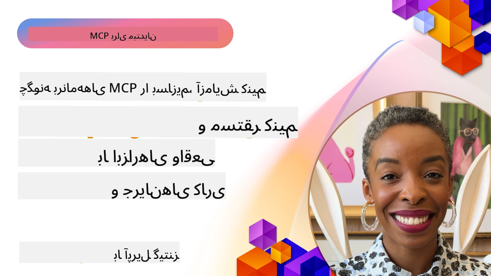

# پیاده‌سازی عملی

[](https://youtu.be/vCN9-mKBDfQ)

_(برای مشاهده ویدئوی این درس روی تصویر بالا کلیک کنید)_

پیاده‌سازی عملی جایی است که قدرت پروتکل زمینه مدل (MCP) ملموس می‌شود. در حالی که درک نظریه و معماری پشت MCP مهم است، ارزش واقعی زمانی بروز می‌کند که این مفاهیم را به کار ببرید تا راه‌حل‌هایی بسازید، آزمایش کنید و مستقر کنید که مشکلات دنیای واقعی را حل می‌کنند. این فصل پل ارتباطی بین دانش مفهومی و توسعه عملی است و شما را در فرآیند زنده کردن برنامه‌های مبتنی بر MCP راهنمایی می‌کند.

چه در حال توسعه دستیارهای هوشمند، ادغام هوش مصنوعی در گردش‌کارهای کسب‌وکار، یا ساخت ابزارهای سفارشی برای پردازش داده‌ها باشید، MCP پایه‌ای منعطف فراهم می‌کند. طراحی بدون وابستگی به زبان و SDKهای رسمی آن برای زبان‌های برنامه‌نویسی محبوب، دسترسی آن را برای گستره وسیعی از توسعه‌دهندگان فراهم می‌کند. با بهره‌گیری از این SDKها، می‌توانید سریع نمونه اولیه بسازید، تکرار کنید و راه‌حل‌های خود را در پلتفرم‌ها و محیط‌های مختلف مقیاس دهید.

در بخش‌های بعدی، نمونه‌های عملی، کد نمونه، و استراتژی‌های استقرار را خواهید یافت که نحوه پیاده‌سازی MCP در C#، Java با Spring، TypeScript، JavaScript، و Python را نشان می‌دهند. همچنین خواهید آموخت چگونه سرورهای MCP را اشکال‌زدایی و آزمایش کنید، APIها را مدیریت کنید و راه‌حل‌ها را با استفاده از Azure در ابر مستقر کنید. این منابع عملی برای سرعت بخشیدن به یادگیری شما و کمک به ساخت برنامه‌های MCP قوی و آماده تولید طراحی شده‌اند.

## مرور کلی

این درس بر جنبه‌های عملی پیاده‌سازی MCP در چندین زبان برنامه‌نویسی تمرکز دارد. ما بررسی خواهیم کرد چگونه از SDKهای MCP در C#، Java با Spring، TypeScript، JavaScript، و Python برای ساخت برنامه‌های قوی، اشکال‌زدایی و آزمایش سرورهای MCP و ایجاد منابع، درخواست‌ها و ابزارهای قابل استفاده مجدد بهره ببریم.

## اهداف یادگیری

در پایان این درس، قادر خواهید بود:

- پیاده‌سازی راه‌حل‌های MCP با استفاده از SDKهای رسمی در زبان‌های مختلف برنامه‌نویسی
- اشکال‌زدایی و آزمایش سیستماتیک سرورهای MCP
- ایجاد و استفاده از ویژگی‌های سرور (منابع، درخواست‌ها و ابزارها)
- طراحی گردش‌کارهای موثر MCP برای وظایف پیچیده
- بهینه‌سازی پیاده‌سازی‌های MCP برای عملکرد و قابلیت اطمینان

## منابع SDK رسمی

پروتکل زمینه مدل (MCP) SDKهای رسمی برای زبان‌های مختلف ارائه می‌دهد (مطابق با [مشخصات MCP 2025-11-25](https://spec.modelcontextprotocol.io/specification/2025-11-25/)):

- [SDK زبان C#](https://github.com/modelcontextprotocol/csharp-sdk)
- [SDK جاوا با Spring](https://github.com/modelcontextprotocol/java-sdk) **توجه:** نیازمند وابستگی به [Project Reactor](https://projectreactor.io) است. (مراجعه کنید به [بحث شماره 246](https://github.com/orgs/modelcontextprotocol/discussions/246).)
- [SDK تایپ‌اسکریپت](https://github.com/modelcontextprotocol/typescript-sdk)
- [SDK پایتون](https://github.com/modelcontextprotocol/python-sdk)
- [SDK کاتلین](https://github.com/modelcontextprotocol/kotlin-sdk)
- [SDK زبان Go](https://github.com/modelcontextprotocol/go-sdk)

## کار با SDKهای MCP

این بخش نمونه‌های عملی از پیاده‌سازی MCP در زبان‌های برنامه‌نویسی مختلف را ارائه می‌دهد. می‌توانید کد نمونه را در دایرکتوری `samples` مرتب شده بر اساس زبان پیدا کنید.

### نمونه‌های موجود

مخزن شامل [نمونه‌های پیاده‌سازی](../../../04-PracticalImplementation/samples) در زبان‌های زیر است:

- [زبان C#](./samples/csharp/README.md)
- [جاوا با Spring](./samples/java/containerapp/README.md)
- [تایپ‌اسکریپت](./samples/typescript/README.md)
- [جاوااسکریپت](./samples/javascript/README.md)
- [پایتون](./samples/python/README.md)

هر نمونه مفاهیم کلیدی MCP و الگوهای پیاده‌سازی برای آن زبان و اکوسیستم خاص را نشان می‌دهد.

### راهنماهای عملی

راهنماهای بیشتر برای پیاده‌سازی عملی MCP:

- [صفحه‌بندی و مجموعه‌های نتایج بزرگ](./pagination/README.md) - مدیریت صفحه‌بندی مبتنی بر کرسر برای ابزارها، منابع و داده‌های بزرگ

## ویژگی‌های اصلی سرور

سرورهای MCP می‌توانند ترکیبی از این ویژگی‌ها را پیاده‌سازی کنند:

### منابع

منابع زمینه و داده برای استفاده کاربر یا مدل هوش مصنوعی فراهم می‌کنند:

- مخازن اسناد
- پایگاه‌های دانش
- منابع داده‌ ساختارمند
- سیستم‌های پرونده

### درخواست‌ها

درخواست‌ها پیام‌ها و گردش‌کارهای قالب‌بندی شده برای کاربران هستند:

- قالب‌های مکالمه از پیش تعریف شده
- الگوهای تعامل هدایت‌شده
- ساختارهای گفتگوی تخصصی

### ابزارها

ابزارها توابعی هستند که مدل هوش مصنوعی می‌تواند اجرا کند:

- ابزارهای پردازش داده
- یکپارچه‌سازی‌های API خارجی
- قابلیت‌های محاسباتی
- عملکرد جستجو

## نمونه‌های پیاده‌سازی: پیاده‌سازی C#

مخزن SDK رسمی زبان C# شامل چند نمونه پیاده‌سازی است که جنبه‌های مختلف MCP را نشان می‌دهند:

- **کلاینت پایه MCP**: نمونه ساده‌ای که نشان می‌دهد چگونه یک کلاینت MCP بسازیم و ابزارها را فراخوانی کنیم
- **سرور پایه MCP**: پیاده‌سازی حداقلی سرور با ثبت ابزارهای پایه
- **سرور پیشرفته MCP**: سرور کامل با ثبت ابزار، احراز هویت، و مدیریت خطا
- **ادغام ASP.NET**: نمونه‌هایی که ادغام با ASP.NET Core را نشان می‌دهند
- **الگوهای پیاده‌سازی ابزار**: الگوهای مختلف برای پیاده‌سازی ابزارها با سطوح مختلف پیچیدگی

SDK زبان C# در حالت پیش‌نمایش است و APIها ممکن است تغییر کنند. ما به طور مداوم این بلاگ را به‌روزرسانی خواهیم کرد با تکامل SDK.

### ویژگی‌های کلیدی

- [نسخه Nuget MCP برای C# ModelContextProtocol](https://www.nuget.org/packages/ModelContextProtocol)
- ساخت [اولین سرور MCP](https://devblogs.microsoft.com/dotnet/build-a-model-context-protocol-mcp-server-in-csharp/).

برای نمونه‌های کامل پیاده‌سازی C# به [مخزن نمونه‌های SDK رسمی C#](https://github.com/modelcontextprotocol/csharp-sdk) مراجعه کنید.

## نمونه پیاده‌سازی: پیاده‌سازی Java با Spring

SDK جاوا با Spring گزینه‌های پیاده‌سازی قوی MCP با ویژگی‌های درجه سازمانی را فراهم می‌کند.

### ویژگی‌های کلیدی

- ادغام با Spring Framework
- ایمنی نوع قوی
- پشتیبانی از برنامه‌نویسی واکنشی
- مدیریت کامل خطا

برای نمونه پیاده‌سازی کامل Java با Spring، به [نمونه Java با Spring](samples/java/containerapp/README.md) در دایرکتوری نمونه‌ها مراجعه کنید.

## نمونه پیاده‌سازی: پیاده‌سازی جاوااسکریپت

SDK جاوااسکریپت رویکرد سبک‌وزن و انعطاف‌پذیری برای پیاده‌سازی MCP ارائه می‌دهد.

### ویژگی‌های کلیدی

- پشتیبانی از Node.js و مرورگر
- API مبتنی بر Promise
- ادغام آسان با Express و فریم‌ورک‌های دیگر
- پشتیبانی WebSocket برای استریمینگ

برای نمونه پیاده‌سازی کامل جاوااسکریپت، به [نمونه JavaScript](samples/javascript/README.md) در دایرکتوری نمونه‌ها مراجعه کنید.

## نمونه پیاده‌سازی: پیاده‌سازی پایتون

SDK پایتون رویکردی پایتونیک برای پیاده‌سازی MCP با ادغام‌های عالی با فریم‌ورک‌های ML ارائه می‌دهد.

### ویژگی‌های کلیدی

- پشتیبانی Async/await با asyncio
- ادغام با FastAPI``
- ثبت ساده ابزارها
- ادغام بومی با کتابخانه‌های محبوب ML

برای نمونه پیاده‌سازی کامل پایتون، به [نمونه Python](samples/python/README.md) در دایرکتوری نمونه‌ها مراجعه کنید.

## مدیریت API

Azure API Management پاسخ عالی‌ای به این سوال است که چگونه می‌توانیم سرورهای MCP را ایمن کنیم. ایده این است که یک نمونه Azure API Management را در جلوی سرور MCP خود قرار دهید و به آن اجازه دهید ویژگی‌هایی را که احتمالاً می‌خواهید مدیریت کند، مانند:

- محدودیت نرخ
- مدیریت توکن
- پایش
- تعادل بار
- امنیت

### نمونه Azure

نمونه Azure زیر دقیقاً همین کار را انجام می‌دهد، یعنی [ایجاد یک سرور MCP و ایمن‌سازی آن با Azure API Management](https://github.com/Azure-Samples/remote-mcp-apim-functions-python).

نحوه انجام جریان مجوزدهی را در تصویر زیر ببینید:


در تصویر فوق، موارد زیر اتفاق می‌افتد:

- احراز هویت/مجوزدهی با استفاده از Microsoft Entra صورت می‌گیرد.
- Azure API Management به عنوان دروازه عمل می‌کند و با سیاست‌ها ترافیک را هدایت و مدیریت می‌کند.
- Azure Monitor همه درخواست‌ها را برای تحلیل‌های بعدی ثبت می‌کند.

#### جریان مجوزدهی

بیایید نگاهی دقیق‌تر به جریان مجوزدهی بیندازیم:


#### مشخصات مجوزدهی MCP

بیشتر درباره [مشخصات مجوزدهی MCP](https://spec.modelcontextprotocol.io/specification/2025-11-25/basic/authorization/) بیاموزید.

## استقرار سرور MCP راه دور در Azure

بیایید ببینیم آیا می‌توانیم نمونه‌ای که قبلاً ذکر کردیم را مستقر کنیم:

1. مخزن را کلون کنید

    ```bash
    git clone https://github.com/Azure-Samples/remote-mcp-apim-functions-python.git
    cd remote-mcp-apim-functions-python
    ```

1. ثبت ارائه‌دهنده منابع `Microsoft.App`.

   - اگر از Azure CLI استفاده می‌کنید، دستور `az provider register --namespace Microsoft.App --wait` را اجرا کنید.
   - اگر از Azure PowerShell استفاده می‌کنید، دستور `Register-AzResourceProvider -ProviderNamespace Microsoft.App` را اجرا کنید. سپس پس از چند دقیقه برای بررسی تکمیل ثبت، دستور `(Get-AzResourceProvider -ProviderNamespace Microsoft.App).RegistrationState` را اجرا کنید.

1. این دستور [azd](https://aka.ms/azd) را برای فراهم‌سازی سرویس مدیریت API، برنامه فانکشن (با کد) و تمامی منابع مورد نیاز Azure اجرا کنید.

    ```shell
    azd up
    ```

    این دستور همه منابع ابری را در Azure مستقر خواهد کرد.

### آزمایش سرور با MCP Inspector

1. در یک **پنجره ترمینال جدید**، MCP Inspector را نصب و اجرا کنید.

    ```shell
    npx @modelcontextprotocol/inspector
    ```

    باید رابطی مشابه زیر را ببینید:

    

1. با فشردن کلید CTRL روی URL نمایش داده شده توسط برنامه کلیک کنید تا اپ وب MCP Inspector بارگذاری شود (مثلاً [http://127.0.0.1:6274/#resources](http://127.0.0.1:6274/#resources))
1. نوع انتقال را روی `SSE` تنظیم کنید
1. URL را به نقطه انتهایی مدیریت API SSE در حال اجرای خود تنظیم کرده و **اتصال** را بزنید:

    ```shell
    https://<apim-servicename-from-azd-output>.azure-api.net/mcp/sse
    ```

1. **لیست ابزارها**. روی یک ابزار کلیک کرده و **اجرای ابزار** را انتخاب کنید.

اگر تمام مراحل درست انجام شده باشد، اکنون باید به سرور MCP متصل شده باشید و توانسته باشید یک ابزار را فراخوانی کنید.

## سرورهای MCP برای Azure

[Remote-mcp-functions](https://github.com/Azure-Samples/remote-mcp-functions-dotnet): این مجموعه مخازن قالب شروع سریع برای ساخت و استقرار سرورهای سفارشی راه دور MCP با استفاده از Azure Functions با پایتون، C# .NET یا Node/TypeScript هستند.

نمونه‌ها راه‌حلی کامل ارائه می‌دهند که به توسعه‌دهندگان اجازه می‌دهد:

- ساخت و اجرای محلی: توسعه و اشکال‌زدایی سرور MCP در یک ماشین محلی
- استقرار در Azure: استقرار آسان در ابر با یک دستور ساده azd up
- اتصال از کلاینت‌ها: اتصال به سرور MCP از کلاینت‌های مختلف از جمله حالت عامل Copilot در VS Code و ابزار MCP Inspector

### ویژگی‌های کلیدی

- امنیت به صورت طراحی: سرور MCP با استفاده از کلیدها و HTTPS امن شده است
- گزینه‌های احراز هویت: پشتیبانی OAuth با احراز هویت داخلی و/یا Azure API Management
- ایزولاسیون شبکه: امکان ایزولاسیون شبکه با استفاده از شبکه‌های مجازی Azure (VNET)
- معماری بدون سرور: استفاده از Azure Functions برای اجرای مقیاس‌پذیر و رویدادمحور
- توسعه محلی: پشتیبانی کامل توسعه و اشکال‌زدایی محلی
- استقرار ساده: فرآیند استقرار بهینه شده در Azure

مخزن همه فایل‌های پیکربندی لازم، کد منبع، و تعریف‌های زیرساخت را شامل می‌شود تا سریعاً با پیاده‌سازی سرور MCP آماده تولید شروع کنید.

- [Azure Remote MCP Functions Python](https://github.com/Azure-Samples/remote-mcp-functions-python) - نمونه پیاده‌سازی MCP با استفاده از Azure Functions و پایتون

- [Azure Remote MCP Functions .NET](https://github.com/Azure-Samples/remote-mcp-functions-dotnet) - نمونه پیاده‌سازی MCP با استفاده از Azure Functions و C# .NET

- [Azure Remote MCP Functions Node/Typescript](https://github.com/Azure-Samples/remote-mcp-functions-typescript) - نمونه پیاده‌سازی MCP با استفاده از Azure Functions و Node/TypeScript.

## نکات کلیدی

- SDKهای MCP ابزارهای مخصوص زبان برای پیاده‌سازی راه‌حل‌های قوی MCP فراهم می‌کنند
- فرآیند اشکال‌زدایی و آزمایش برای برنامه‌های MCP قابل اعتماد حیاتی است
- قالب‌های درخواست قابل استفاده مجدد تعاملات AI را یکپارچه می‌کنند
- گردش‌کارهای خوب طراحی شده می‌توانند وظایف پیچیده را با استفاده از چندین ابزار هماهنگ کنند
- پیاده‌سازی راه‌حل‌های MCP نیازمند توجه به امنیت، عملکرد، و مدیریت خطا است

## تمرین

یک گردش‌کار عملی MCP طراحی کنید که مشکلی در دنیای واقعی حوزه شما را حل کند:

1. ۳-۴ ابزار را مشخص کنید که برای حل این مشکل مفید باشند
2. نمودار گردش‌کار ایجاد کنید که نشان دهد این ابزارها چگونه با هم تعامل دارند
3. نسخه پایه‌ای از یکی از ابزارها را با زبان مورد علاقه خود پیاده‌سازی کنید
4. قالب درخواست ایجاد کنید که به مدل کمک کند از ابزار شما به‌طور مؤثر استفاده کند

## منابع اضافی

---

## مرحله بعدی

مرحله بعد: [موضوعات پیشرفته](../05-AdvancedTopics/README.md)

---

<!-- CO-OP TRANSLATOR DISCLAIMER START -->
**توضیح مهم**:  
این سند با استفاده از سرویس ترجمه هوش مصنوعی [Co-op Translator](https://github.com/Azure/co-op-translator) ترجمه شده است. در حالی که ما در تلاش برای دقت هستیم، لطفاً آگاه باشید که ترجمه‌های خودکار ممکن است حاوی اشتباهات یا نواقصی باشند. سند اصلی به زبان بومی آن باید به عنوان منبع معتبر در نظر گرفته شود. برای اطلاعات حیاتی، ترجمه حرفه‌ای انسانی توصیه می‌شود. ما مسئول هیچ گونه سوء تفاهم یا تفسیر نادرست ناشی از استفاده از این ترجمه نیستیم.
<!-- CO-OP TRANSLATOR DISCLAIMER END -->