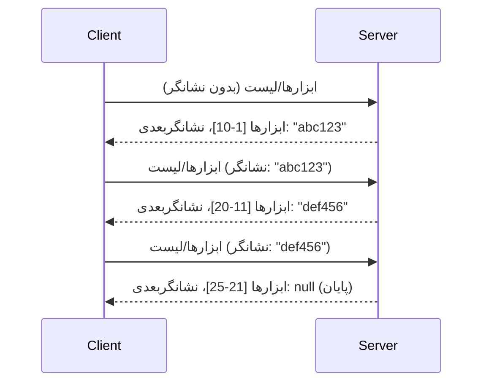

# صفحه‌بندی و مجموعه‌های بزرگ نتایج در MCP

زمانی که سرور MCP شما با مجموعه‌داده‌های بزرگ کار می‌کند - چه فهرست‌بندی هزاران فایل، رکوردهای پایگاه داده، یا نتایج جستجو باشد - شما به صفحه‌بندی نیاز دارید تا حافظه را به‌طور کارآمد مدیریت کرده و تجربه کاربری پاسخگو ارائه دهید. این راهنما پوشش می‌دهد که چگونه صفحه‌بندی را در MCP پیاده‌سازی و استفاده کنید.

## چرا صفحه‌بندی مهم است

بدون صفحه‌بندی، پاسخ‌های بزرگ می‌توانند باعث شوند:

- **تمام شدن حافظه** - بارگذاری میلیون‌ها رکورد همزمان
- **زمان پاسخ‌دهی کند** - کاربران منتظر بارگذاری کامل داده‌ها می‌مانند
- **خطاهای زمان انتظار** - درخواست‌ها از حد زمان انتظار می‌گذرند
- **عملکرد ضعیف هوش مصنوعی** - مدل‌های زبانی بزرگ با متن حجیم مشکل دارند

MCP از **صفحه‌بندی مبتنی بر نشانگر (cursor)** برای صفحه‌بندی قابل اعتماد و یکنواخت در مجموعه‌نتایج استفاده می‌کند.

---

## چگونه صفحه‌بندی MCP کار می‌کند

### مفهوم نشانگر (Cursor)

یک **نشانگر** رشته‌ای مبهم است که موقعیت شما در مجموعه‌نتایج را مشخص می‌کند. آن را مانند یک نشانک در یک کتاب بلند تصور کنید.



### صفحه‌بندی در متدهای MCP

این متدهای MCP از صفحه‌بندی پشتیبانی می‌کنند:

| متد | بازمی‌گرداند | پشتیبانی از نشانگر |
|--------|---------|----------------|
| `tools/list` | تعاریف ابزار | ✅ |
| `resources/list` | تعاریف منابع | ✅ |
| `prompts/list` | تعاریف درخواست‌ها | ✅ |
| `resources/templates/list` | قالب‌های منابع | ✅ |

---

## پیاده‌سازی سرور

### پایتون (FastMCP)

```python
from mcp.server import Server
from mcp.types import Tool, ListToolsResult
import math

app = Server("paginated-server")

# مجموعه داده بزرگ شبیه‌سازی شده
ALL_TOOLS = [
    Tool(name=f"tool_{i}", description=f"Tool number {i}", inputSchema={})
    for i in range(100)
]

PAGE_SIZE = 10

@app.list_tools()
async def list_tools(cursor: str | None = None) -> ListToolsResult:
    """List tools with pagination support."""
    
    # رمزگشایی مکان‌نما برای به‌دست‌آوردن شاخص شروع
    start_index = 0
    if cursor:
        try:
            start_index = int(cursor)
        except ValueError:
            start_index = 0
    
    # دریافت صفحه نتایج
    end_index = min(start_index + PAGE_SIZE, len(ALL_TOOLS))
    page_tools = ALL_TOOLS[start_index:end_index]
    
    # محاسبه مکان‌نمای بعدی
    next_cursor = None
    if end_index < len(ALL_TOOLS):
        next_cursor = str(end_index)
    
    return ListToolsResult(
        tools=page_tools,
        nextCursor=next_cursor
    )
```

### تایپ‌اسکریپت

```typescript
import { Server } from "@modelcontextprotocol/sdk/server/index.js";
import { ListToolsResultSchema } from "@modelcontextprotocol/sdk/types.js";

const server = new Server({
  name: "paginated-server",
  version: "1.0.0"
});

// مجموعه داده بزرگ شبیه‌سازی شده
const ALL_TOOLS = Array.from({ length: 100 }, (_, i) => ({
  name: `tool_${i}`,
  description: `Tool number ${i}`,
  inputSchema: { type: "object", properties: {} }
}));

const PAGE_SIZE = 10;

server.setRequestHandler(ListToolsResultSchema, async (request) => {
  // رمزگشایی مکان‌نما
  let startIndex = 0;
  if (request.params?.cursor) {
    startIndex = parseInt(request.params.cursor, 10) || 0;
  }
  
  // دریافت صفحه‌ای از نتایج
  const endIndex = Math.min(startIndex + PAGE_SIZE, ALL_TOOLS.length);
  const pageTools = ALL_TOOLS.slice(startIndex, endIndex);
  
  // محاسبه مکان‌نمای بعدی
  const nextCursor = endIndex < ALL_TOOLS.length ? String(endIndex) : undefined;
  
  return {
    tools: pageTools,
    nextCursor
  };
});
```

### جاوا (Spring MCP)

```java
@Service
public class PaginatedToolService {
    
    private static final int PAGE_SIZE = 10;
    private final List<Tool> allTools;
    
    public PaginatedToolService() {
        // مقداردهی اولیه مجموعه داده بزرگ
        this.allTools = IntStream.range(0, 100)
            .mapToObj(i -> new Tool("tool_" + i, "Tool number " + i, Map.of()))
            .collect(Collectors.toList());
    }
    
    @McpMethod("tools/list")
    public ListToolsResult listTools(@Param("cursor") String cursor) {
        // رمزگشایی مکان‌نمای کرسر
        int startIndex = 0;
        if (cursor != null && !cursor.isEmpty()) {
            try {
                startIndex = Integer.parseInt(cursor);
            } catch (NumberFormatException e) {
                startIndex = 0;
            }
        }
        
        // دریافت صفحه‌ای از نتایج
        int endIndex = Math.min(startIndex + PAGE_SIZE, allTools.size());
        List<Tool> pageTools = allTools.subList(startIndex, endIndex);
        
        // محاسبه کرسر بعدی
        String nextCursor = endIndex < allTools.size() ? String.valueOf(endIndex) : null;
        
        return new ListToolsResult(pageTools, nextCursor);
    }
}
```

---

## پیاده‌سازی کلاینت

### کلاینت پایتون

```python
from mcp import ClientSession

async def get_all_tools(session: ClientSession) -> list:
    """Fetch all tools using pagination."""
    all_tools = []
    cursor = None
    
    while True:
        result = await session.list_tools(cursor=cursor)
        all_tools.extend(result.tools)
        
        if result.nextCursor is None:
            break
        cursor = result.nextCursor
    
    return all_tools

# استفاده
async with client_session as session:
    tools = await get_all_tools(session)
    print(f"Found {len(tools)} tools")
```

### کلاینت تایپ‌اسکریپت

```typescript
import { Client } from "@modelcontextprotocol/sdk/client/index.js";

async function getAllTools(client: Client): Promise<Tool[]> {
  const allTools: Tool[] = [];
  let cursor: string | undefined = undefined;
  
  do {
    const result = await client.listTools({ cursor });
    allTools.push(...result.tools);
    cursor = result.nextCursor;
  } while (cursor);
  
  return allTools;
}

// استفاده
const tools = await getAllTools(client);
console.log(`Found ${tools.length} tools`);
```

### الگوی بارگذاری تنبل

برای مجموعه‌داده‌های بسیار بزرگ، صفحات را به‌صورت درخواستی بارگذاری کنید:

```python
class PaginatedToolIterator:
    """Lazily iterate through paginated tools."""
    
    def __init__(self, session: ClientSession):
        self.session = session
        self.cursor = None
        self.buffer = []
        self.exhausted = False
    
    async def __anext__(self):
        # اگر موجود است از بافر بازگرداند
        if self.buffer:
            return self.buffer.pop(0)
        
        # بررسی کنید که آیا همه صفحات را تمام کرده‌ایم
        if self.exhausted:
            raise StopAsyncIteration
        
        # صفحه بعدی را دریافت کنید
        result = await self.session.list_tools(cursor=self.cursor)
        self.buffer = list(result.tools)
        self.cursor = result.nextCursor
        
        if self.cursor is None:
            self.exhausted = True
        
        if not self.buffer:
            raise StopAsyncIteration
        
        return self.buffer.pop(0)
    
    def __aiter__(self):
        return self

# استفاده - حافظه بهینه برای مجموعه داده‌های بزرگ
async for tool in PaginatedToolIterator(session):
    process_tool(tool)
```

---

## صفحه‌بندی برای منابع

منابع اغلب برای فهرست‌ها یا مجموعه‌داده‌های بزرگ به صفحه‌بندی نیاز دارند:

```python
from mcp.server import Server
from mcp.types import Resource, ListResourcesResult
import os

app = Server("file-server")

@app.list_resources()
async def list_resources(cursor: str | None = None) -> ListResourcesResult:
    """List files in directory with pagination."""
    
    directory = "/data/files"
    all_files = sorted(os.listdir(directory))
    
    # رمزگشایی مکان نما (شاخص فایل)
    start_index = int(cursor) if cursor else 0
    page_size = 20
    end_index = min(start_index + page_size, len(all_files))
    
    # ایجاد فهرست منابع برای این صفحه
    resources = []
    for filename in all_files[start_index:end_index]:
        filepath = os.path.join(directory, filename)
        resources.append(Resource(
            uri=f"file://{filepath}",
            name=filename,
            mimeType="application/octet-stream"
        ))
    
    # محاسبه مکان نمای بعدی
    next_cursor = str(end_index) if end_index < len(all_files) else None
    
    return ListResourcesResult(
        resources=resources,
        nextCursor=next_cursor
    )
```

---

## استراتژی‌های طراحی نشانگر

### استراتژی 1: مبتنی بر اندیس (ساده)

```python
# مکان‌نما فقط نمایه است
cursor = "50"  # شروع از آیتم ۵۰
```

**مزایا:** ساده، بدون حالت
**معایب:** نتایج در صورت اضافه یا حذف موارد ممکن است جابجا شوند

### استراتژی 2: مبتنی بر شناسه (پایدار)

```python
# مکان‌نما شناسه آخرین مورد مشاهده شده است
cursor = "item_abc123"  # شروع بعد از این مورد
```

**مزایا:** پایدار حتی اگر موارد تغییر کنند
**معایب:** نیاز به شناسه‌های مرتب شده دارد

### استراتژی 3: وضعیت کدگذاری شده (پیچیده)

```python
import base64
import json

def encode_cursor(state: dict) -> str:
    return base64.b64encode(json.dumps(state).encode()).decode()

def decode_cursor(cursor: str) -> dict:
    return json.loads(base64.b64decode(cursor).decode())

# نشانگر شامل چندین فیلد وضعیت است
cursor = encode_cursor({
    "offset": 50,
    "filter": "active",
    "sort": "name"
})
```

**مزایا:** می‌تواند وضعیت پیچیده را کدگذاری کند
**معایب:** پیچیده‌تر، رشته‌های نشانگر بزرگ‌تر

---

## بهترین روش‌ها

### 1. انتخاب سایز مناسب صفحه

```python
# اندازه داده را در نظر بگیرید
PAGE_SIZE_SMALL_ITEMS = 100   # فراداده ساده
PAGE_SIZE_MEDIUM_ITEMS = 20   # اشیاء غنی‌تر
PAGE_SIZE_LARGE_ITEMS = 5     # محتوای پیچیده
```

### 2. مدیریت نشانگرهای نامعتبر با نرمی

```python
@app.list_tools()
async def list_tools(cursor: str | None = None) -> ListToolsResult:
    try:
        start_index = int(cursor) if cursor else 0
        if start_index < 0 or start_index >= len(ALL_TOOLS):
            start_index = 0  # بازنشانی به ابتدا
    except (ValueError, TypeError):
        start_index = 0  # مکان‌نمای نامعتبر، از نو شروع کنید
    # ...
```

### 3. شامل کردن شمارش کل (اختیاری)

```python
return ListToolsResult(
    tools=page_tools,
    nextCursor=next_cursor,
    # برخی پیاده‌سازی‌ها شامل کل برای پیشرفت رابط کاربری هستند
    _meta={"total": len(ALL_TOOLS)}
)
```

### 4. تست موارد لبه

```python
async def test_pagination():
    # مجموعه نتیجه خالی
    result = await session.list_tools()
    assert result.tools == []
    assert result.nextCursor is None
    
    # صفحه‌ی واحد
    result = await session.list_tools()
    assert len(result.tools) <= PAGE_SIZE
    
    # کرسر نامعتبر
    result = await session.list_tools(cursor="invalid")
    assert result.tools  # باید صفحه اول را برگرداند
```

---

## اشتباهات رایج

### ❌ بازگرداندن همه نتایج و سپس صفحه‌بندی در سمت کلاینت

```python
# بد: همه چیز را در حافظه بارگیری می‌کند
@app.list_tools()
async def list_tools() -> ListToolsResult:
    all_tools = load_all_tools()  # ۱ میلیون ابزار!
    return ListToolsResult(tools=all_tools)
```

### ✅ صفحه‌بندی در منبع داده

```python
# خوب: فقط موارد لازم را بارگذاری می‌کند
@app.list_tools()
async def list_tools(cursor: str | None = None) -> ListToolsResult:
    offset = int(cursor) if cursor else 0
    tools = await db.query_tools(offset=offset, limit=PAGE_SIZE)
    return ListToolsResult(tools=tools, nextCursor=...)
```

---

## مرحله بعد

- [ماژول 5.14 - مهندسی زمینه](../../05-AdvancedTopics/mcp-contextengineering/README.md)
- [ماژول 8 - بهترین روش‌ها](../../08-BestPractices/README.md)
- [3.8 - تست سرور MCP خود](../../03-GettingStarted/08-testing/README.md)

---

## منابع اضافی

- [مشخصات MCP - صفحه‌بندی](https://modelcontextprotocol.io/specification/2026-07-28/)
- [شرح صفحه‌بندی مبتنی بر نشانگر](https://slack.engineering/evolving-api-pagination-at-slack/)
- [تست‌های صفحه‌بندی Python SDK](https://github.com/modelcontextprotocol/python-sdk/blob/main/tests/client/test_list_methods_cursor.py)

---

<!-- CO-OP TRANSLATOR DISCLAIMER START -->
**سلب مسئولیت**:
این سند با استفاده از سرویس ترجمه هوش مصنوعی [Co-op Translator](https://github.com/Azure/co-op-translator) ترجمه شده است. در حالی که ما در تلاش برای دقت هستیم، لطفاً توجه داشته باشید که ترجمه‌های خودکار ممکن است شامل خطاها یا نادرستی‌هایی باشند. سند اصلی به زبان مادری خود باید به عنوان منبع معتبر در نظر گرفته شود. برای اطلاعات حیاتی، ترجمه حرفه‌ای انسانی توصیه می‌شود. ما در قبال هرگونه سوء تفاهم یا برداشت نادرست ناشی از استفاده از این ترجمه مسئولیتی نداریم.
<!-- CO-OP TRANSLATOR DISCLAIMER END -->