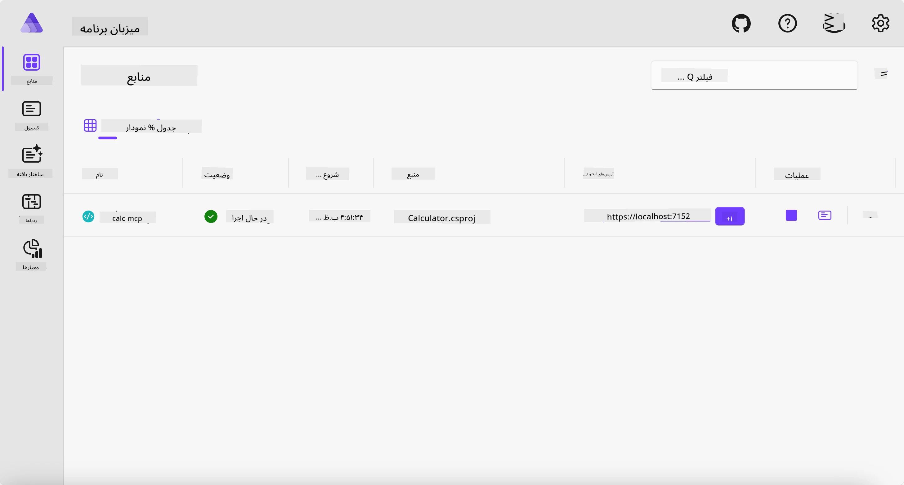
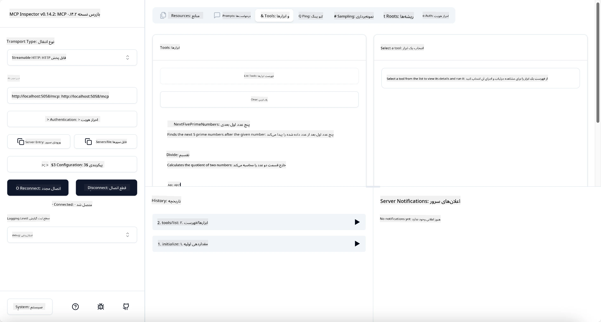
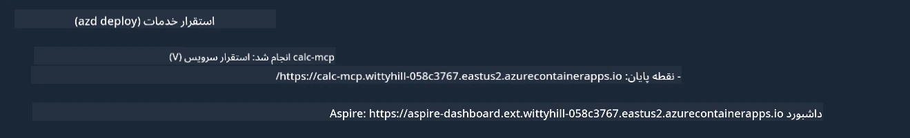

# نمونه

مثال قبلی نشان می‌دهد چگونه از یک پروژه محلی .NET با نوع `stdio` استفاده کنیم و چگونه سرور را به صورت محلی در یک کانتینر اجرا کنیم. این راه‌حل در بسیاری از موقعیت‌ها مناسب است. با این حال، ممکن است مفید باشد که سرور به صورت از راه دور، مثلاً در یک محیط ابری، اجرا شود. در اینجا نوع `http` وارد عمل می‌شود.

با نگاهی به راه‌حل در پوشه `04-PracticalImplementation` ممکن است پیچیده‌تر از نمونه قبلی به نظر برسد. اما در واقع این‌طور نیست. اگر دقیق‌تر به پروژه `src/Calculator` نگاه کنید، خواهید دید که بیشتر همان کد نمونه قبلی است. تنها تفاوت این است که ما از یک کتابخانه متفاوت به نام `ModelContextProtocol.AspNetCore` برای مدیریت درخواست‌های HTTP استفاده می‌کنیم. همچنین متد `IsPrime` را خصوصی کردیم، صرفاً برای نشان دادن این‌که می‌توانید در کد خود متدهای خصوصی داشته باشید. بقیه کد همان کد قبلی است.

سایر پروژه‌ها از [Aspire](https://aspire.dev/get-started/what-is-aspire/) هستند. داشتن Aspire در راه‌حل باعث بهبود تجربه توسعه‌دهنده هنگام توسعه و تست و همچنین کمک به قابلیت مشاهده می‌شود. اجرای سرور به آن نیازی ندارد، اما داشتن آن در راه‌حل یک رویه خوب است.

## اجرای سرور به صورت محلی

1. در VS Code (با افزونه C# DevKit) به مسیر `04-PracticalImplementation/samples/csharp` بروید.
1. دستور زیر را برای شروع سرور اجرا کنید:

   ```bash
    dotnet watch run --project ./src/AppHost
   ```

1. وقتی مرورگر وب داشبورد Aspire را باز کرد، آدرس `http` را یادداشت کنید. باید چیزی شبیه `http://localhost:5058/` باشد.

   

## تست Streamable HTTP با MCP Inspector

اگر نسخه Node.js شما 22.7.5 یا بالاتر است، می‌توانید از MCP Inspector برای تست سرور استفاده کنید.

سرور را اجرا کنید و دستور زیر را در ترمینال وارد کنید:

```bash
npx @modelcontextprotocol/inspector http://localhost:5058
```



- نوع انتقال را `Streamable HTTP` انتخاب کنید.
- در فیلد Url آدرس سرور که قبلاً یادداشت شده را وارد کنید و `/mcp` را به آن اضافه کنید. باید `http` باشد (نه `https`) و چیزی شبیه `http://localhost:5058/mcp`.
- دکمه Connect را انتخاب کنید.

یکی از مزایای Inspector این است که دید خوبی نسبت به اتفاقات دارد.

- تلاش کنید فهرست ابزارهای موجود را مشاهده کنید
- برخی از آن‌ها را امتحان کنید، باید مانند قبل کار کنند.

## تست MCP Server با GitHub Copilot Chat در VS Code

برای استفاده از انتقال Streamable HTTP با GitHub Copilot Chat، پیکربندی سرور `calc-mcp` که قبلاً ایجاد شده را به صورت زیر تغییر دهید:

```jsonc
// .vscode/mcp.json
{
  "servers": {
    "calc-mcp": {
      "type": "http",
      "url": "http://localhost:5058/mcp"
    }
  }
}
```

چند تست انجام دهید:

- درخواست "۳ عدد اول بعد از ۶۷۸۰" کنید. توجه کنید که Copilot از ابزارهای جدید `NextFivePrimeNumbers` استفاده می‌کند و فقط ۳ عدد اول را برمی‌گرداند.
- درخواست "۷ عدد اول بعد از ۱۱۱" کنید تا ببینید چه اتفاقی می‌افتد.
- درخواست "جان ۲۴ آب‌نبات دارد و می‌خواهد همه را میان ۳ فرزندش تقسیم کند. هر بچه چند آب‌نبات دارد؟" را انجام دهید تا نتیجه را ببینید.

## استقرار سرور در Azure

بیایید سرور را در Azure مستقر کنیم تا افراد بیشتری بتوانند از آن استفاده کنند.

از ترمینال به پوشه `04-PracticalImplementation/samples/csharp` بروید و دستور زیر را اجرا کنید:

```bash
azd up
```

پس از اتمام استقرار، باید پیامی شبیه به این مشاهده کنید:



آدرس URL را بردارید و در MCP Inspector و GitHub Copilot Chat استفاده کنید.

```jsonc
// .vscode/mcp.json
{
  "servers": {
    "calc-mcp": {
      "type": "http",
      "url": "https://calc-mcp.gentleriver-3977fbcf.australiaeast.azurecontainerapps.io/mcp"
    }
  }
}
```

## گام بعدی چیست؟

ما انواع مختلف انتقال و ابزارهای تست را امتحان کردیم. همچنین سرور MCP شما را در Azure مستقر کردیم. اما اگر سرور ما نیاز به دسترسی به منابع خصوصی داشته باشد، مثلاً یک پایگاه داده یا API خصوصی؟ در فصل بعد خواهیم دید چگونه می‌توانیم امنیت سرور خود را بهبود دهیم.

---

<!-- CO-OP TRANSLATOR DISCLAIMER START -->
**سلب مسئولیت**:
این سند با استفاده از سرویس ترجمه هوش مصنوعی [Co-op Translator](https://github.com/Azure/co-op-translator) ترجمه شده است. در حالی که ما در تلاش برای دقت هستیم، لطفاً توجه داشته باشید که ترجمه‌های خودکار ممکن است شامل خطاها یا نادرستی‌هایی باشند. سند اصلی به زبان مادری خود باید به عنوان منبع معتبر در نظر گرفته شود. برای اطلاعات حیاتی، ترجمه حرفه‌ای انسانی توصیه می‌شود. ما در قبال هرگونه سوء تفاهم یا برداشت نادرست ناشی از استفاده از این ترجمه مسئولیتی نداریم.
<!-- CO-OP TRANSLATOR DISCLAIMER END -->