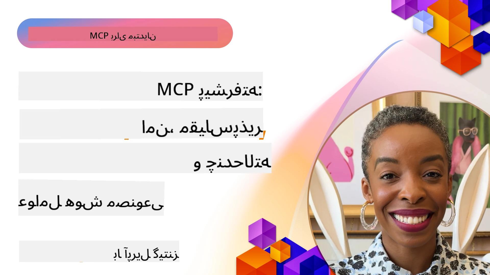

# مباحث پیشرفته در MCP

_(برای مشاهده ویدئو این درس، روی تصویر بالا کلیک کنید)_

این فصل مجموعه‌ای از مباحث پیشرفته در پیاده‌سازی پروتکل زمینه مدل (MCP) شامل یکپارچه‌سازی چندرسانه‌ای، مقیاس‌پذیری، بهترین شیوه‌های امنیتی و یکپارچه‌سازی سازمانی را پوشش می‌دهد. این مباحث برای ساخت برنامه‌های MCP قوی و آماده تولید که بتوانند نیازهای سیستم‌های هوش مصنوعی مدرن را برآورده کنند، حیاتی هستند.

## مرور کلی

این درس مفاهیم پیشرفته در پیاده‌سازی پروتکل زمینه مدل را بررسی می‌کند، با تمرکز بر یکپارچه‌سازی چندرسانه‌ای، مقیاس‌پذیری، بهترین شیوه‌های امنیتی و یکپارچه‌سازی سازمانی. این موضوعات برای ساخت برنامه‌های MCP با کیفیت تولید که قادر به مدیریت نیازهای پیچیده در محیط‌های سازمانی باشند، ضروری است.

> **یادداشت مشخصات کنونی:** نسخه MCP `2026-07-28` توابع Roots و
> Sampling را که در درس‌های 5.4 و 5.6 پوشش داده شده‌اند کنار می‌گذارد. این نسخه همچنین
> ویژگی تجربی Tasks که در ویژگی‌های پروتکل (5.16) آمده بود را به
> یک افزونه اختصاصی Tasks منتقل می‌کند. این درس‌ها برای پیاده‌سازی‌های قدیمی
> `2025-11-25` نگهداری شده‌اند و شامل راهنمای مهاجرت هستند. برای جزئیات بیشتر به
> [چه چیزهایی در MCP تغییر کرده است: مشخصات 2026-07-28](../01-CoreConcepts/mcp-2026-07-28.md) مراجعه کنید.

## اهداف یادگیری

در پایان این درس خواهید توانست:

- قابلیت‌های چندرسانه‌ای را در چارچوب‌های MCP پیاده‌سازی کنید
- معماری‌های مقیاس‌پذیر MCP را برای سناریوهای پرتقاضا طراحی کنید
- بهترین شیوه‌های امنیتی منطبق با اصول امنیتی MCP را به‌کار بگیرید
- MCP را با سیستم‌ها و چارچوب‌های هوش مصنوعی سازمانی یکپارچه کنید
- عملکرد و اطمینان‌پذیری را در محیط‌های تولید بهینه کنید

## درس‌ها و پروژه‌های نمونه

| لینک | عنوان | توضیحات |
|------|-------|-------------|
| [5.1 یکپارچه‌سازی با Azure](./mcp-integration/README.md) | یکپارچه‌سازی با Azure | یاد بگیرید چگونه MCP سرور خود را در Azure یکپارچه کنید |
| [5.2 نمونه چندرسانه‌ای](./mcp-multi-modality/README.md) | نمونه‌های چندرسانه‌ای MCP  | نمونه‌هایی برای پاسخ‌های صوتی، تصویری و چندرسانه‌ای |
| [5.3 نمونه OAuth2 MCP](../../../05-AdvancedTopics/mcp-oauth2-demo) | دمو OAuth2 MCP | اپلیکیشن مینیمال Spring Boot که OAuth2 را با MCP به عنوان سرور مجوز و سرور منبع نشان می‌دهد. شامل صدور امن توکن، نقاط انتهایی محافظت‌شده، استقرار Azure Container Apps و یکپارچه‌سازی مدیریت API است. |
| [5.4 زمینه‌های ریشه](./mcp-root-contexts/README.md) | زمینه‌های ریشه  | با ریشه‌های قدیمی `2025-11-25` و گزینه‌های مهاجرت کنونی (منسوخ شده در `2026-07-28`) آشنا شوید |
| [5.5 مسیریابی](./mcp-routing/README.md) | مسیریابی | انواع مختلف مسیریابی را بیاموزید |
| [5.6 نمونه‌گیری](./mcp-sampling/README.md) | نمونه‌گیری | با نمونه‌گیری قدیمی `2025-11-25` و گزینه‌های مهاجرت کنونی (منسوخ شده در `2026-07-28`) آشنا شوید |
| [5.7 مقیاس‌گذاری](./mcp-scaling/README.md) | مقیاس‌گذاری  | درباره مقیاس‌گذاری بیاموزید |
| [5.8 امنیت](./mcp-security/README.md) | امنیت  | سرور MCP خود را امن کنید |
| [5.9 نمونه جستجوی وب](./web-search-mcp/README.md) | جستجوی وب MCP | سرور و کلاینت Python MCP که با SerpAPI برای جستجوی بلادرنگ وب، اخبار، محصولات و پرسش و پاسخ یکپارچه شده‌اند. نمونه‌ای از هماهنگی چندابزاری، یکپارچه‌سازی API خارجی و مدیریت خطای قدرتمند ارائه می‌دهد. |
| [5.10 پخش زنده](./mcp-realtimestreaming/README.md) | پخش زنده  | پخش داده‌های بلادرنگ در دنیای امروز که مبتنی بر داده است، ضروری شده است، جایی که کسب‌وکارها و برنامه‌ها نیازمند دسترسی فوری به اطلاعات برای تصمیم‌گیری به موقع هستند.|
| [5.11 جستجوی بلادرنگ وب](./mcp-realtimesearch/README.md) | جستجوی وب | چگونه MCP جستجوی بلادرنگ وب را با ارائه رویکردی استاندارد برای مدیریت زمینه در مدل‌های هوش مصنوعی، موتورهای جستجو و برنامه‌ها متحول می‌کند.| 
| [5.12 احراز هویت Entra ID برای سرورهای پروتکل زمینه مدل](./mcp-security-entra/README.md) | احراز هویت Entra ID | Microsoft Entra ID یک راه‌حل قوی مدیریت هویت و دسترسی مبتنی بر ابر ارائه می‌دهد که تضمین می‌کند فقط کاربران و برنامه‌های مجاز بتوانند با سرور MCP شما تعامل داشته باشند.|
| [5.13 یکپارچه‌سازی عامل Microsoft Foundry](./mcp-foundry-agent-integration/README.md) | یکپارچه‌سازی Microsoft Foundry | یاد بگیرید چگونه سرورهای پروتکل زمینه مدل را با عامل‌های Microsoft Foundry یکپارچه کنید، که امکان هماهنگی ابزار قدرتمند و قابلیت‌های هوش مصنوعی سازمانی با اتصالات استاندارد منابع داده خارجی را فراهم می‌کند.|
| [5.14 مهندسی زمینه](./mcp-contextengineering/README.md) | مهندسی زمینه | فرصت‌های آینده در تکنیک‌های مهندسی زمینه برای سرورهای MCP، شامل بهینه‌سازی زمینه، مدیریت پویا زمینه و استراتژی‌هایی برای مهندسی موثر درخواست در چارچوب‌های MCP.|
| [5.15 انتقال سفارشی MCP](./mcp-transport/README.md) | انتقال سفارشی | یاد بگیرید چگونه سازوکارهای انتقال سفارشی را برای سناریوهای ویژه ارتباط MCP پیاده‌سازی کنید.|
| [5.16 بررسی عمیق ویژگی‌های پروتکل](./mcp-protocol-features/README.md) | ویژگی‌های پروتکل | ویژگی‌های پیشرفته پروتکل شامل اعلان پیشرفت، لغو درخواست‌ها، قالب‌های منابع و الگوهای مدیریت خطا را به‌خوبی یاد بگیرید.|
| [5.17 استدلال چندعاملی متخاصم](./mcp-adversarial-agents/README.md) | عامل‌های متخاصم | از دو عامل با مواضع متضاد که از یک مجموعه ابزار MCP مشترک استفاده می‌کنند، برای یافتن توهمات، موارد خاص و تولید خروجی‌های بهتر و دقیق‌تر از طریق بحث ساختار یافته بهره ببرید.|

> **یادداشت تاریخی `2025-11-25`:** آن نسخه ویژگی‌های تجربی Tasks را معرفی کرد و
> چندین ویژگی پروتکل را توسعه داد. در نسخه `2026-07-28`، Tasks به
> یک افزونه رسمی منتقل شد و Roots منسوخ گردید. وضعیت ویژگی‌های نسخه
> `2025-11-25` را به عنوان راهنمایی کنونی در نظر نگیرید؛ به
> [لیست تغییرات 2026-07-28](https://modelcontextprotocol.io/specification/2026-07-28/changelog) مراجعه کنید.

## منابع اضافی

برای دریافت به‌روزترین اطلاعات درباره مباحث پیشرفته MCP به منابع زیر رجوع کنید:
- [مستندات MCP](https://modelcontextprotocol.io/)
- [مشخصات MCP (2026-07-28)](https://modelcontextprotocol.io/specification/2026-07-28/)
- [مخزن GitHub](https://github.com/modelcontextprotocol)
- [OWASP MCP Top 10](https://microsoft.github.io/mcp-azure-security-guide/mcp/) - ریسک‌ها و راهکارهای امنیتی
- [کارگاه قله امنیتی MCP (شرپا)](https://azure-samples.github.io/sherpa/) - آموزش عملی امنیت

## نکات کلیدی

- پیاده‌سازی‌های چندرسانه‌ای MCP قابلیت‌های هوش مصنوعی را فراتر از پردازش متن گسترش می‌دهند
- مقیاس‌پذیری برای استقرارهای سازمانی حیاتی است و می‌توان آن را از طریق مقیاس‌گذاری افقی و عمودی مدیریت کرد
- تدابیر امنیتی جامع داده‌ها را محافظت کرده و دسترسی مناسب را تضمین می‌کنند
- یکپارچه‌سازی سازمانی با پلتفرم‌هایی مانند Azure OpenAI و Microsoft AI Foundry قابلیت‌های MCP را افزایش می‌دهد
- پیاده‌سازی‌های پیشرفته MCP از معماری‌های بهینه‌شده و مدیریت دقیق منابع بهره می‌برند

## تمرین

یک پیاده‌سازی MCP با کیفیت سازمانی برای یک مورد کاربردی خاص طراحی کنید:

1. نیازمندی‌های چندرسانه‌ای مورد استفاده خود را شناسایی کنید
2. کنترل‌های امنیتی لازم برای محافظت از داده‌های حساس را ترسیم کنید
3. یک معماری مقیاس‌پذیر طراحی کنید که بتواند بارهای مختلف را مدیریت کند
4. نقاط یکپارچه‌سازی با سیستم‌های هوش مصنوعی سازمانی را برنامه‌ریزی کنید
5. نواحی احتمالی کاهش عملکرد و راهکارهای کاهش آن را مستندسازی کنید

## منابع بیشتر

- [مستندات Azure OpenAI](https://learn.microsoft.com/en-us/azure/ai-services/openai/)
- [مستندات Microsoft AI Foundry](https://learn.microsoft.com/en-us/ai-services/)

---

## مرحله بعد

درس‌های این ماژول را با: [5.1 یکپارچه‌سازی MCP](./mcp-integration/README.md) شروع کنید

پس از اتمام این ماژول، به سراغ: [ماژول 6: مشارکت‌های جامعه](../06-CommunityContributions/README.md) بروید

---

<!-- CO-OP TRANSLATOR DISCLAIMER START -->
**سلب مسئولیت**:
این سند با استفاده از سرویس ترجمه هوش مصنوعی [Co-op Translator](https://github.com/Azure/co-op-translator) ترجمه شده است. در حالی که ما در تلاش برای دقت هستیم، لطفاً توجه داشته باشید که ترجمه‌های خودکار ممکن است شامل خطاها یا نادرستی‌هایی باشند. سند اصلی به زبان مادری خود باید به عنوان منبع معتبر در نظر گرفته شود. برای اطلاعات حیاتی، ترجمه حرفه‌ای انسانی توصیه می‌شود. ما در قبال هرگونه سوء تفاهم یا برداشت نادرست ناشی از استفاده از این ترجمه مسئولیتی نداریم.
<!-- CO-OP TRANSLATOR DISCLAIMER END -->