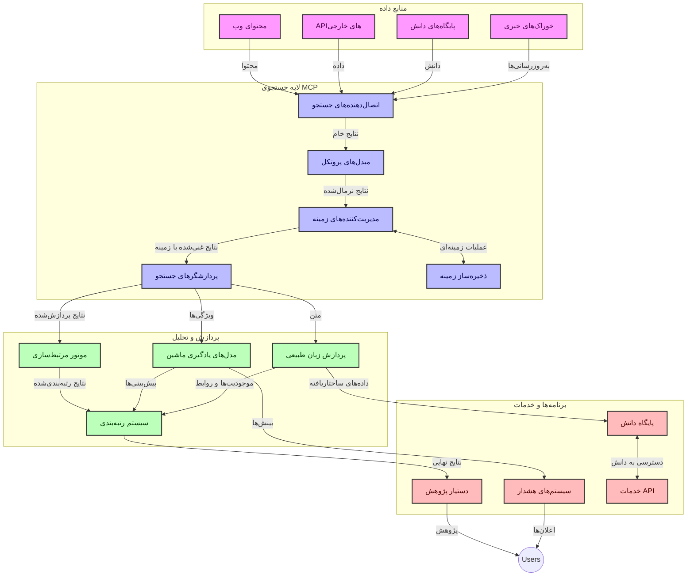
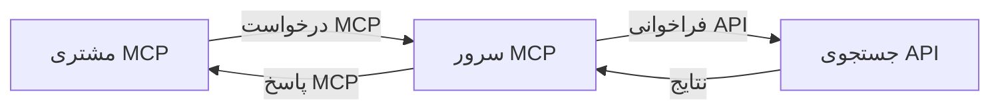
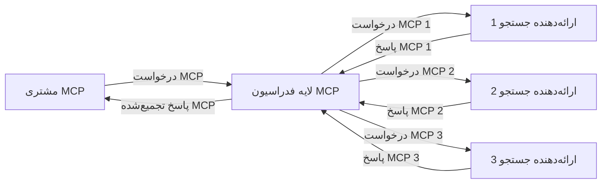
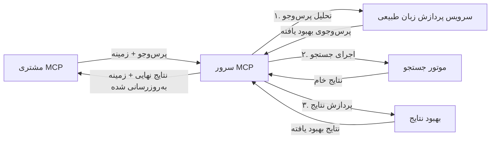

# پروتکل زمینه مدل برای جستجوی وب در زمان واقعی  

## مرور کلی  

جستجوی وب در زمان واقعی در محیط اطلاعات‌محور امروزی ضروری شده است، جایی که برنامه‌ها به دسترسی فوری به اطلاعات به‌روز در سراسر اینترنت نیاز دارند تا پاسخ‌های مرتبط و به موقع ارائه دهند. پروتکل زمینه مدل (MCP) یک پیشرفت مهم در بهینه‌سازی این فرایندهای جستجوی در زمان واقعی است که کارایی جستجو را بهبود می‌بخشد، یکپارچگی زمینه‌ای را حفظ می‌کند و عملکرد کلی سیستم را بالا می‌برد.  

این ماژول بررسی می‌کند که چگونه MCP با فراهم کردن رویکردی استاندارد برای مدیریت زمینه در میان مدل‌های هوش مصنوعی، موتورهای جستجو و برنامه‌ها، جستجوی وب در زمان واقعی را متحول می‌کند.  

### آنچه خواهید آموخت  

در این راهنمای جامع، خواهید یافت:  

- چگونه MCP پل نابی بین مدل‌های هوش مصنوعی و قابلیت‌های جستجوی وب در زمان واقعی ایجاد می‌کند  
- الگوهای معماری برای پیاده‌سازی راه‌حل‌های جستجوی کارآمد و مقیاس‌پذیر با MCP  
- تکنیک‌هایی برای حفظ زمینه جستجو در چندین پرسش و تعامل  
- پیاده‌سازی‌های عملی کد به زبان‌های پایتون و جاوااسکریپت برای سناریوهای مختلف جستجو  
- روش‌هایی برای متعادل‌سازی ارتباط، تازگی و عملکرد در سیستم‌های جستجو مبتنی بر MCP  

## معرفی جستجوی وب در زمان واقعی  

جستجوی وب در زمان واقعی رویکردی فناورانه است که امکان پرس‌وجوی مداوم، پردازش و تحلیل اطلاعات مبتنی بر وب را همزمان با انتشار یا به‌روزرسانی آنها فراهم می‌کند، که سیستم‌ها را قادر می‌سازد با حداقل تأخیر اطلاعات تازه و مرتبط ارائه دهند. بر خلاف سیستم‌های جستجوی سنتی که بر داده‌های نمایه شده کار می‌کنند که ممکن است ساعت‌ها یا روزها قدیمی باشند، جستجوی در زمان واقعی داده‌های زنده وب را پردازش می‌کند و بینش‌ها و اطلاعاتی ارائه می‌دهد که وضعیت فعلی محتوای آنلاین را منعکس می‌کند.  

### مفاهیم اصلی جستجوی وب در زمان واقعی:  

- **پردازش مداوم پرس‌وجو**: پرس‌وجوهای جستجو بر اساس منابع داده‌ای که پیوسته به‌روزرسانی می‌شوند پردازش می‌شوند  
- **اولویت‌بندی تازگی**: سیستم‌ها برای اولویت دادن به اطلاعات تازه طراحی شده‌اند  
- **تعادل ارتباط**: حفظ تعادل بین مرتبط بودن و تازگی  
- **معماری مقیاس‌پذیر**: سیستم‌ها باید بتوانند بارهای متغیر پرس‌وجو و حجم داده‌ها را مدیریت کنند  
- **درک زمینه‌ای**: حفظ زمینه کاربر در طول تکرارهای جستجو برای نتایج معنادار حیاتی است  
- **بازفرمول‌بندی پویا پرس‌وجو**: تعدیل تطبیقی پرس‌وجوها بر اساس زمینه و نتایج قبلی  
- **ادغام چند منبعی**: ترکیب نتایج از چندین ارائه‌دهنده جستجو و منابع وب  
- **درک معنایی**: پردازش پرس‌وجوها و محتوا بر اساس معنی نه صرفاً کلمات کلیدی  
- **رتبه‌بندی در زمان واقعی**: تنظیم مداوم رتبه نتایج هر زمان که اطلاعات جدیدی در دسترس باشد  

### پروتکل زمینه مدل و جستجوی وب در زمان واقعی  

پروتکل زمینه مدل (MCP) چندین چالش حیاتی را در محیط‌های جستجوی وب در زمان واقعی حل می‌کند:  

1. **حفظ زمینه جستجو**: MCP استانداردسازی نحوه نگهداری زمینه بین اجزای پراکنده جستجو را انجام می‌دهد و اطمینان می‌دهد که مدل‌های هوش مصنوعی و گره‌های پردازشی به تاریخچه پرس‌وجوهای مرتبط و ترجیحات کاربر دسترسی دارند.  

2. **مدیریت کارآمد پرس‌وجو**: با فراهم کردن مکانیزم‌های ساختاری برای انتقال زمینه، MCP سربار تکرار زمینه در هر مرحله جستجو را کاهش می‌دهد.  

3. **تعامل‌پذیری**: MCP زبان مشترکی برای اشتراک‌گذاری زمینه بین فناوری‌های جستجوی مختلف و مدل‌های هوش مصنوعی ایجاد می‌کند که معماری‌های منعطف‌تر و توسعه‌پذیرتری را ممکن می‌سازد.  

4. **زمینه بهینه‌سازی‌شده برای جستجو**: پیاده‌سازی‌های MCP می‌توانند عناصر زمینه‌ای که بیشترین ارتباط را برای جستجوی مؤثر دارند اولویت‌بندی کنند و همزمان عملکرد و دقت را بهینه کنند.  

5. **پردازش جستجوی تطبیقی**: با مدیریت مناسب زمینه از طریق MCP، سیستم‌های جستجو می‌توانند بر اساس نیازهای متغیر کاربر و چشم‌انداز اطلاعات، پردازش را به صورت دینامیک تنظیم کنند.  

در برنامه‌های مدرن از جمله تجمیع اخبار تا دستیارهای پژوهش، ادغام MCP با فناوری‌های جستجوی وب جستجویی هوشمندتر، آگاه به زمینه فراهم می‌کند که با ادامه تعاملات کاربر نتایج مرتبط‌تری ارائه می‌دهد.  

## اهداف یادگیری  

تا پایان این درس، شما قادر خواهید بود:  

- اصول جستجوی وب در زمان واقعی و چالش‌های آن در کاربردهای مدرن را درک کنید  
- توضیح دهید چگونه پروتکل زمینه مدل (MCP) قابلیت‌های جستجوی وب در زمان واقعی را بهبود می‌بخشد  
- راه‌حل‌های جستجو مبتنی بر MCP را با استفاده از چارچوب‌ها و APIهای محبوب پیاده‌سازی کنید  
- معماری‌های جستجوی مقیاس‌پذیر و با عملکرد بالا با MCP را طراحی و مستقر کنید  
- مفاهیم MCP را در موارد کاربردی مختلف از جمله جستجوی معنایی، کمک پژوهشی، و مرور وب با تقویت هوش مصنوعی به کار ببرید  
- روندها و نوآوری‌های آینده در فناوری‌های جستجو مبتنی بر MCP را ارزیابی کنید  
- سیستم‌های جستجوی آگاه به زمینه که از تعاملات کاربر می‌آموزند توسعه دهید  
- قابلیت‌های جستجوی وب را با استفاده از پروتکل‌های استاندارد MCP در دستیاران هوش مصنوعی ادغام کنید  
- خطوط لوله جستجوی چندمرحله‌ای بسازید که نتایج را به صورت تدریجی و بر اساس زمینه بهبود می‌بخشند  
- عملکرد جستجو را بهینه کنید در حالی که آگاهی کامل از زمینه حفظ می‌شود  

### تعریف و اهمیت  

جستجوی وب در زمان واقعی شامل پرس‌وجو، بازیابی و ارائه مداوم اطلاعات مبتنی بر وب با حداقل تأخیر است. برخلاف موتورهای جستجوی سنتی که به‌طور دوره‌ای وب را پیمایش و نمایه‌سازی می‌کنند، جستجوی در زمان واقعی هدف دارد اطلاعات را همزمان با در دسترس شدن آشکار کند و دسترسی فوری به جدیدترین محتوا را ممکن سازد.  

ویژگی‌های کلیدی جستجوی وب در زمان واقعی شامل:  

- **تازگی**: اولویت دادن به محتوای تازه و به‌روزرسانی‌ها  
- **پردازش مداوم**: نظارت پیوسته برای اطلاعات جدید  
- **انطباق پرس‌وجو**: اصلاح پرس‌وجوهای جستجو بر اساس زمینه و بازخورد  
- **ارائه فوری**: ارائه نتایج جستجو با کمترین تأخیر  
- **حفظ زمینه**: بنا نهادن بر پرس‌وجوهای قبلی برای مرتبط‌تر شدن بیشتر  

### چالش‌ها در جستجوی وب سنتی  

رویکردهای جستجوی وب سنتی هنگام اعمال در سناریوهای زمان واقعی با محدودیت‌های متعددی روبرو هستند:  

1. **تکه‌تکه شدن زمینه**: دشواری در حفظ زمینه جستجو بین چندین پرس‌وجو  
2. **تازگی اطلاعات**: چالش‌ها در دسترسی و اولویت‌بندی تازه‌ترین اطلاعات  
3. **پیچیدگی ادغام**: مشکلات تعامل‌پذیری بین سیستم‌های جستجو و برنامه‌ها  
4. **مسائل تأخیر**: تعادل بین جامعیت جستجو و الزامات زمان پاسخ  
5. **تنظیم ارتباط**: اطمینان از دقت و ارتباط همزمان با اولویت دادن به تازگی  

## درک پروتکل زمینه مدل (MCP) برای جستجو  

### MCP در زمینه‌های جستجو چیست؟  

پروتکل زمینه مدل (MCP) یک پروتکل ارتباطی استاندارد شده است که به منظور تسهیل تعامل کارآمد بین مدل‌های هوش مصنوعی و برنامه‌ها طراحی شده است. در زمینه جستجوی وب در زمان واقعی، MCP چارچوبی ارائه می‌دهد برای:  

- حفظ زمینه جستجو در طول توالی پرس‌وجو  
- استانداردسازی فرمت‌های پرس‌وجوی جستجو و نتایج  
- بهینه‌سازی انتقال پارامترها و نتایج جستجو  
- تقویت ارتباط بین مدل‌ها و موتورهای جستجو  

### اجزا و معماری اصلی  

معماری MCP برای جستجوی وب در زمان واقعی شامل اجزای کلیدی زیر است:  

1. **مدیران زمینه پرس‌وجو**: مدیریت و نگهداری زمینه جستجو در چندین پرس‌وجو  
2. **پردازشگرهای جستجو**: پردازش درخواست‌های جستجو ورودی با استفاده از تکنیک‌های آگاه به زمینه  
3. **مبدل‌های پروتکل**: تبدیل بین APIهای مختلف جستجو در حالی که زمینه حفظ می‌شود  
4. **مخزن زمینه**: ذخیره و بازیابی کارآمد تاریخچه جستجو و ترجیحات  
5. **اتصالات جستجو**: اتصال به موتورهای جستجو و APIهای وب مختلف  



### چگونه MCP جستجوی وب در زمان واقعی را بهبود می‌بخشد  

MCP چالش‌های جستجوی وب سنتی را از طریق:  

- **ادامه‌داری زمینه‌ای**: حفظ روابط بین پرس‌وجوها در طول کل جلسه جستجو  
- **انتقال بهینه**: کاهش افزونگی در پارامترهای جستجو از طریق مدیریت هوشمند زمینه  
- **رابط‌های استاندارد**: ارائه APIهای سازگار برای اجزای جستجو  
- **کاهش تأخیر**: کمینه کردن سربار پردازش با مدیریت مؤثر زمینه  
- **ارتباط بهبود یافته**: افزایش ارتباط جستجو با حفظ نیت کاربر در پرس‌وجوهای متعدد  


## ادغام و پیاده‌سازی

سیستم‌های جستجوی وب در زمان واقعی نیازمند طراحی معماری و پیاده‌سازی دقیق برای حفظ عملکرد و تمامیت زمینه‌ای هستند. پروتکل مدل زمینه‌ای (Model Context Protocol) رویکردی استاندارد برای ادغام مدل‌های هوش مصنوعی و فناوری‌های جستجو ارائه می‌دهد که امکان ایجاد مسیرهای جستجوی پیچیده و آگاه به زمینه را فراهم می‌آورد.

### مروری بر ادغام MCP در معماری‌های جستجو

پیاده‌سازی MCP در محیط‌های جستجوی وب در زمان واقعی مستلزم چند ملاحظه کلیدی است:

1. **سریالی‌سازی زمینه جستجو**: MCP مکانیزم‌های کارآمدی برای کدگذاری اطلاعات زمینه‌ای در درخواست‌های جستجو فراهم می‌کند، به‌طوری‌که زمینه ضروری در سراسر مسیر پردازش به همراه پرس‌وجو منتقل شود. این شامل فرمت‌های استاندارد برای سریالی‌سازی است که برای فراداده‌های مرتبط با جستجو بهینه شده‌اند.

2. **پردازش حالت‌دار جستجو**: MCP امکان پردازش هوشمندانه‌تر حالت‌دار را با حفظ نمایندگی ثابت زمینه در طول تکرارهای جستجو فراهم می‌آورد. این امر به ویژه در مسیرهای جستجوی چندمرحله‌ای که اصلاح زمینه باعث بهبود نتایج می‌شود، ارزشمند است.

3. **گسترش و اصلاح پرس‌وجو**: پیاده‌سازی‌های MCP در سیستم‌های جستجو می‌توانند توسعه و اصلاح پیچیده پرس‌وجو را بر اساس زمینه انباشته شده تسهیل کنند، که اجازه ارائه نتایج مرتبط‌تر را در طول جلسه جستجو می‌دهد.

4. **کش و اولویت‌بندی نتایج**: با استانداردسازی مدیریت زمینه، MCP به مدیریت کش نتایج و اولویت‌بندی کمک می‌کند تا اجزا بتوانند بر اساس تغییر زمینه جستجو سازگار شوند.

5. **فدراسیون و تجمیع جستجو**: MCP فدراسیون پیچیده‌تر جستجو را در چندین بک‌اند ممکن می‌سازد، با ارائه نمایندگی‌های ساختاریافته از زمینه جستجو، که امکان تجمیع معنادارتر نتایج از منابع مختلف را فراهم می‌کند.

پیاده‌سازی MCP در فناوری‌های مختلف جستجو رویکردی یکپارچه به مدیریت زمینه ایجاد می‌کند، نیاز به کد ادغام سفارشی را کاهش داده و توانایی سیستم در حفظ زمینه معنادار در طی تکامل پرس‌وجوی جستجو را بهبود می‌بخشد.

### MCP در پیاده‌سازی‌های مختلف جستجوی وب

این نمونه‌ها بر اساس مشخصات فعلی MCP هستند که تمرکز بر پروتکل مبتنی بر JSON-RPC با مکانیزم‌های انتقال متمایز دارد. کد نشان می‌دهد چگونه می‌توان ادغام‌های جستجوی سفارشی را در حالی که سازگاری کامل با پروتکل MCP حفظ می‌شود، پیاده کرد.


<details>
<summary>پیاده‌سازی پایتون با API جستجوی عمومی</summary>

```python
import asyncio
import json
import aiohttp
from typing import Dict, Any, Optional, List
from contextlib import asynccontextmanager
from collections.abc import AsyncIterator

# وارد کردن کتابخانه‌های استاندارد MCP
from mcp.client.session import ClientSession
from mcp.client.streamable_http import streamablehttp_client
from mcp.types import TextContent, CreateMessageRequestParams, CreateMessageResult
from mcp.server.fastmcp import FastMCP

# ایجاد یک سرور FastMCP برای جستجو در وب
search_server = FastMCP("WebSearch")

# کلاس برای مدیریت عملیات جستجوی وب
class WebSearchHandler:
    def __init__(self, api_endpoint: str, api_key: str):
        self.api_endpoint = api_endpoint
        self.api_key = api_key
        self.session = None
        
    async def initialize(self):
        """Initialize the HTTP session"""
        self.session = aiohttp.ClientSession(
            headers={"Authorization": f"Bearer {self.api_key}"}
        )
    
    async def close(self):
        """Close the HTTP session"""
        if self.session:
            await self.session.close()
            
    async def perform_search(self, query: str, max_results: int = 5, 
                           include_domains: List[str] = None, 
                           exclude_domains: List[str] = None,
                           time_period: str = "any") -> Dict[str, Any]:
        """Perform web search using the search API"""
        # ساخت پارامترهای جستجو
        search_params = {
            "q": query,
            "limit": max_results,
            "time": time_period
        }
        
        if include_domains:
            search_params["site"] = ",".join(include_domains)
            
        if exclude_domains:
            search_params["exclude_site"] = ",".join(exclude_domains)
        
        # انجام درخواست جستجو
        try:
            async with self.session.get(
                self.api_endpoint,
                params=search_params
            ) as response:
                if response.status != 200:
                    error_text = await response.text()
                    raise Exception(f"Search API error: {response.status} - {error_text}")
                
                search_data = await response.json()
                
                # تبدیل پاسخ خاص API به فرمت استاندارد
                results = []
                for item in search_data.get("results", []):
                    results.append({
                        "title": item.get("title", ""),
                        "url": item.get("url", ""),
                        "snippet": item.get("snippet", ""),
                        "date": item.get("published_date", ""),
                        "source": item.get("source", "")
                    })
                
                return {
                    "query": query,
                    "totalResults": len(results),
                    "results": results
                }
        except Exception as e:
            print(f"Search API request error: {e}")
            raise

# مقداردهی اولیه کنترل‌کننده جستجو
search_handler = WebSearchHandler(
    api_endpoint="https://api.search-service.example/search",
    api_key="your-api-key-here"
)

# تنظیم مدت زمان عمر برای مدیریت کنترل‌کننده جستجو
@asyncio.asynccontextmanager
async def app_lifespan(server: FastMCP):
    """Manage application lifecycle"""
    await search_handler.initialize()
    try:
        yield {"search_handler": search_handler}
    finally:
        await search_handler.close()

# تعیین مدت زمان عمر برای سرور
search_server = FastMCP("WebSearch", lifespan=app_lifespan)

# ثبت یک ابزار جستجوی وب
@search_server.tool()
async def web_search(query: str, max_results: int = 5, 
                   include_domains: List[str] = None,
                   exclude_domains: List[str] = None,
                   time_period: str = "any") -> Dict[str, Any]:
    """
    Search the web for information
    
    Args:
        query: The search query
        max_results: Maximum number of results to return (default: 5)
        include_domains: List of domains to include in search results
        exclude_domains: List of domains to exclude from search results
        time_period: Time period for results ("day", "week", "month", "any")
        
    Returns:
        Dictionary containing search results
    """
    ctx = search_server.get_context()
    search_handler = ctx.request_context.lifespan_context["search_handler"]
    
    results = await search_handler.perform_search(
        query=query,
        max_results=max_results,
        include_domains=include_domains,
        exclude_domains=exclude_domains,
        time_period=time_period
    )
    
    return results

# مثال استفاده مشتری
async def client_example():
    # اتصال به سرور جستجو با استفاده از انتقال HTTP قابل استریم
    async with streamablehttp_client("http://localhost:8000/mcp") as (read, write, _):
        async with ClientSession(read, write) as session:
            # مقداردهی اولیه اتصال
            await session.initialize()
            
            # فراخوانی ابزار web_search
            search_results = await session.call_tool(
                "web_search", 
                {
                    "query": "latest developments in AI and Model Context Protocol",
                    "max_results": 5,
                    "time_period": "day",
                    "include_domains": ["github.com", "microsoft.com"]
                }
            )
            
            print(f"Search results: {search_results}")

# نمونه اجرای سرور
if __name__ == "__main__":
    # اجرای سرور با انتقال HTTP قابل استریم
    search_server.run(transport="streamable-http")
```
</details> 

<details>
<summary>پیاده‌سازی جاوااسکریپت با جستجوی مبتنی بر مرورگر</summary>


```javascript
// پیاده‌سازی سرور MCP برای جستجوی وب
import { McpServer, ResourceTemplate } from '@modelcontextprotocol/sdk/server/mcp.js';
import { StreamableHTTPServerTransport } from '@modelcontextprotocol/sdk/server/streamableHttp.js';
import { z } from 'zod';

// ایجاد سرور MCP برای جستجوی وب
const searchServer = new McpServer({
    name: "BrowserSearch",
    description: "A server that provides web search capabilities"
});

// کلاس سرویس جستجو
class SearchService {
    constructor(searchApiUrl, apiKey) {
        this.searchApiUrl = searchApiUrl;
        this.apiKey = apiKey;
    }

    async performSearch(parameters) {
        const {
            query = '',
            maxResults = 5,
            includeDomains = [],
            excludeDomains = [],
            timePeriod = 'any'
        } = parameters;
        
        // ساخت URL جستجو با پارامترها
        const url = new URL(this.searchApiUrl);
        url.searchParams.append('q', query);
        url.searchParams.append('limit', maxResults);
        url.searchParams.append('time', timePeriod);
        
        if (includeDomains.length > 0) {
            url.searchParams.append('site', includeDomains.join(','));
        }
        
        if (excludeDomains.length > 0) {
            url.searchParams.append('exclude_site', excludeDomains.join(','));
        }
        
        try {
            const response = await fetch(url.toString(), {
                method: 'GET',
                headers: {
                    'Authorization': `Bearer ${this.apiKey}`,
                    'Content-Type': 'application/json'
                }
            });
            
            if (!response.ok) {
                const errorText = await response.text();
                throw new Error(`Search API error: ${response.status} - ${errorText}`);
            }
            
            const searchData = await response.json();
            
            // تبدیل پاسخ مخصوص API به فرمت استاندارد
            const results = searchData.results?.map(item => ({
                title: item.title || '',
                url: item.url || '',
                snippet: item.snippet || '',
                date: item.published_date || '',
                source: item.source || ''
            })) || [];
            
            return {
                query,
                totalResults: results.length,
                results
            };
        } catch (error) {
            console.error('Search API request error:', error);
            throw error;
        }
    }
}

// مقداردهی اولیه سرویس جستجو
const searchService = new SearchService(
    'https://api.search-service.example/search',
    'your-api-key-here'
);

// تنظیم فراهم‌کننده context برای سرور
searchServer.setContextProvider(() => {
    return {
        searchService
    };
});

// ثبت ابزار جستجوی وب
searchServer.tool({
    name: 'web_search',
    description: 'Search the web for information',
    parameters: {
        type: 'object',
        properties: {
            query: {
                type: 'string',
                description: 'The search query'
            },
            maxResults: {
                type: 'integer',
                description: 'Maximum number of results to return',
                default: 5
            },
            includeDomains: {
                type: 'array',
                items: { type: 'string' },
                description: 'List of domains to include in search results'
            },
            excludeDomains: {
                type: 'array',
                items: { type: 'string' },
                description: 'List of domains to exclude from search results'
            },
            timePeriod: {
                type: 'string',
                description: 'Time period for results',
                enum: ['day', 'week', 'month', 'any'],
                default: 'any'
            }
        },
        required: ['query']
    },
    handler: async (params, context) => {
        const { searchService } = context;
        return await searchService.performSearch(params);
    }
});

// نمونه کد کلاینت برای اتصال به سرور جستجو
import { Client } from '@modelcontextprotocol/sdk/client/index.js';
import { StreamableHTTPClientTransport } from '@modelcontextprotocol/sdk/client/streamableHttp.js';

async function connectToSearchServer() {
    // اتصال به سرور جستجو
    const transport = new StreamableHTTPClientTransport(
        new URL('http://localhost:8000/mcp')
    );
    
    const client = new Client({
        name: 'search-client',
        version: '1.0.0'
    });
    
    await client.connect(transport);
    
    // اجرای ابزار جستجو
    const searchResults = await client.callTool({
        name: 'web_search',
        arguments: {
            query: 'Model Context Protocol implementation examples',
            maxResults: 10,
            timePeriod: 'week',
            includeDomains: ['github.com', 'docs.microsoft.com']
        }
    });
    
    console.log('Search results:', searchResults);
    
    // پاکسازی
    await client.disconnect();
}

// راه‌اندازی سرور
const transport = new StreamableHTTPServerTransport();
await searchServer.connect(transport);
console.log('Search server running at http://localhost:8000/mcp');

// در یک فرآیند جداگانه یا بعد از راه‌اندازی سرور
// connectToSearchServer().catch(console.error);
```
</details> 


## نکته در مورد نمونه‌های کد

> **نکته مهم**: نمونه‌های کد زیر نشان‌دهنده ادغام پروتکل مدل زمینه‌ای (MCP) با عملکرد جستجوی وب هستند. در حالی که این نمونه‌ها الگوها و ساختارهای SDKهای رسمی MCP را دنبال می‌کنند، به منظور آموزش ساده‌سازی شده‌اند.
> 
> این نمونه‌ها شامل موارد زیر هستند:
> 
> 1. **پیاده‌سازی پایتون**: پیاده‌سازی سرور FastMCP که ابزار جستجوی وب را فراهم کرده و به API جستجوی خارجی متصل می‌شود. این نمونه مدیریت چرخه عمر، مدیریت زمینه و پیاده‌سازی ابزار را بر اساس الگوهای [SDK رسمی پایتون MCP](https://github.com/modelcontextprotocol/python-sdk) نشان می‌دهد. سرور از انتقال HTTP استریم‌شونده توصیه‌شده استفاده می‌کند که جایگزین انتقال SSE قدیمی در پیاده‌سازی‌های تولیدی شده است.
> 
> 2. **پیاده‌سازی جاوااسکریپت**: پیاده‌سازی TypeScript/JavaScript با الگوی FastMCP از [SDK رسمی TypeScript MCP](https://github.com/modelcontextprotocol/typescript-sdk) برای ایجاد سرور جستجو با تعریف ابزارهای مناسب و اتصال مشتری. این الگوهای جدید مدیریت نشست و حفظ زمینه را دنبال می‌کند.
> 
> این نمونه‌ها به مدیریت خطا، احراز هویت و کد ادغام API خاص اضافی برای استفاده در تولید نیاز دارند. نقطه پایانی API جستجویی که نشان داده شده (`https://api.search-service.example/search`) فقط نمونه است و باید با نقاط پایانی واقعی سرویس جستجو جایگزین شود.
> 
> برای جزئیات کامل پیاده‌سازی و جدیدترین روش‌ها به [مشخصات رسمی MCP](https://spec.modelcontextprotocol.io/) و مستندات SDK مراجعه کنید.

## مفاهیم اصلی

### چارچوب پروتکل مدل زمینه‌ای (MCP)

در بنیاد خود، پروتکل مدل زمینه‌ای روشی استاندارد برای تبادل زمینه بین مدل‌های هوش مصنوعی، برنامه‌ها و خدمات فراهم می‌کند. در جستجوی وب در زمان واقعی، این چارچوب برای ایجاد تجربیات جستجوی چند مرحله‌ای هماهنگ ضروری است. اجزای کلیدی شامل:

1. **معماری مشت客户-سرور**: MCP جداسازی واضح بین مشتریان جستجو (درخواست‌کننده) و سرورهای جستجو (ارائه‌دهنده) ایجاد می‌کند که امکان مدل‌های استقرار انعطاف‌پذیر را می‌دهد.

2. **ارتباط JSON-RPC**: این پروتکل از JSON-RPC برای تبادل پیام استفاده می‌کند که با فناوری‌های وب سازگار بوده و پیاده‌سازی آن در پلتفرم‌های مختلف ساده است.

3. **مدیریت زمینه**: MCP روش‌های ساختاریافته‌ای برای حفظ، به‌روزرسانی و بهره‌برداری از زمینه جستجو در چند تعامل تعریف می‌کند.

4. **تعریف ابزارها**: قابلیت‌های جستجو به‌صورت ابزارهای استاندارد با پارامترها و مقادیر بازگشتی مشخص ارائه می‌شوند.

5. **پشتیبانی از استریمینگ**: این پروتکل از نتایج استریم‌شونده پشتیبانی می‌کند که برای جستجوی زمان واقعی که نتایج به صورت تدریجی می‌رسند ضروری است.

### الگوهای ادغام جستجوی وب

هنگام ادغام MCP با جستجوی وب، چند الگو شکل می‌گیرند:

#### 1. ادغام مستقیم با ارائه‌دهنده جستجو



در این الگو، سرور MCP مستقیماً با یک یا چند API جستجو تعامل دارد، درخواست‌های MCP را به فراخوانی‌های مخصوص API ترجمه کرده و نتایج را به صورت پاسخ‌های MCP قالب‌بندی می‌کند.

#### 2. جستجوی فدرال با حفظ زمینه



این الگو پرس‌وجوهای جستجو را در چند ارائه‌دهنده سازگار با MCP توزیع می‌کند، هر کدام ممکن است در انواع مختلف محتوا یا قابلیت‌های جستجو تخصص داشته باشند، در حالی که زمینه یکپارچه را حفظ می‌کنند.

#### 3. زنجیره جستجو با زمینه افزوده



در این الگو فرآیند جستجو به چند مرحله تقسیم می‌شود، با زمینه‌ای که در هر گام غنی می‌شود و در نتیجه نتایجی به تدریج مرتبط‌تر ارائه می‌دهد.

### اجزای زمینه جستجو

در جستجوی وب مبتنی بر MCP، زمینه معمولاً شامل:

- **تاریخچه پرس‌وجو**: پرس‌وجوهای قبلی در جلسه
- **اولویت‌های کاربر**: زبان، منطقه، تنظیمات جستجوی ایمن
- **تاریخچه تعامل**: کدام نتایج کلیک شده‌اند، مدت زمان صرف شده برای نتایج
- **پارامترهای جستجو**: فیلترها، ترتیب‌بندی‌ها و سایر اصلاح‌کننده‌های جستجو
- **دانش حوزه‌ای**: زمینه موضوعی مرتبط با جستجو
- **زمینه زمانی**: عوامل مرتبط با زمان
- **اولویت‌های منبع**: منابع اطلاعاتی مورد اعتماد یا ترجیحی

## موارد استفاده و کاربردها

### پژوهش و جمع‌آوری اطلاعات

MCP جریان‌های کاری پژوهش را با موارد زیر بهبود می‌بخشد:

- حفظ زمینه پژوهشی در جلسات جستجو
- امکان پرس‌وجوهای پیچیده‌تر و مرتبط با زمینه
- پشتیبانی از فدراسیون جستجو با چند منبع
- تسهیل استخراج دانش از نتایج جستجو

### رصد اخبار و روندها در زمان واقعی

جستجوی مبتنی بر MCP مزایایی برای رصد اخبار دارد:

- کشف نزدیک به زمان واقعی داستان‌های خبری نوظهور
- فیلتر زمینه‌ای اطلاعات مرتبط
- دنبال‌کردن موضوعات و نهادها در چندین منبع
- هشدارهای خبری شخصی‌سازی شده بر اساس زمینه کاربر

### مرور و پژوهش افزوده شده با هوش مصنوعی

MCP امکانات جدیدی برای مرور افزوده شده به کمک هوش مصنوعی ایجاد می‌کند:

- پیشنهادهای جستجوی زمینه‌ای بر اساس فعالیت فعلی مرورگر
- ادغام بدون درز جستجوی وب با دستیاران مجهز به مدل‌های زبان بزرگ
- اصلاح جستجوی چند مرحله‌ای با حفظ زمینه
- بهبود تایید و راستی‌آزمایی اطلاعات

## روندها و نوآوری‌های آینده

### تکامل MCP در جستجوی وب

در نگاه آینده، انتظار می‌رود MCP به مسائل زیر پاسخ دهد:


- **جستجوی چندرسانه‌ای**: ادغام جستجوی متن، تصویر، صدا و ویدئو با حفظ زمینه
- **جستجوی غیرمتمرکز**: پشتیبانی از اکوسیستم‌های جستجوی توزیع شده و فدرال
- **حفظ حریم خصوصی جستجو**: مکانیزم‌های جستجو با حفظ حریم خصوصی آگاه به زمینه
- **درک پرسش**: تجزیه و تحلیل معنایی عمیق پرسش‌های جستجوی زبان طبیعی

### پیشرفت‌های محتمل در فناوری

فناوری‌های نوظهوری که آینده جستجوی MCP را شکل خواهند داد:

1. **معماری‌های جستجوی عصبی**: سیستم‌های جستجوی مبتنی بر جاسازی بهینه‌شده برای MCP
2. **زمینه جستجوی شخصی‌سازی‌شده**: یادگیری الگوهای جستجوی فردی کاربران در طول زمان
3. **ادغام گراف دانش**: جستجوی زمینه‌ای بهبود یافته با گراف‌های دانش حوزه-محور
4. **زمینه چندرسانه‌ای**: حفظ زمینه در سراسر رسانا‌های جستجوی مختلف

## تمرین‌های عملی

### تمرین ۱: راه‌اندازی یک خط لوله جستجوی پایه MCP

در این تمرین، خواهید آموخت چگونه:
- یک محیط جستجوی پایه MCP را پیکربندی کنید
- هندلرهای زمینه‌ای برای جستجوی وب پیاده‌سازی کنید
- حفظ زمینه در طول تکرارهای جستجو را تست و اعتبارسنجی کنید

### تمرین ۲: ساخت دستیار پژوهشی با جستجوی MCP

یک اپلیکیشن کامل بسازید که:
- پرسش‌های پژوهشی زبان طبیعی را پردازش کند
- جستجوهای وب آگاه به زمینه را انجام دهد
- اطلاعات را از منابع متعدد ترکیب کند
- یافته‌های پژوهشی سازمان‌یافته ارائه دهد

### تمرین ۳: پیاده‌سازی اتحاد جستجو چندمنبعی با MCP

تمرین پیشرفته شامل:
- ارسال پرسش آگاه به زمینه به موتورهای جستجوی متعدد
- رتبه‌بندی و تجمیع نتایج
- حذف تکراری‌های متنی نتایج جستجو
- مدیریت فراداده‌های مخصوص منبع

## منابع بیشتر

- [مشخصات پروتکل زمینه مدل](https://spec.modelcontextprotocol.io/) - مشخصات رسمی MCP و مستندات جزئی پروتکل
- [مستندات پروتکل زمینه مدل](https://modelcontextprotocol.io/) - آموزش‌ها و راهنمای اجرای دقیق
- [کتابخانه پایتون MCP](https://github.com/modelcontextprotocol/python-sdk) - پیاده‌سازی رسمی MCP به زبان پایتون
- [کتابخانه تایپ‌اسکریپت MCP](https://github.com/modelcontextprotocol/typescript-sdk) - پیاده‌سازی رسمی MCP به زبان تایپ‌اسکریپت
- [سرورهای مرجع MCP](https://github.com/modelcontextprotocol/servers) - پیاده‌سازی‌های مرجع سرورهای MCP
- [مستندات API جستجوی وب بینگ](https://learn.microsoft.com/en-us/bing/search-apis/bing-web-search/overview) - API جستجوی وب مایکروسافت
- [API جستجوی سفارشی JSON گوگل](https://developers.google.com/custom-search/v1/overview) - موتور جستجوی برنامه‌ریزی شده گوگل
- [مستندات SerpAPI](https://serpapi.com/search-api) - API صفحه نتایج موتور جستجو
- [مستندات Meilisearch](https://www.meilisearch.com/docs) - موتور جستجوی متن‌باز
- [مستندات Elasticsearch](https://www.elastic.co/guide/index.html) - موتور جستجو و تحلیل توزیع شده
- [مستندات LangChain](https://python.langchain.com/docs/get_started/introduction) - ساخت برنامه‌ها با مدل‌های زبان بزرگ (LLMs)

## نتایج یادگیری

با اتمام این ماژول، خواهید توانست:

- اصول اولیه جستجوی وب در زمان واقعی و چالش‌های آن را درک کنید
- توضیح دهید چگونه پروتکل زمینه مدل (MCP) قابلیت‌های جستجوی وب در زمان واقعی را بهبود می‌بخشد
- راهکارهای جستجو مبتنی بر MCP را با استفاده از چهارچوب‌ها و APIهای محبوب پیاده‌سازی کنید
- معماری‌های جستجوی مقیاس‌پذیر و با عملکرد بالا را با MCP طراحی و مستقر کنید
- مفاهیم MCP را در موارد استفاده مختلف از جمله جستجوی معنایی، دستیار پژوهشی و مرور افزوده با هوش مصنوعی اعمال کنید
- روندهای نوظهور و نوآوری‌های آینده در فناوری‌های جستجو مبتنی بر MCP را ارزیابی کنید


### ملاحظات اعتماد و ایمنی

هنگام پیاده‌سازی راهکارهای جستجوی وب مبتنی بر MCP، این اصول مهم را از مشخصات MCP به یاد داشته باشید:

1. **رضایت و کنترل کاربر**: کاربران باید صریحاً رضایت دهند و همه دسترسی‌ها و عملیات داده را بفهمند. این موضوع برای پیاده‌سازی‌های جستجوی وب که به منابع داده خارجی دسترسی دارند بسیار مهم است.

2. **حریم خصوصی داده‌ها**: اطمینان حاصل کنید که پرسش‌ها و نتایج جستجو به‌طور مناسب مدیریت می‌شوند، به ویژه زمانی که ممکن است شامل اطلاعات حساس باشند. کنترل‌های دسترسی مناسب برای حفاظت از داده‌های کاربر اجرا کنید.

3. **ایمنی ابزارها**: مجوزدهی و اعتبارسنجی مناسب برای ابزارهای جستجو را پیاده‌سازی کنید، زیرا آنها می‌توانند خطرات امنیتی بالقوه‌ای از طریق اجرای کد دلخواه ایجاد کنند. توضیحات رفتار ابزار باید بی‌اعتماد تلقی شود مگر اینکه از سرور قابل اعتماد دریافت شده باشد.

4. **مستندات واضح**: مستندات روشنی درباره قابلیت‌ها، محدودیت‌ها و ملاحظات امنیتی پیاده‌سازی جستجوی مبتنی بر MCP خود ارائه دهید، مطابق با دستورالعمل‌های اجرای مشخصات MCP.

5. **جریان‌های رضایت قوی**: جریان‌های رضایت و مجوز robust بسازید که به وضوح توضیح دهد هر ابزار پیش از اخذ مجوز چه کاری انجام می‌دهد، به ویژه برای ابزارهایی که با منابع وب خارجی تعامل دارند.

برای جزئیات کامل درباره امنیت و ملاحظات اعتماد MCP، به [مستندات رسمی](https://modelcontextprotocol.io/specification/2025-11-25/basic/security_best_practices) مراجعه کنید.

## گام بعدی

- [5.12 احراز هویت Entra ID برای سرورهای پروتکل زمینه مدل](../mcp-security-entra/README.md)

---

<!-- CO-OP TRANSLATOR DISCLAIMER START -->
**سلب مسئولیت**:
این سند با استفاده از سرویس ترجمه هوش مصنوعی [Co-op Translator](https://github.com/Azure/co-op-translator) ترجمه شده است. در حالی که ما در تلاش برای دقت هستیم، لطفاً توجه داشته باشید که ترجمه‌های خودکار ممکن است شامل خطاها یا نادرستی‌هایی باشند. سند اصلی به زبان مادری خود باید به عنوان منبع معتبر در نظر گرفته شود. برای اطلاعات حیاتی، ترجمه حرفه‌ای انسانی توصیه می‌شود. ما در قبال هرگونه سوء تفاهم یا برداشت نادرست ناشی از استفاده از این ترجمه مسئولیتی نداریم.
<!-- CO-OP TRANSLATOR DISCLAIMER END -->