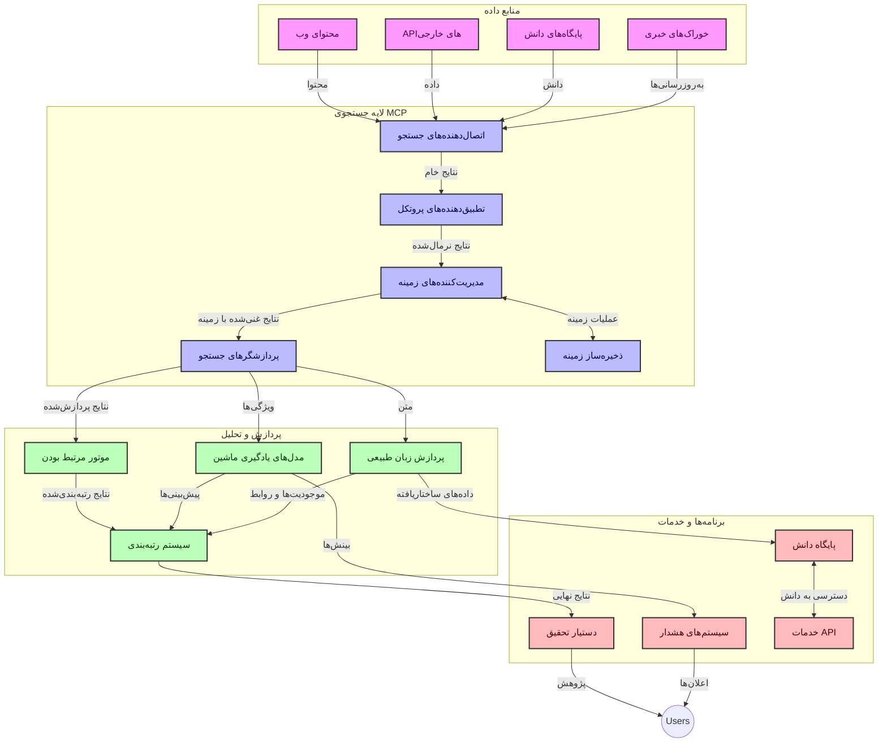
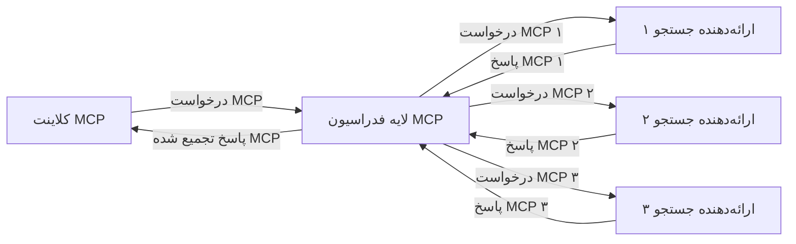
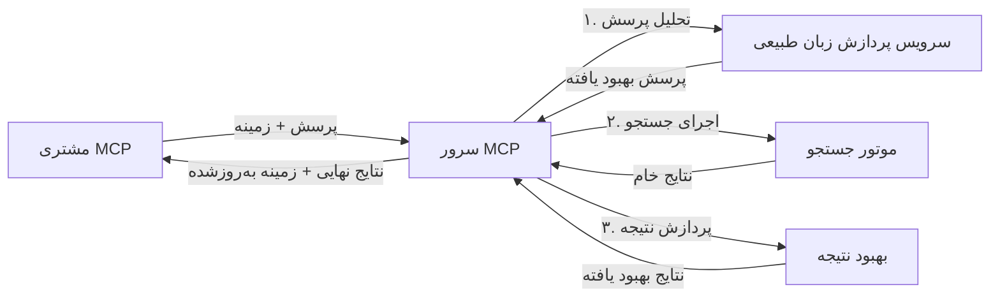

# پروتکل زمینه مدل برای جستجوی وب در زمان واقعی

## مرور کلی

جستجوی وب در زمان واقعی در محیط اطلاعات‌محور امروزی ضروری شده است، جایی که برنامه‌ها نیاز دارند به اطلاعات به‌روز از سراسر اینترنت فوراً دسترسی داشته باشند تا پاسخ‌های مرتبط و به‌موقع ارائه کنند. پروتکل زمینه مدل (MCP) پیشرفت قابل‌توجهی در بهینه‌سازی این فرآیندهای جستجوی زمان واقعی ارائه می‌دهد، باعث افزایش کارایی جستجو، حفظ یکپارچگی زمینه‌ای و بهبود عملکرد کلی سیستم می‌شود.

این ماژول بررسی می‌کند که چگونه MCP جستجوی وب در زمان واقعی را با ارائه رویکردی استاندارد برای مدیریت زمینه در مدل‌های هوش مصنوعی، موتورهای جستجو و برنامه‌ها متحول می‌کند.

### آنچه خواهید آموخت

در این راهنمای جامع، موارد زیر را خواهید آموخت:

- چگونه MCP پلی یکپارچه بین مدل‌های هوش مصنوعی و قابلیت‌های جستجوی وب در زمان واقعی ایجاد می‌کند  
- الگوهای معماری برای پیاده‌سازی راه‌حل‌های جستجوی کارآمد و مقیاس‌پذیر با MCP  
- تکنیک‌های حفظ زمینه جستجو در پرس‌وجوها و تعاملات متعدد  
- پیاده‌سازی‌های عملی کد در پایتون و جاوااسکریپت برای سناریوهای مختلف جستجو  
- روش‌هایی برای متعادل‌سازی ارتباط، تازگی و عملکرد در سیستم‌های جستجوی مبتنی بر MCP  

## مقدمه‌ای بر جستجوی وب در زمان واقعی

جستجوی وب در زمان واقعی رویکرد فناورانه‌ای است که امکان پرس‌وجوی مداوم، پردازش و تحلیل اطلاعات مبتنی بر وب را هنگام انتشار یا به‌روزرسانی فراهم می‌کند، که باعث می‌شود سیستم‌ها بتوانند اطلاعات تازه و مرتبط را با تأخیر کم ارائه کنند. برخلاف سیستم‌های جستجوی سنتی که بر داده‌های فهرست‌شده کار می‌کنند و ممکن است چند ساعت یا روز قدیمی باشند، جستجوی زمان واقعی داده‌های فعلی وب را پردازش می‌کند و بینش‌ها و اطلاعاتی ارائه می‌دهد که بازتاب دهنده وضعیت کنونی محتوای آنلاین هستند.

### مفاهیم اصلی جستجوی وب در زمان واقعی:

- **پردازش مداوم پرس‌وجو**: پرس‌وجوهای جستجو در برابر منابع داده‌ای که به طور مداوم به‌روزرسانی می‌شوند، پردازش می‌شوند  
- **اولویت‌دهی تازگی**: سیستم‌ها برای اولویت دادن به اطلاعات تازه طراحی شده‌اند  
- **متعادل‌سازی ارتباط**: حفظ تعادل بین ارتباط و تازگی  
- **معماری مقیاس‌پذیر**: سیستم‌ها باید بارهای پرس‌وجوی متغیر و حجم داده‌ها را مدیریت کنند  
- **درک زمینه‌ای**: حفظ زمینه کاربر در طول تکرارهای جستجو برای نتایج معنادار ضروری است  
- **بازفرموله دینامیک پرس‌وجو**: اصلاح تطبیقی پرس‌وجوها بر اساس زمینه و نتایج قبلی  
- **یکپارچه‌سازی چند منبع**: ترکیب نتایج از چندین ارائه‌دهنده جستجو و منابع وب  
- **درک معنایی**: پردازش پرس‌وجوها و محتوا بر اساس معنا به‌جای صرفاً کلمات کلیدی  
- **رتبه‌بندی زمان واقعی**: تنظیم مداوم رتبه‌بندی نتایج با در دسترس قرار گرفتن اطلاعات جدید  

### پروتکل زمینه مدل و جستجوی وب در زمان واقعی

پروتکل زمینه مدل (MCP) به چندین چالش حیاتی در محیط‌های جستجوی وب زمان واقعی پاسخ می‌دهد:

1. **حفظ زمینه جستجو**: MCP نحوه حفظ زمینه در اجزای توزیع‌شده جستجو را استاندارد می‌کند تا اطمینان حاصل شود مدل‌های هوش مصنوعی و نودهای پردازشی به تاریخچه پرس‌وجوی مرتبط و ترجیحات کاربر دسترسی دارند.

2. **مدیریت کارآمد پرس‌وجو**: با فراهم آوردن مکانیزم‌های ساختاریافته برای انتقال زمینه، MCP بار اضافه تکرار زمینه در هر دور جستجو را کاهش می‌دهد.

3. **تعامل‌پذیری**: MCP زبان مشترکی برای اشتراک‌گذاری زمینه بین فناوری‌های متنوع جستجو و مدل‌های هوش مصنوعی ایجاد می‌کند که معماری‌های منعطف‌تر و قابل گسترش‌تر را ممکن می‌سازد.

4. **زمینه بهینه‌شده برای جستجو**: پیاده‌سازی‌های MCP می‌توانند اولویت‌بندی کنند کدام عناصر زمینه برای جستجوی مؤثر اهمیت بیشتری دارند و هم برای عملکرد و هم دقت بهینه‌سازی کنند.

5. **پردازش تطبیقی جستجو**: با مدیریت صحیح زمینه از طریق MCP، سیستم‌های جستجو می‌توانند پردازش را بر اساس نیازهای در حال تحول کاربر و چشم‌انداز اطلاعات تطبیق دهند.

در برنامه‌های مدرن که از تجمیع اخبار تا دستیاران تحقیقاتی متغیرند، ادغام MCP با فناوری‌های جستجوی وب امکان جستجوی هوشمندتر، زمینه‌محور و ارائه نتایج مرتبط‌تر را با ادامه تعاملات کاربر فراهم می‌کند.

## اهداف آموزشی

تا پایان این درس، شما قادر خواهید بود:

- اصول پایه جستجوی وب در زمان واقعی و چالش‌های آن را در برنامه‌های مدرن بفهمید  
- توضیح دهید چگونه پروتکل زمینه مدل (MCP) قابلیت‌های جستجوی وب زمان واقعی را بهبود می‌بخشد  
- راه‌حل‌های جستجو مبتنی بر MCP را با استفاده از فریم‌ورک‌ها و APIهای محبوب پیاده‌سازی کنید  
- معماری‌های جستجوی مقیاس‌پذیر و با کارایی بالا را با MCP طراحی و پیاده‌سازی و مستقر کنید  
- مفاهیم MCP را در استفاده‌های مختلف از جمله جستجوی معنایی، کمک تحقیقاتی، و مرور مبتنی بر هوش مصنوعی اعمال کنید  
- روندهای نوظهور و نوآوری‌های آینده در فناوری‌های جستجوی مبتنی بر MCP را ارزیابی کنید  
- سیستم‌های جستجوی زمینه‌آگاه را توسعه دهید که از تعاملات کاربر یاد می‌گیرند  
- قابلیت‌های جستجوی وب را با استفاده از پروتکل‌های استاندارد MCP در دستیاران هوش مصنوعی ادغام کنید  
- خطوط جستجوی چند مرحله‌ای ایجاد کنید که نتایج را به تدریج بر اساس زمینه بهبود می‌بخشند  
- عملکرد جستجو را با حفظ جامع آگاهی از زمینه بهینه‌سازی کنید  

### تعریف و اهمیت

جستجوی وب در زمان واقعی شامل پرس‌وجوی مداوم، بازیابی و تحویل اطلاعات مبتنی بر وب با کم‌ترین تأخیر است. برخلاف موتورهای جستجوی سنتی که به‌طور دوره‌ای وب را ردگیری و فهرست می‌کنند، جستجوی زمان واقعی هدف دارد اطلاعات را بلافاصله پس از دسترس قرار گرفتن ارائه دهد و دسترسی فوری به جدیدترین محتوا را ممکن سازد.

ویژگی‌های کلیدی جستجوی وب در زمان واقعی شامل موارد زیر است:

- **تازگی**: اولویت دادن به محتوای تازه و به‌روزرسانی‌ها  
- **پردازش مداوم**: نظارت مستمر برای یافتن اطلاعات جدید  
- **انطباق پرس‌وجو**: بهبود پرس‌وجوهای جستجو بر اساس زمینه و بازخورد  
- **تحویل فوری**: ارائه نتایج جستجو با کم‌ترین تأخیر  
- **حفظ زمینه**: ساخت بر اساس پرس‌وجوهای قبلی برای ارتباط بهتر  

### چالش‌های جستجوی وب سنتی

رویکردهای سنتی جستجوی وب با چندین محدودیت هنگام اعمال در سناریوهای زمان واقعی روبه‌رو هستند:

1. **تکه‌تکه شدن زمینه**: دشواری در حفظ زمینه جستجو میان پرس‌وجوهای متعدد  
2. **تازگی اطلاعات**: چالش در دسترسی و اولویت‌بندی تازه‌ترین اطلاعات  
3. **پیچیدگی یکپارچه‌سازی**: مشکلات در تعامل و سازگاری بین سیستم‌ها و برنامه‌های جستجو  
4. **مسائل تأخیر**: تعادل بین جستجوی جامع و نیازهای زمان پاسخ  
5. **تنظیم ارتباط**: اطمینان از دقت و ارتباط همزمان با اولویت‌دهی تازگی  

## درک پروتکل زمینه مدل (MCP) برای جستجو

### MCP در زمینه‌های جستجو چیست؟

پروتکل زمینه مدل (MCP) پروتکلی استاندارد برای تسهیل تعامل مؤثر بین مدل‌های هوش مصنوعی و برنامه‌ها است. در زمینه جستجوی وب زمان واقعی، MCP چارچوبی برای:

- حفظ زمینه جستجو در طول توالی پرس‌وجوها  
- استانداردسازی قالب‌های پرس‌وجو و نتایج جستجو  
- بهینه‌سازی انتقال پارامترها و نتایج جستجو  
- تقویت ارتباط مدل با موتور جستجو  

### اجزاء و معماری اصلی

معماری MCP برای جستجوی وب زمان واقعی شامل چند جزء کلیدی است:

1. **مدیران زمینه پرس‌وجو**: مدیریت و حفظ زمینه جستجو در پرس‌وجوهای متعدد  
2. **پردازشگرهای جستجو**: پردازش درخواست‌های جستجو ورودی با تکنیک‌های آگاه از زمینه  
3. **مبدل‌های پروتکل**: تبدیل بین APIهای جستجو مختلف و همزمان حفظ زمینه  
4. **مخزن زمینه**: ذخیره و بازیابی مؤثر تاریخچه جستجو و ترجیحات  
5. **کانکتورهای جستجو**: اتصال به موتورهای جستجو و APIهای وب مختلف  



### چگونه MCP جستجوی وب در زمان واقعی را بهبود می‌بخشد

MCP به چالش‌های سنتی جستجوی وب از طریق:

- **پیوستگی زمینه‌ای**: حفظ روابط بین پرس‌وجوها در کل جلسه جستجو  
- **انتقال بهینه‌سازی شده**: کاهش افزونگی پارامترهای جستجو با مدیریت هوشمند زمینه  
- **رابط‌های استاندارد**: ارائه APIهای یکنواخت برای اجزای جستجو  
- **کاهش تأخیر**: کمینه کردن بار پردازشی از طریق مدیریت مؤثر زمینه  
- **ارتقای ارتباط**: بهبود ارتباط جستجو با حفظ نیت کاربر در پرس‌وجوهای متعدد  

## ادغام و پیاده‌سازی

سیستم‌های جستجوی وب در زمان واقعی نیازمند طراحی معماری دقیق و پیاده‌سازی هستند تا هم عملکرد و هم یکپارچگی زمینه حفظ شود. پروتکل زمینه مدل رویکردی استاندارد برای ترکیب مدل‌های هوش مصنوعی و فناوری‌های جستجو فراهم می‌کند که امکان خطوط جستجوی پیچیده‌تر و زمینه‌محور را میسر می‌سازد.

### مرور ادغام MCP در معماری‌های جستجو

پیاده‌سازی MCP در محیط‌های جستجوی وب زمان واقعی چندین ملاحظه کلیدی دارد:

1. **سریال‌سازی زمینه جستجو**: MCP مکانیزم‌های مؤثری برای کدگذاری اطلاعات زمینه‌ای در درخواست‌های جستجو فراهم می‌کند تا اطمینان حاصل شود که زمینه لازم در طول خط لوله پردازش همراه پرس‌وجو باقی می‌ماند. این شامل قالب‌های سریال‌سازی استاندارد شده شده برای متادیتای مرتبط با جستجو است.

2. **پردازش حالت‌دار جستجو**: MCP پردازش حالت‌دار هوشمندتری را با حفظ نمایش زمینه ثابت در تکرارهای جستجو ممکن می‌سازد. این به ویژه در خطوط جستجوی چند مرحله‌ای که با پالایش زمینه نتایج بهبود می‌یابند ارزشمند است.

3. **گسترش و پالایش پرس‌وجو**: پیاده‌سازی‌های MCP در سیستم‌های جستجو می‌توانند گسترش و پالایش پیشرفته پرس‌وجو را بر اساس زمینه انباشته شده تسهیل کنند که منجر به نتایج مرتبط‌تر با گذشت جلسه جستجو می‌شود.

4. **کشینگ و اولویت‌دهی نتیجه**: با استانداردسازی مدیریت زمینه، MCP به مدیریت کشینگ و اولویت‌دهی نتایج کمک می‌کند که اجازه می‌دهد اجزا بر اساس زمینه جستجوی در حال تحول تنظیم شوند.

5. **فدراسیون و تجمیع جستجو**: MCP فدراسیون پیچیده‌تر جستجو در میان چندین پشتیبان را با فراهم کردن نمایش‌های ساختاریافته زمینه جستجو ممکن می‌کند که تجمیع معنادار نتایج از منابع متنوع را ممکن می‌سازد.

پیاده‌سازی MCP در فناوری‌های مختلف جستجو رویکردی متحد برای مدیریت زمینه ایجاد می‌کند، نیاز به کد ادغام سفارشی را کاهش می‌دهد و در عین حال توانایی سیستم در حفظ زمینه معنادار هنگام پیشرفت پرس‌وجوهای جستجو را افزایش می‌دهد.

### MCP در پیاده‌سازی‌های مختلف جستجوی وب

این مثال‌ها از مشخصات فعلی MCP پیروی می‌کنند که تمرکز آن بر پروتکل مبتنی بر JSON-RPC با مکانیزم‌های انتقال متمایز است. این کد نشان می‌دهد چگونه می‌توان ادغام‌های سفارشی جستجو را با حفظ سازگاری کامل با پروتکل MCP پیاده‌سازی کرد.


<details>
<summary>پیاده‌سازی پایتون با API جستجوی عمومی</summary>

```python
import asyncio
import json
import aiohttp
from typing import Dict, Any, Optional, List
from contextlib import asynccontextmanager
from collections.abc import AsyncIterator

# وارد کردن کتابخانه‌های استاندارد MCP
from mcp.client.session import ClientSession
from mcp.client.streamable_http import streamablehttp_client
from mcp.types import TextContent, CreateMessageRequestParams, CreateMessageResult
from mcp.server.fastmcp import FastMCP

# ایجاد یک سرور FastMCP برای جستجوی وب
search_server = FastMCP("WebSearch")

# کلاس برای مدیریت عملیات جستجوی وب
class WebSearchHandler:
    def __init__(self, api_endpoint: str, api_key: str):
        self.api_endpoint = api_endpoint
        self.api_key = api_key
        self.session = None
        
    async def initialize(self):
        """Initialize the HTTP session"""
        self.session = aiohttp.ClientSession(
            headers={"Authorization": f"Bearer {self.api_key}"}
        )
    
    async def close(self):
        """Close the HTTP session"""
        if self.session:
            await self.session.close()
            
    async def perform_search(self, query: str, max_results: int = 5, 
                           include_domains: List[str] = None, 
                           exclude_domains: List[str] = None,
                           time_period: str = "any") -> Dict[str, Any]:
        """Perform web search using the search API"""
        # ساخت پارامترهای جستجو
        search_params = {
            "q": query,
            "limit": max_results,
            "time": time_period
        }
        
        if include_domains:
            search_params["site"] = ",".join(include_domains)
            
        if exclude_domains:
            search_params["exclude_site"] = ",".join(exclude_domains)
        
        # انجام درخواست جستجو
        try:
            async with self.session.get(
                self.api_endpoint,
                params=search_params
            ) as response:
                if response.status != 200:
                    error_text = await response.text()
                    raise Exception(f"Search API error: {response.status} - {error_text}")
                
                search_data = await response.json()
                
                # تبدیل پاسخ مخصوص به API به قالب استاندارد
                results = []
                for item in search_data.get("results", []):
                    results.append({
                        "title": item.get("title", ""),
                        "url": item.get("url", ""),
                        "snippet": item.get("snippet", ""),
                        "date": item.get("published_date", ""),
                        "source": item.get("source", "")
                    })
                
                return {
                    "query": query,
                    "totalResults": len(results),
                    "results": results
                }
        except Exception as e:
            print(f"Search API request error: {e}")
            raise

# مقداردهی اولیه مدیریت کننده جستجو
search_handler = WebSearchHandler(
    api_endpoint="https://api.search-service.example/search",
    api_key="your-api-key-here"
)

# تنظیم طول عمر برای مدیریت کننده جستجو
@asyncio.asynccontextmanager
async def app_lifespan(server: FastMCP):
    """Manage application lifecycle"""
    await search_handler.initialize()
    try:
        yield {"search_handler": search_handler}
    finally:
        await search_handler.close()

# تعیین طول عمر برای سرور
search_server = FastMCP("WebSearch", lifespan=app_lifespan)

# ثبت یک ابزار جستجوی وب
@search_server.tool()
async def web_search(query: str, max_results: int = 5, 
                   include_domains: List[str] = None,
                   exclude_domains: List[str] = None,
                   time_period: str = "any") -> Dict[str, Any]:
    """
    Search the web for information
    
    Args:
        query: The search query
        max_results: Maximum number of results to return (default: 5)
        include_domains: List of domains to include in search results
        exclude_domains: List of domains to exclude from search results
        time_period: Time period for results ("day", "week", "month", "any")
        
    Returns:
        Dictionary containing search results
    """
    ctx = search_server.get_context()
    search_handler = ctx.request_context.lifespan_context["search_handler"]
    
    results = await search_handler.perform_search(
        query=query,
        max_results=max_results,
        include_domains=include_domains,
        exclude_domains=exclude_domains,
        time_period=time_period
    )
    
    return results

# نمونه استفاده مشتری
async def client_example():
    # اتصال به سرور جستجو با استفاده از انتقال HTTP قابل جریان
    async with streamablehttp_client("http://localhost:8000/mcp") as (read, write, _):
        async with ClientSession(read, write) as session:
            # مقداردهی اولیه اتصال
            await session.initialize()
            
            # فراخوانی ابزار web_search
            search_results = await session.call_tool(
                "web_search", 
                {
                    "query": "latest developments in AI and Model Context Protocol",
                    "max_results": 5,
                    "time_period": "day",
                    "include_domains": ["github.com", "microsoft.com"]
                }
            )
            
            print(f"Search results: {search_results}")

# نمونه اجرای سرور
if __name__ == "__main__":
    # اجرای سرور با انتقال HTTP قابل جریان
    search_server.run(transport="streamable-http")
```
</details> 

<details>
<summary>پیاده‌سازی جاوااسکریپت با جستجوی مبتنی بر مرورگر</summary>


```javascript
// پیاده‌سازی سرور MCP برای جستجوی وب
import { McpServer, ResourceTemplate } from '@modelcontextprotocol/sdk/server/mcp.js';
import { StreamableHTTPServerTransport } from '@modelcontextprotocol/sdk/server/streamableHttp.js';
import { z } from 'zod';

// ایجاد یک سرور MCP برای جستجوی وب
const searchServer = new McpServer({
    name: "BrowserSearch",
    description: "A server that provides web search capabilities"
});

// کلاس سرویس جستجو
class SearchService {
    constructor(searchApiUrl, apiKey) {
        this.searchApiUrl = searchApiUrl;
        this.apiKey = apiKey;
    }

    async performSearch(parameters) {
        const {
            query = '',
            maxResults = 5,
            includeDomains = [],
            excludeDomains = [],
            timePeriod = 'any'
        } = parameters;
        
        // ساخت URL جستجو با پارامترها
        const url = new URL(this.searchApiUrl);
        url.searchParams.append('q', query);
        url.searchParams.append('limit', maxResults);
        url.searchParams.append('time', timePeriod);
        
        if (includeDomains.length > 0) {
            url.searchParams.append('site', includeDomains.join(','));
        }
        
        if (excludeDomains.length > 0) {
            url.searchParams.append('exclude_site', excludeDomains.join(','));
        }
        
        try {
            const response = await fetch(url.toString(), {
                method: 'GET',
                headers: {
                    'Authorization': `Bearer ${this.apiKey}`,
                    'Content-Type': 'application/json'
                }
            });
            
            if (!response.ok) {
                const errorText = await response.text();
                throw new Error(`Search API error: ${response.status} - ${errorText}`);
            }
            
            const searchData = await response.json();
            
            // تبدیل پاسخ اختصاصی API به فرمت استاندارد
            const results = searchData.results?.map(item => ({
                title: item.title || '',
                url: item.url || '',
                snippet: item.snippet || '',
                date: item.published_date || '',
                source: item.source || ''
            })) || [];
            
            return {
                query,
                totalResults: results.length,
                results
            };
        } catch (error) {
            console.error('Search API request error:', error);
            throw error;
        }
    }
}

// مقداردهی اولیه سرویس جستجو
const searchService = new SearchService(
    'https://api.search-service.example/search',
    'your-api-key-here'
);

// راه‌اندازی فراهم‌کننده زمینه برای سرور
searchServer.setContextProvider(() => {
    return {
        searchService
    };
});

// ثبت ابزار جستجوی وب
searchServer.tool({
    name: 'web_search',
    description: 'Search the web for information',
    parameters: {
        type: 'object',
        properties: {
            query: {
                type: 'string',
                description: 'The search query'
            },
            maxResults: {
                type: 'integer',
                description: 'Maximum number of results to return',
                default: 5
            },
            includeDomains: {
                type: 'array',
                items: { type: 'string' },
                description: 'List of domains to include in search results'
            },
            excludeDomains: {
                type: 'array',
                items: { type: 'string' },
                description: 'List of domains to exclude from search results'
            },
            timePeriod: {
                type: 'string',
                description: 'Time period for results',
                enum: ['day', 'week', 'month', 'any'],
                default: 'any'
            }
        },
        required: ['query']
    },
    handler: async (params, context) => {
        const { searchService } = context;
        return await searchService.performSearch(params);
    }
});

// نمونه کد کلاینت برای اتصال به سرور جستجو
import { Client } from '@modelcontextprotocol/sdk/client/index.js';
import { StreamableHTTPClientTransport } from '@modelcontextprotocol/sdk/client/streamableHttp.js';

async function connectToSearchServer() {
    // اتصال به سرور جستجو
    const transport = new StreamableHTTPClientTransport(
        new URL('http://localhost:8000/mcp')
    );
    
    const client = new Client({
        name: 'search-client',
        version: '1.0.0'
    });
    
    await client.connect(transport);
    
    // اجرای ابزار جستجو
    const searchResults = await client.callTool({
        name: 'web_search',
        arguments: {
            query: 'Model Context Protocol implementation examples',
            maxResults: 10,
            timePeriod: 'week',
            includeDomains: ['github.com', 'docs.microsoft.com']
        }
    });
    
    console.log('Search results:', searchResults);
    
    // پاکسازی
    await client.disconnect();
}

// شروع سرور
const transport = new StreamableHTTPServerTransport();
await searchServer.connect(transport);
console.log('Search server running at http://localhost:8000/mcp');

// در یک فرآیند جداگانه یا پس از شروع سرور
// connectToSearchServer().catch(console.error);
```
</details> 


## توضیح درباره مثال‌های کد

> **نکته مهم**: مثال‌های کد زیر ادغام پروتکل زمینه مدل (MCP) با قابلیت جستجوی وب را نشان می‌دهند. اگرچه آن‌ها از الگوها و ساختارهای SDKهای رسمی MCP پیروی می‌کنند، اما به منظور آموزشی ساده شده‌اند.
> 
> این مثال‌ها نمایش می‌دهند:
> 
> 1. **پیاده‌سازی پایتون**: پیاده‌سازی سرور FastMCP که ابزار جستجوی وب فراهم می‌کند و به یک API جستجوی خارجی متصل می‌شود. این مثال مدیریت صحیح طول عمر، مدیریت زمینه و پیاده‌سازی ابزار را طبق الگوهای [SDK رسمی MCP پایتون](https://github.com/modelcontextprotocol/python-sdk) نشان می‌دهد. سرور از انتقال HTTP استریمی که جایگزین انتقال قدیمی SSE برای استقرارهای تولید شده است، استفاده می‌کند.
> 
> 2. **پیاده‌سازی جاوااسکریپت**: پیاده‌سازی TypeScript/JavaScript با استفاده از الگوی FastMCP از [SDK رسمی MCP تایپ‌اسکریپت](https://github.com/modelcontextprotocol/typescript-sdk) برای ساخت یک سرور جستجو با تعریف ابزارهای مناسب و اتصال مشتری. این پیاده‌سازی از آخرین الگوهای توصیه شده برای مدیریت جلسه و حفظ زمینه پیروی می‌کند.
> 
> این مثال‌ها به مدیریت خطا، احراز هویت و کد ادغام API خاص بیشتری برای استفاده در محیط تولید نیاز دارند. نقاط پایانی API جستجو نشان داده شده (`https://api.search-service.example/search`) تنها نمونه هستند و باید با نقاط پایانی واقعی سرویس جستجو جایگزین شوند.
> 
> برای جزئیات کامل پیاده‌سازی و جدیدترین رویکردها،
> به [مشخصات رسمی MCP](https://modelcontextprotocol.io/specification/2026-07-28/)
> و مستندات SDK مراجعه کنید.

## مفاهیم اصلی

### چارچوب پروتکل زمینه مدل (MCP)

در پایه خود، پروتکل زمینه مدل راهی استاندارد برای تبادل زمینه بین مدل‌های هوش مصنوعی، برنامه‌ها و خدمات فراهم می‌کند. این چارچوب برای ایجاد تجربیات جستجوی چند مرحله‌ای منسجم در جستجوی وب زمان واقعی ضروری است. اجزای کلیدی شامل:

1. **معماری کلاینت-سرور**: MCP جدایی واضحی بین کلاینت‌های جستجو (درخواست‌دهندگان) و سرورهای جستجو (ارائه‌دهندگان) برقرار می‌کند که مدل‌های استقرار منعطف را ممکن می‌سازد.

2. **ارتباط JSON-RPC**: پروتکل برای تبادل پیام از JSON-RPC استفاده می‌کند که آن را با فناوری‌های وب سازگار و اجرای آن را در پلتفرم‌های مختلف آسان می‌کند.

3. **مدیریت زمینه**: MCP روش‌های ساختاریافته‌ای برای حفظ، به‌روزرسانی و استفاده از زمینه جستجو در تعاملات متعدد تعریف می‌کند.

4. **تعریف ابزارها**: قابلیت‌های جستجو به شکل ابزارهای استاندارد با پارامترها و مقادیر بازگشتی دقیق تعریف می‌شوند.

5. **پشتیبانی استریمینگ**: پروتکل استریمینگ نتایج را پشتیبانی می‌کند که برای جستجوی زمان واقعی که نتایج ممکن است به تدریج برسند، ضروری است.

### الگوهای ادغام جستجو وب

هنگام ادغام MCP با جستجوی وب، چندین الگو شکل می‌گیرند:

#### 1. ادغام مستقیم با ارائه‌دهنده جستجو


در این الگو، سرور MCP مستقیماً با یکی یا چند API جستجو تعامل دارد، درخواست‌های MCP را به تماس‌های خاص API ترجمه کرده و نتایج را به صورت پاسخ‌های MCP قالب‌بندی می‌کند.

#### 2. جستجوی فدراسیون با حفظ زمینه



این الگو پرس‌وجوهای جستجو را در چندین ارائه‌دهنده جستجوی سازگار با MCP توزیع می‌کند که هر کدام ممکن است در انواع محتوای مختلف یا قابلیت‌های جستجو تخصص داشته باشند، در حالی که زمینه متحدی حفظ می‌شود.

#### 3. زنجیره جستجو با زمینه تقویت‌شده



در این الگو، فرایند جستجو به مراحل متعدد تقسیم می‌شود، که در هر مرحله زمینه غنی‌تر شده و باعث نتایج به تدریج مرتبط‌تر می‌گردد.

### اجزای زمینه جستجو

در جستجوی وب مبتنی بر MCP، زمینه معمولاً شامل موارد زیر است:

- **تاریخچه پرس‌وجو**: پرس‌وجوهای جستجوی قبلی در جلسه  
- **ترجیحات کاربر**: زبان، منطقه، تنظیمات جستجوی امن  
- **تاریخچه تعامل**: نتایجی که کلیک شده‌اند، زمان صرف شده روی نتایج  
- **پارامترهای جستجو**: فیلترها، ترتیب‌ها و سایر اصلاح‌کننده‌های جستجو  
- **دانش دامنه**: زمینه مربوط به موضوع خاص جستجو  
- **زمینه زمانی**: عوامل مرتبط با زمان  
- **ترجیحات منبع**: منابع اطلاعات مورد اعتماد یا ترجیح داده شده  

## موارد استفاده و کاربردها

### تحقیقات و گردآوری اطلاعات

MCP گردش‌های کاری تحقیق را با موارد زیر بهبود می‌بخشد:

- حفظ زمینه تحقیق در طول جلسات جستجو  
- امکان پرس‌وجوهای پیشرفته‌تر و مرتبط‌تر با زمینه  
- پشتیبانی از فدراسیون جستجو چند منبع  
- تسهیل استخراج دانش از نتایج جستجو  

### پایش اخبار و روندها در زمان واقعی

جستجوی مبتنی بر MCP مزایایی برای پایش اخبار ارائه می‌دهد:

- کشف نزدیک به زمان واقعی اخبار نوظهور  
- فیلتر زمینه‌ای اطلاعات مرتبط  
- ردیابی موضوعات و نهادها در منابع متعدد  
- هشدارهای خبری شخصی‌سازی شده بر اساس زمینه کاربر  

### مرور و تحقیق تقویت شده با هوش مصنوعی

MCP امکانات جدیدی برای مرور تقویت شده با هوش مصنوعی ایجاد می‌کند:

- پیشنهادهای جستجوی زمینه‌ای بر اساس فعالیت فعلی مرورگر  
- ادغام بی‌وقفه جستجوی وب با دستیاران متکی بر مدل‌های زبانی بزرگ (LLM)  
- پالایش جستجو چند مرحله‌ای با حفظ زمینه  
- بهبود صحت‌سنجی و بررسی اطلاعات  

## روندها و نوآوری‌های آینده

### تحولات MCP در جستجوی وب

با نگاه به آینده، انتظار می‌رود MCP به منظور رسیدگی به:


- **جستجوی چندوجهی**: ادغام جستجوی متن، تصویر، صوت و ویدیو با حفظ زمینه
- **جستجوی غیرمتمرکز**: پشتیبانی از اکوسیستم‌های جستجوی توزیع‌شده و فدراسیون‌شده
- **حریم خصوصی جستجو**: مکانیزم‌های جستجوی حفظ‌کننده حریم خصوصی آگاه به زمینه
- **درک پرس‌وجو**: تجزیه و تحلیل معنایی عمیق پرس‌وجوهای جستجوی زبان طبیعی

### پیشرفت‌های احتمالی در فناوری

فناوری‌های نوظهوری که آینده جستجوی MCP را شکل خواهند داد:

۱. **معماری‌های جستجوی عصبی**: سیستم‌های جستجو بر پایه تعبیه بهینه‌شده برای MCP
۲. **زمینه جستجوی شخصی‌سازی‌شده**: یادگیری الگوهای جستجوی فردی کاربران در طول زمان
۳. **ادغام نمودار دانش**: جستجوی متنی تقویت‌شده توسط نمودارهای دانش حوزه‌محور
۴. **زمینه میان‌رسانه‌ای**: حفظ زمینه در میان حالت‌های مختلف جستجو

## تمرین‌های عملی

### تمرین ۱: راه‌اندازی یک خط لوله جستجوی پایه MCP

در این تمرین، یاد خواهید گرفت چگونه:
- محیط جستجوی پایه MCP را پیکربندی کنید
- پیاده‌سازی هندلرهای زمینه برای جستجوی وب
- آزمایش و اعتبارسنجی حفظ زمینه در طول تکرارهای جستجو

### تمرین ۲: ساخت دستیار تحقیق با جستجوی MCP

یک برنامه کامل بسازید که:
- پرسش‌های تحقیقاتی زبان طبیعی را پردازش کند
- جستجوهای وب آگاه به زمینه را انجام دهد
- اطلاعات را از منابع متعدد ترکیب کند
- یافته‌های تحقیق سازمان‌یافته را ارائه دهد

### تمرین ۳: پیاده‌سازی فدراسیون جستجو چندمنبعی با MCP

تمرین پیشرفته شامل:
- ارسال پرس‌وجوهای آگاه به زمینه به چند موتور جستجو
- رتبه‌بندی و تجمیع نتایج
- حذف نتایج تکراری بر اساس زمینه
- مدیریت فراداده‌های منبع‌خاص

## منابع اضافی

- [مشخصات پروتکل زمینه مدل](https://modelcontextprotocol.io/specification/2026-07-28/) - مشخصات رسمی MCP و مستندات پروتکل دقیق
- [مستندات پروتکل زمینه مدل](https://modelcontextprotocol.io/) - آموزش‌ها و راهنماهای پیاده‌سازی دقیق
- [کیت توسعه پایتون MCP](https://github.com/modelcontextprotocol/python-sdk) - پیاده‌سازی رسمی MCP به زبان پایتون
- [کیت توسعه تایپ‌اسکریپت MCP](https://github.com/modelcontextprotocol/typescript-sdk) - پیاده‌سازی رسمی MCP به زبان تایپ‌اسکریپت
- [سرورهای مرجع MCP](https://github.com/modelcontextprotocol/servers) - پیاده‌سازی‌های مرجع سرور MCP
- [مستندات API جستجوی وب بینگ](https://learn.microsoft.com/en-us/bing/search-apis/bing-web-search/overview) - API جستجوی وب مایکروسافت
- [API جستجوی سفارشی گوگل JSON](https://developers.google.com/custom-search/v1/overview) - موتور جستجوی برنامه‌ریزی‌شده گوگل
- [مستندات SerpAPI](https://serpapi.com/search-api) - API صفحه نتایج موتور جستجو
- [مستندات Meilisearch](https://www.meilisearch.com/docs) - موتور جستجوی متن‌باز
- [مستندات Elasticsearch](https://www.elastic.co/guide/index.html) - موتور جستجو و تحلیل توزیع‌شده
- [مستندات LangChain](https://python.langchain.com/docs/get_started/introduction) - ساخت برنامه‌ها با مدل‌های زبان بزرگ (LLMs)

## نتایج یادگیری

با تکمیل این ماژول، قادر خواهید بود:

- اصول جستجوی وب بلادرنگ و چالش‌های آن را درک کنید
- توضیح دهید چگونه پروتکل زمینه مدل (MCP) قابلیت‌های جستجوی بلادرنگ وب را بهبود می‌بخشد
- راه‌حل‌های جستجوی مبتنی بر MCP را با استفاده از چارچوب‌ها و API‌های محبوب پیاده‌سازی کنید
- معماری‌های جستجوی مقیاس‌پذیر و با عملکرد بالا را با MCP طراحی و مستقر کنید
- مفاهیم MCP را در موارد استفاده مختلف از جمله جستجوی معنایی، دستیار تحقیق و مرور مبتنی بر هوش مصنوعی به‌کار ببرید
- روندها و نوآوری‌های آینده در فناوری‌های جستجو مبتنی بر MCP را ارزیابی کنید


### ملاحظات اعتماد و ایمنی

هنگام پیاده‌سازی راه‌حل‌های جستجوی وب مبتنی بر MCP، به این اصول مهم از مشخصات MCP توجه کنید:

۱. **رضایت و کنترل کاربر**: کاربران باید صریحاً رضایت خود را اعلام کرده و تمامی دسترسی‌ها و عملیات داده را بفهمند. این امر به‌ویژه برای پیاده‌سازی‌های جستجوی وب که ممکن است به منابع داده خارجی دسترسی داشته باشند، حیاتی است.

۲. **حریم خصوصی داده‌ها**: مدیریت مناسب پرس‌وجوها و نتایج جستجو را تضمین کنید، به خصوص اگر حاوی اطلاعات حساس باشند. کنترل دسترسی مناسب برای محافظت از داده‌های کاربران را اجرا کنید.

۳. **ایمنی ابزارها**: مجوزدهی و اعتبارسنجی مناسب برای ابزارهای جستجو را اجرا کنید، زیرا این ابزارها از طریق اجرای کد دلخواه می‌توانند ریسک‌های امنیتی ایجاد کنند. توصیف رفتار ابزارها باید به عنوان غیرقابل اعتماد در نظر گرفته شود مگر اینکه از سرور معتبر به‌دست آمده باشد.

۴. **مستندسازی شفاف**: مستندات واضح درباره قابلیت‌ها، محدودیت‌ها و ملاحظات امنیتی پیاده‌سازی جستجوی مبتنی بر MCP خود ارائه دهید، مطابق با راهنمای پیاده‌سازی از مشخصات MCP.

۵. **جریان‌های رضایت محکم**: جریان‌های رضایت و مجوزدهی محکمی بسازید که قبل از مجاز کردن استفاده از هر ابزار به وضوح توضیح دهد آن ابزار چه کاری انجام می‌دهد، به‌ویژه برای ابزارهایی که با منابع وب خارجی تعامل دارند.

برای جزئیات کامل درباره ملاحظات امنیتی و اعتماد MCP، به
[مستندات رسمی](https://modelcontextprotocol.io/specification/2026-07-28/basic/security_best_practices) مراجعه کنید.

## گام بعدی

- [5.12 احراز هویت Entra ID برای سرورهای پروتکل زمینه مدل](../mcp-security-entra/README.md)

---

<!-- CO-OP TRANSLATOR DISCLAIMER START -->
**سلب مسئولیت**:
این سند با استفاده از سرویس ترجمه هوش مصنوعی [Co-op Translator](https://github.com/Azure/co-op-translator) ترجمه شده است. در حالی که ما در تلاش برای دقت هستیم، لطفاً توجه داشته باشید که ترجمه‌های خودکار ممکن است شامل خطاها یا نادرستی‌هایی باشند. سند اصلی به زبان مادری خود باید به عنوان منبع معتبر در نظر گرفته شود. برای اطلاعات حیاتی، ترجمه حرفه‌ای انسانی توصیه می‌شود. ما در قبال هرگونه سوء تفاهم یا برداشت نادرست ناشی از استفاده از این ترجمه مسئولیتی نداریم.
<!-- CO-OP TRANSLATOR DISCLAIMER END -->