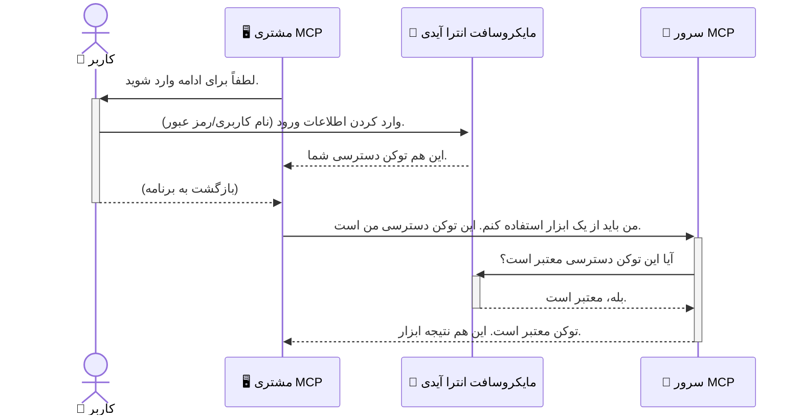

# ایمن‌سازی جریان‌های کاری هوش مصنوعی: احراز هویت Entra ID برای سرورهای پروتکل مدل کانتکست

> [!NOTE]
> کد سرور راه دور در این درس، نقاط انتهایی قدیمی `/sse` و `/message` را محافظت می‌کند و هدف آن MCP با تاریخ `2025-11-25` است. شیوه‌های شناسایی و اعتبارسنجی توکن آن را حفظ کنید، اما برای پیاده‌سازی‌های جدید از انتقال HTTP قابل پخش سازگار با `2026-07-28` استفاده کنید.
> 
> 


## مقدمه
ایمن‌سازی سرور پروتکل مدل کانتکست (MCP) شما به همان اندازه قفل کردن درب جلوی خانه‌تان اهمیت دارد. باز گذاشتن سرور MCP شما ابزارها و داده‌هایتان را در معرض دسترسی غیرمجاز قرار می‌دهد که می‌تواند به نفوذهای امنیتی منجر شود. Microsoft Entra ID راهکاری قدرتمند مبتنی بر ابر برای مدیریت هویت و دسترسی فراهم می‌کند که کمک می‌کند فقط کاربران و برنامه‌های مجاز بتوانند با سرور MCP شما تعامل داشته باشند. در این بخش، خواهید آموخت چگونه جریان‌های کاری هوش مصنوعی خود را با استفاده از احراز هویت Entra ID محافظت کنید.

## اهداف یادگیری
تا پایان این بخش، قادر خواهید بود:

- اهمیت ایمن‌سازی سرورهای MCP را درک کنید.
- اصول پایه‌ای Microsoft Entra ID و احراز هویت OAuth 2.0 را توضیح دهید.
- تفاوت بین کلاینت‌های عمومی و محرمانه را تشخیص دهید.
- احراز هویت Entra ID را هم در سناریوهای سرور MCP محلی (کلاینت عمومی) و هم راه دور (کلاینت محرمانه) پیاده‌سازی کنید.
- بهترین شیوه‌های امنیتی را هنگام توسعه جریان‌های کاری هوش مصنوعی به‌کار ببرید.

## امنیت و MCP

همان‌طور که درب جلوی خانه‌تان را بدون قفل رها نمی‌کنید، نباید سرور MCP خود را برای دسترسی هرکسی باز بگذارید. ایمن‌سازی جریان‌های کاری هوش مصنوعی شما برای ساخت برنامه‌هایی قوی، قابل اعتماد و ایمن ضروری است. این فصل به شما معرفی می‌کند چگونه از Microsoft Entra ID برای ایمن‌سازی سرورهای MCP خود استفاده کنید، به طوری که فقط کاربران و برنامه‌های مجاز بتوانند با ابزارها و داده‌های شما تعامل داشته باشند.

## چرا امنیت برای سرورهای MCP مهم است

تصور کنید سرور MCP شما ابزاری برای ارسال ایمیل یا دسترسی به پایگاه داده مشتریان دارد. سروری که ایمن نشده باشد یعنی هر کسی می‌تواند به آن ابزار دسترسی داشته باشد که منجر به دسترسی غیرمجاز به داده‌ها، ارسال هرزنامه یا فعالیت‌های مخرب دیگر می‌شود.

با پیاده‌سازی احراز هویت، شما اطمینان می‌دهید که هر درخواست به سرور شما معتبر است و هویت کاربر یا برنامه‌ای که درخواست را ارسال کرده تأیید می‌شود. این اولین و مهم‌ترین گام در ایمن‌سازی جریان‌های کاری هوش مصنوعی شما است.

## معرفی Microsoft Entra ID

[**Microsoft Entra ID**](https://adoption.microsoft.com/microsoft-security/entra/) یک خدمت مدیریت هویت و دسترسی مبتنی بر ابر است. آن را به‌عنوان یک نگهبان امنیتی جهانی برای برنامه‌های خود در نظر بگیرید. این سرویس فرآیند پیچیده تأیید هویت کاربران (احراز هویت) و تعیین سطح مجوزهای آن‌ها (مجوزدهی) را مدیریت می‌کند.

با استفاده از Entra ID می‌توانید:

- ورود امن برای کاربران را فعال کنید.
- از APIها و سرویس‌ها محافظت کنید.
- سیاست‌های دسترسی را از یک محل مرکزی مدیریت کنید.

برای سرورهای MCP، Entra ID راه‌حلی قوی و بسیار مورد اعتماد ارائه می‌دهد تا مشخص کند چه کسانی می‌توانند به توانمندی‌های سرور شما دسترسی داشته باشند.

---

## درک جادو: نحوه کار احراز هویت Entra ID

Entra ID از استانداردهای باز مانند **OAuth 2.0** برای مدیریت احراز هویت استفاده می‌کند. اگرچه جزئیات ممکن است پیچیده باشند، مفهوم اصلی ساده است و می‌توان آن را با یک مثال توضیح داد.

### مقدمه‌ای ساده بر OAuth 2.0: کلید پارکینگ

OAuth 2.0 را مانند یک سرویس پارکینگ اتومبیل در نظر بگیرید. وقتی به یک رستوران می‌روید، کلید اصلی ماشین را به پارک‌بان نمی‌دهید. به جای آن، یک **کلید پارکینگ** ارائه می‌دهید که مجوزهای محدودی دارد — می‌تواند ماشین را روشن کند و درها را قفل کند، اما نمی‌تواند صندوق عقب یا داشبورد را باز کند.

در این مثال:

- **شما** همان **کاربر** هستید.
- **ماشین شما** همان **سرور MCP** با ابزارها و داده‌های ارزشمندش است.
- **پارک‌بان** همان **Microsoft Entra ID** است.
- **سرایدار پارکینگ** همان **کلاینت MCP** (برنامه‌ای که می‌خواهد به سرور دسترسی داشته باشد) است.
- **کلید پارکینگ** همان **توکن دسترسی** است.

توکن دسترسی یک رشته متنی امن است که کلاینت MCP پس از ورود به سیستم از Entra ID دریافت می‌کند. سپس کلاینت این توکن را با هر درخواست به سرور MCP ارائه می‌دهد. سرور می‌تواند توکن را بررسی کند تا مطمئن شود درخواست مشروع است و کلاینت مجوزهای لازم را دارد، همه اینها بدون نیاز به دسترسی مستقیم به اطلاعات واقعی شما (مانند رمزعبور).

### جریان احراز هویت

این‌گونه فرایند در عمل انجام می‌شود:



### معرفی کتابخانه احراز هویت مایکروسافت (MSAL)

پیش از اینکه وارد نوشتن کد شویم، مهم است که یک جزء کلیدی که در مثال‌ها مشاهده خواهید کرد را معرفی کنیم: **کتابخانه احراز هویت مایکروسافت (MSAL)**.

MSAL کتابخانه‌ای است که توسط مایکروسافت توسعه یافته و کار توسعه‌دهندگان را در مدیریت احراز هویت بسیار آسان‌تر می‌کند. به جای اینکه خودتان همه کد پیچیده مدیریت نشانه‌های امنیتی، ورود به سیستم و تازه‌سازی جلسات را بنویسید، MSAL این کارهای پیچیده را انجام می‌دهد.

استفاده از کتابخانه‌ای مانند MSAL به شدت توصیه می‌شود چون:

- **امنیت بالا:** این کتابخانه پروتکل‌ها و بهترین شیوه‌های امنیتی استاندارد صنعتی را پیاده‌سازی می‌کند که ریسک آسیب‌پذیری‌ها را کاهش می‌دهد.
- **تسهیل توسعه:** پیچیدگی پروتکل‌های OAuth 2.0 و OpenID Connect را حذف می‌کند و به شما امکان می‌دهد با چند خط کد احراز هویت قدرتمند را به برنامه خود اضافه کنید.
- **نگهداری فعال:** مایکروسافت به طور فعال MSAL را نگهداری و به‌روزرسانی می‌کند تا به تهدیدات امنیتی جدید و تغییرات پلتفرم پاسخ دهد.

MSAL از زبان‌ها و چارچوب‌های برنامه‌نویسی متنوعی از جمله .NET، JavaScript/TypeScript، Python، Java، Go و پلتفرم‌های موبایل مانند iOS و اندروید پشتیبانی می‌کند. این یعنی می‌توانید الگوهای احراز هویت یکسان و سازگار را در کل مجموعه فناوری خود استفاده کنید.

برای اطلاعات بیشتر درباره MSAL، می‌توانید مستندات رسمی [بررسی کلی MSAL](https://learn.microsoft.com/entra/identity-platform/msal-overview) را مشاهده کنید.

---

## راهنمای گام به گام ایمن‌سازی سرور MCP خود با Entra ID

حالا بیایید با هم مرور کنیم چگونه یک سرور MCP محلی (که از طریق `stdio` ارتباط برقرار می‌کند) را با Entra ID ایمن کنیم. این مثال از یک **کلاینت عمومی** استفاده می‌کند، که برای برنامه‌هایی که روی ماشین کاربر اجرا می‌شوند مانند اپ دسکتاپ یا سرور توسعه محلی مناسب است.

### سناریو ۱: ایمن‌سازی سرور MCP محلی (با یک کلاینت عمومی)

در این سناریو، یک سرور MCP محلی را بررسی می‌کنیم که از طریق `stdio` ارتباط برقرار می‌کند و از Entra ID برای احراز هویت کاربر قبل از دسترسی به ابزارهایش استفاده می‌کند. این سرور فقط یک ابزار دارد که اطلاعات پروفایل کاربر را از API Microsoft Graph دریافت می‌کند.

#### ۱. راه‌اندازی برنامه در Entra ID

پیش از نوشتن کد، باید برنامه خود را در Microsoft Entra ID ثبت کنید. این کار به Entra ID اطلاع می‌دهد که برنامه شما وجود دارد و به آن اجازه استفاده از سرویس احراز هویت را می‌دهد.

۱. به **[پورتال Microsoft Entra](https://entra.microsoft.com/)** بروید.
۲. به بخش **App registrations** بروید و روی **New registration** کلیک کنید.

۳. به برنامه خود یک نام بدهید (مثلاً «My Local MCP Server»).
۴. برای **نوع حساب‌های پشتیبانی‌شده**، گزینه **تنها حساب‌های موجود در این دایرکتوری سازمانی** را انتخاب کنید.
۵. برای این مثال می‌توانید **Redirect URI** را خالی بگذارید.
۶. روی **Register** کلیک کنید.

پس از ثبت، شناسه **Application (client) ID** و **Directory (tenant) ID** را یادداشت کنید. شما به این موارد در کدتان نیاز خواهید داشت.

#### ۲. کد: شکستن و بررسی بخش‌ها

بیایید به بخش‌های کلیدی کدی نگاه کنیم که به احراز هویت می‌پردازد. کد کامل این مثال در پوشه [Entra ID - Local - WAM](https://github.com/Azure-Samples/mcp-auth-servers/tree/main/src/entra-id-local-wam) در مخزن [mcp-auth-servers GitHub](https://github.com/Azure-Samples/mcp-auth-servers) موجود است.

**`AuthenticationService.cs`**

این کلاس مسئول مدیریت تعامل با Entra ID است.

- **`CreateAsync`**: این متد، `PublicClientApplication` از کتابخانه MSAL (کتابخانه احراز هویت مایکروسافت) را مقداردهی اولیه می‌کند. این مقداردهی با `clientId` و `tenantId` برنامه شما پیکربندی شده است.
- **`WithBroker`**: این امکان را فراهم می‌کند تا از یک بروکر (مانند Windows Web Account Manager) استفاده شود، که تجربه ورود یکپارچه و امن‌تری را ارائه می‌دهد.
- **`AcquireTokenAsync`**: این متد اصلی است. ابتدا سعی می‌کند توکن را به صورت بی‌صدا بگیرد (یعنی کاربر نیازی به ورود مجدد نداشته باشد اگر قبلاً جلسه معتبری وجود دارد). اگر نتواند توکن بی‌صدا بدست آورد، کاربر را برای ورود تعاملی راهنمایی می‌کند.

```csharp
// Simplified for clarity
public static async Task<AuthenticationService> CreateAsync(ILogger<AuthenticationService> logger)
{
    var msalClient = PublicClientApplicationBuilder
        .Create(_clientId) // Your Application (client) ID
        .WithAuthority(AadAuthorityAudience.AzureAdMyOrg)
        .WithTenantId(_tenantId) // Your Directory (tenant) ID
        .WithBroker(new BrokerOptions(BrokerOptions.OperatingSystems.Windows))
        .Build();

    // ... cache registration ...

    return new AuthenticationService(logger, msalClient);
}

public async Task<string> AcquireTokenAsync()
{
    try
    {
        // Try silent authentication first
        var accounts = await _msalClient.GetAccountsAsync();
        var account = accounts.FirstOrDefault();

        AuthenticationResult? result = null;

        if (account != null)
        {
            result = await _msalClient.AcquireTokenSilent(_scopes, account).ExecuteAsync();
        }
        else
        {
            // If no account, or silent fails, go interactive
            result = await _msalClient.AcquireTokenInteractive(_scopes).ExecuteAsync();
        }

        return result.AccessToken;
    }
    catch (Exception ex)
    {
        _logger.LogError(ex, "An error occurred while acquiring the token.");
        throw; // Optionally rethrow the exception for higher-level handling
    }
}
```

**`Program.cs`**

اینجا سرویس MCP راه‌اندازی شده و سرویس احراز هویت یکپارچه می‌شود.

- **`AddSingleton<AuthenticationService>`**: این سرویس `AuthenticationService` را در کانتینر تزریق وابستگی ثبت می‌کند تا توسط بخش‌های دیگر برنامه (مثل ابزار ما) استفاده شود.
- **ابزار `GetUserDetailsFromGraph`**: این ابزار به نمونه‌ای از `AuthenticationService` نیاز دارد. قبل از هر کاری، متد `authService.AcquireTokenAsync()` را برای دریافت توکن دسترسی معتبر فراخوانی می‌کند. اگر احراز هویت موفق بود، از این توکن برای فراخوانی API مایکروسافت گراف و دریافت جزئیات کاربر استفاده می‌کند.

```csharp
// Simplified for clarity
[McpServerTool(Name = "GetUserDetailsFromGraph")]
public static async Task<string> GetUserDetailsFromGraph(
    AuthenticationService authService)
{
    try
    {
        // This will trigger the authentication flow
        var accessToken = await authService.AcquireTokenAsync();

        // Use the token to create a GraphServiceClient
        var graphClient = new GraphServiceClient(
            new BaseBearerTokenAuthenticationProvider(new TokenProvider(authService)));

        var user = await graphClient.Me.GetAsync();

        return System.Text.Json.JsonSerializer.Serialize(user);
    }
    catch (Exception ex)
    {
        return $"Error: {ex.Message}";
    }
}
```

#### ۳. چگونگی تعامل همه این‌ها با هم

۱. وقتی کلاینت MCP ابزار `GetUserDetailsFromGraph` را اجرا می‌کند، ابتدا ابزار متد `AcquireTokenAsync` را فراخوانی می‌کند.
۲. `AcquireTokenAsync` باعث می‌شود کتابخانه MSAL به دنبال توکن معتبر بگردد.
۳. اگر توکنی پیدا نشود، MSAL از طریق بروکر کاربر را ترغیب می‌کند تا با حساب Entra ID وارد شود.
۴. پس از ورود کاربر، Entra ID یک توکن دسترسی صادر می‌کند.
۵. ابزار توکن را دریافت کرده و با آن تماس امنی با API مایکروسافت گراف برقرار می‌کند.
۶. جزئیات کاربر به کلاینت MCP بازگردانده می‌شود.

این فرایند اطمینان می‌دهد که فقط کاربران احراز هویت‌شده می‌توانند از ابزار استفاده کنند و بدین ترتیب سرور MCP محلی شما امن می‌شود.

### سناریوی ۲: امن‌سازی یک سرور MCP راه دور (با کلاینت محرمانه)

وقتی سرور MCP شما روی یک دستگاه راه دور (مانند یک سرور ابری) اجرا می‌شود و از پروتکلی مثل HTTP Streaming استفاده می‌کند، نیازهای امنیتی متفاوت خواهد بود. در این حالت، شما باید از **کلاینت محرمانه** و **Authorization Code Flow** استفاده کنید. این روش امن‌تر است چون اسرار برنامه هرگز به مرورگر افشا نمی‌شود.

این مثال از سرور MCP مبتنی بر TypeScript استفاده می‌کند که از Express.js برای مدیریت درخواست‌های HTTP بهره می‌برد.

#### ۱. راه‌اندازی برنامه در Entra ID

راه‌اندازی در Entra ID مشابه کلاینت عمومی است، اما با یک تفاوت اصلی: شما باید یک **راز کلاینت** ایجاد کنید.

۱. به **[پورتال Microsoft Entra](https://entra.microsoft.com/)** بروید.
۲. در ثبت برنامه خود، به زبانه **Certificates & secrets** بروید.
۳. روی **New client secret** کلیک کنید، یک توضیح وارد کنید و روی **Add** کلیک کنید.
۴. **مهم:** مقدار راز را بلافاصله کپی کنید. دیگر قادر به دیدن آن نخواهید بود.
۵. همچنین باید یک **Redirect URI** تنظیم کنید. به زبانه **Authentication** بروید، روی **Add a platform** کلیک کنید، گزینه **Web** را انتخاب کنید و URI هدایت را وارد کنید (مثلاً `http://localhost:3001/auth/callback`).

> **⚠️ نکته مهم امنیتی:** برای برنامه‌های تولیدی، مایکروسافت قویانه توصیه می‌کند به جای اسرار کلاینت، از روش‌های تایید هویت بدون راز مانند **Managed Identity** یا **Workload Identity Federation** استفاده کنید. رازهای کلاینت خطرات امنیتی ایجاد می‌کنند زیرا ممکن است افشا یا به خطر بیفتند. Managed identityها روشی امن‌تر ارائه می‌کنند که نیازی به ذخیره اعتبارنامه‌ها در کد یا پیکربندی نیست.
>
> برای اطلاعات بیشتر درباره managed identityها و نحوه پیاده‌سازی آن‌ها، به مطلب [Managed identities for Azure resources overview](https://learn.microsoft.com/entra/identity/managed-identities-azure-resources/overview) مراجعه کنید.

#### ۲. کد: شکستن و بررسی بخش‌ها

این مثال از رویکرد مبتنی بر جلسه استفاده می‌کند. وقتی کاربر احراز هویت می‌شود، سرور توکن دسترسی و توکن تازه‌سازی را در یک جلسه ذخیره می‌کند و یک توکن جلسه به کاربر می‌دهد. این توکن جلسه سپس برای درخواست‌های بعدی استفاده می‌شود. کد کامل این مثال در پوشه [Entra ID - Confidential client](https://github.com/Azure-Samples/mcp-auth-servers/tree/main/src/entra-id-cca-session) در مخزن [mcp-auth-servers GitHub](https://github.com/Azure-Samples/mcp-auth-servers) موجود است.

**`Server.ts`**

این فایل سرور Express و لایه انتقال MCP را راه‌اندازی می‌کند.

- **`requireBearerAuth`**: این یک میدل‌ویر است که نقطه‌های پایانی `/sse` و `/message` را محافظت می‌کند. وجود توکن bearer معتبر را در هدر `Authorization` درخواست بررسی می‌کند.
- **`EntraIdServerAuthProvider`**: این یک کلاس سفارشی است که رابط `McpServerAuthorizationProvider` را پیاده‌سازی می‌کند. مسئول مدیریت جریان OAuth 2.0 است.
- **`/auth/callback`**: این نقطه پایانی پس از احراز هویت کاربر، پاسخ هدایت شده از Entra ID را مدیریت می‌کند. کد مجوز را برای دریافت توکن دسترسی و توکن تازه‌سازی مبادله می‌کند.

```typescript
// برای وضوح ساده شده است
const app = express();
const { server } = createServer();
const provider = new EntraIdServerAuthProvider();

// از نقطه انتهایی SSE محافظت کنید
app.get("/sse", requireBearerAuth({
  provider,
  requiredScopes: ["User.Read"]
}), async (req, res) => {
  // ... اتصال به ترنسپورت ...
});

// از نقطه انتهایی پیام محافظت کنید
app.post("/message", requireBearerAuth({
  provider,
  requiredScopes: ["User.Read"]
}), async (req, res) => {
  // ... رسیدگی به پیام ...
});

// مدیریت بازخوانی OAuth 2.0
app.get("/auth/callback", (req, res) => {
  provider.handleCallback(req.query.code, req.query.state)
    .then(result => {
      // ... رسیدگی به موفقیت یا شکست ...
    });
});
```

**`Tools.ts`**

این فایل ابزارهایی را که سرور MCP ارائه می‌دهد تعریف می‌کند. ابزار `getUserDetails` مشابه مورد قبل است، اما توکن دسترسی را از جلسه دریافت می‌کند.

```typescript
// ساده شده برای وضوح
server.setRequestHandler(CallToolRequestSchema, async (request) => {
  const { name } = request.params;
  const context = request.params?.context as { token?: string } | undefined;
  const sessionToken = context?.token;

  if (name === ToolName.GET_USER_DETAILS) {
    if (!sessionToken) {
      throw new AuthenticationError("Authentication token is missing or invalid. Ensure the token is provided in the request context.");
    }

    // دریافت توکن شناسه Entra از مخزن جلسه
    const tokenData = tokenStore.getToken(sessionToken);
    const entraIdToken = tokenData.accessToken;

    const graphClient = Client.init({
      authProvider: (done) => {
        done(null, entraIdToken);
      }
    });

    const user = await graphClient.api('/me').get();

    // ... بازگرداندن جزئیات کاربر ...
  }
});
```

**`auth/EntraIdServerAuthProvider.ts`**

این کلاس منطق زیر را مدیریت می‌کند:

- هدایت کاربر به صفحه ورود Entra ID.
- مبادله کد مجوز برای دریافت توکن دسترسی.
- ذخیره توکن‌ها در `tokenStore`.

- تازه‌سازی توکن دسترسی هنگام منقضی شدن آن.


#### ۳. همه چیز چگونه با هم کار می‌کند

۱. وقتی کاربر برای اولین بار سعی می‌کند به سرور MCP وصل شود، میدل‌ویر `requireBearerAuth` متوجه می‌شود که آنها جلسه معتبری ندارند و آنها را به صفحه ورود Entra ID هدایت می‌کند.
۲. کاربر با حساب Entra ID خود وارد می‌شود.
۳. Entra ID کاربر را با یک کد مجوز به نقطه پایانی `/auth/callback` باز می‌گرداند.
۴. سرور کد را با یک توکن دسترسی و یک توکن تازه‌سازی عوض می‌کند، آنها را ذخیره می‌کند و یک توکن جلسه ایجاد می‌کند که به کلاینت ارسال می‌شود.
۵. اکنون کلاینت می‌تواند این توکن جلسه را در هدر `Authorization` برای همه درخواست‌های آینده به سرور MCP استفاده کند.
۶. وقتی ابزار `getUserDetails` فراخوانی می‌شود، از توکن جلسه برای یافتن توکن دسترسی Entra ID استفاده می‌کند و سپس با آن به API مایکروسافت گراف تماس می‌گیرد.

این جریان پیچیده‌تر از جریان کلاینت عمومی است، اما برای نقاط انتهایی در معرض اینترنت لازم است. از آنجا که سرورهای MCP از راه دور از طریق اینترنت عمومی قابل دسترسی هستند، نیاز به تدابیر امنیتی قوی‌تری برای محافظت در برابر دسترسی غیرمجاز و حملات احتمالی دارند.


## بهترین شیوه‌های امنیتی

- **همیشه از HTTPS استفاده کنید**: ارتباط بین کلاینت و سرور را رمزنگاری کنید تا از استراق سمع توکن‌ها جلوگیری شود.
- **اجرای کنترل دسترسی مبتنی بر نقش (RBAC)**: فقط بررسی نکنید *اگر* کاربر احراز هویت شده است؛ بلکه بررسی کنید *چه* اجازه دارد انجام دهد. می‌توانید نقش‌ها را در Entra ID تعریف کرده و در سرور MCP خود برای آنها بررسی کنید.
- **نظارت و ممیزی**: همه رویدادهای احراز هویت را ثبت کنید تا بتوانید فعالیت‌های مشکوک را تشخیص داده و به آنها پاسخ دهید.
- **مدیریت محدودیت نرخ و کنترل بار**: مایکروسافت گراف و سایر API‌ها محدودیت نرخ را برای جلوگیری از سوء استفاده اجرا می‌کنند. در سرور MCP خود منطق پس‌نشینی نمایی و تلاش مجدد را پیاده‌سازی کنید تا پاسخ‌های HTTP 429 (درخواست‌های بیش از حد) به شکل مناسبی مدیریت شوند. همچنین در نظر بگیرید داده‌های پر استفاده را کش کنید تا تماس‌های API کاهش یابد.
- **ذخیره‌سازی امن توکن‌ها**: توکن‌های دسترسی و توکن‌های تازه‌سازی را به طور امن ذخیره کنید. برای برنامه‌های محلی از مکانیزم‌های ذخیره‌سازی امن سیستم استفاده کنید. برای برنامه‌های سرور، استفاده از ذخیره‌سازی رمزنگاری شده یا خدمات مدیریت کلید امن مانند Azure Key Vault را در نظر بگیرید.
- **مدیریت انقضای توکن‌ها**: توکن‌های دسترسی عمر محدودی دارند. تازه‌سازی خودکار توکن‌ها با استفاده از توکن‌های تازه‌سازی را پیاده‌سازی کنید تا تجربه کاربری بدون نیاز دوباره به احراز هویت حفظ شود.
- **استفاده از Azure API Management را در نظر بگیرید**: در حالی که پیاده‌سازی امنیت مستقیماً در سرور MCP کنترل دقیق‌تری می‌دهد، دروازه‌های API مانند Azure API Management می‌توانند بسیاری از این نگرانی‌های امنیتی از جمله احراز هویت، مجوزدهی، محدودیت نرخ و نظارت را به صورت خودکار مدیریت کنند. آنها یک لایه امنیتی متمرکز بین کلاینت‌ها و سرورهای MCP شما فراهم می‌کنند. برای جزئیات بیشتر در مورد استفاده از دروازه‌های API با MCP، به [Azure API Management Your Auth Gateway For MCP Servers](https://techcommunity.microsoft.com/blog/integrationsonazureblog/azure-api-management-your-auth-gateway-for-mcp-servers/4402690) مراجعه کنید.


## نکات کلیدی

- امن‌سازی سرور MCP شما برای محافظت از داده‌ها و ابزارهایتان حیاتی است.
- Microsoft Entra ID راه‌حلی قوی و مقیاس‌پذیر برای احراز هویت و مجوزدهی ارائه می‌دهد.
- برای برنامه‌های محلی از **کلاینت عمومی** و برای سرورهای از راه دور از **کلاینت محرمانه** استفاده کنید.
- **Authorization Code Flow** امن‌ترین گزینه برای برنامه‌های وب است.


## تمرین

۱. به یک سرور MCP که ممکن است بسازید فکر کنید. آیا سرور محلی است یا از راه دور؟
۲. بر اساس پاسخ شما، از کلاینت عمومی استفاده می‌کنید یا محرمانه؟
۳. سرور MCP شما چه مجوزی برای انجام عملیات روی Microsoft Graph درخواست خواهد کرد؟


## تمرینات عملی

### تمرین ۱: ثبت یک برنامه در Entra ID
به پرتال Microsoft Entra بروید.
یک برنامه جدید برای سرور MCP خود ثبت کنید.
شناسه برنامه (کلاینت) و شناسه دایرکتوری (مستأجر) را یادداشت کنید.

### تمرین ۲: امن‌سازی یک سرور MCP محلی (کلاینت عمومی)
- از مثال کد برای ادغام MSAL (کتابخانه احراز هویت مایکروسافت) جهت احراز هویت کاربران استفاده کنید.
- جریان احراز هویت را با فراخوانی ابزار MCP که جزئیات کاربر را از Microsoft Graph می‌گیرد، آزمایش کنید.

### تمرین ۳: امن‌سازی یک سرور MCP از راه دور (کلاینت محرمانه)
- یک کلاینت محرمانه در Entra ID ثبت کرده و یک راز کلاینت ایجاد کنید.
- سرور Express.js MCP خود را برای استفاده از Authorization Code Flow پیکربندی کنید.
- نقاط پایانی محافظت‌شده را تست کرده و دسترسی مبتنی بر توکن را تأیید کنید.

### تمرین ۴: اعمال بهترین شیوه‌های امنیتی
- HTTPS را برای سرور محلی یا از راه دور خود فعال کنید.
- کنترل دسترسی مبتنی بر نقش (RBAC) را در منطق سرور خود پیاده‌سازی کنید.
- مدیریت انقضای توکن و ذخیره‌سازی ایمن توکن‌ها را اضافه کنید.

## منابع

۱. **مستندات کلی MSAL**  
   بیاموزید چگونه کتابخانه احراز هویت مایکروسافت (MSAL) امکان دریافت ایمن توکن را در پلتفرم‌های مختلف فراهم می‌کند:  
   [MSAL Overview on Microsoft Learn](https://learn.microsoft.com/en-gb/entra/msal/overview)

۲. **مخزن GitHub Azure-Samples/mcp-auth-servers**  
   پیاده‌سازی‌های مرجع سرورهای MCP که جریان‌های احراز هویت را نشان می‌دهند:  
   [Azure-Samples/mcp-auth-servers on GitHub](https://github.com/Azure-Samples/mcp-auth-servers)

۳. **بررسی Managed Identities برای منابع Azure**  
   درک چگونگی حذف رازها با استفاده از هویت‌های مدیریتی اختصاص‌یافته به سیستم یا کاربر:  
   [Managed Identities Overview on Microsoft Learn](https://learn.microsoft.com/en-us/entra/identity/managed-identities-azure-resources/)

۴. **Azure API Management: دروازه احراز هویت شما برای سرورهای MCP**  
   بررسی عمیق استفاده از APIM به عنوان دروازه امن OAuth2 برای سرورهای MCP:  
   [Azure API Management Your Auth Gateway For MCP Servers](https://techcommunity.microsoft.com/blog/integrationsonazureblog/azure-api-management-your-auth-gateway-for-mcp-servers/4402690)

۵. **مرجع مجوزهای Microsoft Graph**  
   فهرست جامع مجوزهای واگذار شده و برنامه‌ای برای Microsoft Graph:  
   [Microsoft Graph Permissions Reference](https://learn.microsoft.com/zh-tw/graph/permissions-reference)


## نتایج یادگیری
پس از اتمام این بخش، قادر خواهید بود:

- توضیح دهید چرا احراز هویت برای سرورهای MCP و جریان‌های کاری هوش مصنوعی حیاتی است.
- احراز هویت Entra ID را برای سناریوهای سرور MCP محلی و از راه دور تنظیم و پیکربندی کنید.
- نوع کلاینت مناسب (عمومی یا محرمانه) را بر اساس استقرار سرور خود انتخاب کنید.
- شیوه‌های برنامه‌نویسی امن از جمله ذخیره‌سازی توکن و مجوزدهی مبتنی بر نقش را پیاده کنید.
- با اطمینان سرور MCP و ابزارهای آن را از دسترسی غیرمجاز محافظت کنید.

## مرحله بعد

- [۵.۱۳ پروتکل زمینه مدل (MCP) یکپارچه‌سازی با Microsoft Foundry](../mcp-foundry-agent-integration/README.md)

---

<!-- CO-OP TRANSLATOR DISCLAIMER START -->
**سلب مسئولیت**:
این سند با استفاده از سرویس ترجمه هوش مصنوعی [Co-op Translator](https://github.com/Azure/co-op-translator) ترجمه شده است. در حالی که ما در تلاش برای دقت هستیم، لطفاً توجه داشته باشید که ترجمه‌های خودکار ممکن است شامل خطاها یا نادرستی‌هایی باشند. سند اصلی به زبان مادری خود باید به عنوان منبع معتبر در نظر گرفته شود. برای اطلاعات حیاتی، ترجمه حرفه‌ای انسانی توصیه می‌شود. ما در قبال هرگونه سوء تفاهم یا برداشت نادرست ناشی از استفاده از این ترجمه مسئولیتی نداریم.
<!-- CO-OP TRANSLATOR DISCLAIMER END -->