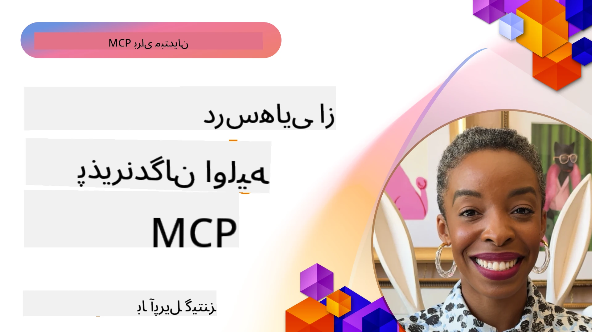

# 🌟 درس‌هایی از پذیرندگان اولیه

[](https://youtu.be/jds7dSmNptE)

_(برای مشاهده ویدیو این درس بر روی تصویر بالا کلیک کنید)_

## 🎯 این ماژول چه چیزهایی را پوشش می‌دهد

این ماژول بررسی می‌کند که چگونه سازمان‌ها و توسعه‌دهندگان واقعی از پروتکل مدل کانتکست (MCP) برای حل چالش‌های واقعی و پیش بردن نوآوری استفاده می‌کنند. از طریق مطالعات موردی دقیق، پروژه‌های عملی، و مثال‌های کاربردی، خواهید دید که چگونه MCP یکپارچه‌سازی ایمن، قابل توسعه و مقیاس‌پذیر هوش مصنوعی را فراهم می‌کند که مدل‌های زبانی، ابزارها و داده‌های سازمانی را متصل می‌کند.

### 📚 مشاهده MCP در عمل

می‌خواهید ببینید این اصول چگونه در ابزارهای آماده تولید پیاده‌سازی شده‌اند؟ سری به [**۱۰ سرور MCP مایکروسافت که بهره‌وری توسعه‌دهندگان را متحول می‌کنند**](microsoft-mcp-servers.md) بزنید، جایی که سرورهای واقعی MCP مایکروسافت را که می‌توانید همین امروز استفاده کنید، مشاهده خواهید کرد.

## مرور کلی

این درس بررسی می‌کند که چگونه پذیرندگان اولیه از پروتکل مدل کانتکست (MCP) برای حل چالش‌های دنیای واقعی و پیش بردن نوآوری در صنایع مختلف استفاده کرده‌اند. از طریق مطالعات موردی دقیق و پروژه‌های عملی، خواهید دید که چگونه MCP ادغام استاندارد، امن و قابل توسعه هوش مصنوعی را ممکن می‌سازد—که مدل‌های زبانی بزرگ، ابزارها و داده‌های سازمانی را در یک چارچوب یکپارچه به هم متصل می‌کند. شما تجربه عملی در طراحی و ساخت راه‌حل‌های مبتنی بر MCP کسب خواهید کرد، از الگوهای پیاده‌سازی اثبات‌شده می‌آموزید و بهترین روش‌ها برای استقرار MCP در محیط‌های تولید را کشف خواهید کرد. این درس همچنین روندهای نوظهور، جهت‌گیری‌های آینده و منابع متن‌باز را برجسته می‌کند تا به شما کمک کند در صدر فناوری MCP و اکوسیستم در حال تحول آن باقی بمانید.

## اهداف یادگیری

- تحلیل پیاده‌سازی‌های واقعی MCP در صنایع مختلف
- طراحی و ساخت برنامه‌های کامل مبتنی بر MCP
- بررسی روندهای نوظهور و جهت‌گیری‌های آینده در فناوری MCP
- به‌کارگیری بهترین روش‌ها در سناریوهای واقعی توسعه

## پیاده‌سازی‌های واقعی MCP

### مطالعه موردی ۱: اتوماسیون پشتیبانی مشتری سازمانی

یک شرکت چندملیتی راه‌حلی مبتنی بر MCP برای استانداردسازی تعاملات هوش مصنوعی در سراسر سیستم‌های پشتیبانی مشتریان خود پیاده‌سازی کرد. این امکان را به آن‌ها داد تا:

- ایجاد یک رابط کاربری یکپارچه برای چندین تامین‌کننده مدل زبانی بزرگ (LLM)
- حفظ مدیریت پرامپت یکسان در بین بخش‌ها
- اعمال کنترل‌های امنیتی و انطباق قوی
- به‌راحتی بین مدل‌های مختلف هوش مصنوعی بر اساس نیازهای خاص جابجا شوند

**پیاده‌سازی فنی:**

```python
# پیاده‌سازی سرور MCP پایتون برای پشتیبانی مشتری
import logging
import asyncio
from modelcontextprotocol import create_server, ServerConfig
from modelcontextprotocol.server import MCPServer
from modelcontextprotocol.transports import create_http_transport
from modelcontextprotocol.resources import ResourceDefinition
from modelcontextprotocol.prompts import PromptDefinition
from modelcontextprotocol.tool import ToolDefinition

# پیکربندی لاگ‌گیری
logging.basicConfig(level=logging.INFO)

async def main():
    # ایجاد پیکربندی سرور
    config = ServerConfig(
        name="Enterprise Customer Support Server",
        version="1.0.0",
        description="MCP server for handling customer support inquiries"
    )
    
    # مقداردهی اولیه سرور MCP
    server = create_server(config)
    
    # ثبت منابع پایگاه دانش
    server.resources.register(
        ResourceDefinition(
            name="customer_kb",
            description="Customer knowledge base documentation"
        ),
        lambda params: get_customer_documentation(params)
    )
    
    # ثبت قالب‌های درخواست
    server.prompts.register(
        PromptDefinition(
            name="support_template",
            description="Templates for customer support responses"
        ),
        lambda params: get_support_templates(params)
    )
    
    # ثبت ابزارهای پشتیبانی
    server.tools.register(
        ToolDefinition(
            name="ticketing",
            description="Create and update support tickets"
        ),
        handle_ticketing_operations
    )
    
    # راه‌اندازی سرور با انتقال HTTP
    transport = create_http_transport(port=8080)
    await server.run(transport)

if __name__ == "__main__":
    asyncio.run(main())
```

**نتایج:** کاهش ۳۰ درصدی هزینه‌های مدل، افزایش ۴۵ درصدی در انسجام پاسخ‌ها، و بهبود انطباق در عملیات‌های جهانی.

### مطالعه موردی ۲: دستیار تشخیص سلامت

یک ارائه‌دهنده خدمات بهداشتی زیرساخت MCP ایجاد کرد تا چندین مدل تخصصی هوش مصنوعی پزشکی را ادغام کند و در عین حال داده‌های حساس بیماران را محافظت نماید:

- جابجایی بدون درز بین مدل‌های پزشکی عمومی و تخصصی
- کنترل‌های سختگیرانه حریم خصوصی و ردگیری ممیزی
- ادغام با سیستم‌های پرونده سلامت الکترونیکی موجود (EHR)
- مهندسی پرامپت ثابت برای اصطلاحات پزشکی

**پیاده‌سازی فنی:**

```csharp
// C# MCP host application implementation in healthcare application
using Microsoft.Extensions.DependencyInjection;
using ModelContextProtocol.SDK.Client;
using ModelContextProtocol.SDK.Security;
using ModelContextProtocol.SDK.Resources;

public class DiagnosticAssistant
{
    private readonly MCPHostClient _mcpClient;
    private readonly PatientContext _patientContext;
    
    public DiagnosticAssistant(PatientContext patientContext)
    {
        _patientContext = patientContext;
        
        // Configure MCP client with healthcare-specific settings
        var clientOptions = new ClientOptions
        {
            Name = "Healthcare Diagnostic Assistant",
            Version = "1.0.0",
            Security = new SecurityOptions
            {
                Encryption = EncryptionLevel.Medical,
                AuditEnabled = true
            }
        };
        
        _mcpClient = new MCPHostClientBuilder()
            .WithOptions(clientOptions)
            .WithTransport(new HttpTransport("https://healthcare-mcp.example.org"))
            .WithAuthentication(new HIPAACompliantAuthProvider())
            .Build();
    }
    
    public async Task<DiagnosticSuggestion> GetDiagnosticAssistance(
        string symptoms, string patientHistory)
    {
        // Create request with appropriate resources and tool access
        var resourceRequest = new ResourceRequest
        {
            Name = "patient_records",
            Parameters = new Dictionary<string, object>
            {
                ["patientId"] = _patientContext.PatientId,
                ["requestingProvider"] = _patientContext.ProviderId
            }
        };
        
        // Request diagnostic assistance using appropriate prompt
        var response = await _mcpClient.SendPromptRequestAsync(
            promptName: "diagnostic_assistance",
            parameters: new Dictionary<string, object>
            {
                ["symptoms"] = symptoms,
                patientHistory = patientHistory,
                relevantGuidelines = _patientContext.GetRelevantGuidelines()
            });
            
        return DiagnosticSuggestion.FromMCPResponse(response);
    }
}
```

**نتایج:** پیشنهادات تشخیصی بهبود یافته برای پزشکان در حالی که کاملاً با قوانین HIPAA سازگار بوده و کاهش قابل توجه جابجایی بین سیستم‌ها.

### مطالعه موردی ۳: تحلیل ریسک خدمات مالی

یک موسسه مالی MCP را برای استانداردسازی فرآیندهای تحلیل ریسک در بخش‌های مختلف پیاده‌سازی کرد:

- ایجاد یک رابط واحد برای مدل‌های ریسک اعتباری، تشخیص تقلب، و ریسک سرمایه‌گذاری
- اعمال کنترل‌های دسترسی سختگیرانه و نسخه‌بندی مدل‌ها
- تضمین قابلیت ممیزی تمام توصیه‌های هوش مصنوعی
- حفظ قالب‌بندی داده‌ی یکسان در سیستم‌های متنوع

**پیاده‌سازی فنی:**

```java
// سرور MCP جاوا برای ارزیابی ریسک مالی
import org.mcp.server.*;
import org.mcp.security.*;

public class FinancialRiskMCPServer {
    public static void main(String[] args) {
        // ساخت سرور MCP با ویژگی‌های انطباق مالی
        MCPServer server = new MCPServerBuilder()
            .withModelProviders(
                new ModelProvider("risk-assessment-primary", new AzureOpenAIProvider()),
                new ModelProvider("risk-assessment-audit", new LocalLlamaProvider())
            )
            .withPromptTemplateDirectory("./compliance/templates")
            .withAccessControls(new SOCCompliantAccessControl())
            .withDataEncryption(EncryptionStandard.FINANCIAL_GRADE)
            .withVersionControl(true)
            .withAuditLogging(new DatabaseAuditLogger())
            .build();
            
        server.addRequestValidator(new FinancialDataValidator());
        server.addResponseFilter(new PII_RedactionFilter());
        
        server.start(9000);
        
        System.out.println("Financial Risk MCP Server running on port 9000");
    }
}
```

**نتایج:** بهبود انطباق با مقررات، افزایش سرعت چرخه‌های استقرار مدل تا ۴۰٪، و بهبود انسجام ارزیابی ریسک در سراسر بخش‌ها.

### مطالعه موردی ۴: سرور MCP Playwright مایکروسافت برای اتوماسیون مرورگر

مایکروسافت [سرور MCP Playwright](https://github.com/microsoft/playwright-mcp) را برای فراهم آوردن اتوماسیون مرورگر امن و استاندارد از طریق پروتکل مدل کانتکست توسعه داد. این سرور آماده تولید به عوامل هوش مصنوعی و مدل‌های زبانی بزرگ اجازه می‌دهد تا به شکل کنترل‌شده، قابل ممیزی و توسعه‌پذیر با مرورگرهای وب تعامل داشته باشند؛ از جمله در مواردی چون تست خودکار وب، استخراج داده، و گردش‌کارهای انتها به انتها.

> **🎯 ابزار آماده تولید**
> 
> این مطالعه موردی سرور MCP واقعی است که می‌توانید همین امروز استفاده کنید! درباره سرور MCP Playwright و ۹ سرور MCP دیگر مایکروسافت در [**راهنمای سرورهای MCP مایکروسافت**](microsoft-mcp-servers.md#8--playwright-mcp-server) بیشتر بیاموزید.

**ویژگی‌های کلیدی:**
- ارائه قابلیت‌های اتوماسیون مرورگر (ناوبری، پر کردن فرم، ثبت‌تصویر صفحه، و غیره) به عنوان ابزارهای MCP
- اعمال کنترل‌های دسترسی سختگیرانه و محیط شنی برای جلوگیری از اقدامات غیرمجاز
- فراهم‌آوری لاگ‌های دقیق ممیزی برای تمام تعاملات مرورگر
- پشتیبانی از ادغام با Azure OpenAI و سایر تامین‌کنندگان LLM برای اتوماسیون مبتنی بر عامل
- پشتیبانی از عامل کدنویسی GitHub Copilot با قابلیت‌های مرور وب

**پیاده‌سازی فنی:**

```typescript
// تایپ‌اسکریپت: ثبت ابزارهای خودکارسازی مرورگر Playwright در سرور MCP
import { createServer, ToolDefinition } from 'modelcontextprotocol';
import { launch } from 'playwright';

const server = createServer({
  name: 'Playwright MCP Server',
  version: '1.0.0',
  description: 'MCP server for browser automation using Playwright'
});

// ثبت یک ابزار برای حرکت به یک URL و گرفتن اسکرین‌شات
server.tools.register(
  new ToolDefinition({
    name: 'navigate_and_screenshot',
    description: 'Navigate to a URL and capture a screenshot',
    parameters: {
      url: { type: 'string', description: 'The URL to visit' }
    }
  }),
  async ({ url }) => {
    const browser = await launch();
    const page = await browser.newPage();
    await page.goto(url);
    const screenshot = await page.screenshot();
    await browser.close();
    return { screenshot };
  }
);

// شروع سرور MCP
server.listen(8080);
```

**نتایج:**

- فراهم‌آوری اتوماسیون مرورگر برنامه‌ریزی‌شده و امن برای عوامل هوش مصنوعی و LLMها
- کاهش تلاش برای تست دستی و بهبود پوشش تست برنامه‌های وب
- ارائه چارچوب قابل استفاده مجدد و توسعه‌پذیر برای ادغام ابزارهای مبتنی بر مرورگر در محیط‌های سازمانی
- پشتیبانی از قابلیت‌های مرور وب GitHub Copilot

**مراجع:**

- [مخزن GitHub سرور MCP Playwright](https://github.com/microsoft/playwright-mcp)
- [راه‌حل‌های هوش مصنوعی و اتوماسیون مایکروسافت](https://azure.microsoft.com/en-us/products/ai-services/)

### مطالعه موردی ۵: Azure MCP – پروتکل مدل کانتکست سازمانی به عنوان سرویس

سرور Azure MCP ([https://aka.ms/azmcp](https://aka.ms/azmcp)) پیاده‌سازی مدیریتی و سازمانی پروتکل مدل کانتکست توسط مایکروسافت است که برای ارائه قابلیت‌های سرور MCP مقیاس‌پذیر، امن و منطبق به‌صورت سرویس ابری طراحی شده. Azure MCP به سازمان‌ها امکان می‌دهد سرورهای MCP را با خدمات هوش مصنوعی، داده‌ها و امنیت Azure به سرعت مستقر، مدیریت و ادغام کنند و بار عملیاتی را کاهش داده و پذیرش هوش مصنوعی را سرعت بخشند.

> **🎯 ابزار آماده تولید**
> 
> این یک سرور MCP واقعی است که می‌توانید همین امروز از آن استفاده کنید! درباره سرور MCP Microsoft Foundry در [**راهنمای سرورهای MCP مایکروسافت**](microsoft-mcp-servers.md) بیشتر بدانید.


- میزبانی کاملاً مدیریت‌شده سرور MCP با مقیاس‌بندی، مانیتورینگ و امنیت داخلی
- ادغام بومی با Azure OpenAI، جستجوی Azure AI و دیگر خدمات Azure
- احراز هویت و مجوزدهی سازمانی از طریق Microsoft Entra ID
- پشتیبانی از ابزارهای سفارشی، قالب‌های پرامپت و کانکتورهای منابع
- انطباق با امنیت سازمانی و الزامات نظارتی

**پیاده‌سازی فنی:**

```yaml
# Example: Azure MCP server deployment configuration (YAML)
apiVersion: mcp.microsoft.com/v1
kind: McpServer
metadata:
  name: enterprise-mcp-server
spec:
  modelProviders:
    - name: azure-openai
      type: AzureOpenAI
      endpoint: https://<your-openai-resource>.openai.azure.com/
      apiKeySecret: <your-azure-keyvault-secret>
  tools:
    - name: document_search
      type: AzureAISearch
      endpoint: https://<your-search-resource>.search.windows.net/
      apiKeySecret: <your-azure-keyvault-secret>
  authentication:
    type: EntraID
    tenantId: <your-tenant-id>
  monitoring:
    enabled: true
    logAnalyticsWorkspace: <your-log-analytics-id>
```

**نتایج:**  
- کاهش زمان رسیدن به ارزش پروژه‌های هوش مصنوعی سازمانی با ارائه یک پلتفرم سرور MCP آماده استفاده و منطبق
- ساده‌سازی ادغام مدل‌های زبانی بزرگ، ابزارها و منابع داده سازمانی
- افزایش امنیت، قابلیت مشاهده و کارایی عملیاتی در بارهای کاری MCP
- بهبود کیفیت کد با بهترین روش‌های Azure SDK و الگوهای احراز هویت جاری

**مراجع:**  
- [مستندات Azure MCP](https://aka.ms/azmcp)
- [مخزن GitHub سرور Azure MCP](https://github.com/Azure/azure-mcp)
- [خدمات Azure AI](https://azure.microsoft.com/en-us/products/ai-services/)
- [مرکز MCP مایکروسافت](https://mcp.azure.com)

## مطالعه موردی ۶: NLWeb
MCP (پروتکل مدل کانتکست) یک پروتکل نوظهور برای چت‌بات‌ها و دستیاران هوش مصنوعی است که امکان تعامل با ابزارها را فراهم می‌کند. هر نمونه NLWeb نیز یک سرور MCP است که یک روش اصلی، ask، را پشتیبانی می‌کند که برای پرسش سوال به زبان طبیعی از یک وب‌سایت استفاده می‌شود. پاسخ بازگردانده‌شده از schema.org استفاده می‌کند که یک واژگان رایج برای توصیف داده‌های وب است. به بیانی ساده، MCP همان NLWeb است که Http برای HTML است. NLWeb پروتکل‌ها، فرمت‌های Schema.org و کد نمونه را ترکیب می‌کند تا به سایت‌ها کمک کند به‌سرعت این نقاط انتها را ایجاد کنند، که هم به انسان‌ها از طریق رابط‌های مکالمه‌ای و هم به ماشین‌ها از طریق تعامل عامل به عامل طبیعی سود می‌رساند.

NLWeb دو جزء متمایز دارد.
- یک پروتکل بسیار ساده برای شروع، برای تعامل با سایت به زبان طبیعی و یک فرمت که از json و schema.org برای پاسخ استفاده می‌کند. برای جزئیات بیشتر مستندات API REST را ببینید.
- یک پیاده‌سازی ساده از (1) که از نشانه‌گذاری موجود بهره می‌برد، برای سایت‌هایی که می‌توانند به عنوان لیست آیتم‌ها (محصولات، دستورها، جاذبه‌ها، نظرات و غیره) انتزاع شوند. همراه با مجموعه‌ای از ویجت‌های رابط کاربری، سایت‌ها می‌توانند به آسانی رابط‌های مکالمه‌ای برای محتوای خود فراهم کنند. برای جزئیات بیشتر مستندات درباره زندگی یک پرس‌وجوی چت را ببینید.
 
**مراجع:**  
- [مستندات Azure MCP](https://aka.ms/azmcp)
- [NLWeb](https://github.com/microsoft/NlWeb)

### مطالعه موردی ۷: سرور MCP Microsoft Foundry – ادغام عامل هوش مصنوعی سازمانی

سرورهای MCP Microsoft Foundry نشان می‌دهند که چگونه MCP می‌تواند برای هماهنگ‌سازی و مدیریت عوامل هوش مصنوعی و گردش‌کارها در محیط‌های سازمانی استفاده شود. با ادغام MCP با Microsoft Foundry، سازمان‌ها می‌توانند تعاملات عامل را استاندارد کنند، از مدیریت گردش‌کار Foundry بهره ببرند و استقرارهای امن و مقیاس‌پذیر را تضمین کنند.

> **🎯 ابزار آماده تولید**
> 
> این یک سرور MCP واقعی است که می‌توانید امروز از آن استفاده کنید! درباره سرور MCP Microsoft Foundry در [**راهنمای سرورهای MCP مایکروسافت**](microsoft-mcp-servers.md#9--microsoft-foundry-mcp-server) بیشتر بدانید.

**ویژگی‌های کلیدی:**
- دسترسی جامع به اکوسیستم هوش مصنوعی Azure، شامل فهرست مدل‌ها و مدیریت استقرار
- نمایه‌سازی دانش با Azure AI Search برای برنامه‌های RAG
- ابزارهای ارزیابی عملکرد مدل هوش مصنوعی و تضمین کیفیت
- ادغام با Microsoft Foundry Catalog و Labs برای مدل‌های تحقیقاتی پیشرفته
- امکانات مدیریت و ارزیابی عامل برای سناریوهای تولید

**نتایج:**
- نمونه‌سازی سریع و پایش قوی گردش‌کارهای عامل هوش مصنوعی
- ادغام بدون درز با خدمات Azure AI برای سناریوهای پیشرفته
- رابط کاربری یکپارچه برای ساخت، استقرار و پایش خطوط لوله عامل
- بهبود امنیت، انطباق و کارایی عملیاتی برای سازمان‌ها
- تسریع در پذیرش هوش مصنوعی در حالی که کنترل فرآیندهای پیچیده مبتنی بر عامل حفظ می‌شود

**مراجع:**
- [مخزن GitHub سرور MCP Microsoft Foundry](https://github.com/azure-ai-foundry/mcp-foundry)
- [ادغام عوامل Azure AI با MCP (وبلاگ Microsoft Foundry)](https://devblogs.microsoft.com/foundry/integrating-azure-ai-agents-mcp/)

### مطالعه موردی ۸: زمین بازی MCP Foundry – آزمایش و نمونه‌سازی

زمین بازی MCP Foundry محیطی آماده استفاده برای آزمایش سرورهای MCP و ادغام‌های Microsoft Foundry فراهم می‌کند. توسعه‌دهندگان می‌توانند به سرعت مدل‌های هوش مصنوعی و گردش‌کارهای عامل را نمونه‌سازی، آزمایش و ارزیابی کنند با استفاده از منابعی از Microsoft Foundry Catalog و Labs. این زمین بازی فرآیند راه‌اندازی را ساده می‌کند، پروژه‌های نمونه فراهم می‌کند و از توسعه مشارکتی پشتیبانی می‌کند، که کاوش بهترین روش‌ها و سناریوهای جدید را با کمترین پیچیدگی آسان می‌سازد. این به‌ویژه برای تیم‌هایی مفید است که می‌خواهند ایده‌ها را تایید کنند، آزمایش‌ها را به اشتراک بگذارند و یادگیری را تسریع کنند بدون نیاز به زیرساخت پیچیده. با کاهش موانع ورود، زمین بازی به نوآوری و مشارکت جامعه در اکوسیستم MCP و Microsoft Foundry کمک می‌کند.

**مراجع:**

- [مخزن GitHub زمین بازی MCP Foundry](https://github.com/azure-ai-foundry/foundry-mcp-playground)

### مطالعه موردی ۹: سرور MCP مستندات Microsoft Learn – دسترسی مستندسازی مبتنی بر هوش مصنوعی

سرور MCP مستندات Microsoft Learn یک سرویس میزبانی ابری است که دستیاران هوش مصنوعی را با دسترسی در زمان واقعی به مستندات رسمی مایکروسافت از طریق پروتکل مدل کانتکست فراهم می‌کند. این سرور آماده تولید به اکوسیستم کامل Microsoft Learn متصل می‌شود و جستجوی معنادار را در تمام منابع رسمی مایکروسافت ممکن می‌سازد.

> **🎯 ابزار آماده تولید**
> 
> این یک سرور MCP واقعی است که می‌توانید امروز استفاده کنید! درباره سرور MCP مستندات Microsoft Learn در [**راهنمای سرورهای MCP مایکروسافت**](microsoft-mcp-servers.md#1--microsoft-learn-docs-mcp-server) بیشتر بدانید.

**ویژگی‌های کلیدی:**
- دسترسی در زمان واقعی به مستندات رسمی مایکروسافت، مستندات Azure و مستندات Microsoft 365
- قابلیت‌های جستجوی معنادار پیشرفته که زمینه و نیت را می‌فهمد
- اطلاعات همیشه به‌روز با انتشار محتواهای Microsoft Learn
- پوشش کامل در سراسر Microsoft Learn، مستندات Azure و منابع Microsoft 365
- بازگشت تا ۱۰ بخش محتوای باکیفیت همراه با عناوین مقاله و URLها

**چرا این مهم است:**
- حل مشکل «دانش قدیمی هوش مصنوعی» برای فناوری‌های مایکروسافت
- اطمینان از دسترسی دستیاران هوش مصنوعی به تازه‌ترین ویژگی‌های دات‌نت، سی‌شارپ، Azure و Microsoft 365
- ارائه اطلاعات معتبر و رسمی برای تولید دقیق کد
- ضروری برای توسعه‌دهندگانی که با فناوری‌های به سرعت در حال تحول مایکروسافت کار می‌کنند

**نتایج:**
- بهبود قابل توجه دقت کد تولید شده توسط هوش مصنوعی برای فناوری‌های مایکروسافت
- کاهش زمان جستجو برای مستندات و بهترین روش‌های کنونی
- افزایش بهره‌وری توسعه‌دهنده با بازیابی مستندات متناسب با زمینه
- ادغام بدون درز با گردش‌کارهای توسعه بدون نیاز به ترک IDE

**مراجع:**
- [مخزن GitHub سرور MCP مستندات Microsoft Learn](https://github.com/MicrosoftDocs/mcp)
- [مستندات Microsoft Learn](https://learn.microsoft.com/)

## پروژه‌های عملی

### پروژه ۱: ساخت سرور MCP با تامین‌کنندگان چندگانه

**هدف:** ایجاد یک سرور MCP که بتواند درخواست‌ها را بر اساس معیارهای مشخص به چندین تامین‌کننده مدل هوش مصنوعی هدایت کند.

**نیازمندی‌ها:**

- پشتیبانی از حداقل سه تامین‌کننده مدل مختلف (مثلاً OpenAI، Anthropic، مدل‌های محلی)
- پیاده‌سازی مکانیزم هدایت بر اساس متادیتای درخواست
- ایجاد یک سیستم پیکربندی برای مدیریت اعتبارنامه تامین‌کنندگان
- افزودن کشینگ برای بهینه‌سازی عملکرد و هزینه‌ها
- ساخت داشبورد ساده برای پایش استفاده

**مراحل پیاده‌سازی:**

1. راه‌اندازی زیرساخت پایه سرور MCP
2. پیاده‌سازی آداپتورهای تامین‌کننده برای هر سرویس مدل هوش مصنوعی
3. ایجاد منطق هدایت بر اساس ویژگی‌های درخواست
4. افزودن مکانیزم‌های کشینگ برای درخواست‌های متداول
5. توسعه داشبورد پایش
6. آزمون با الگوهای مختلف درخواست

**فناوری‌ها:** انتخاب از پایتون (.NET/جاوا/پایتون بر اساس ترجیح شما)، Redis برای کشینگ، و یک چارچوب وب ساده برای داشبورد.

### پروژه ۲: سیستم مدیریت پرامپت سازمانی

**هدف:** توسعه یک سیستم مبتنی بر MCP برای مدیریت، نسخه‌بندی و استقرار قالب‌های پرامپت در سراسر سازمان.

**نیازمندی‌ها:**


- ایجاد یک مخزن مرکزی برای قالب‌های پرامپت
- پیاده‌سازی نسخه‌بندی و جریان‌های کاری تأیید
- ساخت قابلیت‌های تست قالب با ورودی‌های نمونه
- توسعه کنترل‌های دسترسی مبتنی بر نقش
- ایجاد API برای بازیابی و استقرار قالب‌ها

**مراحل پیاده‌سازی:**

۱. طراحی ساختار پایگاه داده برای ذخیره قالب‌ها
۲. ایجاد API اصلی برای عملیات CRUD قالب‌ها
۳. پیاده‌سازی سیستم نسخه‌بندی
۴. ساخت جریان کاری تأیید
۵. توسعه چارچوب تست
۶. ایجاد رابط وب ساده برای مدیریت
۷. یکپارچه‌سازی با سرور MCP

**تکنولوژی‌ها:** انتخاب شما در زمینه فریم‌ورک بک‌اند، پایگاه داده SQL یا NoSQL، و یک فریم‌ورک فرانت‌اند برای رابط مدیریت است.

### پروژه ۳: پلتفرم تولید محتوا مبتنی بر MCP

**هدف:** ساخت یک پلتفرم تولید محتوا که از MCP بهره می‌برد تا نتایج یکنواخت در انواع مختلف محتوا ارائه دهد.

**نیازمندی‌ها:**

- پشتیبانی از فرمت‌های متعدد محتوا (مقالات وبلاگ، شبکه‌های اجتماعی، کپی مارکتینگ)
- پیاده‌سازی تولید مبتنی بر قالب با گزینه‌های سفارشی‌سازی
- ایجاد سیستم مرور و بازخورد محتوا
- پیگیری معیارهای عملکرد محتوا
- پشتیبانی از نسخه‌بندی و تکرار محتوا

**مراحل پیاده‌سازی:**

۱. راه‌اندازی زیرساخت کلاینت MCP
۲. ایجاد قالب‌ها برای انواع مختلف محتوا
۳. ساخت خط تولید تولید محتوا
۴. پیاده‌سازی سیستم مرور
۵. توسعه سیستم پیگیری معیارها
۶. ایجاد رابط کاربری برای مدیریت قالب‌ها و تولید محتوا

**تکنولوژی‌ها:** زبان برنامه‌نویسی، فریم‌ورک وب، و سیستم پایگاه داده مورد علاقه شما.

## مسیرهای آینده فناوری MCP

### روندهای نوظهور

۱. **MCP چندحالته (Multi-Modal)**
   - گسترش MCP برای استانداردسازی تعاملات با مدل‌های تصویر، صدا و ویدیو
   - توسعه توانمندی‌های استدلال میان‌حالته
   - قالب‌های پرامپت استاندارد برای مدالیت‌های مختلف

۲. **زیرساخت MCP فدرال (Federated)**
   - شبکه‌های توزیع‌شده MCP که منابع را بین سازمان‌ها به اشتراک می‌گذارند
   - پروتکل‌های استاندارد شده برای اشتراک‌گذاری امن مدل‌ها
   - تکنیک‌های محاسبات حفظ حریم خصوصی

۳. **بازارهای MCP**
   - اکوسیستم‌هایی برای اشتراک‌گذاری و کسب درآمد از قالب‌ها و افزونه‌های MCP
   - فرآیندهای تضمین کیفیت و گواهینامه
   - یکپارچه‌سازی با بازارهای مدل

۴. **MCP برای محاسبات لبه (Edge Computing)**
   - تطبیق استانداردهای MCP برای دستگاه‌های با منابع محدود لبه
   - پروتکل‌های بهینه‌شده برای محیط‌های کم‌باند
   - پیاده‌سازی‌های تخصصی MCP برای اکوسیستم‌های اینترنت چیزها (IoT)

۵. **چارچوب‌های نظارتی**
   - توسعه افزونه‌های MCP برای انطباق با مقررات
   - ردیابی حسابرسی استاندارد شده و رابط‌های توضیح‌پذیری
   - یکپارچه‌سازی با چارچوب‌های نوظهور حاکمیت هوش مصنوعی

### راهکارهای MCP از مایکروسافت

مایکروسافت و آزور چندین مخزن متن‌باز را برای کمک به توسعه‌دهندگان جهت پیاده‌سازی MCP در سناریوهای مختلف توسعه داده‌اند:

#### سازمان Microsoft

۱. [playwright-mcp](https://github.com/microsoft/playwright-mcp) - سرور MCP Playwright برای خودکارسازی و تست مرورگر
۲. [files-mcp-server](https://github.com/microsoft/files-mcp-server) - پیاده‌سازی سرور MCP OneDrive برای تست محلی و مشارکت جامعه
۳. [NLWeb](https://github.com/microsoft/NlWeb) - مجموعه‌ای از پروتکل‌های باز و ابزارهای متن‌باز مربوط. تمرکز اصلی بر ایجاد لایه بنیادی برای وب هوش مصنوعی است

#### سازمان Azure-Samples

۱. [mcp](https://github.com/Azure-Samples/mcp) - لینک به نمونه‌ها، ابزارها و منابع برای ساخت و یکپارچه‌سازی سرورهای MCP در آزور با زبان‌های مختلف
۲. [mcp-auth-servers](https://github.com/Azure-Samples/mcp-auth-servers) - سرورهای مرجع MCP که تأیید هویت را با مشخصات فعلی Model Context Protocol نشان می‌دهند
۳. [remote-mcp-functions](https://github.com/Azure-Samples/remote-mcp-functions) - صفحه فرود پیاده‌سازی سرورهای دور MCP در Azure Functions همراه با لینک به مخازن زبان‌های مختلف
۴. [remote-mcp-functions-python](https://github.com/Azure-Samples/remote-mcp-functions-python) - قالب شروع سریع برای ساخت و استقرار سرورهای دور MCP سفارشی با استفاده از Azure Functions و پایتون
۵. [remote-mcp-functions-dotnet](https://github.com/Azure-Samples/remote-mcp-functions-dotnet) - قالب شروع سریع برای ساخت و استقرار سرورهای دور MCP سفارشی با استفاده از Azure Functions و .NET/C#
۶. [remote-mcp-functions-typescript](https://github.com/Azure-Samples/remote-mcp-functions-typescript) - قالب شروع سریع برای ساخت و استقرار سرورهای دور MCP سفارشی با استفاده از Azure Functions و TypeScript
۷. [remote-mcp-apim-functions-python](https://github.com/Azure-Samples/remote-mcp-apim-functions-python) - مدیریت API آزور به عنوان درگاه هوش مصنوعی برای سرورهای دور MCP با استفاده از پایتون
۸. [AI-Gateway](https://github.com/Azure-Samples/AI-Gateway) - آزمایش‌های AI شامل قابلیت‌های MCP، یکپارچه‌شده با Azure OpenAI و AI Foundry

این مخازن پیاده‌سازی‌ها، قالب‌ها و منابع متنوعی را برای کار با Model Context Protocol در زبان‌ها و خدمات مختلف آزور ارائه می‌دهند. آن‌ها از پیاده‌سازی‌های ساده سرور تا احراز هویت، استقرار ابری و سناریوهای یکپارچه‌سازی سازمانی را پوشش می‌دهند.

#### فهرست منابع MCP

دایرکتوری [MCP Resources](https://github.com/microsoft/mcp/tree/main/Resources) در مخزن رسمی MCP مایکروسافت مجموعه‌ای منتخب از منابع نمونه، قالب‌های پرامپت و تعاریف ابزار برای استفاده با سرورهای Model Context Protocol را فراهم می‌کند. این دایرکتوری به توسعه‌دهندگان کمک می‌کند تا به سرعت با MCP شروع به کار کنند و بلوک‌های ساختمانی قابل استفاده مجدد و نمونه‌های بهترین روش‌ها را ارائه می‌دهد برای:

- **قالب‌های پرامپت:** قالب‌های آماده برای وظایف و سناریوهای رایج هوش مصنوعی که می‌توانند برای پیاده‌سازی‌های سرور MCP شما سفارشی شوند.
- **تعاریف ابزار:** نمونه‌های طرح‌واره‌های ابزار و متادیتا برای استانداردسازی یکپارچه‌سازی و فراخوانی ابزارها در سرورهای MCP مختلف.
- **نمونه‌های منابع:** تعاریف نمونه منابع برای اتصال به منابع داده، APIها و خدمات خارجی در چارچوب MCP.
- **پیاده‌سازی‌های مرجع:** نمونه‌های عملی که نشان می‌دهند چگونه منابع، پرامپت‌ها و ابزارها را در پروژه‌های واقعی MCP ساختاربندی و سازماندهی کنیم.

این منابع توسعه را تسریع کرده، استانداردسازی را ترویج می‌کنند و به اطمینان از بهترین روش‌ها هنگام ساخت و استقرار راهکارهای مبتنی بر MCP کمک می‌کنند.

#### فهرست منابع MCP

- [MCP Resources (Sample Prompts, Tools, and Resource Definitions)](https://github.com/microsoft/mcp/tree/main/Resources)

### فرصت‌های پژوهشی

- تکنیک‌های بهینه‌سازی پرامپت کارآمد در چارچوب‌های MCP
- مدل‌های امنیتی برای استقرار MCP چند مستأجره
- ارزیابی عملکرد در پیاده‌سازی‌های مختلف MCP
- روش‌های تأیید رسمی برای سرورهای MCP

## نتیجه‌گیری

پروتکل زمینه مدل (MCP) به سرعت آینده یکپارچگی استاندارد، امن و قابل همکاری هوش مصنوعی در صنایع مختلف را شکل می‌دهد. از طریق مطالعات موردی و پروژه‌های عملی در این درس، شما دیدید که پذیرندگان اولیه از جمله مایکروسافت و آزور چگونه از MCP برای حل چالش‌های دنیای واقعی، تسریع پذیرش هوش مصنوعی و تضمین انطباق، امنیت و مقیاس‌پذیری استفاده می‌کنند. رویکرد مدولار MCP به سازمان‌ها امکان می‌دهد مدل‌های زبانی بزرگ، ابزارها و داده‌های سازمانی را در چارچوبی یکپارچه و قابل حسابرسی متصل کنند. با ادامه تکامل MCP، درگیر بودن با جامعه، کاوش در منابع متن‌باز و به‌کارگیری بهترین روش‌ها کلید ساخت راهکارهای هوش مصنوعی مقاوم و آماده آینده خواهد بود.

## منابع اضافی

- [مخزن GitHub MCP Foundry](https://github.com/azure-ai-foundry/mcp-foundry)
- [زمین بازی Foundry MCP](https://github.com/azure-ai-foundry/foundry-mcp-playground)
- [یکپارچه‌سازی عامل‌های Azure AI با MCP (وبلاگ Microsoft Foundry)](https://devblogs.microsoft.com/foundry/integrating-azure-ai-agents-mcp/)
- [مخزن GitHub MCP (مایکروسافت)](https://github.com/microsoft/mcp)
- [دایرکتوری منابع MCP (قالب‌های نمونه، ابزارها و تعاریف منابع)](https://github.com/microsoft/mcp/tree/main/Resources)
- [جامعه و مستندات MCP](https://modelcontextprotocol.io/introduction)
- [مشخصات MCP (۲۰۲۶-۰۷-۲۸)](https://modelcontextprotocol.io/specification/2026-07-28/)
- [مستندات Azure MCP](https://aka.ms/azmcp)
- [ده مورد برتر امنیتی MCP OWASP](https://microsoft.github.io/mcp-azure-security-guide/mcp/) - بهترین روش‌های امنیتی
- [مخزن GitHub سرور Playwright MCP](https://github.com/microsoft/playwright-mcp)
- [سرور Files MCP (OneDrive)](https://github.com/microsoft/files-mcp-server)
- [Azure-Samples MCP](https://github.com/Azure-Samples/mcp)
- [سرورهای احراز هویت MCP (Azure-Samples)](https://github.com/Azure-Samples/mcp-auth-servers)
- [توابع دور MCP (Azure-Samples)](https://github.com/Azure-Samples/remote-mcp-functions)
- [توابع دور MCP پایتون (Azure-Samples)](https://github.com/Azure-Samples/remote-mcp-functions-python)
- [توابع دور MCP دات‌نت (Azure-Samples)](https://github.com/Azure-Samples/remote-mcp-functions-dotnet)
- [توابع دور MCP تایپ‌اسکریپت (Azure-Samples)](https://github.com/Azure-Samples/remote-mcp-functions-typescript)
- [توابع دور MCP APIM پایتون (Azure-Samples)](https://github.com/Azure-Samples/remote-mcp-apim-functions-python)
- [درگاه هوش مصنوعی (Azure-Samples)](https://github.com/Azure-Samples/AI-Gateway)
- [راهکارهای هوش مصنوعی و اتوماسیون مایکروسافت](https://azure.microsoft.com/en-us/products/ai-services/)

## تمرین‌ها

۱. یکی از مطالعه‌های موردی را تحلیل کرده و رویکرد پیاده‌سازی جایگزین پیشنهاد دهید.
۲. یکی از ایده‌های پروژه را انتخاب کرده و مشخصات فنی دقیقی ایجاد کنید.
۳. صنعتی که در مطالعات موردی پوشش داده نشده را بررسی کنید و مشخص کنید MCP چگونه می‌تواند چالش‌های خاص آن را برطرف کند.
۴. یکی از مسیرهای آینده را کاوش کرده و یک مفهوم برای افزونه جدید MCP جهت پشتیبانی از آن ایجاد کنید.

## مرحله بعدی

بیشتر کاوش کنید: [سرورهای MCP مایکروسافت](./microsoft-mcp-servers.md)

ادامه دهید به: [ماژول ۸: بهترین روش‌ها](../08-BestPractices/README.md)

---

<!-- CO-OP TRANSLATOR DISCLAIMER START -->
**سلب مسئولیت**:
این سند با استفاده از سرویس ترجمه هوش مصنوعی [Co-op Translator](https://github.com/Azure/co-op-translator) ترجمه شده است. در حالی که ما در تلاش برای دقت هستیم، لطفاً توجه داشته باشید که ترجمه‌های خودکار ممکن است شامل خطاها یا نادرستی‌هایی باشند. سند اصلی به زبان مادری خود باید به عنوان منبع معتبر در نظر گرفته شود. برای اطلاعات حیاتی، ترجمه حرفه‌ای انسانی توصیه می‌شود. ما در قبال هرگونه سوء تفاهم یا برداشت نادرست ناشی از استفاده از این ترجمه مسئولیتی نداریم.
<!-- CO-OP TRANSLATOR DISCLAIMER END -->