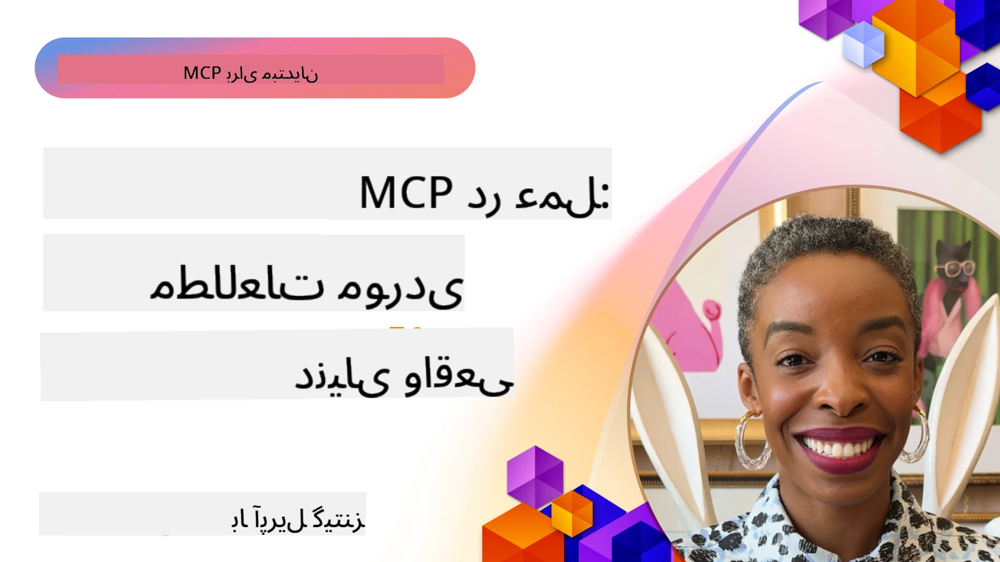

# MCP در عمل: مطالعات موردی دنیای واقعی

_(برای مشاهده ویدیو این درس، روی تصویر بالا کلیک کنید)_

پروتکل مدل زمینه (MCP) در حال تحول نحوه تعامل برنامه‌های هوش مصنوعی با داده‌ها، ابزارها و خدمات است. این بخش مطالعات موردی دنیای واقعی را ارائه می‌دهد که کاربردهای عملی MCP در سناریوهای مختلف سازمانی را نشان می‌دهد.

## مرور کلی

این بخش نمونه‌های مشخصی از پیاده‌سازی‌های MCP را نمایش می‌دهد و نشان می‌دهد چگونه سازمان‌ها از این پروتکل برای حل چالش‌های پیچیده کسب‌وکار بهره می‌برند. با بررسی این مطالعات موردی، درک بهتری از انعطاف‌پذیری، مقیاس‌پذیری و مزایای عملی MCP در سناریوهای واقعی کسب خواهید کرد.

## اهداف کلیدی یادگیری

با بررسی این مطالعات موردی، شما:

- درک می‌کنید چگونه MCP می‌تواند برای حل مسائل خاص کسب‌وکار به کار رود
- درباره الگوهای مختلف ادغام و رویکردهای معماری می‌آموزید
- بهترین روش‌های پیاده‌سازی MCP در محیط‌های سازمانی را می‌شناسید
- با چالش‌ها و راه‌حل‌های پیاده‌سازی در دنیای واقعی آشنا می‌شوید
- فرصت‌های به‌کارگیری الگوهای مشابه را در پروژه‌های خود شناسایی می‌کنید

## مطالعات موردی برجسته

### 1. [نمایش مرجع Azure AI Travel Agents](./travelagentsample.md)

این مطالعه موردی راه‌حل مرجع جامع مایکروسافت را بررسی می‌کند که نحوه ساخت برنامه برنامه‌ریزی سفر چندعامل‌، مبتنی بر هوش مصنوعی با استفاده از MCP، Azure OpenAI و Azure AI Search را نشان می‌دهد. پروژه شامل موارد زیر است:

- هماهنگی چندعامل از طریق MCP
- ادغام داده‌های سازمانی با Azure AI Search
- معماری امن و مقیاس‌پذیر با استفاده از خدمات Azure
- ابزارهای قابل توسعه با اجزای قابل استفاده مجدد MCP
- تجربه کاربری مکالمه‌ای با قدرت Azure OpenAI

جزئیات معماری و پیاده‌سازی بینش‌های ارزشمندی در ساخت سیستم‌های پیچیده چندعامل با MCP به عنوان لایه هماهنگی ارائه می‌دهد.

### 2. [به‌روزرسانی آیتم‌های Azure DevOps از داده‌های YouTube](./UpdateADOItemsFromYT.md)

این مطالعه موردی کاربردی از MCP را برای خودکارسازی فرآیندهای کاری نشان می‌دهد. این نمایش می‌دهد چگونه می‌توان از ابزارهای MCP برای موارد زیر استفاده کرد:

- استخراج داده از پلتفرم‌های آنلاین (YouTube)
- به‌روزرسانی آیتم‌های کاری در سیستم‌های Azure DevOps
- ایجاد گردش‌های کاری خودکار قابل تکرار
- ادغام داده‌ها در سیستم‌های مختلف

این مثال نشان می‌دهد حتی پیاده‌سازی‌های نسبتاً ساده MCP می‌توانند با خودکار کردن وظایف روتین و بهبود ثبات داده‌ها در سیستم‌ها، به‌طور قابل توجهی بهره‌وری را افزایش دهند.

### 3. [بازیابی مستندات زمان واقعی با MCP](./docs-mcp/README.md)

این مطالعه موردی شما را در اتصال یک کلاینت کنسول Python به سرور پروتکل مدل زمینه (MCP) برای بازیابی و ثبت مستندات مایکروسافت با زمینه آگاه و زمان واقعی راهنمایی می‌کند. شما خواهید آموخت چگونه:

- با استفاده از کلاینت Python و SDK رسمی MCP به سرور MCP متصل شوید
- از کلاینت‌های HTTP استریمینگ برای بازیابی داده‌های مؤثر و زمان واقعی استفاده کنید
- ابزارهای مستندسازی روی سرور را فراخوانی کرده و پاسخ‌ها را مستقیماً در کنسول ثبت کنید
- مستندات به‌روز مایکروسافت را بدون ترک ترمینال در جریان کاری خود ادغام کنید

این فصل شامل یک تمرین عملی، نمونه کد حداقلی کارا و لینک‌هایی به منابع بیشتر برای یادگیری عمیق‌تر است. مرور کامل و کد مربوطه را در فصل پیوست شده ببینید تا درک کنید چگونه MCP می‌تواند دسترسی به مستندات و بهره‌وری توسعه‌دهنده‌ها را در محیط‌های مبتنی بر کنسول دگرگون کند.

### 4. [برنامه وب تولیدکننده برنامه مطالعه تعاملی با MCP](./docs-mcp/README.md)

این مطالعه موردی نشان می‌دهد چگونه یک برنامه وب تعاملی با استفاده از Chainlit و پروتکل مدل زمینه (MCP) ساخته شود که برنامه‌های مطالعه شخصی‌سازی‌شده برای هر موضوعی تولید کند. کاربران می‌توانند یک موضوع (مانند "گواهی‌نامه AI-900") و مدت زمان مطالعه (مثلاً ۸ هفته) را مشخص کنند و برنامه، محتوای توصیه‌شده را به صورت هفته به هفته ارائه می‌دهد. Chainlit یک رابط گفت‌وگوی مکالمه‌ای فراهم می‌کند که تجربه را جذاب و تطبیقی می‌سازد.

- برنامه وب مکالمه‌ای با قدرت Chainlit
- درخواست‌های ورودی کاربر برای موضوع و مدت زمان
- توصیه محتوای هفته به هفته با استفاده از MCP
- پاسخ‌های تطبیقی و زمان واقعی در یک رابط چت

پروژه نشان می‌دهد چگونه هوش مصنوعی مکالمه‌ای و MCP می‌توانند ترکیب شوند تا ابزارهای آموزشی پویا و کاربرمحور در یک محیط وب مدرن ایجاد کنند.

### 5. [مستندات در ویرایشگر با سرور MCP در VS Code](./docs-mcp/README.md)

این مطالعه موردی نشان می‌دهد چگونه می‌توانید مستندات Microsoft Learn را مستقیماً در محیط VS Code خود با استفاده از سرور MCP بیاورید — دیگر نیازی به تغییر تب مرورگر نیست! شما خواهید دید چگونه:

- مستندات را بلافاصله در VS Code با استفاده از پنل یا palette فرمان MCP جستجو و مطالعه کنید
- مستندات مرجع را مشاهده و لینک‌ها را مستقیماً در فایل‌های README یا markdown دوره وارد کنید
- از GitHub Copilot و MCP به طور همزمان برای گردش کار بدون درز مستندات و کد بهره ببرید
- مستندات خود را با بازخورد زمان واقعی و دقت منابع مایکروسافت اعتبارسنجی و بهبود دهید
- MCP را با گردش کارهای GitHub جهت اعتبارسنجی مستمر مستندات ادغام کنید

پیاده‌سازی شامل:

- پیکربندی نمونه `.vscode/mcp.json` برای راه‌اندازی آسان
- راهنمای تصویری تجربه در ویرایشگر
- نکاتی برای ترکیب Copilot و MCP به منظور بیشینه کردن بهره‌وری

این سناریو برای نویسندگان دوره، نویسندگان مستندات و توسعه‌دهندگانی که می‌خواهند در محیط ویرایشگر خود متمرکز باقی بمانند هنگام کار با مستندات، Copilot و ابزارهای اعتبارسنجی — همه با قدرت MCP — ایده‌آل است.

### 6. [ایجاد سرور MCP در APIM](./apimsample.md)

این مطالعه موردی راهنمای گام‌به‌گام ایجاد یک سرور MCP با استفاده از مدیریت API Azure (APIM) را فراهم می‌کند. موضوعات پوشش داده شده:

- راه‌اندازی سرور MCP در Azure API Management
- باز کردن عملیات API به عنوان ابزارهای MCP
- پیکربندی سیاست‌ها برای محدودیت نرخ و امنیت
- تست سرور MCP با استفاده از Visual Studio Code و GitHub Copilot

این مثال نشان می‌دهد چگونه می‌توان از قابلیت‌های Azure برای ایجاد یک سرور MCP قدرتمند استفاده کرد که در برنامه‌های مختلف کاربرد دارد و ادغام سیستم‌های هوش مصنوعی با APIهای سازمانی را بهبود می‌بخشد.

### 7. [مخزن MCP در GitHub — سرعت بخشیدن به ادغام عاملی](https://github.com/mcp)

این مطالعه موردی بررسی می‌کند چگونه مخزن MCP GitHub که در سپتامبر ۲۰۲۵ راه‌اندازی شد، چالش مهمی در اکوسیستم هوش مصنوعی را رفع می‌کند: کشف و استقرار پراکنده سرورهای پروتکل مدل زمینه (MCP).

#### مرور کلی
**مخزن MCP** مشکل پراکندگی فزاینده سرورهای MCP در مخازن و رجیستری‌ها را حل می‌کند که قبلاً ادغام را کند و خطاپذیر می‌کرد. این سرورها امکان تعامل عوامل هوش مصنوعی با سیستم‌های خارجی مانند APIها، پایگاه‌های داده و منابع مستندات را فراهم می‌کنند.

#### بیان مشکل
توسعه‌دهندگانی که روی گردش‌های کاری عاملی کار می‌کردند با چالش‌های زیر مواجه بودند:
- **کشف‌پذیری ضعیف** سرورهای MCP در پلتفرم‌های مختلف
- **سؤالات تکراری راه‌اندازی** پراکنده در انجمن‌ها و مستندات
- **ریسک‌های امنیتی** ناشی از منابع تاییدنشده و غیرقابل اعتماد
- **نداشتن استانداردسازی** در کیفیت و سازگاری سرورها

#### معماری راه‌حل
مخزن MCP GitHub سرورهای قابل اعتماد MCP را با ویژگی‌های کلیدی متمرکز می‌کند:
- **نصب با یک کلیک** از طریق VS Code برای راه‌اندازی آسان
- **مرتب‌سازی سیگنال بر نویز** بر اساس ستاره‌ها، فعالیت و اعتبارسنجی جامعه
- **ادغام مستقیم** با GitHub Copilot و سایر ابزارهای سازگار با MCP
- **مدل مشارکت باز** که به جامعه و شرکای سازمانی امکان هم‌افزایی می‌دهد

#### تأثیر کسب‌وکار
این مخزن به بهبودهای قابل اندازه‌گیری دست یافته است:
- **شروع سریع‌تر** برای توسعه‌دهندگانی که از ابزارهایی مانند Microsoft Learn MCP Server استفاده می‌کنند، که مستندات رسمی را مستقیماً در عوامل پخش می‌کند
- **افزایش بهره‌وری** توسط سرورهای تخصصی مانند `github-mcp-server` که اتوماسیون زبان طبیعی GitHub (ایجاد PR، اجرای مجدد CI، اسکن کد) را فعال می‌کند
- **اعتماد قوی‌تر اکوسیستم** از طریق فهرست‌های منتخب و استانداردهای پیکربندی شفاف

#### ارزش استراتژیک
برای متخصصینی که در مدیریت چرخه عمر عامل و گردش‌های کاری قابل بازتولید تخصص دارند، مخزن MCP امکانات زیر را فراهم می‌کند:
- **استقرار عاملی مدولار** با اجزای استاندارد شده
- **خطوط ارزیابی پشتیبانی‌شده توسط مخزن** برای تست و اعتبارسنجی پیوسته
- **تعامل‌پذیری بین ابزارها** که ادغام بدون درز پلتفرم‌های هوش مصنوعی مختلف را ممکن می‌سازد

این مطالعه موردی نشان می‌دهد مخزن MCP فراتر از یک دایرکتوری است — یک سکوی بنیادی برای ادغام مدل‌های مقیاس‌پذیر در دنیای واقعی و استقرار سیستم‌های عاملی.

### 8. [انتشار به شبکه‌های اجتماعی از طریق یک عامل](./publora-social-publishing.md)

این مطالعه موردی شما را در یک **سرور MCP راه دور دارای قابلیت نوشتن** راهنمایی می‌کند — سرورهایی که ابزارهایشان به نام کاربر اقدامات غیرقابل بازگشت انجام می‌دهند — با نمونه عملی انتشار اجتماعی. یک عامل یک پست پیش‌نویس می‌کند، انسان آن را تأیید می‌کند، و سرور آن را در شبکه‌ها زمان‌بندی می‌کند.

بخش جالب مسئله محدودیت‌های طراحی است که انتشار ایجاد می‌کند، محدودیت‌هایی که برای هر سروری که می‌نویسد نه می‌خواند، صدق می‌کند:

- **کشف باز، اجرای احراز هویت شده** — `tools/list` بدون نیاز به اعتبارنامه جواب می‌دهد تا رجیستری‌ها و کلاینت‌ها بتوانند بررسی کنند، در حالی که هر `tools/call` به توکن نیاز دارد و در غیر این صورت `401` با هدر `WWW-Authenticate` برمی‌گرداند
- **ثبت OAuth بدون مرحله خارج از باند** — ثبت کلاینت پویا امروز، با اسناد متاداده شناسه کلاینت به عنوان جهت‌گیری مشخصات `2026-07-28`
- **یادداشت‌های ابزار** (`readOnlyHint`، `destructiveHint`، `idempotentHint`) که کلاینت‌ها برای تصمیم‌گیری درباره تایید استفاده می‌کنند — یادداشت‌ها به جای اجبار، و چیزی که دایرکتوری‌های اتصال اکنون در زمان بررسی انتظار دارند
- **شناسه‌های غیرقابل اختراع**، بنابراین مقدار توهمی به‌صورت بلند فریاد می‌زند به جای اینکه بر یک مقدار ظاهراً معتبر عمل کند
- **کلیدهای ایزدمپوتنتی در ابزارهای ایجاد پست** تا تلاش مجدد زمان اجرای عامل تبدیل به انتشار تکراری نشود
- **هدف بی‌عمل شرح داده شده در طرح‌بندی ابزار** که مسیر کامل نوشتن را اجرا می‌کند بدون اینکه چیزی منتشر کند، مخصوص بازبین‌ها و CI

این فصل با یک چک‌لیست کوتاه برای سرورهایی که در حال ساخت آن هستید، خاتمه می‌یابد.

## نتیجه‌گیری

این هشت مطالعه موردی جامع نشان می‌دهند که پروتکل مدل زمینه (MCP) چقدر انعطاف‌پذیر و کاربردی است در سناریوهای مختلف دنیای واقعی. از سیستم‌های پیچیده برنامه‌ریزی سفر چندعامل و مدیریت API سازمانی تا گردش‌های کاری مستندات ساده و مخزن انقلابی MCP گیت‌هاب، این نمونه‌ها نشان می‌دهند چگونه MCP راهی استاندارد، مقیاس‌پذیر برای اتصال سیستم‌های هوش مصنوعی به ابزارها، داده‌ها و خدماتی است که برای ارائه ارزش استثنایی نیاز دارند.

مطالعات موردی چند بُعد از پیاده‌سازی MCP را پوشش می‌دهند:
- **ادغام سازمانی**: مدیریت API Azure و خودکارسازی Azure DevOps
- **هماهنگی چندعامل**: برنامه‌ریزی سفر با عوامل هماهنگ شده هوش مصنوعی
- **بهره‌وری توسعه‌دهنده**: ادغام VS Code و دسترسی مستندات زمان واقعی
- **توسعه اکوسیستم**: مخزن MCP گیت‌هاب به عنوان سکوی بنیادی
- **برنامه‌های آموزشی**: تولیدکننده برنامه‌های مطالعه تعاملی و رابط‌های مکالمه‌ای

با مطالعه این پیاده‌سازی‌ها، شما بینش‌های مهم زیر را می‌آموزید:
- **الگوهای معماری** برای مقیاس‌ها و کاربردهای مختلف
- **استراتژی‌های پیاده‌سازی** که عملکرد و قابلیت نگهداری را متعادل می‌کنند
- **ملاحظات امنیت و مقیاس‌پذیری** برای استقرارهای عملیاتی
- **بهترین روش‌ها** برای توسعه سرور MCP و ادغام کلاینت
- **تفکر اکوسیستمی** برای ساخت راه‌حل‌های هوش مصنوعی متصل‌شده

این نمونه‌ها به طور جمعی نشان می‌دهند MCP صرفاً یک چارچوب نظری نیست بلکه پروتکلی بالغ و آماده تولید است که امکان راه‌حل‌های عملی برای چالش‌های کسب‌وکار پیچیده را فراهم می‌کند. چه در حال ساخت ابزارهای ساده خودکارسازی باشید و چه سیستم‌های چندعاملی پیشرفته، الگوها و رویکردهای اینجا پایه‌ای محکم برای پروژه‌های MCP خودتان فراهم می‌کند.

## منابع بیشتر

- [مخزن GitHub Azure AI Travel Agents](https://github.com/Azure-Samples/azure-ai-travel-agents)
- [ابزار MCP برای Azure DevOps](https://github.com/microsoft/azure-devops-mcp)
- [ابزار MCP Playwright](https://github.com/microsoft/playwright-mcp)
- [سرور MCP مستندات مایکروسافت](https://github.com/MicrosoftDocs/mcp)
- [مخزن MCP گیت‌هاب — سرعت بخشیدن به ادغام عاملی](https://github.com/mcp)
- [نمونه‌های جامعه MCP](https://github.com/microsoft/mcp)

## بعدی چیست

- قبلی: [ماژول 8: بهترین روش‌ها](../08-BestPractices/README.md)
- بعدی: [ماژول 10: ساده‌سازی گردش‌های کاری هوش مصنوعی: ساخت سرور MCP با جعبه ابزار AI](../10-StreamliningAIWorkflowsBuildingAnMCPServerWithAIToolkit/README.md)

---

<!-- CO-OP TRANSLATOR DISCLAIMER START -->
**سلب مسئولیت**:
این سند با استفاده از سرویس ترجمه هوش مصنوعی [Co-op Translator](https://github.com/Azure/co-op-translator) ترجمه شده است. در حالی که ما در تلاش برای دقت هستیم، لطفاً توجه داشته باشید که ترجمه‌های خودکار ممکن است شامل خطاها یا نادرستی‌هایی باشند. سند اصلی به زبان مادری خود باید به عنوان منبع معتبر در نظر گرفته شود. برای اطلاعات حیاتی، ترجمه حرفه‌ای انسانی توصیه می‌شود. ما در قبال هرگونه سوء تفاهم یا برداشت نادرست ناشی از استفاده از این ترجمه مسئولیتی نداریم.
<!-- CO-OP TRANSLATOR DISCLAIMER END -->