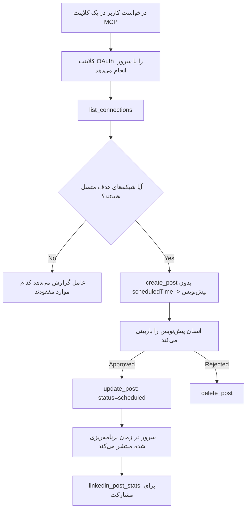

# مطالعه موردی: انتشار در شبکه‌های اجتماعی از طریق یک عامل با سرور MCP از راه دور

> **توضیح:** چندین سرویس و پروژه متن‌باز می‌توانند در شبکه‌های اجتماعی منتشر کنند و یک تیم همچنین می‌تواند مستقیماً API هر شبکه را یکپارچه کند. سناریوی زیر به عنوان یک مثال عملی ارائه شده است برای چگونگی طراحی و استفاده از یک سرور MCP از راه دور **قابل نوشتن**. Publora یک سرویس تجاری با یک طرح رایگان است؛ الگوهای شرح داده شده در اینجا برای هر سرور MCP که کارهای غیرقابل بازگشت را به نمایندگی از کاربر اجرا می‌کند قابل استفاده است.

## نمای کلی

عوامل در تهیه پیش‌نویس محتوا خوب عمل می‌کنند اما در انتشار آن ضعیف‌اند. یک مدل می‌تواند در چند ثانیه اطلاعیه خبری بنویسد، سپس کار متوقف می‌شود: انتشار آن به معنای یک API برای هر شبکه، یک برنامه OAuth برای هر شبکه، و مجموعه‌ای متفاوت از قوانین رسانه برای هر کدام است. اکثر تیم‌ها این مشکل را با کپی‌کردن متن به صورت دستی در مرورگر حل می‌کنند.

این مطالعه موردی بررسی می‌کند چگونه این گام نهایی با یک سرور MCP از راه دور واحد بسته می‌شود و — برای هر کسی که می‌خواهد چنین سروری بسازد — تصمیمات طراحی که یک سرور **قابل نوشتن** باید به درستی بگیرد. خواندن داده‌ها بخشوده می‌شود. انتشار نیست: فراخوان نادرست ابزار برای مخاطب قابل مشاهده است و قابل برگشت نیست.

## سناریو

یک تیم کوچک روابط توسعه‌دهنده پست‌ها را در داخل یک عامل (Claude، VS Code، Cursor — مشتری اهمیتی ندارد) پیش‌نویس می‌کند. آنها می‌خواهند عامل:

- ببیند کدام حساب‌های اجتماعی تیم متصل شده‌اند،
- پستی پیش‌نویس کند و آن را به عنوان پیش‌نویس نگه دارد تا یک انسان تایید کند،
- یک تصویر پیوست کند،
- آن را برای چندین شبکه در زمان انتخاب شده برنامه‌ریزی کند،
- و بعداً گزارش دهد چگونه عمل کرده است.

مهم است که آنها بخواهند عامل *توانایی* انتشار تصادفی در حین آزمایش داشته باشد را نداشته باشد.

## ابزارهای استفاده شده

- [سرور MCP Publora](https://github.com/publora/mcp-server) — یک سرور MCP از راه دور (`streamable-http`) که ابزارهای انتشار، زمان‌بندی، رسانه و تحلیل‌های LinkedIn را ارائه می‌دهد. در رجیستری رسمی MCP به نام `com.publora/mcp-server` ثبت شده است.

## جریان کاری گام به گام

1. **اتصال سرور.** مشتریان دارای OAuth جریان کد مجوز با PKCE را در مقابل صفحه تأیید خود سرور کامل می‌کنند؛ مشتریانی که ندارند، مثل CLI بدون سر، از کلید API Publora در هدر استفاده می‌کنند. هر دو مسیر پشتیبانی می‌شوند و مسیر انتخابی به مشتری بستگی دارد، نه به سرور.
2. **لیست کانکشن‌ها.** عامل `list_connections` را فراخوانی می‌کند و حساب‌های متصل با شناسه‌شان را دریافت می‌کند.
3. **پیش‌نویس.** عامل `create_post` را *بدون* زمان برنامه‌ریزی شده فراخوانی می‌کند. پست به عنوان پیش‌نویس ذخیره می‌شود — چیزی منتشر نمی‌شود.
4. **اضافه کردن رسانه.** URLهای عمومی تصویر در همان فراخوان ارسال می‌شوند؛ سرور آنها را دانلود و اعتبارسنجی می‌کند.
5. **برنامه‌ریزی.** پس از تائید انسان، `update_post` وضعیت را به زمان‌بندی شده با زمان ISO 8601 تنظیم می‌کند.
6. **اندازه‌گیری.** برای LinkedIn، `linkedin_post_stats` هنگام زنده بودن پست آمار مشارکت را برمی‌گرداند.

## مثال درخواست

```text
Which social accounts do I have connected?
Draft a post announcing our new changelog page, attach the screenshot at
https://example.com/changelog.png, and keep it as a draft — do not publish it.
Once I approve, schedule it to LinkedIn and Bluesky for tomorrow at 09:00 UTC.
```

## نمودار جریان Mermaid



## پیاده‌سازی فنی

درس‌های زیر بخش قابل انتقال این مطالعه موردی هستند.

### کشف آزاد، اجرای احراز هویت شده

`tools/list` بدون نیاز به اعتبارنامه ارائه می‌شود؛ هر فراخوان `tools/call` نیازمند توکن است
و در غیر این صورت با `401` پاسخ می‌دهد همراه با هدر `WWW-Authenticate` که به
متادیتای منبع محافظت شده اشاره دارد. نقطه پایانی قدیمی سرور نیز به
فراخوان بدون احراز هویت `initialize` برای مشتریان با نسخه‌های پروتکل پیش از
`2026-07-28` پاسخ می‌دهد؛ مشتری‌های فعلی از آن استفاده نمی‌کنند.

این تقسیم‌بندی مختص سرور اجازه می‌دهد رجیستری‌ها، فهرست‌ها و مشتریان اسامی ابزار،
طرح‌ها و حاشیه‌نویسی‌ها را بدون نیاز به راز مشاهده کنند و در عین حال اجرای ناشناس
را ممنوع می‌کند. کشف آزاد یک انتخاب استقرار است، نه الزام MCP؛ استقرار
محافظت شده ممکن است نیازمند مجوز برای `tools/list` نیز باشد.

### ثبت نام: ثبت نام مشتری پویا و جایگزین آن

سرور `/.well-known/oauth-protected-resource` و `/.well-known/oauth-authorization-server` را تبلیغ می‌کند و از جریان کد مجوز با PKCE (`S256`)، توکن‌های تازه‌سازی و **ثبت نام مشتری پویا** پشتیبانی می‌کند.

ثبت نام پویا گام دستی را برای مشتریان قدیمی حذف کرد: بدون آن،
هر مشتری به یک `client_id` پیش‌صدور شده از فروشنده نیاز داشت.

این را به عنوان رفتار سازگاری در نظر بگیرید نه طراحی‌ای که باید کپی شود. ویرایش ۲۰۲۶-۰۷-۲۸ مشخصات، ثبت نام مشتری پویا را به نفع اسناد متادیتای شناسه مشتری منسوخ می‌کند، جایی که مشتری سند متادیتا را در یک URL پایدار HTTPS میزبانی می‌کند و آن URL *خود* `client_id` است. DCR فعلاً کار می‌کند اما سروری که امروز ساخته می‌شود باید برای CIMD برنامه‌ریزی کند و DCR را فقط برای مشتریان قدیمی حفظ کند.

### حاشیه‌نویسی ابزار دکوری نیست

هر ابزار یک `title` و راهنمای قابل اجرا شامل `readOnlyHint`، `destructiveHint`، `idempotentHint`، و `openWorldHint` دارد.

دو دلیل برای سرمایه‌گذاری روی آنها وجود دارد. اول، مشتریان از راهنماها برای تصمیم‌گیری درباره تأیید گرفتن از کاربر استفاده می‌کنند — یک کلاینت می‌تواند جستجوی فقط خواندنی را به طور خودکار اجرا کند و قبل از حذف برای تأیید توقف کند. مشخصات به صراحت می‌گوید که حاشیه‌نویسی‌ها راهنمای غیرقابل اعتماد هستند، نه مکانیزم مجوز: آنها شکل می‌دهند که مشتری چه کاری را پیشنهاد می‌کند، سرور را متوقف نمی‌کنند و سرور باید قوانین خودش را اجرا کند. دوم، دایرکتوری‌های عمده کانکتور اکنون آنها را برای بازبینی *الزامی* کرده‌اند؛ سروری که ابزارهایش عنوان و راهنما نداشته باشند به هر حال برگشت داده می‌شود فارغ از اینکه چقدر خوب کار کند.

### شناسه‌ها را غیرقابل حدس بسازید

شناسه‌های پلتفرم رشته‌های مبهمی هستند که توسط `list_connections` برگردانده می‌شوند و توضیحات طرح به صراحت می‌گوید که باید دقیقاً کپی شده و هرگز حدس زده نشوند. سرور هر چیز دیگری را رد می‌کند.

مدل‌ها حدس‌زن‌های ماهری هستند. هر سرور قابل نوشتنی باید فرض کند که یک شناسه در نهایت اشتباه ساخته می‌شود و آن مسیر را به طور بلند و زودهنگام با شکست مواجه سازد، نه اینکه بر اساس یک مقدار قابل احتمال عمل کند.

### پیش از انتشار خطا بدهید با پیامی قابل اقدام

برخی شبکه‌ها پست‌های فقط متنی را رد می‌کنند و تصویر یا ویدئو نیاز دارند. این هنگام زمان‌بندی پست اعتبارسنجی می‌شود و نام پلتفرم و نیاز مفقوده را خطا می‌دهد.

یک عامل می‌تواند از "اینستاگرام نیاز به رسانه دارد — تصویر یا ویدئو ضمیمه کنید" بدون گردش دوباره بازیابی کند. نمی‌تواند از یک `400` عمومی بازیابی کند.

### تلاش‌های مجدد را ایمن کنید

دو ابزاری که محتوا ایجاد می‌کنند، `create_post` و `update_post`، کلید یکنواختی می‌پذیرند: استفاده مجدد از آن با درخواست یکسان پاسخ اصلی را بازپخش می‌کند به جای ایجاد پست دوم. زمان اجرای عامل‌ها بر زمان‌های تمام‌شده تلاش مجدد می‌کنند؛ بدون یکنواختی، پاسخ کند انتشار تکراری می‌شود. سایر ابزارهای نوشتن — حذف‌ها، گام‌های رسانه، واکنش‌ها و نظرهای LinkedIn — چنین کلیدی ندارند و از این‌رو تلاش مجدد آنجا خودبخود ایمن نیست. دانستن اینکه کدام تغییرات خودتان محافظت شده‌اند مهم است.

### راهی فراهم کنید که هیچ چیزی منتشر نکند برای تست

سرور هدف رزروشده `publora-playground` را می‌پذیرد که مانند یک مقصد واقعی اعتبارسنجی و تائید می‌شود و سپس کنار گذاشته می‌شود — هیچ چیزی به حساب واقعی نمی‌رسد. این در طرح ابزار خود مستند شده است که هر مشتری بدون اعتبارنامه می‌تواند بخواند: فیلد `platforms` در `create_post` آن را به عنوان "یک هدف تست اتصال که اتصال واقعی نیاز ندارد — پست تائید و کنار گذاشته می‌شود، چیزی منتشر نمی‌شود" توصیف می‌کند. آن را با ارسال تنها همین مورد فراخوانی کنید: `platforms: ["publora-playground"]`.

این یکی از مفیدترین جزئیات کل سطح بود. بازبینان دایرکتوری‌های کانکتور، مشارکت‌کنندگان و CI می‌توانند کل مسیر نوشتن را بدون خطر برای مخاطب واقعی تمرین کنند. هر سرور MCP با عمل‌های غیرقابل بازگشت از یک هدف مستند بدون عمل سود می‌برد.

## نتایج و تأثیرات

- گام انتشار از مرورگر به همان گفتگویی منتقل شد که محتوا در آن نوشته می‌شود، و عادت پیش‌نویس-اول یک انسان را در حلقه نگه می‌دارد. دقیق باشید چه چیزی است: پیش‌نویس یک قرارداد است، نه یک مرز. همان اعتبارنامه می‌تواند زمان‌بندی یا انتشار کند، پس هر کسی که نیاز به دروازه تأیید واقعی دارد باید آن را خارج از سطح ابزار اعمال کند — اعتبارنامه جداگانه، یا لایه سیاست در جلوی سرور.
- تفاوت‌های هر شبکه — نیازهای رسانه، موضوع‌بندی، کنترل پاسخ — یکبار در سرور پردازش می‌شود به جای هر عاملی که با آن صحبت می‌کند.
- همان سرور چندین مشتری MCP را بدون اعتبارنامه پیش‌صدور شده پشتیبانی می‌کند.
    مشتریان فعلی می‌توانند از اسناد متادیتای شناسه مشتری استفاده کنند؛ DCR همچنان برای مشتریان قدیمی نگه داشته شده است.

- محدودیت‌های طراحی بالا هم توسط بازبینی‌های دایرکتوری کانکتور و هم توسط کاربران شکل گرفت: حاشیه‌نویسی‌ها، OAuth و هدف تست ایمن هرکدام حداقل توسط یکی از آنها لازم شده است.

## منابع

- [سرور MCP Publora (کد منبع)](https://github.com/publora/mcp-server)
- [مستندات API و MCP Publora](https://docs.publora.com)
- [ورود رجیستری MCP: `com.publora/mcp-server`](https://registry.modelcontextprotocol.io/v0/servers?search=com.publora/mcp-server)
- [مشخصات MCP — مجوز](https://modelcontextprotocol.io/specification/2026-07-28/basic/authorization)
- [مشخصات MCP — حاشیه‌نویسی ابزار](https://modelcontextprotocol.io/docs/concepts/tools)

## مراحل بعدی

- سروری که می‌سازید را بردارید و سه پیروزی کم‌هزینه اینجا را بررسی کنید: حاشیه‌نویسی روی هر ابزار، کلید یکنواختی روی هر نوشتن، و هدف بدون‌عمل مستند شده.
- تقسیم‌بندی کشف آزاد را امتحان کنید: `tools/list` را بدون اعتبارنامه روی یک سرور راه دور عمومی فراخوانی کنید، سپس یک ابزار را فراخوانی و چالش `401` را بررسی کنید.
- درباره معنای "بازگرداندن" در حوزه خود فکر کنید. انتشار پیش‌نویس‌ها و حذف را دارد؛ اگر عمل‌های شما معادل ندارد، تأیید باید در طراحی ابزار باشد، نه در درخواست.

---

<!-- CO-OP TRANSLATOR DISCLAIMER START -->
**سلب مسئولیت**:
این سند با استفاده از سرویس ترجمه هوش مصنوعی [Co-op Translator](https://github.com/Azure/co-op-translator) ترجمه شده است. در حالی که ما در تلاش برای دقت هستیم، لطفاً توجه داشته باشید که ترجمه‌های خودکار ممکن است شامل خطاها یا نادرستی‌هایی باشند. سند اصلی به زبان مادری خود باید به عنوان منبع معتبر در نظر گرفته شود. برای اطلاعات حیاتی، ترجمه حرفه‌ای انسانی توصیه می‌شود. ما در قبال هرگونه سوء تفاهم یا برداشت نادرست ناشی از استفاده از این ترجمه مسئولیتی نداریم.
<!-- CO-OP TRANSLATOR DISCLAIMER END -->