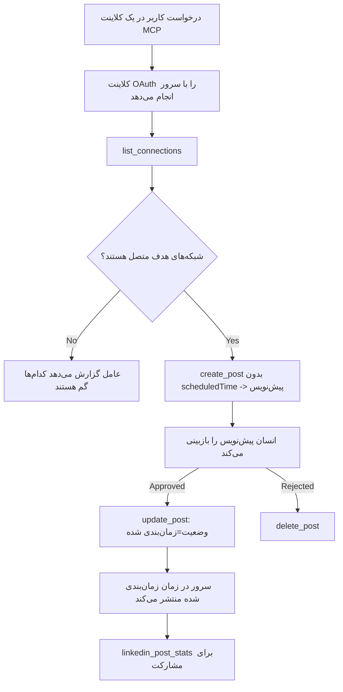

# مطالعه موردی: انتشار در شبکه‌های اجتماعی از طریق عامل با سرور MCP راه دور

> **سلب مسئولیت:** چندین سرویس و پروژه منبع باز می‌توانند در شبکه‌های اجتماعی منتشر کنند و یک تیم همچنین می‌تواند مستقیماً از API هر شبکه استفاده کند. سناریوی زیر به عنوان یک مثال عملی از چگونگی طراحی و استفاده از یک **سرور MCP راه دور با قابلیت نوشتن** ارائه شده است. Publora یک سرویس تجاری با پلن رایگان است؛ الگوهای مطرح شده در اینجا برای هر سرور MCP که اقدامات غیرقابل برگشت به نمایندگی از کاربر انجام می‌دهد، کاربرد دارد.

## مرور کلی

عامل‌ها در نوشتن محتوا خوب هستند اما در تحویل آن ضعیف عمل می‌کنند. یک مدل می‌تواند در چند ثانیه اطلاع‌رسانی انتشار را بنویسد و سپس کار متوقف می‌شود: برای انتشار، نیاز به یک API برای هر شبکه، یک اپ OAuth برای هر شبکه و مجموعه متفاوتی از قوانین رسانه‌ای برای هر کدام است. بیشتر تیم‌ها این را با کپی کردن متن به درون مرورگر به صورت دستی حل می‌کنند.

این مطالعه موردی بررسی می‌کند که چگونه این مرحله نهایی با یک سرور MCP راه دور واحد بسته می‌شود، و — به شکل مفیدتر برای هر کسی که می‌خواهد یکی بسازد — تصمیمات طراحی یک سرور **با قابلیت نوشتن** که باید درست انجام شود. خواندن داده‌ها بخشنده است. انتشار این‌طور نیست: یک فراخوان نادرست به ابزار برای مخاطبان قابل مشاهده است و قابل بازگشت نیست.

## سناریو

یک تیم کوچک روابط توسعه‌دهنده پست‌ها را درون یک عامل (Claude، VS Code، Cursor — کلاینت مهم نیست) پیش‌نویس می‌کند. آن‌ها می‌خواهند عامل بتواند:

- ببیند کدام حساب‌های اجتماعی تیم متصل شده‌اند،
- یک پست پیش‌نویس کند و آن را به عنوان پیش‌نویس برای تصویب انسان حفظ کند،
- یک تصویر ضمیمه کند،
- زمان‌بندی برای انتشار در چند شبکه در زمانی انتخاب شده،
- و بعداً گزارشی از عملکرد آن ارائه دهد.

نکته مهم این است که آن‌ها می‌خواهند عامل **قادر به انتشار تصادفی نباشد** در حالی که هنوز آزمایش می‌کنند.

## ابزارهای استفاده شده

- [سرور MCP Publora](https://github.com/publora/mcp-server) — یک سرور MCP راه دور (`streamable-http`) که انتشار، زمان‌بندی، رسانه و ابزارهای آمار لینکدین را ارائه می‌دهد. در فهرست رسمی MCP به نام `com.publora/mcp-server` ثبت شده است.

## فرآیند مرحله به مرحله

1. **اتصال به سرور.** کلاینت‌هایی که OAuth صحبت می‌کنند، جریان کد مجوز را با PKCE در صفحه رضایت سرور انجام می‌دهند؛ کلاینت‌هایی که چنین نیستند، مانند CLI بدون سر، از کلید API Publora در هدر استفاده می‌کنند. هر دو مسیر پشتیبانی می‌شوند و کدام استفاده می‌کنید به کلاینت بستگی دارد، نه به سرور.
2. **فهرست اتصال‌ها.** عامل `list_connections` را فراخوانی می‌کند و حساب‌های متصل شده همراه با شناسه‌های آن‌ها را دریافت می‌کند.
3. **پیش‌نویس.** عامل `create_post` را *بدون* زمان‌بندی فراخوانی می‌کند. پست به عنوان پیش‌نویس ذخیره می‌شود — هیچ چیزی منتشر نمی‌شود.
4. **ضمیمه کردن رسانه.** آدرس‌های تصویر عمومی در همان فراخوانی ارسال می‌شوند؛ سرور آن‌ها را دانلود و اعتبارسنجی می‌کند.
5. **زمان‌بندی.** پس از تأیید انسان، `update_post` وضعیت را به زمان‌بندی شده با یک زمان ISO 8601 تغییر می‌دهد.
6. **اندازه‌گیری.** برای لینکدین، `linkedin_post_stats` پس از انتشار پست، میزان تعامل را بازمی‌گرداند.

## نمونه دستور

```text
Which social accounts do I have connected?
Draft a post announcing our new changelog page, attach the screenshot at
https://example.com/changelog.png, and keep it as a draft — do not publish it.
Once I approve, schedule it to LinkedIn and Bluesky for tomorrow at 09:00 UTC.
```

## نمودار جریان Mermaid



## پیاده‌سازی فنی

درس‌های زیر بخش انتقال‌پذیر این مطالعه موردی هستند.

### کشف باز، اجرای تأیید شده

`tools/list` بدون نیاز به اعتبار ارائه می‌شود؛ هر `tools/call` نیازمند توکن است و در غیر این صورت `401` با هدر `WWW-Authenticate` که به متادیتای منبع محافظت شده اشاره دارد بازمی‌گردد. (سرور همچنین به فراخوانی `initialize` بدون احراز هویت پاسخ می‌دهد، که فقط برای کلاینت‌های پروتکل‌های قبل از `2026-07-28` اهمیت دارد؛ آن بازنگری دست دادن را کامل حذف کرده است.)

این تقسیم بندی در عمل اهمیت دارد. رجیستری‌ها، کاتالوگ‌ها و کلاینت‌ها می‌توانند سطح ابزار — نام‌ها، مدل‌ها، نشانه‌ها — را بدون نگه داشتن راز بررسی کنند، در حالی که هیچ چیز به صورت ناشناس *اجرایی* نیست. سروری که برای `initialize` توکن می‌خواهد، عملاً برای ابزارها نامرئی است؛ سروری که `tools/call` ناشناس می‌پذیرد، ریسک دارد.

### ثبت‌نام: ثبت مشتری پویا و جایگزین آن

سرور `/.well-known/oauth-protected-resource` و `/.well-known/oauth-authorization-server` را اعلام می‌کند و جریان کد مجوز با PKCE (`S256`)، توکن‌های تازه‌سازی و **ثبت مشتری پویا** را پشتیبانی می‌کند.

ثبت پویا مرحله دستی را حذف می‌کند: بدون آن هر کلاینت به یک `client_id` از پیش صادر شده نیاز دارد، که یعنی درخواست خارج از باند به فروشنده برای هر کلاینت جدید.

این را به عنوان رفتار سازگاری در نظر بگیرید نه طراحی‌ای برای کپی کردن. بازنگری `2026-07-28` مشخصات، ثبت مشتری پویا را منسوخ می‌کند به نفع اسناد متادیتای شناسه مشتری، که کلاینت یک سند متادیتا را در URL HTTPS پایدار میزبانی می‌کند و آن URL *شناسه مشتری* است. DCR فعلاً کار می‌کند، اما سروری که امروز ساخته می‌شود باید برای CIMD برنامه‌ریزی کند و DCR را فقط برای کلاینت‌های قدیمی نگه دارد.

### نشانه‌های ابزار تزئین نیستند

هر ابزار یک `title` و نشانه‌های قابل اعمال: `readOnlyHint`، `destructiveHint`، `idempotentHint`، `openWorldHint` دارد.

دو دلیل برای سرمایه‌گذاری روی آن‌ها. اول، کلاینت‌ها از نشانه‌ها برای تصمیم‌گیری درباره تأیید با کاربر استفاده می‌کنند — کلاینت می‌تواند به طور خودکار جستجوی فقط خواندنی را انجام دهد و قبل از حذف منتظر تأیید شود. مشخصات صریح است که نشانه‌ها فقط راهنمای غیرقابل اعتماد هستند، نه مکانیزم مجوز: آن‌ها تعیین می‌کنند که کلاینت چه کاری ارائه می‌دهد، سرور را متوقف نمی‌کنند و سرور باید قوانین خود را اعمال کند. دوم، فهرست‌نامه‌های اصلی کانکتور اکنون *اجباری* هستند برای بازبینی؛ سروری که ابزارهایش فاقد عنوان و نشانه باشند، بدون توجه به عملکردش پس فرستاده می‌شود.

### شناسه‌ها غیرقابل ساخت‌وپرداخت باشند

شناسه‌های پلتفرم رشته‌های غیرشفاف هستند که توسط `list_connections` برگشت داده می‌شوند و توصیف مدل صراحتاً می‌گوید باید آن‌ها را دقیقاً کپی کرد و هرگز حدس نزد. سرور هر چیز دیگری را رد می‌کند.

مدل‌ها حدس‌زن ماهری هستند. هر سرور با قابلیت نوشتن باید فرض کند شناسه‌ای در نهایت خیالی خواهد بود و آن مسیر را سریع و پر سر و صدا رد کند، نه اینکه روی مقدار به ظاهر معقول عمل کند.

### قبل از انتشار شکست بخورید با پیام قابل اقدام

برخی شبکه‌ها پست‌های فقط متنی را رد می‌کنند و نیاز به تصویر یا ویدئو دارند. این هنگام زمان‌بندی اعتبارسنجی می‌شود و خطا نام پلتفرم و نیازمندی گمشده را نشان می‌دهد.

یک عامل می‌تواند از خطای «اینستاگرام نیاز به رسانه دارد — تصویر یا ویدئو ضمیمه کنید» بدون رفت و برگشت دیگر بازیابی کند. از خطای عمومی `400` نمی‌تواند بازیابی کند.

### تکرارها را ایمن کنید

دو ابزار ایجاد محتوا، `create_post` و `update_post`، کلید ایندمپوتنتی می‌پذیرند: استفاده مجدد از آن با درخواست یکسان پاسخ اصلی را بدون ایجاد پست دوم تکرار می‌کند. زمان اجرای عامل‌ها در تایم‌اوت‌ها تکرار می‌شوند؛ بدون ایندمپوتنتی، پاسخ کند منجر به انتشار تکراری می‌شود. سایر ابزارهای نوشتنی — حذف‌ها، مراحل رسانه، واکنش‌ها و کامنت‌های لینکدین — چنین کلیدی ندارند، پس تکرار در آن‌ها به طور خودکار ایمن نیست. اطلاع از اینکه کدام تغییرات شما محافظت شده‌اند و کدام نیستند مهم است.

### راهی برای آزمایش که هیچ چیزی را منتشر نکند فراهم کنید

سرور هدف رزرو شده `publora-playground` را می‌پذیرد، که مانند مقصد واقعی اعتبارسنجی و تأیید می‌شود و سپس نادیده گرفته می‌شود — هیچ چیزی به حساب زنده ارسال نمی‌شود. این در مدل ابزار خود شرح داده شده است، که هر کلاینت بدون اعتبار می‌تواند بخواند: فیلد `platforms` در `create_post` آن را به عنوان "هدف تست اتصال که هیچ اتصال واقعی نمی‌خواهد — پست تأیید وDiscard می‌شود، هیچ چیزی منتشر نمی‌شود" مستند کرده است. با ارسال به عنوان تنها ورودی `platforms: ["publora-playground"]` آن را فراخوانی کنید.

این یکی از مفیدترین جزئیات کل سطح بود. بازبینان فهرست‌های کانکتور، مشارکت‌کنندگان و CI می‌توانند مسیر کامل نوشتن را از ابتدا تا انتها بدون ریسک برای مخاطب واقعی اجرا کنند. هر سرور MCP با عملیات غیرقابل برگشت از وجود یک هدف no-op مستندسازی شده سود می‌برد.

## نتایج و تأثیر

- مرحله انتشار از مرورگر به همان گفتگویی منتقل شد که محتوا نوشته می‌شود، و عادت پیش‌نویس اول یک انسان را در چرخه نگه می‌دارد. دقیق باشید درباره اینکه پیش‌نویس چیست: پیش‌نویس یک قرارداد است، نه یک مرز. همان اعتبارنامه می‌تواند زمان‌بندی یا انتشار انجام دهد، پس هر کسی که نیاز به دروازه تأیید واقعی دارد باید آن را بیرون از سطح ابزار اجرا کند — اعتبارنامه‌های جدا، یا لایه سیاستی جلوی سرور.
- تفاوت‌های هر شبکه — نیازمندی‌های رسانه، threading، کنترل‌های پاسخ — یک بار در سرور مدیریت می‌شود به جای هر عاملی که با آن حرف می‌زند.
- همان سرور چندین کلاینت MCP را بدون کار مخصوص کلاینت پشتیبانی می‌کند، زیرا کشف باز و ثبت پویا است.
- محدودیت‌های طراحی فوق توسط بازبینی‌های دایرکتوری کانکتور همانقدر که توسط کاربران شکل گرفته، شامل نشانه‌ها، OAuth و هدف تست ایمن بود که هر کدام حداقل توسط یکی از آن‌ها نیاز شده بود.

## مراجع

- [سرور MCP Publora (منبع)](https://github.com/publora/mcp-server)
- [مستندات API و MCP Publora](https://docs.publora.com)
- [ورودی رجیستری MCP: `com.publora/mcp-server`](https://registry.modelcontextprotocol.io/v0/servers?search=com.publora/mcp-server)
- [مشخصات MCP — مجوز](https://modelcontextprotocol.io/specification/draft/basic/authorization)
- [مشخصات MCP — نشانه‌های ابزار](https://modelcontextprotocol.io/docs/concepts/tools)

## مرحله بعد

- یک سرور MCP که در حال ساخت آن هستید بردارید و سه بردار ارزان اینجا را بررسی کنید: نشانه‌ها روی هر ابزار، کلید ایندمپوتنتی روی هر نوشتن، و هدف no-op مستند شده.
- تقسیم کشف باز را امتحان کنید: `tools/list` را روی یک سرور راه دور عمومی بدون اعتبار فراخوانی کنید، سپس یک ابزار را فراخوانی و چالش `401` را بررسی کنید.
- فکر کنید «واگرد» در دامنه شما چه معنایی دارد. انتشار پیش‌نویس و حذف دارد؛ اگر اقدامات شما معادلی ندارند، تأیید باید در طراحی ابزار باشد، نه در دستور.

---

<!-- CO-OP TRANSLATOR DISCLAIMER START -->
**سلب مسئولیت**:
این سند با استفاده از سرویس ترجمه هوش مصنوعی [Co-op Translator](https://github.com/Azure/co-op-translator) ترجمه شده است. در حالی که ما در تلاش برای دقت هستیم، لطفاً توجه داشته باشید که ترجمه‌های خودکار ممکن است شامل خطاها یا نادرستی‌هایی باشند. سند اصلی به زبان مادری خود باید به عنوان منبع معتبر در نظر گرفته شود. برای اطلاعات حیاتی، ترجمه حرفه‌ای انسانی توصیه می‌شود. ما در قبال هرگونه سوء تفاهم یا برداشت نادرست ناشی از استفاده از این ترجمه مسئولیتی نداریم.
<!-- CO-OP TRANSLATOR DISCLAIMER END -->