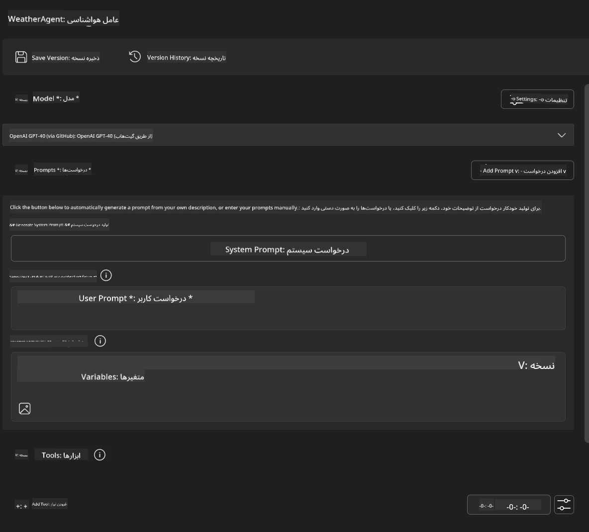
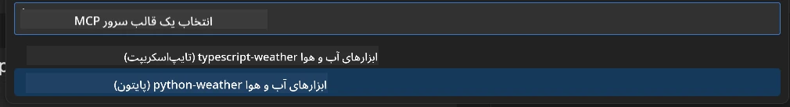
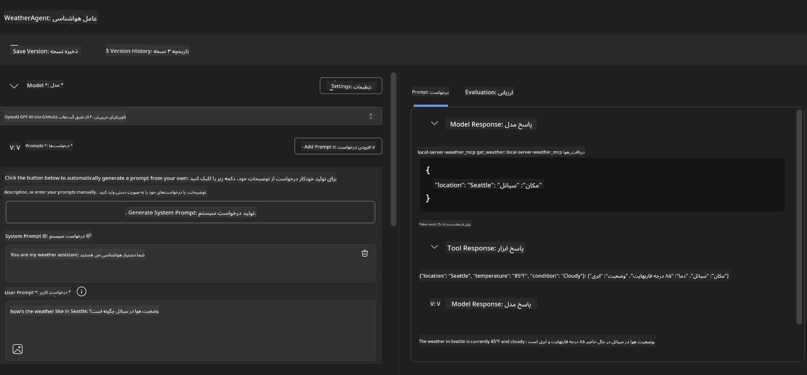
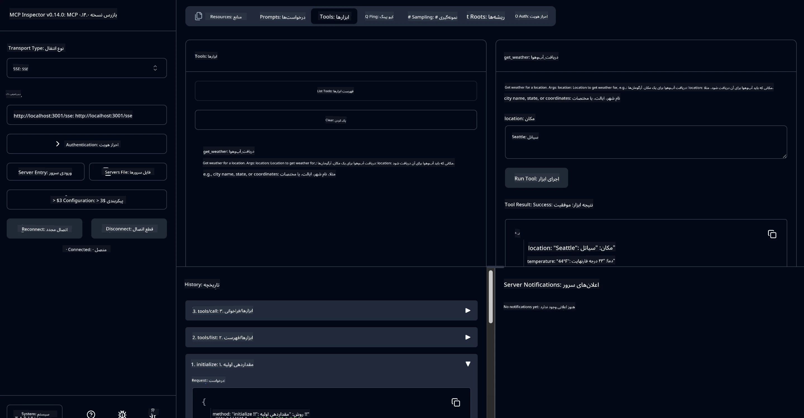

# 🔧 ماژول ۳: توسعه پیشرفته MCP با Microsoft Foundry Toolkit

> [!NOTE]
> آدرس‌های Inspector در این آزمایشگاه از نقطه پایانی قدیمی `/sse` استفاده می‌کنند و 
> وابستگی‌های MCP SDK `1.9.3` و Inspector `0.14.0` پین شده را هدف قرار می‌دهند. 
> این‌ها نمونه‌های HTTP قابل استریم فعلی `2026-07-28` نیستند.


## 🎯 اهداف یادگیری

در پایان این آزمایشگاه، شما قادر خواهید بود:

- ✅ ایجاد سرورهای سفارشی MCP با استفاده از Microsoft Foundry Toolkit
- ✅ پیکربندی و استفاده از جدیدترین نسخه MCP Python SDK (نسخه 1.9.3)
- ✅ راه اندازی و استفاده از MCP Inspector برای خطایابی
- ✅ خطایابی سرورهای MCP در هر دو محیط Agent Builder و Inspector
- ✅ درک جریان‌های کاری پیشرفته توسعه سرور MCP

## 📋 پیش‌نیازها

- اتمام آزمایشگاه ۲ (مبانی MCP)
- VS Code با افزونه Microsoft Foundry Toolkit نصب شده
- محیط Python 3.10 یا بالاتر
- Node.js و npm برای راه‌اندازی Inspector

## 🏗️ آنچه خواهید ساخت

در این آزمایشگاه، شما یک **سرور MCP هواشناسی** ایجاد خواهید کرد که موارد زیر را نشان می‌دهد:
- پیاده‌سازی سرور MCP سفارشی
- یکپارچه‌سازی با Agent Builder از Microsoft Foundry Toolkit
- جریان‌های کاری حرفه‌ای برای خطایابی
- الگوهای استفاده از SDK مدرن MCP

---

## 🔧 مرور بر اجزای اصلی

### 🐍 MCP Python SDK
مجموعه ابزار پروتکل مدل کانتکست Python مبنای ساخت سرورهای سفارشی MCP را فراهم می‌کند. در اینجا از نسخه 1.9.3 با قابلیت‌های پیشرفته خطایابی استفاده خواهید کرد.

### 🔍 MCP Inspector
ابزاری قدرتمند برای خطایابی که ارائه می‌دهد:
- نظارت بلادرنگ سرور
- تجسم اجرای ابزارها
- بررسی درخواست‌ها و پاسخ‌های شبکه
- محیط تست تعاملی

---

## 📖 پیاده‌سازی گام به گام

### گام ۱: ایجاد یک WeatherAgent در Agent Builder

1. **Agent Builder را** در VS Code از طریق افزونه Microsoft Foundry Toolkit راه‌اندازی کنید
2. **یک agent جدید ایجاد کنید** با پیکربندی زیر:
   - نام agent: `WeatherAgent`



### گام ۲: مقداردهی اولیه پروژه سرور MCP

1. **در Agent Builder به Tools → Add Tool بروید**
2. **"MCP Server" را از گزینه‌های موجود انتخاب کنید**
3. **گزینه "ایجاد یک سرور MCP جدید" را انتخاب کنید**
4. **قالب `python-weather` را انتخاب نمایید**
5. **نام سرور خود را بگذارید:** `weather_mcp`



### گام ۳: باز کردن و بررسی پروژه

1. **پروژه ایجاد شده را در VS Code باز کنید**
2. **ساختار پروژه را مرور کنید:**
   ```
   weather_mcp/
   ├── src/
   │   ├── __init__.py
   │   └── server.py
   ├── inspector/
   │   ├── package.json
   │   └── package-lock.json
   ├── .vscode/
   │   ├── launch.json
   │   └── tasks.json
   ├── pyproject.toml
   └── README.md
   ```

### گام ۴: ارتقاء به آخرین نسخه MCP SDK

> **🔍 چرا ارتقاء؟** ما می‌خواهیم از جدیدترین نسخه MCP SDK (1.9.3) و سرویس Inspector (0.14.0) برای قابلیت‌های بیشتر و خطایابی بهتر استفاده کنیم.

#### ۴الف. به‌روزرسانی وابستگی‌های Python

**ویرایش `pyproject.toml`:** بروزرسانی [./code/weather_mcp/pyproject.toml](../../../../10-StreamliningAIWorkflowsBuildingAnMCPServerWithAIToolkit/lab3/code/weather_mcp/pyproject.toml)


#### ۴ب. به‌روزرسانی پیکربندی Inspector

**ویرایش `inspector/package.json`:** بروزرسانی [./code/weather_mcp/inspector/package.json](../../../../10-StreamliningAIWorkflowsBuildingAnMCPServerWithAIToolkit/lab3/code/weather_mcp/inspector/package.json)

#### ۴ج. به‌روزرسانی وابستگی‌های Inspector

**ویرایش `inspector/package-lock.json`:** بروزرسانی [./code/weather_mcp/inspector/package-lock.json](../../../../10-StreamliningAIWorkflowsBuildingAnMCPServerWithAIToolkit/lab3/code/weather_mcp/inspector/package-lock.json)

> **📝 توجه:** این فایل شامل تعریف‌های گسترده وابستگی است. ساختار ضروری در زیر آمده است - محتوای کامل تضمین کننده رزولوشن درست وابستگی‌ها است.


> **⚡ قفل کامل بسته‌ها:** فایل کامل package-lock.json شامل حدود ۳۰۰۰ خط تعریف وابستگی است. ساختار کلیدی بالا نشان داده شده است - از فایل ارائه شده برای رزولوشن کامل وابستگی استفاده کنید.

### گام ۵: پیکربندی خطایابی در VS Code

*توجه: لطفا فایل در مسیر مشخص شده را کپی کنید تا جایگزین فایل محلی مربوطه شود*

#### ۵الف. به‌روزرسانی پیکربندی اجرا

**ویرایش `.vscode/launch.json`:**

```json
{
  "version": "0.2.0",
  "configurations": [
    {
      "name": "Attach to Local MCP",
      "type": "debugpy",
      "request": "attach",
      "connect": {
        "host": "localhost",
        "port": 5678
      },
      "presentation": {
        "hidden": true
      },
      "internalConsoleOptions": "neverOpen",
      "postDebugTask": "Terminate All Tasks"
    },
    {
      "name": "Launch Inspector (Edge)",
      "type": "msedge",
      "request": "launch",
      "url": "http://localhost:6274?timeout=60000&serverUrl=http://localhost:3001/sse#tools",
      "cascadeTerminateToConfigurations": [
        "Attach to Local MCP"
      ],
      "presentation": {
        "hidden": true
      },
      "internalConsoleOptions": "neverOpen"
    },
    {
      "name": "Launch Inspector (Chrome)",
      "type": "chrome",
      "request": "launch",
      "url": "http://localhost:6274?timeout=60000&serverUrl=http://localhost:3001/sse#tools",
      "cascadeTerminateToConfigurations": [
        "Attach to Local MCP"
      ],
      "presentation": {
        "hidden": true
      },
      "internalConsoleOptions": "neverOpen"
    }
  ],
  "compounds": [
    {
      "name": "Debug in Agent Builder",
      "configurations": [
        "Attach to Local MCP"
      ],
      "preLaunchTask": "Open Agent Builder",
    },
    {
      "name": "Debug in Inspector (Edge)",
      "configurations": [
        "Launch Inspector (Edge)",
        "Attach to Local MCP"
      ],
      "preLaunchTask": "Start MCP Inspector",
      "stopAll": true
    },
    {
      "name": "Debug in Inspector (Chrome)",
      "configurations": [
        "Launch Inspector (Chrome)",
        "Attach to Local MCP"
      ],
      "preLaunchTask": "Start MCP Inspector",
      "stopAll": true
    }
  ]
}
```

**ویرایش `.vscode/tasks.json`:**

```
{
  "version": "2.0.0",
  "tasks": [
    {
      "label": "Start MCP Server",
      "type": "shell",
      "command": "python -m debugpy --listen 127.0.0.1:5678 src/__init__.py sse",
      "isBackground": true,
      "options": {
        "cwd": "${workspaceFolder}",
        "env": {
          "PORT": "3001"
        }
      },
      "problemMatcher": {
        "pattern": [
          {
            "regexp": "^.*$",
            "file": 0,
            "location": 1,
            "message": 2
          }
        ],
        "background": {
          "activeOnStart": true,
          "beginsPattern": ".*",
          "endsPattern": "Application startup complete|running"
        }
      }
    },
    {
      "label": "Start MCP Inspector",
      "type": "shell",
      "command": "npm run dev:inspector",
      "isBackground": true,
      "options": {
        "cwd": "${workspaceFolder}/inspector",
        "env": {
          "CLIENT_PORT": "6274",
          "SERVER_PORT": "6277",
        }
      },
      "problemMatcher": {
        "pattern": [
          {
            "regexp": "^.*$",
            "file": 0,
            "location": 1,
            "message": 2
          }
        ],
        "background": {
          "activeOnStart": true,
          "beginsPattern": "Starting MCP inspector",
          "endsPattern": "Proxy server listening on port"
        }
      },
      "dependsOn": [
        "Start MCP Server"
      ]
    },
    {
      "label": "Open Agent Builder",
      "type": "shell",
      "command": "echo ${input:openAgentBuilder}",
      "presentation": {
        "reveal": "never"
      },
      "dependsOn": [
        "Start MCP Server"
      ],
    },
    {
      "label": "Terminate All Tasks",
      "command": "echo ${input:terminate}",
      "type": "shell",
      "problemMatcher": []
    }
  ],
  "inputs": [
    {
      "id": "openAgentBuilder",
      "type": "command",
      "command": "ai-mlstudio.agentBuilder",
      "args": {
        "initialMCPs": [ "local-server-weather_mcp" ],
        "triggeredFrom": "vsc-tasks"
      }
    },
    {
      "id": "terminate",
      "type": "command",
      "command": "workbench.action.tasks.terminate",
      "args": "terminateAll"
    }
  ]
}
```


---

## 🚀 اجرای سرور MCP و تست آن

### گام ۶: نصب وابستگی‌ها

پس از انجام تغییرات پیکربندی، دستورات زیر را اجرا کنید:

**نصب وابستگی‌های Python:**
```bash
uv sync
```

**نصب وابستگی‌های Inspector:**
```bash
cd inspector
npm install
```

### گام ۷: خطایابی با Agent Builder

1. **کلید F5 را فشار دهید** یا از پیکربندی **"Debug in Agent Builder"** استفاده کنید
2. **پیکربندی ترکیبی را از پنل خطایابی انتخاب کنید**
3. **منتظر شروع سرور باشید** و باز شدن Agent Builder
4. **سرور MCP هواشناسی خود را با پرسش‌های زبان طبیعی تست کنید**

ورودی نمونه به این شکل است

SYSTEM_PROMPT

```
You are my weather assistant
```

USER_PROMPT

```
How's the weather like in Seattle
```



### گام ۸: خطایابی با MCP Inspector

1. **از پیکربندی "Debug in Inspector" استفاده کنید** (Edge یا Chrome)
2. **رابط Inspector را در `http://localhost:6274` باز کنید**
3. **محیط تست تعاملی را بررسی کنید:**
   - ابزارهای موجود را مشاهده کنید
   - اجرای ابزارها را تست کنید
   - درخواست‌های شبکه را پایش کنید
   - پاسخ‌های سرور را خطایابی کنید



---

## 🎯 نتایج کلیدی یادگیری

با تکمیل این آزمایشگاه، شما:

- [x] **یک سرور MCP سفارشی ایجاد کرده‌اید** با استفاده از قالب‌های Microsoft Foundry Toolkit
- [x] **به جدیدترین نسخه MCP SDK** (نسخه 1.9.3) ارتقاء داده‌اید برای عملکرد بهتر
- [x] **جریان‌های کاری حرفه‌ای خطایابی** را برای Agent Builder و Inspector پیکربندی کرده‌اید
- [x] **MCP Inspector را راه‌اندازی کرده‌اید** برای تست تعاملی سرور
- [x] **پیکربندی‌های خطایابی VS Code** را برای توسعه MCP مسلط شده‌اید

## 🔧 ویژگی‌های پیشرفته بررسی شده

| ویژگی | توضیحات | مورد استفاده |
|---------|-------------|----------|
| **MCP Python SDK نسخه 1.9.3** | پیاده‌سازی جدید پروتکل | توسعه سرور مدرن |
| **MCP Inspector نسخه 0.14.0** | ابزار خطایابی تعاملی | تست بلادرنگ سرور |
| **خطایابی VS Code** | محیط توسعه یکپارچه | جریان کاری حرفه‌ای خطایابی |
| **یکپارچه‌سازی Agent Builder** | اتصال مستقیم به Microsoft Foundry Toolkit | تست انتها به انتهای agent |

## 📚 منابع اضافی

- [مستندات MCP Python SDK](https://modelcontextprotocol.io/docs/sdk/python)
- [راهنمای افزونه Microsoft Foundry Toolkit](https://code.visualstudio.com/docs/ai/ai-toolkit)
- [مستندات خطایابی VS Code](https://code.visualstudio.com/docs/editor/debugging)
- [مشخصات Model Context Protocol](https://modelcontextprotocol.io/docs/concepts/architecture)

---

**🎉 تبریک!** شما با موفقیت آزمایشگاه ۳ را به پایان رسانده‌اید و اکنون می‌توانید سرورهای سفارشی MCP را با استفاده از جریان‌های کاری توسعه حرفه‌ای ایجاد، خطایابی و مستقر کنید.

### 🔜 ادامه به ماژول بعدی

آماده‌اید مهارت‌های MCP خود را در یک جریان کاری توسعه دنیای واقعی به کار ببرید؟ به **[ماژول ۴: توسعه عملی MCP - سرور کلون GitHub سفارشی](../lab4/README.md)** بروید که در آن:
- سرور MCP آماده تولید می‌سازید که عملیات مخزن GitHub را به صورت خودکار انجام می‌دهد
- قابلیت کلون مخزن GitHub را از طریق MCP پیاده‌سازی می‌کنید
- سرورهای MCP سفارشی را با VS Code و حالت Agent Copilot GitHub ادغام می‌کنید
- سرورهای MCP سفارشی را در محیط‌های تولید تست و مستقر می‌کنید
- گردش کار اتوماسیون عملی برای توسعه‌دهندگان را می‌آموزید

---

<!-- CO-OP TRANSLATOR DISCLAIMER START -->
**سلب مسئولیت**:
این سند با استفاده از سرویس ترجمه هوش مصنوعی [Co-op Translator](https://github.com/Azure/co-op-translator) ترجمه شده است. در حالی که ما در تلاش برای دقت هستیم، لطفاً توجه داشته باشید که ترجمه‌های خودکار ممکن است شامل خطاها یا نادرستی‌هایی باشند. سند اصلی به زبان مادری خود باید به عنوان منبع معتبر در نظر گرفته شود. برای اطلاعات حیاتی، ترجمه حرفه‌ای انسانی توصیه می‌شود. ما در قبال هرگونه سوء تفاهم یا برداشت نادرست ناشی از استفاده از این ترجمه مسئولیتی نداریم.
<!-- CO-OP TRANSLATOR DISCLAIMER END -->