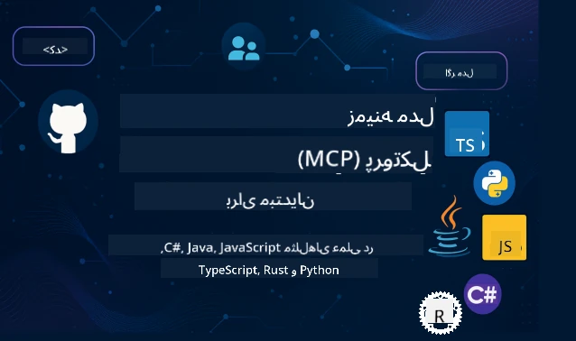

 

[](https://GitHub.com/microsoft/mcp-for-beginners/graphs/contributors)
[](https://GitHub.com/microsoft/mcp-for-beginners/issues)
[](https://GitHub.com/microsoft/mcp-for-beginners/pulls)
[](http://makeapullrequest.com)

[](https://GitHub.com/microsoft/mcp-for-beginners/watchers)
[](https://GitHub.com/microsoft/mcp-for-beginners/fork)
[](https://GitHub.com/microsoft/mcp-for-beginners/stargazers)


[](https://discord.gg/nTYy5BXMWG)

برای شروع استفاده از این منابع، مراحل زیر را دنبال کنید:
1. **انشعاب (فورک) مخزن**: کلیک کنید [](https://GitHub.com/microsoft/mcp-for-beginners/fork)
2. **کلون کردن مخزن**:   `git clone https://github.com/microsoft/mcp-for-beginners.git`
3. **عضویت در** [](https://discord.gg/nTYy5BXMWG)


### 🌐 پشتیبانی چند زبانه

#### پشتیبانی شده از طریق GitHub Action (خودکار و همواره به‌روز)

<!-- CO-OP TRANSLATOR LANGUAGES TABLE START -->
[Arabic](../ar/README.md) | [Bengali](../bn/README.md) | [Bulgarian](../bg/README.md) | [Burmese (Myanmar)](../my/README.md) | [Chinese (Simplified)](../zh-CN/README.md) | [Chinese (Traditional, Hong Kong)](../zh-HK/README.md) | [Chinese (Traditional, Macau)](../zh-MO/README.md) | [Chinese (Traditional, Taiwan)](../zh-TW/README.md) | [Croatian](../hr/README.md) | [Czech](../cs/README.md) | [Danish](../da/README.md) | [Dutch](../nl/README.md) | [Estonian](../et/README.md) | [Finnish](../fi/README.md) | [French](../fr/README.md) | [German](../de/README.md) | [Greek](../el/README.md) | [Hebrew](../he/README.md) | [Hindi](../hi/README.md) | [Hungarian](../hu/README.md) | [Indonesian](../id/README.md) | [Italian](../it/README.md) | [Japanese](../ja/README.md) | [Kannada](../kn/README.md) | [Korean](../ko/README.md) | [Lithuanian](../lt/README.md) | [Malay](../ms/README.md) | [Malayalam](../ml/README.md) | [Marathi](../mr/README.md) | [Nepali](../ne/README.md) | [Nigerian Pidgin](../pcm/README.md) | [Norwegian](../no/README.md) | [Persian (Farsi)](./README.md) | [Polish](../pl/README.md) | [Portuguese (Brazil)](../pt-BR/README.md) | [Portuguese (Portugal)](../pt-PT/README.md) | [Punjabi (Gurmukhi)](../pa/README.md) | [Romanian](../ro/README.md) | [Russian](../ru/README.md) | [Serbian (Cyrillic)](../sr/README.md) | [Slovak](../sk/README.md) | [Slovenian](../sl/README.md) | [Spanish](../es/README.md) | [Swahili](../sw/README.md) | [Swedish](../sv/README.md) | [Tagalog (Filipino)](../tl/README.md) | [Tamil](../ta/README.md) | [Telugu](../te/README.md) | [Thai](../th/README.md) | [Turkish](../tr/README.md) | [Ukrainian](../uk/README.md) | [Urdu](../ur/README.md) | [Vietnamese](../vi/README.md)

> **ترجیح می‌دهید به صورت محلی کلون کنید؟**

> این مخزن شامل بیش از ۵۰ زبان ترجمه است که به طور قابل توجهی حجم دانلود را افزایش می‌دهد. برای کلون کردن بدون ترجمه‌ها، از Sparse Checkout استفاده کنید:
> ```bash
> git clone --filter=blob:none --sparse https://github.com/microsoft/mcp-for-beginners.git
> cd mcp-for-beginners
> git sparse-checkout set --no-cone '/*' '!translations' '!translated_images'
> ```
> این به شما همه چیز مورد نیاز برای تکمیل دوره را با دانلود بسیار سریع‌تر می‌دهد.
<!-- CO-OP TRANSLATOR LANGUAGES TABLE END -->

# 🚀 برنامه درسی پروتکل مدل زمینه (MCP) برای مبتدیان

## **یادگیری MCP با مثال‌های کد عملی در زبان‌های C#، Java، JavaScript، Rust، Python، و TypeScript**

## 🧠 مرور کلی برنامه درسی پروتکل مدل زمینه
به سفر خود در دنیای پروتکل مدل زمینه خوش آمدید! اگر تاکنون تعجب کرده‌اید که چگونه برنامه‌های هوش مصنوعی با ابزارها و سرویس‌های مختلف ارتباط برقرار می‌کنند، اکنون قصد دارید راه‌حل شگفت‌انگیزی را کشف کنید که در حال تغییر نحوه ساخت سیستم‌های هوشمند توسط توسعه‌دهندگان است.

MCP را مثل یک مترجم جهانی برای برنامه‌های هوش مصنوعی تصور کنید - درست مانند پورت‌های USB که به شما امکان می‌دهد هر دستگاهی را به کامپیوتر خود وصل کنید، MCP اجازه می‌دهد مدل‌های هوش مصنوعی به هر ابزار یا سرویس به صورت استاندارد متصل شوند. چه شما اولین چت‌بات خود را می‌سازید و چه روی جریان‌های کاری پیچیده هوش مصنوعی کار می‌کنید، درک MCP به شما قدرت ایجاد برنامه‌های توانمندتر و انعطاف‌پذیر می‌دهد.

این برنامه درسی با صبر و دقت برای مسیر یادگیری شما طراحی شده است. ما با مفاهیم ساده که شما قبلاً می‌دانید شروع می‌کنیم و به تدریج تخصص شما را با تمرین عملی در زبان برنامه‌نویسی محبوبتان افزایش می‌دهیم. هر مرحله شامل توضیحات واضح، مثال‌های عملی، و تشویق فراوان در طول مسیر است.

تا زمانی که این مسیر را کامل کنید، اعتماد به نفس لازم برای ساخت سرورهای MCP خود، یکپارچه‌سازی آن‌ها با پلتفرم‌های محبوب هوش مصنوعی، و درک چگونگی تغییر آینده توسعه هوش مصنوعی را خواهید داشت. بیایید این ماجراجویی هیجان‌انگیز را با هم آغاز کنیم!

### مستندات و مشخصات رسمی

این منابع هرچه بیشتر پیش بروید ارزشمندتر خواهند شد، اما احساس فشار نکنید که باید همه چیز را فوراً بخوانید. با حوزه‌هایی شروع کنید که بیشترین علاقه را دارید!
- 📘 [مستندات MCP](https://modelcontextprotocol.io/) – این منبع اصلی شما برای آموزش‌های گام به گام و راهنمای کاربران است. مستندات با توجه به مبتدیان نوشته شده و مثال‌های واضحی ارائه می‌دهد که می‌توانید با سرعت خود دنبال کنید.
- 📜 [مشخصات MCP](https://modelcontextprotocol.io/docs/) – این را مثل یک دفترچه مرجع جامع تصور کنید. در طول دوره، شما بارها به اینجا بازخواهید گشت تا جزئیات خاص را ببینید و ویژگی‌های پیشرفته‌تر را کاوش کنید.
- 📜 [مشخصات اصلی MCP](https://modelcontextprotocol.io/specification/versioning) – این شامل جزئیات فنی اضافی است که می‌تواند برای پیاده‌سازی‌های پیشرفته مفید باشد. وقتی نیاز دارید اینجا هست، اما در شروع کار نگران آن نباشید.
- 🧑‍💻 [مخزن GitHub MCP](https://github.com/modelcontextprotocol) – در اینجا SDKها، ابزارها و نمونه‌های کد به زبان‌های برنامه‌نویسی متعدد را خواهید یافت. مثل گنجینه‌ای از مثال‌های عملی و اجزای آماده به‌کار است.
- 🌐 [جامعه MCP](https://github.com/orgs/modelcontextprotocol/discussions) – به سایر یادگیرندگان و توسعه‌دهندگان با تجربه بپیوندید و در بحث‌های مربوط به MCP شرکت کنید. این یک جامعه پشتیبان است که سؤال‌ها خوش‌آمد گفته می‌شود و دانش به صورت آزاد به اشتراک گذاشته می‌شود.
  
## اهداف یادگیری

تا پایان این برنامه درسی، شما اعتماد به نفس و هیجان نسبت به توانایی‌های جدید خود خواهید داشت. این‌ها چیزهایی هستند که به دست خواهید آورد:

• **درک اصول MCP**: شما خواهید فهمید که پروتکل مدل زمینه چیست و چرا در حال انقلاب در نحوه همکاری برنامه‌های هوش مصنوعی است، با استفاده از قیاس‌ها و مثال‌هایی که قابل درک‌اند.

• **ساخت اولین سرور MCP خود**: شما یک سرور MCP عملی در زبان برنامه‌نویسی مورد علاقه خود می‌سازید، شروع از مثال‌های ساده و رشد مهارت‌ها به صورت گام به گام.

• **اتصال مدل‌های هوش مصنوعی به ابزارهای واقعی**: شما یاد می‌گیرید چگونه فاصله بین مدل‌های هوش مصنوعی و خدمات واقعی را پل بزنید و قابلیت‌های قدرتمند جدیدی به برنامه‌های خود بدهید.

• **پیاده‌سازی بهترین روش‌های امنیتی**: شما خواهید فهمید چگونه پیاده‌سازی‌های MCP خود را امن نگه دارید و از برنامه‌ها و کاربران خود محافظت کنید.

• **استقرار با اطمینان**: شما می‌دانید چگونه پروژه‌های MCP را از توسعه به تولید ببرید، با استراتژی‌های استقرار عملی که در دنیای واقعی کار می‌کنند.

• **پیوستن به جامعه MCP**: شما بخشی از یک جامعه رو به رشد از توسعه‌دهندگانی خواهید شد که آینده توسعه برنامه‌های هوش مصنوعی را شکل می‌دهند.

## پیش‌زمینه ضروری

قبل از ورود به جزئیات MCP، بیایید مطمئن شویم با برخی مفاهیم پایه راحت هستید. اگر در این زمینه‌ها متخصص نیستید نگران نباشید - هر آنچه لازم دارید را در طول مسیر توضیح خواهیم داد!

### درک پروتکل‌ها (پایه)

پروتکل را مثل قواعد یک گفتگو در نظر بگیرید. وقتی با دوستی تماس می‌گیرید، هر دو می‌دانید هنگام پاسخ "سلام" بگویید، نوبت صحبت گرفتن و خداحافظی کردن چگونه است. برنامه‌های کامپیوتری هم برای ارتباط مؤثر به قواعد مشابه نیاز دارند.

MCP یک پروتکل است - مجموعه‌ای از قوانین توافق شده که به مدل‌های هوش مصنوعی و برنامه‌ها کمک می‌کند "گفتگوهای" موثری با ابزارها و سرویس‌ها داشته باشند. درست همانطور که قواعد گفتگو باعث روان‌تر شدن ارتباط انسانی می‌شود، داشتن MCP ارتباط برنامه‌های هوش مصنوعی را بسیار قابل اعتماد و قدرتمند می‌کند.

### روابط کلاینت-سرور (نحوه همکاری برنامه‌ها)

شما هر روز از روابط کلاینت-سرور استفاده می‌کنید! وقتی از مرورگر وب (کلاینت) برای بازدید یک وب‌سایت استفاده می‌کنید، به یک سرور وب وصل می‌شوید که محتوای صفحه را برای شما ارسال می‌کند. مرورگر می‌داند چگونه درخواست کند و سرور می‌داند چگونه پاسخ دهد.

در MCP هم رابطه مشابهی داریم: مدل‌های هوش مصنوعی به عنوان کلاینت‌هایی عمل می‌کنند که اطلاعات یا اقداماتی درخواست می‌کنند و سرورهای MCP آن قابلیت‌ها را فراهم می‌کنند. این مثل داشتن یک دستیار مفید (سرور) است که هوش مصنوعی می‌تواند از او بخواهد کارهای خاصی را انجام دهد.

### چرا استانداردسازی مهم است (وظیفه هماهنگی)

تصور کنید هر سازنده خودرو از پمپ بنزین با شکل متفاوت استفاده کند - شما باید برای هر خودرو آداپتور جداگانه داشته باشید! استانداردسازی یعنی توافق بر روش‌های مشترک تا چیزها به سادگی با هم کار کنند.

MCP این استانداردسازی را برای برنامه‌های هوش مصنوعی فراهم می‌کند. به جای اینکه هر مدل هوش مصنوعی به کد سفارشی برای کار با هر ابزار نیاز داشته باشد، MCP یک راه جهانی برای ارتباط میان آن‌ها ایجاد می‌کند. این یعنی توسعه‌دهندگان می‌توانند ابزارها را یکبار بسازند و با بسیاری از سیستم‌های هوش مصنوعی کار کنند.

## 🧭 مرور مسیر یادگیری شما

سفر MCP شما به دقت ساختار یافته تا اعتماد به نفس و مهارت‌های شما را به صورت مرحله به مرحله افزایش دهد. هر مرحله مفاهیم جدیدی معرفی می‌کند و در عین حال آنچه را قبلاً یاد گرفته‌اید تقویت می‌کند.

### 🌱 مرحله بنیاد: درک اصول اولیه (ماژول‌های ۰-۲)

اینجا ماجراجویی شما آغاز می‌شود! ما مفاهیم MCP را با قیاس‌های آشنا و مثال‌های ساده معرفی می‌کنیم. شما متوجه خواهید شد MCP چیست، چرا وجود دارد، و چگونه در دنیای گسترده‌تر توسعه هوش مصنوعی جای می‌گیرد.

• **ماژول ۰ - مقدمه‌ای بر MCP**: با بررسی اینکه MCP چیست و چرا برای برنامه‌های هوش مصنوعی مدرن بسیار مهم است شروع می‌کنیم. مثال‌های واقعی از کاربرد MCP خواهید دید و می‌فهمید چگونه مشکلات رایج توسعه‌دهندگان را حل می‌کند.

• **ماژول ۱ - توضیح مفاهیم اصلی**: اینجا بلوک‌های اساسی MCP را می‌آموزید. با استفاده از قیاس‌ها و مثال‌های تصویری فراوان این مفاهیم به شکلی طبیعی و قابل فهم ارائه می‌شود.

• **ماژول ۲ - امنیت در MCP**: امنیت ممکن است ترسناک به نظر برسد، اما نشان خواهیم داد MCP چگونه ویژگی‌های ایمنی داخلی دارد و بهترین روش‌هایی را آموزش می‌دهیم که از ابتدا برنامه‌های شما را محافظت می‌کند.

### 🔨 مرحله ساخت: ایجاد اولین پیاده‌سازی‌ها (ماژول ۳)

حالا بخش واقعی و سرگرم‌کننده شروع می‌شود! شما تجربه عملی در ساخت سرور و کلاینت‌های MCP واقعی خواهید داشت. نگران نباشید - از موارد ساده شروع می‌کنیم و در هر گام راهنمایی دریافت می‌کنید.

این ماژول شامل چندین راهنمای عملی است که به شما اجازه می‌دهد در زبان برنامه‌نویسی مورد علاقه تان تمرین کنید. اولین سرور خود را می‌سازید، کلاینتی برای اتصال به آن می‌سازید، و حتی با ابزارهای محبوب توسعه مانند VS Code یکپارچه خواهید شد.
هر راهنما شامل نمونه‌های کامل کد، نکات عیب‌یابی و توضیحاتی درباره دلایل انتخاب‌های خاص طراحی است. در پایان این مرحله، پیاده‌سازی‌های MCP را خواهید داشت که می‌توانید به آن‌ها افتخار کنید!

### 🚀 مرحله رشد: مفاهیم پیشرفته و کاربرد در دنیای واقعی (ماژول‌های ۴-۵)

با تسلط بر اصول اولیه، آماده‌اید تا ویژگی‌های پیشرفته‌تر MCP را کاوش کنید. ما استراتژی‌های عملی پیاده‌سازی، تکنیک‌های اشکال‌زدایی و موضوعات پیشرفته‌ای مانند ادغام هوش مصنوعی چندحالته را پوشش خواهیم داد.

همچنین خواهید آموخت چگونه پیاده‌سازی‌های MCP خود را برای استفاده در تولید مقیاس‌بندی کنید و با پلتفرم‌های ابری مانند Azure ادغام نمایید. این ماژول‌ها شما را آماده می‌کنند تا راه‌حل‌های MCP را بسازید که بتوانند نیازهای دنیای واقعی را برآورده کنند.

### 🌟 مرحله مهارت: جامعه و تخصص (ماژول‌های ۶-۱۱)

مرحله نهایی بر پیوستن به جامعه MCP و تخصص در حوزه‌هایی که بیشتر به آن‌ها علاقه دارید تمرکز دارد. خواهید آموخت چگونه به پروژه‌های متن‌باز MCP کمک کنید، الگوهای پیشرفته تأیید هویت را پیاده‌سازی کنید و راه‌حل‌های جامع یکپارچه‌شده با پایگاه داده بسازید.

ماژول ۱۱ شایان ذکر است – یک مسیر یادگیری عملی کامل با ۱۳ آزمایشگاه که به شما می‌آموزد سرورهای MCP آماده تولید با ادغام PostgreSQL بسازید. این مانند یک پروژه پایان‌نامه است که همه چیزهایی را که یاد گرفته‌اید به هم می‌آمیزد!

### 📚 ساختار کامل دوره

| ماژول | موضوع | توضیحات | لینک |
|--------|-------|-------------|------|
| **ماژول ۱-۳: اصول پایه** | | | |
| ۰۰ | معرفی MCP | نمای کلی پروتکل زمینه مدل و اهمیت آن در خطوط لوله هوش مصنوعی | [ادامه مطلب](./00-Introduction/README.md) |
| ۰۱ | مفاهیم اصلی توضیح داده شده | بررسی عمیق مفاهیم اصلی MCP | [ادامه مطلب](./01-CoreConcepts/README.md) |
| ۰۲ | امنیت در MCP | تهدیدات امنیتی و بهترین شیوه‌ها | [ادامه مطلب](./02-Security/README.md) |
| ۰۳ | شروع به کار با MCP | راه‌اندازی محیط، سرورها/کلاینت‌های پایه، ادغام | [ادامه مطلب](./03-GettingStarted/README.md) |
| **ماژول ۳: ساخت اولین سرور و کلاینت شما** | | | |
| ۳.۱ | اولین سرور | سرور MCP اول خود را بسازید | [راهنما](./03-GettingStarted/01-first-server/README.md) |
| ۳.۲ | اولین کلاینت | یک کلاینت MCP پایه توسعه دهید | [راهنما](./03-GettingStarted/02-client/README.md) |
| ۳.۳ | کلاینت با LLM | ادغام مدل زبان بزرگ | [راهنما](./03-GettingStarted/03-llm-client/README.md) |
| ۳.۴ | ادغام با VS Code | استفاده از سرورهای MCP در VS Code | [راهنما](./03-GettingStarted/04-vscode/README.md) |
| ۳.۵ | سرور stdio | ساخت سرورها با انتقال stdio | [راهنما](./03-GettingStarted/05-stdio-server/README.md) |
| ۳.۶ | پخش جریانی HTTP | پیاده‌سازی پخش جریانی HTTP در MCP | [راهنما](./03-GettingStarted/06-http-streaming/README.md) |
| ۳.۷ | جعبه‌ابزار AI | استفاده از جعبه‌ابزار AI با MCP | [راهنما](./03-GettingStarted/07-aitk/README.md) |
| ۳.۸ | تست | پیاده‌سازی سرور MCP خود را آزمایش کنید | [راهنما](./03-GettingStarted/08-testing/README.md) |
| ۳.۹ | استقرار | سرورهای MCP را به محیط تولید مستقر کنید | [راهنما](./03-GettingStarted/09-deployment/README.md) |
| ۳.۱۰ | استفاده پیشرفته از سرور | استفاده از سرورهای پیشرفته برای ویژگی‌های پیشرفته و معماری بهبود یافته | [راهنما](./03-GettingStarted/10-advanced/README.md) |
| ۳.۱۱ | احراز هویت ساده | فصلی که احراز هویت از ابتدا و RBAC را نشان می‌دهد | [راهنما](./03-GettingStarted/11-simple-auth/README.md) |
| **ماژول ۴-۵: عملی و پیشرفته** | | | |
| ۰۴ | پیاده‌سازی عملی | SDKها، اشکال‌زدایی، تست، قالب‌های قابل استفاده مجدد پرامپت | [ادامه مطلب](./04-PracticalImplementation/README.md) |
| ۰۵ | موضوعات پیشرفته در MCP | هوش مصنوعی چندحالته، مقیاس‌بندی، استفاده سازمانی | [ادامه مطلب](./05-AdvancedTopics/README.md) |
| ۵.۱ | ادغام Azure | ادغام MCP با Azure | [راهنما](./05-AdvancedTopics/mcp-integration/README.md) |
| ۵.۲ | چندحالتی | کار با چندین حالت | [راهنما](./05-AdvancedTopics/mcp-multi-modality/README.md) |
| ۵.۳ | نمایشی از OAuth2 | پیاده‌سازی احراز هویت OAuth2 | [راهنما](./05-AdvancedTopics/mcp-oauth2-demo/README.md) |
| ۵.۴ | زمینه‌های اصلی | درک و پیاده‌سازی زمینه‌های اصلی | [راهنما](./05-AdvancedTopics/mcp-root-contexts/README.md) |
| ۵.۵ | مسیریابی | استراتژی‌های مسیریابی MCP | [راهنما](./05-AdvancedTopics/mcp-routing/README.md) |
| ۵.۶ | نمونه‌برداری | تکنیک‌های نمونه‌برداری در MCP | [راهنما](./05-AdvancedTopics/mcp-sampling/README.md) |
| ۵.۷ | مقیاس‌بندی | مقیاس‌بندی پیاده‌سازی‌های MCP | [راهنما](./05-AdvancedTopics/mcp-scaling/README.md) |
| ۵.۸ | امنیت | ملاحظات امنیتی پیشرفته | [راهنما](./05-AdvancedTopics/mcp-security/README.md) |
| ۵.۹ | جستجوی وب | پیاده‌سازی قابلیت‌های جستجوی وب | [راهنما](./05-AdvancedTopics/web-search-mcp/README.md) |
| ۵.۱۰ | پخش جریانی زمان واقعی | ساخت قابلیت پخش جریانی زمان واقعی | [راهنما](./05-AdvancedTopics/mcp-realtimestreaming/README.md) |
| ۵.۱۱ | جستجوی زمان واقعی | پیاده‌سازی جستجوی زمان واقعی | [راهنما](./05-AdvancedTopics/mcp-realtimesearch/README.md) |
| ۵.۱۲ | احراز هویت Entra ID | احراز هویت با Microsoft Entra ID | [راهنما](./05-AdvancedTopics/mcp-security-entra/README.md) |
| ۵.۱۳ | ادغام Foundry | ادغام با Azure AI Foundry | [راهنما](./05-AdvancedTopics/mcp-foundry-agent-integration/README.md) |
| ۵.۱۴ | مهندسی زمینه | تکنیک‌هایی برای مهندسی مؤثر زمینه | [راهنما](./05-AdvancedTopics/mcp-contextengineering/README.md) |
| ۵.۱۵ | انتقال سفارشی MCP | پیاده‌سازی‌های انتقال سفارشی | [راهنما](./05-AdvancedTopics/mcp-transport/README.md) |
| **ماژول ۶-۱۰: جامعه و بهترین شیوه‌ها** | | | |
| ۰۶ | مشارکت‌های جامعه | چگونه به اکوسیستم MCP کمک کنیم | [راهنما](./06-CommunityContributions/README.md) |
| ۰۷ | درس‌هایی از پذیرش اولیه | داستان‌های پیاده‌سازی دنیای واقعی | [راهنما](./07-LessonsFromEarlyAdoption/README.md) |
| ۰۸ | بهترین شیوه‌ها برای MCP | عملکرد، تحمل خطا، پایداری | [راهنما](./08-BestPractices/README.md) |
| ۰۹ | مطالعات موردی MCP | مثال‌های عملی پیاده‌سازی | [راهنما](./09-CaseStudy/README.md) |
| ۱۰ | کارگاه عملی | ساخت سرور MCP با جعبه‌ابزار AI | [آزمایشگاه](./10-StreamliningAIWorkflowsBuildingAnMCPServerWithAIToolkit/README.md) |
| **ماژول ۱۱: آزمایشگاه عملی سرور MCP** | | | |
| ۱۱ | ادغام پایگاه داده سرور MCP | مسیر یادگیری عملی کامل با ۱۳ آزمایشگاه برای ادغام PostgreSQL | [آزمایشگاه‌ها](./11-MCPServerHandsOnLabs/README.md) |
| ۱۱.۱ | معرفی | نمای کلی MCP با ادغام پایگاه داده و مورد استفاده تحلیل خرده‌فروشی | [آزمایشگاه ۰۰](./11-MCPServerHandsOnLabs/00-Introduction/README.md) |
| ۱۱.۲ | معماری اصلی | درک معماری سرور MCP، لایه‌های پایگاه داده و الگوهای امنیتی | [آزمایشگاه ۰۱](./11-MCPServerHandsOnLabs/01-Architecture/README.md) |
| ۱۱.۳ | امنیت و چنداجاره‌ای | امنیت سطح ردیف، احراز هویت و دسترسی داده چنداجاره‌ای | [آزمایشگاه ۰۲](./11-MCPServerHandsOnLabs/02-Security/README.md) |
| ۱۱.۴ | راه‌اندازی محیط | راه‌اندازی محیط توسعه، داکر، منابع Azure | [آزمایشگاه ۰۳](./11-MCPServerHandsOnLabs/03-Setup/README.md) |
| ۱۱.۵ | طراحی پایگاه داده | راه‌اندازی PostgreSQL، طراحی اسکیمای خرده‌فروشی و داده نمونه | [آزمایشگاه ۰۴](./11-MCPServerHandsOnLabs/04-Database/README.md) |
| ۱۱.۶ | پیاده‌سازی سرور MCP | ساخت سرور FastMCP با ادغام پایگاه داده | [آزمایشگاه ۰۵](./11-MCPServerHandsOnLabs/05-MCP-Server/README.md) |
| ۱۱.۷ | توسعه ابزار | ایجاد ابزارهای پرس‌وجو پایگاه داده و بررسی اسکیمای داده | [آزمایشگاه ۰۶](./11-MCPServerHandsOnLabs/06-Tools/README.md) |
| ۱۱.۸ | جستجوی معنایی | پیاده‌سازی بردار جاسازی‌ها با Azure OpenAI و pgvector | [آزمایشگاه ۰۷](./11-MCPServerHandsOnLabs/07-Semantic-Search/README.md) |
| ۱۱.۹ | تست و اشکال‌زدایی | استراتژی‌های تست، ابزارهای اشکال‌زدایی و رویکردهای اعتبارسنجی | [آزمایشگاه ۰۸](./11-MCPServerHandsOnLabs/08-Testing/README.md) |
| ۱۱.۱۰ | ادغام VS Code | پیکربندی ادغام MCP در VS Code و استفاده از چت AI | [آزمایشگاه ۰۹](./11-MCPServerHandsOnLabs/09-VS-Code/README.md) |
| ۱۱.۱۱ | استراتژی‌های استقرار | استقرار داکر، برنامه‌های کانتینری Azure و ملاحظات مقیاس‌بندی | [آزمایشگاه ۱۰](./11-MCPServerHandsOnLabs/10-Deployment/README.md) |
| ۱۱.۱۲ | پایش | Application Insights، ثبت وقایع، پایش عملکرد | [آزمایشگاه ۱۱](./11-MCPServerHandsOnLabs/11-Monitoring/README.md) |
| ۱۱.۱۳ | بهترین شیوه‌ها | بهینه‌سازی عملکرد، سخت‌افزاری امنیتی و نکات تولید | [آزمایشگاه ۱۲](./11-MCPServerHandsOnLabs/12-Best-Practices/README.md) |

### 💻 پروژه‌های نمونه کد

یکی از هیجان‌انگیزترین بخش‌های یادگیری MCP، مشاهده پیشرفت مهارت‌های کدنویسی شما به صورت تدریجی است. ما نمونه‌های کد خود را طوری طراحی کرده‌ایم که از ساده شروع کنند و با افزایش درک شما پیچیده‌تر شوند. در اینجا نحوه معرفی مفاهیم آمده است - با کدی که آسان برای درک است اما اصول واقعی MCP را نشان می‌دهد، شما متوجه خواهید شد نه فقط اینکه این کد چه کاری انجام می‌دهد، بلکه چرا این ساختار را دارد و چگونه در برنامه‌های بزرگ‌تر MCP جای می‌گیرد.

#### نمونه‌های پایه محاسبه‌گر MCP

| زبان | توضیحات | لینک |
|----------|-------------|------|
| C# | نمونه سرور MCP | [مشاهده کد](./03-GettingStarted/samples/csharp/README.md) |
| Java | محاسبه‌گر MCP | [مشاهده کد](./03-GettingStarted/samples/java/calculator/README.md) |
| JavaScript | دمو MCP | [مشاهده کد](./03-GettingStarted/samples/javascript/README.md) |
| Python | سرور MCP | [مشاهده کد](../../03-GettingStarted/samples/python/mcp_calculator_server.py) |
| TypeScript | نمونه MCP | [مشاهده کد](./03-GettingStarted/samples/typescript/README.md) |
| Rust | نمونه MCP | [مشاهده کد](./03-GettingStarted/samples/rust/README.md) |

#### پیاده‌سازی‌های پیشرفته MCP

| زبان | توضیحات | لینک |
|----------|-------------|------|
| C# | نمونه پیشرفته | [مشاهده کد](./04-PracticalImplementation/samples/csharp/README.md) |
| Java با Spring | نمونه برنامه کانتینر | [مشاهده کد](./04-PracticalImplementation/samples/java/containerapp/README.md) |
| JavaScript | نمونه پیشرفته | [مشاهده کد](./04-PracticalImplementation/samples/javascript/README.md) |
| Python | پیاده‌سازی پیچیده | [مشاهده کد](../../04-PracticalImplementation/samples/python/READMEmd) |
| TypeScript | نمونه کانتینر | [مشاهده کد](./04-PracticalImplementation/samples/typescript/README.md) |


## 🎯 پیش‌نیازهای یادگیری MCP

برای اینکه بیشترین بهره را از این دوره ببرید، باید:

- دانش پایه برنامه‌نویسی در حداقل یکی از زبان‌های C#، Java، JavaScript، Python یا TypeScript داشته باشید
- درک مدل کلاینت-سرور و APIها
- آشنایی با مفاهیم REST و HTTP
- (اختیاری) زمینه‌ای در مفاهیم هوش مصنوعی/یادگیری ماشین

- شرکت در بحث‌های جامعه برای دریافت پشتیبانی

## 📚 راهنمای مطالعه و منابع

این مخزن شامل منابع متعددی است که به شما کمک می‌کند به طور مؤثر در یادگیری پیش بروید:

### راهنمای مطالعه

یک [راهنمای مطالعه](./study_guide.md) جامع برای کمک به شما در بهره‌برداری بهتر از این مخزن وجود دارد. این نقشه دوره بصری نشان می‌دهد که چگونه همه موضوعات به هم مرتبط هستند و راهنمایی استفاده مؤثر از پروژه‌های نمونه را ارائه می‌دهد. این راهنما به ویژه برای کسانی که یادگیرنده دیداری هستند و دوست دارند تصویر کلی را ببینند مفید است.

این راهنما شامل موارد زیر است:
- نقشه دوره بصری که تمام موضوعات پوشش داده شده را نشان می‌دهد
- شکستن دقیق هر بخش از مخزن
- راهنمای استفاده از پروژه‌های نمونه
- مسیرهای پیشنهادی یادگیری برای سطوح مهارتی مختلف
- منابع اضافی برای تکمیل مسیر یادگیری شما

### تغییرات نسخه

ما یک [دفترچه تغییرات](./changelog.md) دقیق را نگهداری می‌کنیم که تمام به‌روزرسانی‌های مهم مواد دوره را ثبت می‌کند، بنابراین می‌توانید از آخرین بهبودها و افزوده‌ها مطلع باشید.
- افزودن محتوای جدید
- تغییرات ساختاری
- بهبود ویژگی‌ها
- به‌روزرسانی مستندات

## 🛠️ چگونه این دوره را به طور مؤثر استفاده کنیم

هر درس در این راهنما شامل:
1. توضیحات واضح درباره مفاهیم MCP  
2. نمونه کدهای زنده در چند زبان مختلف  
3. تمرین‌هایی برای ساخت برنامه‌های واقعی MCP  
4. منابع اضافی برای یادگیرندگان پیشرفته

## محتوای درخواستی

### [روزهای توسعه MCP تیر ۲۰۲۵](https://developer.microsoft.com/en-us/reactor/series/S-1563/)
#### [➡️تماشا به درخواست - روزهای توسعه MCP](https://developer.microsoft.com/en-us/reactor/series/S-1563/)
برای دو روز بینش عمیق فنی، ارتباط با جامعه و یادگیری عملی در روزهای توسعه MCP آماده شوید، رویدادی مجازی به‌طور اختصاصی برای پروتکل مدل کانتکست (MCP) — استاندارد نوظهوری که پل ارتباطی میان مدل‌های هوش مصنوعی و ابزارهای وابسته به آنها است.
می‌توانید روزهای توسعه MCP را با ثبت‌نام در صفحه رویداد ما تماشا کنید: https://aka.ms/mcpdevdays.

#### [روز ۱: بهره‌وری MCP، DevTools و جامعه:](https://developer.microsoft.com/en-us/reactor/series/S-1563/)

تماماً درباره توانمندسازی توسعه‌دهندگان برای استفاده از MCP در جریان کاری توسعه و جشن گرفتن جامعه فوق‌العاده MCP است. همراه با اعضای جامعه و شرکایی مثل Arcade، Block، Okta و Neon خواهیم بود تا ببینیم چگونه با مایکروسافت همکاری می‌کنند تا اکوسیستم باز و قابل توسعه MCP را شکل دهند. دموهای واقعی در VS Code، ویژوال استودیو، GitHub Copilot و ابزارهای محبوب جامعه  
جریان‌های کاری توسعه عملی و مبتنی بر متن  
جلسات و بینش‌های هدایت شده توسط جامعه  
چه تازه با MCP آشنا شده باشید یا در حال ساخت با آن باشید، روز اول با الهام و نکات عملی شروعی عالی خواهد بود.

#### [روز ۲: ساخت سرورهای MCP با اطمینان](https://developer.microsoft.com/en-us/reactor/series/S-1563/)

این روز مخصوص سازندگان MCP است. به عمق استراتژی‌های پیاده‌سازی و بهترین شیوه‌ها برای ایجاد سرورهای MCP و ادغام MCP در جریان کاری AI خواهیم پرداخت.

#### موضوعات شامل:

- ساخت سرورهای MCP و ادغام آنها در تجربه‌های عامل  
- توسعه مبتنی بر پرامپت  
- بهترین شیوه‌های امنیتی  
- استفاده از بلوک‌های ساخت مانند Functions، ACA، و API Management  
- هماهنگی رجیستری و ابزارها (1P + 3P)

اگر شما توسعه‌دهنده، سازنده ابزار یا استراتژیست محصول AI هستید، این روز پر است از بینش‌هایی که برای ساخت راه‌حل‌های MCP مقیاس‌پذیر، ایمن و آماده آینده نیاز دارید.

### کمپ آموزشی MCP مرداد ۲۰۲۵
در جلسات ویدیویی فشرده بیاموزید چگونه سرورهای MCP بسازید، با VS Code ادغام کنید، و به طور حرفه‌ای روی Azure استقرار دهید بر اساس محتوای دوره MCP برای مبتدیان. مهارت‌های عملی در فناوری‌ای که شرکت‌های بزرگ آن را قبلاً استفاده می‌کنند همراه خود خواهید داشت.

#### [➡️تماشا به درخواست کمپ آموزشی MCP | انگلیسی](https://developer.microsoft.com/en-us/reactor/series/s-1568/)
#### [➡️تماشا به درخواست کمپ آموزشی MCP | برزیل](https://developer.microsoft.com/en-us/reactor/series/S-1566/)
#### [➡️تماشا به درخواست کمپ آموزشی MCP | اسپانیایی](https://developer.microsoft.com/en-us/reactor/series/S-1567/)

### بیایید با C# یاد بگیریم - سری آموزش‌ها
بیایید درباره پروتکل مدل کانتکست (MCP) یاد بگیریم، چهارچوب پیشرفته‌ای طراحی‌شده برای استانداردسازی تعاملات میان مدل‌های هوش مصنوعی و برنامه‌های کلاینت. در این جلسه مناسب مبتدیان، MCP را معرفی کرده و شما را در ساخت اولین سرور MCP راهنمایی می‌کنیم.  
#### C#: [https://aka.ms/letslearnmcp-csharp](https://aka.ms/letslearnmcp-csharp)  
#### Java: [https://aka.ms/letslearnmcp-java](https://aka.ms/letslearnmcp-java)  
#### JavaScript: [https://aka.ms/letslearnmcp-javascript](https://aka.ms/letslearnmcp-javascript)  
#### Python: [https://aka.ms/letslearnmcp-python](https://aka.ms/letslearnmcp-python)  

## 🎓 سفر MCP شما آغاز می‌شود

تبریک می‌گوییم! شما همین الان اولین گام در یک سفر هیجان‌انگیز را برداشتید که توانایی‌های برنامه‌نویسی شما را گسترش داده و شما را به پیشرفته‌ترین مرزهای توسعه هوش مصنوعی متصل می‌کند.

### آنچه تاکنون به دست آورده‌اید

با خواندن این مقدمه، شما پایه دانش MCP خود را شروع کرده‌اید. می‌دانید MCP چیست، چرا اهمیت دارد، و چگونه این دوره از سفر یادگیری شما پشتیبانی خواهد کرد. این یک دستاورد مهم و آغاز تخصص شما در این فناوری حیاتی است.

### ماجراجویی پیش رو

با پیشرفت در ماژول‌ها، به یاد داشته باشید که هر کارشناس یک بار مبتدی بوده است. مفاهیمی که اکنون ممکن است پیچیده به نظر برسند با تمرین و کاربرد آنها دومین طبیعت شما خواهند شد. هر گام کوچک به توانمندی‌های قدرتمندی می‌انجامد که در طول دوران توسعه شما خدمت خواهند کرد.

### شبکه پشتیبانی شما

شما به جمعی از یادگیرندگان و کارشناسان پیوسته‌اید که درباره MCP شور و اشتیاق دارند و مشتاق کمک به دیگران برای موفقیت هستند. چه در چالش برنامه‌نویسی گیر کرده باشید یا به اشتراک‌گذاری یک موفقیت هیجان‌زده باشید، جامعه اینجا برای حمایت از شماست.

اگر گیر کردید یا سوالی در مورد ساخت اپلیکیشن‌های AI داشتید، در بحث‌ها با یادگیرندگان همراه و توسعه‌دهندگان باتجربه درباره MCP شرکت کنید. جامعه‌ای حمایت‌کننده که در آن سوالات خوشامد گفته می‌شود و دانش آزادانه به اشتراک گذاشته می‌شود.

[](https://discord.gg/nTYy5BXMWG)

اگر بازخورد محصول دارید یا هنگام ساخت خطا مشاهده می‌کنید مراجعه کنید به:

[](https://aka.ms/foundry/forum)

### آماده شروع هستید؟

ماجراجویی MCP شما همین حالا آغاز می‌شود! با ماژول ۰ شروع کنید تا اولین تجربیات عملی MCP خود را تجربه کنید، یا پروژه‌های نمونه را بررسی کنید تا ببینید چه خواهید ساخت. به یاد داشته باشید – هر کارشناس دقیقاً همان جایگاهی بود که شما هستید، و با صبر و تمرین، از آنچه می‌توانید به دست آورید شگفت‌زده خواهید شد.

به دنیای توسعه پروتکل مدل کانتکست خوش آمدید. بیایید با هم چیزی شگفت‌انگیز بسازیم!

## 🤝 مشارکت در جامعه یادگیری

این دوره با مشارکت یادگیرندگانی مثل شما قوی‌تر می‌شود! چه یک اشتباه تایپی را اصلاح کنید، چه توضیحی روشن‌تر پیشنهاد دهید، یا مثال جدیدی اضافه کنید، مشارکت‌های شما به دیگر مبتدیان کمک می‌کند تا موفق شوند.

از حرفه‌ای ارزشمند مایکروسافت [شیوام گویال](https://www.linkedin.com/in/shivam2003/) برای کمک به نمونه کدها سپاسگزاریم.

فرایند مشارکت به گونه‌ای طراحی شده که استقبال‌کننده و حمایت‌کننده باشد. اکثر مشارکت‌ها نیاز به قرارداد مجوز مشارکت (CLA) دارند، اما ابزارهای خودکار به طور روان شما را در این مسیر راهنمایی می‌کنند.

## 📜 یادگیری متن‌باز

این کل دوره تحت مجوز MIT [LICENSE](../../LICENSE) قرار دارد، به این معنی که می‌توانید آن را آزادانه استفاده، تغییر و به اشتراک بگذارید. این از مأموریت ما برای در دسترس قرار دادن دانش MCP برای توسعه‌دهندگان در سراسر جهان حمایت می‌کند.

## 🤝 دستورالعمل‌های مشارکت

این پروژه از مشارکت‌ها و پیشنهادها استقبال می‌کند. اکثر مشارکت‌ها نیازمند توافق بر قرارداد مجوز مشارکت (CLA) است که اعلام می‌کند شما حق دارید و واقعاً به ما حقوق استفاده از مشارکت شما را می‌دهید. برای جزئیات به <https://cla.opensource.microsoft.com> مراجعه کنید.

وقتی درخواست کشش (pull request) ارسال می‌کنید، بات CLA به‌طور خودکار تعیین می‌کند که آیا نیاز به ارائه CLA دارید و PR را به‌طور مناسب برچسب‌گذاری می‌کند (مثلاً بررسی وضعیت، کامنت). فقط دستورالعمل‌های بات را دنبال کنید. فقط یک بار برای تمام مخازنی که از CLA ما استفاده می‌کنند این کار لازم است.

این پروژه از [کد رفتاری متن‌باز مایکروسافت](https://opensource.microsoft.com/codeofconduct/) پیروی می‌کند. برای اطلاعات بیشتر به [سؤالات متداول کد رفتار](https://opensource.microsoft.com/codeofconduct/faq/) مراجعه کنید یا با [opencode@microsoft.com](mailto:opencode@microsoft.com) تماس بگیرید.

---

*آماده‌اید سفر MCP خود را شروع کنید؟ با [ماژول ۰۰ - معرفی MCP](./00-Introduction/README.md) شروع کنید و اولین گام‌های خود را در دنیای توسعه پروتکل مدل کانتکست بردارید!*

## 🎒 دوره‌های دیگر  
تیم ما دوره‌های دیگری هم تولید می‌کند! بررسی کنید:

<!-- CO-OP TRANSLATOR OTHER COURSES START -->
### LangChain
[](https://aka.ms/langchain4j-for-beginners)  
[](https://aka.ms/langchainjs-for-beginners?WT.mc_id=m365-94501-dwahlin)

---

### Azure / Edge / MCP / Agents
[](https://github.com/microsoft/AZD-for-beginners?WT.mc_id=academic-105485-koreyst)  
[](https://github.com/microsoft/edgeai-for-beginners?WT.mc_id=academic-105485-koreyst)  
[](https://github.com/microsoft/mcp-for-beginners?WT.mc_id=academic-105485-koreyst)  
[](https://github.com/microsoft/ai-agents-for-beginners?WT.mc_id=academic-105485-koreyst)

---

### سری هوش مصنوعی مولد
[](https://github.com/microsoft/generative-ai-for-beginners?WT.mc_id=academic-105485-koreyst)  
[-9333EA?style=for-the-badge&labelColor=E5E7EB&color=9333EA)](https://github.com/microsoft/Generative-AI-for-beginners-dotnet?WT.mc_id=academic-105485-koreyst)  
[-C084FC?style=for-the-badge&labelColor=E5E7EB&color=C084FC)](https://github.com/microsoft/generative-ai-for-beginners-java?WT.mc_id=academic-105485-koreyst)  
[-E879F9?style=for-the-badge&labelColor=E5E7EB&color=E879F9)](https://github.com/microsoft/generative-ai-with-javascript?WT.mc_id=academic-105485-koreyst)

---

### یادگیری پایه  
[](https://aka.ms/ml-beginners?WT.mc_id=academic-105485-koreyst)  
[](https://aka.ms/datascience-beginners?WT.mc_id=academic-105485-koreyst)  
[](https://aka.ms/ai-beginners?WT.mc_id=academic-105485-koreyst)  
[](https://github.com/microsoft/Security-101?WT.mc_id=academic-96948-sayoung)
[](https://aka.ms/webdev-beginners?WT.mc_id=academic-105485-koreyst)
[](https://aka.ms/iot-beginners?WT.mc_id=academic-105485-koreyst)
[](https://github.com/microsoft/xr-development-for-beginners?WT.mc_id=academic-105485-koreyst)

---
 
### مجموعه کاپیلوت
[](https://aka.ms/GitHubCopilotAI?WT.mc_id=academic-105485-koreyst)
[](https://github.com/microsoft/mastering-github-copilot-for-dotnet-csharp-developers?WT.mc_id=academic-105485-koreyst)
[](https://github.com/microsoft/CopilotAdventures?WT.mc_id=academic-105485-koreyst)
<!-- CO-OP TRANSLATOR OTHER COURSES END -->

---

<!-- CO-OP TRANSLATOR DISCLAIMER START -->
**سلب مسئولیت**:  
این سند با استفاده از سرویس ترجمه هوش مصنوعی [Co-op Translator](https://github.com/Azure/co-op-translator) ترجمه شده است. در حالی که ما در تلاش برای دقت هستیم، لطفاً توجه داشته باشید که ترجمه‌های خودکار ممکن است حاوی اشتباهات یا نادرستی‌هایی باشند. سند اصلی به زبان مبدأ باید به‌عنوان منبع معتبر در نظر گرفته شود. برای اطلاعات حیاتی، توصیه می‌شود از ترجمه حرفه‌ای انسانی استفاده شود. ما مسئول هیچ‌گونه سوءتفاهم یا تفسیر نادرستی که از استفاده این ترجمه ناشی شود، نیستیم.
<!-- CO-OP TRANSLATOR DISCLAIMER END -->