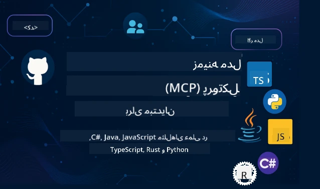

 

[](https://GitHub.com/microsoft/mcp-for-beginners/graphs/contributors)
[](https://GitHub.com/microsoft/mcp-for-beginners/issues)
[](https://GitHub.com/microsoft/mcp-for-beginners/pulls)
[](http://makeapullrequest.com)

[](https://GitHub.com/microsoft/mcp-for-beginners/watchers)
[](https://GitHub.com/microsoft/mcp-for-beginners/fork)
[](https://GitHub.com/microsoft/mcp-for-beginners/stargazers)


[](https://discord.gg/nTYy5BXMWG)

برای شروع استفاده از این منابع، این مراحل را دنبال کنید:
1. **فورک مخزن**: کلیک کنید روی [](https://GitHub.com/microsoft/mcp-for-beginners/fork)
2. **کلون مخزن**:   `git clone https://github.com/microsoft/mcp-for-beginners.git`
3. **عضویت در** [](https://discord.gg/nTYy5BXMWG)


### 🌐 پشتیبانی چندزبانه

#### پشتیبانی شده از طریق GitHub Action (خودکار و همیشه به‌روز)

<!-- CO-OP TRANSLATOR LANGUAGES TABLE START -->
[Arabic](../ar/README.md) | [Bengali](../bn/README.md) | [Bulgarian](../bg/README.md) | [Burmese (Myanmar)](../my/README.md) | [Chinese (Simplified)](../zh-CN/README.md) | [Chinese (Traditional, Hong Kong)](../zh-HK/README.md) | [Chinese (Traditional, Macau)](../zh-MO/README.md) | [Chinese (Traditional, Taiwan)](../zh-TW/README.md) | [Croatian](../hr/README.md) | [Czech](../cs/README.md) | [Danish](../da/README.md) | [Dutch](../nl/README.md) | [Estonian](../et/README.md) | [Finnish](../fi/README.md) | [French](../fr/README.md) | [German](../de/README.md) | [Greek](../el/README.md) | [Hebrew](../he/README.md) | [Hindi](../hi/README.md) | [Hungarian](../hu/README.md) | [Indonesian](../id/README.md) | [Italian](../it/README.md) | [Japanese](../ja/README.md) | [Kannada](../kn/README.md) | [Korean](../ko/README.md) | [Lithuanian](../lt/README.md) | [Malay](../ms/README.md) | [Malayalam](../ml/README.md) | [Marathi](../mr/README.md) | [Nepali](../ne/README.md) | [Nigerian Pidgin](../pcm/README.md) | [Norwegian](../no/README.md) | [Persian (Farsi)](./README.md) | [Polish](../pl/README.md) | [Portuguese (Brazil)](../pt-BR/README.md) | [Portuguese (Portugal)](../pt-PT/README.md) | [Punjabi (Gurmukhi)](../pa/README.md) | [Romanian](../ro/README.md) | [Russian](../ru/README.md) | [Serbian (Cyrillic)](../sr/README.md) | [Slovak](../sk/README.md) | [Slovenian](../sl/README.md) | [Spanish](../es/README.md) | [Swahili](../sw/README.md) | [Swedish](../sv/README.md) | [Tagalog (Filipino)](../tl/README.md) | [Tamil](../ta/README.md) | [Telugu](../te/README.md) | [Thai](../th/README.md) | [Turkish](../tr/README.md) | [Ukrainian](../uk/README.md) | [Urdu](../ur/README.md) | [Vietnamese](../vi/README.md)

> **ترجیح می‌دهید لوکال کلون کنید؟**
>
> این مخزن بیش از ۵۰ ترجمه زبان دارد که حجم دانلود را به طور قابل توجهی افزایش می‌دهد. برای کلون بدون ترجمه‌ها، از sparse checkout استفاده کنید:
>
> **Bash / macOS / Linux:**
> ```bash
> git clone --filter=blob:none --sparse https://github.com/microsoft/mcp-for-beginners.git
> cd mcp-for-beginners
> git sparse-checkout set --no-cone '/*' '!translations' '!translated_images'
> ```
>
> **CMD (ویندوز):**
> ```cmd
> git clone --filter=blob:none --sparse https://github.com/microsoft/mcp-for-beginners.git
> cd mcp-for-beginners
> git sparse-checkout set --no-cone "/*" "!translations" "!translated_images"
> ```
>
> این به شما همه چیز مورد نیاز برای اتمام دوره را با یک دانلود بسیار سریع‌تر می‌دهد.
<!-- CO-OP TRANSLATOR LANGUAGES TABLE END -->

# 🚀 برنامه درسی پروتکل مدل کانتکست (MCP) برای مبتدیان

## **یادگیری MCP با نمونه‌های کدنویسی عملی در C#، Java، JavaScript، Rust، Python و TypeScript**

## 🧠 مروری بر برنامه درسی پروتکل مدل کانتکست
به سفر خود در پروتکل مدل کانتکست خوش آمدید! اگر تاکنون کنجکاو بوده‌اید که چگونه برنامه‌های هوش مصنوعی با ابزارها و خدمات مختلف ارتباط برقرار می‌کنند، در حال کشف راهکار زیبا و موثری هستید که نحوه ساخت سیستم‌های هوشمند را توسط توسعه‌دهندگان متحول می‌کند.

MCP را به عنوان یک مترجم جهانی برای برنامه‌های هوش مصنوعی در نظر بگیرید - درست مانند اینکه پورت‌های USB اجازه می‌دهند هر دستگاهی را به کامپیوتر وصل کنید، MCP اجازه می‌دهد مدل‌های هوش مصنوعی به هر ابزار یا خدمتی به شکلی استاندارد متصل شوند. چه در حال ساخت نخستین چت‌بات خود باشید یا روی گردش‌های کاری پیچیده هوش مصنوعی کار کنید، درک MCP به شما قدرت ایجاد برنامه‌های توانمندتر و قابل انعطاف‌تر را می‌دهد.

این برنامه درسی با صبر و دقت برای مسیر یادگیری شما طراحی شده است. ما با مفاهیم ساده‌ای که قبلاً درک کرده‌اید شروع می‌کنیم و به تدریج تخصص شما را از طریق تمرین عملی در زبان برنامه‌نویسی مورد علاقه‌تان ارتقا می‌دهیم. هر مرحله شامل توضیحات روشن، مثال‌های عملی و تشویق‌های فراوان است.

تا زمانی که این سفر را به پایان برسانید، اعتماد به نفس لازم برای ساخت سرورهای MCP خود، ادغام آن‌ها با پلتفرم‌های محبوب هوش مصنوعی و درک چگونگی شکل‌دهی این فناوری به آینده توسعه هوش مصنوعی را خواهید داشت. بیایید این ماجراجویی هیجان‌انگیز را با هم آغاز کنیم!

### مستندات رسمی و مشخصات

این برنامه درسی منطبق با **مشخصات MCP به تاریخ ۲۰۲۵-۱۱-۲۵** (آخرین نسخه پایدار) است. مشخصات MCP از نسخه‌بندی مبتنی بر تاریخ (فرمت YYYY-MM-DD) برای پیگیری دقیق نسخه پروتکل استفاده می‌کند.

این منابع با رشد درک شما ارزشمندتر می‌شوند، اما احساس نکنید باید فوراً همه را مطالعه کنید. با حوزه‌هایی که بیشتر به شما علاقه دارد شروع کنید!
- 📘 [مستندات MCP](https://modelcontextprotocol.io/) – این منبع اصلی شما برای آموزش‌های گام‌به‌گام و راهنماهای کاربری است. مستندات با در نظر گرفتن مبتدیان نوشته شده، و مثال‌های روشنی ارائه می‌دهد که می‌توانید با سرعت خود دنبال کنید.
- 📜 [مشخصات MCP](https://modelcontextprotocol.io/specification/2025-11-25) – این را به عنوان دفترچه راهنمای مرجع کامل خود ببینید. هنگام طی کردن برنامه درسی، بارها به اینجا مراجعه خواهید کرد تا جزئیات خاص را جستجو کرده و ویژگی‌های پیشرفته را بررسی کنید.
- 📜 [نسخه‌بندی مشخصات MCP](https://modelcontextprotocol.io/specification/versioning) – حاوی اطلاعاتی درباره تاریخچه نسخه‌های پروتکل و نحوه استفاده MCP از نسخه‌بندی مبتنی بر تاریخ است (فرمت YYYY-MM-DD).
- 🧑‍💻 [مخزن GitHub MCP](https://github.com/modelcontextprotocol) – در اینجا SDKها، ابزارها و نمونه کد در زبان‌های برنامه‌نویسی مختلف را خواهید یافت. مثل یک گنجینه پر از مثال‌های کاربردی و اجزای آماده استفاده است.
- 🌐 [جامعه MCP](https://github.com/orgs/modelcontextprotocol/discussions) – به جمع یادگیرندگان و توسعه‌دهندگان با تجربه در بحث‌های مربوط به MCP بپیوندید. این یک جامعه پشتیبانی کننده است که در آن سوالات پذیرفته شده و دانش آزادانه به اشتراک گذاشته می‌شود.
  
## اهداف یادگیری

تا پایان این برنامه درسی، احساس اعتماد به نفس و هیجان برای توانایی‌های جدید خود خواهید داشت. در اینجا آنچه به دست می‌آورید آمده است:

• **درک اصول MCP**: خواهید فهمید پروتکل مدل کانتکست چیست و چرا در نحوه کار برنامه‌های هوش مصنوعی با یکدیگر انقلابی ایجاد می‌کند، با استفاده از تشبیهات و مثال‌های قابل فهم.

• **ساخت نخستین سرور MCP خود**: ایجاد یک سرور MCP عملی در زبان برنامه‌نویسی مورد علاقه‌تان، شروع با مثال‌های ساده و گسترش مهارت‌ها به تدریج.

• **اتصال مدل‌های هوش مصنوعی به ابزارهای واقعی**: یاد می‌گیرید چگونه پل ارتباطی بین مدل‌های هوش مصنوعی و خدمات واقعی را بسازید تا قابلیت‌های قدرتمند جدیدی به برنامه‌هایتان بدهید.

• **پیاده‌سازی بهترین شیوه‌های امنیتی**: می‌فهمید چگونه پیاده‌سازی‌های MCP خود را ایمن و مطمئن نگه دارید و از برنامه‌ها و کاربران خود محافظت کنید.

• **استقرار با اطمینان**: می‌دانید چگونه پروژه‌های MCP خود را از مرحله توسعه به تولید ببرید، با راهکارهای عملی استقرار که در دنیای واقعی کار می‌کنند.

• **پیوستن به جامعه MCP**: عضو یک جامعه رو به رشد از توسعه‌دهندگانی می‌شوید که آینده توسعه برنامه‌های هوش مصنوعی را شکل می‌دهند.

## پیش‌زمینه‌های ضروری

قبل از اینکه به جزئیات MCP بپردازیم، مطمئن شویم با چند مفهوم پایه راحت هستید. نگران نباشید اگر در این زمینه‌ها متخصص نیستید – همه چیز لازم را هنگام پیشرفت توضیح خواهیم داد!

### درک پروتکل‌ها (بنیاد)

پروتکل را مثل قوانین یک گفتگو در نظر بگیرید. وقتی به دوستتان زنگ می‌زنید، هر دو می‌دانید هنگام پاسخ گفتن "سلام" بگویید، نوبتی صحبت کنید و وقتی تمام شد "خداحافظ" بگویید. برنامه‌های کامپیوتری برای برقراری ارتباط مؤثر به قوانین مشابهی نیاز دارند.

MCP یک پروتکل است – مجموعه قوانینی توافق شده که به مدل‌ها و برنامه‌های هوش مصنوعی کمک می‌کند تا «گفتگوهای» مؤثر با ابزارها و خدمات داشته باشند. درست همانطور که داشتن قوانین گفتگو ارتباط انسانی را روان‌تر می‌کند، داشتن MCP ارتباط برنامه‌های هوش مصنوعی را قابل اعتمادتر و قدرتمندتر می‌سازد.

### روابط کلاینت-سرور (چگونه برنامه‌ها با هم کار می‌کنند)

شما هر روز از روابط کلاینت-سرور استفاده می‌کنید! وقتی با مرورگر وب (کلاینت) به سایتی مراجعه می‌کنید، به سرور وبی وصل می‌شوید که محتوای صفحه را برایتان ارسال می‌کند. مرورگر می‌داند چگونه اطلاعات بخواهد و سرور می‌داند چگونه پاسخ دهد.

در MCP، رابطه مشابهی داریم: مدل‌های هوش مصنوعی به عنوان کلاینت‌هایی هستند که درخواست اطلاعات یا عملیات می‌کنند، در حالی که سرورهای MCP این قابلیت‌ها را فراهم می‌کنند. مثل داشتن یک دستیار مفید (سرور) است که هوش مصنوعی می‌تواند برای انجام وظایف خاص از آن کمک بخواهد.

### اهمیت استانداردسازی (فراهم کردن هماهنگی)

تصور کنید هر سازنده خودرو از نوع متفاوتی پمپ بنزین استفاده کند – برای هر خودرو باید یک آداپتور جداگانه داشته باشید! استانداردسازی یعنی توافق بر رویکردهای مشترک تا همه چیز به طور هماهنگ کار کند.

MCP این استانداردسازی را برای برنامه‌های هوش مصنوعی فراهم می‌کند. به جای اینکه هر مدل هوش مصنوعی نیاز به کد سفارشی برای هر ابزار داشته باشد، MCP راهی جهانی ایجاد می‌کند تا آن‌ها ارتباط برقرار کنند. این یعنی توسعه‌دهندگان می‌توانند ابزارها را یک بار بسازند و در سیستم‌های مختلف هوش مصنوعی استفاده کنند.

## 🧭 مرور کلی مسیر یادگیری شما

سفر شما در MCP به دقت طراحی شده تا اعتماد به نفس و مهارت‌هایتان به تدریج افزایش یابد. هر مرحله مفاهیم جدید معرفی می‌کند و در عین حال آنچه قبلاً آموخته‌اید را تقویت می‌کند.

### 🌱 مرحله بنیاد: درک اصول اولیه (ماژول‌های ۰ تا ۲)

جایی که ماجراجویی شما آغاز می‌شود! با استفاده از تشبیهات آشنا و مثال‌های ساده با مفاهیم MCP آشنا می‌شوید. متوجه خواهید شد MCP چیست، چرا وجود دارد و چگونه در دنیای بزرگتر توسعه هوش مصنوعی جای می‌گیرد.

• **ماژول ۰ - مقدمه‌ای بر MCP**: ابتدا بررسی می‌کنیم MCP چیست و چرا برای برنامه‌های هوش مصنوعی مدرن این‌قدر مهم است. مثا‌ل‌های واقعی از MCP در عمل می‌بینید و درمی‌یابید چگونه این پروتکل مشکلات رایج توسعه‌دهندگان را حل می‌کند.

• **ماژول ۱ - مفاهیم اصلی توضیح داده‌شده**: در اینجا بلوک‌های ساختاری اساسی MCP را یاد می‌گیرید. از تشبیهات و مثال‌های تصویری فراوانی استفاده خواهیم کرد تا این مفاهیم طبیعی و قابل درک شوند.

• **ماژول ۲ - امنیت در MCP**: امنیت ممکن است در ابتدا ترسناک به نظر برسد، اما نشان می‌دهیم MCP شامل ویژگی‌های ایمنی داخلی است و بهترین شیوه‌هایی را آموزش می‌دهیم که از ابتدا برنامه‌های شما را محافظت می‌کنند.

### 🔨 مرحله ساخت: ایجاد نخستین پیاده‌سازی‌ها (ماژول ۳)

حالا بخش واقعی و هیجان‌انگیز شروع می‌شود! تجربه عملی ساخت سرورها و کلاینت‌های MCP را به دست می‌آورید. نگران نباشید – با موارد ساده شروع می‌کنیم و در هر قدم راهنمایی می‌شوید.
این ماژول شامل چندین راهنمای عملی است که به شما امکان می‌دهد به زبان برنامه‌نویسی مورد علاقه خود تمرین کنید. شما اولین سرور خود را ایجاد خواهید کرد، یک کلاینت برای اتصال به آن می‌سازید و حتی با ابزارهای توسعه محبوب مانند VS Code همگام‌سازی می‌کنید.

هر راهنما شامل نمونه‌های کامل کد، نکات عیب‌یابی و توضیحاتی درباره دلیل انتخاب‌های طراحی خاص است. تا پایان این مرحله، پیاده‌سازی‌های MCP عملی خواهید داشت که می‌توانید به آن‌ها افتخار کنید!

### 🚀 مرحله رشد: مفاهیم پیشرفته و کاربرد در دنیای واقعی (ماژول ۴-۵)

با تسلط بر اصول پایه، آماده‌اید ویژگی‌های پیشرفته‌تر MCP را بررسی کنید. ما استراتژی‌های پیاده‌سازی عملی، تکنیک‌های اشکال‌زدایی و موضوعات پیشرفته‌ای مانند یکپارچه‌سازی هوش مصنوعی چندوجهی را پوشش می‌دهیم.

همچنین خواهید آموخت چگونه پیاده‌سازی‌های MCP خود را برای استفاده در تولید مقیاس کنید و با پلتفرم‌های ابری مانند Azure همگام‌سازی کنید. این ماژول‌ها شما را برای ساخت راهکارهای MCP که می‌توانند تقاضاهای دنیای واقعی را مدیریت کنند، آماده می‌کنند.

### 🌟 مرحله تسلط: جامعه و تخصص‌گرایی (ماژول ۶-۱۱)

مرحله نهایی بر پیوستن به جامعه MCP و تخصص در حوزه‌هایی که بیشتر به آن‌ها علاقه دارید تمرکز دارد. شما می‌آموزید چگونه به پروژه‌های متن‌باز MCP کمک کنید، الگوهای پیشرفته احراز هویت را پیاده‌سازی کنید و راهکارهای جامع با یکپارچه‌سازی پایگاه داده بسازید.

ماژول ۱۱ شایسته ذکر ویژه است - این مسیر یادگیری عملی کامل متشکل از ۱۳ آزمایشگاه است که به شما یاد می‌دهد سرورهای MCP آماده تولید با یکپارچه‌سازی PostgreSQL بسازید. این مانند یک پروژه پایانی است که همه آنچه یاد گرفته‌اید را در کنار هم قرار می‌دهد!

### 📚 ساختار کامل برنامه درسی

| ماژول | موضوع | توضیحات | لینک |
|--------|-------|-------------|------|
| **ماژول ۰-۳: مبانی** | | | |
| ۰۰ | مقدمه‌ای بر MCP | مرور پروتکل مدل کانتکست و اهمیت آن در خطوط تولید هوش مصنوعی | [ادامه مطلب](./00-Introduction/README.md) |
| ۰۱ | مفاهیم اصلی توضیح داده شده | بررسی عمیق مفاهیم اصلی MCP | [ادامه مطلب](./01-CoreConcepts/README.md) |
| ۰۲ | امنیت در MCP | تهدیدات امنیتی و بهترین روش‌ها | [ادامه مطلب](./02-Security/README.md) |
| ۰۳ | شروع به کار با MCP | راه‌اندازی محیط، سرورهای پایه/کلاینت‌ها، یکپارچه‌سازی | [ادامه مطلب](./03-GettingStarted/README.md) |
| **ماژول ۳: ساخت اولین سرور و کلاینت شما** | | | |
| ۳.۱ | اولین سرور | ساخت اولین سرور MCP خود | [راهنما](./03-GettingStarted/01-first-server/README.md) |
| ۳.۲ | اولین کلاینت | توسعه یک کلاینت پایه MCP | [راهنما](./03-GettingStarted/02-client/README.md) |
| ۳.۳ | کلاینت با LLM | یکپارچه‌سازی مدل‌های زبان بزرگ | [راهنما](./03-GettingStarted/03-llm-client/README.md) |
| ۳.۴ | همگام‌سازی با VS Code | مصرف سرورهای MCP در VS Code | [راهنما](./03-GettingStarted/04-vscode/README.md) |
| ۳.۵ | سرور stdio | ساخت سرورها با استفاده از انتقال stdio | [راهنما](./03-GettingStarted/05-stdio-server/README.md) |
| ۳.۶ | پخش HTTP | پیاده‌سازی پخش HTTP در MCP | [راهنما](./03-GettingStarted/06-http-streaming/README.md) |
| ۳.۷ | جعبه‌ابزار AI | استفاده از جعبه‌ابزار AI با MCP | [راهنما](./03-GettingStarted/07-aitk/README.md) |
| ۳.۸ | تست | تست پیاده‌سازی سرور MCP خود | [راهنما](./03-GettingStarted/08-testing/README.md) |
| ۳.۹ | استقرار | استقرار سرورهای MCP در محیط تولید | [راهنما](./03-GettingStarted/09-deployment/README.md) |
| ۳.۱۰ | استفاده پیشرفته از سرور | استفاده از سرورهای پیشرفته برای کارکردهای پیشرفته و بهبود معماری | [راهنما](./03-GettingStarted/10-advanced/README.md) |
| ۳.۱۱ | احراز هویت ساده | فصلی که احراز هویت از ابتدا و RBAC را نشان می‌دهد | [راهنما](./03-GettingStarted/11-simple-auth/README.md) |
| ۳.۱۲ | میزبان‌های MCP | پیکربندی Claude Desktop، Cursor، Cline و سایر میزبان‌های MCP | [راهنما](./03-GettingStarted/12-mcp-hosts/README.md) |
| ۳.۱۳ | بازرس MCP | اشکال‌زدایی و تست سرورهای MCP با ابزار Inspector | [راهنما](./03-GettingStarted/13-mcp-inspector/README.md) |
| ۳.۱۴ | نمونه‌برداری | استفاده از نمونه‌برداری برای همکاری با کلاینت | [راهنما](./03-GettingStarted/14-sampling/README.md) |
| ۳.۱۵ | برنامه‌های MCP | ساخت برنامه‌های MCP | [راهنما](./03-GettingStarted/15-mcp-apps/README.md) |
| **ماژول ۴-۵: عملی و پیشرفته** | | | |
| ۰۴ | پیاده‌سازی عملی | SDK‌ها، اشکال‌زدایی، تست، قالب‌های پرسش قابل استفاده مجدد | [ادامه مطلب](./04-PracticalImplementation/README.md) |
| ۴.۱ | صفحه‌بندی | مدیریت مجموعه‌های بزرگ نتایج با صفحه‌بندی مبتنی بر نشانگر | [راهنما](./04-PracticalImplementation/pagination/README.md) |
| ۰۵ | مباحث پیشرفته در MCP | هوش مصنوعی چندوجهی، مقیاس‌پذیری، استفاده سازمانی | [ادامه مطلب](./05-AdvancedTopics/README.md) |
| ۵.۱ | همگام‌سازی با Azure | یکپارچه‌سازی MCP با Azure | [راهنما](./05-AdvancedTopics/mcp-integration/README.md) |
| ۵.۲ | چندوجهی بودن | کار با چندین مدالیت | [راهنما](./05-AdvancedTopics/mcp-multi-modality/README.md) |
| ۵.۳ | نمایشی از OAuth2 | پیاده‌سازی احراز هویت OAuth2 | [راهنما](./05-AdvancedTopics/mcp-oauth2-demo/README.md) |
| ۵.۴ | زمینه‌های ریشه‌ای | درک و پیاده‌سازی زمینه‌های ریشه‌ای | [راهنما](./05-AdvancedTopics/mcp-root-contexts/README.md) |
| ۵.۵ | مسیریابی | استراتژی‌های مسیریابی MCP | [راهنما](./05-AdvancedTopics/mcp-routing/README.md) |
| ۵.۶ | نمونه‌برداری | تکنیک‌های نمونه‌برداری در MCP | [راهنما](./05-AdvancedTopics/mcp-sampling/README.md) |
| ۵.۷ | مقیاس‌پذیری | مقیاس‌بندی پیاده‌سازی‌های MCP | [راهنما](./05-AdvancedTopics/mcp-scaling/README.md) |
| ۵.۸ | امنیت | ملاحظات امنیتی پیشرفته | [راهنما](./05-AdvancedTopics/mcp-security/README.md) |
| ۵.۹ | جستجوی وب | پیاده‌سازی قابلیت‌های جستجوی وب | [راهنما](./05-AdvancedTopics/web-search-mcp/README.md) |
| ۵.۱۰ | پخش زنده | ساخت قابلیت پخش زنده | [راهنما](./05-AdvancedTopics/mcp-realtimestreaming/README.md) |
| ۵.۱۱ | جستجوی زنده | پیاده‌سازی جستجوی زنده | [راهنما](./05-AdvancedTopics/mcp-realtimesearch/README.md) |
| ۵.۱۲ | احراز هویت Entra ID | احراز هویت با Microsoft Entra ID | [راهنما](./05-AdvancedTopics/mcp-security-entra/README.md) |
| ۵.۱۳ | همگام‌سازی با Foundry | یکپارچه‌سازی با Azure AI Foundry | [راهنما](./05-AdvancedTopics/mcp-foundry-agent-integration/README.md) |
| ۵.۱۴ | مهندسی کانتکست | تکنیک‌هایی برای مهندسی مؤثر کانتکست | [راهنما](./05-AdvancedTopics/mcp-contextengineering/README.md) |
| ۵.۱۵ | انتقال سفارشی MCP | پیاده‌سازی انتقال سفارشی | [راهنما](./05-AdvancedTopics/mcp-transport/README.md) |
| ۵.۱۶ | ویژگی‌های پروتکل | اعلان پیشرفت، لغو، قالب‌های منابع | [راهنما](./05-AdvancedTopics/mcp-protocol-features/README.md) |
| **ماژول ۶-۱۰: جامعه و بهترین روش‌ها** | | | |
| ۰۶ | مشارکت‌های جامعه | چگونه به اکوسیستم MCP کمک کنیم | [راهنما](./06-CommunityContributions/README.md) |
| ۰۷ | درس‌های پذیرش اولیه | داستان‌های پیاده‌سازی دنیای واقعی | [راهنما](./07-LessonsfromEarlyAdoption/README.md) |
| ۰۸ | بهترین روش‌ها برای MCP | عملکرد، تحمل خطا، پایداری | [راهنما](./08-BestPractices/README.md) |
| ۰۹ | مطالعات موردی MCP | نمونه‌های عملی پیاده‌سازی | [راهنما](./09-CaseStudy/README.md) |
| ۱۰ | کارگاه عملی | ساخت سرور MCP با جعبه‌ابزار AI | [آزمایشگاه](./10-StreamliningAIWorkflowsBuildingAnMCPServerWithAIToolkit/README.md) |
| **ماژول ۱۱: آزمایشگاه عملی سرور MCP** | | | |
| ۱۱ | یکپارچه‌سازی سرور MCP با پایگاه داده | مسیر یادگیری عملی کامل ۱۳ آزمایشگاهی برای یکپارچه‌سازی PostgreSQL | [آزمایشگاه‌ها](./11-MCPServerHandsOnLabs/README.md) |
| ۱۱.۱ | مقدمه | مروری بر MCP با یکپارچه‌سازی پایگاه داده و مورد استفاده تحلیل خرده‌فروشی | [آزمایشگاه ۰۰](./11-MCPServerHandsOnLabs/00-Introduction/README.md) |
| ۱۱.۲ | معماری اصلی | درک معماری سرور MCP، لایه‌های پایگاه داده و الگوهای امنیتی | [آزمایشگاه ۰۱](./11-MCPServerHandsOnLabs/01-Architecture/README.md) |
| ۱۱.۳ | امنیت و چندکاربری | امنیت سطح سطر، احراز هویت و دسترسی چندکاربری به داده‌ها | [آزمایشگاه ۰۲](./11-MCPServerHandsOnLabs/02-Security/README.md) |
| ۱۱.۴ | راه‌اندازی محیط | راه‌اندازی محیط توسعه، داکر، منابع Azure | [آزمایشگاه ۰۳](./11-MCPServerHandsOnLabs/03-Setup/README.md) |
| ۱۱.۵ | طراحی پایگاه داده | راه‌اندازی PostgreSQL، طراحی اسکیما خرده‌فروشی و داده نمونه | [آزمایشگاه ۰۴](./11-MCPServerHandsOnLabs/04-Database/README.md) |
| ۱۱.۶ | پیاده‌سازی سرور MCP | ساخت سرور FastMCP با یکپارچه‌سازی پایگاه داده | [آزمایشگاه ۰۵](./11-MCPServerHandsOnLabs/05-MCP-Server/README.md) |
| ۱۱.۷ | توسعه ابزار | ساخت ابزارهای پرس‌وجوی پایگاه داده و بررسی اسکیما | [آزمایشگاه ۰۶](./11-MCPServerHandsOnLabs/06-Tools/README.md) |
| ۱۱.۸ | جستجوی معنایی | پیاده‌سازی جاسازی وکتور با Azure OpenAI و pgvector | [آزمایشگاه ۰۷](./11-MCPServerHandsOnLabs/07-Semantic-Search/README.md) |
| ۱۱.۹ | تست و اشکال‌زدایی | استراتژی‌های تست، ابزارهای اشکال‌زدایی و رویکردهای اعتبارسنجی | [آزمایشگاه ۰۸](./11-MCPServerHandsOnLabs/08-Testing/README.md) |
| ۱۱.۱۰ | همگام‌سازی VS Code | پیکربندی همگام‌سازی VS Code MCP و استفاده از AI Chat | [آزمایشگاه ۰۹](./11-MCPServerHandsOnLabs/09-VS-Code/README.md) |
| ۱۱.۱۱ | استراتژی‌های استقرار | استقرار با داکر، Azure Container Apps و ملاحظات مقیاس‌پذیری | [آزمایشگاه ۱۰](./11-MCPServerHandsOnLabs/10-Deployment/README.md) |
| ۱۱.۱۲ | نظارت | Application Insights، ثبت گزارشات، نظارت بر عملکرد | [آزمایشگاه ۱۱](./11-MCPServerHandsOnLabs/11-Monitoring/README.md) |
| ۱۱.۱۳ | بهترین روش‌ها | بهینه‌سازی عملکرد، افزایش امنیت و نکات تولید | [آزمایشگاه ۱۲](./11-MCPServerHandsOnLabs/12-Best-Practices/README.md) |

### 💻 پروژه‌های نمونه کد

یکی از هیجان‌انگیزترین بخش‌های یادگیری MCP، مشاهده پیشرفت مهارت‌های کدنویسی شما به صورت تدریجی است. ما نمونه‌های کد خود را به گونه‌ای طراحی کرده‌ایم که از ساده شروع کنند و هرچه درک شما عمیق‌تر شود، پیچیده‌تر شوند. در اینجا نحوه معرفی مفاهیم آورده شده است - با کدی که آسان برای فهم است اما اصول واقعی MCP را نشان می‌دهد، فقط نمی‌فهمید این کد چه می‌کند، بلکه دلیل ساختاردهی آن به این شکل و جایگاه آن در برنامه‌های بزرگتر MCP را نیز درمی‌یابید.

#### نمونه‌های پایه‌ای ماشین حساب MCP

| زبان | توضیحات | لینک |
|----------|-------------|------|
| سی‌شارپ (C#) | نمونه سرور MCP | [مشاهده کد](./03-GettingStarted/samples/csharp/README.md) |
| جاوا | ماشین حساب MCP | [مشاهده کد](./03-GettingStarted/samples/java/calculator/README.md) |
| جاوااسکریپت | دموی MCP | [مشاهده کد](./03-GettingStarted/samples/javascript/README.md) |
| پایتون | سرور MCP | [مشاهده کد](../../03-GettingStarted/samples/python/mcp_calculator_server.py) |
| تایپ‌اسکریپت | نمونه MCP | [مشاهده کد](./03-GettingStarted/samples/typescript/README.md) |
| راست (Rust) | نمونه MCP | [مشاهده کد](./03-GettingStarted/samples/rust/README.md) |

#### پیاده‌سازی‌های پیشرفته MCP

| زبان | توضیحات | لینک |
|----------|-------------|------|
| سی‌شارپ (C#) | نمونه پیشرفته | [مشاهده کد](./04-PracticalImplementation/samples/csharp/README.md) |
| جاوا با Spring | نمونه اپلیکیشن کانتینر | [مشاهده کد](./04-PracticalImplementation/samples/java/containerapp/README.md) |
| جاوااسکریپت | نمونه پیشرفته | [مشاهده کد](./04-PracticalImplementation/samples/javascript/README.md) |
| پایتون | پیاده‌سازی پیچیده | [مشاهده کد](./04-PracticalImplementation/samples/python/README.md) |
| تایپ‌اسکریپت | نمونه کانتینر | [مشاهده کد](./04-PracticalImplementation/samples/typescript/README.md) |


## 🎯 پیش‌نیازهای یادگیری MCP

برای بهره‌مندی حداکثری از این برنامه درسی، باید:
- دانش پایه در برنامه‌نویسی حداقل در یکی از زبان‌های زیر: C#، جاوا، جاوااسکریپت، پایتون، یا تایپ‌اسکریپت  
- درک مدل کلاینت-سرور و APIها  
- آشنایی با مفاهیم REST و HTTP  
- (اختیاری) زمینه در مفاهیم هوش مصنوعی/یادگیری ماشین  

- شرکت در بحث‌های جامعه ما برای دریافت پشتیبانی  

## 📚 راهنمای مطالعه و منابع

این مخزن شامل چندین منبع برای کمک به شما در ناوبری و یادگیری مؤثر است:

### راهنمای مطالعه

یک [راهنمای مطالعه](./study_guide.md) جامع موجود است تا به شما در هدایت مؤثر این مخزن کمک کند. این نقشه درسی بصری نشان می‌دهد که چگونه همه موضوعات به هم متصل می‌شوند و راهنمایی می‌کند که چگونه پروژه‌های نمونه را به‌طور مؤثر استفاده کنید. این به ویژه برای کسانی که یادگیرندگان بصری هستند و دوست دارند تصویر کلی را ببینند، مفید است.

این راهنما شامل موارد زیر است:  
- نقشه درسی بصری که تمام موضوعات پوشش داده شده را نشان می‌دهد  
- توضیح دقیق هر بخش مخزن  
- راهنمای استفاده از پروژه‌های نمونه  
- مسیرهای پیشنهادی یادگیری برای سطوح مهارتی مختلف  
- منابع اضافی برای تکمیل سفر یادگیری شما  

### تغییرات

ما یک [تغییرنامه](./changelog.md) دقیق نگهداری می‌کنیم که تمام به‌روزرسانی‌های مهم در مواد درسی را پیگیری می‌کند تا شما همواره با آخرین بهبودها و افزوده‌ها به‌روز باشید.  
- افزودن محتوای جدید  
- تغییرات ساختاری  
- بهبود ویژگی‌ها  
- به‌روزرسانی مستندات  

## 🛠️ چگونه این برنامه درسی را به‌طور مؤثر استفاده کنیم

هر درس در این راهنما شامل موارد زیر است:

1. توضیحات شفاف از مفاهیم MCP  
2. نمونه‌های کد زنده در چند زبان مختلف  
3. تمرین‌هایی برای ساخت برنامه‌های واقعی MCP  
4. منابع اضافی برای یادگیرندگان پیشرفته  

### بیایید MCP را با C# بیاموزیم - سری آموزش‌ها  
بیایید با پروتکل مدل کانتکست (MCP) آشنا شویم، یک چارچوب پیشرفته که تعاملات بین مدل‌های هوش مصنوعی و برنامه‌های کلاینت را استاندارد می‌کند. در این جلسه دوستانه برای مبتدیان، ما MCP را معرفی کرده و قدم به قدم شما را در ساخت اولین سرور MCP تان راهنمایی می‌کنیم.  
#### C#: [https://aka.ms/letslearnmcp-csharp](https://aka.ms/letslearnmcp-csharp)  
#### Java: [https://aka.ms/letslearnmcp-java](https://aka.ms/letslearnmcp-java)  
#### JavaScript: [https://aka.ms/letslearnmcp-javascript](https://aka.ms/letslearnmcp-javascript)  
#### Python: [https://aka.ms/letslearnmcp-python](https://aka.ms/letslearnmcp-python)  

## 🎓 سفر MCP شما آغاز می‌شود

تبریک می‌گوییم! شما به‌تازگی قدم اول را در یک سفر هیجان‌انگیز برداشته‌اید که مهارت‌های برنامه‌نویسی شما را گسترش داده و شما را به پیشرفته‌ترین تکنولوژی‌های هوش مصنوعی متصل می‌کند.

### آنچه تاکنون به دست آورده‌اید

با مطالعه این معرفی، شما پایه دانش MCP خود را ساخته‌اید. می‌دانید MCP چیست، چرا اهمیت دارد و چگونه این برنامه درسی از سفر یادگیری شما پشتیبانی می‌کند. این یک دستاورد مهم و آغاز تخصص شما در این فناوری مهم است.

### ماجراجویی پیش رو

هرچه به جلو پیش می‌روید، به یاد داشته باشید که هر کارشناس روزی یک مبتدی بوده است. مفاهیمی که اکنون ممکن است پیچیده به نظر برسند، با تمرین و به کارگیری آنها به طبیعت دوم شما تبدیل خواهند شد. هر گام کوچک شما را به توانمندی‌های بزرگی می‌رساند که در طول دوران توسعه شما را یاری خواهند کرد.

### شبکه پشتیبانی شما

شما به جامعه‌ای از یادگیرندگان و کارشناسان می‌پیوندید که نسبت به MCP علاقه‌مند بوده و مشتاق به کمک به دیگران برای موفقیت هستند. چه در چالش کدنویسی گیر کرده باشید و چه بخواهید دستاوردی را به اشتراک بگذارید، جامعه اینجا است تا مسیر شما را حمایت کند.

اگر گیر کردید یا سوالی درباره ساخت برنامه‌های هوش مصنوعی داشتید، به همراه سایر یادگیرندگان و توسعه‌دهندگان مجرب در بحث‌های مربوط به MCP شرکت کنید. این یک جامعه حمایتی است که سوالات در آن خوشامد گفته شده و دانش به طور آزادانه به اشتراک گذاشته می‌شود.

[](https://discord.gg/nTYy5BXMWG)

اگر بازخورد محصول یا خطاهایی در ساخت داشتید، مراجعه کنید به:

[](https://aka.ms/foundry/forum)

### آماده‌اید شروع کنید؟

ماجراجویی MCP شما همین حالا آغاز می‌شود! با ماژول 0 شروع کنید تا وارد اولین تجربیات عملی MCP خود شوید، یا پروژه‌های نمونه را کاوش کنید تا ببینید چه می‌سازید. به یاد داشته باشید - هر کارشناس دقیقا از جایی که شما هستید شروع کرده است، و با صبر و تمرین، شگفت‌زده خواهید شد از آنچه که می‌توانید به دست آورید.

به دنیای توسعه پروتکل مدل کانتکست خوش آمدید. بیایید با هم چیزی شگفت‌انگیز بسازیم!

## 🤝 مشارکت در جامعه یادگیری

این برنامه درسی با مشارکت یادگیرندگانی مانند شما قوی‌تر می‌شود! چه در حال اصلاح یک اشتباه تایپی باشید، چه پیشنهاد یک توضیح روشن‌تر یا افزودن نمونه جدید، مشارکت شما به دیگر مبتدیان کمک می‌کند که موفق شوند.

از حرفه‌ای ارزشمند مایکروسافت [شیوام گویال](https://www.linkedin.com/in/shivam2003/) برای مشارکت در نمونه‌های کد تشکر می‌کنیم.

فرآیند مشارکت به گونه‌ای طراحی شده که خوشامدگو و حمایت‌کننده است. اکثر مشارکت‌ها نیاز به توافقنامه مجوز مشارکت‌کننده (CLA) دارند، اما ابزارهای خودکار شما را به‌صورت روان در این مسیر راهنمایی می‌کنند.

## 📜 یادگیری متن‌باز

کل این برنامه درسی تحت مجوز MIT [LICENSE](../../LICENSE) در دسترس است، به این معنی که می‌توانید آزادانه از آن استفاده، تغییر و به اشتراک بگذارید. این از ماموریت ما برای فراهم آوردن دانش MCP برای توسعه‌دهندگان در سراسر جهان پشتیبانی می‌کند.  
## 🤝 قوانین مشارکت

این پروژه پذیرای مشارکت‌ها و پیشنهادات است. اکثر مشارکت‌ها نیازمند آن است که شما با  
توافقنامه مجوز مشارکت‌کننده (CLA) موافقت کنید که اعلام می‌کند حق دارید و واقعا حق استفاده از  
مشارکت خود را به ما می‌دهید. برای جزئیات، به <https://cla.opensource.microsoft.com> مراجعه کنید.

هنگام ارسال درخواست pull، ربات CLA به‌طور خودکار تعیین می‌کند که آیا نیاز به ارائه CLA دارید  
و درخواست را به درستی علامت‌گذاری می‌کند (مثلا بررسی وضعیت، نظر). کافی است دستورالعمل‌های  
ربات را دنبال کنید. شما تنها یک بار در تمام مخازن استفاده‌کننده از CLA ما این کار را انجام می‌دهید.

این پروژه کد رفتار متن باز مایکروسافت [Microsoft Open Source Code of Conduct](https://opensource.microsoft.com/codeofconduct/) را پذیرفته است.  
برای اطلاعات بیشتر به [پرسش‌های متداول کد رفتار](https://opensource.microsoft.com/codeofconduct/faq/) مراجعه کنید یا  
با [opencode@microsoft.com](mailto:opencode@microsoft.com) تماس بگیرید برای هر سوال یا نظر اضافی.

---

*آماده‌اید سفر MCP خود را شروع کنید؟ از [ماژول 00 - معرفی MCP](./00-Introduction/README.md) شروع کنید و اولین قدم‌ها را در دنیای توسعه پروتکل مدل کانتکست بردارید!*


## 🎒 دوره‌های دیگر  
تیم ما دوره‌های دیگری هم تولید می‌کند! ببینید:

<!-- CO-OP TRANSLATOR OTHER COURSES START -->
### LangChain  
[](https://aka.ms/langchain4j-for-beginners)  
[](https://aka.ms/langchainjs-for-beginners?WT.mc_id=m365-94501-dwahlin)  
[](https://github.com/microsoft/langchain-for-beginners?WT.mc_id=m365-94501-dwahlin)  
---

### Azure / Edge / MCP / Agents  
[](https://github.com/microsoft/AZD-for-beginners?WT.mc_id=academic-105485-koreyst)  
[](https://github.com/microsoft/edgeai-for-beginners?WT.mc_id=academic-105485-koreyst)  
[](https://github.com/microsoft/mcp-for-beginners?WT.mc_id=academic-105485-koreyst)  
[](https://github.com/microsoft/ai-agents-for-beginners?WT.mc_id=academic-105485-koreyst)  

---  
 
### سری هوش مصنوعی مولد  
[](https://github.com/microsoft/generative-ai-for-beginners?WT.mc_id=academic-105485-koreyst)  
[-9333EA?style=for-the-badge&labelColor=E5E7EB&color=9333EA)](https://github.com/microsoft/Generative-AI-for-beginners-dotnet?WT.mc_id=academic-105485-koreyst)  
[-C084FC?style=for-the-badge&labelColor=E5E7EB&color=C084FC)](https://github.com/microsoft/generative-ai-for-beginners-java?WT.mc_id=academic-105485-koreyst)  
[-E879F9?style=for-the-badge&labelColor=E5E7EB&color=E879F9)](https://github.com/microsoft/generative-ai-with-javascript?WT.mc_id=academic-105485-koreyst)  

---  
 
### یادگیری بنیادی  
[](https://aka.ms/ml-beginners?WT.mc_id=academic-105485-koreyst)  
[](https://aka.ms/datascience-beginners?WT.mc_id=academic-105485-koreyst)  
[](https://aka.ms/ai-beginners?WT.mc_id=academic-105485-koreyst)  
[](https://github.com/microsoft/Security-101?WT.mc_id=academic-96948-sayoung)  
[](https://aka.ms/webdev-beginners?WT.mc_id=academic-105485-koreyst)  
[](https://aka.ms/iot-beginners?WT.mc_id=academic-105485-koreyst)  
[](https://github.com/microsoft/xr-development-for-beginners?WT.mc_id=academic-105485-koreyst)  

---  
 
### سری کوپایلوت
[](https://aka.ms/GitHubCopilotAI?WT.mc_id=academic-105485-koreyst)
[](https://github.com/microsoft/mastering-github-copilot-for-dotnet-csharp-developers?WT.mc_id=academic-105485-koreyst)
[](https://github.com/microsoft/CopilotAdventures?WT.mc_id=academic-105485-koreyst)
<!-- CO-OP TRANSLATOR OTHER COURSES END -->

---

<!-- CO-OP TRANSLATOR DISCLAIMER START -->
**سلب مسئولیت**:
این سند با استفاده از سرویس ترجمه هوش مصنوعی [Co-op Translator](https://github.com/Azure/co-op-translator) ترجمه شده است. هرچند ما در دقت تلاش می‌کنیم، لطفاً توجه داشته باشید که ترجمه‌های خودکار ممکن است شامل خطاها یا نادرستی‌هایی باشد. سند اصلی به زبان بومی خود باید به عنوان منبع معتبر در نظر گرفته شود. برای اطلاعات حیاتی، ترجمه حرفه‌ای انسانی توصیه می‌شود. ما مسئول هیچ گونه سوء تفاهم یا تفسیر نادرستی که از استفاده این ترجمه ناشی شود، نمی‌باشیم.
<!-- CO-OP TRANSLATOR DISCLAIMER END -->