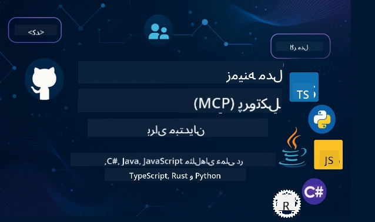

 

[](https://GitHub.com/microsoft/mcp-for-beginners/graphs/contributors)
[](https://GitHub.com/microsoft/mcp-for-beginners/issues)
[](https://GitHub.com/microsoft/mcp-for-beginners/pulls)
[](http://makeapullrequest.com)
[](https://mcptoplist.com/server/mcp.so%2Fmcp-for-beginners%2Fmicrosoft)

[](https://GitHub.com/microsoft/mcp-for-beginners/watchers)
[](https://GitHub.com/microsoft/mcp-for-beginners/fork)
[](https://GitHub.com/microsoft/mcp-for-beginners/stargazers)


[](https://discord.gg/nTYy5BXMWG)

برای شروع استفاده از این منابع، این مراحل را دنبال کنید:
1. **رپازیتوری را فورک کنید**: روی [](https://GitHub.com/microsoft/mcp-for-beginners/fork) کلیک کنید
2. **رپازیتوری را کلون کنید**:   `git clone https://github.com/microsoft/mcp-for-beginners.git`
3. **به** [](https://discord.gg/nTYy5BXMWG) بپیوندید


### 🌐 پشتیبانی از چند زبان

#### پشتیبانی شده از طریق GitHub Action (خودکار و همیشه به روز)

<!-- CO-OP TRANSLATOR LANGUAGES TABLE START -->
[Arabic](../ar/README.md) | [Bengali](../bn/README.md) | [Bulgarian](../bg/README.md) | [Burmese (Myanmar)](../my/README.md) | [Chinese (Simplified)](../zh-CN/README.md) | [Chinese (Traditional, Hong Kong)](../zh-HK/README.md) | [Chinese (Traditional, Macau)](../zh-MO/README.md) | [Chinese (Traditional, Taiwan)](../zh-TW/README.md) | [Croatian](../hr/README.md) | [Czech](../cs/README.md) | [Danish](../da/README.md) | [Dutch](../nl/README.md) | [Estonian](../et/README.md) | [Finnish](../fi/README.md) | [French](../fr/README.md) | [German](../de/README.md) | [Greek](../el/README.md) | [Hebrew](../he/README.md) | [Hindi](../hi/README.md) | [Hungarian](../hu/README.md) | [Indonesian](../id/README.md) | [Italian](../it/README.md) | [Japanese](../ja/README.md) | [Kannada](../kn/README.md) | [Khmer](../km/README.md) | [Korean](../ko/README.md) | [Lithuanian](../lt/README.md) | [Malay](../ms/README.md) | [Malayalam](../ml/README.md) | [Marathi](../mr/README.md) | [Nepali](../ne/README.md) | [Nigerian Pidgin](../pcm/README.md) | [Norwegian](../no/README.md) | [Persian (Farsi)](./README.md) | [Polish](../pl/README.md) | [Portuguese (Brazil)](../pt-BR/README.md) | [Portuguese (Portugal)](../pt-PT/README.md) | [Punjabi (Gurmukhi)](../pa/README.md) | [Romanian](../ro/README.md) | [Russian](../ru/README.md) | [Serbian (Cyrillic)](../sr/README.md) | [Slovak](../sk/README.md) | [Slovenian](../sl/README.md) | [Spanish](../es/README.md) | [Swahili](../sw/README.md) | [Swedish](../sv/README.md) | [Tagalog (Filipino)](../tl/README.md) | [Tamil](../ta/README.md) | [Telugu](../te/README.md) | [Thai](../th/README.md) | [Turkish](../tr/README.md) | [Ukrainian](../uk/README.md) | [Urdu](../ur/README.md) | [Vietnamese](../vi/README.md)

> **می‌خواهید محلی کلون کنید؟**
>
> این رپازیتوری شامل بیش از ۵۰ ترجمه زبان است که به طور قابل توجهی اندازه دانلود را افزایش می‌دهد. برای کلون کردن بدون ترجمه‌ها، از sparse checkout استفاده کنید:
>
> **Bash / macOS / Linux:**
> ```bash
> git clone --filter=blob:none --sparse https://github.com/microsoft/mcp-for-beginners.git
> cd mcp-for-beginners
> git sparse-checkout set --no-cone '/*' '!translations' '!translated_images'
> ```
>
> **CMD (ویندوز):**
> ```cmd
> git clone --filter=blob:none --sparse https://github.com/microsoft/mcp-for-beginners.git
> cd mcp-for-beginners
> git sparse-checkout set --no-cone "/*" "!translations" "!translated_images"
> ```
>
> این به شما همه چیزهایی که برای اتمام دوره نیاز دارید را با سرعت دانلود بسیار بیشتر می‌دهد.
<!-- CO-OP TRANSLATOR LANGUAGES TABLE END -->

# 🚀 برنامه درسی پروتکل مدل کانتکست (MCP) برای مبتدیان

## **یادگیری MCP با مثال‌های کدنویسی عملی در C#، Java، JavaScript، Rust، Python و TypeScript**

## 🧠 مروری بر برنامه درسی پروتکل مدل کانتکست
به سفر خود به دنیای پروتکل مدل کانتکست خوش آمدید! اگر تا به حال کنجکاو بودید که چگونه برنامه‌های هوش مصنوعی با ابزارها و سرویس‌های مختلف ارتباط برقرار می‌کنند، حالا می‌خواهید راه‌حل زیبا و کارآمدی را کشف کنید که نحوه ساخت سیستم‌های هوشمند توسط توسعه‌دهندگان را تغییر می‌دهد.

MCP را می‌توانید مانند یک مترجم جهانی برای برنامه‌های هوش مصنوعی در نظر بگیرید - همانطور که پورت‌های USB اجازه می‌دهند هر دستگاهی را به کامپیوتر وصل کنید، MCP اجازه می‌دهد مدل‌های هوش مصنوعی به هر ابزار یا سرویسی به صورت استاندارد متصل شوند. چه در حال ساخت اولین چت‌بات خود باشید یا روی جریان‌های کاری پیچیده هوش مصنوعی کار کنید، درک MCP به شما قدرت ساخت برنامه‌های توانمندتر و منعطف‌تر را می‌دهد.

این برنامه درسی با صبر و دقت برای سفر یادگیری شما طراحی شده است. ما از مفاهیم ساده‌ای که قبلاً می‌فهمید شروع می‌کنیم و به تدریج تخصص شما را از طریق تمرین عملی در زبان برنامه‌نویسی مورد علاقه‌تان افزایش می‌دهیم. هر گام شامل توضیحات واضح، مثال‌های عملی و تشویق‌های فراوان در مسیر است.

زمانی که این مسیر را به پایان برسانید، اعتماد به نفس خواهید داشت که سرورهای MCP خود را ساخته، آن‌ها را با پلتفرم‌های محبوب هوش مصنوعی ادغام کنید و بفهمید چگونه این تکنولوژی آینده توسعه هوش مصنوعی را شکل می‌دهد. بیایید این ماجراجویی هیجان‌انگیز را با هم آغاز کنیم!

### مستندات رسمی و مشخصات

این برنامه درسی با **مشخصات MCP به تاریخ ۲۰۲۵-۱۱-۲۵** (آخرین نسخه پایدار) هماهنگ است. مشخصات MCP از نسخه‌بندی بر اساس تاریخ (فرمت YYYY-MM-DD) برای ردیابی واضح نسخه پروتکل استفاده می‌کند.

> **نگاهی به آینده:** نامزد انتشار نسخه بعدی مشخصات، **۲۰۲۶-۰۷-۲۸**، قرار است در ۲۸ جولای ۲۰۲۶ عرضه شود. این نسخه پروتکل را در لایه انتقال بدون حالت می‌کند، چارچوب افزونه‌ها (برنامه‌ها و وظایف MCP) را رسمی می‌کند، تایید هویت را سخت‌گیرانه‌تر می‌کند و روت‌ها، نمونه‌برداری و لاگ‌گیری را منسوخ می‌نماید. برای توضیح کامل، به [چه تغییراتی در MCP اتفاق افتاده است: نامزد انتشار ۲۰۲۶-۰۷-۲۸](./01-CoreConcepts/mcp-2026-07-28-release-candidate.md) مراجعه کنید.

این منابع هر چه درک شما بیشتر شود ارزشمندتر می‌شوند، اما نیازی نیست فوراً همه چیز را بخوانید. از زمینه‌هایی که بیشتر به آن‌ها علاقه دارید شروع کنید!
- 📘 [مستندات MCP](https://modelcontextprotocol.io/) – این منبع اصلی شما برای آموزش‌های مرحله به مرحله و راهنماهای کاربر است. مستندات با در نظر گرفتن مبتدیان نوشته شده و مثال‌های واضحی ارائه می‌دهد که می‌توانید به سرعت خود آن‌ها را دنبال کنید.
- 📜 [مشخصات MCP](https://modelcontextprotocol.io/specification/2025-11-25) – این مانند دفترچه مرجع جامع شماست. در طول برنامه درسی، به اینجا باز می‌گردید تا جزئیات خاص را بررسی کنید و ویژگی‌های پیشرفته را کشف کنید.
- 📜 [نسخه‌بندی مشخصات MCP](https://modelcontextprotocol.io/specification/versioning) – این صفحه شامل اطلاعاتی درباره تاریخچه نسخه پروتکل و نحوه استفاده MCP از نسخه‌بندی تاریخ‌محور (فرمت YYYY-MM-DD) است.
- 🧑‍💻 [رپازیتوری MCP در GitHub](https://github.com/modelcontextprotocol) – اینجا SDKها، ابزارها و نمونه کدهایی در زبان‌های برنامه‌نویسی مختلف را خواهید یافت. مانند یک گنجینه از مثال‌های عملی و قطعات آماده استفاده است.
- 🌐 [جامعه MCP](https://github.com/orgs/modelcontextprotocol/discussions) – به جمع یادگیرندگان و توسعه‌دهندگان با تجربه در مباحث MCP بپیوندید. اینجا یک جامعه حمایتی است که سوال‌ها خوش‌آمدگو هستند و دانش به طور آزاد به اشتراک گذاشته می‌شود.
  
## اهداف یادگیری

تا پایان این برنامه درسی، احساس اعتماد به نفس و هیجان نسبت به توانایی‌های جدید خود خواهید داشت. این اهداف را در این مسیر بدست خواهید آورد:

• **درک اصول MCP:** شما خواهید فهمید پروتکل مدل کانتکست چیست و چرا نحوه همکاری برنامه‌های هوش مصنوعی را متحول کرده است، با استفاده از تشبیه‌ها و مثال‌هایی که قابل درک هستند.

• **ساخت اولین سرور MCP خود:** شما یک سرور MCP قابل کار در زبان برنامه‌نویسی دلخواهتان خواهید ساخت، با مثال‌های ساده شروع کرده و مهارت‌های خود را گام به گام افزایش می‌دهید.

• **اتصال مدل‌های هوش مصنوعی به ابزارهای واقعی:** شما یاد می‌گیرید چگونه پل ارتباطی بین مدل‌های هوش مصنوعی و سرویس‌های واقعی برقرار کنید، که به برنامه‌های شما قابلیت‌های قدرتمند جدید می‌بخشد.

• **پیاده‌سازی بهترین شیوه‌های امنیتی:** شما خواهید فهمید چگونه پیاده‌سازی‌های MCP خود را ایمن نگه دارید و از برنامه‌ها و کاربران خود محافظت کنید.

• **استقرار با اطمینان:** شما روش‌های عملی استقرار پروژه‌های MCP را از توسعه تا تولید خواهید آموخت، با استراتژی‌هایی که در دنیای واقعی کار می‌کنند.

• **پیوستن به جامعه MCP:** شما بخشی از یک جامعه رو به رشد توسعه‌دهندگان خواهید شد که آینده توسعه برنامه‌های هوش مصنوعی را شکل می‌دهند. 

## پیش‌نیازهای ضروری

پیش از پرداختن به جزئیات MCP، بیایید مطمئن شویم با برخی مفاهیم پایه راحت هستید. اگر در این زمینه‌ها متخصص نیستید نگران نباشید، هر آنچه باید بدانید را در طول مسیر توضیح خواهیم داد!

### درک پروتکل‌ها (بنیاد)

پروتکل را مانند قواعد یک مکالمه تصور کنید. وقتی با دوستی تماس می‌گیرید، هر دو می‌دانید که هنگام پاسخ دادن باید "سلام" بگویید، نوبت به نوبت صحبت کنید و وقتی تمام شد "خداحافظ" بگویید. برنامه‌های کامپیوتری هم برای برقراری ارتباط مؤثر به قواعد مشابهی نیاز دارند.

MCP یک پروتکل است - مجموعه‌ای از قواعد توافق شده که به مدل‌های هوش مصنوعی و برنامه‌ها کمک می‌کند تا "گفتگوهای" مؤثری با ابزارها و سرویس‌ها داشته باشند. درست مثل اینکه قوانین مکالمه باعث روان‌تر شدن ارتباط انسان‌ها می‌شود، MCP هم ارتباط برنامه‌های هوش مصنوعی را بسیار قابل اعتمادتر و قدرتمندتر می‌کند.

### روابط کلاینت-سرور (چگونگی همکاری برنامه‌ها)

شما روزانه از روابط کلاینت-سرور استفاده می‌کنید! وقتی از یک مرورگر وب (کلاینت) برای بازدید وب‌سایتی استفاده می‌کنید، به یک وب سرور متصل می‌شوید که محتوای صفحه را ارسال می‌کند. مرورگر می‌داند چگونه درخواست اطلاعات کند و سرور می‌داند چگونه پاسخ دهد.

در MCP، رابطه مشابهی داریم: مدل‌های هوش مصنوعی به عنوان کلاینت‌ها عمل می‌کنند که درخواست اطلاعات یا اقدامات می‌کنند، در حالی که سرورهای MCP این قابلیت‌ها را فراهم می‌کنند. این همانند داشتن یک دستیار مفید (سرور) است که هوش مصنوعی می‌تواند از آن بخواهد کارهای خاصی انجام دهد.

### چرا استانداردسازی مهم است (چطور چیزها با هم کار می‌کنند)

تصور کنید هر تولیدکننده خودرو از نازل‌های بنزین با شکل‌های متفاوت استفاده کند - برای هر ماشین به یک آداپتور مختلف نیاز دارید! استانداردسازی یعنی توافق بر روش‌های مشترک تا همه چیز به‌طرز یکپارچه کار کند.

MCP این استانداردسازی را برای برنامه‌های هوش مصنوعی فراهم می‌کند. به جای اینکه هر مدل هوش مصنوعی به کد مخصوص برای کار با هر ابزار نیاز داشته باشد، MCP راهی جهانی برای ارتباط برقرار کردن ارائه می‌دهد. این یعنی توسعه‌دهندگان می‌توانند ابزارها را یکبار بسازند و با بسیاری از سیستم‌های هوش مصنوعی کار کنند.

## 🧭 نمای کلی مسیر یادگیری شما

سفر MCP شما به دقت ساختار یافته تا اعتماد به نفس و مهارت‌هایتان به صورت تدریجی ساخته شود. هر مرحله مفاهیم جدیدی معرفی می‌کند و در عین حال آنچه یاد گرفته‌اید را تقویت می‌نماید.

### 🌱 مرحله بنیادین: درک اصول اولیه (مدول‌های ۰ تا ۲)

اینجا جایی است که ماجراجویی شما آغاز می‌شود! ما مفاهیم MCP را با تشبیهات آشنا و مثال‌های ساده معرفی می‌کنیم. شما می‌فهمید MCP چیست، چرا وجود دارد و چگونه در دنیای وسیع توسعه هوش مصنوعی جای می‌گیرد.


• **ماژول ۰ - مقدمه‌ای بر MCP**: ابتدا به بررسی MCP و اهمیت آن برای برنامه‌های هوش مصنوعی مدرن می‌پردازیم. نمونه‌های واقعی از MCP در عمل را خواهید دید و درک خواهید کرد که چگونه این پروتکل مشکلات رایجی که توسعه‌دهندگان با آن مواجه هستند را حل می‌کند.

• **ماژول ۱ - مفاهیم پایه توضیح داده شده**: در این قسمت با بلوک‌های اصلی MCP آشنا خواهید شد. از شباهت‌ها و مثال‌های تصویری زیادی استفاده خواهیم کرد تا این مفاهیم طبیعی و قابل درک باشند.

• **ماژول ۲ - امنیت در MCP**: بحث امنیت ممکن است دلهره‌آور به نظر برسد، اما نشان می‌دهیم مکانیسم‌های امنیتی داخلی MCP چیست و بهترین شیوه‌ها را که از برنامه‌های شما محافظت می‌کند آموزش می‌دهیم.

### 🔨 مرحله ساخت: ایجاد اولین پیاده‌سازی‌ها (ماژول ۳)

اکنون بخش جذاب واقعاً شروع می‌شود! تجربه عملی ساخت سرورها و کلاینت‌های واقعی MCP را خواهید داشت. نگران نباشید - از ساده شروع می‌کنیم و در هر مرحله راهنمایی می‌شوید.

این ماژول شامل چندین راهنمای عملی است که به شما امکان می‌دهد به زبان برنامه‌نویسی مورد علاقه خود تمرین کنید. اولین سرور خود را ایجاد می‌کنید، کلاینتی برای اتصال به آن می‌سازید و حتی با ابزارهای توسعه محبوب مانند VS Code یکپارچه می‌شوید.

هر راهنما شامل نمونه کد کامل، نکات عیب‌یابی و توضیحاتی درباره دلیل انتخاب‌های طراحی خاص است. در پایان این مرحله، پیاده‌سازی‌های MCP عملی خواهید داشت که به آن افتخار می‌کنید!

### 🚀 مرحله رشد: مفاهیم پیشرفته و کاربردهای واقعی (ماژول‌های ۴-۵)

با تسلط بر اصول اولیه، آماده‌اید ویژگی‌های پیشرفته‌تر MCP را کشف کنید. استراتژی‌های پیاده‌سازی عملی، تکنیک‌های اشکال‌زدایی و موضوعات پیشرفته‌ای مانند ادغام هوش مصنوعی چندحالتی را پوشش خواهیم داد.

همچنین خواهید آموخت چگونه پیاده‌سازی‌های MCP خود را برای استفاده در تولید مقیاس‌دهی کنید و با پلتفرم‌های ابری مانند Azure ادغام کنید. این ماژول‌ها شما را برای ساخت راهکارهای MCP که پاسخگوی نیازهای واقعی باشند آماده می‌سازد.

### 🌟 مرحله تسلط: جامعه و تخصصی‌سازی (ماژول‌های ۶-۱۱)

مرحله نهایی بر پیوستن به جامعه MCP و تخصصی شدن در حوزه‌های مورد علاقه شما تمرکز دارد. یاد می‌گیرید چگونه به پروژه‌های متن‌باز MCP کمک کنید، الگوهای پیشرفته احراز هویت را پیاده‌سازی کنید و راهکارهای جامع یکپارچه با پایگاه داده بسازید.

ماژول ۱۱ شایسته اشاره ویژه است - یک مسیر یادگیری عملی کامل با ۱۳ آزمایشگاه که شما را در ساخت سرورهای MCP آماده تولید با ادغام PostgreSQL آموزش می‌دهد. مثل یک پروژه پایانی است که همه چیزهایی را که یاد گرفته‌اید کنار هم جمع می‌کند!

### 📚 ساختار کامل دوره

| ماژول | موضوع | توضیحات | لینک |
|--------|-------|-------------|------|
| **ماژول ۰-۳: مبانی** | | | |
| ۰۰ | مقدمه‌ای بر MCP | مرور پروتکل مدل کانتکست و اهمیت آن در زنجیره‌های هوش مصنوعی | [مشاهده بیشتر](./00-Introduction/README.md) |
| ۰۱ | مفاهیم پایه توضیح داده شده | بررسی عمیق مفاهیم اصلی MCP | [مشاهده بیشتر](./01-CoreConcepts/README.md) |
| ۱.۱ | تغییرات در MCP (نسخه کاندید انتشار ۲۰۲۶-۰۷-۲۸) | پروتکل بدون حالت، چارچوب افزونه‌ها و حذف ویژگی‌ها در نسخه بعدی مشخصات | [راهنما](./01-CoreConcepts/mcp-2026-07-28-release-candidate.md) |
| ۰۲ | امنیت در MCP | تهدیدهای امنیتی و بهترین شیوه‌ها | [مشاهده بیشتر](./02-Security/README.md) |
| ۰۳ | شروع کار با MCP | راه‌اندازی محیط، سرورها/کلاینت‌های پایه، ادغام | [مشاهده بیشتر](./03-GettingStarted/README.md) |
| **ماژول ۳: ساخت اولین سرور و کلاینت** | | | |
| ۳.۱ | اولین سرور | ایجاد اولین سرور MCP | [راهنما](./03-GettingStarted/01-first-server/README.md) |
| ۳.۲ | اولین کلاینت | توسعه یک کلاینت پایه MCP | [راهنما](./03-GettingStarted/02-client/README.md) |
| ۳.۳ | کلاینت با مدل‌های زبانی بزرگ | ادغام مدل‌های زبان بزرگ | [راهنما](./03-GettingStarted/03-llm-client/README.md) |
| ۳.۴ | ادغام با VS Code | استفاده از سرورهای MCP در VS Code | [راهنما](./03-GettingStarted/04-vscode/README.md) |
| ۳.۵ | سرور stdio | ایجاد سرورها با استفاده از انتقال stdio | [راهنما](./03-GettingStarted/05-stdio-server/README.md) |
| ۳.۶ | استریمینگ HTTP | پیاده‌سازی استریمینگ HTTP در MCP | [راهنما](./03-GettingStarted/06-http-streaming/README.md) |
| ۳.۷ | ابزار توسعه Microsoft Foundry | استفاده از Microsoft Foundry Toolkit همراه با MCP | [راهنما](./03-GettingStarted/07-aitk/README.md) |
| ۳.۸ | تست | تست پیاده‌سازی سرور MCP | [راهنما](./03-GettingStarted/08-testing/README.md) |
| ۳.۹ | استقرار | استقرار سرورهای MCP در محیط تولید | [راهنما](./03-GettingStarted/09-deployment/README.md) |
| ۳.۱۰ | استفاده پیشرفته از سرور | استفاده از سرورهای پیشرفته برای امکانات پیشرفته و معماری بهبود یافته | [راهنما](./03-GettingStarted/10-advanced/README.md) |
| ۳.۱۱ | احراز هویت ساده | فصلی برای آموزش احراز هویت از ابتدا و RBAC | [راهنما](./03-GettingStarted/11-simple-auth/README.md) |
| ۳.۱۲ | میزبان‌های MCP | پیکربندی کلود دسکتاپ، کورسر، کلاین و سایر میزبان‌های MCP | [راهنما](./03-GettingStarted/12-mcp-hosts/README.md) |
| ۳.۱۳ | بازرس MCP | اشکال‌زدایی و تست سرورهای MCP با ابزار Inspector | [راهنما](./03-GettingStarted/13-mcp-inspector/README.md) |
| ۳.۱۴ | نمونه‌گیری | استفاده از نمونه‌گیری برای همکاری با کلاینت | [راهنما](./03-GettingStarted/14-sampling/README.md) |
| ۳.۱۵ | اپلیکیشن‌های MCP | ساخت اپ‌های MCP | [راهنما](./03-GettingStarted/15-mcp-apps/README.md) |
| **ماژول ۴-۵: عملی و پیشرفته** | | | |
| ۰۴ | پیاده‌سازی عملی | SDKها، اشکال‌زدایی، تست، قالب‌های قابل استفاده مجدد | [مشاهده بیشتر](./04-PracticalImplementation/README.md) |
| ۴.۱ | صفحه‌بندی | مدیریت مجموعه‌های نتایج بزرگ با صفحه‌بندی مبتنی بر کرسر | [راهنما](./04-PracticalImplementation/pagination/README.md) |
| ۰۵ | موضوعات پیشرفته در MCP | هوش مصنوعی چندحالتی، مقیاس‌دهی، استفاده سازمانی | [مشاهده بیشتر](./05-AdvancedTopics/README.md) |
| ۵.۱ | ادغام Azure | ادغام MCP با Azure | [راهنما](./05-AdvancedTopics/mcp-integration/README.md) |
| ۵.۲ | چندحالتی بودن | کار با چندین حالت | [راهنما](./05-AdvancedTopics/mcp-multi-modality/README.md) |
| ۵.۳ | دمو OAuth2 | پیاده‌سازی احراز هویت OAuth2 | [راهنما](./05-AdvancedTopics/mcp-oauth2-demo/README.md) |
| ۵.۴ | زمینه‌های ریشه‌ای | درک و پیاده‌سازی زمینه‌های ریشه‌ای | [راهنما](./05-AdvancedTopics/mcp-root-contexts/README.md) |
| ۵.۵ | مسیریابی | استراتژی‌های مسیریابی MCP | [راهنما](./05-AdvancedTopics/mcp-routing/README.md) |
| ۵.۶ | نمونه‌گیری | تکنیک‌های نمونه‌گیری در MCP | [راهنما](./05-AdvancedTopics/mcp-sampling/README.md) |
| ۵.۷ | مقیاس‌دهی | مقیاس‌دهی پیاده‌سازی‌های MCP | [راهنما](./05-AdvancedTopics/mcp-scaling/README.md) |
| ۵.۸ | امنیت | ملاحظات امنیتی پیشرفته | [راهنما](./05-AdvancedTopics/mcp-security/README.md) |
| ۵.۹ | جستجوی وب | پیاده‌سازی قابلیت‌های جستجوی وب | [راهنما](./05-AdvancedTopics/web-search-mcp/README.md) |
| ۵.۱۰ | استریمینگ بلادرنگ | ساخت قابلیت استریمینگ بلادرنگ | [راهنما](./05-AdvancedTopics/mcp-realtimestreaming/README.md) |
| ۵.۱۱ | جستجوی بلادرنگ | پیاده‌سازی جستجوی بلادرنگ | [راهنما](./05-AdvancedTopics/mcp-realtimesearch/README.md) |
| ۵.۱۲ | احراز هویت Entra ID | احراز هویت با Microsoft Entra ID | [راهنما](./05-AdvancedTopics/mcp-security-entra/README.md) |
| ۵.۱۳ | ادغام Foundry | ادغام با Microsoft Foundry | [راهنما](./05-AdvancedTopics/mcp-foundry-agent-integration/README.md) |
| ۵.۱۴ | مهندسی زمینه | تکنیک‌هایی برای مهندسی موثر زمینه | [راهنما](./05-AdvancedTopics/mcp-contextengineering/README.md) |
| ۵.۱۵ | انتقال سفارشی MCP | پیاده‌سازی‌های انتقال سفارشی | [راهنما](./05-AdvancedTopics/mcp-transport/README.md) |
| ۵.۱۶ | ویژگی‌های پروتکل | اطلاع‌رسانی پیشرفت، لغو، قالب‌های منابع | [راهنما](./05-AdvancedTopics/mcp-protocol-features/README.md) |
| ۵.۱۷ | استدلال چندعامل خصمانه | دو عامل با استفاده از ابزارهای مشترک MCP از دو طرف مقابل بحث می‌کنند، توسط یک عامل قاضی ارزیابی می‌شود | [راهنما](./05-AdvancedTopics/mcp-adversarial-agents/README.md) |
| **ماژول ۶-۱۰: جامعه و بهترین شیوه‌ها** | | | |
| ۰۶ | مشارکت‌های جامعه | نحوه مشارکت در اکوسیستم MCP | [راهنما](./06-CommunityContributions/README.md) |
| ۰۷ | بینش‌های استفاده اولیه | داستان‌های پیاده‌سازی دنیای واقعی | [راهنما](./07-LessonsfromEarlyAdoption/README.md) |
| ۰۸ | بهترین شیوه‌ها برای MCP | کارایی، تحمل خطا، تاب‌آوری | [راهنما](./08-BestPractices/README.md) |
| ۰۹ | مطالعات موردی MCP | نمونه‌های عملی پیاده‌سازی | [راهنما](./09-CaseStudy/README.md) |
| ۱۰ | کارگاه عملی | ساخت سرور MCP با Microsoft Foundry Toolkit | [آزمایشگاه](./10-StreamliningAIWorkflowsBuildingAnMCPServerWithAIToolkit/README.md) |
| **ماژول ۱۱: آزمایشگاه عملی سرور MCP** | | | |
| ۱۱ | ادغام پایگاه داده سرور MCP | مسیر یادگیری عملی کامل با ۱۳ آزمایشگاه برای ادغام PostgreSQL | [آزمایشگاه‌ها](./11-MCPServerHandsOnLabs/README.md) |
| ۱۱.۱ | مقدمه | مرور MCP با ادغام پایگاه داده و مورد استفاده در تحلیل فروش خرده‌فروشی | [آزمایشگاه ۰۰](./11-MCPServerHandsOnLabs/00-Introduction/README.md) |
| ۱۱.۲ | معماری اصلی | درک معماری سرور MCP، لایه‌های پایگاه داده و الگوهای امنیتی | [آزمایشگاه ۰۱](./11-MCPServerHandsOnLabs/01-Architecture/README.md) |
| ۱۱.۳ | امنیت و چنداجاره‌ای | امنیت در سطح ردیف، احراز هویت و دسترسی داده‌های چند مستاجری | [آزمایشگاه ۰۲](./11-MCPServerHandsOnLabs/02-Security/README.md) |
| ۱۱.۴ | راه‌اندازی محیط | راه‌اندازی محیط توسعه، Docker، منابع Azure | [آزمایشگاه ۰۳](./11-MCPServerHandsOnLabs/03-Setup/README.md) |
| ۱۱.۵ | طراحی پایگاه داده | راه‌اندازی PostgreSQL، طراحی شمای فروشگاه و داده نمونه | [آزمایشگاه ۰۴](./11-MCPServerHandsOnLabs/04-Database/README.md) |
| ۱۱.۶ | پیاده‌سازی سرور MCP | ساخت سرور FastMCP با ادغام پایگاه داده | [آزمایشگاه ۰۵](./11-MCPServerHandsOnLabs/05-MCP-Server/README.md) |
| ۱۱.۷ | توسعه ابزار | ساخت ابزارهای کوئری پایگاه داده و بازبینی شمای پایگاه داده | [آزمایشگاه ۰۶](./11-MCPServerHandsOnLabs/06-Tools/README.md) |
| ۱۱.۸ | جستجوی معنایی | پیاده‌سازی تعبیه‌های برداری با Azure OpenAI و pgvector | [آزمایشگاه ۰۷](./11-MCPServerHandsOnLabs/07-Semantic-Search/README.md) |
| ۱۱.۹ | تست و اشکال‌زدایی | استراتژی‌های تست، ابزارهای اشکال‌زدایی و روش‌های اعتبارسنجی | [آزمایشگاه ۰۸](./11-MCPServerHandsOnLabs/08-Testing/README.md) |
| ۱۱.۱۰ | ادغام VS Code | پیکربندی ادغام VS Code MCP و استفاده از چت هوش مصنوعی | [آزمایشگاه ۰۹](./11-MCPServerHandsOnLabs/09-VS-Code/README.md) |
| ۱۱.۱۱ | استراتژی‌های استقرار | استقرار Docker، Azure Container Apps و ملاحظات مقیاس‌دهی | [آزمایشگاه ۱۰](./11-MCPServerHandsOnLabs/10-Deployment/README.md) |
| ۱۱.۱۲ | نظارت | Application Insights، ثبت لاگ، نظارت بر عملکرد | [آزمایشگاه ۱۱](./11-MCPServerHandsOnLabs/11-Monitoring/README.md) |
| ۱۱.۱۳ | بهترین شیوه‌ها | بهینه‌سازی عملکرد، سخت‌سازی امنیتی و نکات تولید | [آزمایشگاه ۱۲](./11-MCPServerHandsOnLabs/12-Best-Practices/README.md) |
| **ماژول ۱۲: ابزار MCP** | | | |
| ۱۲.۱ | ابزار | استفاده از MCP در اپ Copilot | [ راهنما ](./12-tooling/README.md) |

### 💻 پروژه‌های نمونه کدنویسی

یکی از هیجان‌انگیزترین بخش‌های یادگیری MCP، مشاهده پیشرفت مهارت‌های کدنویسی شما به صورت تدریجی است. نمونه کدهای ما به گونه‌ای طراحی شده‌اند که از ساده شروع کنند و درک عمیق‌تر شما منجر به کدهای پیشرفته‌تر شود. اینجا نحوه معرفی مفاهیم را می‌بینید - با کدی که هم ساده است ولی اصول واقعی MCP را نشان می‌دهد، نه تنها متوجه می‌شوید این کد چه کاری انجام می‌دهد بلکه چرا به این شکل ساختاربندی شده و چگونه در برنامه‌های بزرگ‌تر MCP جای می‌گیرد.

#### نمونه‌های پایه ماشین‌حساب MCP

| زبان | توضیحات | لینک |
|----------|-------------|------|

| C# | نمونه سرور MCP | [مشاهده کد](./03-GettingStarted/samples/csharp/README.md) |
| Java | ماشین حساب MCP | [مشاهده کد](./03-GettingStarted/samples/java/calculator/README.md) |
| JavaScript | دمو MCP | [مشاهده کد](./03-GettingStarted/samples/javascript/README.md) |
| Python | سرور MCP | [مشاهده کد](../../03-GettingStarted/samples/python/mcp_calculator_server.py) |
| TypeScript | نمونه MCP | [مشاهده کد](./03-GettingStarted/samples/typescript/README.md) |
| Rust | نمونه MCP | [مشاهده کد](./03-GettingStarted/samples/rust/README.md) |

#### پیاده‌سازی‌های پیشرفته MCP

| زبان | توضیحات | لینک |
|----------|-------------|------|
| C# | نمونه پیشرفته | [مشاهده کد](./04-PracticalImplementation/samples/csharp/README.md) |
| Java با Spring | نمونه برنامه کانتینر | [مشاهده کد](./04-PracticalImplementation/samples/java/containerapp/README.md) |
| JavaScript | نمونه پیشرفته | [مشاهده کد](./04-PracticalImplementation/samples/javascript/README.md) |
| Python | پیاده‌سازی پیچیده | [مشاهده کد](./04-PracticalImplementation/samples/python/README.md) |
| TypeScript | نمونه کانتینر | [مشاهده کد](./04-PracticalImplementation/samples/typescript/README.md) |


## 🎯 پیش‌نیازهای یادگیری MCP

برای بهره‌مندی کامل از این دوره، باید داشته باشید:

- دانش پایه‌ای برنامه‌نویسی در حداقل یکی از زبان‌های C#، Java، JavaScript، Python یا TypeScript
- درک مدل کلاینت-سرور و APIها
- آشنایی با مفاهیم REST و HTTP
- (اختیاری) زمینه آشنایی با مفاهیم AI/ML

- پیوستن به بحث‌های جامعه ما برای دریافت پشتیبانی

## 📚 راهنمای مطالعه و منابع

این مخزن چندین منبع برای کمک به شما در مسیریابی و یادگیری مؤثر فراهم می‌کند:

### راهنمای مطالعه

یک [راهنمای مطالعه](./study_guide.md) جامع برای کمک به راهبری مؤثر این مخزن در دسترس است. این نقشه آموزشی بصری نشان می‌دهد همه موضوعات چگونه به هم مرتبط‌اند و راهنمایی می‌کند چگونه نمونه پروژه‌ها را به خوبی استفاده کنید. خصوصاً برای افرادی که تمایل به یادگیری بصری دارند و دوست دارند تصویر کلی را ببینند، مفید است.

راهنما شامل:
- نقشه آموزشی بصری که همه موضوعات پوشش داده شده را نشان می‌دهد
- تقسیم‌بندی دقیق هر بخش مخزن
- راهنمایی برای استفاده از نمونه پروژه‌ها
- مسیرهای یادگیری پیشنهادی برای سطوح مهارتی مختلف
- منابع اضافی برای تکمیل روند یادگیری شما

### فهرست تغییرات

ما یک [فهرست تغییرات](./changelog.md) دقیق را نگهداری می‌کنیم که همه بروزرسانی‌های مهم مواد آموزشی را پیگیری می‌کند تا شما بتوانید همیشه با آخرین پیشرفت‌ها و افزودنی‌ها به‌روز باشید.
- افزودن محتوای جدید
- تغییرات ساختاری
- بهبود ویژگی‌ها
- بروزرسانی مستندات

## 🛠️ چگونه این دوره را مؤثر استفاده کنیم

هر درس در این راهنما شامل:

1. توضیحات روشن درباره مفاهیم MCP  
2. نمونه‌های کد زنده به چند زبان  
3. تمرین‌هایی برای ساخت برنامه‌های واقعی MCP  
4. منابع اضافی برای یادگیرندگان پیشرفته

### بیایید MCP را با C# یاد بگیریم - سری آموزش
بیایید درباره Model Context Protocol (MCP) که چارچوب پیشرفته‌ای برای استانداردسازی تعامل بین مدل‌های هوش مصنوعی و برنامه‌های کلاینت است، یاد بگیریم. در این جلسه مبتدی‌پسند، شما را با MCP آشنا می‌کنیم و راهنمایی می‌کنیم تا اولین سرور MCP خود را ایجاد کنید.
#### C#: [https://aka.ms/letslearnmcp-csharp](https://aka.ms/letslearnmcp-csharp)
#### Java: [https://aka.ms/letslearnmcp-java](https://aka.ms/letslearnmcp-java)
#### JavaScript: [https://aka.ms/letslearnmcp-javascript](https://aka.ms/letslearnmcp-javascript)
#### Python: [https://aka.ms/letslearnmcp-python](https://aka.ms/letslearnmcp-python)

## 🎓 سفر MCP شما آغاز می‌شود

تبریک می‌گوییم! شما اولین قدم در یک سفر هیجان‌انگیز را برداشته‌اید که قابلیت‌های برنامه‌نویسی شما را گسترش می‌دهد و شما را به نوک پیشرفت‌های توسعه هوش مصنوعی متصل می‌کند.

### آنچه تاکنون انجام داده‌اید

با خواندن این مقدمه، شما پایه دانش MCP خود را شروع کرده‌اید. درک کرده‌اید MCP چیست، چرا اهمیت دارد و چگونه این دوره به حمایت از مسیر یادگیری شما کمک می‌کند. این یک دستاورد مهم و آغاز تخصص شما در این فناوری مهم است.

### ماجراجویی پیش رو

هنگامی که از طریق ماژول‌ها پیش می‌روید، به یاد داشته باشید که هر کارشناس روزی مبتدی بوده است. مفاهیمی که اکنون ممکن است پیچیده به نظر برسند، با تمرین و کاربرد برای شما عادی خواهند شد. هر قدم کوچک به سمت توانایی‌های قوی‌تری است که در تمام دوران توسعه شما خدمت می‌کند.

### شبکه حمایتی شما

شما به جمعی از یادگیرندگان و کارشناسان می‌پیوندید که به MCP علاقه‌مند هستند و مشتاق کمک به موفقیت دیگران می‌باشند. چه در حل چالش کدنویسی گیر کرده باشید و چه مشتاق به اشتراک گذاشتن پیشرفتی باشید، جامعه اینجا برای حمایت از سفر شماست.

اگر گیر کردید یا سوالی درباره ساخت برنامه‌های هوش مصنوعی داشتید، به همراه دیگر یادگیرندگان و توسعه‌دهندگان باتجربه در بحث‌های MCP بپیوندید. این یک جامعه حمایتی است که سوالات پذیرفته و دانش آزادانه به اشتراک گذاشته می‌شود.

[](https://discord.gg/nTYy5BXMWG)

اگر بازخورد محصول یا خطایی هنگام ساخت دارید، مراجعه کنید به:

[](https://aka.ms/foundry/forum)

### آماده شروعید؟

ماجراجویی MCP شما از همین حالا آغاز می‌شود! با ماژول 0 شروع کنید تا اولین تجربه‌های عملی MCP خود را داشته باشید، یا پروژه‌های نمونه را کاوش کنید تا ببینید چه چیزی خواهید ساخت. به یاد داشته باشید - هر کارشناس دقیقاً از جایی که شما هستید شروع کرده است و با صبر و تمرین، شگفت‌زده خواهید شد از آنچه می‌توانید به دست آورید.

به دنیای توسعه پروتکل مدل کانتکست خوش آمدید. بیایید با هم چیزی شگفت‌انگیز بسازیم!

## 🤝 مشارکت در جامعه یادگیری

این دوره با مشارکت یادگیرندگانی مثل شما قوی‌تر می‌شود! چه اشتباه تایپی را اصلاح کنید، چه توضیحی واضح‌تر پیشنهاد دهید یا نمونه جدیدی اضافه کنید، مشارکت شما به دیگر مبتدیان کمک می‌کند موفق شوند.

از حرفه‌ای محترم مایکروسافت [Shivam Goyal](https://www.linkedin.com/in/shivam2003/) برای مشارکت نمونه کدها سپاسگزاریم.

روند مشارکت طوری طراحی شده که استقبال‌کننده و حمایت‌کننده باشد. بیشتر مشارکت‌ها نیاز به موافقت با قرارداد مجوز مشارکت‌کننده (CLA) دارند، اما ابزارهای خودکار شما را به‌راحتی از این روند عبور می‌دهند.

## 📜 یادگیری منبع‌باز

کل این دوره تحت مجوز MIT [LICENSE](../../LICENSE) در دسترس است، به این معنی که می‌توانید آن را به صورت آزاد استفاده، تغییر و به اشتراک بگذارید. این از هدف ما برای دسترسی آسان دانش MCP برای توسعه‌دهندگان در سراسر جهان حمایت می‌کند.
## 🤝 رهنمودهای مشارکت

این پروژه از مشارکت‌ها و پیشنهادات استقبال می‌کند. بیشتر مشارکت‌ها نیازمند این است که شما موافقت کنید
با قرارداد مجوز مشارکت‌کننده (CLA) که اعلام می‌کند شما حق دارید و در واقع حقوق لازم را به ما برای
استفاده از مشارکت‌تان می‌دهید. برای جزئیات به <https://cla.opensource.microsoft.com> مراجعه کنید.

هنگامی که درخواست pull ارسال می‌کنید، ربات CLA به‌طور خودکار تشخیص می‌دهد که آیا باید
قرارداد CLA ارائه دهید و درخواست را به‌طور مناسب علامت‌گذاری می‌کند (مثلاً بررسی وضعیت، نظرات). فقط دستورالعمل‌های
ربات را دنبال کنید. شما فقط یک بار برای همه مخازن نیاز به این کار دارید.

این پروژه [کد رفتار منبع‌باز مایکروسافت](https://opensource.microsoft.com/codeofconduct/) را پذیرفته است.
برای اطلاعات بیشتر به [سوالات متداول کد رفتار](https://opensource.microsoft.com/codeofconduct/faq/) مراجعه کنید یا
با [opencode@microsoft.com](mailto:opencode@microsoft.com) برای هر سوال یا نظر اضافی تماس بگیرید.

---

*آماده شروع سفر MCP خود هستید؟ از [ماژول 00 - معرفی MCP](./00-Introduction/README.md) شروع کنید و اولین گام‌های خود را در دنیای توسعه پروتکل مدل کانتکست بردارید!*


## 🎒 دوره‌های دیگر
تیم ما دوره‌های دیگری تولید می‌کند! نگاهی بیندازید به:

<!-- CO-OP TRANSLATOR OTHER COURSES START -->
### LangChain
[](https://aka.ms/langchain4j-for-beginners)
[](https://aka.ms/langchainjs-for-beginners?WT.mc_id=m365-94501-dwahlin)
[](https://github.com/microsoft/langchain-for-beginners?WT.mc_id=m365-94501-dwahlin)
---

### Azure / Edge / MCP / عوامل
[](https://github.com/microsoft/AZD-for-beginners?WT.mc_id=academic-105485-koreyst)
[](https://github.com/microsoft/edgeai-for-beginners?WT.mc_id=academic-105485-koreyst)
[](https://github.com/microsoft/mcp-for-beginners?WT.mc_id=academic-105485-koreyst)
[](https://github.com/microsoft/ai-agents-for-beginners?WT.mc_id=academic-105485-koreyst)

---
 
### سری هوش مصنوعی مولد
[](https://github.com/microsoft/generative-ai-for-beginners?WT.mc_id=academic-105485-koreyst)
[-9333EA?style=for-the-badge&labelColor=E5E7EB&color=9333EA)](https://github.com/microsoft/Generative-AI-for-beginners-dotnet?WT.mc_id=academic-105485-koreyst)
[-C084FC?style=for-the-badge&labelColor=E5E7EB&color=C084FC)](https://github.com/microsoft/generative-ai-for-beginners-java?WT.mc_id=academic-105485-koreyst)
[-E879F9?style=for-the-badge&labelColor=E5E7EB&color=E879F9)](https://github.com/microsoft/generative-ai-with-javascript?WT.mc_id=academic-105485-koreyst)

---
 
### یادگیری پایه
[](https://aka.ms/ml-beginners?WT.mc_id=academic-105485-koreyst)
[](https://aka.ms/datascience-beginners?WT.mc_id=academic-105485-koreyst)
[](https://aka.ms/ai-beginners?WT.mc_id=academic-105485-koreyst)

[](https://github.com/microsoft/Security-101?WT.mc_id=academic-96948-sayoung)
[](https://aka.ms/webdev-beginners?WT.mc_id=academic-105485-koreyst)
[](https://aka.ms/iot-beginners?WT.mc_id=academic-105485-koreyst)
[](https://github.com/microsoft/xr-development-for-beginners?WT.mc_id=academic-105485-koreyst)

---
 
### سری آموزش‌های کوپایلوت
[](https://aka.ms/GitHubCopilotAI?WT.mc_id=academic-105485-koreyst)
[](https://github.com/microsoft/mastering-github-copilot-for-dotnet-csharp-developers?WT.mc_id=academic-105485-koreyst)
[](https://github.com/microsoft/CopilotAdventures?WT.mc_id=academic-105485-koreyst)
<!-- CO-OP TRANSLATOR OTHER COURSES END -->

---

<!-- CO-OP TRANSLATOR DISCLAIMER START -->
**سلب مسئولیت**:
این سند با استفاده از سرویس ترجمه هوش مصنوعی [Co-op Translator](https://github.com/Azure/co-op-translator) ترجمه شده است. در حالی که ما در تلاش برای دقت هستیم، لطفاً توجه داشته باشید که ترجمه‌های خودکار ممکن است شامل خطاها یا نادرستی‌هایی باشند. سند اصلی به زبان مادری خود باید به عنوان منبع معتبر در نظر گرفته شود. برای اطلاعات حیاتی، ترجمه حرفه‌ای انسانی توصیه می‌شود. ما در قبال هرگونه سوء تفاهم یا برداشت نادرست ناشی از استفاده از این ترجمه مسئولیتی نداریم.
<!-- CO-OP TRANSLATOR DISCLAIMER END -->