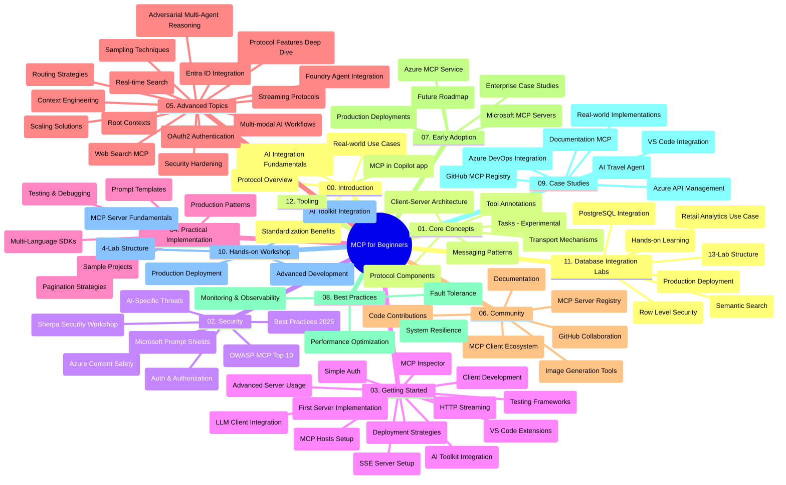

# پروتکل بستر مدل (MCP) برای مبتدیان - راهنمای مطالعه

این راهنمای مطالعه نمایی کلی از ساختار مخزن و محتوای دورهٔ آموزشی «پروتکل بستر مدل (MCP) برای مبتدیان» ارائه می‌دهد. از این راهنما برای پیمایش مؤثر در مخزن و بهره‌برداری بهینه از منابع موجود استفاده کنید.

## نمای کلی مخزن

پروتکل بستر مدل (MCP) چارچوبی استاندارد برای تعاملات بین مدل‌های هوش مصنوعی و برنامه‌های کلاینت است. این پروتکل که ابتدا توسط Anthropic ایجاد شده است، اکنون توسط جامعهٔ گسترده‌تر MCP از طریق سازمان رسمی GitHub پشتیبانی می‌شود. این مخزن یک دورهٔ آموزشی جامع با مثال‌های کاربردی در زبان‌های C#، Java، JavaScript، Python و TypeScript ارائه می‌دهد که برای توسعه‌دهندگان هوش مصنوعی، معماران سیستم و مهندسان نرم‌افزار طراحی شده است.

## نقشهٔ تصویری دوره

## ساختار مخزن

این مخزن به دوازده بخش اصلی تقسیم شده است که هر کدام بر جنبه‌های مختلف MCP تمرکز دارند:

1. **مقدمه (00-Introduction/)**
   - نمای کلی پروتکل بستر مدل
   - اهمیت استانداردسازی در جریان‌های هوش مصنوعی
   - موارد استفاده عملی و مزایا

2. **مفاهیم اصلی (01-CoreConcepts/)**
   - معماری کلاینت-سرور
   - اجزای کلیدی پروتکل
   - الگوهای پیام‌رسانی در MCP
   - مشخصات فعلی: [چه تغییراتی در MCP رخ داده است: مشخصات 2026-07-28](./01-CoreConcepts/mcp-2026-07-28.md) — هستهٔ بدون وضعیت پروتکل، چارچوب افزونه‌ها و حذف‌های ریشه‌ها/نمونه‌برداری/ثبت لاگ

3. **امنیت (02-Security/)**
   - تهدیدات امنیتی در سیستم‌های مبتنی بر MCP
   - بهترین روش‌ها برای ایمن‌سازی پیاده‌سازی‌ها
   - استراتژی‌های احراز هویت و مجوزدهی
   - آموزش عملی [نمونه مجوزدهی CIMD و DCR](./02-Security/samples/cimd-dcr-auth/README.md)
   - **مستندات جامع امنیتی**:
     - بهترین روش‌های امنیتی MCP
     - راهنمای پیاده‌سازی امنیت محتوای Azure
     - کنترل‌ها و تکنیک‌های امنیتی MCP
     - مرجع سریع بهترین روش‌های MCP
   - **موضوعات کلیدی امنیتی**:
     - حملات تزریق فرمان و مسمومیت ابزار
     - ربایش نشست و مشکلات نماینده گیج شده
     - آسیب‌پذیری‌های عبور توکن
     - مجوزهای بیش از حد و کنترل دسترسی
     - امنیت زنجیره تأمین برای اجزای هوش مصنوعی
     - یکپارچه‌سازی Microsoft Prompt Shields

4. **شروع به کار (03-GettingStarted/)**
   - راه‌اندازی و پیکربندی محیط
   - ایجاد سرورها و کلاینت‌های پایه MCP
   - یکپارچه‌سازی با برنامه‌های موجود
   - شامل بخش‌هایی برای:
     - پیاده‌سازی اولین سرور
     - توسعه کلاینت
     - یکپارچه‌سازی کلاینت LLM
     - یکپارچه‌سازی VS Code
     - سرور رویدادهای ارسالی از سمت سرور (SSE)
     - استفاده پیشرفته از سرور
     - پخش جریانی HTTP
     - یکپارچه‌سازی مجموعه ابزار هوش مصنوعی
     - استراتژی‌های تست
     - راهنمای استقرار

5. **پیاده‌سازی عملی (04-PracticalImplementation/)**
   - استفاده از SDKها در زبان‌های برنامه‌نویسی مختلف
   - تکنیک‌های اشکال‌زدایی، تست و اعتبارسنجی
   - طراحی قالب‌ها و روندهای قابل استفاده مجدد برای فرمان‌ها
   - پروژه‌های نمونه با مثال‌های پیاده‌سازی

6. **موضوعات پیشرفته (05-AdvancedTopics/)**
   - تکنیک‌های مهندسی بستر
   - یکپارچه‌سازی عامل Foundry
   - روندهای چندوجهی هوش مصنوعی
   - دموهای احراز هویت OAuth2
   - قابلیت‌های جستجوی بلادرنگ
   - پخش جریانی بلادرنگ
   - پیاده‌سازی بسترهای ریشه
   - استراتژی‌های مسیریابی
   - تکنیک‌های نمونه‌برداری
   - رویکردهای مقیاس‌پذیری
   - ملاحظات امنیتی
   - یکپارچه‌سازی امنیتی Entra ID
   - یکپارچه‌سازی جستجوی وب
   - استدلال چندعاملی مقابله‌ای (الگوهای مباحثه)

7. **مشارکت‌های جامعه (06-CommunityContributions/)**
   - نحوه مشارکت در کد و مستندات
   - همکاری از طریق GitHub
   - بهبودها و بازخوردهای هدایت‌شده توسط جامعه
   - استفاده از کلاینت‌های مختلف MCP (Claude Desktop, Cline, VSCode)
   - کار با سرورهای محبوب MCP شامل تولید تصویر

8. **درس‌هایی از پذیرش اولیه (07-LessonsfromEarlyAdoption/)**
   - پیاده‌سازی‌های دنیای واقعی و داستان‌های موفقیت
   - ساخت و استقرار راهکارهای مبتنی بر MCP
   - روندها و نقشه راه آینده
   - **راهنمای سرورهای MCP مایکروسافت**: راهنمای جامع ۱۰ سرور MCP آماده تولید مایکروسافت شامل:
     - سرور MCP مستندات Microsoft Learn
     - سرور MCP Azure (بیش از ۱۵ اتصال تخصصی)
     - سرور MCP GitHub
     - سرور MCP Azure DevOps
     - سرور MCP MarkItDown
     - سرور MCP SQL Server
     - سرور MCP Playwright
     - سرور MCP Dev Box
     - سرور MCP Microsoft Foundry
     - سرور MCP مجموعه ابزار عوامل Microsoft 365

9. **بهترین روش‌ها (08-BestPractices/)**
   - تنظیم و بهینه‌سازی عملکرد
   - طراحی سیستم‌های MCP مقاوم در برابر خطا
   - استراتژی‌های تست و تاب‌آوری

10. **مطالعات موردی (09-CaseStudy/)**
    - **هفت مطالعه موردی جامع** که انعطاف‌پذیری MCP را در سناریوهای مختلف نشان می‌دهد:
    - **نمایندگان سفر هوش مصنوعی Azure**: اورکستراسیون چندعاملی با Azure OpenAI و AI Search
    - **یکپارچه‌سازی Azure DevOps**: خودکارسازی فرآیندهای کاری با به‌روزرسانی‌های داده‌ای یوتیوب
    - **بازیابی مستندات بلادرنگ**: کلاینت کنسول پایتون با پخش جریانی HTTP
    - **تولید برنامه مطالعه تعاملی**: برنامه وب Chainlit با هوش مصنوعی محاوره‌ای
    - **مستندسازی در ویرایشگر**: یکپارچه‌سازی VS Code با روندهای GitHub Copilot
    - **مدیریت API Azure**: یکپارچه‌سازی API سازمانی با ایجاد سرور MCP
    - **ثبت MCP در GitHub**: توسعه اکوسیستم و پلتفرم یکپارچه‌سازی عاملی
    - نمونه‌های پیاده‌سازی در حوزهٔ یکپارچه‌سازی سازمانی، بهره‌وری توسعه‌دهنده و توسعه اکوسیستم

11. **کارگاه عملی (10-StreamliningAIWorkflowsBuildingAnMCPServerWithAIToolkit/)**
    - کارگاه جامع عملی ترکیب MCP با مجموعه ابزار هوش مصنوعی
    - ساخت برنامه‌های هوشمند متصل‌کننده مدل‌های هوش مصنوعی با ابزارهای دنیای واقعی
    - ماژول‌های عملی شامل اصول پایه، توسعه سرور سفارشی و استراتژی‌های استقرار در تولید
    - **ساختار کارگاه**:
      - کارگاه ۱: اصول سرور MCP
      - کارگاه ۲: توسعه پیشرفته سرور MCP
      - کارگاه ۳: یکپارچه‌سازی مجموعه ابزار هوش مصنوعی
      - کارگاه ۴: استقرار و مقیاس‌پذیری در تولید
    - روش یادگیری مبتنی بر کارگاه با دستورالعمل‌های گام به گام

12. **کارگاه‌های یکپارچه‌سازی پایگاه داده سرور MCP (11-MCPServerHandsOnLabs/)**
    - **مسیر یادگیری جامع ۱۳ کارگاه** برای ساخت سرورهای MCP آماده تولید با یکپارچه‌سازی PostgreSQL
    - **پیاده‌سازی تحلیل خرده‌فروشی دنیای واقعی** با استفاده از مورد استفاده Zava Retail
    - **الگوهای درجه سازمانی** شامل امنیت سطح ردیف (RLS)، جستجوی معنایی و دسترسی داده چندمستأجر
    - **ساختار کامل کارگاه‌ها**:
      - **کارگاه‌های ۰۰-۰۳: پایه‌ها** - مقدمه، معماری، امنیت، راه‌اندازی محیط
      - **کارگاه‌های ۰۴-۰۶: ساخت سرور MCP** - طراحی پایگاه داده، پیاده‌سازی سرور MCP، توسعه ابزار

      - **آزمایشگاه‌های ۰۷-۰۹: ویژگی‌های پیشرفته** - جستجوی معنایی، تست و اشکال‌زدایی، ادغام با VS Code
      - **آزمایشگاه‌های ۱۰-۱۲: تولید و بهترین شیوه‌ها** - استقرار، پایش، بهینه‌سازی
    - **فناوری‌های پوشش داده شده**: چارچوب FastMCP، PostgreSQL، Azure OpenAI، Azure Container Apps، Application Insights
    - **نتایج یادگیری**: سرورهای MCP آماده تولید، الگوهای یکپارچه‌سازی پایگاه داده، تحلیل مبتنی بر هوش مصنوعی، امنیت سازمانی

13. **ابزارها (12-tooling/)**
    - یاد بگیرید چگونه در برنامه Copilot و سایر ابزارها از MCP استفاده کنید

## منابع اضافی

مخزن شامل منابع پشتیبانی است:

- **پوشه تصاویر**: شامل نمودارها و تصویرسازی‌هایی است که در سراسر برنامه درسی استفاده شده‌اند
- **ترجمه‌ها**: پشتیبانی چندزبانه با ترجمه‌های خودکار مستندات
- **منابع رسمی MCP**:
  - [مستندات MCP](https://modelcontextprotocol.io/)
  - [مشخصات MCP](https://modelcontextprotocol.io/specification/2026-07-28/)
  - [مخزن GitHub MCP](https://github.com/modelcontextprotocol)

## چگونه از این مخزن استفاده کنیم

1. **یادگیری ترتیبی**: فصل‌ها را به ترتیب دنبال کنید (از ۰۰ تا ۱۱) برای یادگیری ساختاریافته.
2. **تمرکز بر زبان خاص**: اگر به زبان برنامه‌نویسی خاصی علاقه دارید، به دایرکتوری نمونه‌ها برای پیاده‌سازی‌ها در زبان مورد علاقه‌تان مراجعه کنید.
3. **پیاده‌سازی عملی**: با بخش «شروع به کار» شروع کنید تا محیط خود را راه‌اندازی و اولین سرور و کلاینت MCP خود را بسازید.
4. **بررسی پیشرفته**: پس از تسلط بر مباحث پایه، به موضوعات پیشرفته‌تر بپردازید تا دانش خود را گسترش دهید.
5. **فعالیت در جامعه**: با پیوستن به بحث‌های GitHub و کانال‌های Discord جامعه MCP، با کارشناسان و توسعه‌دهندگان دیگر ارتباط برقرار کنید.

## کلاینت‌ها و ابزارهای MCP

برنامه درسی کلاینت‌ها و ابزارهای مختلف MCP را پوشش می‌دهد:

1. **کلاینت‌های رسمی**:
   - Visual Studio Code 
   - MCP در Visual Studio Code
   - Claude Desktop
   - Claude در VSCode 
   - Claude API

2. **کلاینت‌های جامعه**:
   - Cline (ترمینال-محور)
   - Cursor (ویرایشگر کد)
   - ChatMCP
   - Windsurf

3. **ابزارهای مدیریت MCP**:
   - MCP CLI
   - MCP Manager
   - MCP Linker
   - MCP Router

## سرورهای محبوب MCP

مخزن سرورهای مختلف MCP را معرفی می‌کند، از جمله:

1. **سرورهای رسمی مایکروسافت MCP**:
   - سرور Microsoft Learn Docs MCP
   - سرور Azure MCP (بیش از ۱۵ کانکتور تخصصی)
   - سرور GitHub MCP
   - سرور Azure DevOps MCP
   - سرور MarkItDown MCP
   - سرور SQL Server MCP
   - سرور Playwright MCP
   - سرور Dev Box MCP
   - سرور Microsoft Foundry MCP
   - سرور Microsoft 365 Agents Toolkit MCP

2. **سرورهای مرجع رسمی**:
   - Filesystem
   - Fetch
   - Memory
   - Sequential Thinking

3. **تولید تصویر**:
   - Azure OpenAI DALL-E 3
   - Stable Diffusion WebUI
   - Replicate

4. **ابزارهای توسعه**:
   - Git MCP
   - کنترل ترمینال
   - دستیار کد

5. **سرورهای تخصصی**:
   - Salesforce
   - Microsoft Teams
   - Jira و Confluence

## مشارکت

این مخزن از مشارکت‌های جامعه استقبال می‌کند. برای راهنمایی در مورد نحوه مشارکت مؤثر در اکوسیستم MCP به بخش مشارکت‌های جامعه مراجعه کنید.

----

*این راهنمای مطالعه در تاریخ ۹ سپتامبر ۲۰۲۶ آخرین بار به‌روزرسانی شده است. این نسخه بازتاب‌دهنده
مشخصات MCP با تاریخ `2026-07-28`، بازنگری فعلی پروتکل است. برخی مثال‌های عملی به طور صریح به نسخه `2025-11-25` نگهداری می‌شوند، در حالی که SDKها و ابزارهای آنها
از APIهای پروتکل بدون حالت استفاده می‌کنند.*

---

<!-- CO-OP TRANSLATOR DISCLAIMER START -->
**سلب مسئولیت**:
این سند با استفاده از سرویس ترجمه هوش مصنوعی [Co-op Translator](https://github.com/Azure/co-op-translator) ترجمه شده است. در حالی که ما در تلاش برای دقت هستیم، لطفاً توجه داشته باشید که ترجمه‌های خودکار ممکن است شامل خطاها یا نادرستی‌هایی باشند. سند اصلی به زبان مادری خود باید به عنوان منبع معتبر در نظر گرفته شود. برای اطلاعات حیاتی، ترجمه حرفه‌ای انسانی توصیه می‌شود. ما در قبال هرگونه سوء تفاهم یا برداشت نادرست ناشی از استفاده از این ترجمه مسئولیتی نداریم.
<!-- CO-OP TRANSLATOR DISCLAIMER END -->