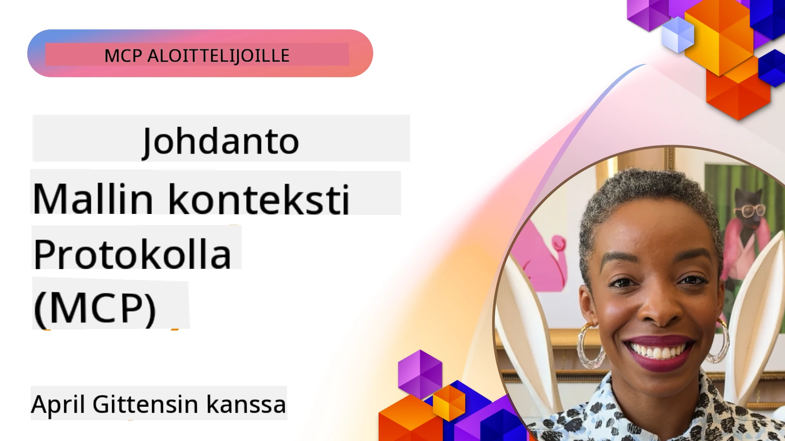
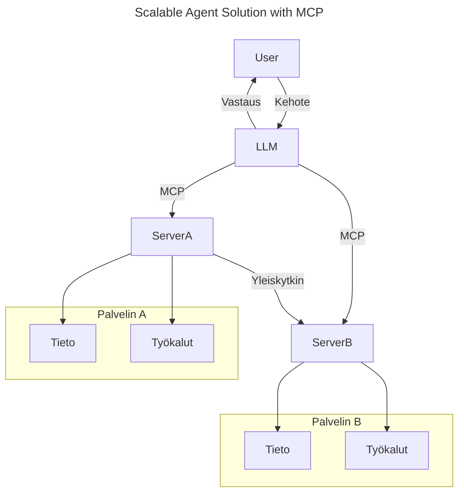
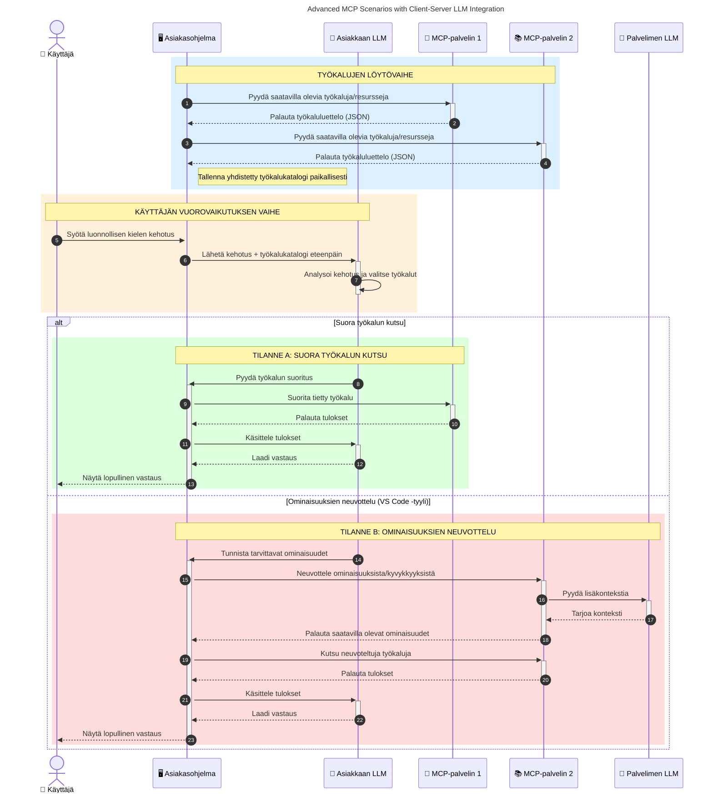

# Johdanto Model Context Protocoliin (MCP): Miksi se on tärkeä skaalautuville tekoälysovelluksille

[](https://youtu.be/agBbdiOPLQA)

_(Klikkaa yllä olevaa kuvaa nähdäksesi videon tästä oppitunnista)_

Generatiiviset tekoälysovellukset ovat iso askel eteenpäin, sillä ne usein antavat käyttäjän olla vuorovaikutuksessa sovelluksen kanssa luonnollisen kielen kehotteilla. Kuitenkin, kun sovelluksiin investoidaan yhä enemmän aikaa ja resursseja, haluat varmistaa, että toiminnallisuudet ja resurssit on helppo integroida siten, että sovellus on laajennettavissa, se voi palvella useita malleja samanaikaisesti ja käsitellä eri mallien yksityiskohtia. Lyhyesti sanottuna generatiivisten AI-sovellusten rakentaminen on helppoa aluksi, mutta niiden kasvaessa ja monimutkaistuessa sinun täytyy alkaa määrittää arkkitehtuuria ja todennäköisesti tukeutua standardiin, jotta sovellukset rakennetaan johdonmukaisella tavalla. Tässä MCP tulee mukaan järjestämään asioita ja tarjoamaan standardin.

---

## **🔍 Mikä on Model Context Protocol (MCP)?**

**Model Context Protocol (MCP)** on **avoin, standardoitu rajapinta**, joka mahdollistaa suurten kielimallien (LLM) saumattoman vuorovaikutuksen ulkoisten työkalujen, APIen ja tietolähteiden kanssa. Se tarjoaa yhtenäisen arkkitehtuurin, joka parantaa tekoälymallien toiminnallisuutta niiden harjoitteludatan ulkopuolella, mahdollistaen älykkäämmät, skaalautuvammat ja reagoivammat tekoälyjärjestelmät.

---

## **🎯 Miksi standardisointi tekoälyssä on tärkeää**

Kun generatiiviset tekoälysovellukset muuttuvat monimutkaisemmiksi, on olennaista ottaa käyttöön standardeja, jotka varmistavat **skaalautuvuuden, laajennettavuuden, ylläpidettävyyden** ja **toimittajalukon välttämisen**. MCP vastaa näihin tarpeisiin seuraavasti:

- Yhdistelemällä mallien ja työkalujen integraatiot
- Vähentämällä hauraita, yksittäisiä räätälöityjä ratkaisuja
- Sallimalla useiden eri toimittajien mallien yhteiselo yhden ekosysteemin sisällä

**Huom:** Vaikka MCP mainostaa itseään avoimena standardina, ei ole suunnitelmia standardisoida MCP:tä olemassa olevien standardointielinten, kuten IEEE, IETF, W3C, ISO tai muiden, kautta.

---

## **📚 Oppimistavoitteet**

Tämän artikkelin lopussa pystyt:

- Määrittelemään **Model Context Protocolin (MCP)** ja sen käyttötapaukset
- Ymmärtämään, miten MCP standardisoi mallin ja työkalun välisen viestinnän
- Tunnistamaan MCP-arkkitehtuurin keskeiset osat
- Tutkimaan MCP:n käytännön sovelluksia yritys- ja kehitysympäristöissä

---

## **💡 Miksi Model Context Protocol (MCP) on mullistava**

### **🔗 MCP ratkaisee tekoälyn vuorovaikutuksen pirstaleisuuden**

Ennen MCP:tä mallien ja työkalujen integrointi vaati:

- Räätälöityä koodia jokaista työkalu-malli -paria varten
- Ei-standardisoituja API:eita jokaiselta toimittajalta
- Usein katkoksia päivitysten vuoksi
- Huonoa skaalautuvuutta työkalujen lisääntyessä

### **✅ MCP-standardoinnin hyödyt**

| **Hyöty**               | **Kuvaus**                                                                    |
|-------------------------|-------------------------------------------------------------------------------|
| Yhteensopivuus          | LLM:t toimivat saumattomasti eri toimittajien työkalujen kanssa               |
| Johdonmukaisuus         | Tasainen käyttäytyminen eri alustoilla ja työkaluissa                         |
| Uudelleenkäytettävyys   | Kerran rakennetut työkalut voidaan käyttää eri projekteissa ja järjestelmissä |
| Kehityksen nopeutuminen | Kehitysaikaa säästyy, kun käytetään standardoituja, plug-and-play-rajapintoja  |

---

## **🧱 Yleiskatsaus MCP-arkkitehtuuriin**

MCP perustuu **asiakas-palvelin -malliin**, jossa:

- **MCP-hostit** pyörittävät tekoälymalleja
- **MCP-asiakkaat** aloittavat pyynnöt
- **MCP-palvelimet** tarjoavat kontekstin, työkalut ja toiminnot

### **Keskeiset komponentit:**

- **Resurssit** – Staattista tai dynaamista dataa malleille  
- **Kehotteet** – Ennalta määritetyt työprosessit ohjattuun generointiin  
- **Työkalut** – Suoritettavia toimintoja, kuten haku, laskelmat  
- **Otokset** – Agenttipohjainen käyttäytyminen rekursiivisilla vuorovaikutuksilla (poistettu käytöstä
    MCP:ssä `2026-07-28`; uusien toteutusten tulisi integroida suoraan LLM-toimittajan kanssa)

- **Pyynnöt** – Palvelimen aloittamat käyttäjäsyötteen pyynnöt
- **Juuret** – Palvelimelle relevantit informatiiviset tiedostojärjestelmän sijainnit
    (poistettu MCP:ssä `2026-07-28`; suositellaan työkalun parametreja, resurssien URI-osoitteita tai
    palvelimen konfiguraatiota)

### **Protokollan arkkitehtuuri:**

MCP käyttää kaksikerroksista arkkitehtuuria:
- **Datalayer**: JSON-RPC 2.0 -viestit, pyyntökohtaiset metatiedot, haku ja
    protokollan peruselementit
- **Siirtokerros**: stdio paikallisille aliprosesseille ja Streamable HTTP etäpalvelimille.
    Streamable HTTP voi käyttää SSE-kapselointia striimattuihin vastauksiin,
    mutta vanhempi HTTP+SSE-siirto on poistettu käytöstä.

---

## Kuinka MCP-palvelimet toimivat

MCP-palvelimet toimivat seuraavalla tavalla:

- **Pyyntöjen kulku**:
    1. Pyyntö aloitetaan loppukäyttäjän tai hänen puolestaan toimivan ohjelmiston toimesta.
    2. **MCP-asiakas** lähettää pyynnön **MCP-hostille**, joka hallinnoi tekoälymallin ajoa.
    3. **Tekoälymalli** vastaanottaa käyttäjän kehotteen ja voi pyytää pääsyä ulkoisiin työkaluihin tai datoihin yhden tai useamman työkalukutsun kautta.
    4. **MCP-host** ei kommunikaatiota suoraan mallin kanssa, vaan käyttää standardoitua protokollaa sopivien **MCP-palvelimien** kanssa.
- **MCP-hostin toiminnot**:
    - **Työkalurekisteri**: ylläpitää katalogia käytettävissä olevista työkaluista ja niiden ominaisuuksista.
    - **Autentikointi**: varmistaa lupa työkalujen käyttöön.
    - **Pyyntöjen käsittelijä**: käsittelee mallilta tulevia työkalupyynnöitä.
    - **Vastauksen muotoilija**: jäsentää työkalujen tulokset mallin ymmärtämään muotoon.
- **MCP-palvelimen suoritus**:
    - **MCP-host** ohjaa työkalukutsut yhdelle tai useammalle **MCP-palvelimelle**, jotka tarjoavat erikoistuneita toimintoja (esim. haku, laskelmat, tietokantakyselyt).
    - **MCP-palvelimet** suorittavat tehtävänsä ja palauttavat tulokset **MCP-hostille** yhtenäisessä muodossa.
    - **MCP-host** muotoilee ja välittää tulokset takaisin **tekoälymallille**.
- **Vastauksen täydentäminen**:
    - **Tekoälymalli** lisää työkalujen tulokset lopulliseen vastaukseen.
    - **MCP-host** lähettää vastauksen takaisin **MCP-asiakkaalle**, joka toimittaa sen loppukäyttäjälle tai kutsuvalle ohjelmistolle.
    

```mermaid
---
title: MCP Architecture and Component Interactions
description: A diagram showing the flows of the components in MCP.
---
graph TD
    Client[MCP-asiakasohjelma/Sovellus] -->|Lähettää pyynnön| H[MCP-isäntä]
    H -->|Kutsuu| A[Tekoälymalli]
    A -->|Työkalupyyntö| H
    H -->|MCP Protocol| T1[MCP Server Tool 01: Verkkohaku
    H -->|MCP Protocol| T2[MCP Server Tool 02: Laskin
    H -->|MCP Protocol| T3[MCP Server Tool 03: Tietokantatyökalu
    H -->|MCP Protocol| T4[MCP Server Tool 04: Tiedostojärjestelmätyökalu
    H -->|Lähettää vastauksen| Client

    subgraph "MCP-isännän komponentit"
        H
        G[Työkalujen rekisteri]
        I[Todentaminen]
        J[Pyyntöjen käsittelijä]
        K[Vastauksen muotoilija]
    end

    H <--> G
    H <--> I
    H <--> J
    H <--> K

    style A fill:#f9d5e5,stroke:#333,stroke-width:2px
    style H fill:#eeeeee,stroke:#333,stroke-width:2px
    style Client fill:#d5e8f9,stroke:#333,stroke-width:2px
    style G fill:#fffbe6,stroke:#333,stroke-width:1px
    style I fill:#fffbe6,stroke:#333,stroke-width:1px
    style J fill:#fffbe6,stroke:#333,stroke-width:1px
    style K fill:#fffbe6,stroke:#333,stroke-width:1px
    style T1 fill:#c2f0c2,stroke:#333,stroke-width:1px
    style T2 fill:#c2f0c2,stroke:#333,stroke-width:1px
    style T3 fill:#c2f0c2,stroke:#333,stroke-width:1px
    style T4 fill:#c2f0c2,stroke:#333,stroke-width:1px
```

## 👨‍💻 Kuinka rakentaa MCP-palvelin (esimerkkejä)

MCP-palvelimet mahdollistavat LLM-kyvykkyyksien laajentamisen tarjoamalla dataa ja toiminnallisuutta.

Valmiina kokeilemaan? Tässä ovat kielen ja/tai teknologian mukaiset SDK:t, joissa on esimerkkejä yksinkertaisten MCP-palvelimien luomisesta eri kielillä/stackeilla:

- **Python SDK**: https://github.com/modelcontextprotocol/python-sdk

- **TypeScript SDK**: https://github.com/modelcontextprotocol/typescript-sdk

- **Java SDK**: https://github.com/modelcontextprotocol/java-sdk

- **C#/.NET SDK**: https://github.com/modelcontextprotocol/csharp-sdk


## 🌍 MCP:n todelliset käyttötapaukset

MCP mahdollistaa laajan valikoiman sovelluksia laajentamalla tekoälyn kyvykkyyksiä:

| **Sovellus**                 | **Kuvaus**                                                                  |
|----------------------------|-----------------------------------------------------------------------------|
| Yritysdatan integraatio   | Yhdistä LLM:t tietokantoihin, CRM-järjestelmiin tai sisäisiin työkaluihin   |
| Agenttipohjaiset AI-järjestelmät | Mahdollista autonomiset agentit työkalujen käytöllä ja päätöksentekoprosesseilla |
| Monimodaaliset sovellukset | Yhdistä teksti-, kuva- ja ääni työkalut yhdeksi yhtenäiseksi tekoälysovellukseksi |
| Reaaliaikainen dataintegraatio | Tuo live-dataa AI-vuorovaikutuksiin tarkempien ja ajantasaisempien tulosten saamiseksi |


### 🧠 MCP = Yleinen standardi tekoälyn vuorovaikutuksille

Model Context Protocol (MCP) toimii yleisenä standardina tekoälyn vuorovaikutuksille, aivan kuten USB-C standardisoi laitteiden fyysisen liitännän. Tekoälyn maailmassa MCP tarjoaa yhtenäisen rajapinnan, jonka avulla mallit (asiakkaat) voivat integroitua saumattomasti ulkoisten työkalujen ja tietojen tarjoajien (palvelimien) kanssa. Tämä poistaa tarpeen erilaisille räätälöidyille protokollille jokaiselle API:lle tai tietolähteelle.

MCP:n mukainen työkalu (jota kutsutaan MCP-palvelimeksi) noudattaa yhtenäistä standardia. Nämä palvelimet voivat listata tarjoamansa työkalut tai toiminnot ja suorittaa ne, kun tekoälyagentti pyytää. MCP:tä tukevat tekoälyagenttialustat voivat havaita palvelinten työkalut ja kutsua niitä tämän standardoidun protokollan avulla.

### 💡 Helpottaa tiedon saatavuutta

Työkalujen tarjoamisen lisäksi MCP helpottaa tiedon saatavuutta. Se mahdollistaa sovelluksille kontekstin tarjoamisen suurille kielimalleille (LLM) linkittämällä nämä erilaisiin tietolähteisiin. Esimerkiksi MCP-palvelin voisi edustaa yrityksen dokumenttivarastoa, jolloin agentit voivat hakea sopivaa tietoa tarpeen mukaan. Toinen palvelin voisi käsitellä tiettyjä toimintoja kuten sähköpostien lähettämistä tai tietueiden päivittämistä. Agentin näkökulmasta nämä ovat yksinkertaisesti työkaluja, joita se voi käyttää—jotkut työkalut palauttavat dataa (tietoisuuskontekstia) ja toiset suorittavat toimintoja. MCP hoitaa molemmat tehokkaasti.

Agentti, joka yhdistyy MCP-palvelimeen, oppii automaattisesti palvelimen käytettävissä olevat kyvykkyydet ja tiedot standardimuodon kautta. Tämä standardointi mahdollistaa työkalujen dynaamisen saatavuuden. Esimerkiksi uuden MCP-palvelimen lisääminen agentin järjestelmään tekee sen toiminnot heti käyttökelpoisiksi ilman agentin ohjeiden lisämuokkauksia.

Tämä virtaviivainen integraatio vastaa seuraavassa kaaviossa kuvattua tilannetta, jossa palvelimet tarjoavat sekä työkalut että tiedon varmistaen järjestelmien sujuvan yhteistyön.

### 👉 Esimerkki: Skaalautuva agenttiratkaisu


Universal Connector mahdollistaa MCP-palvelinten viestinnän ja kyvykkyyksien jakamisen keskenään, jolloin ServerA voi delegoida tehtäviä ServerB:lle tai käyttää sen työkaluja ja tietoja. Tämä yhdistää työkalut ja datan useiden palvelinten kesken, tukeen skaalautuvia ja modulaarisia agenttiarkkitehtuureja. Koska MCP standardisoi työkalujen esittämisen, agentit voivat dynaamisesti löytää ja ohjata pyyntöjä palvelinten välillä ilman kovakoodattuja integraatioita.


Työkalujen ja tiedon yhdistäminen: Työkalut ja data ovat käytettävissä useiden palvelimien yli, mahdollistaen skaalautuvammat ja modulaarisemmat agenttijärjestelmät.

### 🔄 Edistyneet MCP-skenaariot asiakaspuolen LLM-integraatiolla

Perus MCP-arkkitehtuurin lisäksi on olemassa kehittyneempiä tilanteita, joissa sekä asiakas että palvelin sisältävät LLM:iä mahdollistaen monimutkaisemmat vuorovaikutukset. Seuraavassa kaaviossa **Client App** voisi olla IDE, jossa on käytettävissä useita MCP-työkaluja LLM:n käyttöön:



## 🔐 MCP:n käytännön edut

Tässä MCP:n käytännön edut:

- **Ajantasaisuus**: Mallit voivat käyttää ajankohtaista tietoa harjoitteludatansa ulkopuolelta
- **Kyvykkyyksien laajennus**: Mallit voivat hyödyntää erikoistuneita työkaluja tehtäviin, joihin ne eivät ole koulutettuja
- **Hallitut harhat**: Ulkoiset tietolähteet tarjoavat faktapohjan
- **Yksityisyys**: Herkät tiedot voivat pysyä suojatuissa ympäristöissä sijaan, että ne upotettaisiin kehotteisiin

## 📌 Keskeiset opit

Seuraavat ovat keskeisiä oppeja MCP:n käytöstä:

- **MCP** standardisoi sen, miten tekoälymallit ovat vuorovaikutuksessa työkalujen ja datan kanssa
- Edistää **laajennettavuutta, johdonmukaisuutta ja yhteensopivuutta**
- MCP auttaa **vähentämään kehitysaikaa, parantamaan luotettavuutta ja laajentamaan mallien kyvykkyyksiä**
- Asiakas-palvelin-arkkitehtuuri **mahdollistaa joustavat, laajennettavat tekoälysovellukset**

## 🧠 Harjoitus

Mieti tekoälysovellusta, jonka haluaisit rakentaa.

- Mitkä **ulkoiset työkalut tai data** voisivat laajentaa sen kyvykkyyksiä?
- Kuinka MCP voisi tehdä integraatiosta **yksinkertaisempaa ja luotettavampaa?**

## Lisäresurssit

- [MCP GitHub -varasto](https://github.com/modelcontextprotocol)


## Mitä seuraavaksi

Seuraava: [Luku 1: Keskeiset käsitteet](../01-CoreConcepts/README.md)

---

<!-- CO-OP TRANSLATOR DISCLAIMER START -->
**Vastuuvapauslauseke**:
Tämä asiakirja on käännetty käyttämällä tekoälypohjaista käännöspalvelua [Co-op Translator](https://github.com/Azure/co-op-translator). Vaikka pyrimme tarkkuuteen, otathan huomioon, että automaattiset käännökset saattavat sisältää virheitä tai epätarkkuuksia. Alkuperäinen asiakirja sen alkuperäiskielellä on virallinen lähde. Tärkeissä asioissa suositellaan ammattimaista ihmiskäännöstä. Emme ole vastuussa tämän käännöksen käytöstä aiheutuvista väärinymmärryksistä tai tulkinnoista.
<!-- CO-OP TRANSLATOR DISCLAIMER END -->