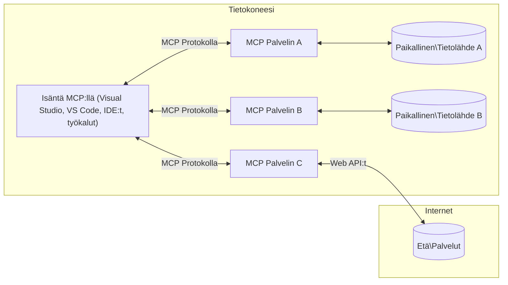

# MCP Core Concepts: Mallikontekstiprotokollan hallinta tekoälyn integrointia varten

[](https://youtu.be/earDzWGtE84)

_(Napsauta yllä olevaa kuvaa katsoaksesi tämän oppitunnin videon)_

[Model Context Protocol (MCP)](https://github.com/modelcontextprotocol) on tehokas, standardoitu kehys, joka optimoi viestinnän suurten kielimallien (LLM) ja ulkoisten työkalujen, sovellusten sekä tietolähteiden välillä.  
Tämä opas johdattaa sinut MCP:n keskeisiin käsitteisiin. Opit sen asiakas-palvelinarkkitehtuurista, olennaisista komponenteista, viestintämekaniikoista ja toteutuksen parhaista käytännöistä.

- **Selkeä käyttäjän suostumus**: Kaikkiin tietojen käyttöön ja toimiin vaaditaan käyttäjän nimenomainen hyväksyntä ennen suorittamista. Käyttäjien on ymmärrettävä selkeästi, mitä tietoja käytetään ja mitä toimia tehdään, ja heillä on tarkka hallinta oikeuksista ja valtuutuksista.

- **Tietosuojan suojaaminen**: Käyttäjätiedot paljastetaan vain nimenomaisella suostumuksella, ja niitä on suojattava vahvoilla käyttöoikeuksilla koko vuorovaikutuksen ajan. Toteutusten on estettävä luvaton tiedonsiirto ja ylläpidettävä tiukkoja yksityisyysrajoja.

- **Työkalujen suoritusvarmuus**: Jokainen työkalun kutsu vaatii käyttäjän nimenomaisen suostumuksen, jossa työkalun toiminnallisuus, parametrit ja mahdolliset vaikutukset on selkeästi ymmärretty. Vahvat turvallisuusrajat estävät tahattoman, vaarallisen tai haitallisen työkalun käytön.

- **Kuljetuskerroksen turvallisuus**: Kaikkien viestintäkanavien tulee käyttää asianmukaista salausta ja todennusmekanismeja. Etäyhteyksissä on käytettävä turvallisia kuljetusprotokollia ja asianmukaista tunnistetietojen hallintaa.

#### Toteutusohjeet:

- **Oikeuksien hallinta**: Toteuta hienojakoiset oikeusjärjestelmät, jotka antavat käyttäjille hallinnan siitä, mitkä palvelimet, työkalut ja resurssit ovat käytettävissä  
- **Todennus ja valtuutus**: Käytä turvallisia todennusmenetelmiä (OAuth, API-avaimet) asianmukaisella tokenien hallinnalla ja vanhenemisella  
- **Syötteen validointi**: Vahvista kaikki parametrit ja syötteet määriteltyjen skeemojen mukaisesti estääksesi injektiohyökkäykset  
- **Auditointilokit**: Pidä kattavat lokit kaikista toiminnoista turvallisuuden valvontaa ja vaatimustenmukaisuutta varten

## Yleiskatsaus

Tässä oppitunnissa tutustutaan Model Context Protocolin (MCP) perusarkkitehtuuriin ja komponentteihin. Opit asiakas-palvelinarkkitehtuurista, keskeisistä komponenteista ja viestintämekanismeista, jotka mahdollistavat MCP-vuorovaikutukset.

## Keskeiset oppimistavoitteet

Oppitunnin lopussa osaat:

- Ymmärtää MCP:n asiakas-palvelinarkkitehtuurin.  
- Tunnistaa Hostien, Clientien ja Serverien roolit ja vastuut.  
- Analysoida MCP:n joustavan integraatiokerroksen keskeiset ominaisuudet.  
- Oppia, miten tieto virtaa MCP-ekosysteemissä.  
- Saada käytännön näkemyksiä .NET-, Java-, Python- ja JavaScript-koodiesimerkkien kautta.

## MCP-arkkitehtuuri: Syvällisempi katsaus

MCP-ekosysteemi perustuu asiakas-palvelinmalliin. Tämä modulaarinen rakenne mahdollistaa tekoälysovellusten tehokkaan vuorovaikutuksen työkalujen, tietokantojen, API:en ja kontekstuaalisten resurssien kanssa. Puretaan tämä arkkitehtuuri sen keskeisiin osiin.

MCP noudattaa asiakas-palvelinarkkitehtuuria, jossa isäntäohjelma voi muodostaa yhteyden useisiin palvelimiin:


- **MCP Hosts**: Ohjelmat kuten VSCode, Claude Desktop, IDE:t tai tekoälytyökalut, jotka haluavat käyttää tietoja MCP:n kautta  
- **MCP Clients**: Protokollan asiakkaat, jotka ylläpitävät 1:1-yhteyksiä palvelimiin  
- **MCP Servers**: Kevyet ohjelmat, jotka tarjoavat tiettyjä toiminnallisuuksia standardoidun Model Context Protocolin kautta  
- **Paikalliset tietolähteet**: Tietokoneesi tiedostot, tietokannat ja palvelut, joihin MCP-palvelimet voivat turvallisesti päästä käsiksi  
- **Etäpalvelut**: Internetin kautta saatavilla olevat ulkoiset järjestelmät, joihin MCP-palvelimet voivat yhdistää API:en kautta.

MCP-protokolla on kehittyvä standardi, joka käyttää päivämääräpohjaista versiointia (YYYY-MM-DD-muodossa). Nykyinen protokollaversio on **2025-11-25**. Voit nähdä viimeisimmät päivitykset [protokollan määrittelyyn](https://modelcontextprotocol.io/specification/2025-11-25/).

### 1. Hostit

Model Context Protocolissa (MCP) **Hostit** ovat tekoälysovelluksia, jotka toimivat ensisijaisena käyttöliittymänä, jonka kautta käyttäjät ovat vuorovaikutuksessa protokollan kanssa. Hostit koordinoivat ja hallinnoivat yhteyksiä useisiin MCP-palvelimiin luomalla kullekin palvelinyhteydelle omistetun MCP-asiakkaan. Esimerkkejä Hostista ovat:

- **Tekoälysovellukset**: Claude Desktop, Visual Studio Code, Claude Code  
- **Kehitysympäristöt**: IDE:t ja koodieditorit, joissa on MCP-integraatio  
- **Mukautetut sovellukset**: Tarkoitukseen rakennetut tekoälyagentit ja työkalut

**Hostit** ovat sovelluksia, jotka koordinoivat tekoälymallien vuorovaikutuksia. Ne:

- **Orkestroivat tekoälymalleja**: Suorittavat tai ovat vuorovaikutuksessa LLM:ien kanssa vastauksien tuottamiseksi ja AI-työnkulkujen koordinoinniksi  
- **Hallinnoivat asiakasyhteyksiä**: Luovat ja ylläpitävät yhtä MCP-asiakasta kutakin MCP-palvelinyhteyttä kohden  
- **Ohjaavat käyttöliittymää**: Käsittelevät keskustelun kulkua, käyttäjän vuorovaikutuksia ja vastausten esittämistä  
- **Valvovat turvallisuutta**: Hallitsevat käyttöoikeuksia, turvallisuusrajoituksia ja todennusta  
- **Käsittelevät käyttäjän suostumusta**: Hallinnoivat käyttäjän hyväksyntää tietojen jakamiseen ja työkalujen suorittamiseen

### 2. Clientit

**Clientit** ovat olennaisia komponentteja, jotka ylläpitävät omistettuja yksi-yhteen-yhteyksiä Hostien ja MCP-palvelimien välillä. Kukin MCP-asiakas luodaan Hostin toimesta yhdistämään tiettyyn MCP-palvelimeen, mikä varmistaa järjestelmälliset ja turvalliset viestintäkanavat. Useat clientit mahdollistavat Hostien yhdistämisen useisiin palvelimiin samanaikaisesti.

**Clientit** ovat liitäntäkomponentteja isäntäohjelmassa. Ne:

- **Protokollaviestintä**: Lähettävät JSON-RPC 2.0 -pyyntöjä palvelimille kehotteiden ja ohjeiden kanssa  
- **Ominaisuuksien neuvottelu**: Neuvottelevat tuetuista ominaisuuksista ja protokollaversioista palvelimien kanssa alustuksen aikana  
- **Työkalujen suoritus**: Hallinnoivat mallien työkalukutsuja ja käsittelevät vastauksia  
- **Reaaliaikaiset päivitykset**: Käsittelevät ilmoituksia ja reaaliaikaisia päivityksiä palvelimilta  
- **Vastausten käsittely**: Käsittelevät ja muotoilevat palvelimen vastaukset käyttäjille näytettäväksi

### 3. Serverit

**Serverit** ovat ohjelmia, jotka tarjoavat kontekstia, työkaluja ja toiminnallisuuksia MCP-asiakkaille. Ne voivat toimia paikallisesti (samalla koneella kuin Host) tai etänä (ulkoisilla alustoilla) ja vastaavat asiakaspyyntöjen käsittelystä ja jäsenneltyjen vastausten tarjoamisesta. Serverit tarjoavat tiettyjä toimintoja standardoidun Model Context Protocolin kautta.

**Serverit** ovat palveluita, jotka tarjoavat kontekstia ja toiminnallisuuksia. Ne:

- **Ominaisuuksien rekisteröinti**: Rekisteröivät ja tarjoavat käytettävissä olevat primitiivit (resurssit, kehotteet, työkalut) asiakkaille  
- **Pyyntöjen käsittely**: Ottavat vastaan ja suorittavat työkalukutsuja, resurssipyyntöjä ja kehotepyyntöjä asiakkailta  
- **Kontekstin tarjoaminen**: Tarjoavat kontekstuaalista tietoa ja dataa mallivastausten rikastamiseksi  
- **Tilanhallinta**: Ylläpitävät istuntotilaa ja käsittelevät tilallisia vuorovaikutuksia tarvittaessa  
- **Reaaliaikaiset ilmoitukset**: Lähettävät ilmoituksia ominaisuuksien muutoksista ja päivityksistä yhdistetyille asiakkaille

Serverit voivat olla kenen tahansa kehittämiä laajentamaan mallien toiminnallisuuksia erikoistuneilla ominaisuuksilla, ja ne tukevat sekä paikallista että etäkäyttöönottoa.

### 4. Serverin primitiivit

Model Context Protocolin (MCP) serverit tarjoavat kolme keskeistä **primitiiviä**, jotka määrittelevät perustavanlaatuiset rakennuspalikat rikkaaseen vuorovaikutukseen asiakkaiden, hostien ja kielimallien välillä. Nämä primitiivit määrittelevät, millaista kontekstuaalista tietoa ja toimintoja protokollan kautta on saatavilla.

MCP-serverit voivat tarjota mitä tahansa seuraavista kolmesta keskeisestä primitiivistä:

#### Resurssit

**Resurssit** ovat tietolähteitä, jotka tarjoavat kontekstuaalista tietoa tekoälysovelluksille. Ne edustavat staattista tai dynaamista sisältöä, joka voi parantaa mallin ymmärrystä ja päätöksentekoa:

- **Kontekstuaalinen data**: Jäsenneltyä tietoa ja kontekstia tekoälymallin käyttöön  
- **Tietopohjat**: Asiakirjavarastot, artikkelit, käsikirjat ja tutkimuspaperit  
- **Paikalliset tietolähteet**: Tiedostot, tietokannat ja paikallisen järjestelmän tiedot  
- **Ulkoiset tiedot**: API-vastaukset, verkkopalvelut ja etäjärjestelmien tiedot  
- **Dynaaminen sisältö**: Reaaliaikainen data, joka päivittyy ulkoisten olosuhteiden mukaan

Resurssit tunnistetaan URI:illa ja ne tukevat löytymistä `resources/list`-menetelmällä ja hakua `resources/read`-menetelmällä:

```text
file://documents/project-spec.md
database://production/users/schema
api://weather/current
```

#### Kehotteet

**Kehotteet** ovat uudelleenkäytettäviä malleja, jotka auttavat jäsentämään vuorovaikutuksia kielimallien kanssa. Ne tarjoavat standardoituja vuorovaikutusmalleja ja mallipohjaisia työnkulkuja:

- **Mallipohjaiset vuorovaikutukset**: Ennalta rakennetut viestit ja keskustelun aloitukset  
- **Työnkulun mallit**: Standardoidut sarjat yleisiin tehtäviin ja vuorovaikutuksiin  
- **Few-shot-esimerkit**: Esimerkkipohjaiset mallit mallin ohjaukseen  
- **Järjestelmäkehoteet**: Perustavat kehotteet, jotka määrittelevät mallin käyttäytymisen ja kontekstin  
- **Dynaamiset mallit**: Parametrisoidut kehotteet, jotka mukautuvat tiettyihin konteksteihin

Kehotteet tukevat muuttujien korvaamista ja ne löytyvät `prompts/list`-menetelmällä ja haetaan `prompts/get`-menetelmällä:

```markdown
Generate a {{task_type}} for {{product}} targeting {{audience}} with the following requirements: {{requirements}}
```

#### Työkalut

**Työkalut** ovat suoritettavia toimintoja, joita tekoälymallit voivat kutsua suorittaakseen tiettyjä toimia. Ne edustavat MCP-ekosysteemin "verbejä", jotka mahdollistavat mallien vuorovaikutuksen ulkoisten järjestelmien kanssa:

- **Suoritettavat funktiot**: Erilliset toiminnot, joita mallit voivat kutsua tietyillä parametreilla  
- **Ulkoisten järjestelmien integraatio**: API-kutsut, tietokantakyselyt, tiedostotoiminnot, laskelmat  
- **Ainutlaatuinen identiteetti**: Jokaisella työkalulla on oma nimi, kuvaus ja parametrien skeema  
- **Jäsennelty I/O**: Työkalut hyväksyvät validoidut parametrit ja palauttavat jäsenneltyjä, tyypitettyjä vastauksia  
- **Toimintakyvyt**: Mahdollistavat mallien suorittaa todellisia toimia ja hakea reaaliaikaista dataa

Työkalut määritellään JSON-skeemalla parametrien validointiin ja ne löytyvät `tools/list`-menetelmällä ja suoritetaan `tools/call`-menetelmällä:

```typescript
server.tool(
  "search_products", 
  {
    query: z.string().describe("Search query for products"),
    category: z.string().optional().describe("Product category filter"),
    max_results: z.number().default(10).describe("Maximum results to return")
  }, 
  async (params) => {
    // Suorita haku ja palauta jäsennellyt tulokset
    return await productService.search(params);
  }
);
```

## Asiakasprimitiivit

Model Context Protocolissa (MCP) **clientit** voivat tarjota primitiivejä, jotka mahdollistavat palvelimien pyytää lisätoimintoja isäntäohjelmalta. Nämä asiakaspuolen primitiivit mahdollistavat rikkaammat, interaktiivisemmat palvelinratkaisut, jotka voivat käyttää tekoälymallin toimintoja ja käyttäjän vuorovaikutuksia.

### Näytteenotto

**Näytteenotto** antaa palvelimille mahdollisuuden pyytää kielimallin täydennyksiä asiakkaan tekoälysovellukselta. Tämä primitiivi mahdollistaa palvelimien käyttää LLM-toimintoja ilman, että niiden tarvitsee upottaa omia malliriippuvuuksiaan:

- **Mallista riippumaton pääsy**: Palvelimet voivat pyytää täydennyksiä ilman LLM-SDK:iden sisällyttämistä tai mallin hallintaa  
- **Palvelimen aloittama tekoäly**: Mahdollistaa palvelimien autonomisen sisällön generoinnin asiakkaan mallin avulla  
- **Rekursiiviset LLM-vuorovaikutukset**: Tukee monimutkaisia tilanteita, joissa palvelimet tarvitsevat tekoälyapua käsittelyssä  
- **Dynaaminen sisällön generointi**: Sallii palvelimien luoda kontekstuaalisia vastauksia isännän mallin avulla

Näytteenotto käynnistetään `sampling/complete`-menetelmällä, jossa palvelimet lähettävät täydennyspyyntöjä asiakkaille.

### Tiedonkeruu

**Tiedonkeruu** antaa palvelimille mahdollisuuden pyytää lisätietoja tai vahvistusta käyttäjiltä asiakkaan käyttöliittymän kautta:

- **Käyttäjän syötteen pyynnöt**: Palvelimet voivat pyytää lisätietoja tarvittaessa työkalun suorittamiseen  
- **Vahvistusikkunat**: Pyytää käyttäjän hyväksyntää arkaluontoisiin tai merkittäviin toimiin  
- **Interaktiiviset työnkulut**: Mahdollistaa palvelimien luoda vaiheittaisia käyttäjän vuorovaikutuksia  
- **Dynaaminen parametrien keruu**: Kerää puuttuvia tai valinnaisia parametreja työkalun suorituksen aikana

Tiedonkeruupyynnöt tehdään `elicitation/request`-menetelmällä käyttäjän syötteen keräämiseksi asiakkaan käyttöliittymän kautta.

### Lokitus

**Lokitus** antaa palvelimille mahdollisuuden lähettää jäsenneltyjä lokiviestejä asiakkaille virheenkorjaukseen, valvontaan ja toiminnan näkyvyyteen:

- **Virheenkorjauksen tuki**: Mahdollistaa palvelimien tarjota yksityiskohtaisia suorituksen lokitietoja vianmääritykseen  
- **Toiminnan valvonta**: Lähettää tilapäivityksiä ja suorituskykymittareita asiakkaille  
- **Virheraportointi**: Tarjoaa yksityiskohtaista virhetilanteen kontekstia ja diagnostiikkatietoja  
- **Auditointijäljet**: Luo kattavat lokit palvelimen toiminnoista ja päätöksistä

Lokitusviestit lähetetään asiakkaille tarjoamaan läpinäkyvyyttä palvelimen toimintaan ja helpottamaan virheenkorjausta.

## Tiedon virtaus MCP:ssä

Model Context Protocol (MCP) määrittelee jäsennellyn tiedon virtauksen hostien, clientien, serverien ja mallien välillä. Tämän virtauksen ymmärtäminen auttaa selventämään, miten käyttäjän pyynnöt käsitellään ja miten ulkoiset työkalut ja tiedot integroidaan mallivastauksiin.

- **Host aloittaa yhteyden**  
  Host-sovellus (kuten IDE tai chat-käyttöliittymä) muodostaa yhteyden MCP-palvelimeen, tyypillisesti STDIO:n, WebSocketin tai muun tuetun kuljetuksen kautta.

- **Ominaisuuksien neuvottelu**  
  Asiakas (hostin sisällä) ja palvelin vaihtavat tietoa tuetuista ominaisuuksista, työkaluista, resursseista ja protokollaversioista. Tämä varmistaa, että molemmat osapuolet ymmärtävät, mitä toimintoja istunnossa on käytettävissä.

- **Käyttäjän pyyntö**  
  Käyttäjä on vuorovaikutuksessa hostin kanssa (esim. syöttää kehotteen tai komennon). Host kerää tämän syötteen ja välittää sen asiakkaalle käsittelyä varten.

- **Resurssin tai työkalun käyttö**  
  - Asiakas voi pyytää lisäkontekstia tai resursseja palvelimelta (kuten tiedostoja, tietokanta-merkintöjä tai tietopohjan artikkeleita) mallin ymmärryksen rikastamiseksi.  
  - Jos malli päättää, että työkalu on tarpeen (esim. datan hakemiseen, laskelman suorittamiseen tai API-kutsuun), asiakas lähettää työkalukutsupyynnön palvelimelle, jossa määritellään työkalun nimi ja parametrit.

- **Palvelimen suoritus**  
  Palvelin vastaanottaa resurssi- tai työkalupyynnön, suorittaa tarvittavat toiminnot (kuten funktion ajon, tietokantakyselyn tai tiedoston haun) ja palauttaa tulokset asiakkaalle jäsennellyssä muodossa.

- **Vastauksen generointi**  
  Asiakas yhdistää palvelimen vastaukset (resurssidatan, työkalun tulokset jne.) käynnissä olevaan mallivaihtoon. Malli käyttää tätä tietoa tuottaakseen kattavan ja kontekstuaalisesti relevantin vastauksen.

- **Tuloksen esittäminen**  
  Host vastaanottaa lopullisen tuloksen asiakkaalta ja esittää sen käyttäjälle, usein sisältäen sekä mallin generoiman tekstin että työkalujen suoritusten tai resurssihakujen tulokset.

Tämä virtauksen malli mahdollistaa MCP:n tukemaan kehittyneitä, interaktiivisia ja kontekstuaalisesti tietoisia tekoälysovelluksia yhdistämällä mallit saumattomasti ulkoisiin työkaluihin ja tietolähteisiin.

## Protokollan arkkitehtuuri ja kerrokset

MCP koostuu kahdesta erillisestä arkkitehtonisesta kerroksesta, jotka toimivat yhdessä tarjotakseen täydellisen viestintäkehyksen:

### Datan kerros

**Datan kerros** toteuttaa MCP-protokollan ytimen käyttäen **JSON-RPC 2.0** -protokollaa perustana. Tämä kerros määrittelee viestirakenteen, semantiikan ja vuorovaikutusmallit:

#### Keskeiset komponentit:

- **JSON-RPC 2.0 -protokolla**: Kaikki viestintä käyttää standardoitua JSON-RPC 2.0 -viestimuotoa metodikutsuille, vastauksille ja ilmoituksille
- **Elinkaaren hallinta**: Käsittelee yhteyden alustamisen, ominaisuuksien neuvottelun ja istunnon päättämisen asiakkaiden ja palvelimien välillä
- **Palvelimen primitiivit**: Mahdollistaa palvelimien tarjota ydintoiminnallisuutta työkalujen, resurssien ja kehotteiden kautta
- **Asiakasprimitiivit**: Mahdollistaa palvelimien pyytää otantaa LLM:iltä, saada käyttäjän syötettä ja lähettää lokiviestejä
- **Reaaliaikaiset ilmoitukset**: Tukee asynkronisia ilmoituksia dynaamisille päivityksille ilman kyselyä

#### Keskeiset ominaisuudet:

- **Protokollan version neuvottelu**: Käyttää päivämääräpohjaista versiointia (VVVV-KK-PP) yhteensopivuuden varmistamiseksi
- **Ominaisuuksien löytäminen**: Asiakkaat ja palvelimet vaihtavat tuettuja ominaisuustietoja alustuksen aikana
- **Tilalliset istunnot**: Säilyttää yhteyden tilan useiden vuorovaikutusten ajan kontekstin jatkuvuuden takaamiseksi

### Kuljetuskerros

**Kuljetuskerros** hallinnoi viestintäkanavia, viestikehyksiä ja todennusta MCP-osallistujien välillä:

#### Tuetut kuljetusmekanismit:

1. **STDIO-kuljetus**:
   - Käyttää standardisyöttö-/tulostusvirtoja suoraan prosessien väliseen viestintään
   - Optimaalinen paikallisille prosesseille samalla koneella ilman verkkokuormaa
   - Yleisesti käytetty paikallisten MCP-palvelinratkaisujen toteutuksissa

2. **Virtaava HTTP-kuljetus**:
   - Käyttää HTTP POST -pyyntöjä asiakas-palvelin-viesteihin  
   - Valinnainen Server-Sent Events (SSE) palvelin-asiakas-virtausta varten
   - Mahdollistaa etäpalvelinviestinnän verkkojen yli
   - Tukee tavallista HTTP-todennusta (bearer-tokenit, API-avaimet, mukautetut otsikot)
   - MCP suosittelee OAuth:ia turvalliseen token-pohjaiseen todennukseen

#### Kuljetuksen abstraktio:

Kuljetuskerros abstrahoi viestinnän yksityiskohdat datakerroksesta, mahdollistaen saman JSON-RPC 2.0 -viestimuodon kaikissa kuljetusmekanismeissa. Tämä abstraktio sallii sovellusten vaihtaa saumattomasti paikallisten ja etäpalvelimien välillä.

### Turvallisuusnäkökohdat

MCP-toteutusten on noudatettava useita kriittisiä turvallisuusperiaatteita varmistaakseen turvalliset, luotettavat ja suojatut vuorovaikutukset kaikissa protokollan toiminnoissa:

- **Käyttäjän suostumus ja hallinta**: Käyttäjien on annettava nimenomainen suostumus ennen kuin mitään dataa käytetään tai toimintoja suoritetaan. Heillä tulee olla selkeä hallinta siitä, mitä tietoja jaetaan ja mitkä toimet ovat valtuutettuja, tuettuna intuitiivisilla käyttöliittymillä toimintojen tarkasteluun ja hyväksymiseen.

- **Datan yksityisyys**: Käyttäjätiedot tulee paljastaa vain nimenomaisella suostumuksella ja ne on suojattava asianmukaisin käyttöoikeuksin. MCP-toteutusten on suojattava luvattomalta tiedonsiirrolta ja varmistettava yksityisyyden säilyminen kaikissa vuorovaikutuksissa.

- **Työkalujen turvallisuus**: Ennen minkään työkalun kutsumista vaaditaan käyttäjän nimenomainen suostumus. Käyttäjien tulee ymmärtää selkeästi kunkin työkalun toiminnallisuus, ja vahvat turvallisuusrajat on toteutettava estämään tahattomat tai turvattomat työkalun suoritukset.

Noudattamalla näitä turvallisuusperiaatteita MCP varmistaa käyttäjien luottamuksen, yksityisyyden ja turvallisuuden kaikissa protokollan vuorovaikutuksissa samalla kun mahdollistaa tehokkaat tekoälyintegraatiot.

## Koodiesimerkit: Keskeiset komponentit

Alla on koodiesimerkkejä useilla suosituilla ohjelmointikielillä, jotka havainnollistavat keskeisten MCP-palvelinkomponenttien ja työkalujen toteutusta.

### .NET-esimerkki: Yksinkertaisen MCP-palvelimen luominen työkaluilla

Tässä on käytännön .NET-koodiesimerkki, joka näyttää, miten toteuttaa yksinkertainen MCP-palvelin mukautetuilla työkaluilla. Tämä esimerkki havainnollistaa työkalujen määrittelyä ja rekisteröintiä, pyyntöjen käsittelyä ja palvelimen yhdistämistä Model Context Protocolin avulla.

```csharp
using System;
using System.Threading.Tasks;
using ModelContextProtocol.Server;
using ModelContextProtocol.Server.Transport;
using ModelContextProtocol.Server.Tools;

public class WeatherServer
{
    public static async Task Main(string[] args)
    {
        // Create an MCP server
        var server = new McpServer(
            name: "Weather MCP Server",
            version: "1.0.0"
        );
        
        // Register our custom weather tool
        server.AddTool<string, WeatherData>("weatherTool", 
            description: "Gets current weather for a location",
            execute: async (location) => {
                // Call weather API (simplified)
                var weatherData = await GetWeatherDataAsync(location);
                return weatherData;
            });
        
        // Connect the server using stdio transport
        var transport = new StdioServerTransport();
        await server.ConnectAsync(transport);
        
        Console.WriteLine("Weather MCP Server started");
        
        // Keep the server running until process is terminated
        await Task.Delay(-1);
    }
    
    private static async Task<WeatherData> GetWeatherDataAsync(string location)
    {
        // This would normally call a weather API
        // Simplified for demonstration
        await Task.Delay(100); // Simulate API call
        return new WeatherData { 
            Temperature = 72.5,
            Conditions = "Sunny",
            Location = location
        };
    }
}

public class WeatherData
{
    public double Temperature { get; set; }
    public string Conditions { get; set; }
    public string Location { get; set; }
}
```

### Java-esimerkki: MCP-palvelinkomponentit

Tämä esimerkki näyttää saman MCP-palvelimen ja työkalujen rekisteröinnin kuin yllä oleva .NET-esimerkki, mutta toteutettuna Javalla.

```java
import io.modelcontextprotocol.server.McpServer;
import io.modelcontextprotocol.server.McpToolDefinition;
import io.modelcontextprotocol.server.transport.StdioServerTransport;
import io.modelcontextprotocol.server.tool.ToolExecutionContext;
import io.modelcontextprotocol.server.tool.ToolResponse;

public class WeatherMcpServer {
    public static void main(String[] args) throws Exception {
        // Luo MCP-palvelin
        McpServer server = McpServer.builder()
            .name("Weather MCP Server")
            .version("1.0.0")
            .build();
            
        // Rekisteröi säätyökalu
        server.registerTool(McpToolDefinition.builder("weatherTool")
            .description("Gets current weather for a location")
            .parameter("location", String.class)
            .execute((ToolExecutionContext ctx) -> {
                String location = ctx.getParameter("location", String.class);
                
                // Hae säädata (yksinkertaistettu)
                WeatherData data = getWeatherData(location);
                
                // Palauta muotoiltu vastaus
                return ToolResponse.content(
                    String.format("Temperature: %.1f°F, Conditions: %s, Location: %s", 
                    data.getTemperature(), 
                    data.getConditions(), 
                    data.getLocation())
                );
            })
            .build());
        
        // Yhdistä palvelin stdio-siirron avulla
        try (StdioServerTransport transport = new StdioServerTransport()) {
            server.connect(transport);
            System.out.println("Weather MCP Server started");
            // Pidä palvelin käynnissä, kunnes prosessi lopetetaan
            Thread.currentThread().join();
        }
    }
    
    private static WeatherData getWeatherData(String location) {
        // Toteutus kutsuisi sää-APIa
        // Yksinkertaistettu esimerkin vuoksi
        return new WeatherData(72.5, "Sunny", location);
    }
}

class WeatherData {
    private double temperature;
    private String conditions;
    private String location;
    
    public WeatherData(double temperature, String conditions, String location) {
        this.temperature = temperature;
        this.conditions = conditions;
        this.location = location;
    }
    
    public double getTemperature() {
        return temperature;
    }
    
    public String getConditions() {
        return conditions;
    }
    
    public String getLocation() {
        return location;
    }
}
```

### Python-esimerkki: MCP-palvelimen rakentaminen

Tämä esimerkki käyttää fastmcp-kirjastoa, joten varmista, että asennat sen ensin:

```python
pip install fastmcp
```
Koodinäyte:

```python
#!/usr/bin/env python3
import asyncio
from fastmcp import FastMCP
from fastmcp.transports.stdio import serve_stdio

# Luo FastMCP-palvelin
mcp = FastMCP(
    name="Weather MCP Server",
    version="1.0.0"
)

@mcp.tool()
def get_weather(location: str) -> dict:
    """Gets current weather for a location."""
    return {
        "temperature": 72.5,
        "conditions": "Sunny",
        "location": location
    }

# Vaihtoehtoinen lähestymistapa luokan avulla
class WeatherTools:
    @mcp.tool()
    def forecast(self, location: str, days: int = 1) -> dict:
        """Gets weather forecast for a location for the specified number of days."""
        return {
            "location": location,
            "forecast": [
                {"day": i+1, "temperature": 70 + i, "conditions": "Partly Cloudy"}
                for i in range(days)
            ]
        }

# Rekisteröi luokan työkalut
weather_tools = WeatherTools()

# Käynnistä palvelin
if __name__ == "__main__":
    asyncio.run(serve_stdio(mcp))
```

### JavaScript-esimerkki: MCP-palvelimen luominen

Tämä esimerkki näyttää MCP-palvelimen luomisen JavaScriptillä ja kahden säähän liittyvän työkalun rekisteröinnin.

```javascript
// Käytetään virallista Model Context Protocol SDK:ta
import { McpServer } from "@modelcontextprotocol/sdk/server/mcp.js";
import { StdioServerTransport } from "@modelcontextprotocol/sdk/server/stdio.js";
import { z } from "zod"; // Parametrien validointiin

// Luo MCP-palvelin
const server = new McpServer({
  name: "Weather MCP Server",
  version: "1.0.0"
});

// Määrittele säätyökalu
server.tool(
  "weatherTool",
  {
    location: z.string().describe("The location to get weather for")
  },
  async ({ location }) => {
    // Tämä kutsuisi normaalisti sää-API:a
    // Yksinkertaistettu demonstraatiota varten
    const weatherData = await getWeatherData(location);
    
    return {
      content: [
        { 
          type: "text", 
          text: `Temperature: ${weatherData.temperature}°F, Conditions: ${weatherData.conditions}, Location: ${weatherData.location}` 
        }
      ]
    };
  }
);

// Määrittele ennustetyökalu
server.tool(
  "forecastTool",
  {
    location: z.string(),
    days: z.number().default(3).describe("Number of days for forecast")
  },
  async ({ location, days }) => {
    // Tämä kutsuisi normaalisti sää-API:a
    // Yksinkertaistettu demonstraatiota varten
    const forecast = await getForecastData(location, days);
    
    return {
      content: [
        { 
          type: "text", 
          text: `${days}-day forecast for ${location}: ${JSON.stringify(forecast)}` 
        }
      ]
    };
  }
);

// Apufunktiot
async function getWeatherData(location) {
  // Simuloi API-kutsua
  return {
    temperature: 72.5,
    conditions: "Sunny",
    location: location
  };
}

async function getForecastData(location, days) {
  // Simuloi API-kutsua
  return Array.from({ length: days }, (_, i) => ({
    day: i + 1,
    temperature: 70 + Math.floor(Math.random() * 10),
    conditions: i % 2 === 0 ? "Sunny" : "Partly Cloudy"
  }));
}

// Yhdistä palvelin stdio-siirron avulla
const transport = new StdioServerTransport();
server.connect(transport).catch(console.error);

console.log("Weather MCP Server started");
```

Tämä JavaScript-esimerkki havainnollistaa, miten luodaan MCP-asiakas, joka yhdistää palvelimeen, lähettää kehotteen ja käsittelee vastauksen mukaan lukien tehdyt työkalukutsut.

## Turvallisuus ja valtuutus

MCP sisältää useita sisäänrakennettuja käsitteitä ja mekanismeja turvallisuuden ja valtuutuksen hallintaan koko protokollan ajan:

1. **Työkalujen käyttöoikeuksien hallinta**:  
  Asiakkaat voivat määrittää, mitä työkaluja malli saa käyttää istunnon aikana. Tämä varmistaa, että vain nimenomaisesti valtuutetut työkalut ovat käytettävissä, vähentäen tahattomien tai turvattomien toimintojen riskiä. Käyttöoikeudet voidaan määrittää dynaamisesti käyttäjäasetusten, organisaatiopolitiikkojen tai vuorovaikutuksen kontekstin perusteella.

2. **Todennus**:  
  Palvelimet voivat vaatia todennusta ennen pääsyn myöntämistä työkaluihin, resursseihin tai arkaluonteisiin toimintoihin. Tämä voi sisältää API-avaimia, OAuth-tokeneita tai muita todennusmenetelmiä. Oikea todennus varmistaa, että vain luotetut asiakkaat ja käyttäjät voivat kutsua palvelimen toimintoja.

3. **Validointi**:  
  Parametrien validointi on pakollista kaikissa työkalukutsuissa. Jokainen työkalu määrittelee odotetut tyypit, muodot ja rajoitukset parametreilleen, ja palvelin validoi saapuvat pyynnöt niiden mukaisesti. Tämä estää virheellisten tai haitallisten syötteiden pääsyn työkalujen toteutuksiin ja auttaa ylläpitämään toimintojen eheyttä.

4. **Nopeusrajoitus**:  
  Estääkseen väärinkäytön ja varmistaakseen palvelinresurssien oikeudenmukaisen käytön MCP-palvelimet voivat toteuttaa nopeusrajoituksia työkalukutsuille ja resurssien käytölle. Nopeusrajoituksia voidaan soveltaa käyttäjäkohtaisesti, istuntokohtaisesti tai globaalisti, ja ne suojaavat palvelua palvelunestohyökkäyksiltä tai liialliselta resurssien kulutukselta.

Yhdistämällä nämä mekanismit MCP tarjoaa turvallisen perustan kielimallien integroimiseksi ulkoisiin työkaluihin ja tietolähteisiin, samalla kun käyttäjille ja kehittäjille annetaan tarkka hallinta pääsystä ja käytöstä.

## Protokollaviestit ja viestintävirta

MCP-viestintä käyttää jäsenneltyjä **JSON-RPC 2.0** -viestejä selkeiden ja luotettavien vuorovaikutusten mahdollistamiseksi isäntien, asiakkaiden ja palvelimien välillä. Protokolla määrittelee erityisiä viestimalleja eri toimintatyypeille:

### Ydintyyppiset viestit:

#### **Alustusviestit**
- **`initialize`-pyyntö**: Perustaa yhteyden ja neuvottelee protokollaversion ja ominaisuudet
- **`initialize`-vastaus**: Vahvistaa tuetut ominaisuudet ja palvelintiedot  
- **`notifications/initialized`**: Ilmoittaa, että alustus on valmis ja istunto on käyttövalmis

#### **Löytöviestit**
- **`tools/list`-pyyntö**: Hakee palvelimelta saatavilla olevat työkalut
- **`resources/list`-pyyntö**: Listaa saatavilla olevat resurssit (tietolähteet)
- **`prompts/list`-pyyntö**: Hakee saatavilla olevat kehotemallit

#### **Suoritusviestit**  
- **`tools/call`-pyyntö**: Suorittaa tietyn työkalun annetuilla parametreilla
- **`resources/read`-pyyntö**: Hakee sisältöä tietystä resurssista
- **`prompts/get`-pyyntö**: Hakee kehotemallin valinnaisilla parametreilla

#### **Asiakaspään viestit**
- **`sampling/complete`-pyyntö**: Palvelin pyytää LLM:n vastausta asiakkaalta
- **`elicitation/request`**: Palvelin pyytää käyttäjän syötettä asiakasliittymän kautta
- **Lokiviestit**: Palvelin lähettää jäsenneltyjä lokiviestejä asiakkaalle

#### **Ilmoitusviestit**
- **`notifications/tools/list_changed`**: Palvelin ilmoittaa asiakkaalle työkalumuutoksista
- **`notifications/resources/list_changed`**: Palvelin ilmoittaa asiakkaalle resurssimuutoksista  
- **`notifications/prompts/list_changed`**: Palvelin ilmoittaa asiakkaalle kehotemuutosista

### Viestirakenne:

Kaikki MCP-viestit noudattavat JSON-RPC 2.0 -muotoa:
- **Pyyntöviestit**: Sisältävät `id`, `method` ja valinnaiset `params`
- **Vastausviestit**: Sisältävät `id` ja joko `result` tai `error`  
- **Ilmoitusviestit**: Sisältävät `method` ja valinnaiset `params` (ei `id`-kenttää eikä vastausta odoteta)

Tämä jäsennelty viestintä varmistaa luotettavat, jäljitettävät ja laajennettavat vuorovaikutukset, jotka tukevat kehittyneitä skenaarioita kuten reaaliaikaisia päivityksiä, työkaluketjutusta ja vankkaa virheenkäsittelyä.

## Keskeiset opit

- **Arkkitehtuuri**: MCP käyttää asiakas-palvelin-arkkitehtuuria, jossa isännät hallinnoivat useita asiakasyhteyksiä palvelimiin
- **Osallistujat**: Ekosysteemi sisältää isännät (tekoälysovellukset), asiakkaat (protokollaliittimet) ja palvelimet (ominaisuuksien tarjoajat)
- **Kuljetusmekanismit**: Viestintä tukee STDIO:ta (paikallinen) ja virtaavaa HTTP:tä valinnaisella SSE:llä (etä)
- **Ydinkomponentit**: Palvelimet tarjoavat työkaluja (suoritettavat funktiot), resursseja (tietolähteet) ja kehotteita (mallit)
- **Asiakasprimitiivit**: Palvelimet voivat pyytää otantaa (LLM-vastauksia), syötteen keruuta ja lokitusta asiakkailta
- **Protokollan perusta**: Rakennettu JSON-RPC 2.0:lle päivämääräpohjaisella versioinnilla (nykyinen: 2025-11-25)
- **Reaaliaikaiset ominaisuudet**: Tukee ilmoituksia dynaamisille päivityksille ja reaaliaikaiselle synkronoinnille
- **Turvallisuus ensin**: Nimenomainen käyttäjän suostumus, datan yksityisyyden suoja ja turvallinen kuljetus ovat keskeisiä vaatimuksia

## Harjoitus

Suunnittele yksinkertainen MCP-työkalu, joka olisi hyödyllinen omalla alallasi. Määrittele:
1. Työkalun nimi
2. Mitä parametreja se hyväksyy
3. Mitä tulosta se palauttaa
4. Miten malli voisi käyttää tätä työkalua ratkaistakseen käyttäjän ongelmia


---

## Mitä seuraavaksi

Seuraava: [Luku 2: Turvallisuus](../02-Security/README.md)

---

<!-- CO-OP TRANSLATOR DISCLAIMER START -->
**Vastuuvapauslauseke**:  
Tämä asiakirja on käännetty käyttämällä tekoälypohjaista käännöspalvelua [Co-op Translator](https://github.com/Azure/co-op-translator). Vaikka pyrimme tarkkuuteen, automaattiset käännökset saattavat sisältää virheitä tai epätarkkuuksia. Alkuperäistä asiakirjaa sen alkuperäiskielellä tulee pitää virallisena lähteenä. Tärkeissä asioissa suositellaan ammattimaista ihmiskäännöstä. Emme ole vastuussa tämän käännöksen käytöstä aiheutuvista väärinymmärryksistä tai tulkinnoista.
<!-- CO-OP TRANSLATOR DISCLAIMER END -->