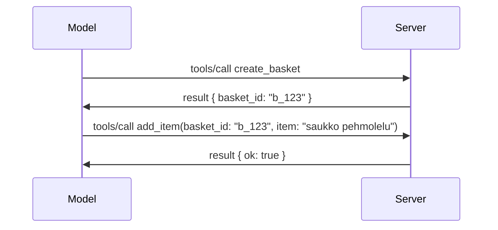

# Mitä MCP:ssä on muuttunut: Spesifikaatio 2026-07-28

> **Tila:** Lopullinen. MCP:n spesifikaatio `2026-07-28` julkaistiin 28. heinäkuuta 2026
> ja on tämänhetkinen protokollapäivitys. Tämä oppitunti kuvaa lopullisen
> spesifikaation. Joissain opetussisällön esimerkeissä esiintyy yhä eksplisiittinen versiointi
> `2025-11-25` koska niiden SDK:t eivät ole vielä ottaneet vastaan uutta tilatonta API:a;
> käsittele näitä esimerkkejä perintöyhteensopivuusohjeistuksena.

## Yleiskatsaus

`2026-07-28` on suurin MCP:n versio päivitys julkaisun jälkeen. Kuusi
spesifikaation parannusehdotusta (SEP) poistaa protokollatason sessiot ja
tekee MCP:stä tilattoman kuljetuskerroksessa, laajennuksista tulee ensiluokkaisia,
versioituja mekanismeja, ja useat aiemmin tässä opetussisällössä käsitellyt
ominaisuudet (Roots, Sampling, Logging) poistuvat käytöstä uuden elinkaarikäytännön mukaisesti.
Tämä oppitunti tiivistää, mitä muuttui, miksi sillä on merkitystä ja mitä se tarkoittaa
koodille, joka on kirjoitettu `2025-11-25` versiota vastaan.

Lähde: [The 2026-07-28 MCP Specification Release Candidate](https://blog.modelcontextprotocol.io/posts/2026-07-28-release-candidate/) (Model Context Protocol Blog, David Soria Parra ja Den Delimarsky).

## Oppimistavoitteet

Tämän oppitunnin loppuun mennessä osaat:

- Selittää, miksi MCP siirtyy tilattomaan protokollaytimeen ja mitä ongelmaa se ratkaisee horisontaalisesti skaalautuvissa käyttöönotossa.
- Kuvata, miten `initialize`/`initialized` kättely ja `Mcp-Session-Id` otsikko korvataan.
- Tunnistaa uudet `Mcp-Method` ja `Mcp-Name` otsikot sekä `ttlMs`/`cacheScope` välimuistimetatiedot.
- Tunnistaa Laajennukset -kehyksen ja kaksi tämän julkaisun mukana tullutta laajennusta: MCP Apps ja Tasks.
- Yhteenveto valtuutuksen tiukentamisesta ja Dynamic Client Registration
  käytöstäpoistosta.
- Tunnistaa mitkä ydintoiminnot (Roots, Sampling, Logging) ovat nyt poistettuja käytöstä ja mitä se tarkoittaa käytännössä.
- Selittää Full JSON Schema 2020-12 muutoksen työkalujen `inputSchema`/`outputSchema` osalta.

## Tilaton protokolla

Päämuutos: MCP muuttuu tilattomaksi protokollakerroksella.

### Ennen (2025-11-25): sessiot sitovat sinut yhteen palvelininstanssiin

Työkalun kutsuminen Streamable HTTP:n kautta alkaa `initialize` kättelyllä. Palvelin vastaa `Mcp-Session-Id` otsikolla, joka pitää olla mukana jokaisessa myöhemmässä pyynnössä:

```http
POST /mcp HTTP/1.1
Mcp-Session-Id: 1868a90c-3a3f-4f5b
Content-Type: application/json

{"jsonrpc":"2.0","id":2,"method":"tools/call",
 "params":{"name":"search","arguments":{"q":"otters"}}}
```

Koska sessio on sidottu siihen palvelininstanssiin, joka sen antoi, horisontaalisesti skaalautuvissa käyttöönotossa tarvitaan **sticky routing** kuormantasaimessa ja **jaettu sessiotallennus** instanssien välillä.

### Jälkeen (2026-07-28): jokainen pyyntö on itsenäinen

```http
POST /mcp HTTP/1.1
MCP-Protocol-Version: 2026-07-28
Mcp-Method: tools/call
Mcp-Name: search
Content-Type: application/json

{"jsonrpc":"2.0","id":1,"method":"tools/call",
 "params":{"name":"search","arguments":{"q":"otters"},
           "_meta":{"io.modelcontextprotocol/protocolVersion":"2026-07-28",
                    "io.modelcontextprotocol/clientInfo":{"name":"my-app","version":"1.0"},
                    "io.modelcontextprotocol/clientCapabilities":{}}}}
```

Mikä tahansa palvelininstanssi voi käsitellä tämän pyynnön. Keskeisiä muutoksia:

- **`initialize`/`initialized` kättely on poistettu** ([SEP-2575](https://github.com/modelcontextprotocol/modelcontextprotocol/pull/2575)). Protokollaversio, asiakastiedot ja asiakasominaisuudet siirtyvät `_meta` kenttään jokaisessa pyynnössä. Uusi `server/discover` metodi antaa asiakkaalle mahdollisuuden hakea palvelimen ominaisuudet etukäteen tarpeen mukaan.
- **`Mcp-Session-Id` otsikko ja protokollatason sessio on poistettu** ([SEP-2567](https://github.com/modelcontextprotocol/modelcontextprotocol/pull/2567)). Sticky routingin ja jaettujen istuntojen tallennus ei ole enää tarpeen protokollatasolla.

### Tilaton protokolla, tilalliset sovellukset

Protokollatason session poistaminen ei tarkoita, että palvelimesi ei voisi olla tilallinen. Suositeltu malli on sama kuin HTTP API:t ovat aina käyttäneet: luo eksplisiittinen kahva (kuten `basket_id` tai `browser_id`) yhdestä työkalukutsusta ja anna mallin palauttaa tämä kahva tavallisena argumenttina myöhemmissä kutsuissa.



Tämä tekee tilasta näkyvän ja järkevän mallille sen sijaan, että se olisi piilotettu kuljetuskerroksen metatietoihin, ja sallii minkä tahansa palvelininstanssin käsitellä kutsun.

### Palvelimen asiakaspyynnöt, uudelleenjärjestetty

Tilaton protokolla tarvitsee silti tavan, jolla palvelin voi pyytää asiakasta johonkin kesken pyynnön (esimerkiksi elicitaatiokehotteeseen):

- **Palvelimen aloittamat pyynnöt voidaan lähettää vain, kun palvelin käsittelee aktiivisesti asiakaspyyntöä** ([SEP-2260](https://github.com/modelcontextprotocol/modelcontextprotocol/pull/2260)) — ennen suositus, nyt vaatimus. Käyttäjää ei koskaan pyydetä yllättäen johonkin.
- **Monikertaiset vastauspyynnöt (Multi Round-Trip Requests)** ([SEP-2322](https://github.com/modelcontextprotocol/modelcontextprotocol/pull/2322)) korvaavat avoimen SSE-virran pidon. Sen sijaan palvelin palauttaa `InputRequiredResult`:in:

  ```json
  {
    "resultType": "input_required",
    "inputRequests": {
      "confirm": {
        "type": "elicitation",
        "message": "Delete 3 files?",
        "schema": { "type": "boolean" }
      }
    },
    "requestState": "eyJzdGVwIjoxLCJmaWxlcyI6WyJhIiwiYiIsImMiXX0="
  }
  ```

  Asiakas kerää vastaukset ja lähettää alkuperäisen kutsun uudelleen `inputResponses` ja heijastetun `requestState` kanssa. Mikä tahansa palvelininstanssi voi ottaa toiston vastaan, koska kaikki tarvittava on mukana datassa.

### Reititeltävä, välimuistissa oleva, seurattava

Kolme pienempää muutosta tekevät tilattomasta liikenteestä helpommin hallittavaa:

- **`Mcp-Method` ja `Mcp-Name` otsikot vaaditaan Streamable HTTP:ssä** ([SEP-2243](https://github.com/modelcontextprotocol/modelcontextprotocol/pull/2243)), jotta kuormantasaimet, portit ja nopeusrajoittimet voivat reitittää toiminnon perusteella ilman, että JSON-runkoa tarvitsee tarkastaa. Palvelimet hylkäävät pyynnöt, joissa otsikot ja runko eroavat.
- **`tools/list` ja resurssin luku tulokset sisältävät `ttlMs` ja `cacheScope` arvot** ([SEP-2549](https://github.com/modelcontextprotocol/modelcontextprotocol/pull/2549)), mallinnettu HTTP:n `Cache-Control`:n mukaan. Asiakkaat tietävät, kuinka kauan listatulos on tuore ja onko sen jakaminen käyttäjien kesken turvallista, ilman pitkäikäisen SSE-virran tarvetta muutosten seuraamiseksi.
- **W3C:n Trace Contextin levitys `_meta`-kentässä on dokumentoitu** ([SEP-414](https://github.com/modelcontextprotocol/modelcontextprotocol/pull/414)), korjaten `traceparent`, `tracestate` ja `baggage` avainten nimet, jotta hajautettu jäljitys voi seurata kutsua asiakas-SDK:n, MCP-palvelimen ja taustajärjestelmien välillä [OpenTelemetry](https://opentelemetry.io/)-yhteensopivassa backendissä.

## Laajennuksista ensiluokkaisia

Laajennukset olivat epävirallisia `2025-11-25` versiossa. [SEP-2133](https://github.com/modelcontextprotocol/modelcontextprotocol/pull/2133) virallistaa ne:

- Laajennukset tunnistetaan käänteisin DNS-tunnuksin.
- Niistä neuvotellaan `extensions` kartassa asiakas- ja palvelinominaisuuksissa.
- Ne sijaitsevat omissa `ext-*` repositorioissaan, joissa on omat vastuuhenkilöt ja ne versioidaan riippumattomasti ytimen spesifikaatiosta.
- Uusi Laajennusten kehitys SEPin prosessissa antaa niille polun kokeellisesta viralliseksi.

Tämä julkaisu sisältää kaksi virallista laajennusta.


### MCP-sovellukset: palvelimella renderöidyt käyttöliittymät

[MCP Apps](https://blog.modelcontextprotocol.io/posts/2026-01-26-mcp-apps/) ([SEP-1865](https://github.com/modelcontextprotocol/modelcontextprotocol/pull/1865)) antaa palvelimille mahdollisuuden toimittaa interaktiivisia HTML-käyttöliittymiä, jotka isännät renderöivät hiekkalaatikko-iframeissa. Työkalut määrittelevät käyttöliittymämallinsa etukäteen, jotta isännät voivat ennakkohakea, välimuistittaa ja suorittaa turvallisuustarkastuksia ennen suorittamista. Käyt läpi tämän perusteet jo [Oppitunnissa 15: MCP Apps](../03-GettingStarted/15-mcp-apps/README.md) — laajennuskehystä käyttäen MCP Apps on nyt virallisesti laajennus kokeellisen ytimen ominaisuuden sijaan.

### Tehtävät etenevät laajennukseksi

Tehtävät toimitettiin kokeellisena ydinominaisuutena `2025-11-25`. Tuotantokäytössä ilmeni tarpeeksi uudelleensuunnittelua, että oikea paikka on laajennus: [Tasks-laajennus](https://github.com/modelcontextprotocol/modelcontextprotocol/pull/2663) järjestää elinkaaren uudelleen tilattomalle mallille — palvelin voi vastata `tools/call`:iin tehtävän kahvalla, ja asiakas ohjaa sitä eteenpäin kommenteilla `tasks/get`, `tasks/update` ja `tasks/cancel`. Tehtävän luonti on palvelinohjattua: asiakas ilmoittaa laajennuksen, ja palvelin päättää milloin kutsu ajetaan tehtävänä. `tasks/list` poistettiin kokonaan, koska sitä ei voi rajata turvallisesti ilman istuntoja.

> **Siirtymismuistutus:** jos toteutit kokeellisen `2025-11-25` Tehtävät-API:n, sinun tulee siirtyä uuden laajennuksen elinkaaren käyttäjäksi — se ei ole taaksepäin yhteensopiva.

## Valtuutuksen vahvistaminen

Useat SEP:t vahvistavat
[valtuutusmäärittelyä](https://modelcontextprotocol.io/specification/2026-07-28/basic/authorization)
vastaamaan läheisemmin aitoja OAuth 2.0 / OpenID Connect -käyttöönottoja:

| SEP | Muutos |
|---|---|
| [SEP-2468](https://github.com/modelcontextprotocol/modelcontextprotocol/pull/2468) | Asiakkaiden on validoitava valtuutusvastauksissa `iss`-parametri RFC 9207:n mukaisesti, mikä vähentää sekoittamishyökkäyksiä MCP:n yksiasiakas-monipalvelin -mallissa. Tuleva versio vaatii `iss`:n puuttuvien vastausten hylkäämisen. |
| [SEP-837](https://github.com/modelcontextprotocol/modelcontextprotocol/pull/837) | Yhteensopivuusvain Dynamic Client Registration -asiakkaat ilmoittavat OpenID Connect - `application_type`:n, estäen virheelliset `"web"` oletukset työpöytä- ja komentoriviasiakkaille. |
| [SEP-2352](https://github.com/modelcontextprotocol/modelcontextprotocol/pull/2352) | Yhteensopivuusvain rekisteröityjä valtuustietoja sidotaan myöntävän valtuutuspalvelimen `issuer`:iin; asiakkaat rekisteröityvät uudelleen, jos resurssi siirtyy. |
| [SEP-2207](https://github.com/modelcontextprotocol/modelcontextprotocol/pull/2207) | Kuvaa, kuinka pyytää päivitystunnuksia OpenID Connect -tyylisiltä valtuutuspalvelimilta. |
| [SEP-2350](https://github.com/modelcontextprotocol/modelcontextprotocol/pull/2350) | Selkeyttää käyttöoikeuksien kertymistä portaiden pituisen valtuutuksen aikana. |
| [SEP-2351](https://github.com/modelcontextprotocol/modelcontextprotocol/pull/2351) | Selkeyttää `.well-known` löydön lisäosaa. |

Jos rakennat valtuutuspalvelinta MCP:lle, ilmoita `iss` kohdassa

valtuutusvastaukset ja noudattavat lopullista valtuutusmäärittelyä. Katso
[02-Security](../02-Security/README.md) toteutusohjeita varten.

Dynaaminen asiakasrekisteröinti säilyy yhteensopivuuden takia saatavilla, mutta se on myös
vanhentunut `2026-07-28`. Uusien toteutusten tulisi käyttää Client ID Metadata
-dokumentteja.

## Vanhentuneet ominaisuudet

Uuden
[ominaisuuden elinkaaripolitiikan](https://github.com/modelcontextprotocol/modelcontextprotocol/pull/2577) mukaisesti
Roots, Sampling, Logging ja Dynamic Client Registration ovat **Vanhenneet**:

| Ominaisuus | Suositeltu korvaava |
|---|---|
| Roots | Työkalujen parametrit, resurssi-URI:t tai palvelimen konfiguraatio |
| Sampling | Suora integraatio LLM-palveluntarjoajan API:hin |
| Logging | `stderr` stdio-siirroille; OpenTelemetry rakenteellista havainnoitavuutta varten |
| Dynamic Client Registration | Client ID Metadata -dokumentit |

Nämä ominaisuudet säilyvät `2026-07-28` yhteensopivuuden vuoksi. Ne voidaan poistaa
ensimmäisessä määrittelypäivityksessä 28. heinäkuuta 2027 tai sen jälkeen;
varsinainen poisto voi tapahtua myöhemmin. Uusien toteutusten tulisi käyttää yllä
mainittuja korvaavia malleja.

## Täysi JSON Schema 2020-12 työkaluja varten

Työkalujen `inputSchema` ja `outputSchema` nostetaan täydelliseen [JSON Schema 2020-12](https://json-schema.org/draft/2020-12) ([SEP-2106](https://github.com/modelcontextprotocol/modelcontextprotocol/pull/2106)):

- Syöttökaaviot säilyttävät `type: "object"` juuriehdon, mutta sallivat nyt koostamisen (`oneOf`, `anyOf`, `allOf`), ehdolliset lauseet ja viittaukset (`$ref`, `$defs`).
- Tulostuskaaviot ovat rajoittamattomia, ja `structuredContent` voi nyt olla mikä tahansa JSON-arvo, ei pelkästään objekti.
- Toteutusten ei tule automaattisesti dereferoida ulkoisia `$ref`-URI:a ja niiden tulisi rajoittaa skeeman syvyyttä ja validointiaikaa (palvelunestohyökkäyksen estämiseksi, jos skeemat validoidaan palvelinpuolella).

Erillään, puuttuvan resurssin virhekoodi muuttuu MCP:n mukaisesta `-32002` arvosta JSON-RPC-standardin mukaiseen `-32602` (Invalid Params) ([SEP-2164](https://github.com/modelcontextprotocol/modelcontextprotocol/pull/2164)). Jos asiakasohjelmasi tunnistaa kirjaimellisen `-32002` arvon, sinun täytyy päivittää se.

## Kuinka protokolla kehittyy tästä eteenpäin

Tämä julkaisu sisältää rikkomuksia, joita MCP:n ylläpitäjät eivät halua olevan tulevaisuudessa normi. Kolme hallintoon liittyvää SEP:iä pyrkii estämään toiston:

- **Ominaisuuden elinkaaripolitiikka** antaa jokaiselle ominaisuudelle aktiivisen → vanhentuneen → poistuvan polun, jossa on vähintään kaksitoista kuukautta vanhentumisen ja aikaisimman mahdollisen poiston välillä.
- **Laajennuskehys** mahdollistaa uusien ominaisuuksien julkaisun opt-in laajennuksina ja vakauttamisen siellä ennen (jos koskaan) siirtymistä ydinspecifikaatioon.
- Standardiradan SEP:llä ei enää voi olla lopullista statusta ennen kuin vastaava skenaario löytyy [conformance-sarjasta](https://github.com/modelcontextprotocol/conformance) ([SEP-2484](https://github.com/modelcontextprotocol/modelcontextprotocol/pull/2484)) — sama sarja, jota [SDK tier system](https://github.com/modelcontextprotocol/modelcontextprotocol/pull/1777) käyttää virallisten SDK:iden arviointiin.

## Julkaisuaikataulu ja validointi

- Julkaisuehdokas lukittiin 21. toukokuuta 2026.
- Lopullinen määrittely julkaistiin 28. heinäkuuta 2026.

- SDK-tuki saattaa viivästyä määrittelyn perässä. Tarkista
  [SDK-dokumentaatio](https://modelcontextprotocol.io/docs/sdk) ja SDK:n
  julkaisumuistiinpanot ennen esimerkin siirtämistä.
- Seuraa lopullisia muutoksia
  [2026-07-28 määrityksessä](https://modelcontextprotocol.io/specification/2026-07-28/)
  ja sen
  [muutoslokissa](https://modelcontextprotocol.io/specification/2026-07-28/changelog).

## Mitä tämä tarkoittaa tälle opetussuunnitelmalle

Opetussuunnitelma siirtyy esimerkeistä `2025-11-25` nykyiseen
`2026-07-28` määritykseen. Konkreettisesti:

- **Istunnot ja `initialize`-kädenpuristus** esimerkeissä, jotka on nimenomaisesti suunnattu
  `2025-11-25`:lle ovat vanhentuneita. `2026-07-28` protokolla korvaa ne
  edellä kuvatulla tilattomalla pyyntömallilla.
- **Näytteistys ja Juuret** ovat edelleen käytettävissä yhteensopivuuden vuoksi, mutta ne ovat vanhentuneita.
  Uusissa suunnitelmissa tulisi käyttää yllä lueteltuja korvaavia malleja.
- **Kokeellinen Tasks-ominaisuus**, jos olet käyttänyt sitä, pitää siirtää Tasks-laajennuksen uudelle elinkaarelle.
- **MCP-sovellukset** ([Oppitunti 15](../03-GettingStarted/15-mcp-apps/README.md)) eivät käytännössä muutu; ne siirtyvät vain muodollisen Laajennukset-kehyksen alle.

## Lisäresurssit

- [MCP-määritys 2026-07-28](https://modelcontextprotocol.io/specification/2026-07-28/)
- [2026-07-28 Muutosloki](https://modelcontextprotocol.io/specification/2026-07-28/changelog)
- [Vuoden 2026-07-28 MCP-määrityksen julkaisuversio (historiallinen blogikirjoitus)](https://blog.modelcontextprotocol.io/posts/2026-07-28-release-candidate/)
- [MCP-siirtojen tulevaisuus](https://blog.modelcontextprotocol.io/posts/2025-12-19-mcp-transport-future/)
- [SEP-ohjeet](https://modelcontextprotocol.io/community/sep-guidelines)
- [MCP SDK:n tasojärjestelmä](https://modelcontextprotocol.io/docs/sdk)

## Seuraavat askeleet

Palaa kohtaan [Ydinkäsitteet](./README.md) tai jatka
kohtaan [Turvallisuus](../02-Security/README.md) soveltaaksesi nykyisiä `2026-07-28` ohjeita.

---

<!-- CO-OP TRANSLATOR DISCLAIMER START -->
**Vastuuvapauslauseke**:
Tämä asiakirja on käännetty käyttämällä tekoälypohjaista käännöspalvelua [Co-op Translator](https://github.com/Azure/co-op-translator). Vaikka pyrimme tarkkuuteen, otathan huomioon, että automaattiset käännökset saattavat sisältää virheitä tai epätarkkuuksia. Alkuperäinen asiakirja sen alkuperäiskielellä on virallinen lähde. Tärkeissä asioissa suositellaan ammattimaista ihmiskäännöstä. Emme ole vastuussa tämän käännöksen käytöstä aiheutuvista väärinymmärryksistä tai tulkinnoista.
<!-- CO-OP TRANSLATOR DISCLAIMER END -->