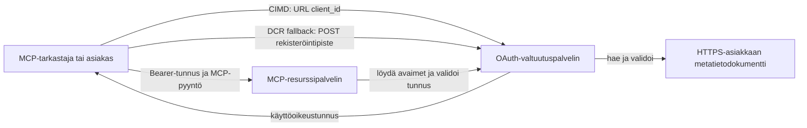

# CIMD- ja DCR-valtuutusesimerkki

Tämä TypeScript-esimerkki vertaa kahta tapaa, joilla OAuth-asiakas voi hankkia identiteetin
ennen suojattuun MCP-palvelimeen pääsyä:

- **Client ID Metadata Documents (CIMD)** käyttävät vakaata HTTPS-URL-osoitetta
  `client_id`-arvona. Tämä on suositeltu mekanismi asiakkaille ja valtuutuspalvelimille,
  joilla ei ole ennestään olemassa olevaa suhdetta.
- **Dynamic Client Registration (DCR)** pyytää valtuutuspalvelinta luomaan
  epäselvän asiakas-ID:n ajon aikana. MCP `2026-07-28` säilyttää DCR:n vain taaksepäin
  yhteensopivuuden vuoksi.

Esimerkki käyttää vakaata MCP TypeScript SDK v2:ta ja tilatonta
MCP `2026-07-28` -pyyntömallia. Se toimii ulkoisen OAuth 2.1/OpenID
Connect -valtuutuspalvelimen kanssa, kuten Auth0. MCP-palvelin toimii resurssipalvelimena:
se validoi käyttöoikeustunnukset, mutta ei tunnista käyttäjiä eikä anna
tunnuksia.

## Oppimistavoitteet

Täyttämällä tämän esimerkin osaat:

- Selittää, miksi CIMD on suositeltavampi kuin DCR uusille MCP-asiakkaille.
- Julkaista kelvollinen CIMD-dokumentti julkiselle natiivisovellukselle.
- Konfiguroida MCP-resurssipalvelin OAuthin löytymiseen ja JWT-validointiin.
- Käyttää CIMD- ja DCR-menetelmiä samassa MCP-palvelimessa ja valtuutuspalvelimessa.
- Pakottaa OAuth-lupaskoopin MCP-työkalun sisällä.
- Tunnistaa, mitkä vastuut kuuluvat asiakkaalle, resurssipalvelimelle ja
  valtuutuspalvelimelle.

## Arkkitehtuuri



Valtuutuspalvelin valitsee ja validoi rekisteröintimekanismin.
MCP-palvelin näkee vain lopputuloksena vahvistetun `client_id`-väitteen. HTTPS-URL,
jossa on polku, tunnistaa CIMD:n. Epäselvä ID ei riitä todistamaan DCR:ää, koska
ennakkoon rekisteröity asiakas voi myös käyttää epäselvää ID:tä; valinnainen
`DCR_CLIENT_ID_PREFIX`-asetus tarjoaa tarjoajakohtaisen demon vihjeen.

## Rekisteröintietusija

MCP-asiakkaiden, jotka tukevat kaikkia mekanismeja, tulisi käyttää tätä järjestystä:

1. Käytä ennakkoon rekisteröityjä asiakastietoja, jos ne ovat jo käytettävissä.
2. Käytä CIMD:tä, kun valtuutuspalvelin mainostaa
   `client_id_metadata_document_supported: true`.
3. Käytä DCR:ää vain varavaihtoehtona, kun palvelin mainostaa
   `registration_endpoint`-pistettä.
4. Kysy käyttäjältä ennakkoon rekisteröityjä asiakastietoja, kun mikään yllä olevista
   ei ole käytettävissä.

## Projektin rakenne

```text
src/
  config.ts          Environment validation
  dcr.ts             DCR compatibility request
  mcp.ts             MCP tools and scope checks
  oauth.ts           Authorization metadata and JWT verification
  register-dcr.ts    DCR command-line helper
  registration.ts    CIMD document and mechanism classification
  server.ts          Express, OAuth discovery, and MCP endpoint
test/
  dcr.test.ts
  oauth.test.ts
  registration.test.ts
  server.test.ts
```

## Esivaatimukset

- Node.js 20.6 tai uudempi versio. Skriptit käyttävät `--env-file` ja `--import`.
- OAuth 2.1/OpenID Connect -valtuutuspalvelin, joka tukee:
  - Valtuutuskoodi-flown S256 PKCE:n kanssa.
  - OAuth Protected Resource Metadataa ja Resource Indicatorsia.
  - JWT-käyttöoikeustunnuksia ja JWKS-päätepistettä.
  - CIMD:tä, sekä DCR:ää, jos haluat vertailla perinteistä varavaihtoehtoa.
- MCP Inspector tai toinen MCP `2026-07-28` asiakas.
- Julkinen HTTPS-URL CIMD-dokumentille. Kehitystunneli sopii
  laboratoriokäyttöön; käytä vakaata domainia tuotannossa.

## Asennus ja testaus

```bash
npm install
npm run build
npm test
```

Kaksitoista testiä käyttävät paikallisia avaimia ja simuloituja HTTP-päätepisteitä. Ne eivät vaadi
valtuutuspalvelintiliä. Ne tarkistavat:

- CIMD-dokumentin muodon ja URL-rajoitukset.
- Rehellinen luokittelu URL- ja epäselville asiakas-ID:ille.
- DCR-pyyntöjen ja vastausten käsittelyn.
- Epävarmojen ei-loopback-DCR-päätepisteiden hylkäyksen.
- JWT-allekirjoituksen, julkaisijan, vastaanottajan, vanhentumisen, asiakas-ID:n ja lupaskoopin validoinnin.
- Sisäprosessi MCP `2026-07-28` -kutsu `registration-info`:lle.

## Konfiguroi valtuutuspalvelin

Tarkat ohjausnimet vaihtelevat tarjoajan mukaan. Konfiguroi nämä toiminnot:

1. Luo API tai resurssipalvelin, jonka tunniste täsmää täsmälleen MCP-URL:isi kanssa,
   mukaan lukien `/mcp`, esimerkiksi `http://127.0.0.1:3001/mcp`.
2. Käytä RS256-käyttöoikeustunnuksia ja sisällytä `client_id` tai `azp` -väite.
3. Lisää `tool:greet`-oikeus tai -lupaskooppi.
4. Salli valtuutuskoodin flow S256 PKCE:llä julkisille natiiviasiakkaille.
5. Ota käyttöön Client ID Metadata Documents (CIMD).
6. Vertaillaksesi, ota käyttöön Dynamic Client Registration (DCR).
7. Varmista, että valtuutuspalvelimen metadata mainostaa:
   - `issuer`
   - `authorization_endpoint`
   - `token_endpoint`
   - `jwks_uri`
   - `client_id_metadata_document_supported: true`
   - `registration_endpoint` kun DCR on käytössä

### Auth0-esimerkki

Auth0:ssa ota käyttöön Client ID Metadata Document Registration, OIDC Dynamic
Application Registration ja Resource Parameter -yhteensopivuus. Luo API,
jonka tunniste on täsmälleen MCP-URL ja lisää `tool:greet`-oikeus.
Salli testikäyttäjän ja kolmannen osapuolen asiakkaiden pyytää tätä lupaa.

Tarjoajan hallintapaneelit ja ominaisuuksien saatavuus muuttuvat ajan myötä. Tarkista
tarjoajan dokumentaatio ennen näiden asetusten käyttöä tämän laboratorion ulkopuolella.

## Konfiguroi esimerkki

Luo `.env` esimerkin pohjalta:

```powershell
Copy-Item .env.example .env
```

Bash-yhteensopivilla kuorilla:

```bash
cp .env.example .env
```

Aseta nämä arvot:

```dotenv
MCP_SERVER_URL=http://127.0.0.1:3001/mcp
AUTHORIZATION_SERVER_ISSUER=https://your-tenant.example.com/
AUTHORIZATION_SERVER_METADATA_URL=https://your-tenant.example.com/.well-known/openid-configuration
CLIENT_METADATA_URL=https://your-public-host.example.com/client-metadata.json
OAUTH_REDIRECT_URIS=http://127.0.0.1:6274/oauth/callback
DCR_CLIENT_ID_PREFIX=tpc_
```

Tärkeitä yksityiskohtia:

- `AUTHORIZATION_SERVER_ISSUER` täytyy täsmätä tarkasti löydetyn
  valtuutuspalvelimen metadatan `issuer`-kentän kanssa, mukaan lukien mahdollinen perässä oleva kauttaviiva.
- `MCP_SERVER_URL` täytyy täsmätä käyttöoikeustunnuksen vastaanottajan kanssa.
- `CLIENT_METADATA_URL` täytyy olla HTTPS, sisältää ei-juuripolkua, ja olla
  julkinen URL, joka palvelee metadata-reittiä. Kyselymerkkijonot ja fragmentit hylätään,
  jotta reitti ja `client_id` pysyvät identtisinä.
- `OAUTH_REDIRECT_URIS` on pilkulla eroteltu sallittujen listaus. Oletuksena on MCP
  Inspectorin loopback-palautusosoite.
- `DCR_CLIENT_ID_PREFIX` on valinnainen ja tarjoajakohtainen. Jätä tyhjäksi,
  jos tarjoajallasi ei ole luotettavaa DCR-etuliitettä.

## Julkaise CIMD-dokumentti

Käynnistä tunneli, joka välittää julkisen HTTPS-alkuperänsä osoitteeseen `127.0.0.1:3001`.
Aseta `CLIENT_METADATA_URL` tuohon alkuperään plus `/client-metadata.json`, sitten suorita:

```bash
npm run build
npm start
```

Tarkista molemmat löytymisasiakirjat:

```bash
curl http://127.0.0.1:3001/health
curl http://127.0.0.1:3001/client-metadata.json
curl http://127.0.0.1:3001/.well-known/oauth-protected-resource/mcp
```

Julkisen HTTPS-metadata-URL:n palauttaman `client_id`-arvon on oltava tavu tavulta
identtinen kyseisen URL:n kanssa. Valtuutuspalvelimen on validoitava dokumentti ja
sen uudelleenohjaus-URI ennen tunnuksen myöntämistä.

> [!NOTE]
> Esimerkki isännöi asiakasdokumenttia ja MCP-resurssipalvelinta samassa prosessissa
> pitääkseen laboratorion pienenä. Tuotannossa MCP-asiakas omistaa ja isännöi omaa CIMD-
> dokumenttiaan erillään resurssipalvelimesta.

## Vertaa CIMD:tä ja DCR:ää

Käynnistä MCP Inspector:

```bash
npx @modelcontextprotocol/inspector
```

Käytä Streamable HTTP:tä ja yhdistä osoitteeseen `http://127.0.0.1:3001/mcp`.

### CIMD (Suositeltu)


1. Syötä julkinen `CLIENT_METADATA_URL` OAuth-asiakastunnukseksi.
2. Pyydä `tool:greet` sekä kaikki tarvittavat identiteettiavaruudet palveluntarjoajaltasi.
3. Suorita sisäänkirjautuminen ja suostumus.
4. Kutsu `registration-info`. Se raportoi `mechanism: "cimd"`.
5. Kutsu `greet` varmistaaksesi avaruuden noudattamisen.

### DCR (Yhteensopivuuden varaparannus)

1. Tyhjennä Inspectorin tallennettu OAuth-tila.
2. Jätä OAuth-asiakastunnus tyhjäksi, jotta Inspector voi käyttää ilmoitettua
   `registration_endpoint`-osoitetta.
3. Suorita sisäänkirjautuminen ja suostumus.
4. Kutsu `registration-info`.
5. Jos `DCR_CLIENT_ID_PREFIX` vastaa palveluntarjoajan generoimia tunnuksia, työkalu
   raportoi `mechanism: "dcr"`; muussa tapauksessa se raportoi oikein
   `opaque-client-id`.

Voit myös näyttää rekisteröintipyynnön suoraan:

```bash
npm run build
npm run register:dcr
```

Apuri tulostaa palautetun asiakastunnuksen, mutta ei koskaan tulosta asiakassalaisuutta.
Kohtele kaikkia palautettuja salaisuuksia luottamuksellisina ja tallenna ne asianmukaiseen salaisuuksien säilytyspaikkaan.

## Työkalut

| Työkalu | Vaadittu avaruus | Tarkoitus |
| --- | --- | --- |
| `registration-info` | Vahvistettu asiakas | Raportoi asiakastunnuksen tyyppi |
| `greet` | `tool:greet` | Havainnollista työkohtainen valtuutus |

## Turvallisuusmuistiinpanot

- Vahvista JWT-allekirjoitukset valtuutuspalvelimen JWKS-päätepisteen kautta.
- Vaadi tarkat myöntäjän ja vastaanottajan osumat.
- Vaadi vanhenemis- ja asiakastunnusväitteet.
- Älä koskaan hyväksy tunnusta, joka on myönnetty eri resurssille.
- Älä koskaan välitä MCP-tunnusta alavirran API:lle.
- Pidä DCR-tunnukset sidottuina myöntäjään, joka loi ne.
- Vahvista CIMD-osoitteen uudelleenohjaukset tarkasti osumalla.
- Käytä SSRF-suojausta, kun valtuutuspalvelin hakee CIMD-URL-osoitteita.
- Käytä HTTPS:ää valtuutus- ja metatiedot-päätepisteille, jotka ovat kehityksessä käyttäen loopbackin ulkopuolisia osoitteita.
 
- Älä päättele DCR:ää läpinäkymättömästä asiakastunnuksesta, ellei palveluntarjoaja dokumentoi
  luotettavaa tunnistekonventiota.

## Viitteet

- [MCP:n valtuutuksen määrittely](https://modelcontextprotocol.io/specification/2026-07-28/basic/authorization)
- [MCP:n asiakasrekisteröinti](https://modelcontextprotocol.io/specification/2026-07-28/basic/authorization/client-registration)
- [MCP:n turvallisuuskäytännöt](https://modelcontextprotocol.io/specification/2026-07-28/basic/security_best_practices)
- [MCP TypeScript SDK v2 valtuutusopas](https://ts.sdk.modelcontextprotocol.io/v2/serving/authorization)
- [OAuth Dynamic Client Registration (RFC 7591)](https://datatracker.ietf.org/doc/html/rfc7591)
- [OAuth Client ID Metadata Document -luonnos](https://datatracker.ietf.org/doc/html/draft-ietf-oauth-client-id-metadata-document-00)

## Kiitokset

Sivuttain opetustyyli sai inspiraationsa
[Sambego/auth0-xmcp-cimd](https://github.com/Sambego/auth0-xmcp-cimd) -projektista. Tämä
esimerkki on alkuperäinen, palveluntarjoajista riippumaton toteutus, joka on rakennettu virallisella
MCP TypeScript SDK v2:lla tätä opetussuunnitelmaa varten.

---

<!-- CO-OP TRANSLATOR DISCLAIMER START -->
**Vastuuvapauslauseke**:
Tämä asiakirja on käännetty käyttämällä tekoälypohjaista käännöspalvelua [Co-op Translator](https://github.com/Azure/co-op-translator). Vaikka pyrimme tarkkuuteen, otathan huomioon, että automaattiset käännökset saattavat sisältää virheitä tai epätarkkuuksia. Alkuperäinen asiakirja sen alkuperäiskielellä on virallinen lähde. Tärkeissä asioissa suositellaan ammattimaista ihmiskäännöstä. Emme ole vastuussa tämän käännöksen käytöstä aiheutuvista väärinymmärryksistä tai tulkinnoista.
<!-- CO-OP TRANSLATOR DISCLAIMER END -->