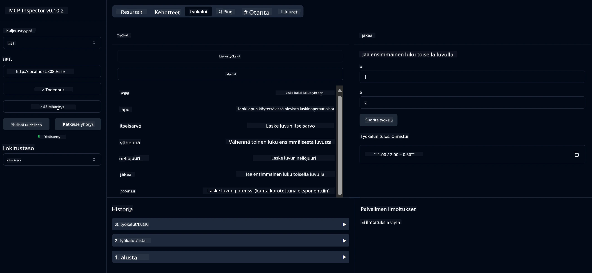

# Peruslaskin MCP-palvelu

> [!NOTE]
> Tämä Java-ratkaisu käyttää perinteistä HTTP+SSE-siirtoa ja on tarkoitettu MCP:n
> kanssa yhteensopivalle SDK:lle `2025-11-25`. Se on säilytetty kurssikoodin
> yhteensopivuuden vuoksi; uudet etäpalvelimet tulisi toteuttaa `2026-07-28` Streamable HTTP -tuella.

Tämä palvelu tarjoaa peruslaskimen toiminnot Model Context Protocolin (MCP) kautta, käyttäen Spring Bootia ja WebFlux-siirtoa. Se on suunniteltu yksinkertaiseksi esimerkiksi aloittelijoille, jotka opettelevat MCP-toteutuksia.

Lisätietoja on saatavilla [MCP Server Boot Starter](https://docs.spring.io/spring-ai/reference/api/mcp/mcp-server-boot-starter-docs.html) -viitedokumentaatiossa.


## Palvelun käyttö

Palvelu tarjoaa seuraavat API-päätepisteet MCP-protokollan kautta:

- `add(a, b)`: Laske kahden luvun summa
- `subtract(a, b)`: Vähennä toinen luku ensimmäisestä
- `multiply(a, b)`: Kerro kaksi lukua
- `divide(a, b)`: Jaa ensimmäinen luku toisella (nollatarkistuksella)
- `power(base, exponent)`: Laske luvun potenssi
- `squareRoot(number)`: Laske neliöjuuri (tarkista negatiivinen luku)
- `modulus(a, b)`: Laske jakolaskun jakojäännös
- `absolute(number)`: Laske luvun itseisarvo

## Riippuvuudet

Projekti tarvitsee seuraavat keskeiset riippuvuudet:

```xml
<dependency>
    <groupId>org.springframework.ai</groupId>
    <artifactId>spring-ai-starter-mcp-server-webflux</artifactId>
</dependency>
```

## Projektin rakentaminen

Rakenna projekti käyttämällä Mavenia:
```bash
./mvnw clean install -DskipTests
```

## Palvelimen käynnistäminen

### Javaa käyttäen

```bash
java -jar target/calculator-server-0.0.1-SNAPSHOT.jar
```

### MCP Inspectorin käyttäminen

MCP Inspector on hyödyllinen työkalu MCP-palveluiden kanssa toimimiseen. Käyttääksesi sitä tämän laskinpalvelun kanssa:

1. **Asenna ja käynnistä MCP Inspector** uudessa terminaali-ikkunassa:
   ```bash
   npx @modelcontextprotocol/inspector
   ```

2. **Avaa web-käyttöliittymä** napsauttamalla sovelluksen näyttämää URL-osoitetta (yleensä http://localhost:6274)

3. **Konfiguroi yhteys**:
   - Aseta siirtotyyppi "SSE"
   - Aseta URL käynnissä olevan palvelimesi SSE-päätepisteeseen: `http://localhost:8080/sse`
   - Klikkaa "Connect"

4. **Käytä työkaluja**:
   - Napsauta "List Tools" nähdäksesi saatavilla olevat laskutoiminnot
   - Valitse työkalu ja napsauta "Run Tool" suorittaaksesi toiminnon



---

<!-- CO-OP TRANSLATOR DISCLAIMER START -->
**Vastuuvapauslauseke**:
Tämä asiakirja on käännetty käyttämällä tekoälypohjaista käännöspalvelua [Co-op Translator](https://github.com/Azure/co-op-translator). Vaikka pyrimme tarkkuuteen, otathan huomioon, että automaattiset käännökset saattavat sisältää virheitä tai epätarkkuuksia. Alkuperäinen asiakirja sen alkuperäiskielellä on virallinen lähde. Tärkeissä asioissa suositellaan ammattimaista ihmiskäännöstä. Emme ole vastuussa tämän käännöksen käytöstä aiheutuvista väärinymmärryksistä tai tulkinnoista.
<!-- CO-OP TRANSLATOR DISCLAIMER END -->