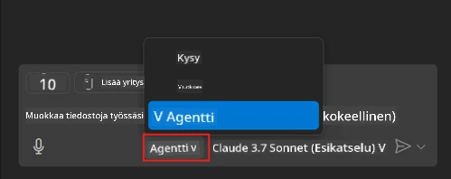
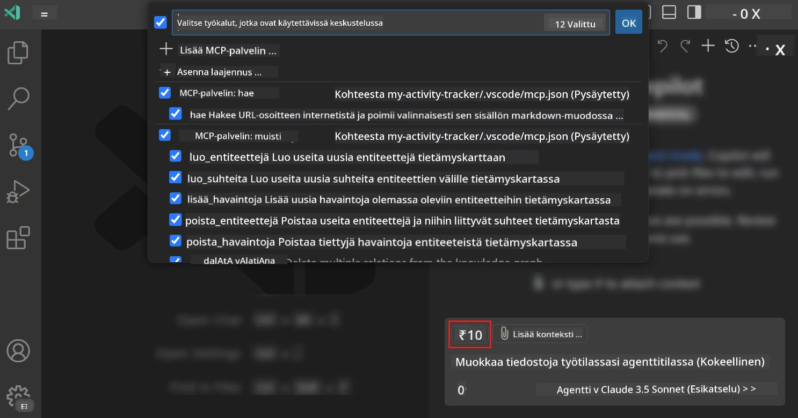
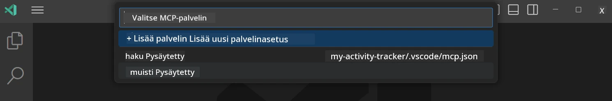
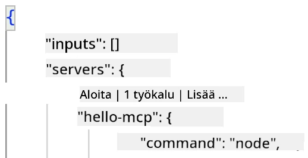
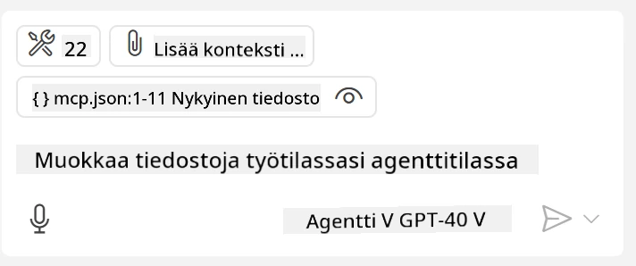
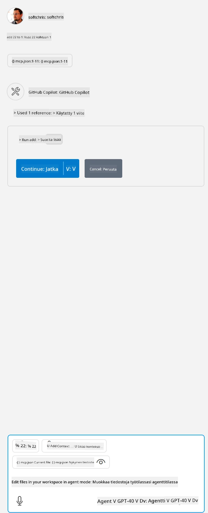

# Palvelimen käyttäminen GitHub Copilot Agent -tilasta

Visual Studio Code ja GitHub Copilot voivat toimia asiakkaana ja käyttää MCP-palvelinta. Saatat miettiä, miksi haluamme tehdä niin? Se tarkoittaa, että kaikki MCP-palvelimen ominaisuudet voidaan nyt käyttää IDE:ssäsi. Kuvittele esimerkiksi, että lisäät GitHubin MCP-palvelimen, joka mahdollistaisi GitHubin hallinnan kehotteiden avulla sen sijaan, että kirjoittaisit tiettyjä komentoja terminaalissa. Tai kuvita, että mikä tahansa asia, joka voisi parantaa kehittäjäkokemustasi, hallitaan luonnollisella kielellä. Nyt alat nähdä hyödyn, eikö?

## Yleiskatsaus

Tämä oppitunti käsittelee, kuinka käyttää Visual Studio Codea ja GitHub Copilotin Agent-tilaa MCP-palvelimesi asiakkaana.

## Oppimistavoitteet

Tämän oppitunnin lopussa osaat:

- Käyttää MCP-palvelinta Visual Studio Coden kautta.
- Suorittaa toimintoja, kuten työkaluja, GitHub Copilotilla.
- Määrittää Visual Studio Code etsimään ja hallinnoimaan MCP-palvelintasi.

## Käyttö

Voit hallita MCP-palvelintasi kahdella eri tavalla:

- Käyttöliittymän kautta, näet miten se tehdään myöhemmin tässä luvussa.
- Terminaalin kautta, palvelinta voidaan ohjata terminaalista `code`-suoritustiedoston avulla:

  Lisätäksesi MCP-palvelimen käyttäjäprofiiliisi, käytä --add-mcp komentorivivalintaa ja anna JSON-muotoinen palvelinkonfiguraatio muodossa {\"name\":\"server-name\",\"command\":...}.

  ```
  code --add-mcp "{\"name\":\"my-server\",\"command\": \"uvx\",\"args\": [\"mcp-server-fetch\"]}"
  ```

### Kuvakaappaukset





Keskustellaan lisää käyttöliittymän käyttämisestä seuraavissa osioissa.

## Lähestymistapa

Näin meidän tulee lähestyä asiaa yleisellä tasolla:

- Määritä tiedosto MCP-palvelimen löytämiseksi.
- Käynnistä/Yhdistä kyseiseen palvelimeen saadaksesi luettelon sen ominaisuuksista.
- Käytä näitä ominaisuuksia GitHub Copilot Chat -käyttöliittymän kautta.

Hienoa, nyt kun ymmärrämme työnkulun, kokeillaan MCP-palvelimen käyttöä Visual Studio Coden kautta harjoituksen avulla.

## Harjoitus: Palvelimen käyttäminen

Tässä harjoituksessa määritämme Visual Studio Coden löytämään MCP-palvelimesi, jotta sitä voidaan käyttää GitHub Copilot Chat -käyttöliittymässä.

### -0- Ennen aloitusta, ota MCP Serverin hakutoiminto käyttöön

Saatat joutua ottamaan MCP-palvelinten haun käyttöön.

1. Mene Visual Studio Codessa kohtaan `File -> Preferences -> Settings`.

1. Etsi "MCP" ja ota käyttöön `chat.mcp.discovery.enabled` settings.json -tiedostossa.

### -1- Luo konfiguraatiotiedosto

Aloita luomalla konfiguraatiotiedosto projektisi juureen, tarvitset tiedoston nimeltä MCP.json ja aseta se kansioon nimeltä .vscode. Sen tulee näyttää tältä:

```text
.vscode
|-- mcp.json
```

Seuraavaksi katsotaan, miten palvelinmerkintä lisätään.

### -2- Määritä palvelin

Lisää seuraava sisältö tiedostoon *mcp.json*:

```json
{
    "inputs": [],
    "servers": {
       "hello-mcp": {
           "command": "node",
           "args": [
               "build/index.js"
           ]
       }
    }
}
```

Yllä on yksinkertainen esimerkki Node.js:llä kirjoitetun palvelimen käynnistämisestä, muiden ajonaikojen kohdalla määritä oikea käynnistyskomento käyttämällä `command` ja `args`.

### -3- Käynnistä palvelin

Nyt kun olet lisännyt merkinnän, käynnistetään palvelin:

1. Etsi merkintäsi *mcp.json*-tiedostosta ja varmista, että näet "play"-ikonin:

    

1. Klikkaa "play"-ikonia, GitHub Copilot Chat -työkalujen kuvakkeen pitäisi näyttää useampia työkaluja. Klikkaamalla sitä näet rekisteröityjen työkalujen listan. Voit valita tai poistaa valinnan kunkin työkalun kohdalla riippuen siitä, haluatko GitHub Copilotin käyttävän niitä kontekstina:

  

1. Käyttääksesi työkalua, kirjoita kehotteeksi lause, jonka tiedät vastaavan yhtä työkaluistasi, esimerkiksi "add 22 to 1":

  

  Sinun pitäisi nähdä vastaus 23.

## Tehtävä

Kokeile lisätä palvelinmerkintä *mcp.json*-tiedostoon ja varmista, että voit käynnistää ja pysäyttää palvelimen. Varmista myös, että voit kommunikoida palvelimesi työkalujen kanssa GitHub Copilot Chat -käyttöliittymän kautta.

## Ratkaisu

[Ratkaisu](./solution/README.md)

## Keskeiset opit

Tämän luvun keskeiset opit ovat seuraavat:

- Visual Studio Code on loistava asiakas, jolla voit käyttää useita MCP-palvelimia ja niiden työkaluja.
- GitHub Copilot Chat -käyttöliittymän kautta olet vuorovaikutuksessa palvelimien kanssa.
- Voit pyytää käyttäjältä syötteitä, kuten API-avaimia, jotka voidaan välittää MCP-palvelimelle määrittäessäsi palvelinmerkintää *mcp.json*-tiedostossa.

## Esimerkit

- [Java Calculator](../samples/java/calculator/README.md)
- [.Net Calculator](../../../../03-GettingStarted/samples/csharp)
- [JavaScript Calculator](../samples/javascript/README.md)
- [TypeScript Calculator](../samples/typescript/README.md)
- [Python Calculator](../../../../03-GettingStarted/samples/python)

## Lisäresurssit

- [Visual Studio -dokumentaatio](https://code.visualstudio.com/docs/copilot/chat/mcp-servers)

## Mitä seuraavaksi

- Seuraavaksi: [Stdio-palvelimen luominen](../05-stdio-server/README.md)

---

<!-- CO-OP TRANSLATOR DISCLAIMER START -->
**Vastuuvapauslauseke**:
Tämä asiakirja on käännetty käyttämällä tekoälypohjaista käännöspalvelua [Co-op Translator](https://github.com/Azure/co-op-translator). Vaikka pyrimme tarkkuuteen, otathan huomioon, että automaattiset käännökset saattavat sisältää virheitä tai epätarkkuuksia. Alkuperäinen asiakirja sen alkuperäiskielellä on virallinen lähde. Tärkeissä asioissa suositellaan ammattimaista ihmiskäännöstä. Emme ole vastuussa tämän käännöksen käytöstä aiheutuvista väärinymmärryksistä tai tulkinnoista.
<!-- CO-OP TRANSLATOR DISCLAIMER END -->