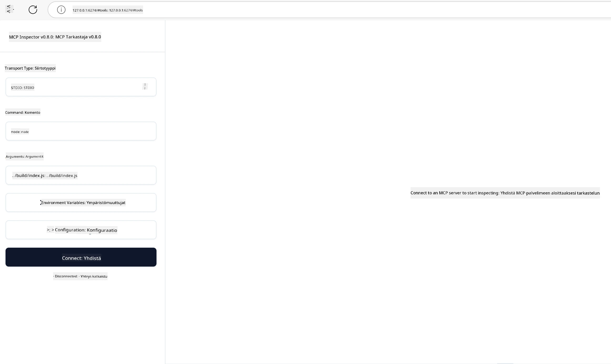

## Testaus ja virheiden korjaus

Ennen kuin aloitat MCP-palvelimesi testaamisen, on tärkeää ymmärtää käytettävissä olevat työkalut ja parhaat käytännöt virheiden korjaukseen. Tehokas testaus varmistaa, että palvelimesi toimii odotetusti ja auttaa sinua nopeasti tunnistamaan ja ratkaisemaan ongelmat. Seuraavassa osiossa esitellään suositellut lähestymistavat MCP-toteutuksesi validoimiseksi.

## Yleiskatsaus

Tässä oppitunnissa käsitellään, miten valita oikea testausmenetelmä ja tehokkain testausväline.

## Oppimistavoitteet

Oppimisen jälkeen osaat:

- Kuvailla erilaisia testausmenetelmiä.
- Käyttää erilaisia työkaluja koodisi tehokkaaseen testaamiseen.


## MCP-palvelimien testaaminen

MCP tarjoaa työkaluja palvelimien testaamiseen ja virheiden korjaukseen:

- **MCP Inspector**: Komentorivityökalu, jota voi käyttää sekä CLI- että visuaalisena työkaluna.
- **Manuaalinen testaus**: Voit käyttää esimerkiksi curl-työkalua web-pyyntöjen tekemiseen, mutta mikä tahansa HTTP-pyyntöjen tekemiseen kykenevä työkalu käy.
- **Yksikkötestaus**: Voit käyttää suosikkiyksikkötestauskehystäsi serverin ja asiakkaan ominaisuuksien testaamiseen.

### MCP Inspectorin käyttäminen

Olemme kuvanneet tämän työkalun käyttöä aiemmissa oppitunneissa, mutta kerromme siitä nyt yleisellä tasolla. Työkalu on rakennettu Node.js:llä, ja sitä voi käyttää kutsumalla `npx`-suoritustiedostoa, joka lataa ja asentaa työkalun väliaikaisesti ja siivoaa itsensä, kun pyyntösi suoritus on valmis.

[MCP Inspector](https://github.com/modelcontextprotocol/inspector) auttaa sinua:

- **Palvelimen kapasiteettien löytämisessä**: Havaitsee automaattisesti saatavilla olevat resurssit, työkalut ja kehotteet
- **Työkalujen suorittamisen testaamisessa**: Kokeile eri parametreja ja näe vastaukset reaaliajassa
- **Palvelimen metatietojen tarkastelemisessa**: Tutki palvelimen tietoja, kaavioita ja asetuksia

Tyypillinen työkalun suoritus näyttää tältä:

```bash
npx @modelcontextprotocol/inspector node build/index.js
```

Edellä oleva komento käynnistää MCP:n ja sen visuaalisen käyttöliittymän sekä avaa paikallisen web-käyttöliittymän selaimessasi. Näet kojelaudan, joka näyttää rekisteröidyt MCP-palvelimesi, niiden käytettävissä olevat työkalut, resurssit ja kehotteet. Käyttöliittymän avulla voit testata työkalujen suorittamista vuorovaikutteisesti, tutkia palvelimen metatietoja ja nähdä vastaukset reaaliajassa, mikä helpottaa MCP-palvelintoteutustesi validoimista ja virheiden korjausta.

Näin se voi näyttää: 

Voit myös suorittaa tämän työkalun komentorivimoodissa lisäämällä `--cli`-attribuutin. Tässä esimerkki työkalun suorittamisesta "CLI"-moodissa, joka listaa kaikki palvelimen työkalut:

```sh
npx @modelcontextprotocol/inspector --cli node build/index.js --method tools/list
```

### Manuaalinen testaus

Inspectorin ajamisen lisäksi palvelimen kapasiteettien testaamiseen on toinen samankaltainen tapa: suorittaa HTTP-pyyntöjä tekevä asiakas kuten esimerkiksi curl.

Curlilla voit testata MCP-palvelimia suoraan HTTP-pyyntöjen avulla:

```bash
# Esimerkki: Testipalvelimen metatiedot
curl http://localhost:3000/v1/metadata

# Esimerkki: Suorita työkalu
curl -X POST http://localhost:3000/v1/tools/execute \
  -H "Content-Type: application/json" \
  -d '{"name": "calculator", "parameters": {"expression": "2+2"}}'
```

Kuten yllä olevista curl-esimerkeistä näkyy, käytät POST-pyyntöä kutsuaksesi työkalua, käyttäen hyötykuormassa työkalun nimeä ja sen parametreja. Valitse sinulle parhaiten sopiva tapa. Komentorivityökalut ovat yleensä nopeampia käyttää ja ne sopivat skriptaamiseen, mikä voi olla hyödyllistä CI/CD-ympäristössä.

### Yksikkötestaus

Luo yksikkötestejä työkaluillesi ja resursseillesi varmistaaksesi, että ne toimivat odotetusti. Tässä esimerkki testauskoodista.

```python
import pytest

from mcp.server.fastmcp import FastMCP
from mcp.shared.memory import (
    create_connected_server_and_client_session as create_session,
)

# Merkitse koko moduuli asynkronisia testejä varten
pytestmark = pytest.mark.anyio


async def test_list_tools_cursor_parameter():
    """Test that the cursor parameter is accepted for list_tools.

    Note: FastMCP doesn't currently implement pagination, so this test
    only verifies that the cursor parameter is accepted by the client.
    """

 server = FastMCP("test")

    # Luo pari testityökalua
    @server.tool(name="test_tool_1")
    async def test_tool_1() -> str:
        """First test tool"""
        return "Result 1"

    @server.tool(name="test_tool_2")
    async def test_tool_2() -> str:
        """Second test tool"""
        return "Result 2"

    async with create_session(server._mcp_server) as client_session:
        # Testaa ilman kursori-parametria (jätetty pois)
        result1 = await client_session.list_tools()
        assert len(result1.tools) == 2

        # Testaa kursori=None
        result2 = await client_session.list_tools(cursor=None)
        assert len(result2.tools) == 2

        # Testaa kursori merkkijonona
        result3 = await client_session.list_tools(cursor="some_cursor_value")
        assert len(result3.tools) == 2

        # Testaa tyhjällä merkkijonokursorilla
        result4 = await client_session.list_tools(cursor="")
        assert len(result4.tools) == 2
    
```

Edellinen koodi tekee seuraavaa:

- Hyödyntää pytest-kehystä, jonka avulla voit luoda testejä funktioina ja käyttää assert-lauseita.
- Luo MCP-palvelimen, jolla on kaksi eri työkalua.
- Käyttää `assert`-lausetta tarkistaakseen, että tietyt ehdot täyttyvät.

Katso [kokonainen tiedosto tästä](https://github.com/modelcontextprotocol/python-sdk/blob/main/tests/client/test_list_methods_cursor.py)

Edellä olevan tiedoston perusteella voit testata omaa palvelintasi varmistaaksesi, että kapasiteetit luodaan oikein.

Kaikissa merkittävissä SDK:issa on vastaavat testausosat, joten voit sovittaa ne itse valitsemaasi ajonaikaiseen ympäristöön.

## Esimerkit

- [Java Calculator](../samples/java/calculator/README.md)
- [.Net Calculator](../../../../03-GettingStarted/samples/csharp)
- [JavaScript Calculator](../samples/javascript/README.md)
- [TypeScript Calculator](../samples/typescript/README.md)
- [Python Calculator](../../../../03-GettingStarted/samples/python)

## Lisäresurssit

- [Python SDK](https://github.com/modelcontextprotocol/python-sdk)

## Mitä seuraavaksi

- Seuraava: [Deployment](../09-deployment/README.md)

---

<!-- CO-OP TRANSLATOR DISCLAIMER START -->
**Vastuuvapauslauseke**:
Tämä asiakirja on käännetty käyttämällä tekoälypohjaista käännöspalvelua [Co-op Translator](https://github.com/Azure/co-op-translator). Vaikka pyrimme tarkkuuteen, otathan huomioon, että automaattiset käännökset saattavat sisältää virheitä tai epätarkkuuksia. Alkuperäinen asiakirja sen alkuperäiskielellä on virallinen lähde. Tärkeissä asioissa suositellaan ammattimaista ihmiskäännöstä. Emme ole vastuussa tämän käännöksen käytöstä aiheutuvista väärinymmärryksistä tai tulkinnoista.
<!-- CO-OP TRANSLATOR DISCLAIMER END -->