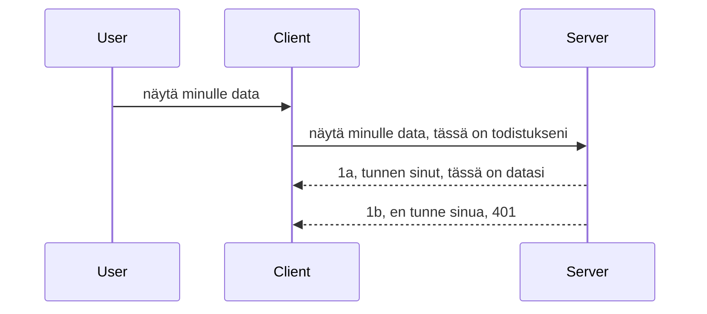

# Yksinkertainen autentikointi

MCP SDK:t tukevat OAuth 2.1 -menetelmää, joka on rehellisesti sanottuna melko monimutkainen prosessi, johon liittyy käsitteitä kuten autentikointipalvelin, resurssipalvelin, tunnistetietojen lähettäminen, koodin vastaanottaminen, koodin vaihtaminen kantajatunnukseen, jotta lopulta päästään käsiksi resurssitietoihin. Jos et ole tottunut OAuthiin, joka on hieno toteuttaa, on hyvä idea aloittaa perusautentikoinnista ja rakentaa siitä kohti parempaa ja parempaa turvallisuutta. Siksi tämä luku on olemassa, jotta se valmistaa sinua edistyneempään autentikointiin.

## Autentikointi, mitä sillä tarkoitetaan?

Autentikointi on lyhenne sanoista authentication ja authorization. Ajatuksena on, että meidän täytyy tehdä kaksi asiaa:

- **Autentikointi**, joka on prosessi, jossa selvitetään, annammeko henkilön mennä taloomme, eli onko hänellä oikeus olla "tässä" eli käyttää resurssipalvelintamme, jossa MCP Serverin ominaisuudet sijaitsevat.
- **Valtuutus**, on prosessi, jossa selvitetään, onko käyttäjällä oikeus saada pääsy juuri näihin resursseihin, joita hän pyytää, esimerkiksi näihin tilauksiin tai tuotteisiin, tai saako hän lukea sisällön mutta ei poistaa sitä esimerkiksi.

## Tunnistetiedot: miten kerromme järjestelmälle keitä olemme

Useimmat web-kehittäjät ajattelevat tavallisesti tunnistetarjonnan kautta palvelimelle, yleensä salaisuus, joka kertoo, saako he olla täällä ("Autentikointi"). Tämä tunnistetieto on yleensä base64-koodattu versio käyttäjätunnuksesta ja salasanasta tai API-avain, joka yksilöi tietyn käyttäjän.

Tätä lähetetään headerissa nimeltä "Authorization" näin:

```json
{ "Authorization": "secret123" }
```

Tätä kutsutaan yleensä perusautentikoinniksi. Kokonaisvirtaus toimii näin:


Nyt kun tiedämme miten virtaus toimii, miten toteutamme sen? Useimmilla web-palvelimilla on käsite nimeltä middleware, pätkä koodia, joka suoritetaan osana pyyntöä, pystyy tarkistamaan tunnistetietoja ja jos ne ovat päteviä, päästämään pyynnön läpi. Jos pyynnöllä ei ole voimassa olevia tunnistetietoja, saat autentikointivirheen. Katsotaan, miten tämä voidaan toteuttaa:

**Python**

```python
class AuthMiddleware(BaseHTTPMiddleware):
    async def dispatch(self, request, call_next):

        has_header = request.headers.get("Authorization")
        if not has_header:
            print("-> Missing Authorization header!")
            return Response(status_code=401, content="Unauthorized")

        if not valid_token(has_header):
            print("-> Invalid token!")
            return Response(status_code=403, content="Forbidden")

        print("Valid token, proceeding...")
       
        response = await call_next(request)
        # lisää asiakaskohtaiset otsikot tai muuta vastausta jollain tavalla
        return response


starlette_app.add_middleware(CustomHeaderMiddleware)
```

Tässä meillä on:

- Luotu middleware nimeltä `AuthMiddleware`, jonka `dispatch`-metodia web-palvelin kutsuu.
- Lisätty middleware web-palvelimeen:

    ```python
    starlette_app.add_middleware(AuthMiddleware)
    ```

- Kirjoitettu validointilogiikka, joka tarkistaa, onko Authorization-header läsnä ja onko lähetetty salaisuus voimassa:

    ```python
    has_header = request.headers.get("Authorization")
    if not has_header:
        print("-> Missing Authorization header!")
        return Response(status_code=401, content="Unauthorized")

    if not valid_token(has_header):
        print("-> Invalid token!")
        return Response(status_code=403, content="Forbidden")
    ```

Jos salaisuus on läsnä ja voimassa, pyynnön annetaan mennä läpi kutsumalla `call_next` ja palautetaan vastaus.

    ```python
    response = await call_next(request)
    # lisää asiakasotsikoita tai muuta vastausta jollain tavalla
    return response
    ```

Toimintaperiaate on, että kun web-pyyntö tehdään palvelimelle, middleware kutsutaan ja toteutuksensa perusteella joko päästetään pyyntö läpi tai palautetaan virhe, joka osoittaa, että asiakas ei ole sallittu jatkamaan.

**TypeScript**

Tässä luomme middleware-funktion suositulla Express-kehyksellä ja sieppaamme pyynnön ennen kuin se saavuttaa MCP Serverin. Tässä on koodi siihen:

```typescript
function isValid(secret) {
    return secret === "secret123";
}

app.use((req, res, next) => {
    // 1. Onko auktorisointipääte olemassa?
    if(!req.headers["Authorization"]) {
        res.status(401).send('Unauthorized');
    }
    
    let token = req.headers["Authorization"];

    // 2. Tarkista kelpoisuus.
    if(!isValid(token)) {
        res.status(403).send('Forbidden');
    }

   
    console.log('Middleware executed');
    // 3. Lähetä pyyntö seuraavaan vaiheeseen pyyntöputkessa.
    next();
});
```

Tässä koodissa:

1. Tarkistamme, onko Authorization-header olemassa, jos ei ole, lähetämme 401-virheen.
2. Varmistamme, että tunnistetieto/token on voimassa, jos ei ole, lähetämme 403-virheen.
3. Lopuksi lähetetään pyyntö eteenpäin ja palautetaan pyydetty resurssi.

## Harjoitus: Toteuta autentikointi

Otetaan opimme ja kokeillaan toteuttaa se. Suunnittelumme on seuraava:

Palvelin

- Luo web-palvelin ja MCP-instanssi.
- Toteuta middleware palvelimelle.

Asiakas

- Lähetä web-pyyntö tunnistetiedolla headerissa.

### -1- Luo web-palvelin ja MCP-instanssi

Ensimmäisessä vaiheessa luomme web-palvelimen instanssin ja MCP Serverin.

**Python**

Tässä luomme MCP Server -instanssin, teemme starlette web-sovelluksen ja isännöimme sen uvicornilla.

```python
# luodaan MCP-palvelin

app = FastMCP(
    name="MCP Resource Server",
    instructions="Resource Server that validates tokens via Authorization Server introspection",
    host=settings["host"],
    port=settings["port"],
    debug=True
)

# luodaan starlette-verkkosovellus
starlette_app = app.streamable_http_app()

# tarjoillaan sovellus uvicornin kautta
async def run(starlette_app):
    import uvicorn
    config = uvicorn.Config(
            starlette_app,
            host=app.settings.host,
            port=app.settings.port,
            log_level=app.settings.log_level.lower(),
        )
    server = uvicorn.Server(config)
    await server.serve()

run(starlette_app)
```

Tässä koodissa:

- Luodaan MCP Server.
- Konstruktoidaan starlette web-sovellus MCP Serveristä, `app.streamable_http_app()`.
- Isännöidään ja palvelaan web-sovellusta uvicornilla `server.serve()`.

**TypeScript**

Tässä luomme MCP Server -instanssin.

```typescript
const server = new McpServer({
      name: "example-server",
      version: "1.0.0"
    });

    // ... määritä palvelinresurssit, työkalut ja kehotteet ...
```

Tämä MCP Serverin luonti täytyy tehdä POST /mcp reittimääritelmän sisällä, joten otetaan yllä oleva koodi ja siirretään se näin:

```typescript
import express from "express";
import { randomUUID } from "node:crypto";
import { McpServer } from "@modelcontextprotocol/sdk/server/mcp.js";
import { StreamableHTTPServerTransport } from "@modelcontextprotocol/sdk/server/streamableHttp.js";
import { isInitializeRequest } from "@modelcontextprotocol/sdk/types.js"

const app = express();
app.use(express.json());

// Kartta kuljetusten tallentamiseen istunnon ID:n mukaan
const transports: { [sessionId: string]: StreamableHTTPServerTransport } = {};

// Käsittele POST-pyynnöt asiakas-palvelin viestintään
app.post('/mcp', async (req, res) => {
  // Tarkista olemassa oleva istunnon tunnus
  const sessionId = req.headers['mcp-session-id'] as string | undefined;
  let transport: StreamableHTTPServerTransport;

  if (sessionId && transports[sessionId]) {
    // Käytä uudelleen olemassa olevaa kuljetusta
    transport = transports[sessionId];
  } else if (!sessionId && isInitializeRequest(req.body)) {
    // Uusi alustuspyyntö
    transport = new StreamableHTTPServerTransport({
      sessionIdGenerator: () => randomUUID(),
      onsessioninitialized: (sessionId) => {
        // Tallenna kuljetus istunnon tunnuksen mukaan
        transports[sessionId] = transport;
      },
      // DNS:n uudelleen osoitus suojaus on oletuksena pois päältä taaksepäin yhteensopivuuden vuoksi. Jos ajat tämän palvelimen
      // paikallisesti, varmista että asetat:
      // enableDnsRebindingProtection: true,
      // allowedHosts: ['127.0.0.1'],
    });

    // Siivoa kuljetus suljettaessa
    transport.onclose = () => {
      if (transport.sessionId) {
        delete transports[transport.sessionId];
      }
    };
    const server = new McpServer({
      name: "example-server",
      version: "1.0.0"
    });

    // ... aseta palvelinresurssit, työkalut ja kehotteet ...

    // Yhdistä MCP-palvelimeen
    await server.connect(transport);
  } else {
    // Virheellinen pyyntö
    res.status(400).json({
      jsonrpc: '2.0',
      error: {
        code: -32000,
        message: 'Bad Request: No valid session ID provided',
      },
      id: null,
    });
    return;
  }

  // Käsittele pyyntö
  await transport.handleRequest(req, res, req.body);
});

// Uudelleenkäytettävä käsittelijä GET- ja DELETE-pyynnöille
const handleSessionRequest = async (req: express.Request, res: express.Response) => {
  const sessionId = req.headers['mcp-session-id'] as string | undefined;
  if (!sessionId || !transports[sessionId]) {
    res.status(400).send('Invalid or missing session ID');
    return;
  }
  
  const transport = transports[sessionId];
  await transport.handleRequest(req, res);
};

// Käsittele GET-pyynnöt palvelimelta asiakkaalle päänotifications SSE:n kautta
app.get('/mcp', handleSessionRequest);

// Käsittele DELETE-pyynnöt istunnon päättämiseksi
app.delete('/mcp', handleSessionRequest);

app.listen(3000);
```

Nyt näet, miten MCP Serverin luonti siirrettiin `app.post("/mcp")` sisälle.

Siirrytään seuraavaan vaiheeseen eli middleware-toteutukseen, jotta voimme validoida tulevan tunnistetiedon.

### -2- Toteuta middleware palvelimelle

Seuraavaksi middleware-osio. Tässä luomme middleware-funktion, joka etsii tunnistetietoa `Authorization`-headerista ja validoi sen. Jos se on hyväksyttävä, pyyntö jatkaa tekemään tarvittavansa (esim. listaa työkaluja, lue resurssi tai mikä MCP-toiminnallisuus asiakas pyysi).

**Python**

Middleware-luomiseksi meidän täytyy luoda luokka, joka perii `BaseHTTPMiddleware`-luokan. On kaksi kiinnostavaa osaa:

- Pyyntö `request`, josta luemme header-tiedot.
- `call_next` callback-funktio, joka pitää kutsua, jos asiakas on tuonut tunnistetiedon, jonka hyväksymme.

Ensin meidän täytyy käsitellä tapaus, jossa `Authorization`-header puuttuu:

```python
has_header = request.headers.get("Authorization")

# otsikkoa ei ole, epäonnistuminen koodilla 401, muuten jatka.
if not has_header:
    print("-> Missing Authorization header!")
    return Response(status_code=401, content="Unauthorized")
```

Tässä lähetämme 401 unauthorized -viestin, koska asiakas epäonnistuu autentikoinnissa.

Seuraavaksi, jos tunnistetieto on lähetetty, tarkistamme sen voimassaolon näin:

```python
 if not valid_token(has_header):
    print("-> Invalid token!")
    return Response(status_code=403, content="Forbidden")
```

Huomaathan, miten lähetämme yllä 403 forbidden -viestin. Tässä on koko middleware alla, joka toteuttaa kaiken edellä mainitun:

```python
class AuthMiddleware(BaseHTTPMiddleware):
    async def dispatch(self, request, call_next):

        has_header = request.headers.get("Authorization")
        if not has_header:
            print("-> Missing Authorization header!")
            return Response(status_code=401, content="Unauthorized")

        if not valid_token(has_header):
            print("-> Invalid token!")
            return Response(status_code=403, content="Forbidden")

        print("Valid token, proceeding...")
        print(f"-> Received {request.method} {request.url}")
        response = await call_next(request)
        response.headers['Custom'] = 'Example'
        return response

```

Loistavaa, mutta entä `valid_token`-funktio? Tässä se:

```python
# ÄLÄ käytä tuotannossa - paranna sitä !!
def valid_token(token: str) -> bool:
    # poista "Bearer " -etuliite
    if token.startswith("Bearer "):
        token = token[7:]
        return token == "secret-token"
    return False
```

Tätä on luonnollisesti parannettava.

TÄRKEÄÄ: Sinun EI NIKIN MIKÄÄN TAPAUKSESSA tule säilyttää salaisuuksia suoraan koodissa. Arvot, joihin verrataan, on suositeltavaa hakea tietolähteestä tai IDP:ltä (identity service provider) tai vielä parempaa, antaa IDP:n tehdä validointi.

**TypeScript**

Expressillä toteuttaessa kutsutaan `use`-metodia, joka ottaa middleware-funktioita.

Meidän pitää:

- Tarvittaessa tarkistaa pyyntö muuttujasta lähetetty tunnistetieto `Authorization`-kentässä.
- Validoida tunnistetieto ja, jos se kelpaa, päästää pyyntö jatkamaan ja antaa asiakkaan MCP-pyynnön tehdä mitä sen pitää (esim. listaa työkaluja, lue resurssi tai muuta MCP:hen sidottua).

Tässä tarkistamme, onko `Authorization`-header saatavilla, ja jos ei ole, pysäytämme pyynnön:

```typescript
if(!req.headers["authorization"]) {
    res.status(401).send('Unauthorized');
    return;
}
```

Jos headeria ei ole lähetetty, saat 401-virheen.

Seuraavaksi tarkistamme, onko tunnistetieto voimassa, ja jos ei, pysäytämme pyynnön eri viestillä:

```typescript
if(!isValid(token)) {
    res.status(403).send('Forbidden');
    return;
} 
```

Huomaa, että tässä saat 403-virheen.

Tässä koko koodi:

```typescript
app.use((req, res, next) => {
    console.log('Request received:', req.method, req.url, req.headers);
    console.log('Headers:', req.headers["authorization"]);
    if(!req.headers["authorization"]) {
        res.status(401).send('Unauthorized');
        return;
    }
    
    let token = req.headers["authorization"];

    if(!isValid(token)) {
        res.status(403).send('Forbidden');
        return;
    }  

    console.log('Middleware executed');
    next();
});
```

Olemme ottaneet käyttöön web-palvelimen middleware-toiminnon tarkistamaan asiakkaan toivottavasti lähettämän tunnistetiedon. Entä asiakaspuoli?

### -3- Lähetä web-pyyntö tunnistetiedolla headerissa

Varmistamme, että asiakas lähettää tunnistetiedon headerin kautta. Käytämme MCP-asiakasta, joten meidän pitää selvittää, miten se tehdään.

**Python**

Asiakkaan puolella annamme headerin tunnistetieto kera näin:

```python
# ÄLÄ kovakoodaa arvoa, säilytä se vähintään ympäristömuuttujassa tai turvallisemmassa säilytyksessä
token = "secret-token"

async with streamablehttp_client(
        url = f"http://localhost:{port}/mcp",
        headers = {"Authorization": f"Bearer {token}"}
    ) as (
        read_stream,
        write_stream,
        session_callback,
    ):
        async with ClientSession(
            read_stream,
            write_stream
        ) as session:
            await session.initialize()
      
            # TODO, mitä haluat tehtävän clientissä, esim. listaa työkalut, kutsu työkaluja jne.
```

Huomaa, miten asetamme `headers`-ominaisuuden näin `headers = {"Authorization": f"Bearer {token}"}`.

**TypeScript**

Ratkaistaan tämä kahdessa vaiheessa:

1. Täytetään konfigurointikohde tunnistetiedolla.
2. Annetaan konfigurointikohde transportille.

```typescript

// ÄLÄ kovakoodaa arvoa kuten tässä on esitetty. Vähintään aseta se ympäristömuuttujaksi ja käytä jotain kuten dotenv (kehitystilassa).
let token = "secret123"

// määritä asiakasliikenteen optio-objekti
let options: StreamableHTTPClientTransportOptions = {
  sessionId: sessionId,
  requestInit: {
    headers: {
      "Authorization": "secret123"
    }
  }
};

// välitä optio-objekti liikenteelle
async function main() {
   const transport = new StreamableHTTPClientTransport(
      new URL(serverUrl),
      options
   );
```

Tässä näet yllä, miten tarvitsi luoda `options`-objekti ja sijoittaa headerit `requestInit`-ominaisuuteen.

TÄRKEÄÄ: Miten voimme parantaa tätä? Nykyinen toteutus on riskialtis, ellei sinulla ole vähintään HTTPS:ää. Silloinkin tunnistetieto voidaan varastaa, joten tarvitset järjestelmän tokenien peruuttamiseen ja lisätarkistuksia, kuten mistä päin maailmaa pyyntö tulee, tapahtuuko pyyntö liian usein (bottimainen käyttäytyminen), lyhyesti, huolenaiheita on paljon.

On kuitenkin sanottava, että hyvin yksinkertaisille API:lle, joissa et halua kenenkään kutsuvan API:ta ilman autentikointia, tämä on hyvä alku.

Sanottuaan tämän, yritetään vahvistaa turvallisuutta käyttämällä standardoitua muotoa kuten JSON Web Token, eli JWT- tai "JOT"-tokeneita.

## JSON Web Tokens, JWT

Yritämme siis parantaa asiaa lähettämällä hyvin yksinkertaisia tunnistetietoja. Mitä välittömiä parannuksia saat JWT:n käyttöönotolla?

- **Turvallisuuden parannukset.** Perusautentikoinnissa lähetät käyttäjätunnuksen ja salasanan base64-koodattuna tokenina (tai API-avaimen) yhä uudelleen, mikä lisää riskiä. JWT:ssä lähetät käyttäjätunnuksen ja salasanan ja saat tokenin vastauksena, ja se on myös aikarajoitettu eli vanhenee. JWT:n avulla voit helposti käyttää hienojakoista pääsynhallintaa roolien, scopejen ja oikeuksien avulla.
- **Tilattomuus ja skaalautuvuus.** JWT:t ovat itsenäisiä, ne sisältävät kaiken käyttäjätiedon ja poistavat tarpeen säilyttää palvelinpuolen istuntoa. Token voidaan myös validoida paikallisesti.
- **Yhteensopivuus ja federaatio.** JWT:t ovat OpenID Connectin keskiössä ja niitä käytetään tunnetuilla identiteetin tarjoajilla kuten Entra ID, Google Identity ja Auth0. Ne mahdollistavat myös kertakirjautumisen ja paljon muuta, ollen yritysluokan ratkaisuja.
- **Modulaarisuus ja joustavuus.** JWT:tä voidaan käyttää myös API-portaaleiden kanssa kuten Azure API Management, NGINX ja muilla. Se tukee käyttäjäautentikointi- ja palvelin-palvelinyhteyksiä, mukaan lukien ilmaisemis- ja valtuutustilanteet.
- **Suorituskyky ja välimuisti.** JWT:tä voi välimuistittaa purkamisen jälkeen, mikä vähentää jäsentämisen tarvetta. Tämä auttaa erityisesti korkean liikenteen sovelluksissa parantaen suorituskykyä ja vähentäen kuormitusta infrastruktuurilla.
- **Edistyneet ominaisuudet.** Se tukee introspektiota (validoinnin tarkastus palvelimella) ja peruutusta (tokenin tekemistä mitättömäksi).

Näiden etujen myötä katsotaan, miten voimme seuraavaksi viedä toteutuksemme seuraavalle tasolle.

## Muutetaan perusautentikointi JWT:ksi

Muutokset, jotka tarvitsemme suurpiirteisesti ovat:

- **Oppia rakentamaan JWT-token** ja tehdä se valmiiksi lähetettäväksi asiakkaalta palvelimelle.
- **Varmistaa JWT-tokenin validointi** ja jos se kelpaa, antaa asiakkaan käyttää resurssejamme.
- **Turvallinen tokenien säilytys**. Miten säilytämme tokenin.
- **Suojaa reitit.** Meidän pitää suojata reitit, meidän tapauksessamme MCP-ominaisuudet ja tietyt reitit.
- **Lisää uudelleenlataustokenit**. Varmista, että luomme lyhytikäisiä tokeneita ja uudelleenlataustokeneita, jotka ovat pitkäikäisempiä ja joiden avulla saa uusia tokeneita vanhentuessaan. Myös varmista uudelleenlatauspäätepiste ja kierrätysstrategia.

### -1- Rakenna JWT-token

JWT-token koostuu seuraavista osista:

- **header**, käytetty algoritmi ja tokenin tyyppi.
- **payload**, claimit, kuten sub (käyttäjä tai entiteetti, jota token edustaa. Autentikointitilanteessa yleensä käyttäjätunnus), exp (voimassaolon päättymisaika), role (rooli).
- **signature**, allekirjoitettu salaisuudella tai yksityisavaimella.

Tätä varten meidän täytyy rakentaa header, payload ja koodattu token.

**Python**

```python

import jwt
import jwt
from jwt.exceptions import ExpiredSignatureError, InvalidTokenError
import datetime

# Salainen avain JWT:n allekirjoittamiseen
secret_key = 'your-secret-key'

header = {
    "alg": "HS256",
    "typ": "JWT"
}

# käyttäjätiedot ja niiden vaatimukset sekä vanhenemisaika
payload = {
    "sub": "1234567890",               # Aihe (käyttäjän tunnus)
    "name": "User Userson",                # Mukautettu vaatimus
    "admin": True,                     # Mukautettu vaatimus
    "iat": datetime.datetime.utcnow(),# Myöntämisaika
    "exp": datetime.datetime.utcnow() + datetime.timedelta(hours=1)  # Vanhenemisaika
}

# koodaa se
encoded_jwt = jwt.encode(payload, secret_key, algorithm="HS256", headers=header)
```

Yllä olevassa koodissa olemme:

- Määritelleet headerin käyttäen HS256-algoritmia ja tyyppiä JWT.
- Rakentaneet payloadin, joka sisältää subjekti- tai käyttäjätunnuksen, käyttäjänimen, roolin, myöntämisajan ja vanhentumisajan, toteuttaen siten aikarajoituksen.

**TypeScript**

Tarvitsemme joitakin riippuvuuksia, jotka auttavat meitä rakentamaan JWT-tokenin.

Riippuvuudet

```sh

npm install jsonwebtoken
npm install --save-dev @types/jsonwebtoken
```

Nyt kun meillä on ne, luodaan header, payload ja niiden kautta koodattu token.

```typescript
import jwt from 'jsonwebtoken';

const secretKey = 'your-secret-key'; // Käytä ympäristömuuttujia tuotannossa

// Määritä hyötykuorma
const payload = {
  sub: '1234567890',
  name: 'User usersson',
  admin: true,
  iat: Math.floor(Date.now() / 1000), // Annettu aikaan
  exp: Math.floor(Date.now() / 1000) + 60 * 60 // Vanhenee tunnissa
};

// Määritä otsikko (valinnainen, jsonwebtoken asettaa oletukset)
const header = {
  alg: 'HS256',
  typ: 'JWT'
};

// Luo tunnus
const token = jwt.sign(payload, secretKey, {
  algorithm: 'HS256',
  header: header
});

console.log('JWT:', token);
```

Tämä token on:

Allekirjoitettu HS256:lla
Voimassa 1 tunnin
Sisältää claimit kuten sub, name, admin, iat ja exp.

### -2- Validoi token

Meidän täytyy myös validoida token, tämä on tehtävä palvelimella varmistaaksemme, että mitä asiakas lähettää on todella voimassa oleva. Monia tarkistuksia on tehtävä, rakenteen validoinnista sen voimassaoloon. Lisäksi on suositeltavaa tehdä tarkistuksia, onko käyttäjä järjestelmässä ja muita turvatoimia.

Tokenin validoimiseksi meidän täytyy dekoodata se, jotta voimme lukea sen ja alkaa tarkistaa pätevyyttä:

**Python**

```python

# Purkaa ja vahvistaa JWT:n
try:
    decoded = jwt.decode(token, secret_key, algorithms=["HS256"])
    print("✅ Token is valid.")
    print("Decoded claims:")
    for key, value in decoded.items():
        print(f"  {key}: {value}")
except ExpiredSignatureError:
    print("❌ Token has expired.")
except InvalidTokenError as e:
    print(f"❌ Invalid token: {e}")

```

Tässä kutsumme `jwt.decode` tokenilla, salaisella avaimella ja valitulla algoritmilla. Huomaathan, että käytämme try-catchia, koska epäonnistunut validointi johtaa poikkeukseen.

**TypeScript**

Tässä kutsumme `jwt.verify` saadaksemme dekoodatun version tokenista, jota voimme analysoida. Jos tämä kutsu epäonnistuu, tokenin rakenne on virheellinen tai se on vanhentunut.

```typescript

try {
  const decoded = jwt.verify(token, secretKey);
  console.log('Decoded Payload:', decoded);
} catch (err) {
  console.error('Token verification failed:', err);
}
```

HUOM: kuten aiemmin mainittu, meidän tulisi suorittaa lisätarkistuksia varmistamaan, että token viittaa järjestelmässämme olevaan käyttäjään ja että käyttäjällä on tarvittavat oikeudet.

Seuraavaksi tarkastellaan roolipohjaista pääsynvalvontaa, eli RBAC:ia.
## Roolipohjaisen pääsynhallinnan lisääminen

Ajatuksena on ilmaista, että eri rooleilla on eri oikeudet. Esimerkiksi oletamme, että ylläpitäjä voi tehdä kaiken, tavallinen käyttäjä voi lukea/kirjoittaa ja vierailija voi vain lukea. Tässä siis joitakin mahdollisia oikeustasoja:

- Admin.Write 
- User.Read
- Guest.Read

Katsotaan miten tällainen hallinta voidaan toteuttaa middlewarellä. Middlewaret voidaan lisätä reitille tai kaikille reiteille.

**Python**

```python
from starlette.middleware.base import BaseHTTPMiddleware
from starlette.responses import JSONResponse
import jwt

# ÄLÄ laita salaisuutta suoraan koodiin, tämä on tarkoitettu vain esittelykäyttöön. Lue se turvallisesta paikasta.
SECRET_KEY = "your-secret-key" # laita tämä ympäristömuuttujaan
REQUIRED_PERMISSION = "User.Read"

class JWTPermissionMiddleware(BaseHTTPMiddleware):
    async def dispatch(self, request, call_next):
        auth_header = request.headers.get("Authorization")
        if not auth_header or not auth_header.startswith("Bearer "):
            return JSONResponse({"error": "Missing or invalid Authorization header"}, status_code=401)

        token = auth_header.split(" ")[1]
        try:
            decoded = jwt.decode(token, SECRET_KEY, algorithms=["HS256"])
        except jwt.ExpiredSignatureError:
            return JSONResponse({"error": "Token expired"}, status_code=401)
        except jwt.InvalidTokenError:
            return JSONResponse({"error": "Invalid token"}, status_code=401)

        permissions = decoded.get("permissions", [])
        if REQUIRED_PERMISSION not in permissions:
            return JSONResponse({"error": "Permission denied"}, status_code=403)

        request.state.user = decoded
        return await call_next(request)


```
  
Middleware voidaan lisätä alla olevanlailla:

```python

# Vaihtoehto 1: lisää middleware rakentaessasi starlette-sovellusta
middleware = [
    Middleware(JWTPermissionMiddleware)
]

app = Starlette(routes=routes, middleware=middleware)

# Vaihtoehto 2: lisää middleware sen jälkeen, kun starlette-sovellus on jo rakennettu
starlette_app.add_middleware(JWTPermissionMiddleware)

# Vaihtoehto 3: lisää middleware reitillisesti
routes = [
    Route(
        "/mcp",
        endpoint=..., # käsittelijä
        middleware=[Middleware(JWTPermissionMiddleware)]
    )
]
```
  
**TypeScript**

Voimme käyttää `app.use`-metodia ja middlewarea, joka suoritetaan kaikissa pyynnöissä.

```typescript
app.use((req, res, next) => {
    console.log('Request received:', req.method, req.url, req.headers);
    console.log('Headers:', req.headers["authorization"]);

    // 1. Tarkista, onko valtuutusotsikko lähetetty

    if(!req.headers["authorization"]) {
        res.status(401).send('Unauthorized');
        return;
    }
    
    let token = req.headers["authorization"];

    // 2. Tarkista, onko tunniste voimassa
    if(!isValid(token)) {
        res.status(403).send('Forbidden');
        return;
    }  

    // 3. Tarkista, onko tunnisteen käyttäjä olemassa järjestelmässämme
    if(!isExistingUser(token)) {
        res.status(403).send('Forbidden');
        console.log("User does not exist");
        return;
    }
    console.log("User exists");

    // 4. Varmista, että tunnisteella on oikeat käyttöoikeudet
    if(!hasScopes(token, ["User.Read"])){
        res.status(403).send('Forbidden - insufficient scopes');
    }

    console.log("User has required scopes");

    console.log('Middleware executed');
    next();
});

```
  
Middlewaremme tulisi tehdä ja tarkistaa ainakin seuraavat asiat:

1. Tarkistaa, että authorization-header on läsnä
2. Varmistaa, että token on validi, kutsumme `isValid`-metodia, jonka olemme kirjoittaneet ja joka tarkistaa JWT-tokenin eheyden ja validiteetin.
3. Varmistaa, että käyttäjä on järjestelmässämme, tämä tarkistus tulisi tehdä.

   ```typescript
    // käyttäjät tietokannassa
   const users = [
     "user1",
     "User usersson",
   ]

   function isExistingUser(token) {
     let decodedToken = verifyToken(token);

     // TEHTÄVÄ, tarkista onko käyttäjä olemassa tietokannassa
     return users.includes(decodedToken?.name || "");
   }
   ```
  
   Yllä olemme luoneet hyvin yksinkertaisen `users`-listan, joka käytännössä pitäisi olla tietokannassa.

4. Lisäksi tulisi varmistaa, että tokenissa on oikeat oikeudet.

   ```typescript
   if(!hasScopes(token, ["User.Read"])){
        res.status(403).send('Forbidden - insufficient scopes');
   }
   ```
  
   Tässä middleware-koodissa tarkistamme, että tokenissa on User.Read-oikeus, jos ei ole, lähetämme 403-virheen. Alla on `hasScopes`-apumetodi.

   ```typescript
   function hasScopes(scope: string, requiredScopes: string[]) {
     let decodedToken = verifyToken(scope);
    return requiredScopes.every(scope => decodedToken?.scopes.includes(scope));
  }  
   ```

Have a think which additional checks you should be doing, but these are the absolute minimum of checks you should be doing.

Using Express as a web framework is a common choice. There are helpers library when you use JWT so you can write less code.

- `express-jwt`, helper library that provides a middleware that helps decode your token.
- `express-jwt-permissions`, this provides a middleware `guard` that helps check if a certain permission is on the token.

Here's what these libraries can look like when used:

```typescript
const express = require('express');
const jwt = require('express-jwt');
const guard = require('express-jwt-permissions')();

const app = express();
const secretKey = 'your-secret-key'; // put this in env variable

// Decode JWT and attach to req.user
app.use(jwt({ secret: secretKey, algorithms: ['HS256'] }));

// Check for User.Read permission
app.use(guard.check('User.Read'));

// multiple permissions
// app.use(guard.check(['User.Read', 'Admin.Access']));

app.get('/protected', (req, res) => {
  res.json({ message: `Welcome ${req.user.name}` });
});

// Error handler
app.use((err, req, res, next) => {
  if (err.code === 'permission_denied') {
    return res.status(403).send('Forbidden');
  }
  next(err);
});

```
  
Nyt kun olemme nähneet, miten middlewarea voi käyttää sekä autentikointiin että valtuutukseen, entä miten MCP vaikuttaa autentikointiin? Otetaan selvää seuraavassa osiossa.

### -3- RBAC:n lisääminen MCP:hen

Olet nähnyt, miten voit lisätä RBAC:n middlewarellä, mutta MCP:n kohdalla ei ole helppoa tapaa lisätä RBAC:ia ominaisuuksittain. Mitä siis tehdään? Ainoa keino on lisätä koodi, joka tarkistaa, onko klientillä oikeus kutsua tiettyä työkalua:

Sinulla on muutama vaihtoehto, miten toteuttaa ominaisuuksikohtainen RBAC, tässä muutama:

- Lisää tarkistus jokaiselle työkalulle, resurssille tai promptille siellä, missä oikeustaso pitää tarkistaa.

   **python**

   ```python
   @tool()
   def delete_product(id: int):
      try:
          check_permissions(role="Admin.Write", request)
      catch:
        pass # asiakas epäonnistui valtuutuksessa, nosta valtuutusvirhe
   ```
  
   **typescript**

   ```typescript
   server.registerTool(
    "delete-product",
    {
      title: Delete a product",
      description: "Deletes a product",
      inputSchema: { id: z.number() }
    },
    async ({ id }) => {
      
      try {
        checkPermissions("Admin.Write", request);
        // tehtävä, lähetä id productServicelle ja etäisetulolle
      } catch(Exception e) {
        console.log("Authorization error, you're not allowed");  
      }

      return {
        content: [{ type: "text", text: `Deletected product with id ${id}` }]
      };
    }
   );
   ```


- Käytä kehittyneempää palvelinpohjaista lähestymistapaa ja request handler -toimintoja minimoidaksesi tarkistusten määrän.

   **Python**

   ```python
   
   tool_permission = {
      "create_product": ["User.Write", "Admin.Write"],
      "delete_product": ["Admin.Write"]
   }

   def has_permission(user_permissions, required_permissions) -> bool:
      # user_permissions: käyttäjän omistamien käyttöoikeuksien lista
      # required_permissions: työkalun tarvitsemat käyttöoikeudet
      return any(perm in user_permissions for perm in required_permissions)

   @server.call_tool()
   async def handle_call_tool(
     name: str, arguments: dict[str, str] | None
   ) -> list[types.TextContent]:
    # Oleta, että request.user.permissions on käyttäjän käyttöoikeuksien lista
     user_permissions = request.user.permissions
     required_permissions = tool_permission.get(name, [])
     if not has_permission(user_permissions, required_permissions):
        # Heitä virhe "Sinulla ei ole oikeutta käyttää työkalua {name}"
        raise Exception(f"You don't have permission to call tool {name}")
     # jatka ja kutsu työkalua
     # ...
   ```   
   

   **TypeScript**

   ```typescript
   function hasPermission(userPermissions: string[], requiredPermissions: string[]): boolean {
       if (!Array.isArray(userPermissions) || !Array.isArray(requiredPermissions)) return false;
       // Palauta tosi, jos käyttäjällä on vähintään yksi vaadittu oikeus
       
       return requiredPermissions.some(perm => userPermissions.includes(perm));
   }
  
   server.setRequestHandler(CallToolRequestSchema, async (request) => {
      const { params: { name } } = request;
  
      let permissions = request.user.permissions;
  
      if (!hasPermission(permissions, toolPermissions[name])) {
         return new Error(`You don't have permission to call ${name}`);
      }
  
      // jatka..
   });
   ```
  
   Huomaa, että middleware mussa täytyy asettaa purettu token pyyntöolion user-ominaisuuteen, jotta yllä oleva koodi pysyy yksinkertaisena.

### Yhteenveto

Nyt kun olemme käyneet läpi, miten tukea lisätään RBAC:lle yleisesti ja erityisesti MCP:lle, on aika yrittää itse toteuttaa suojaus varmistaaksesi, että käsitteet ovat hallussa.

## Tehtävä 1: Rakenna MCP-palvelin ja MCP-asiakasohjelma perusautentikoinnilla

Tässä tehtävässä käytät oppimaasi tiedon lähettämisestä tunnistetietojen mukana headerissa.

## Ratkaisu 1

[Ratkaisu 1](./code/basic/README.md)

## Tehtävä 2: Päivitä Ratkaisu 1 käyttämään JWT:tä

Ota ensimmäinen ratkaisu, mutta tällä kertaa parannetaan sitä.

Perusautentikoinnin sijaan käytä JWT:tä.

## Ratkaisu 2

[Ratkaisu 2](./solution/jwt-solution/README.md)

## Haaste

Lisää RBAC työkalukohtaisesti kuten kuvaamme osiossa "Add RBAC to MCP".

## Yhteenveto

Toivottavasti olet oppinut tässä luvussa paljon: ei suojausta lainkaan, perussuojauksen, JWT:n ja sen, miten sitä voi lisätä MCP:hen.

Olemme rakentaneet vankan perustan omilla JWT:llämme, mutta skaalaamisen myötä siirrymme kohti standardoitua identiteettimallia. Identiteetin tarjoajan (IdP) kuten Entran tai Keycloakin käyttö mahdollistaa tokenin luomisen, validoinnin ja elinkaaren hallinnan siirtämisen luotetulle alustalle — jolloin voimme keskittyä sovelluslogiikkaan ja käyttökokemukseen.

Tätä varten meillä on kehittyneempi [luku Entrasta](../../05-AdvancedTopics/mcp-security-entra/README.md)

## Seuraavaksi

- Seuraavaksi: [MCP-isäntien määrittäminen](../12-mcp-hosts/README.md)

---

<!-- CO-OP TRANSLATOR DISCLAIMER START -->
**Vastuuvapauslauseke**:
Tämä asiakirja on käännetty käyttämällä tekoälypohjaista käännöspalvelua [Co-op Translator](https://github.com/Azure/co-op-translator). Vaikka pyrimme tarkkuuteen, otathan huomioon, että automaattikäännöksissä saattaa esiintyä virheitä tai epätarkkuuksia. Alkuperäistä asiakirjaa sen alkuperäisellä kielellä tulee pitää virallisena lähteenä. Tärkeän tiedon osalta suosittelemme ammattimaisen ihmiskääntäjän käyttöä. Emme ole vastuussa tämän käännöksen käytöstä aiheutuvista väärinkäsityksistä tai virhetulkinnoista.
<!-- CO-OP TRANSLATOR DISCLAIMER END -->