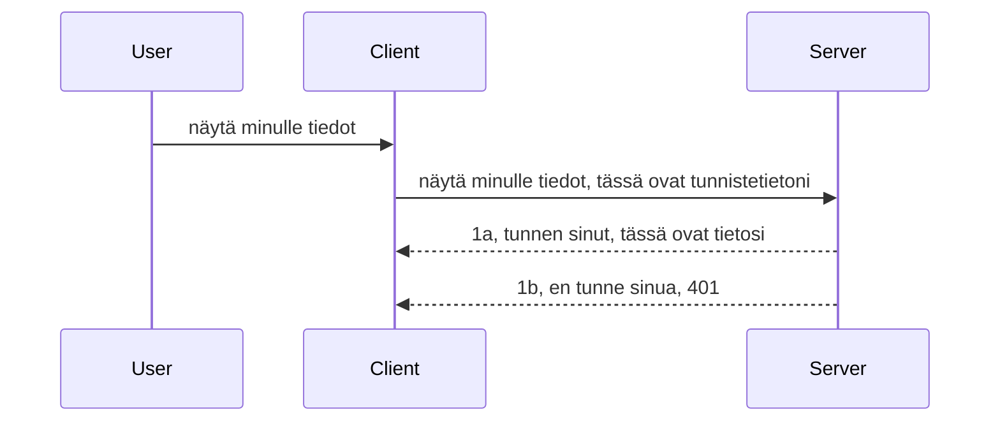

# Yksinkertainen tunnistus

MCP SDK:t tukevat OAuth 2.1:n käyttöä, mikä on rehellisesti sanottuna melko monimutkainen prosessi, johon liittyy käsitteitä kuten auth-palvelin, resurssipalvelin, tunnistetietojen lähettäminen, koodin saaminen, koodin vaihtaminen käyttäjätunnukseksi, kunnes lopulta voi saada resurssidatan. Jos et ole tottunut OAuth:iin, joka on hieno toteuttaa, on hyvä idea aloittaa jollain perusasteen tunnistuksella ja rakentaa siitä parempaa ja parempaa turvallisuutta kohti. Juuri siksi tämä luku on olemassa, rakentamaan sinua edistyneempään tunnistukseen.

## Tunnistus, mitä tällä tarkoitamme?

Tunnistus on lyhenne autentikaatiosta ja auktorisoinnista. Ajatuksena on, että meidän täytyy tehdä kahta asiaa:

- **Autentikaatio**, eli prosessi, jossa selvitetään, annammeko henkilön päästä taloomme, onko hänellä oikeus olla "täällä", eli onko hänellä pääsy resurssipalvelimellemme, jossa MCP-palvelimemme ominaisuudet sijaitsevat.
- **Auktorisointi**, on prosessi, jossa selvitetään, onko käyttäjällä lupa päästä näihin tiettyihin resursseihin, joita hän pyytää, esimerkiksi näihin tilauksiin tai tuotteisiin, tai onko hänellä lupa lukea sisältöä, mutta ei poistaa sitä, toisaalta.

## Tunnistetiedot: miten kerromme järjestelmälle keitä olemme

No, suurin osa web-kehittäjistä ajattelee tunnistetiedon toimittamista palvelimelle, yleensä salaisuutena, joka kertoo, saako hän olla täällä "Autentikaatio". Tämä tunnistetieto on yleensä base64-koodattu versio käyttäjätunnuksesta ja salasanasta tai API-avain, joka yksilöi tietyn käyttäjän.

Tämä käsittää sen lähettämisen otsakkeessa nimeltä "Authorization" näin:

```json
{ "Authorization": "secret123" }
```

Tätä kutsutaan yleensä perusautentikaatioksi. Miten kokonaisprosessi sitten toimii, on seuraava:


```mermaid
sequenceDiagram
   participant User
   participant Client
   participant Server

   User->>Client: näytä minulle tiedot
   Client->>Server: näytä minulle tiedot, tässä ovat tunnistetietoni
   Server-->>Client: 1a, tunnen sinut, tässä ovat tietosi
   Server-->>Client: 1b, en tunne sinua, 401 
```

Nyt kun ymmärrämme, miten se toimii prosessin näkökulmasta, miten sen toteutamme? Useimmissa web-palvelimissa on käsite nimeltä middleware, eli koodinpätkä, joka ajetaan osana pyyntöä ja voi tarkistaa tunnistetiedot ja jos ne ovat kelvolliset, antaa pyynnön läpi. Jos pyynnössä ei ole kelvollisia tunnistetietoja, saat virheen autentikaatiossa. Katsotaan, miten tämän voi toteuttaa:

**Python**

```python
class AuthMiddleware(BaseHTTPMiddleware):
    async def dispatch(self, request, call_next):

        has_header = request.headers.get("Authorization")
        if not has_header:
            print("-> Missing Authorization header!")
            return Response(status_code=401, content="Unauthorized")

        if not valid_token(has_header):
            print("-> Invalid token!")
            return Response(status_code=403, content="Forbidden")

        print("Valid token, proceeding...")
       
        response = await call_next(request)
        # lisää asiakasotsikoita tai muuta vastausta jollain tavalla
        return response


starlette_app.add_middleware(CustomHeaderMiddleware)
```

Tässä meillä on:

- Luotu middleware nimeltä `AuthMiddleware`, jonka `dispatch`-metodia web-palvelin kutsuu.
- Lisätty middleware web-palvelimeen:

    ```python
    starlette_app.add_middleware(AuthMiddleware)
    ```

- Kirjoitettu validointilogiikka, joka tarkistaa, onko Authorization-otsake läsnä ja onko lähetetty salaisuus kelvollinen:

    ```python
    has_header = request.headers.get("Authorization")
    if not has_header:
        print("-> Missing Authorization header!")
        return Response(status_code=401, content="Unauthorized")

    if not valid_token(has_header):
        print("-> Invalid token!")
        return Response(status_code=403, content="Forbidden")
    ```

    jos salaisuus on läsnä ja kelvollinen, annamme pyynnön mennä läpi kutsumalla `call_next` ja palautamme vastauksen.

    ```python
    response = await call_next(request)
    # lisää asiakasotsakkeet tai muuta vastausta jollain tavalla
    return response
    ```

Näin se toimii: jos web-pyyntö tehdään palvelimelle, middleware aktivoituu ja toteutuksensa perusteella joko päästää pyynnön läpi tai palauttaa virheen, joka kertoo, ettei asiakas saa jatkaa.

**TypeScript**

Tässä luomme middleware-ohjelman suositun Express-kehyksen avulla ja sieppaamme pyynnön ennen kuin se saavuttaa MCP-palvelimen. Tässä on koodi siihen:

```typescript
function isValid(secret) {
    return secret === "secret123";
}

app.use((req, res, next) => {
    // 1. Onko valtuutusotsikko läsnä?
    if(!req.headers["Authorization"]) {
        res.status(401).send('Unauthorized');
    }
    
    let token = req.headers["Authorization"];

    // 2. Tarkista kelpoisuus.
    if(!isValid(token)) {
        res.status(403).send('Forbidden');
    }

   
    console.log('Middleware executed');
    // 3. Lähetä pyyntö seuraavaan vaiheeseen pyyntöputkessa.
    next();
});
```

Tässä koodissa me:

1. Tarkistamme, onko Authorization-otsake ylipäänsä läsnä, jos ei ole, lähetämme 401-virheen.
2. Varmistamme tunnistetiedon/tokenin kelvollisuuden, jos ei, lähetämme 403-virheen.
3. Lopuksi välitämme pyynnön pyyntöketjuun ja palautamme pyydetyn resurssin.

## Harjoitus: Toteuta autentikaatio

Otetaan tietomme ja kokeillaan toteuttaa se. Tässä suunnitelma:

Palvelin

- Luo web-palvelin ja MCP-instanssi.
- Toteuta middleware palvelimelle.

Asiakas

- Lähetä web-pyyntö tunnistetiedon kanssa otsakkeessa.

### -1- Luo web-palvelin ja MCP-instanssi

> [!WARNING]
> Alla oleva TypeScript-esimerkki käyttää MCP:tä `2025-11-25`. Se seuraa kuljetuksia
> `mcp-session-id`:n perusteella eikä ole nykyinen `2026-07-28` kuljetusesimerkki. MCP
> `2026-07-28` poistaa `initialize`-kättelyn ja protokollasession ID:n; uudet
> toteutukset käyttävät itseensä sulautettuja pyyntöjä. Katso
> [Mitä MCP:ssä on muuttunut: 2026-07-28 Spesifikaatio](../../01-CoreConcepts/mcp-2026-07-28.md).

Ensimmäisessä vaiheessa meidän täytyy luoda web-palvelimen instanssi ja MCP-palvelin.

**Python**

Tässä luomme MCP-palvelimen instanssin, teemme starlette web-sovelluksen ja isännöimme sen uvicornilla.

```python
# luodaan MCP-palvelin

app = FastMCP(
    name="MCP Resource Server",
    instructions="Resource Server that validates tokens via Authorization Server introspection",
    host=settings["host"],
    port=settings["port"],
    debug=True
)

# luodaan starlette-verkkosovellus
starlette_app = app.streamable_http_app()

# tarjoillaan sovellusta uvicornin kautta
async def run(starlette_app):
    import uvicorn
    config = uvicorn.Config(
            starlette_app,
            host=app.settings.host,
            port=app.settings.port,
            log_level=app.settings.log_level.lower(),
        )
    server = uvicorn.Server(config)
    await server.serve()

run(starlette_app)
```

Tässä koodissa me:

- Luomme MCP-palvelimen.
- Rakennamme starlette web-sovelluksen MCP-palvelimesta, `app.streamable_http_app()`.
- Isännöimme ja tarjoamme web-sovellusta käyttäen uvicornia `server.serve()`.

**TypeScript**

Tässä luomme MCP-palvelimen instanssin.

```typescript
const server = new McpServer({
      name: "example-server",
      version: "1.0.0"
    });

    // ... asenna palvelinresurssit, työkalut ja kehotteet ...
```

Tämän MCP-palvelimen luomisen täytyy tapahtua POST /mcp -reititetyssä määritelmässä, joten siirrämme yllä olevan koodin sinne näin:

```typescript
import express from "express";
import { randomUUID } from "node:crypto";
import { McpServer } from "@modelcontextprotocol/sdk/server/mcp.js";
import { StreamableHTTPServerTransport } from "@modelcontextprotocol/sdk/server/streamableHttp.js";
import { isInitializeRequest } from "@modelcontextprotocol/sdk/types.js"

const app = express();
app.use(express.json());

// Kartta kuljetusten tallentamiseen istunnon tunnuksen mukaan
const transports: { [sessionId: string]: StreamableHTTPServerTransport } = {};

// Käsittele POST-pyynnöt asiakas-palvelin -viestintään
app.post('/mcp', async (req, res) => {
  // Tarkista olemassa oleva istunnon tunnus
  const sessionId = req.headers['mcp-session-id'] as string | undefined;
  let transport: StreamableHTTPServerTransport;

  if (sessionId && transports[sessionId]) {
    // Käytä uudelleen olemassa olevaa kuljetusta
    transport = transports[sessionId];
  } else if (!sessionId && isInitializeRequest(req.body)) {
    // Uusi alustuspyyntö
    transport = new StreamableHTTPServerTransport({
      sessionIdGenerator: () => randomUUID(),
      onsessioninitialized: (sessionId) => {
        // Tallenna kuljetus istunnon tunnuksen mukaan
        transports[sessionId] = transport;
      },
      // DNS:n uudelleensidonta-suojaus on oletuksena pois päältä taaksepäin yhteensopivuuden vuoksi. Jos ajat tämän palvelimen
      // paikallisesti, varmista että asetat:
      // enableDnsRebindingProtection: true,
      // allowedHosts: ['127.0.0.1'],
    });

    // Puhdista kuljetus kun se suljetaan
    transport.onclose = () => {
      if (transport.sessionId) {
        delete transports[transport.sessionId];
      }
    };
    const server = new McpServer({
      name: "example-server",
      version: "1.0.0"
    });

    // ... aseta palvelimen resurssit, työkalut ja kehotteet ...

    // Yhdistä MCP-palvelimeen
    await server.connect(transport);
  } else {
    // Virheellinen pyyntö
    res.status(400).json({
      jsonrpc: '2.0',
      error: {
        code: -32000,
        message: 'Bad Request: No valid session ID provided',
      },
      id: null,
    });
    return;
  }

  // Käsittele pyyntö
  await transport.handleRequest(req, res, req.body);
});

// Uudelleenkäytettävä käsittelijä GET- ja DELETE-pyynnöille
const handleSessionRequest = async (req: express.Request, res: express.Response) => {
  const sessionId = req.headers['mcp-session-id'] as string | undefined;
  if (!sessionId || !transports[sessionId]) {
    res.status(400).send('Invalid or missing session ID');
    return;
  }
  
  const transport = transports[sessionId];
  await transport.handleRequest(req, res);
};

// Käsittele GET-pyynnöt palvelimelta asiakkaalle SSE-välityksellä
app.get('/mcp', handleSessionRequest);

// Käsittele DELETE-pyynnöt istunnon lopettamiseksi
app.delete('/mcp', handleSessionRequest);

app.listen(3000);
```

Nyt näet, miten MCP-palvelimen luonti siirrettiin `app.post("/mcp")` sisälle.

Siirrytään seuraavaan vaiheeseen middleware:n luomiseksi, jotta voimme validoida saapuvan tunnistetiedon.

### -2- Toteuta middleware palvelimelle

Siirrytään middleware-osaan. Täällä luomme middleware:n, joka etsii tunnistetietoa `Authorization`-otsakkeesta ja validoi sen. Jos se hyväksytään, pyyntö jatkaa eteenpäin tekemään mitä tarvitsee (esim. listaa työkaluja, lue resurssi tai mitä MCP-asiakas pyysi).

**Python**

Middleware:n luomiseksi meidän täytyy tehdä luokka, joka perii `BaseHTTPMiddleware`:stä. Kaksi mielenkiintoista asiaa ovat:

- Pyyntö `request`, josta luemme otsaketiedot.
- `call_next`, callback, joka meidän täytyy kutsua, jos asiakas on tuonut tunnistetiedon, jonka hyväksymme.

Ensin meidän on käsiteltävä tapaus, jossa `Authorization`-otsake puuttuu:

```python
has_header = request.headers.get("Authorization")

# otsikko puuttuu, epäonnistuu tilakoodilla 401, muuten jatka.
if not has_header:
    print("-> Missing Authorization header!")
    return Response(status_code=401, content="Unauthorized")
```

Tässä lähetämme 401 unauthorized -viestin, koska asiakas epäonnistuu autentikoinnissa.

Seuraavaksi, jos tunnistetieto oli lähetetty, meidän täytyy tarkistaa sen kelvollisuus näin:

```python
 if not valid_token(has_header):
    print("-> Invalid token!")
    return Response(status_code=403, content="Forbidden")
```

Huomaa, miten lähettämme yllä 403 forbidden -viestin. Katsotaan täysi middleware, joka toteuttaa kaiken yllä kuvatun:

```python
class AuthMiddleware(BaseHTTPMiddleware):
    async def dispatch(self, request, call_next):

        has_header = request.headers.get("Authorization")
        if not has_header:
            print("-> Missing Authorization header!")
            return Response(status_code=401, content="Unauthorized")

        if not valid_token(has_header):
            print("-> Invalid token!")
            return Response(status_code=403, content="Forbidden")

        print("Valid token, proceeding...")
        print(f"-> Received {request.method} {request.url}")
        response = await call_next(request)
        response.headers['Custom'] = 'Example'
        return response

```

Hienoa, mutta entä `valid_token`-funktio? Tässä se on alla:

```python
# ÄLÄ käytä tuotannossa - paranna sitä !!
def valid_token(token: str) -> bool:
    # poista "Bearer " -etuliite
    if token.startswith("Bearer "):
        token = token[7:]
        return token == "secret-token"
    return False
```

Tämä pitäisi selvästi parantaa.

TÄRKEÄÄ: Sinun ei IKINÄ tulisi pitää tällaisia salaisuuksia koodissa. Sinun tulee mieluiten hakea vertailuarvo tietolähteestä tai IDP:ltä (identiteetin tarjoaja), tai vielä parempi, antaa IDP:n suorittaa validointi.

**TypeScript**

Tämän toteuttamiseksi Expressillä meidän täytyy kutsua `use`-metodia, joka ottaa middleware-funktiot.

Meidän täytyy:

- Tarkistaa pyyntömuuttuja ja lukea lähetetty tunnistetieto `Authorization`-ominaisuudesta.
- Validioida tunnistetieto ja jos se on kelvollinen, päästää pyyntö jatkamaan ja antaa asiakkaan MCP-pyynnön tehdä tarpeensa (esim. listaa työkaluja, lue resursseja tai muuta MCP-toiminnallisuutta).

Tässä tarkistamme, onko `Authorization`-otsake läsnä, ja jos ei ole, estämme pyynnön etenemisen:

```typescript
if(!req.headers["authorization"]) {
    res.status(401).send('Unauthorized');
    return;
}
```

Jos otsaketta ei lähetetä, saat 401-virheen.

Seuraavaksi tarkistamme, onko tunnistetieto kelvollinen, jos ei, pysäytämme pyynnön uudelleen, mutta hieman eri viestillä:

```typescript
if(!isValid(token)) {
    res.status(403).send('Forbidden');
    return;
} 
```

Huomaa, että nyt saat 403-virheen.

Tässä koko koodi:

```typescript
app.use((req, res, next) => {
    console.log('Request received:', req.method, req.url, req.headers);
    console.log('Headers:', req.headers["authorization"]);
    if(!req.headers["authorization"]) {
        res.status(401).send('Unauthorized');
        return;
    }
    
    let token = req.headers["authorization"];

    if(!isValid(token)) {
        res.status(403).send('Forbidden');
        return;
    }  

    console.log('Middleware executed');
    next();
});
```

Olemme määrittäneet web-palvelimen hyväksymään middleware:n, joka tarkistaa asiakkaan lähettämän tunnistetiedon. Entä asiakas itse?

### -3- Lähetä web-pyyntö tunnistetiedon kanssa otsakkeessa

Meidän täytyy varmistaa, että asiakas välittää tunnistetiedon otsakkeessa. Koska aiomme käyttää MCP-asiakasta tähän, meidän täytyy selvittää miten se tehdään.

**Python**

Asiakkaalle meidän täytyy välittää otsake tunnistetiedolla näin:

```python
# ÄLÄ kovakoodaa arvoa, pidä se vähintään ympäristömuuttujassa tai turvallisemmassa säilytystilassa
token = "secret-token"

async with streamablehttp_client(
        url = f"http://localhost:{port}/mcp",
        headers = {"Authorization": f"Bearer {token}"}
    ) as (
        read_stream,
        write_stream,
        session_callback,
    ):
        async with ClientSession(
            read_stream,
            write_stream
        ) as session:
            await session.initialize()
      
            # TODO, mitä haluat tehtävän asiakkaassa, esim. listaa työkalut, kutsu työkaluja jne.
```

Huomaa miten täytämme `headers`-ominaisuuden näin: ` headers = {"Authorization": f"Bearer {token}"}`.

**TypeScript**

Voimme ratkaista tämän kahdessa vaiheessa:

1. Täytä konfigurointikohde tunnistetiedoillamme.
2. Anna konfigurointikohde kuljetukselle.

```typescript

// ÄLÄ kovakoodaa arvoa kuten tässä on näytetty. Vähintäänkin käytä ympäristömuuttujaa ja jotain kuten dotenv (kehitystilassa).
let token = "secret123"

// määritä client transport -valintaobjekti
let options: StreamableHTTPClientTransportOptions = {
  sessionId: sessionId,
  requestInit: {
    headers: {
      "Authorization": "secret123"
    }
  }
};

// välitä valintaobjekti transportille
async function main() {
   const transport = new StreamableHTTPClientTransport(
      new URL(serverUrl),
      options
   );
```

Tässä näet, miten jouduimme luomaan `options`-objektin ja laittamaan otsakkeet `requestInit`-ominaisuuden alle.

TÄRKEÄÄ: Miten tätä parannetaan tästä eteenpäin? Nykyisessä toteutuksessa on joitain ongelmia. Ensinkin, tunnistetiedon lähettäminen näin on riskialtista, ellei vähintään ole HTTPS:ää. Siitä huolimatta tunnistetieto voidaan varastaa, joten tarvitset järjestelmän, jossa voit helposti peruuttaa tokenin ja lisätä lisätarkastuksia, kuten mistä päin maailmaa se tulee, tapahtuuko pyyntö liian usein (bottimainen käytös), lyhyesti sanottuna on valtavasti huolenaiheita.

Täytyy kuitenkin sanoa, että hyvin yksinkertaisille API:eille, joissa et halua kenenkään kutsuvan APIa ilman autentikointia, tämä on hyvä alku.

Tällä sanottuna, kokeillaan koventaa turvallisuutta hieman käyttämällä standardoitua muotoa kuten JSON Web Token, tunnetaan myös nimellä JWT tai "JOT"-tokenit.

## JSON Web Tokenit, JWT

Yritämme siis parantaa tilannetta lähettämällä hyvin yksinkertaisia tunnistetietoja. Mitkä ovat heti näkyvät edut, kun otamme JWT:n käyttöön?

- **Turvallisuuspäivitykset**. Perusautentikoinnissa lähetät käyttäjätunnus-salasana-parin base64-koodattuna tokenina (tai API-avaimen) yhä uudelleen, mikä lisää riskiä. JWT:n avulla lähetät käyttäjätunnuksen ja salasanan ja saat tokenin vastineeksi, ja se on myös aikarajoitettu eli vanhenee. JWT:n avulla voit helposti käyttää hienojakoista pääsynhallintaa roolien, laajuuksien ja oikeuksien avulla.
- **Tilattomuus ja skaalaus**. JWT:t ovat itseensä sulautettuja, ne sisältävät kaiken käyttäjätiedon ja poistavat tarpeen tallentaa istuntotietoa palvelimelle. Tokenin voi myös validoida paikallisesti.
- **Yhteentoimivuus ja integraatio**. JWT on Open ID Connectin keskiössä ja sitä käytetään tunnetuissa identiteetin tarjoajissa kuten Entra ID, Google Identity ja Auth0. Niillä on myös mahdollista käyttää kertakirjautumista ja paljon muuta, tehden siitä yritystason ratkaisun.
- **Modulaarisuus ja joustavuus**. JWT:tä voi käyttää myös API-portaaleissa kuten Azure API Management, NGINX ja muissa. Se tukee todennusskenaarioita ja palvelin-palvelu kommunikaatiota mukaan lukien valtuutus- ja valtuuttamisskenaariot.
- **Suorituskyky ja välimuisti**. JWT:tä voi tallentaa välimuistiin purkamisen jälkeen, mikä vähentää jäsennysvaatimuksia. Tämä auttaa erityisesti korkean liikenteen sovelluksissa, sillä se parantaa läpimenokapasiteettia ja vähentää kuormitusta infrastruktuurissa.
- **Edistyneet ominaisuudet**. Se tukee myös introspektiota (voimassaolon tarkistus palvelimella) ja peruutusta (tokenin mitätöinti).

Näillä eduilla katsotaan, miten voimme viedä toteutuksemme seuraavalle tasolle.

## Perustunnistuksesta JWT:hen

Tehdyt muutokset kokonaisuudessaan ovat:

- **Opi rakentamaan JWT-token** ja tehdä se valmiiksi lähetettäväksi asiakaskoodista palvelimelle.
- **Validoi JWT-token**, ja jos kelvollinen, anna asiakkaan käyttää resurssejamme.
- **Turvallinen tokenin säilytys**. Miten tallennamme tämän tokenin.
- **Suojaa reitit**. Meidän täytyy suojata reitit, meidän tapauksessa suojata reitit ja tietyn MCP-ominaisuudet.
- **Lisää päivitystokenit**. Varmista, että luomme lyhytikäisiä tokenneja sekä pitkäikäisiä päivitystokenneja, joilla voi saada uusia tokenneja vanhentuneiden tilalle. Varmista myös päivityspäätepiste sekä rotaatiostrategia.

### -1- Rakenna JWT-token

Ensin, JWT-tokenissa on seuraavat osat:

- **otsake**, algoritmi ja tokenin tyyppi.
- **sisältö**, eli väitteet, kuten sub (käyttäjä tai entiteetti, jota token edustaa. Autentikointitilanteissa yleensä käyttäjätunnus), exp (vanhenemisaika), role (rooli).
- **allekirjoitus**, joka on allekirjoitettu salaisuudella tai yksityisellä avaimella.

Tätä varten meidän täytyy rakentaa otsake, sisältö ja koodattu token.

**Python**

```python

import jwt
import jwt
from jwt.exceptions import ExpiredSignatureError, InvalidTokenError
import datetime

# Salainen avain JWT:n allekirjoittamiseen
secret_key = 'your-secret-key'

header = {
    "alg": "HS256",
    "typ": "JWT"
}

# käyttäjätiedot, niiden väitteet ja vanhentumisaika
payload = {
    "sub": "1234567890",               # Aihe (käyttäjän ID)
    "name": "User Userson",                # Mukautettu väite
    "admin": True,                     # Mukautettu väite
    "iat": datetime.datetime.utcnow(),# Annettu
    "exp": datetime.datetime.utcnow() + datetime.timedelta(hours=1)  # Vanhenee
}

# koodaa se
encoded_jwt = jwt.encode(payload, secret_key, algorithm="HS256", headers=header)
```

Yllä olevassa koodissa me olemme:

- Määritelleet otsakkeen, joka käyttää HS256-algoritmia ja tyypiksi JWT.
- Rakentaneet sisällön, joka sisältää aiheen tai käyttäjätunnuksen, käyttäjänimen, roolin, ajan, jolloin token myönnettiin, ja vanhenemisajan toteuttaen siten mainitun aikarajoitetun ominaisuuden.

**TypeScript**

Tähän tarvitsemme joitain riippuvuuksia, jotka auttavat meitä rakentamaan JWT-tokenin.

Riippuvuudet

```sh

npm install jsonwebtoken
npm install --save-dev @types/jsonwebtoken
```

Nyt kun se on selvillä, teemme otsakkeen, sisällön ja niiden kautta koodatun tokenin.

```typescript
import jwt from 'jsonwebtoken';

const secretKey = 'your-secret-key'; // Käytä ympäristömuuttujia tuotannossa

// Määritä sisältö
const payload = {
  sub: '1234567890',
  name: 'User usersson',
  admin: true,
  iat: Math.floor(Date.now() / 1000), // Myönnetty aikaan
  exp: Math.floor(Date.now() / 1000) + 60 * 60 // Vanhenee tunnin kuluttua
};

// Määritä otsikko (valinnainen, jsonwebtoken asettaa oletukset)
const header = {
  alg: 'HS256',
  typ: 'JWT'
};

// Luo tunnus
const token = jwt.sign(payload, secretKey, {
  algorithm: 'HS256',
  header: header
});

console.log('JWT:', token);
```

Tämä token on:

Allekirjoitettu HS256:lla
Kelvollinen 1 tunnin ajan
Sisältää väitteet kuten sub, name, admin, iat ja exp.

### -2- Validoi token

Meidän täytyy myös validoida token, tämä pitäisi tehdä palvelimella varmistaaksemme, että mitä asiakas lähettää, on todella kelvollista. Tässä on monia tarkistuksia, joita tulisi tehdä rakenteesta sen voimassaoloon. Lisäksi on suositeltavaa lisätä muitakin tarkistuksia, esimerkiksi onko käyttäjä järjestelmässäsi ja muuta.

Tokenin validoimiseksi meidän täytyy purkaa se, jotta voimme lukea sen ja alkaa tarkistaa sen kelpoisuus:

**Python**

```python

# Dekoodaa ja vahvista JWT
try:
    decoded = jwt.decode(token, secret_key, algorithms=["HS256"])
    print("✅ Token is valid.")
    print("Decoded claims:")
    for key, value in decoded.items():
        print(f"  {key}: {value}")
except ExpiredSignatureError:
    print("❌ Token has expired.")
except InvalidTokenError as e:
    print(f"❌ Invalid token: {e}")

```


Tässä koodissa kutsumme `jwt.decode` käyttäen syötteenä tokenia, salaisuutta ja valittua algoritmia. Huomaa, että käytämme try-catch-rakennetta, sillä epäonnistunut validointi johtaa virheen nostamiseen.

**TypeScript**

Tässä meidän pitää kutsua `jwt.verify` saadaksemme puretun version tokenista, jota voimme analysoida edelleen. Jos tämä kutsu epäonnistuu, se tarkoittaa että tokenin rakenne on virheellinen tai se ei enää ole voimassa.

```typescript

try {
  const decoded = jwt.verify(token, secretKey);
  console.log('Decoded Payload:', decoded);
} catch (err) {
  console.error('Token verification failed:', err);
}
```

HUOM: kuten aiemmin mainittu, meidän tulisi tehdä lisätarkistuksia varmistaaksemme, että tämä token viittaa käyttäjään järjestelmässämme ja että käyttäjällä on ne oikeudet, joita se väittää omaavansa.

Seuraavaksi tarkastellaan roolipohjaista käyttöoikeuksien hallintaa eli RBACia.

## Roolipohjaisen käyttöoikeuksien hallinnan lisääminen

Ajatuksena on ilmaista, että eri rooleilla on erilaisia oikeuksia. Esimerkiksi oletamme, että admin voi tehdä kaiken, normaali käyttäjä voi lukea ja kirjoittaa ja vieras voi vain lukea. Tässä joitakin mahdollisia käyttöoikeustasoja:

- Admin.Write
- User.Read
- Guest.Read

Katsotaan, miten voimme toteuttaa tällaisen hallinnan middlewarella. Middlewareja voidaan lisätä reittikohtaisesti tai kaikille reiteille.

**Python**

```python
from starlette.middleware.base import BaseHTTPMiddleware
from starlette.responses import JSONResponse
import jwt

# ÄLÄ laita salaista koodiin, tämä on vain demonstraatiota varten. Lue se turvallisesta paikasta.
SECRET_KEY = "your-secret-key" # laita tämä ympäristömuuttujaan
REQUIRED_PERMISSION = "User.Read"

class JWTPermissionMiddleware(BaseHTTPMiddleware):
    async def dispatch(self, request, call_next):
        auth_header = request.headers.get("Authorization")
        if not auth_header or not auth_header.startswith("Bearer "):
            return JSONResponse({"error": "Missing or invalid Authorization header"}, status_code=401)

        token = auth_header.split(" ")[1]
        try:
            decoded = jwt.decode(token, SECRET_KEY, algorithms=["HS256"])
        except jwt.ExpiredSignatureError:
            return JSONResponse({"error": "Token expired"}, status_code=401)
        except jwt.InvalidTokenError:
            return JSONResponse({"error": "Invalid token"}, status_code=401)

        permissions = decoded.get("permissions", [])
        if REQUIRED_PERMISSION not in permissions:
            return JSONResponse({"error": "Permission denied"}, status_code=403)

        request.state.user = decoded
        return await call_next(request)


```

Middleware voidaan lisätä esimerkiksi seuraavilla tavoilla:

```python

# Vaihtoehto 1: lisää middleware rakennettaessa starlette-sovellusta
middleware = [
    Middleware(JWTPermissionMiddleware)
]

app = Starlette(routes=routes, middleware=middleware)

# Vaihtoehto 2: lisää middleware sen jälkeen, kun starlette-sovellus on jo rakennettu
starlette_app.add_middleware(JWTPermissionMiddleware)

# Vaihtoehto 3: lisää middleware per reitti
routes = [
    Route(
        "/mcp",
        endpoint=..., # käsittelijä
        middleware=[Middleware(JWTPermissionMiddleware)]
    )
]
```

**TypeScript**

Voimme käyttää `app.use` ja middlewarea, joka suoritetaan kaikille pyynnöille.

```typescript
app.use((req, res, next) => {
    console.log('Request received:', req.method, req.url, req.headers);
    console.log('Headers:', req.headers["authorization"]);

    // 1. Tarkista, onko valtuutusotsikko lähetetty

    if(!req.headers["authorization"]) {
        res.status(401).send('Unauthorized');
        return;
    }
    
    let token = req.headers["authorization"];

    // 2. Tarkista, onko tunnus voimassa
    if(!isValid(token)) {
        res.status(403).send('Forbidden');
        return;
    }  

    // 3. Tarkista, onko tunnuksen käyttäjä olemassa järjestelmässämme
    if(!isExistingUser(token)) {
        res.status(403).send('Forbidden');
        console.log("User does not exist");
        return;
    }
    console.log("User exists");

    // 4. Varmista, että tunnuksella on oikeat käyttöoikeudet
    if(!hasScopes(token, ["User.Read"])){
        res.status(403).send('Forbidden - insufficient scopes');
    }

    console.log("User has required scopes");

    console.log('Middleware executed');
    next();
});

```

On useita asioita, joita meidän middlewarelta tulisi sallia ja MITÄ sen TULISI tehdä, nimittäin:

1. Tarkistaa, onko autorizaatio-otsikko olemassa
2. Tarkistaa, onko token voimassa, kutsumme `isValid`-metodia, jonka olemme kirjoittaneet JWT-tokenin eheyden ja voimassaolon tarkistamiseen.
3. Varmistaa, että käyttäjä on olemassa järjestelmässämme, tämä tulisi tarkistaa.

   ```typescript
    // käyttäjät tietokannassa
   const users = [
     "user1",
     "User usersson",
   ]

   function isExistingUser(token) {
     let decodedToken = verifyToken(token);

     // TEHTÄVÄ, tarkista onko käyttäjä olemassa tietokannassa
     return users.includes(decodedToken?.name || "");
   }
   ```

   Yllä olemme luoneet hyvin yksinkertaisen `users`-listan, jonka tulisi tietenkin sijaita tietokannassa.

4. Lisäksi meidän tulisi tarkistaa, että tokenilla on oikeat käyttöoikeudet.

   ```typescript
   if(!hasScopes(token, ["User.Read"])){
        res.status(403).send('Forbidden - insufficient scopes');
   }
   ```

   Tässä middlewaresta yllä olevassa koodissa tarkistamme, että token sisältää User.Read-oikeuden, jos ei niin lähetämme 403-virheen. Alla on helper-metodi `hasScopes`.

   ```typescript
   function hasScopes(scope: string, requiredScopes: string[]) {
     let decodedToken = verifyToken(scope);
    return requiredScopes.every(scope => decodedToken?.scopes.includes(scope));
  }
   ```

Have a think which additional checks you should be doing, but these are the absolute minimum of checks you should be doing.

Using Express as a web framework is a common choice. There are helpers library when you use JWT so you can write less code.

- `express-jwt`, helper library that provides a middleware that helps decode your token.
- `express-jwt-permissions`, this provides a middleware `guard` that helps check if a certain permission is on the token.

Here's what these libraries can look like when used:

```typescript
const express = require('express');
const jwt = require('express-jwt');
const guard = require('express-jwt-permissions')();

const app = express();
const secretKey = 'your-secret-key'; // put this in env variable

// Decode JWT and attach to req.user
app.use(jwt({ secret: secretKey, algorithms: ['HS256'] }));

// Check for User.Read permission
app.use(guard.check('User.Read'));

// multiple permissions
// app.use(guard.check(['User.Read', 'Admin.Access']));

app.get('/protected', (req, res) => {
  res.json({ message: `Welcome ${req.user.name}` });
});

// Error handler
app.use((err, req, res, next) => {
  if (err.code === 'permission_denied') {
    return res.status(403).send('Forbidden');
  }
  next(err);
});

```

Nyt kun olet nähnyt, miten middlewarea voidaan käyttää sekä autentikointiin että autorisointiin, entä MCP? Muuttaako se autentikointia? Selvitetään seuraavassa osiossa.

### -3- Lisää RBAC MCP:lle

Olet nähnyt, miten voit lisätä RBAC:m middlewarella, mutta MCP:lle ei ole helppoa tapaa lisätä RBAC:ia ominaisuuksittain, joten mitä teemme? Meidän on vain lisättävä koodi, joka tarkistaa tässä tapauksessa, onko asiakkaalla oikeudet kutsua tiettyä työkalua:

Sinulla on muutamia eri vaihtoehtoja, miten toteuttaa ominaisuuksittainen RBAC, tässä muutamia:

- Lisää tarkistus jokaiselle työkalulle, resurssille, kehotteelle, jossa tarvitset käyttöoikeustason tarkistuksen.

   **python**

   ```python
   @tool()
   def delete_product(id: int):
      try:
          check_permissions(role="Admin.Write", request)
      catch:
        pass # asiakas epäonnistui valtuutuksessa, nosta valtuutusvirhe
   ```

   **typescript**

   ```typescript
   server.registerTool(
    "delete-product",
    {
      title: Delete a product",
      description: "Deletes a product",
      inputSchema: { id: z.number() }
    },
    async ({ id }) => {
      
      try {
        checkPermissions("Admin.Write", request);
        // tehtävä, lähetä id productServiceen ja etäyhteyteen
      } catch(Exception e) {
        console.log("Authorization error, you're not allowed");  
      }

      return {
        content: [{ type: "text", text: `Deletected product with id ${id}` }]
      };
    }
   );
   ```


- Käytä kehittynyttä palvelinlähestymistapaa ja pyyntöjen käsittelijöitä, jotta minimoit tarkistusten määrän.

   **Python**

   ```python
   
   tool_permission = {
      "create_product": ["User.Write", "Admin.Write"],
      "delete_product": ["Admin.Write"]
   }

   def has_permission(user_permissions, required_permissions) -> bool:
      # user_permissions: käyttäjän omistamien oikeuksien lista
      # required_permissions: työkalun vaatimuslista oikeuksista
      return any(perm in user_permissions for perm in required_permissions)

   @server.call_tool()
   async def handle_call_tool(
     name: str, arguments: dict[str, str] | None
   ) -> list[types.TextContent]:
    # Oleta, että request.user.permissions on käyttäjän oikeuksien lista
     user_permissions = request.user.permissions
     required_permissions = tool_permission.get(name, [])
     if not has_permission(user_permissions, required_permissions):
        # Heitä virhe "Sinulla ei ole oikeutta kutsua työkalua {name}"
        raise Exception(f"You don't have permission to call tool {name}")
     # jatka ja kutsu työkalua
     # ...
   ```   
   

   **TypeScript**

   ```typescript
   function hasPermission(userPermissions: string[], requiredPermissions: string[]): boolean {
       if (!Array.isArray(userPermissions) || !Array.isArray(requiredPermissions)) return false;
       // Palauta tosi, jos käyttäjällä on vähintään yksi vaadittu lupa
       
       return requiredPermissions.some(perm => userPermissions.includes(perm));
   }
  
   server.setRequestHandler(CallToolRequestSchema, async (request) => {
      const { params: { name } } = request;
  
      let permissions = request.user.permissions;
  
      if (!hasPermission(permissions, toolPermissions[name])) {
         return new Error(`You don't have permission to call ${name}`);
      }
  
      // jatka..
   });
   ```

   Huomaa, että sinun on varmistettava, että middleware määrittää puretun tokenin pyynnön user-ominaisuuteen, jotta yllä oleva koodi on yksinkertaistettu.

### Yhteenveto

Nyt kun olemme käsitelleet, miten lisätä tuki RBAC:ille yleisesti ja MCP:lle erityisesti, on aika yrittää toteuttaa tietoturvaa itse varmistaaksesi, että olet ymmärtänyt esitetyt konseptit.

## Tehtävä 1: Rakenna MCP-palvelin ja MCP-asiakas perusautentikoinnilla

Tässä käytät oppimaasi tunnistetietojen lähettämisestä otsikoissa.

## Ratkaisu 1

[Ratkaisu 1](./code/basic/README.md)

## Tehtävä 2: Päivitä Ratkaisu 1 käyttämään JWT:tä

Ota ensimmäinen ratkaisu mutta parannetaan sitä nyt.

Perusautentikoinnin sijaan käytetään JWT:tä.

## Ratkaisu 2

[Ratkaisu 2](./solution/jwt-solution/README.md)

## Haaste

Lisää RBAC jokaiselle työkalulle osiossa "Lisää RBAC MCP:lle" kuvatulla tavalla.

## Yhteenveto

Toivottavasti olet oppinut paljon tässä luvussa, alkaen tietoturvattomuudesta, peruskäyttöoikeuksiin, JWT:hen ja miten se voidaan lisätä MCP:lle.

Olemme rakentaneet vahvan perustan mukautetuilla JWT:llä, mutta laajentuessa siirrymme kohti standardipohjaista identiteettimallia. IdP:n, kuten Entran tai Keycloakin, käyttöönotto antaa meille mahdollisuuden ulkoistaa tokenin luonti, validointi ja elinkaaren hallinta luotetulle alustalle – vapauttaen meidät keskittymään sovelluslogiikkaan ja käyttäjäkokemukseen.

Tätä varten meillä on edistyneempi [luku Entrasta](../../05-AdvancedTopics/mcp-security-entra/README.md)

## Mitä seuraavaksi

- Seuraavaksi: [MCP-isäntien asennus](../12-mcp-hosts/README.md)

---

<!-- CO-OP TRANSLATOR DISCLAIMER START -->
**Vastuuvapauslauseke**:
Tämä asiakirja on käännetty käyttämällä tekoälypohjaista käännöspalvelua [Co-op Translator](https://github.com/Azure/co-op-translator). Vaikka pyrimme tarkkuuteen, otathan huomioon, että automaattiset käännökset saattavat sisältää virheitä tai epätarkkuuksia. Alkuperäinen asiakirja sen alkuperäiskielellä on virallinen lähde. Tärkeissä asioissa suositellaan ammattimaista ihmiskäännöstä. Emme ole vastuussa tämän käännöksen käytöstä aiheutuvista väärinymmärryksistä tai tulkinnoista.
<!-- CO-OP TRANSLATOR DISCLAIMER END -->