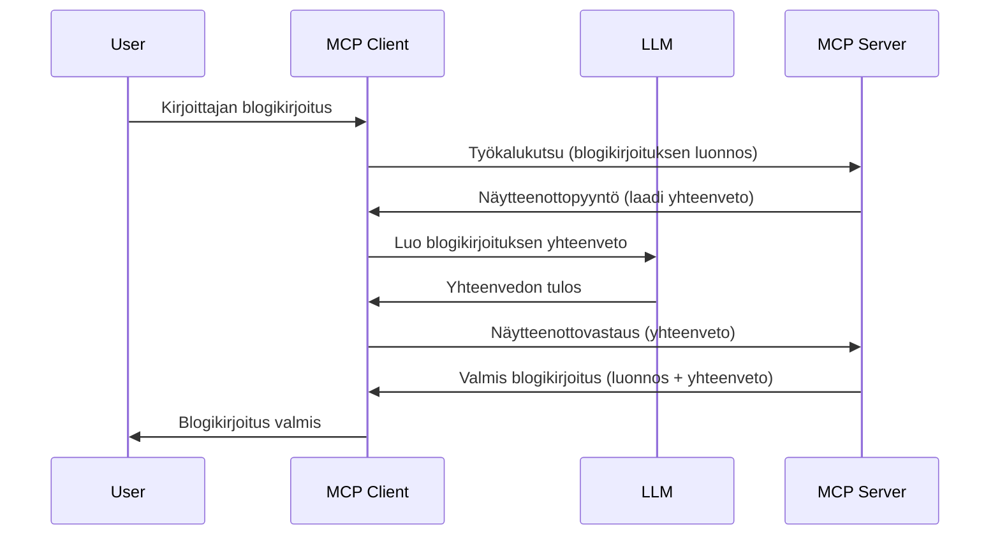

> [!WARNING]
> Otanta on poistumassa käytöstä MCP:ssä `2026-07-28`. Tätä oppituntia säilytetään
> vanhempia toteutuksia varten. Uusien palvelinten tulisi integroitua suoraan LLM:n
> tarjoajan API:in.

# Otanta - delegoi ominaisuudet asiakkaalle

> Otanta säilyy `2026-07-28`-määrittelyssä yhteensopivuuden vuoksi ja se voidaan
> poistaa ensimmäisessä uudistuksessa, joka julkaistaan tai sen jälkeen 28. heinäkuuta
> 2027. Tässä oppitunnissa esimerkit saattavat käyttää SDK API:ita, jotka toteuttavat
> `2025-11-25`. Katso [Mitä MCP:ssä on muuttunut: 2026-07-28:n määrittely](../../01-CoreConcepts/mcp-2026-07-28.md).

Perinteisissä toteutuksissa otanta antaa MCP-palvelimelle mahdollisuuden pyytää apua
asiakkaan hallitsemalta LLM:ltä. Uusissa toteutuksissa kutsu suoraan valitun LLM-tarjoajan
API:ta sen sijaan.

Tarkastellaanpa joitakin käyttötapauksia ja miten rakentaa ratkaisu, joka käyttää otantaa.

## Yleiskatsaus

Tässä oppitunnissa keskitymme selittämään, milloin ja missä otantaa käytetään sekä miten se konfiguroidaan.

## Oppimistavoitteet

Tässä luvussa:

- Selitämme, mitä otanta on ja milloin sitä käytetään.
- Näytämme, miten otanta konfiguroidaan MCP:ssä.
- Annamme esimerkkejä otannasta käytännössä.

## Mitä otanta on ja miksi sitä käytetään?

Otanta on kehittynyt ominaisuus, joka toimii seuraavasti:



### Otantapyyntö

Okei, nyt meillä on yleiskuva uskottavasta skenaariosta, puhutaanpa palvelimen lähettämästä otantapyynnöstä asiakkaalle. Tässä on esimerkki siitä JSON-RPC-muodossa:

```json
{
  "jsonrpc": "2.0",
  "id": 1,
  "method": "sampling/createMessage",
  "params": {
    "messages": [
      {
        "role": "user",
        "content": {
          "type": "text",
          "text": "Create a blog post summary of the following blog post: <BLOG POST>"
        }
      }
    ],
    "modelPreferences": {
      "hints": [
        {
          "name": "claude-3-sonnet"
        }
      ],
      "intelligencePriority": 0.8,
      "speedPriority": 0.5
    },
    "systemPrompt": "You are a helpful assistant.",
    "maxTokens": 100
  }
}
```

Tässä on muutama kohta, jotka kannattaa nostaa esiin:

- Kehote, kohdassa content -> text, on kehotteemme, joka on ohje LLM:lle tiivistää blogikirjoituksen sisältö.

- **modelPreferences**. Tämä osio on nimenomaan mieltymys, suositus siitä, millainen konfiguraatio LLM:ssä kannattaa käyttää. Käyttäjä saa päättää, noudattaako näitä suosituksia vai muuttaako niitä. Tässä tapauksessa suositellaan mallia, nopeus- ja älykkyysprioriteettia.
- **systemPrompt**, tämä on normaali järjestelmäkehotteesi, joka antaa LLM:llesi persoonallisuuden ja sisältää ohjeistuksia.
- **maxTokens**, tämä on toinen ominaisuus, joka kertoo, kuinka monta tokenia tälle tehtävälle suositaan.

### Otantavaste

Tämä vastaus on se, jonka MCP-asiakas lopulta lähettää MCP-palvelimelle, ja se on seurausta asiakkaan kutsusta LLM:ään, joka odottaa vastauksen ja sitten rakentaa tämän viestin. Tässä esimerkki JSON-RPC-muodossa:

```json
{
  "jsonrpc": "2.0",
  "id": 1,
  "result": {
    "role": "assistant",
    "content": {
      "type": "text",
      "text": "Here's your abstract <ABSTRACT>"
    },
    "model": "gpt-5",
    "stopReason": "endTurn"
  }
}
```

Huomioi, että vastaus on blogikirjoituksen tiivistelmä juuri sellaisena kuin pyysimme. Lisäksi huomaa, että käytetty `model` ei ole se, jota pyysimme, vaan "gpt-5" "claude-3-sonnetin" sijaan. Tämä havainnollistaa, että käyttäjä voi muuttaa mieltään mitä käyttää, ja että otantapyyntösi on suositus.

Okei, nyt kun ymmärrämme päävirtauksen ja hyödyllisen käyttötapauksen "blogikirjoituksen luominen + tiivistelmä", katsotaan mitä pitää tehdä, jotta se toimii.

### Viestityypit

Otantaviestit eivät rajoitu pelkkään tekstiin, vaan voit myös lähettää kuvia ja ääntä. Tässä ero JSON-RPC:ssa:

**Teksti**

```json
{
  "type": "text",
  "text": "The message content"
}
```

**Kuvasisältö**

```json
{
  "type": "image",
  "data": "base64-encoded-image-data",
  "mimeType": "image/jpeg"
}
```

**Äänisisältö**

```json
{
  "type": "audio",
  "data": "base64-encoded-audio-data",
  "mimeType": "audio/wav"
}
```

> HUOM: Nykyisestä tilasta ja siirtymäohjeista katso
> [poistunut otanta-dokumentaatio](https://modelcontextprotocol.io/specification/2026-07-28/client/sampling).

## Näin konfiguroit otannan asiakkaassa

> Huom: jos rakennat vain palvelinta, sinun ei tarvitse tehdä juuri mitään tässä.

Asiakkaassa sinun tulee määrittää seuraava ominaisuus seuraavasti:

```json
{
  "capabilities": {
    "sampling": {}
  }
}
```

Tämä otetaan käyttöön, kun valittu asiakas alustaa yhteyden palvelimeen.

## Esimerkki otannasta käytännössä - Luo blogikirjoitus

Koodataan otantapalvelin yhdessä, meidän tulee tehdä seuraavat:

1. Luo työkalu palvelimelle.
1. Kyseisen työkalun tulee luoda otantapyyntö.
1. Työkalun tulee odottaa, että asiakkaan otantapyyntöön vastataan.
1. Sitten työkalun tulos tuotetaan.

Käydään koodi läpi vaihe vaiheelta:

### -1- Luo työkalu

**python**

```python
@mcp.tool()
async def create_blog(title: str, content: str, ctx: Context[ServerSession, None]) -> str:
    """Create a blog post and generate a summary"""

```

### -2- Luo otantapyyntö

Laajenna työkalua seuraavalla koodilla:

**python**

```python
post = BlogPost(
        id=len(posts) + 1,
        title=title,
        content=content,
        abstract=""
    )

prompt = f"Create an abstract of the following blog post: title: {title} and draft: {content} "

result = await ctx.session.create_message(
        messages=[
            SamplingMessage(
                role="user",
                content=TextContent(type="text", text=prompt),
            )
        ],
        max_tokens=100,
)

```

### -3- Odota vastausta ja palauta se

**python**

```python
post.abstract = result.content.text

posts.append(post)

# palauta koko tuote
return json.dumps({
    "id": post.title,
    "abstract": post.abstract
})
```

### -4- Täysi koodi

**python**

```python
from starlette.applications import Starlette
from starlette.routing import Mount, Host

from mcp.server.fastmcp import Context, FastMCP

from mcp.server.session import ServerSession
from mcp.types import SamplingMessage, TextContent

import json


from uuid import uuid4
from typing import List
from pydantic import BaseModel


mcp = FastMCP("Blog post generator")

# app = FastAPI()

posts = []

class BlogPost(BaseModel):
    id: int
    title: str
    content: str
    abstract: str

posts: List[BlogPost] = []

@mcp.tool()
async def create_blog(title: str, content: str, ctx: Context[ServerSession, None]) -> str:
    """Create a blog post and generate a summary"""

    post = BlogPost(
        id=len(posts) + 1,
        title=title,
        content=content,
        abstract=""
    )

    prompt = f"Create an abstract of the following blog post: title: {title} and draft: {content} "

    result = await ctx.session.create_message(
        messages=[
            SamplingMessage(
                role="user",
                content=TextContent(type="text", text=prompt),
            )
        ],
        max_tokens=100,
    )

    post.abstract = result.content.text

    posts.append(post)

    # palauttaa koko blogikirjoituksen
    return json.dumps({
        "id": post.title,
        "abstract": post.abstract
    })

if __name__ == "__main__":
    print("Starting server...")
    # mcp.run()
    mcp.run(transport="streamable-http")

# suorita sovellus komennolla: python server.py
```

### -5- Testaa Visual Studio Codessa

Testataksesi tämän Visual Studio Codessa, tee seuraavasti:

1. Käynnistä palvelin terminaalissa
1. Lisää se *mcp.json*-tiedostoon (ja varmista että se on käynnissä), esimerkiksi näin:

   ```json
   "servers": {
      "blog-server": {
        "type": "http",
        "url": "http://localhost:8000/mcp"
      }
   }
   ```

1. Kirjoita kehotus:

   ```text
   create a blog post named "Where Python comes from", the content is "Python is actually named after Monty Python Flying Circus"
   ```

1. Salli otanta tapahtua. Ensimmäisellä kerralla sinulta kysytään hyväksyntää lisävalintaikkunassa, sen jälkeen näet normaalin ikkunan, jossa sinua pyydetään suorittamaan työkalu.

1. Tarkastele tuloksia. Näet tulokset siististi renderöitynä GitHub Copilot Chatissa, mutta voit myös tarkastella raakaa JSON-vastausta.

**Bonus**. Visual Studio Coden työkalut tukevat erinomaisesti otantaa. Voit konfiguroida otannan käytön asennetussa palvelimessasi seuraavasti:

1. Siirry laajennososioon.
1. Valitse rataskuvake asennetun palvelimen kohdalta "MCP SERVERS - INSTALLED" -osiossa.
1 Valitse "Configure Model Access", täällä voit valita mitkä mallit GitHub Copilot saa käyttää otanta-toiminnossa. Voit myös nähdä kaikki viimeaikaiset otantapyynnöt valitsemalla "Show Sampling requests".

## Harjoitus

Tässä harjoituksessa rakennat hieman erilaisen otannan, nimittäin otantaintegraation, joka tukee tuotteen kuvauksen luomista. Tässä skenaariosi:

**Skenaario**: Verkkokaupan back office -työntekijä tarvitsee apua, tuotetekstien laatiminen vie liikaa aikaa. Siksi rakennat ratkaisun, jossa voit kutsua työkalua "create_product" parametrien "title" ja "keywords" kanssa, ja sen tulee tuottaa valmis tuote sisältäen "description"-kentän, jonka asiakas-LLM täyttää.

VINKKI: käytä aiemmin opittua rakentaaksesi tämän palvelimen ja sen työkalun otantapyynnön avulla.

## Ratkaisu

[Ratkaisu](./solution/README.md)

## Tärkeimmät opit


Otanta on tehokas ominaisuus, jonka avulla palvelin voi delegoida tehtäviä asiakkaalle, kun se tarvitsee LLM:n apua.

## Mitä seuraavaksi

- [Luku 4 - Käytännön toteutus](../../04-PracticalImplementation/README.md)

---

<!-- CO-OP TRANSLATOR DISCLAIMER START -->
**Vastuuvapauslauseke**:
Tämä asiakirja on käännetty käyttämällä tekoälypohjaista käännöspalvelua [Co-op Translator](https://github.com/Azure/co-op-translator). Vaikka pyrimme tarkkuuteen, otathan huomioon, että automaattiset käännökset saattavat sisältää virheitä tai epätarkkuuksia. Alkuperäinen asiakirja sen alkuperäiskielellä on virallinen lähde. Tärkeissä asioissa suositellaan ammattimaista ihmiskäännöstä. Emme ole vastuussa tämän käännöksen käytöstä aiheutuvista väärinymmärryksistä tai tulkinnoista.
<!-- CO-OP TRANSLATOR DISCLAIMER END -->