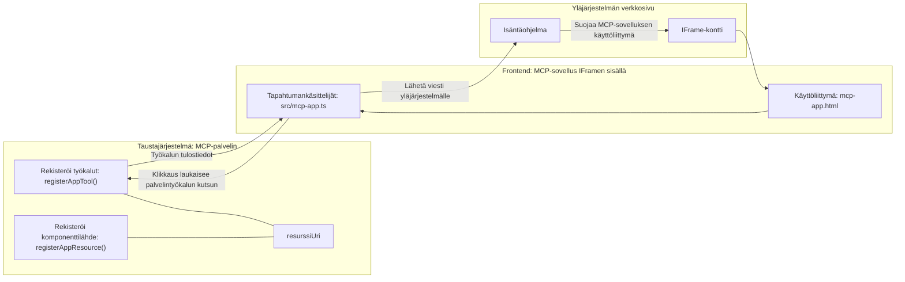
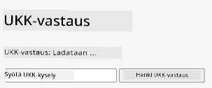
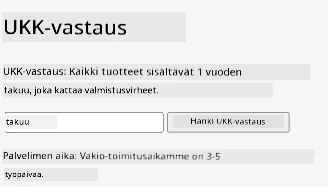
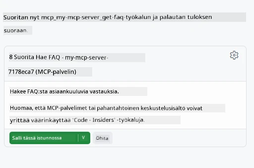
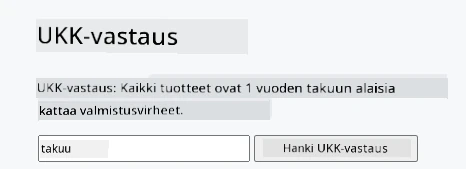

# MCP-sovellukset

MCP-sovellukset ovat uusi paradigma MCP:ssä. Ajatuksena on, että et pelkästään vastaa työkalukutsun palauttamalla dataa, vaan tarjoat myös tietoa siitä, miten tähän tietoon tulisi olla vuorovaikutuksessa. Tämä tarkoittaa, että työkalun tulokset voivat nyt sisältää käyttöliittymätietoja. Miksi haluaisimme tätä? No, mieti miten toimit tänään. Todennäköisesti käytät MCP-palvelimen tuloksia laittamalla jonkin tyyppisen käyttöliittymän sen eteen, se on koodia jota sinun täytyy kirjoittaa ja ylläpitää. Joskus juuri sitä tarvitset, mutta toisinaan olisi hienoa, jos voisit tuoda mukaan itsenäisen tietopalan, jossa on kaikki datasta käyttöliittymään.

## Yleiskatsaus

Tämä oppitunti tarjoaa käytännön ohjeita MCP-sovelluksista, miten päästä alkuun niiden kanssa ja miten integroida ne olemassa oleviin web-sovelluksiisi. MCP-sovellukset ovat hyvin uusi lisä MCP-standardiin.

## Oppimistavoitteet

Tämän oppitunnin lopussa osaat:

- Selittää, mitä MCP-sovellukset ovat.
- Milloin käyttää MCP-sovelluksia.
- Rakentaa ja integroida omia MCP-sovelluksia.

## MCP-sovellukset – miten ne toimivat

MCP-sovelluksissa ideana on tarjota vastaus, joka käytännössä on komponentti renderöitäväksi. Tällaisella komponentilla voi olla sekä visuaalisuus että vuorovaikutteisuus, esimerkiksi painallukset, käyttäjän syötteet ja muuta. Aloitetaan palvelinpuolelta ja MCP-palvelimestamme. Luoaksesi MCP-sovelluskomponentin tarvitset työkalun mutta myös sovellusresurssin. Nämä kaksi puolta yhdistetään resourceUri:n kautta.

Tässä on esimerkki. Yritetään visualisoida, mitä kaikkea kuuluu ja mitkä osat tekevät mitäkin:

```text
server.ts -- responsible for registering tools and the component as a UI component
src/
  mcp-app.ts -- wiring up event handlers
mcp-app.html -- the user interface
```

Tämä kuvaus kuvaa arkkitehtuuria komponentin ja sen logiikan luomiseksi.


Yritetään seuraavaksi kuvata vastuut backendille ja frontendille erikseen.

### Backend

Täällä pitää tehdä kaksi asiaa:

- Rekisteröidä työkalut, joiden kanssa halutaan olla vuorovaikutuksessa.
- Määritellä komponentti.

**Työkalun rekisteröinti**

```typescript
registerAppTool(
    server,
    "get-time",
    {
      title: "Get Time",
      description: "Returns the current server time.",
      inputSchema: {},
      _meta: { ui: { resourceUri } }, // Linkittää tämän työkalun sen käyttöliittymäresurssiin
    },
    async () => {
      const time = new Date().toISOString();
      return { content: [{ type: "text", text: time }] };
    },
  );

```

Edellinen koodi määrittelee käyttäytymisen, jossa se paljastaa työkalun nimeltä `get-time`. Se ei ota syötteitä, mutta lopulta tuottaa nykyisen ajan. Meillä on myös mahdollisuus määritellä `inputSchema` työkaluja varten, joissa tarvitaan käyttäjän syötteen hyväksymistä.

**Komponentin rekisteröinti**

Saman tiedoston sisällä meidän pitää myös rekisteröidä komponentti:

```typescript
const resourceUri = "ui://get-time/mcp-app.html";

// Rekisteröi resurssi, joka palauttaa UI:lle pakatun HTML/JavaScriptin.
registerAppResource(
  server,
  resourceUri,
  resourceUri,
  { mimeType: RESOURCE_MIME_TYPE },
  async () => {
    const html = await fs.readFile(path.join(DIST_DIR, "mcp-app.html"), "utf-8");

    return {
    contents: [
        { uri: resourceUri, mimeType: RESOURCE_MIME_TYPE, text: html },
    ],
    };
  },
);
```

Huomaa, miten mainitsemme `resourceUri` yhdistääksemme komponentin sen työkaluihin. Kiinnostava on myös callback, jossa ladataan UI-tiedosto ja palautetaan komponentti.

### Komponentin frontend

Kuten backendillä, myös frontendissä on kaksi osaa:

- Puhdas HTML:llä kirjoitettu frontend.
- Koodi, joka käsittelee tapahtumia ja mitä tehdä, esimerkiksi soittaa työkaluja tai lähettää viestejä isäntäikkunalle.

**Käyttöliittymä**

Katsotaan käyttöliittymää.

```html
<!-- mcp-app.html -->
<!DOCTYPE html>
<html lang="en">
  <head>
    <meta charset="UTF-8" />
    <title>Get Time App</title>
  </head>
  <body>
    <p>
      <strong>Server Time:</strong> <code id="server-time">Loading...</code>
    </p>
    <button id="get-time-btn">Get Server Time</button>
    <script type="module" src="/src/mcp-app.ts"></script>
  </body>
</html>
```

**Tapahtumien kytkentä**

Viimeinen osa on tapahtumien kytkentä. Tämä tarkoittaa, että tunnistamme UI:n osat, joihin tarvitaan tapahtumakäsittelijöitä ja mitä tehdä, jos tapahtumia nostetaan:

```typescript
// mcp-app.ts

import { App } from "@modelcontextprotocol/ext-apps";

// Hae elementtiviitteet
const serverTimeEl = document.getElementById("server-time")!;
const getTimeBtn = document.getElementById("get-time-btn")!;

// Luo sovellusinstanssi
const app = new App({ name: "Get Time App", version: "1.0.0" });

// Käsittele työkalun tuloksia palvelimelta. Aseta ennen `app.connect()`, jotta ei jää huomaamatta
// alkuperäistä työkalun tulosta.
app.ontoolresult = (result) => {
  const time = result.content?.find((c) => c.type === "text")?.text;
  serverTimeEl.textContent = time ?? "[ERROR]";
};

// Yhdistä napin klikkaus
getTimeBtn.addEventListener("click", async () => {
  // `app.callServerTool()` antaa käyttöliittymän pyytää tuoreita tietoja palvelimelta
  const result = await app.callServerTool({ name: "get-time", arguments: {} });
  const time = result.content?.find((c) => c.type === "text")?.text;
  serverTimeEl.textContent = time ?? "[ERROR]";
});

// Yhdistä isäntään
app.connect();
```

Kuten yllä näkyy, tämä on normaalia koodia DOM-elementtien yhdistämiseksi tapahtumiin. Kannattaa huomioida kutsu `callServerTool`, joka kutsuu työkalua backendillä.

## Käyttäjän syötteen käsittely

Tähän asti olemme nähneet komponentin, jossa napin painallus kutsuu työkalua. Katsotaan voimmeko lisätä UI-elementtejä, kuten syöttökentän, ja lähettää argumentteja työkalulle. Toteutetaan FAQ-toiminnallisuus. Näin sen pitäisi toimia:

- Käyttöliittymässä pitää olla nappi ja syöte-elementti, johon käyttäjä kirjoittaa hakusanan, esimerkiksi "Shipping". Tämä kutsuu backendin työkalua, joka tekee haun FAQ-datassa.
- Työkalu, joka tukee mainittua FAQ-hakua.

Lisätään ensin tarvittava tuki backendille:

```typescript
const faq: { [key: string]: string } = {
    "shipping": "Our standard shipping time is 3-5 business days.",
    "return policy": "You can return any item within 30 days of purchase.",
    "warranty": "All products come with a 1-year warranty covering manufacturing defects.",
  }

registerAppTool(
    server,
    "get-faq",
    {
      title: "Search FAQ",
      description: "Searches the FAQ for relevant answers.",
      inputSchema: zod.object({
        query: zod.string().default("shipping"),
      }),
      _meta: { ui: { resourceUri: faqResourceUri } }, // Linkittää tämän työkalun sen käyttöliittymäresurssiin
    },
    async ({ query }) => {
      const answer: string = faq[query.toLowerCase()] || "Sorry, I don't have an answer for that.";
      return { content: [{ type: "text", text: answer }] };
    },
  );
```

Tässä näemme, miten täytämme `inputSchema` ja annamme sille `zod`-skeeman seuraavasti:

```typescript
inputSchema: zod.object({
  query: zod.string().default("shipping"),
})
```

Yllä olevassa skeemassa julistamme, että meillä on syöteparametri nimeltä `query`, joka on valinnainen ja oletuksena "shipping".

Ok, siirrytään *mcp-app.html*:ään katsomaan, millaisen käyttöliittymän meidän pitää tehdä:

```html
<div class="faq">
    <h1>FAQ response</h1>
    <p>FAQ Response: <code id="faq-response">Loading...</code></p>
    <input type="text" id="faq-query" placeholder="Enter FAQ query" />
    <button id="get-faq-btn">Get FAQ Response</button>
  </div>
```

Hienoa, nyt meillä on syöte ja nappi. Mennään seuraavaksi *mcp-app.ts*:iin yhdistämään nämä tapahtumat:

```typescript
const getFaqBtn = document.getElementById("get-faq-btn")!;
const faqQueryInput = document.getElementById("faq-query") as HTMLInputElement;

getFaqBtn.addEventListener("click", async () => {
  const query = faqQueryInput.value;
  const result = await app.callServerTool({ name: "get-faq", arguments: { query } });
  const faq = result.content?.find((c) => c.type === "text")?.text;
  faqResponseEl.textContent = faq ?? "[ERROR]";
});
```

Yllä olevassa koodissa:

- Luomme viittauksia kiinnostaviin UI-elementteihin.
- Käsittelemme napin painalluksen lukemalla syötekentän arvon, ja kutsumme myös `app.callServerTool()` -metodia `name` ja `arguments` kanssa, jossa jälkimmäinen välittää `query`-arvon.

Mitä todella tapahtuu, kun kutsut `callServerTool` on se, että se lähettää viestin isäntäikkunalle, ja tuo ikkuna kutsuu MCP-palvelinta.

### Kokeile itse

Kun kokeilet tätä, näet seuraavan:



Ja tässä kokeillaan syötteen kanssa kuten "warranty"



Käynnistääksesi tämän koodin, siirry kohtaan [Koodiosio](./code/README.md)

## Testaus Visual Studio Codessa

Visual Studio Codessa on erinomainen tuki MVP-sovelluksille ja se on luultavasti yksi helpoimmista tavoista testata MCP-sovelluksiasi. Käyttääksesi Visual Studio Codea, lisää palvelinmääritys *mcp.json* -tiedostoon seuraavasti:

```json
"my-mcp-server-7178eca7": {
    "url": "http://localhost:3001/mcp",
    "type": "http"
  }
```

Käynnistä sitten palvelin, sinun pitäisi pystyä kommunikoimaan MVP-sovelluksesi kanssa Chat-ikkunan kautta, mikäli sinulla on GitHub Copilot asennettuna.

Käynnistä se kehotteella, esimerkiksi "#get-faq":



Ja kuten kun ajoit sen selaimella, se renderöityy samalla tavalla:



## Tehtävä

Luo kivi-paperi-sakset-peli. Sen tulee sisältää seuraavat osat:

Käyttöliittymä:

- pudotusvalikko vaihtoehdoilla
- nappi valinnan lähettämistä varten
- etiketti, joka näyttää kuka valitsi mitä ja kuka voitti

Palvelin:

- Työkalu kivi-paperi-sakset, joka ottaa "choice" sisään
- Sen tulee generoida tietokoneen valinta ja määrittää voittaja

## Ratkaisu

[Ratkaisu](./assignment/README.md)

## Yhteenveto

Opimme tästä uudesta MCP-sovellusparadigmasta. Se on uusi paradigma, joka antaa MCP-palvelimille mahdollisuuden olla mielipide paitsi datasta myös siitä, miten data pitäisi esittää.

Lisäksi opimme, että nämä MCP-sovellukset isännöidään IFrameen ja kommunikoidakseen MCP-palvelimien kanssa ne tarvitsevat lähettää viestejä vanhemmalle web-sovellukselle. On olemassa useita kirjastoja sekä tavalliseen JavaScriptiin että Reactiin ja muuhun, jotka tekevät tästä kommunikoinnista helpompaa.

## Tärkeimmät opit

Tässä mitä opit:

- MCP-sovellukset ovat uusi standardi, joka voi olla hyödyllinen, kun haluat toimittaa sekä dataa että UI-ominaisuuksia.
- Tällaiset sovellukset ajetaan IFramessa turvallisuussyistä.

## Mitä seuraavaksi

- [Luku 4](../../04-PracticalImplementation/README.md)

---

<!-- CO-OP TRANSLATOR DISCLAIMER START -->
**Vastuuvapauslauseke**:
Tämä asiakirja on käännetty käyttämällä tekoälypohjaista käännöspalvelua [Co-op Translator](https://github.com/Azure/co-op-translator). Vaikka pyrimme tarkkuuteen, on hyvä olla tietoinen siitä, että automaattiset käännökset saattavat sisältää virheitä tai epätarkkuuksia. Alkuperäistä asiakirjaa sen alkuperäisellä kielellä tulee pitää virallisena lähteenä. Tärkeissä asioissa suositellaan ammattilaisen tekemää ihmiskäännöstä. Emme ole vastuussa tämän käännöksen käytöstä aiheutuvista väärinymmärryksistä tai tulkinnoista.
<!-- CO-OP TRANSLATOR DISCLAIMER END -->