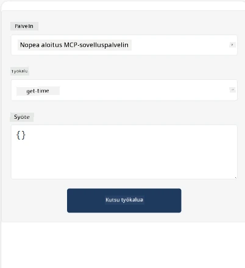
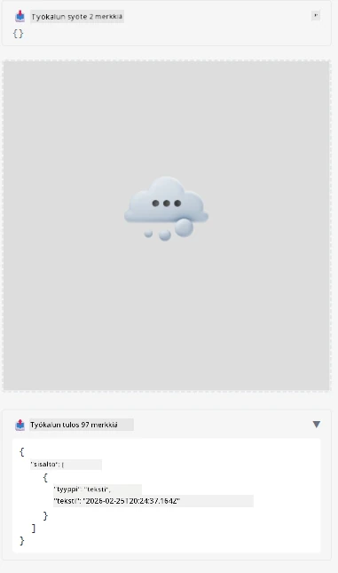

Tässä on esimerkki MCP-sovelluksen käytöstä

## Asennus

1. Siirry *mcp-app*-kansioon
1. Suorita `npm install`, tämän pitäisi asentaa frontend- ja backend-riippuvuudet

Varmista backendin kääntyminen suorittamalla:

```sh
npx tsc --noEmit
```

Jos kaikki on kunnossa, ei pitäisi näkyä mitään tulostetta.

## Aja backend

> Tämä vaatii hieman lisätyötä, jos käytät Windows-konetta, sillä MCP Apps -ratkaisu käyttää `concurrently`-kirjastoa, jolle sinun täytyy löytää korvike. Tässä on kyseinen rivi *package.json*-tiedostosta MCP Appissa:

    ```json
    "start": "concurrently \"cross-env NODE_ENV=development INPUT=mcp-app.html vite build --watch\" \"tsx watch main.ts\""
    ```

Tämä sovellus koostuu kahdesta osasta, backend-osiosta ja host-osiosta.

Käynnistä backend kutsumalla:

```sh
npm start
```

Tämän pitäisi käynnistää backend osoitteessa `http://localhost:3001/mcp`.

> Huomaa, että jos olet Codespacessa, sinun täytyy asettaa portin näkyvyys julkiseksi. Tarkista että pääset päätelaitteeseen selaimella osoitteen https://<Codespacen nimi>.app.github.dev/mcp kautta

## Vaihtoehto -1 Testaa sovellus Visual Studio Codessa

Ratkaisun testaamiseksi Visual Studio Codessa, tee seuraavasti:

- Lisää palvelintieto `mcp.json`-tiedostoon näin:

    ```json
    {
        "servers": {
            "my-mcp-server-7178eca7": {
                "url": "http://localhost:3001/mcp",
                "type": "http"
            }
        },
        "inputs": []
    }
    ```

1. Klikkaa "start"-painiketta *mcp.json*:ssa
1. Varmista, että keskusteluikkuna on auki ja kirjoita `get-faq`, sinun pitäisi nähdä tulos seuraavasti:

    

## Vaihtoehto -2- Testaa sovellus hostin kanssa

Repossa <https://github.com/modelcontextprotocol/ext-apps> on useita eri hosteja, joita voit käyttää MVP-sovellusten testaamiseen.

Tarjoamme tässä kaksi eri vaihtoehtoa:

### Paikallinen kone

- Siirry *ext-apps* -kansioon sen jälkeen, kun olet kloonannut repon.

- Asenna riippuvuudet

   ```sh
   npm install
   ```

- Avaa erillinen terminaali ja siirry *ext-apps/examples/basic-host*

    > Jos käytät Codespacea, sinun täytyy avata serve.ts ja riviltä 27 korvata http://localhost:3001/mcp Codespacen backendin URL-osoitteella, esimerkiksi https://psychic-xylophone-657rpjgvxpc5g64-3001.app.github.dev/mcp

- Käynnistä host:

    ```sh
    npm start
    ```

    Tämän pitäisi yhdistää host backendiin ja sinun pitäisi nähdä sovelluksen toimivan seuraavasti:

    

### Codespace

Codespace-ympäristön käyttöönotto vaatii hieman lisätyötä. Käyttääksesi hostia Codespacen kautta:

- Katso *ext-apps* -hakemistoa ja siirry *examples/basic-host* -kansioon.
- Suorita `npm install` asentaaksesi riippuvuudet
- Suorita `npm start` käynnistääksesi hostin.

## Testaa sovellusta

Kokeile sovellusta seuraavasti:

- Valitse "Call Tool" -painike ja sinun pitäisi nähdä tulokset seuraavasti:

    

Hienoa, kaikki toimii.

---

<!-- CO-OP TRANSLATOR DISCLAIMER START -->
**Vastuuvapauslauseke**:
Tämä asiakirja on käännetty käyttämällä tekoälypohjaista käännöspalvelua [Co-op Translator](https://github.com/Azure/co-op-translator). Pyrimme tarkkuuteen, mutta huomioithan, että automatisoiduissa käännöksissä saattaa esiintyä virheitä tai epätarkkuuksia. Alkuperäinen asiakirja sen alkuperäiskielellä tulisi katsoa ensisijaiseksi lähteeksi. Olennaisen tiedon osalta suosittelemme ammattimaisen ihmiskääntäjän palvelujen käyttöä. Emme ole vastuussa tämän käännöksen käytöstä johtuvista väärinkäsityksistä tai virhetulkinnoista.
<!-- CO-OP TRANSLATOR DISCLAIMER END -->