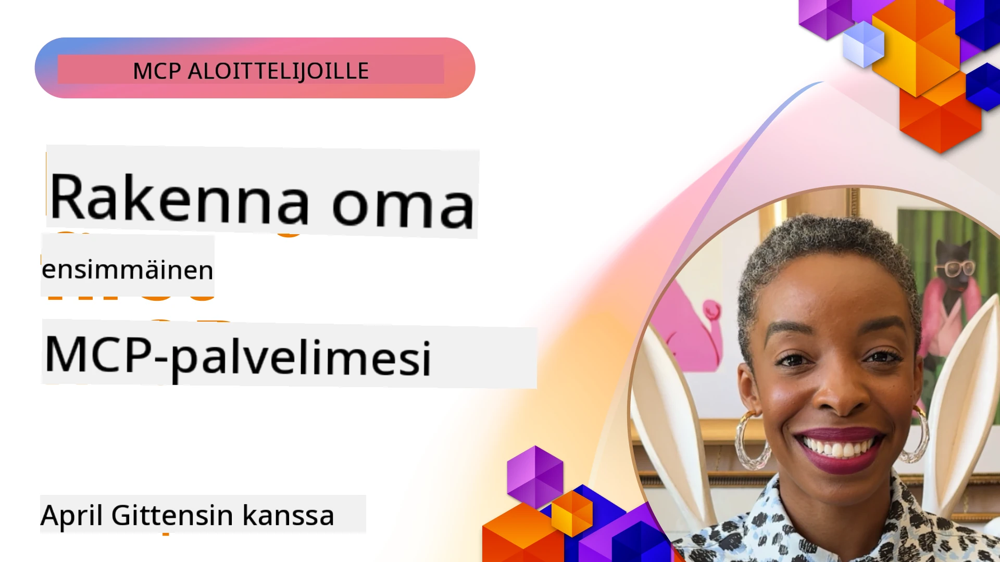

## Aloittaminen  

_(Klikkaa yllä olevaa kuvaa nähdäksesi tämän oppitunnin videon)_

Tämä osio koostuu useista oppitunneista:

- **1 Ensimmäinen palvelimesi**, tässä ensimmäisessä oppitunnissa opit luomaan ensimmäisen palvelimesi ja tarkastelemaan sitä inspector-työkalulla, arvokkaalla tavalla testata ja virheenkorjata palvelinta, [oppituntiin](01-first-server/README.md)

- **2 Asiakas**, tässä oppitunnissa opit kirjoittamaan asiakkaan, joka voi muodostaa yhteyden palvelimeesi, [oppituntiin](02-client/README.md)

- **3 Asiakas LLM:n kanssa**, vielä parempi tapa kirjoittaa asiakas on lisätä siihen LLM, jotta se voi "neuvotella" palvelimen kanssa, mitä tehdä, [oppituntiin](03-llm-client/README.md)

- **4 Palvelimen käyttöönotto GitHub Copilot Agent -tilassa Visual Studio Codessa**. Tässä katsotaan, kuinka MCP-palvelimemme ajetaan Visual Studio Codesta käsin, [oppituntiin](04-vscode/README.md)

- **5 stdio Transport Server** stdio-siirto on suositeltu standardi paikalliselle MCP-palvelin-asiakas -viestinnälle, tarjoten turvallisen alipalveluprosessipohjaisen viestinnän sisäänrakennetulla prosessieristyksellä [oppituntiin](05-stdio-server/README.md)

- **6 HTTP-suoratoisto MCP:llä (Streamable HTTP)**. Opettele moderneista HTTP-suoratoistoyhteyksistä (suositeltu lähestymistapa etä-MCP-palvelimille [MCP Specification 2025-11-25](https://spec.modelcontextprotocol.io/specification/2025-11-25/basic/transports/#streamable-http) mukaan), etenemisen ilmoituksista, ja kuinka toteuttaa skaalautuvia, reaaliaikaisia MCP-palvelimia ja -asiakkaita käyttämällä Streamable HTTP:ta. [oppituntiin](06-http-streaming/README.md)

- **7 AI Toolkitin hyödyntäminen VSCode:ssa** MCP-asiakkaiden ja -palvelimien kuluttamiseen ja testaamiseen [oppituntiin](07-aitk/README.md)

- **8 Testaus** Tässä keskitymme erityisesti siihen, kuinka voimme testata palvelinta ja asiakasta erilaisilla tavoilla, [oppituntiin](08-testing/README.md)

- **9 Julkaisu** Tämä luku käsittelee erilaisia tapoja julkaista MCP-ratkaisusi, [oppituntiin](09-deployment/README.md)

- **10 Edistynyt palvelimen käyttö** Tämä luku kattaa edistyneen palvelimen käytön, [oppituntiin](./10-advanced/README.md)

- **11 Autentikointi** Tämä luku kattaa yksinkertaisen autentikoinnin lisäämisen, Basic Authista JWT:n ja RBAC:n käyttöön. Suosittelemme aloittamaan tästä ja sitten katsomaan Luvun 5 Edistyneitä aiheita sekä suorittamaan lisäturvankovennuksia Luvun 2 suositusten mukaan, [oppituntiin](./11-simple-auth/README.md)

- **12 MCP-isännät** Määritä ja käytä suosittuja MCP-isäntäasiakkaita kuten Claude Desktop, Cursor, Cline ja Windsurf. Opettele siirtotyypit ja vianmääritys, [oppituntiin](./12-mcp-hosts/README.md)

- **13 MCP Inspector** Virheenkorjaa ja testaa MCP-palvelimiasi vuorovaikutteisesti MCP Inspector -työkalulla. Opettele vianmääritystyökaluja, resursseja ja protokollaviestejä, [oppituntiin](./13-mcp-inspector/README.md)

- **14 Näytteenotto** Luo MCP-palvelimia, jotka tekevät yhteistyötä MCP-asiakkaiden kanssa LLM-tehtävissä. [oppituntiin](./14-sampling/README.md)

- **15 MCP-sovellukset** Rakenna MCP-palvelimia, jotka vastaavat myös käyttöliittymäohjeilla, [oppituntiin](./15-mcp-apps/README.md)

Model Context Protocol (MCP) on avoin protokolla, joka standardisoi sen, miten sovellukset tarjoavat kontekstia LLM-malleille. Voit ajatella MCP:tä kuin USB-C-porttina AI-sovelluksille – se tarjoaa standardoidun tavan yhdistää tekoälymalleja eri tietolähteisiin ja työkaluihin.

## Oppimistavoitteet

Tämän oppitunnin päätyttyä osaat:

- Määrittää MCP-kehitysympäristön C#:lle, Javalle, Pythonille, TypeScriptille ja JavaScriptille
- Rakentaa ja ottaa käyttöön perus MCP-palvelimia, joissa on mukautetut ominaisuudet (resurssit, kehotteet ja työkalut)
- Luoda isäntäohjelmia, jotka yhdistävät MCP-palvelimiin
- Testata ja virheenkorjata MCP-toteutuksia
- Ymmärtää yleisiä asennushaasteita ja niiden ratkaisuja
- Yhdistää MCP-toteutuksesi suosittuihin LLM-palveluihin

## MCP-ympäristön määrittäminen

Ennen kuin aloitat MCP:n kanssa työskentelyn, on tärkeää valmistella kehitysympäristösi ja ymmärtää perus työnkulku. Tässä osiossa ohjataan sinua alkuasetuksissa, jotta MCP:n kanssa aloittaminen sujuu mutkattomasti.

### Ennen edistymistä tarvitset

Ennen kuin sukellat MCP-kehitykseen, varmista että sinulla on:

- **Kehitysympäristö**: Valitsemallesi kielelle (C#, Java, Python, TypeScript tai JavaScript)
- **IDE/Editori**: Visual Studio, Visual Studio Code, IntelliJ, Eclipse, PyCharm tai jokin nykyaikainen koodieditori
- **Paketinhallintaohjelmat**: NuGet, Maven/Gradle, pip tai npm/yarn
- **API-avaimet**: Kaikille tekoälypalveluille, joita aiot käyttää isäntäohjelmissasi

### Viralliset SDK:t

Tulevissa luvuissa näet ratkaisuja, jotka on rakennettu Pythonilla, TypeScriptillä, Javalla ja .NET:llä. Tässä kaikki virallisesti tuetut SDK:t.

MCP tarjoaa virallisia SDK:ita useille kielille ([MCP Specification 2025-11-25](https://spec.modelcontextprotocol.io/specification/2025-11-25/) mukaisesti):
- [C# SDK](https://github.com/modelcontextprotocol/csharp-sdk) - Ylläpidetty yhteistyössä Microsoftin kanssa
- [Java SDK](https://github.com/modelcontextprotocol/java-sdk) - Ylläpidetty yhteistyössä Spring AI:n kanssa
- [TypeScript SDK](https://github.com/modelcontextprotocol/typescript-sdk) - Virallinen TypeScriptin toteutus
- [Python SDK](https://github.com/modelcontextprotocol/python-sdk) - Virallinen Pythonin toteutus (FastMCP)
- [Kotlin SDK](https://github.com/modelcontextprotocol/kotlin-sdk) - Virallinen Kotlinin toteutus
- [Swift SDK](https://github.com/modelcontextprotocol/swift-sdk) - Ylläpidetty yhteistyössä Loopwork AI:n kanssa
- [Rust SDK](https://github.com/modelcontextprotocol/rust-sdk) - Virallinen Rustin toteutus
- [Go SDK](https://github.com/modelcontextprotocol/go-sdk) - Virallinen Gon toteutus

## Tärkeitä huomioita

- MCP-kehitysympäristön määrittäminen on yksinkertaista kielikohtaisten SDK:iden avulla
- MCP-palvelimien rakentaminen sisältää työkalujen luomisen ja rekisteröinnin selkeillä skeemoilla
- MCP-asiakkaat yhdistävät palvelimiin ja malleihin hyödyntääkseen laajennettuja ominaisuuksia
- Testaus ja virheenkorjaus ovat olennaisia luotettaville MCP-toteutuksille
- Julkaisuvaihtoehdot vaihtelevat paikallisesta kehityksestä pilvipohjaisiin ratkaisuihin

## Harjoitteleminen

Meillä on joukko esimerkkejä, jotka täydentävät kaikkien tämän osion lukujen harjoituksia. Lisäksi jokaisella luvulla on omat harjoituksensa ja tehtävänsä.

- [Java Laskin](./samples/java/calculator/README.md)
- [.Net Laskin](../../../03-GettingStarted/samples/csharp)
- [JavaScript Laskin](./samples/javascript/README.md)
- [TypeScript Laskin](./samples/typescript/README.md)
- [Python Laskin](../../../03-GettingStarted/samples/python)

## Lisäresurssit

- [Build Agents using Model Context Protocol on Azure](https://learn.microsoft.com/azure/developer/ai/intro-agents-mcp)
- [Remote MCP with Azure Container Apps (Node.js/TypeScript/JavaScript)](https://learn.microsoft.com/samples/azure-samples/mcp-container-ts/mcp-container-ts/)
- [.NET OpenAI MCP Agent](https://learn.microsoft.com/samples/azure-samples/openai-mcp-agent-dotnet/openai-mcp-agent-dotnet/)

## Mitä seuraavaksi

Aloita ensimmäisestä oppitunnista: [Ensimmäisen MCP-palvelimen luominen](01-first-server/README.md)

Kun olet suorittanut tämän moduulin, jatka: [Moduuli 4: Käytännön toteutus](../04-PracticalImplementation/README.md)

---

<!-- CO-OP TRANSLATOR DISCLAIMER START -->
**Vastuuvapauslauseke**:
Tämä dokumentti on käännetty käyttämällä tekoälypohjaista käännöspalvelua [Co-op Translator](https://github.com/Azure/co-op-translator). Vaikka pyrimme tarkkuuteen, huomioithan, että automaattikäännöksissä saattaa esiintyä virheitä tai epätarkkuuksia. Alkuperäistä asiakirjaa sen alkuperäisellä kielellä tulee pitää virallisena lähteenä. Tärkeissä asioissa suositellaan ammattimaisen ihmiskääntäjän käyttöä. Emme ole vastuussa tämän käännöksen käytöstä johtuvista väärinymmärryksistä tai tulkinnoista.
<!-- CO-OP TRANSLATOR DISCLAIMER END -->