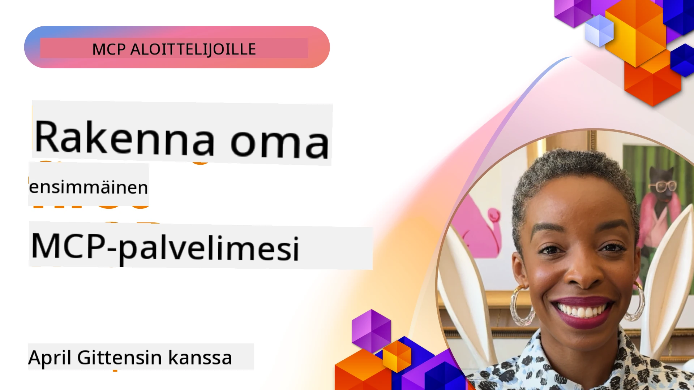

## Aloittaminen  

_(Napsauta yllä olevaa kuvaa nähdäksesi tämän oppitunnin videon)_

Tämä osio koostuu useista oppitunneista:

- **1 Ensimmäinen palvelimesi**, tässä ensimmäisessä oppitunnissa opit luomaan ensimmäisen palvelimesi ja tarkastelemaan sitä inspector-työkalulla, joka on arvokas tapa testata ja debugata palvelintasi, [oppitunnille](01-first-server/README.md)

- **2 Asiakasohjelma**, tässä oppitunnissa opit kirjoittamaan asiakasohjelman, joka voi yhdistää palvelimeesi, [oppitunnille](02-client/README.md)

- **3 Asiakasohjelma LLM:llä**, vielä parempi tapa kirjoittaa asiakasohjelma on lisätä siihen LLM, jotta se voi "neuvotella" palvelimesi kanssa mitä tehdä, [oppitunnille](03-llm-client/README.md)

- **4 Palvelimen GitHub Copilot Agent -tilan käyttäminen Visual Studio Codessa**. Tässä tarkastelemme MCP-palvelimen ajamista Visual Studio Coden sisällä, [oppitunnille](04-vscode/README.md)

- **5 stdio Transport Server** stdio siirto on suositeltu standardi paikalliselle MCP-palvelin-asiakasviestinnälle, tarjoten turvallisen aliohjelmapohjaisen viestinnän sisäänrakennetulla prosessien eristämisellä [oppitunnille](05-stdio-server/README.md)

- **6 MCP:n HTTP-suoratoisto (Streamable HTTP)**. Opi standardoidusta
	etäsiirtotekniikasta [MCP-spezifikaatiossa 2026-07-28](https://modelcontextprotocol.io/specification/2026-07-28/basic/transports/streamable-http),
	sekä perittyä istuntopohjaista toteutusta oppitunnilla.
	[oppitunnille](06-http-streaming/README.md)

- **7 AI-työkalupakin käyttäminen VSCodea varten** kuluttaaksesi ja testataksesi MCP-asiakas- ja palvelinohjelmiasi [oppitunnille](07-aitk/README.md)

- **8 Testaus**. Tässä keskitymme erityisesti eri tapoihin testata palvelintamme ja asiakastamme, [oppitunnille](08-testing/README.md)

- **9 Julkaisu**. Tämä luku käsittelee erilaisia tapoja julkaista MCP-ratkaisusi, [oppitunnille](09-deployment/README.md)

- **10 Edistynyt palvelimen käyttö**. Tämä luku kattaa edistyneen palvelinkäytön, [oppitunnille](./10-advanced/README.md)

- **11 Todennus**. Tämä luku käsittelee yksinkertaisen todennuksen lisäämistä, Basic Authista JWT:n ja RBAC:n käyttöön. Suosittelemme aloittamaan tästä ja tutkimaan sitten edistyneitä aiheita luvussa 5 ja suorittamaan lisäturvatoimia kohdassa luku 2, [oppitunnille](./11-simple-auth/README.md)

- **12 MCP-isännät**. Määritä ja käytä suosittuja MCP-isäntäasiakkaita, mukaan lukien Claude Desktop, Cursor, Cline ja Windsurf. Opiskele siirtotyyppejä ja vianmääritystä, [oppitunnille](./12-mcp-hosts/README.md)

- **13 MCP Inspector**. Debuggaa ja testaa MCP-palvelimesi interaktiivisesti MCP Inspector -työkalulla. Opiskele työkalujen, resurssien ja protokollaviestien vianmääritystä, [oppitunnille](./13-mcp-inspector/README.md)

- **14 Näytteenotto**. Opi perinteinen Näytteenoton primitiivi `2025-11-25` ja
	miten siirtyä uusiin suunnitelmiin suoran LLM-palveluntarjoajan integroinnissa. Näytteenotto on
	vanhentunut MCP `2026-07-28`:ssa. [oppitunnille](./14-sampling/README.md)

- **15 MCP-sovellukset**. Rakenna MCP-palvelimia, jotka myös vastaavat UI-ohjeilla, [oppitunnille](./15-mcp-apps/README.md)

Model Context Protocol (MCP) on avoin protokolla, joka standardisoi sen, miten sovellukset tarjoavat kontekstia LLM:ille. Ajattele MCP:tä kuin AI-sovellusten USB-C-porttina – se tarjoaa standardoidun tavan yhdistää AI-mallit erilaisiin tietolähteisiin ja työkaluihin.

## Oppimistavoitteet

Tämän oppitunnin lopussa osaat:

- Määrittää kehitysympäristöt MCP:lle C#, Java, Python, TypeScript ja JavaScript -kielille
- Rakentaa ja julkaista perus MCP-palvelimia räätälöidyillä ominaisuuksilla (resurssit, kehote ja työkalut)
- Luoda isäntäohjelmia, jotka yhdistyvät MCP-palvelimiin
- Testata ja debugata MCP-toteutuksia
- Ymmärtää yleiset asennushaasteet ja niiden ratkaisut
- Yhdistää MCP-toteutuksesi suosittuihin LLM-palveluihin

## MCP-ympäristön määrittäminen

Ennen MCP:n kanssa työskentelyn aloittamista on tärkeää valmistella kehitysympäristösi ja ymmärtää perus työnkulku. Tämä osio ohjaa sinut alkuasetusvaiheiden läpi varmistaen sujuvan aloituksen MCP:n parissa.

### Vaatimukset

Ennen MCP-kehitykseen sukeltamista varmista, että sinulla on:

- **Kehitysympäristö**: Valitsemallesi kielelle (C#, Java, Python, TypeScript tai JavaScript)
- **IDE/Editori**: Visual Studio, Visual Studio Code, IntelliJ, Eclipse, PyCharm tai mikä tahansa moderni koodieditori
- **Pakettien hallintaohjelmat**: NuGet, Maven/Gradle, pip tai npm/yarn
- **API-avaimet**: Kaikille tekoälypalveluille, joita aiot käyttää isäntäohjelmissasi

### Viralliset SDK:t

Seuraavissa luvuissa näet ratkaisujen rakentamista Pythonilla, TypeScripillä,
Javalla ja .NET:llä. Tässä ovat viralliset SDK:t.

MCP `2026-07-28` tukevat SDK:t julkaistaan kielikohtaisesti itsenäisesti.
Ennen esimerkin ajamista tarkista sen pakettiversio ja SDK:n julkaisumuistiinpanot
tuetuista protokollan versioista. Katso
[virallinen SDK-lista](https://modelcontextprotocol.io/docs/sdk):
- [C# SDK](https://github.com/modelcontextprotocol/csharp-sdk) - Ylläpidetään yhteistyössä Microsoftin kanssa
- [Java SDK](https://github.com/modelcontextprotocol/java-sdk) - Ylläpidetään yhteistyössä Spring AI:n kanssa
- [TypeScript SDK](https://github.com/modelcontextprotocol/typescript-sdk) - Virallinen TypeScript-toteutus
- [Python SDK](https://github.com/modelcontextprotocol/python-sdk) - Virallinen Python-toteutus (FastMCP)
- [Kotlin SDK](https://github.com/modelcontextprotocol/kotlin-sdk) - Virallinen Kotlin-toteutus
- [Swift SDK](https://github.com/modelcontextprotocol/swift-sdk) - Ylläpidetään yhteistyössä Loopwork AI:n kanssa
- [Rust SDK](https://github.com/modelcontextprotocol/rust-sdk) - Virallinen Rust-toteutus
- [Go SDK](https://github.com/modelcontextprotocol/go-sdk) - Virallinen Go-toteutus

## Tärkeimmät opit

- MCP-kehitysympäristön määrittäminen on suoraviivaista kielikohtaisten SDK:iden avulla
- MCP-palvelimien rakentaminen sisältää työkalujen luomisen ja rekisteröinnin selkeillä kaavioilla
- MCP-asiakkaat yhdistyvät palvelimiin ja malleihin hyödyntääkseen laajennettuja ominaisuuksia
- Testaus ja debuggaus ovat olennaisia luotettaville MCP-toteutuksille
- Julkaisuvaihtoehdot vaihtelevat paikallisesta kehityksestä pilvipohjaisiin ratkaisuihin

## Harjoitteleminen

Meillä on joukko esimerkkejä, jotka täydentävät harjoitustehtäviä, joita näet kaikissa tämän osion luvuissa. Lisäksi jokaisella luvulla on omat harjoituksensa ja tehtävänsä

- [Java-laskin](./samples/java/calculator/README.md)
- [.NET-laskin](../../../03-GettingStarted/samples/csharp)
- [JavaScript-laskin](./samples/javascript/README.md)
- [TypeScript-laskin](./samples/typescript/README.md)
- [Python-laskin](../../../03-GettingStarted/samples/python)

## Lisäresurssit

- [Agenttien rakentaminen Model Context Protocolilla Azurella](https://learn.microsoft.com/azure/developer/ai/intro-agents-mcp)
- [Etä-MCP Azure Container Appsilla (Node.js/TypeScript/JavaScript)](https://learn.microsoft.com/samples/azure-samples/mcp-container-ts/mcp-container-ts/)
- [.NET OpenAI MCP Agent](https://learn.microsoft.com/samples/azure-samples/openai-mcp-agent-dotnet/openai-mcp-agent-dotnet/)

## Mitä seuraavaksi

Aloita ensimmäisestä oppitunnista: [Ensimmäisen MCP-palvelimesi luominen](01-first-server/README.md)

Kun olet suorittanut tämän moduulin, jatka: [Moduuli 4: Käytännön toteutus](../04-PracticalImplementation/README.md)

---

<!-- CO-OP TRANSLATOR DISCLAIMER START -->
**Vastuuvapauslauseke**:
Tämä asiakirja on käännetty käyttämällä tekoälypohjaista käännöspalvelua [Co-op Translator](https://github.com/Azure/co-op-translator). Vaikka pyrimme tarkkuuteen, otathan huomioon, että automaattiset käännökset saattavat sisältää virheitä tai epätarkkuuksia. Alkuperäinen asiakirja sen alkuperäiskielellä on virallinen lähde. Tärkeissä asioissa suositellaan ammattimaista ihmiskäännöstä. Emme ole vastuussa tämän käännöksen käytöstä aiheutuvista väärinymmärryksistä tai tulkinnoista.
<!-- CO-OP TRANSLATOR DISCLAIMER END -->