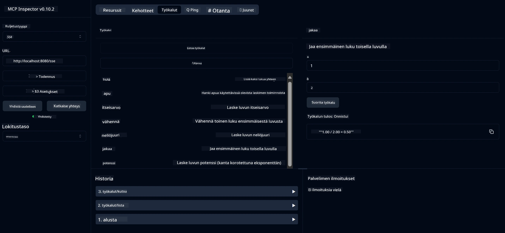

# Peruslaskin MCP-palvelu

> [!NOTE]
> Tämä esimerkki käyttää perinteistä HTTP+SSE-välitystä ja kohdistuu MCP-yhteensopivaan SDK:hon version `2025-11-25` mukaan. Uusien etäpalvelinten tulisi käyttää `2026-07-28` Streamable HTTP -tukea.
> MCP `2025-11-25`. Uusien etäpalvelinten tulisi käyttää `2026-07-28` Streamable
> HTTP -tukea.

Tämä palvelu tarjoaa peruslaskutoimituksia Model Context Protocolin (MCP) kautta käyttäen Spring Bootia WebFlux-välityksellä. Se on suunniteltu yksinkertaiseksi esimerkiksi MCP-implementaatioita opetteleville aloittelijoille.

Lisätietoja löytyy [MCP Server Boot Starter](https://docs.spring.io/spring-ai/reference/api/mcp/mcp-server-boot-starter-docs.html) -viitedokumentaatiosta.

## Yleiskatsaus

Palvelu esittelee:
- SSE:n (Server-Sent Events) tuen
- Automaattisen työkalujen rekisteröinnin Spring AI:n `@Tool`-annotaation avulla
- Peruslaskin-toiminnallisuudet:
  - Yhteenlasku, vähennyslasku, kertolasku, jakolasku
  - Potenssilasku ja neliöjuuri
  - Moduuli (jäännös) ja itseisarvo
  - Ohjetoiminto laskutoimitusten kuvauksille

## Ominaisuudet

Tämä laskinpalvelu tarjoaa seuraavat toiminnot:

1. **Perusaritmeettiset toiminnot**:
   - Kahden luvun yhteenlasku
   - Toisen luvun vähennys toisesta
   - Kahden luvun kertolasku
   - Jakolasku (nollalla jakamisen tarkistus)

2. **Edistyneet toiminnot**:
   - Potenssilasku (kannan korottaminen eksponenttiin)
   - Neliöjuuren laskeminen (negatiivisen luvun tarkistus)
   - Moduulin (jäännöksen) laskeminen
   - Itseisarvon laskeminen

3. **Ohjejärjestelmä**:
   - Sisäänrakennettu ohjetoiminto, joka selittää kaikki käytettävissä olevat toiminnot

## Palvelun käyttäminen

Palvelu tarjoaa seuraavat API-päätepisteet MCP-protokollan kautta:

- `add(a, b)`: Laskee kahden luvun summan
- `subtract(a, b)`: Vähentää toisen luvun ensimmäisestä
- `multiply(a, b)`: Kertoo kaksi lukua keskenään
- `divide(a, b)`: Jakaa ensimmäisen luvun toisella (nollajakotarkistus)
- `power(base, exponent)`: Laskee luvun potenssin
- `squareRoot(number)`: Laskee neliöjuuren (negatiivisen luvun tarkistus)
- `modulus(a, b)`: Laskee jakojäännöksen
- `absolute(number)`: Laskee itseisarvon
- `help()`: Hakee tietoa käytettävissä olevista toiminnoista

## Testiasiakas

Yksinkertainen testiasiakas sisältyy `com.microsoft.mcp.sample.client`-pakettiin. `SampleCalculatorClient`-luokka demonstroi laskinpalvelun käytettävissä olevia toimintoja.

## LangChain4j-asiakkaan käyttäminen

Projekti sisältää LangChain4j-esimerkkiasiakkaan `com.microsoft.mcp.sample.client.LangChain4jClient`-luokassa, joka näyttää, miten laskinpalvelu integroidaan LangChain4j:n ja GitHubin mallien kanssa:

### Esivaatimukset

1. **GitHub-tokenin määritys**:
   
   GitHubin AI-mallien (kuten phi-4) käyttöön tarvitset GitHubin henkilökohtaisen käyttöoikeustokeneen:

   a. Mene GitHub-tilisi asetuksiin: https://github.com/settings/tokens
   
   b. Klikkaa "Generate new token" → "Generate new token (classic)"
   
   c. Anna tokenillesi kuvaava nimi
   
   d. Valitse seuraavat oikeudet:
      - `repo` (Täysi hallinta yksityisissä repositorioissa)
      - `read:org` (Lue organisaation ja tiimien jäsenyydet sekä organisaation projektit)
      - `gist` (Luo gistejä)
      - `user:email` (Käyttäjän sähköpostiosoitteiden lukeminen (vain luku))
   
   e. Klikkaa "Generate token" ja kopioi uusi tokenisi
   
   f. Aseta se ympäristömuuttujaksi:
      
      Windowsilla:
      ```
      set GITHUB_TOKEN=your-github-token
      ```
      
      macOS/Linuxilla:
      ```bash
      export GITHUB_TOKEN=your-github-token
      ```

   g. Pysyväksi asetukseksi lisää se järjestelmän ympäristömuuttujiin

2. Lisää projektiisi LangChain4j GitHub -riippuvuus (sisältyy jo pom.xml:ään):
   ```xml
   <dependency>
       <groupId>dev.langchain4j</groupId>
       <artifactId>langchain4j-github</artifactId>
       <version>${langchain4j.version}</version>
   </dependency>
   ```

3. Varmista, että laskinpalvelin on käynnissä osoitteessa `localhost:8080`

### LangChain4j-asiakkaan ajaminen

Tämä esimerkki demonstroi:
- Yhdistämisen laskimen MCP-palvelimeen SSE-välityksen kautta
- LangChain4j:n käyttöä keskustelurobotin luomiseen, joka hyödyntää laskintoimintoja
- Integroinnin GitHubin AI-mallien kanssa (käyttäen nyt phi-4-mallia)

Asiakas lähettää seuraavat esimerkkikyselyt toiminnallisuuden demonstroimiseksi:
1. Kahden luvun summan laskeminen
2. Neliöjuuren etsiminen luvusta
3. Avain tietojen hakemiseen käytettävistä laskutoiminnoista

Suorita esimerkki ja katso konsolitulostetta nähdäksesi, miten AI-malli käyttää laskintyökaluja vastatakseen kyselyihin.

### GitHub-mallin määrittely

LangChain4j-asiakas on määritetty käyttämään GitHubin phi-4-mallia seuraavilla asetuksilla:

```java
ChatLanguageModel model = GitHubChatModel.builder()
    .apiKey(System.getenv("GITHUB_TOKEN"))
    .timeout(Duration.ofSeconds(60))
    .modelName("phi-4")
    .logRequests(true)
    .logResponses(true)
    .build();
```

Käyttääksesi muita GitHubin malleja, vaihda `modelName`-parametri toiseksi tuetuksi malliksi (esim. "claude-3-haiku-20240307", "llama-3-70b-8192" jne.).

## Riippuvuudet

Projekti vaatii seuraavat keskeiset riippuvuudet:

```xml
<!-- For MCP Server -->
<dependency>
    <groupId>org.springframework.ai</groupId>
    <artifactId>spring-ai-starter-mcp-server-webflux</artifactId>
</dependency>

<!-- For LangChain4j integration -->
<dependency>
    <groupId>dev.langchain4j</groupId>
    <artifactId>langchain4j-mcp</artifactId>
    <version>${langchain4j.version}</version>
</dependency>

<!-- For GitHub models support -->
<dependency>
    <groupId>dev.langchain4j</groupId>
    <artifactId>langchain4j-github</artifactId>
    <version>${langchain4j.version}</version>
</dependency>
```

## Projektin rakentaminen

Rakenna projekti Mavenilla:
```bash
./mvnw clean install -DskipTests
```

## Palvelimen käynnistäminen

### Javalla

```bash
java -jar target/calculator-server-0.0.1-SNAPSHOT.jar
```

### MCP Inspectorin käyttö

MCP Inspector on hyödyllinen työkalu MCP-palveluiden kanssa kommunikointiin. Käyttääksesi sitä tämän laskinpalvelun kanssa:

1. **Asenna ja käynnistä MCP Inspector** uudessa terminaali-ikkunassa:
   ```bash
   npx @modelcontextprotocol/inspector
   ```

2. **Avaa käyttöliittymä** napsauttamalla sovelluksen näyttämää URL-osoitetta (yleensä http://localhost:6274)

3. **Määritä yhteys**:
   - Aseta kuljetustavaksi "SSE"
   - Aseta URL palvelimen käynnissä olevaan SSE-päätepisteeseen: `http://localhost:8080/sse`
   - Klikkaa "Connect"

4. **Käytä työkaluja**:
   - Klikkaa "List Tools" nähdäksesi laskutoiminnot
   - Valitse työkalu ja klikkaa "Run Tool" suorittaaksesi toiminnon



### Dockerin käyttö

Projekti sisältää Dockerfile-tiedoston konttien käyttöönottoa varten:

1. **Rakenna Docker-kuva**:
   ```bash
   docker build -t calculator-mcp-service .
   ```

2. **Käynnistä Docker-kontti**:
   ```bash
   docker run -p 8080:8080 calculator-mcp-service
   ```

Tämä suorittaa:
- Monivaiheisen Docker-kuvan rakentamisen Maven 3.9.9:llä ja Eclipse Temurin 24 JDK:lla
- Optimoidun konttikuvan luomisen
- Palvelun julkaisun portissa 8080
- MCP-laskinpalvelun käynnistämisen kontin sisällä

Palveluun pääsee käsiksi osoitteessa `http://localhost:8080` kun kontti on käynnissä.

## Vianetsintä

### Yleiset GitHub-tokenin ongelmat

1. **Tokenin oikeusongelmat**: Jos saat 403 Forbidden -virheen, tarkista, että tokenillasi on oikeat oikeudet kuten esivaatimuksissa on kuvattu.

2. **Tokenia ei löydy**: Jos saat "No API key found" -virheen, varmista, että GITHUB_TOKEN-ympäristömuuttuja on asetettu oikein.

3. **Käyttörajoitus**: GitHub API:ssa on käyttörajoituksia. Jos kohtaat rajoitusvirheen (tilakoodi 429), odota muutama minuutti ennen uudelleen yrittämistä.

4. **Tokenin vanhentuminen**: GitHub-tokenit voivat vanhentua. Jos saat autentikointivirheitä ajan myötä, luo uusi token ja päivitä ympäristömuuttuja.

Tarvittaessa katso [LangChain4j-dokumentaatio](https://github.com/langchain4j/langchain4j) tai [GitHub API -dokumentaatio](https://docs.github.com/en/rest).

---

<!-- CO-OP TRANSLATOR DISCLAIMER START -->
**Vastuuvapauslauseke**:
Tämä asiakirja on käännetty käyttämällä tekoälypohjaista käännöspalvelua [Co-op Translator](https://github.com/Azure/co-op-translator). Vaikka pyrimme tarkkuuteen, otathan huomioon, että automaattiset käännökset saattavat sisältää virheitä tai epätarkkuuksia. Alkuperäinen asiakirja sen alkuperäiskielellä on virallinen lähde. Tärkeissä asioissa suositellaan ammattimaista ihmiskäännöstä. Emme ole vastuussa tämän käännöksen käytöstä aiheutuvista väärinymmärryksistä tai tulkinnoista.
<!-- CO-OP TRANSLATOR DISCLAIMER END -->