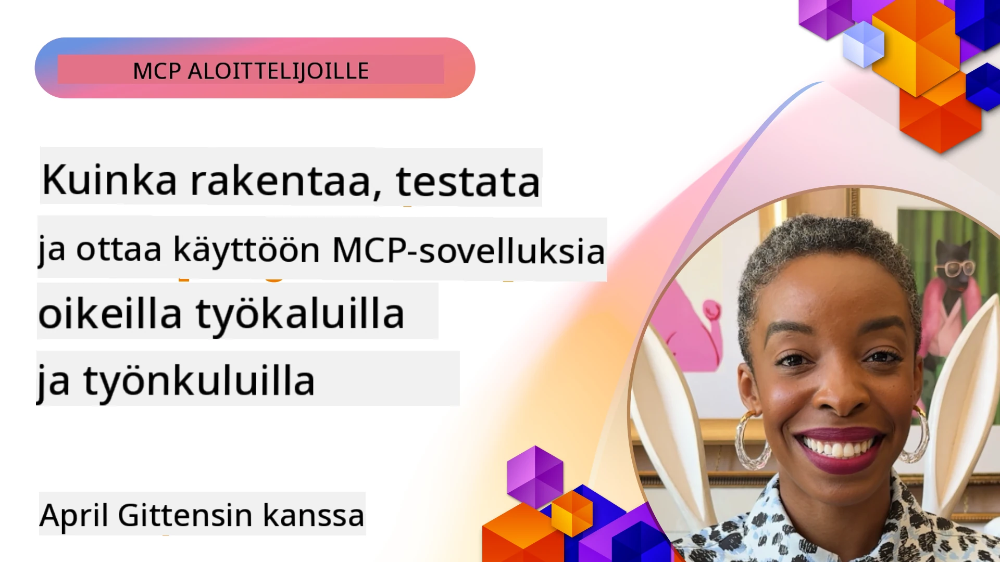
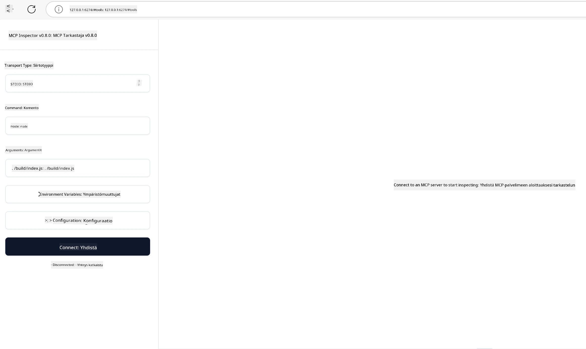

# Käytännön toteutus

[](https://youtu.be/vCN9-mKBDfQ)

_(Klikkaa yllä olevaa kuvaa nähdäksesi videon tästä oppitunnista)_

Käytännön toteutus on se vaihe, jossa Model Context Protocolin (MCP) voima muuttuu konkreettiseksi. Vaikka MCP:n teorian ja arkkitehtuurin ymmärtäminen on tärkeää, todellinen arvo syntyy, kun sovellat näitä käsitteitä rakentaaksesi, testataksesi ja ottaaksesi käyttöön ratkaisuja, jotka ratkaisevat oikeita maailman ongelmia. Tämä luku yhdistää käsitteellisen tiedon ja käytännön kehityksen ohjaten sinua tuomaan MCP-pohjaiset sovellukset eloon.

Oletpa sitten kehittämässä älykkäitä assistentteja, integroimassa tekoälyä liiketoimintaprosesseihin tai rakentamassa räätälöityjä työkaluja datan käsittelyyn, MCP tarjoaa joustavan perustan. Sen kieliriippumaton suunnittelu ja viralliset SDK:t suosituilla ohjelmointikielillä tekevät siitä helposti lähestyttävän monille kehittäjille. Hyödyntämällä näitä SDK:ita voit nopeasti prototyypittää, iteröidä ja skaalata ratkaisuja eri alustoilla ja ympäristöissä.

Seuraavissa osioissa löydät käytännön esimerkkejä, koodinäytteitä ja käyttöönotto-strategioita, jotka demonstroivat MCP:n toteutusta C#:lla, Javalla Springillä, TypeScripillä, JavaScriptillä ja Pythonilla. Opit myös, miten debuggaat ja testaat MCP-palvelimia, hallinnoit API-rajapintoja ja otat ratkaisuja käyttöön pilvessä Azurea käyttäen. Nämä käytännön resurssit on suunniteltu nopeuttamaan oppimistasi ja auttamaan sinua rakentamaan luotettavia ja tuotantovalmiita MCP-sovelluksia itsevarmasti.

## Yleiskatsaus

Tämä oppitunti keskittyy MCP:n käytännön toteutukseen useilla ohjelmointikielillä. Tutkimme, kuinka käyttää MCP SDK:ita C#:ssa, Javassa Springin kanssa, TypeScriptissä, JavaScriptissä ja Pythonissa robustien sovellusten rakentamiseen, MCP-palvelimien debuggaamiseen ja testaamiseen sekä uudelleenkäytettävien resurssien, kehotteiden ja työkalujen luomiseen.

## Oppimistavoitteet

Oppitunnin lopuksi pystyt:

- Toteuttamaan MCP-ratkaisuja virallisilla SDK:illa eri ohjelmointikielillä
- Debuggaamaan ja testaamaan MCP-palvelimia järjestelmällisesti
- Luomaan ja käyttämään palvelinominaisuuksia (Resurssit, Kehotteet ja Työkalut)
- Suunnittelemaan tehokkaita MCP-työnkulkuja monimutkaisiin tehtäviin
- Optimoimaan MCP-toteutuksia suorituskyvyn ja luotettavuuden näkökulmasta

## Viralliset SDK-resurssit

Model Context Protocol tarjoaa viralliset SDK:t useille kielille (yhteensopiva [MCP-määrityksen 2025-11-25](https://spec.modelcontextprotocol.io/specification/2025-11-25/) kanssa):

- [C# SDK](https://github.com/modelcontextprotocol/csharp-sdk)
- [Java Spring SDK](https://github.com/modelcontextprotocol/java-sdk) **Huom:** vaatii riippuvuuden [Project Reactor](https://projectreactor.io) kanssa. (Katso [keskustelu #246](https://github.com/orgs/modelcontextprotocol/discussions/246).)
- [TypeScript SDK](https://github.com/modelcontextprotocol/typescript-sdk)
- [Python SDK](https://github.com/modelcontextprotocol/python-sdk)
- [Kotlin SDK](https://github.com/modelcontextprotocol/kotlin-sdk)
- [Go SDK](https://github.com/modelcontextprotocol/go-sdk)

## Työskentely MCP SDK:iden kanssa

Tässä osiossa on käytännön esimerkkejä MCP:n toteuttamisesta useilla ohjelmointikielillä. Löydät esimerkkikoodit `samples`-hakemistosta järjestettynä kielittäin.

### Saatavilla olevat esimerkit

Repositoriossa on [implementaatioesimerkkejä](../../../04-PracticalImplementation/samples) seuraavilla kielillä:

- [C#](./samples/csharp/README.md)
- [Java Springin kanssa](./samples/java/containerapp/README.md)
- [TypeScript](./samples/typescript/README.md)
- [JavaScript](./samples/javascript/README.md)
- [Python](./samples/python/README.md)

Jokainen esimerkki demonstroi keskeisiä MCP-käsitteitä ja toteutusmalleja kyseiselle kielelle ja ekosysteemille.

### Käytännön oppaat

Lisäoppaita käytännön MCP-toteutukseen:

- [Sivutus ja suurten tietojoukkojen käsittely](./pagination/README.md) - Käsittele työkalujen, resurssien ja suurten tietojen kursori-pohjaista sivutusta

## Keskeiset palvelinominaisuudet

MCP-palvelimet voivat toteuttaa minkä tahansa yhdistelmän seuraavista ominaisuuksista:

### Resurssit

Resurssit tarjoavat kontekstin ja datan käyttäjälle tai tekoälymallille:

- Dokumenttivarastot
- Tietopohjat
- Rakenteiset tietolähteet
- Tiedostojärjestelmät

### Kehotteet

Kehotteet ovat mallipohjaisia viestejä ja työnkulkuja käyttäjille:

- Esimääritellyt keskustelumallit
- Ohjatut vuorovaikutuskuviot
- Erikoistuneet dialogirakenteet

### Työkalut

Työkalut ovat funktioita, joita tekoälymalli voi suorittaa:

- Datan käsittelytyökalut
- Ulkoiset API-integraatiot
- Laskennalliset kyvykkyydet
- Hakutoiminnallisuus

## Esimerkkitoteutukset: C# -toteutus

Virallisen C# SDK -repositoriossa on useita esimerkkitoteutuksia, jotka osoittavat MCP:n eri osa-alueita:

- **Perus MCP-asiakas:** Yksinkertainen esimerkki MCP-asiakkaan luomisesta ja työkalujen kutsumisesta
- **Perus MCP-palvelin:** Minimipalvelintoteutus perus työkalujen rekisteröinnillä
- **Kehittynyt MCP-palvelin:** Täysimittainen palvelin työkalujen rekisteröinnillä, autentikoinnilla ja virheenkäsittelyllä
- **ASP.NET-integraatio:** Esimerkkejä ASP.NET Core -integraatiosta
- **Työkalujen toteutusmallit:** Erilaisia malleja työkaluja varten eri monimutkaisuustasoilla

MCP C# SDK on esikatseluvaiheessa ja sovellusrajapinnat saattavat muuttua. Päivitämme tätä blogia jatkuvasti SDK:n kehittyessä.

### Keskeiset ominaisuudet

- [C# MCP Nuget ModelContextProtocol](https://www.nuget.org/packages/ModelContextProtocol)
- Rakennusopas [ensimmäiseen MCP-palvelimeesi](https://devblogs.microsoft.com/dotnet/build-a-model-context-protocol-mcp-server-in-csharp/).

Täydelliset C#-toteutusesimerkit löytyvät [virallisesta C# SDK -esimerkkirepostiosta](https://github.com/modelcontextprotocol/csharp-sdk)

## Esimerkkitoteutus: Java Spring -toteutus

Java Spring SDK tarjoaa vahvoja MCP-toteutusvaihtoehtoja yritystason ominaisuuksilla.

### Keskeiset ominaisuudet

- Spring Framework -integraatio
- Vahva tyyppiturvallisuus
- Reaktiivisen ohjelmoinnin tuki
- Laaja virheenkäsittely

Täydellisen Java Spring -toteutusesimerkin löydät [Java Spring -esimerkkikansiosta](samples/java/containerapp/README.md).

## Esimerkkitoteutus: JavaScript -toteutus

JavaScript SDK tarjoaa kevyen ja joustavan lähestymistavan MCP:n toteutukseen.

### Keskeiset ominaisuudet

- Node.js- ja selain-tuki
- Lupauspohjainen API
- Helppo integraatio Expressiin ja muihin kehyksiin
- WebSocket-tuki suoratoistoon

Täydellisen JavaScript-toteutusesimerkin löydät [JavaScript-esimerkkikansiosta](samples/javascript/README.md).

## Esimerkkitoteutus: Python -toteutus

Python SDK tarjoaa pythonilaisen lähestymistavan MCP-toteutukseen erinomaisilla ML-kehysten integraatioilla.

### Keskeiset ominaisuudet

- async/await-tuki asyncio-kirjastolla
- FastAPI-integraatio
- Yksinkertainen työkalujen rekisteröinti
- Natiivisti tuettu suosittujen ML-kirjastojen kanssa

Täydellisen Python-toteutusesimerkin löydät [Python-esimerkkikansiosta](samples/python/README.md).

## API-hallinta

Azure API Management on erinomainen ratkaisu MCP-palvelimien suojaamiseen. Ajatuksena on laittaa Azure API Management -instanssi MCP-palvelimesi eteen ja antaa sen hoitaa ominaisuuksia, joita todennäköisesti tarvitset, kuten:

- nopeusrajoitukset
- tunnusten hallinta
- valvonta
- kuormantasapaino
- turvallisuus

### Azure-esimerkki

Tässä on Azure-esimerkki, joka tekee juuri tämän, eli [luo MCP-palvelimen ja suojaa sen Azure API Managementilla](https://github.com/Azure-Samples/remote-mcp-apim-functions-python).

Katso alla olevaa kuvaa valtuutusprosessista:


Kuvassa tapahtuu seuraavaa:

- Todentaminen/valtuutus hoidetaan Microsoft Entraa käyttäen.
- Azure API Management toimii porttina ja käyttää politiikkoja liikenteen ohjaukseen ja hallintaan.
- Azure Monitor kirjaa kaikki pyynnöt jatkoanalyysiä varten.

#### Valtuutusprosessin kulku

Tutustutaan valtuutusprosessiin tarkemmin:


#### MCP:n valtuutusmääritys

Lue lisää [MCP Authorization -määrityksestä](https://spec.modelcontextprotocol.io/specification/2025-11-25/basic/authorization/)

## Kauko-MCP-palvelimen käyttöönotto Azureen

Katsotaan, voimmeko ottaa käyttöön aiemmin mainitun esimerkin:

1. Klonaa repositorio

    ```bash
    git clone https://github.com/Azure-Samples/remote-mcp-apim-functions-python.git
    cd remote-mcp-apim-functions-python
    ```

1. Rekisteröi `Microsoft.App` resurssipalveluntarjoaja.

   - Jos käytät Azure CLI:tä, suorita `az provider register --namespace Microsoft.App --wait`.
   - Jos käytät Azure PowerShelliä, suorita `Register-AzResourceProvider -ProviderNamespace Microsoft.App`. Tarkista rekisteröinnin tila ajamalla `(Get-AzResourceProvider -ProviderNamespace Microsoft.App).RegistrationState` jonkin ajan kuluttua.

1. Suorita tämä [azd](https://aka.ms/azd) -komento provisioidaksesi API Management -palvelu, funktiosovellus (koodilla) ja kaikki muut tarvittavat Azure-resurssit

    ```shell
    azd up
    ```

    Tämä komento ottaa käyttöön kaikki tarvittavat pilvipalvelut Azureen

### Testaa palvelimesi MCP Inspectorilla

1. Uudessa komentorivissä asenna ja käynnistä MCP Inspector

    ```shell
    npx @modelcontextprotocol/inspector
    ```

    Pitäisi nähdä käyttöliittymä, joka näyttää seuraavalta:

    

1. CTRL-klikkaa ladataksesi MCP Inspectorin web-sovelluksen osoitteesta, jonka sovellus näyttää (esim. [http://127.0.0.1:6274/#resources](http://127.0.0.1:6274/#resources))
1. Aseta kuljetustavaksi `SSE`
1. Aseta URL kulkevalle API Management SSE -pisteelle, jonka `azd up` -komento näyttää ja **Yhdistä**:

    ```shell
    https://<apim-servicename-from-azd-output>.azure-api.net/mcp/sse
    ```

1. **Listaa työkalut**. Klikkaa työkalua ja **Suorita työkalu**.

Jos kaikki sujui oikein, sinun pitäisi nyt olla yhteydessä MCP-palvelimeen ja pystyä kutsumaan työkalua.

## MCP-palvelimet Azurelle

[Remote-mcp-functions](https://github.com/Azure-Samples/remote-mcp-functions-dotnet): Tämä joukko repositorioita on pika-aloitusmalli omien etä-MCP (Model Context Protocol) palvelinten rakentamiseen ja käyttöönottoon Azure Functions -ympäristössä Pythonilla, C# .NET:llä tai Node/TypeScriptillä.

Näytteet tarjoavat kokonaisratkaisun, joka sallii kehittäjien:

- Rakentaa ja ajaa paikallisesti: Kehittää ja debugata MCP-palvelinta paikallisella koneella
- Julkaista Azureen: Helppo pilvikäyttöönotto yksinkertaisella azd up -komennolla
- Yhdistää asiakasohjelmista: Yhdistää MCP-palvelimeen eri asiakasohjelmilla, kuten VS Code:n Copilot agent -tilassa ja MCP Inspector -työkalulla

### Keskeiset ominaisuudet

- Turvallisuus suunnittelusta lähtien: MCP-palvelin on suojattu avaimilla ja HTTPS:llä
- Todennusvaihtoehdot: Tuki OAuth:lle sisäänrakennetuilla autentikointi- ja/tai API Management -ratkaisuilla
- Verkkosekvenssin eristys: Tukee verkon eristystä Azure Virtual Networks (VNET) -määrityksellä
- Serverless-arkkitehtuuri: Hyödyntää Azure Functionsia skaalautuvaan, tapahtumaohjattuun suoritukseen
- Paikallinen kehitys: Kattava tuki paikalliselle kehitykselle ja debuggaamiselle
- Yksinkertainen käyttöönotto: Virtaviivainen käyttöönotto Azureen

Repositoriossa on kaikki tarvittavat konfigurointitiedostot, lähdekoodi ja infrastruktuurin määritelmät, joilla pääsee nopeasti alkuun tuotantovalmiin MCP-palvelimen toteutuksessa.

- [Azure Remote MCP Functions Python](https://github.com/Azure-Samples/remote-mcp-functions-python) - MCP-toteutusesimerkki Azure Functionsilla Pythonilla

- [Azure Remote MCP Functions .NET](https://github.com/Azure-Samples/remote-mcp-functions-dotnet) - MCP-toteutusesimerkki Azure Functionsilla C# .NET:llä

- [Azure Remote MCP Functions Node/Typescript](https://github.com/Azure-Samples/remote-mcp-functions-typescript) - MCP-toteutusesimerkki Azure Functionsilla Node/TypeScriptillä.

## Keskeiset opit

- MCP SDK:t tarjoavat kielenomaisia työkaluja vahvojen MCP-ratkaisujen toteutukseen
- Debuggaus- ja testausprosessi on kriittinen luotettavien MCP-sovellusten kehittämisessä
- Uudelleenkäytettävät kehotemallit mahdollistavat johdonmukaiset AI-vuorovaikutukset
- Hyvin suunnitellut työnkulut voivat orkestroida monimutkaisia tehtäviä käyttäen useita työkaluja
- MCP-ratkaisujen toteutuksessa on huomioitava turvallisuus, suorituskyky ja virheenkäsittely

## Harjoitus

Suunnittele käytännön MCP-työnkulku, joka ratkaisee todellisen ongelman omalla alallasi:

1. Tunnista 3-4 työkalua, jotka olisivat hyödyllisiä ongelman ratkaisemiseen
2. Laadi työnkulun kaavio, joka näyttää, miten työkalut ovat vuorovaikutuksessa keskenään
3. Toteuta perusversio yhdestä työkaluista suosikkiohjelmointikielelläsi
4. Luo kehotetyyppinen malli, joka auttaa mallia tehokkaasti käyttämään työkalua

## Lisäresurssit

---

## Mitä seuraavaksi

Seuraavaksi: [Edistyneet aiheet](../05-AdvancedTopics/README.md)

---

<!-- CO-OP TRANSLATOR DISCLAIMER START -->
**Vastuuvapauslauseke**:
Tämä asiakirja on käännetty tekoälypohjaisen käännöspalvelun [Co-op Translator](https://github.com/Azure/co-op-translator) avulla. Vaikka pyrimme tarkkuuteen, automaattiset käännökset saattavat sisältää virheitä tai epätarkkuuksia. Alkuperäistä asiakirjaa sen alkuperäiskielellä tulee pitää virallisena lähteenä. Tärkeiden tietojen osalta suositellaan ammattimaista ihmiskäännöstä. Emme ole vastuussa tästä käännöksestä aiheutuvista väärinymmärryksistä tai virheellisistä tulkinnoista.
<!-- CO-OP TRANSLATOR DISCLAIMER END -->