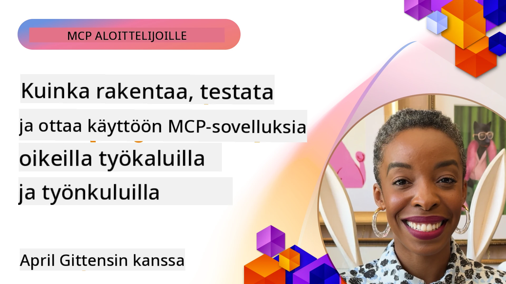

# Käytännön toteutus

[](https://youtu.be/vCN9-mKBDfQ)

_(Napsauta yllä olevaa kuvaa katsellaksesi tämän oppitunnin videon)_

Käytännön toteutus on se vaihe, jossa Model Context Protocolin (MCP) voima tulee konkreettiseksi. Teorian ja arkkitehtuurin ymmärtäminen MCP:n takana on tärkeää, mutta todellinen arvo syntyy, kun sovellat näitä käsitteitä rakentaaksesi, testataksesi ja ottaaksesi käyttöön ratkaisuja, jotka ratkaisevat todellisen maailman ongelmia. Tämä luku yhdistää käsitteellisen tiedon ja käytännön kehityksen, ohjaten sinua läpi prosessin, jolla MCP-pohjaiset sovellukset herätetään henkiin.

Kehitätpä sitten älykkäitä avustajia, integroi tekoälyä liiketoiminnan työnkulkuihin tai rakenna räätälöityjä työkaluja datankäsittelyyn, MCP tarjoaa joustavan perustan. Sen kielestä riippumaton suunnittelu ja viralliset SDK:t suosituissa ohjelmointikielissä tekevät siitä saavutettavan monenlaisille kehittäjille. Hyödyntämällä näitä SDK:ita voit nopeasti tehdä prototyyppejä, iterointi ja skaalata ratkaisuja eri alustoilla ja ympäristöissä.

Seuraavissa osioissa löydät käytännön esimerkkejä, mallikoodeja ja käyttöönotto-strategioita, jotka demonstroivat, kuinka toteuttaa MCP C#:ssa, Javassa Springillä, TypeScriptissä, JavaScriptissä ja Pythonissa. Opit myös, kuinka virheenkorjaat ja testaat MCP-palvelimia, hallitset API:ta ja otat ratkaisuja käyttöön pilveen Azuren avulla. Nämä käytännön resurssit on suunniteltu nopeuttamaan oppimista ja auttamaan sinua rakentamaan luotettavia, tuotantovalmiita MCP-sovelluksia itsevarmasti.

## Yleiskatsaus

Tämä oppitunti keskittyy MCP:n käytännön toteutukseen useilla ohjelmointikielillä. Tutkimme, kuinka käyttää MCP SDK:ita C#:ssa, Javassa Springillä, TypeScriptissä, JavaScriptissä ja Pythonissa rakentaaksesi vakaat sovellukset, virheenkorjataksesi ja testataksesi MCP-palvelimia sekä luodaksesi uudelleenkäytettäviä resursseja, kehotteita ja työkaluja.

## Oppimistavoitteet

Tämän oppitunnin lopussa osaat:

- Toteuttaa MCP-ratkaisuja käyttäen virallisia SDK:ita eri ohjelmointikielillä
- Virheenkorjata ja testata MCP-palvelimia järjestelmällisesti
- Luoda ja käyttää palvelinominaisuuksia (Resurssit, Kehotteet ja Työkalut)
- Suunnitella tehokkaita MCP-työnkulkuja monimutkaisiin tehtäviin
- Optimoida MCP-toteutuksia suorituskyvyn ja luotettavuuden parantamiseksi

## Viralliset SDK-resurssit

Model Context Protocol tarjoaa viralliset SDK:t useille kielille. SDK
-tuki MCP:lle `2026-07-28` julkaistaan itsenäisesti, joten tarkista kunkin SDK:n
julkaisumuistiinpanot ja esimerkin pakettiversio ennen kuin oletat protokollan
yhteensopivuuden. Katso [virallinen SDK-lista](https://modelcontextprotocol.io/docs/sdk):

- [C# SDK](https://github.com/modelcontextprotocol/csharp-sdk)
- [Java Spring SDK](https://github.com/modelcontextprotocol/java-sdk) **Huom:** vaatii riippuvuuden [Project Reactor](https://projectreactor.io). (Katso [keskustelu issue 246](https://github.com/orgs/modelcontextprotocol/discussions/246).)
- [TypeScript SDK](https://github.com/modelcontextprotocol/typescript-sdk)
- [Python SDK](https://github.com/modelcontextprotocol/python-sdk)
- [Kotlin SDK](https://github.com/modelcontextprotocol/kotlin-sdk)
- [Go SDK](https://github.com/modelcontextprotocol/go-sdk)

## Työskentely MCP SDK:ien kanssa

Tässä osiossa on käytännön esimerkkejä MCP:n toteuttamisesta useilla ohjelmointikielillä. Löydät mallikoodit `samples`-hakemistosta kielikohtaisesti järjestettynä.

### Saatavilla olevat mallit

Repositorio sisältää [mallitoteutuksia](../../../04-PracticalImplementation/samples) seuraavilla kielillä:

- [C#](./samples/csharp/README.md)
- [Java Spring](./samples/java/containerapp/README.md)
- [TypeScript](./samples/typescript/README.md)
- [JavaScript](./samples/javascript/README.md)
- [Python](./samples/python/README.md)

Jokainen malli osoittaa keskeisiä MCP-käsitteitä ja toteutusmalleja kyseiselle kielelle ja ekosysteemille.

### Käytännön oppaat

Lisäoppaat käytännön MCP-toteutukseen:

- [Sivutus ja laajat tulossarjat](./pagination/README.md) - Käsittele työkalu- ja resurssipohjaista sivutusta sekä suurten datamäärien hallintaa

## Keskeiset palvelinominaisuudet

MCP-palvelimet voivat toteuttaa minkä tahansa yhdistelmän näistä ominaisuuksista:

### Resurssit

Resurssit tarjoavat kontekstia ja dataa käyttäjälle tai tekoälymallille:

- Dokumenttivarastot
- Tietopohjat
- Jäsennellyt tietolähteet
- Tiedostojärjestelmät

### Kehotteet

Kehotteet ovat käyttäjille suunnattuja mallipohjaisia viestejä ja työnkulkuja:

- Esivalmistellut keskustelumallit
- Ohjatut vuorovaikutusmallit
- Erikoistuneet dialogirakenteet

### Työkalut

Työkalut ovat toimintoja, joita tekoälymalli suorittaa:

- Datankäsittelyapuohjelmat
- Ulkoiset API-integraatiot
- Laskentakyvykkyydet
- Hakutoiminnot

## Mallitoteutukset: C#-toteutus

Virallisen C# SDK repositorio sisältää useita malliesimerkkejä, jotka osoittavat MCP:n eri puolia:

- **Perus MCP-asiakas**: Yksinkertainen esimerkki MCP-asiakkaan luomisesta ja työkalujen kutsumisesta
- **Perus MCP-palvelin**: Vähimmäispalvelintoteutus perus työkalurekisteröinnillä
- **Edistynyt MCP-palvelin**: Täysimittainen palvelin, jossa työkalurekisteröinti, todennus ja virheenkäsittely
- **ASP.NET-integraatio**: Esimerkkejä integroinnista ASP.NET Coreen
- **Työkalutoteutusmallit**: Erilaisia malleja työkalujen toteuttamiseen eri monimutkaisuustasoilla

MCP C# SDK on esikatseluvaiheessa ja API:t voivat muuttua. Päivitämme tätä blogia jatkuvasti SDK:n kehittyessä.

### Keskeiset ominaisuudet

- [C# MCP Nuget ModelContextProtocol](https://www.nuget.org/packages/ModelContextProtocol)
- Rakenna [ensimmäinen MCP-palvelimesi](https://devblogs.microsoft.com/dotnet/build-a-model-context-protocol-mcp-server-in-csharp/).

Täyden C# toteutusmallin löydät [virallisesta C# SDK mallireservoiriosta](https://github.com/modelcontextprotocol/csharp-sdk)

## Mallitoteutus: Java Spring -toteutus

Java Spring SDK tarjoaa vankkoja MCP-toteutusmahdollisuuksia yritystason ominaisuuksilla.

### Keskeiset ominaisuudet

- Spring Frameworkin integraatio
- Vahva tyyppiturvallisuus
- Reaktiivinen ohjelmointituki
- Laaja virheenkäsittely

Täyden Java Spring toteutusesimerkin löydät [Java Spring esimerkeistä](samples/java/containerapp/README.md) samples-kansiossa.

## Mallitoteutus: JavaScript-toteutus

JavaScript SDK tarjoaa kevyen ja joustavan lähestymistavan MCP:n toteutukseen.

### Keskeiset ominaisuudet

- Node.js ja selain tuki
- Promise-pohjainen API
- Helppo integraatio Expressin ja muiden kehysten kanssa
- WebSocket-tuki suoratoistoon

Täyden JavaScript-toteutusemiskerin löydät [JavaScript-esimerkeistä](samples/javascript/README.md) samples-kansiosta.

## Mallitoteutus: Python-toteutus

Python SDK tarjoaa python-tyylisen lähestymistavan MCP:n toteutukseen erinomaisten ML-kehysten integrointien kera.

### Keskeiset ominaisuudet

- Async/await tuki asyncio-kirjastolla
- FastAPI-integraatio``
- Yksinkertainen työkalurekisteröinti
- Natiivi integraatio suosittuihin ML-kirjastoihin

Täyden Python toteutusesimerkin löydät [Python-esimerkeistä](samples/python/README.md) samples-kansiosta.

## API-hallinta


Azure API Management on loistava ratkaisu MCP-palvelimien suojaamiseen. Ajatus on laittaa Azure API Management -instanssi MCP-palvelimesi eteen ja antaa sen hoitaa todennäköisesti haluamiasi ominaisuuksia, kuten:

- kapasiteetin rajoittaminen
- tunnusten hallinta
- valvonta
- kuorman tasapainotus
- turvallisuus

### Azure-esimerkki

Tässä on Azure-esimerkki, joka tekee juuri tämän, eli [luo MCP-palvelimen ja suojaa sen Azure API Managementilla](https://github.com/Azure-Samples/remote-mcp-apim-functions-python).

Katso, miten valtuutusprosessi tapahtuu alla olevassa kuvassa:


Edellisessä kuvassa tapahtuu seuraavaa:

- Todennus/valtuutus tapahtuu Microsoft Entran avulla.
- Azure API Management toimii porttina ja käyttää käytäntöjä liikenteen ohjaamiseen ja hallintaan.
- Azure Monitor kirjaa kaikki pyynnöt jatkoanalyysiä varten.

#### Valtuutusprosessi

Tarkastellaan valtuutusprosessia yksityiskohtaisemmin:


#### MCP-valtuutuksen spesifikaatio

Lue lisää
[MCP-valtuutusspesifikaatiosta](https://modelcontextprotocol.io/specification/2026-07-28/basic/authorization/).

## Etä-MCP-palvelimen käyttöönotto Azureen

Katsotaan, voimmeko ottaa käyttöön aiemmin mainitun esimerkin:

1. Kloonaa repo

    ```bash
    git clone https://github.com/Azure-Samples/remote-mcp-apim-functions-python.git
    cd remote-mcp-apim-functions-python
    ```

1. Rekisteröi `Microsoft.App` -resurssin tarjoaja.

   - Jos käytät Azure CLI:tä, suorita `az provider register --namespace Microsoft.App --wait`.
   - Jos käytät Azure PowerShelliä, suorita `Register-AzResourceProvider -ProviderNamespace Microsoft.App`. Tarkista sitten `(Get-AzResourceProvider -ProviderNamespace Microsoft.App).RegistrationState` jonkin ajan kuluttua varmistaaksesi, että rekisteröinti on valmis.

1. Suorita tämä [azd](https://aka.ms/azd) -komento varustaaksesi API-hallintapalvelun, toimintosovelluksen (koodilla) ja kaikki muut tarvittavat Azure-resurssit

    ```shell
    azd up
    ```

    Tämän pitäisi ottaa käyttöön kaikki pilvipalveluresurssit Azureen

### Palvelimen testaaminen MCP Inspectorilla

1. **Uudessa komentorivipäätteessä** asenna ja käynnistä MCP Inspector

    ```shell
    npx @modelcontextprotocol/inspector
    ```

    Näet käyttöliittymän, joka näyttää tältä:

    

1. Paina CTRL-näppäintä ja klikkaa ladataksesi MCP Inspector -verkkosovelluksen sovelluksen näyttämästä URL-osoitteesta (esim. [http://127.0.0.1:6274/#resources](http://127.0.0.1:6274/#resources))
1. Aseta siirtotavaksi `SSE`
1. Aseta URL-osoitteeksi käynnissä oleva API Management SSE -päätepiste, joka näkyy `azd up` -komennon jälkeen, ja **Yhdistä**:

    ```shell
    https://<apim-servicename-from-azd-output>.azure-api.net/mcp/sse
    ```

1. **Listaa työkalut**. Klikkaa työkalua ja **Suorita työkalu**.  

Jos kaikki vaiheet ovat onnistuneet, olet nyt yhteydessä MCP-palvelimeen ja olet pystynyt kutsumaan työkalua.

## MCP-palvelimet Azurea varten

[Remote-mcp-functions](https://github.com/Azure-Samples/remote-mcp-functions-dotnet): Tämä sarja arkistoja tarjoaa nopean aloituspohjan räätälöityjen etä-MCP (Model Context Protocol) -palvelimien rakentamiseen ja käyttöönottoon Azure Functionsilla Pythonilla, C# .NETillä tai Node/TypeScripillä.

Esimerkit tarjoavat täydellisen ratkaisun, joka mahdollistaa kehittäjille:

- Rakentamisen ja paikallisen ajamisen: Kehitä ja debuggaa MCP-palvelinta paikallisella koneella
- Azureen käyttöönoton: Helppo pilvikäyttöönotto yksinkertaisella azd up -komennolla
- Yhteyden muodostamisen asiakkailta: Yhdistä MCP-palvelimeen eri asiakkailta, mukaan lukien VS Code Copilot -agenttitila ja MCP Inspector -työkalu

### Keskeiset ominaisuudet

- Turvallisuus suunnittelusta lähtien: MCP-palvelin on suojattu avaimilla ja HTTPS:llä
- Todennusvaihtoehdot: Tukee OAuth:ta sisäänrakennetulla todennuksella ja/tai API Managementilla
- Verkkoympäristön eristäminen: Mahdollistaa verkkoeristyksen Azure Virtual Networkin (VNET) avulla
- Palvelimeton arkkitehtuuri: Hyödyntää Azure Functionsia skaalautuvaan, tapahtumia ohjaavaan suorittamiseen
- Paikallinen kehitys: Laaja paikallisen kehityksen ja virheenkorjauksen tuki
- Yksinkertainen käyttöönotto: Sujuva käyttöönottoprosessi Azureen

Arkisto sisältää kaikki tarpeelliset konfiguraatiotiedostot, lähdekoodin ja infrastruktuurimäärittelyt, jotta tuotantovalmiin MCP-palvelimen käyttöönotto aloitetaan nopeasti.

- [Azure Remote MCP Functions Python](https://github.com/Azure-Samples/remote-mcp-functions-python) - MCP:n esimerkkitoteutus Azure Functionsilla Pythonilla

- [Azure Remote MCP Functions .NET](https://github.com/Azure-Samples/remote-mcp-functions-dotnet) - MCP:n esimerkkitoteutus Azure Functionsilla C# .NETillä

- [Azure Remote MCP Functions Node/Typescript](https://github.com/Azure-Samples/remote-mcp-functions-typescript) - MCP:n esimerkkitoteutus Azure Functionsilla Node/TypeScriptillä.

## Keskeiset opit

- MCP SDK:t tarjoavat kielikohtaisia työkaluja vahvojen MCP-ratkaisujen toteuttamiseen
- Virheenkorjauksen ja testauksen prosessi on kriittinen luotettaville MCP-sovelluksille
- Uudelleenkäytettävät kehotemallit mahdollistavat johdonmukaiset tekoälyvuorovaikutukset
- Hyvin suunnitellut työnkulut voivat orkestroida monimutkaisia tehtäviä useilla työkaluilla
- MCP-ratkaisujen toteuttamisessa on huomioitava turvallisuus, suorituskyky ja virheenkäsittely

## Harjoitus

Suunnittele käytännöllinen MCP-työnkulku, joka ratkaisee todellisen ongelman omalla alallasi:

1. Tunnista 3-4 työkalua, jotka olisivat hyödyllisiä tämän ongelman ratkaisemiseksi
2. Luo työnkulun kaavio, joka näyttää miten nämä työkalut ovat vuorovaikutuksessa
3. Toteuta yksi työkaluista perusversioksi valitsemallasi kielellä
4. Luo kehotemalli, joka auttaisi mallia käyttämään työkalua tehokkaasti

## Lisäresurssit

---

## Mitä seuraavaksi

Seuraava: [Edistyneet aiheet](../05-AdvancedTopics/README.md)

---

<!-- CO-OP TRANSLATOR DISCLAIMER START -->
**Vastuuvapauslauseke**:
Tämä asiakirja on käännetty käyttämällä tekoälypohjaista käännöspalvelua [Co-op Translator](https://github.com/Azure/co-op-translator). Vaikka pyrimme tarkkuuteen, otathan huomioon, että automaattiset käännökset saattavat sisältää virheitä tai epätarkkuuksia. Alkuperäinen asiakirja sen alkuperäiskielellä on virallinen lähde. Tärkeissä asioissa suositellaan ammattimaista ihmiskäännöstä. Emme ole vastuussa tämän käännöksen käytöstä aiheutuvista väärinymmärryksistä tai tulkinnoista.
<!-- CO-OP TRANSLATOR DISCLAIMER END -->