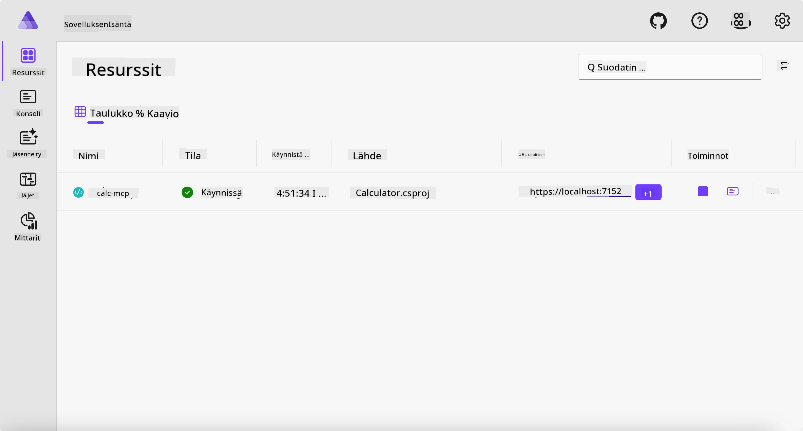
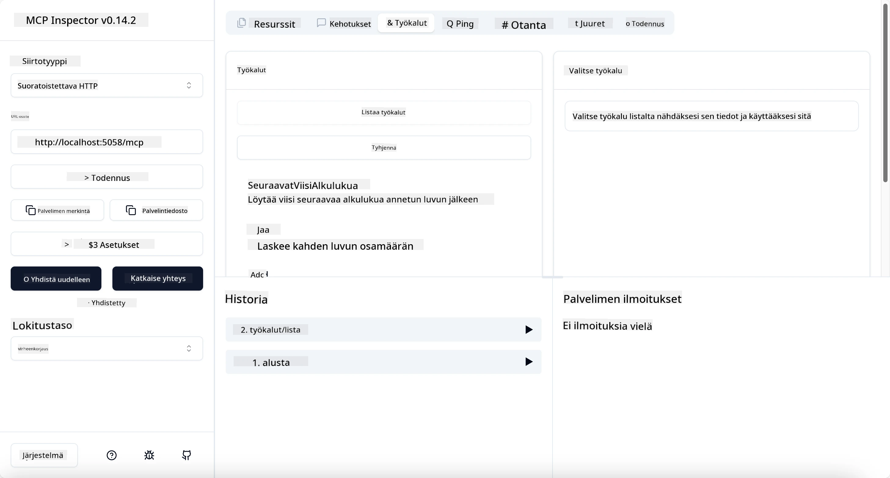
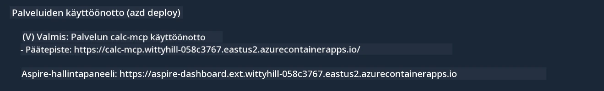

# Esimerkki

Edellinen esimerkki näyttää, miten paikallista .NET-projektia käytetään käyttämällä `stdio`-tyyppiä. Ja miten palvelin ajetaan paikallisesti säilössä. Tämä on hyvä ratkaisu monissa tilanteissa. Kuitenkin voi olla hyödyllistä, että palvelin pyörii etänä, esimerkiksi pilviympäristössä. Tässä kohtaa `http`-tyyppi tulee mukaan.

Kun katsot ratkaisua kansiossa `04-PracticalImplementation`, se voi näyttää paljon monimutkaisemmalta kuin edellinen. Mutta todellisuudessa se ei ole. Jos katsot tarkasti projektia `src/Calculator`, näet, että se on enimmäkseen samaa koodia kuin edellisessä esimerkissä. Ainoa ero on, että käytämme eri kirjastoa `ModelContextProtocol.AspNetCore` HTTP-pyyntöjen käsittelyyn. Muutamme myös metodin `IsPrime` yksityiseksi, vain näyttääksemme, että koodissasi voi olla yksityisiä metodeja. Loput koodista on samaa kuin aiemmin.

Muut projektit ovat [Aspire](https://aspire.dev/get-started/what-is-aspire/) -alustalta. Aspire-ratkaisun mukana olo parantaa kehittäjän kokemusta kehityksessä ja testauksessa sekä auttaa havaittavuudessa. Se ei ole pakollinen palvelimen ajamiseen, mutta se on hyvä käytäntö ottaa mukaan ratkaisuun.

## Käynnistä palvelin paikallisesti

1. VS Codesta (C# DevKit -laajennuksen kanssa), siirry kansioon `04-PracticalImplementation/samples/csharp`.
1. Suorita seuraava komento käynnistääksesi palvelimen:

   ```bash
    dotnet watch run --project ./src/AppHost
   ```

1. Kun verkkoselain avaa Aspire-hallintapaneelin, huomaa `http` URL-osoite. Sen pitäisi olla jotain kuten `http://localhost:5058/`.

   

## Testaa Streamable HTTP MCP Inspectorilla

Jos sinulla on Node.js versio 22.7.5 tai uudempi, voit käyttää MCP Inspectoria testataksesi palvelintasi.

Käynnistä palvelin ja aja seuraava komento terminaalissa:

```bash
npx @modelcontextprotocol/inspector http://localhost:5058
```



- Valitse kuljetustyypiksi `Streamable HTTP`.
- Syötä Url-kenttään palvelimen aiemmin noteerattu URL osoite ja lisää `/mcp` perään. Sen pitäisi olla `http` (ei `https`), esimerkiksi `http://localhost:5058/mcp`.
- valitse Connect-painike.

Inspectorin hyvä puoli on, että se tarjoaa hyvän näkyvyyden tapahtumiin.

- Kokeile listata saatavilla olevat työkalut
- Kokeile joitain niistä, niiden pitäisi toimia kuten ennenkin.

## Testaa MCP-palvelin GitHub Copilot Chatilla VS Codessa

Käyttääksesi Streamable HTTP -kuljetinta GitHub Copilot Chatin kanssa, muuta aiemmin luodun `calc-mcp` palvelimen konfiguraatio näyttämään tältä:

```jsonc
// .vscode/mcp.json
{
  "servers": {
    "calc-mcp": {
      "type": "http",
      "url": "http://localhost:5058/mcp"
    }
  }
}
```

Tee joitain testejä:

- Kysy "3 alkulukua luvun 6780 jälkeen". Huomaa, että Copilot käyttää uusia työkaluja `NextFivePrimeNumbers` ja palauttaa vain ensimmäiset 3 alkulukua.
- Kysy "7 alkulukua luvun 111 jälkeen", nähdäksesi mitä tapahtuu.
- Kysy "Johnilla on 24 karamellia ja hän haluaa jakaa ne kaikille kolmelle lapselleen. Kuinka monta karamellia jokaisella lapsella on?", nähdäksesi mitä tapahtuu.

## Julkaise palvelin Azureen

Julkaistaan palvelin Azureen, jotta useammat ihmiset voivat käyttää sitä.

Siirry terminaalissa kansioon `04-PracticalImplementation/samples/csharp` ja suorita seuraava komento:

```bash
azd up
```

Julkaisun päätyttyä näet viestin kuten tämä:



Kopioi URL ja käytä sitä MCP Inspectorissa ja GitHub Copilot Chatissa.

```jsonc
// .vscode/mcp.json
{
  "servers": {
    "calc-mcp": {
      "type": "http",
      "url": "https://calc-mcp.gentleriver-3977fbcf.australiaeast.azurecontainerapps.io/mcp"
    }
  }
}
```

## Mitä seuraavaksi?

Kokeilemme erilaisia kuljetustyyppejä ja testausvälineitä. Julkaisemme MCP-palvelimesi myös Azureen. Mutta entä jos palvelimemme tarvitsee pääsyn yksityisiin resursseihin? Esimerkiksi tietokantaan tai yksityiseen APIiin? Seuraavassa luvussa katsomme, miten voimme parantaa palvelimemme turvallisuutta.

---

<!-- CO-OP TRANSLATOR DISCLAIMER START -->
**Vastuuvapauslauseke**:
Tämä asiakirja on käännetty käyttämällä tekoälypohjaista käännöspalvelua [Co-op Translator](https://github.com/Azure/co-op-translator). Vaikka pyrimme tarkkuuteen, otathan huomioon, että automaattiset käännökset saattavat sisältää virheitä tai epätarkkuuksia. Alkuperäinen asiakirja sen alkuperäiskielellä on virallinen lähde. Tärkeissä asioissa suositellaan ammattimaista ihmiskäännöstä. Emme ole vastuussa tämän käännöksen käytöstä aiheutuvista väärinymmärryksistä tai tulkinnoista.
<!-- CO-OP TRANSLATOR DISCLAIMER END -->