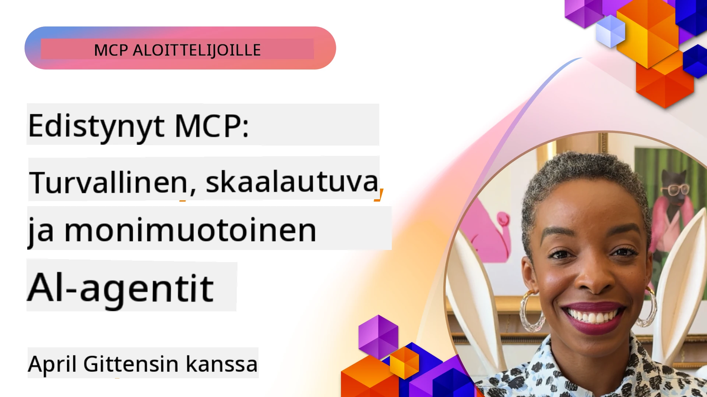

# Edistyneet aihealueet MCP:ssä

_(Klikkaa yllä olevaa kuvaa nähdäksesi videon tästä oppitunnista)_

Tämä luku käsittelee sarjaa edistyneitä aiheita Model Context Protocol (MCP) -toteutuksessa, mukaan lukien monimuotoinen integrointi, skaalautuvuus, turvallisuuden parhaat käytännöt ja yritysin­tegrointi. Nämä aiheet ovat ratkaisevia, jotta voidaan rakentaa vahvoja ja tuotantovalmiita MCP-sovelluksia, jotka vastaavat nykyaikaisten tekoälyjärjestelmien tarpeisiin.

## Yleiskatsaus

Tämä oppitunti tutkii edistyneitä käsitteitä Model Context Protocol -toteutuksessa, keskittyen monimuotoiseen integrointiin, skaalautuvuuteen, turvallisuuden parhaisiin käytäntöihin ja yritysin­tegrointiin. Nämä aiheet ovat välttämättömiä tuotantoluokkaisten MCP-sovellusten rakentamiseen, jotka pystyvät käsittelemään monimutkaisia vaatimuksia yritysympäristöissä.

> **Nykyinen määritelmämuistutus:** MCP `2026-07-28` poistaa käytöstä Roots- ja
> Sampling-perusteet, jotka käsitellään oppitunneissa 5.4 ja 5.6. Se myös siirtää
> kokeellisen Tasks-ominaisuuden, joka mainitaan Protocol Features (5.16):ssa,
> erilliseksi Tasks-laajennukseksi. Nämä oppitunnit säilytetään legacy-
> `2025-11-25` -toteutuksia varten ja sisältävät siirtymisen ohjeistuksen. Katso
> [Mitä MCP:ssä on muuttunut: 2026-07-28 määritelmä](../01-CoreConcepts/mcp-2026-07-28.md).

## Oppimistavoitteet

Oppitunnin lopuksi osaat:

- Toteuttaa monimuotoiset ominaisuudet MCP-kehyksissä
- Suunnitella skaalautuvia MCP-arkkitehtuureja korkean kysynnän skenaarioihin
- Soveltaa MCP:n turvallisuusperiaatteita vastaavia parhaimpia turvallisuuskäytäntöjä
- Integroitu MCP yritysten tekoälyjärjestelmiin ja kehyksiin
- Optimoida suorituskykyä ja luotettavuutta tuotantoympäristöissä

## Oppitunnit ja esimerkkiprojektit

| Linkki | Otsikko | Kuvaus |
|------|-------|-------------|
| [5.1 Integrointi Azureen](./mcp-integration/README.md) | Integrointi Azureen | Opi integroimaan MCP-palvelimesi Azureen |
| [5.2 Monimuotoinen esimerkki](./mcp-multi-modality/README.md) | MCP monimuotoiset esimerkit | Esimerkkejä ääni-, kuva- ja monimuotoisesta vastauksesta |
| [5.3 MCP OAuth2 esimerkki](../../../05-AdvancedTopics/mcp-oauth2-demo) | MCP OAuth2 Demo | Minimipohjainen Spring Boot -sovellus, joka näyttää OAuth2:n MCP:n kanssa sekä valtuutus- että resurssipalvelimena. Esittelee turvallisen tokenin myöntämisen, suojatut päätepisteet, Azure Container Apps -käyttöönoton ja API Management -integroinnin. |
| [5.4 Root Contexts](./mcp-root-contexts/README.md) | Root contextit | Opi legacy `2025-11-25` Roots-peruste ja nykyiset siirtymäskenaariot (poistettu käytöstä `2026-07-28`) |
| [5.5 Reititys](./mcp-routing/README.md) | Reititys | Opi eri reititystyypit |
| [5.6 Otanta](./mcp-sampling/README.md) | Otanta | Opi legacy `2025-11-25` Sampling-peruste ja nykyiset siirtymäskenaariot (poistettu käytöstä `2026-07-28`) |
| [5.7 Skaalaus](./mcp-scaling/README.md) | Skaalaus | Opi skaalaamisesta |
| [5.8 Turvallisuus](./mcp-security/README.md) | Turvallisuus | Turvaa MCP-palvelimesi |
| [5.9 Verkkohaku-esimerkki](./web-search-mcp/README.md) | Verkkohaku MCP | Python MCP-palvelin ja asiakas, jotka integroituvat SerpAPI:in reaaliaikaisiin verkko-, uutis-, tuotehakuihin ja kysymys-vastaus -toimintoihin. Esittelee monityökaluisen orkestraation, ulkoisen API-integroinnin ja vankan virheenkäsittelyn. |
| [5.10 Reaaliaikainen suoratoisto](./mcp-realtimestreaming/README.md) | Suoratoisto | Reaaliaikainen datan suoratoisto on nykypäivän datalähtöisessä maailmassa välttämätöntä, kun liiketoiminnat ja sovellukset tarvitsevat välitöntä pääsyä tietoihin tehdäkseen oikea-aikaisia päätöksiä. |
| [5.11 Reaaliaikainen verkkohaku](./mcp-realtimesearch/README.md) | Verkkohaku | Reaaliaikainen verkkohaku - miten MCP muuttaa reaaliaikaista verkkohakua tarjoamalla standardoidun lähestymistavan kontekstinhallintaan tekoälymallien, hakukoneiden ja sovellusten välillä. |
| [5.12 Entra ID -todennus Model Context Protocol -palvelimille](./mcp-security-entra/README.md) | Entra ID -todennus | Microsoft Entra ID tarjoaa vakaan pilvipohjaisen identiteetin ja pääsynhallinnan ratkaisun, joka auttaa varmistamaan, että vain valtuutetut käyttäjät ja sovellukset voivat käyttää MCP-palvelintasi. |
| [5.13 Microsoft Foundry Agent -integraatio](./mcp-foundry-agent-integration/README.md) | Microsoft Foundry -integraatio | Opi integroimaan Model Context Protocol -palvelimet Microsoft Foundry -agenttien kanssa, mahdollistaen tehokkaan työkalujen orkestroinnin ja yritystason tekoälyominaisuudet standardoiduilla ulkoisten tietolähteiden yhteyksillä. |
| [5.14 Kontekstisuunnittelu](./mcp-contextengineering/README.md) | Kontekstisuunnittelu | Konteksti-insinööritaitojen tulevaisuuden mahdollisuudet MCP-palvelimille, mukaan lukien kontekstin optimointi, dynaaminen kontekstinhallinta ja strategiat tehokkaaseen kehotteiden suunnitteluun MCP-kehyksissä. |
| [5.15 MCP mukautettu tiedonsiirto](./mcp-transport/README.md) | Mukautettu tiedonsiirto | Opi toteuttamaan mukautettuja tiedonsiirtomekanismeja erikoistuneisiin MCP-viestintätilanteisiin. |
| [5.16 Syväsukellus protokollaominaisuuksiin](./mcp-protocol-features/README.md) | Protokollaominaisuudet | Hallitse edistyneet protokollaominaisuudet, mukaan lukien etenemisilmoitukset, pyyntöjen peruutus, resurssimallit ja virheenkäsittelykaavat. |
| [5.17 Vastakkaisten monitoimijaisten päätelmämenetelmien käyttö](./mcp-adversarial-agents/README.md) | Vasta-agentsit | Käytä kahta erimielistä agenttia, jotka jakavat saman MCP-työkalupaketin, havaitsemaan harhoja, altistamaan reunatapauksia ja tuottamaan paremmin kalibroitua outputtia rakenteellisen väittelyn avulla. |

> **Historiallinen `2025-11-25` muistutus:** kyseinen versio sisälsi kokeelliset
> Tasks-ominaisuudet ja laajensi useita protokollaominaisuuksia. Versiossa `2026-07-28`
> Tasks siirtyi viralliseksi laajennukseksi ja Roots poistui käytöstä. Älä käytä
> `2025-11-25` ominaisuustilaa nykyisenä ohjeistuksena; katso
> [2026-07-28 muutosloki](https://modelcontextprotocol.io/specification/2026-07-28/changelog).

## Lisäviitteitä

Ajantasaisimman tiedon saamiseksi edistyneistä MCP-aiheista, katso:
- [MCP-dokumentaatio](https://modelcontextprotocol.io/)
- [MCP-määrittely (2026-07-28)](https://modelcontextprotocol.io/specification/2026-07-28/)
- [GitHub-repositorio](https://github.com/modelcontextprotocol)
- [OWASP MCP Top 10](https://microsoft.github.io/mcp-azure-security-guide/mcp/) - Turvallisuusriskit ja niiden hallinta
- [MCP Security Summit Workshop (Sherpa)](https://azure-samples.github.io/sherpa/) - Käytännön turvallisuuskoulutus

## Keskeiset opit

- Monimuotoiset MCP-toteutukset laajentavat tekoälyn kyvykkyyksiä tekstinkäsittelyn ulkopuolelle
- Skaalautuvuus on välttämätöntä yritysympäristöjen käyttöönotossa, ja se voidaan ratkaista horisontaalisella ja vertikaalisella skaalaamisella
- Kattavat turvallisuustoimenpiteet suojaavat dataa ja varmistavat asianmukaisen pääsynvalvonnan
- Yritysin­tegrointi alustoihin kuten Azure OpenAI ja Microsoft AI Foundry parantaa MCP:n kyvykkyyksiä
- Edistyneet MCP-toteutukset hyötyvät optimoiduista arkkitehtuureista ja huolellisesta resurssien hallinnasta

## Harjoitus

Suunnittele yritysluokan MCP-toteutus tiettyä käyttötarkoitusta varten:

1. Määrittele monimuotoiset vaatimukset käyttötarkoituksellesi
2. Laadi suojausmekanismit arkaluontoisen datan suojaamiseksi
3. Suunnittele skaalautuva arkkitehtuuri, joka pystyy käsittelemään vaihtelevaa kuormitusta
4. Suunnittele integraatiopisteet yritysten tekoälyjärjestelmiin
5. Dokumentoi mahdolliset suorituskyvyn pullonkaulat ja niiden hallintastrategiat

## Lisäresurssit

- [Azure OpenAI -dokumentaatio](https://learn.microsoft.com/en-us/azure/ai-services/openai/)
- [Microsoft AI Foundry -dokumentaatio](https://learn.microsoft.com/en-us/ai-services/)

---

## Mitä seuraavaksi

Tutustu tämän moduulin oppitunteihin alkaen: [5.1 MCP-integrointi](./mcp-integration/README.md)

Kun olet suorittanut tämän moduulin, jatka: [Moduuli 6: Yhteisön panokset](../06-CommunityContributions/README.md)

---

<!-- CO-OP TRANSLATOR DISCLAIMER START -->
**Vastuuvapauslauseke**:
Tämä asiakirja on käännetty käyttämällä tekoälypohjaista käännöspalvelua [Co-op Translator](https://github.com/Azure/co-op-translator). Vaikka pyrimme tarkkuuteen, otathan huomioon, että automaattiset käännökset saattavat sisältää virheitä tai epätarkkuuksia. Alkuperäinen asiakirja sen alkuperäiskielellä on virallinen lähde. Tärkeissä asioissa suositellaan ammattimaista ihmiskäännöstä. Emme ole vastuussa tämän käännöksen käytöstä aiheutuvista väärinymmärryksistä tai tulkinnoista.
<!-- CO-OP TRANSLATOR DISCLAIMER END -->