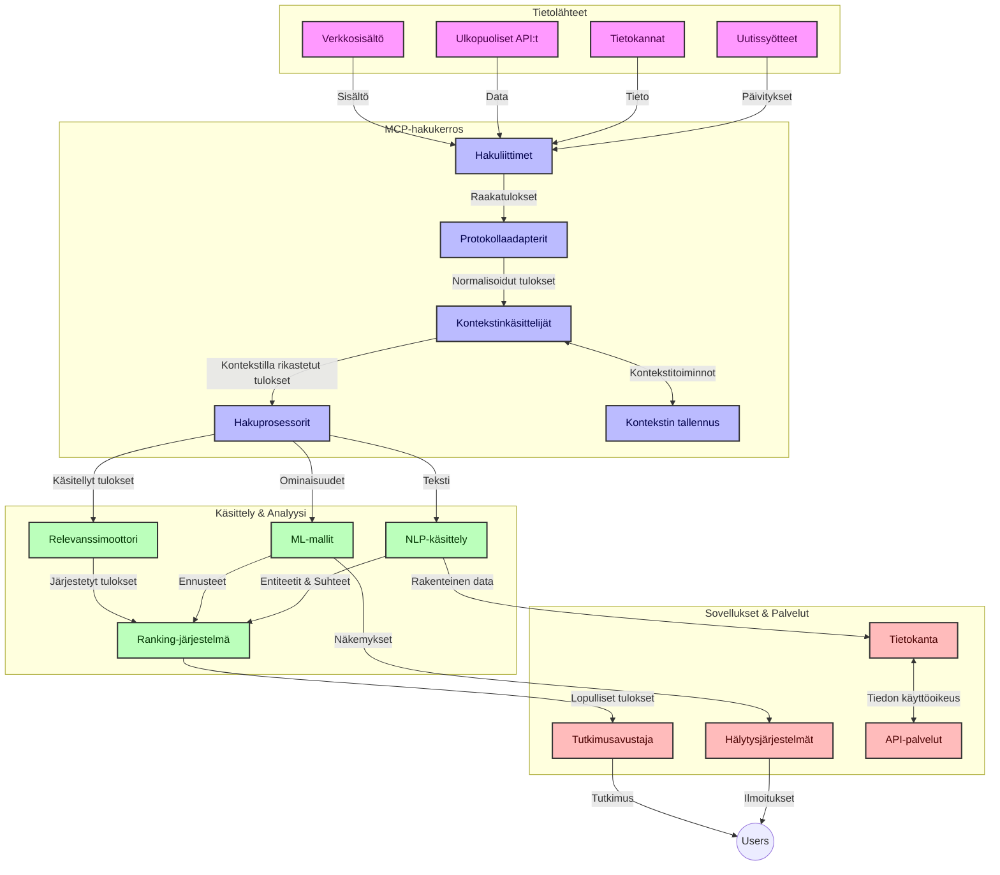
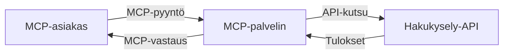
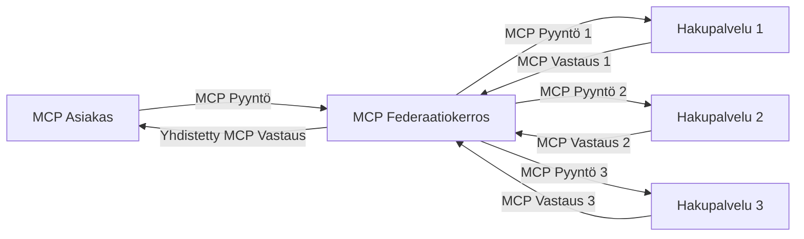
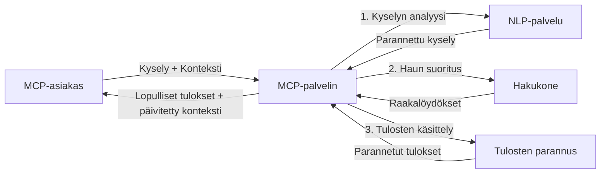

# Mallikontekstiprotokolla reaaliaikaiseen verkkohakuun

## Yleiskatsaus

Reaaliaikainen verkkohaku on nykyisessä tietojen hallintaan perustuvassa ympäristössä välttämätöntä, jossa sovellusten on saatava välitöntä pääsyä ajantasaiseen tietoon internetissä tarjotakseen olennaisia ja ajankohtaisia vastauksia. Mallikontekstiprotokolla (MCP) edustaa merkittävää edistystä näiden reaaliaikaisten hakuprosessien optimoinnissa, parantaen haun tehokkuutta, säilyttäen kontekstuaalisen eheyttä ja kehittäen järjestelmän kokonaissuorituskykyä.

Tämä moduuli tutkii, miten MCP muuttaa reaaliaikaista verkkohakua tarjoamalla standardoidun lähestymistavan kontekstinhallintaan tekoälymallien, hakukoneiden ja sovellusten välillä.

### Mitä opit

Tässä kattavassa oppaassa opit:

- Kuinka MCP luo saumattoman sillan tekoälymallien ja reaaliaikaisten verkkohakumahdollisuuksien välille
- Arkkitehtonisia malleja tehokkaiden ja skaalautuvien hakuratkaisujen toteuttamiseen MCP:n avulla
- Tekniikoita hakukontekstin säilyttämiseen useiden kyselyiden ja vuorovaikutusten ajan
- Käytännön koodiesimerkkejä Pythonilla ja JavaScriptillä erilaisiin hakutilanteisiin
- Menetelmiä tasapainottaa merkityksellisyyttä, ajantasaisuutta ja suorituskykyä MCP-pohjaisissa hakujärjestelmissä

## Johdanto reaaliaikaiseen verkkohakuun

Reaaliaikainen verkkohaku on teknologinen lähestymistapa, joka mahdollistaa jatkuvan kyselyn, käsittelyn ja analysoinnin verkossa julkaistavasta tai päivitettävästä tiedosta, antaen järjestelmille mahdollisuuden tarjota tuoretta ja relevanttia tietoa minimiviiveellä. Toisin kuin perinteiset hakujärjestelmät, jotka toimivat indeksoidulla tiedolla, joka saattaa olla tunteja tai päiviä vanhaa, reaaliaikaiset haut käsittelevät verkkotietoa elävältä, tarjoten tietoa ja näkymiä, jotka heijastavat online-sisällön nykytilaa.

### Reaaliaikaisen verkkohakujen keskeiset käsitteet:

- **Jatkuva kyselyiden käsittely**: Hakukyselyitä käsitellään jatkuvasti päivittyviä tietolähteitä vastaan
- **Ajantasaisuuden priorisointi**: Järjestelmät on suunniteltu korostamaan tuoretta tietoa
- **Merkityksellisyyden ja ajantasaisuuden tasapaino**: Tasapainon ylläpitäminen merkityksen ja ajantasaisuuden välillä
- **Skaalautuva arkkitehtuuri**: Järjestelmien on pystyttävä käsittelemään vaihtelevia kyselykuormia ja tietomääriä
- **Kontekstuaalinen ymmärrys**: Käyttäjän kontekstin säilyttäminen hakukierrosten aikana on ratkaisevaa merkityksellisten tulosten saamiseksi
- **Dynaaminen kyselyiden uudelleenmuotoilu**: Kyselyjen mukautuva muuttaminen kontekstin ja aiempien tulosten perusteella
- **Monilähteinen integraatio**: Tulosten yhdistäminen useista hakupalveluista ja verkkolähteistä
- **Semanttinen ymmärrys**: Kyselyjen ja sisällön käsittely merkityksen perusteella eikä pelkästään avainsanojen
- **Reaaliaikainen sijoittelu**: Tulosten sijoittelun jatkuva säätö uusien tietojen ilmaantuessa

### Mallikontekstiprotokolla ja reaaliaikainen verkkohaku

Mallikontekstiprotokolla (MCP) ratkaisee useita keskeisiä haasteita reaaliaikaisen verkkohakujen ympäristöissä:

1. **Hakukontekstin säilyttäminen**: MCP standardoi miten konteksti ylläpidetään hajautetuissa hakukomponenteissa, varmistaen, että tekoälymallit ja prosessointisolmut saavat käyttöönsä olennaisen kyselyhistorian ja käyttäjäasetukset.

2. **Tehokas kyselyiden hallinta**: Tarjoamalla rakenteellisia mekanismeja kontekstin siirtoon MCP vähentää ylimääräistä kuormitusta, joka syntyy kontekstin jatkuvasta toistamisesta kussakin hakukierrossa.

3. **Yhteensopivuus**: MCP luo yhteisen kielen kontekstin jakamiseen erilaisten hakuteknologioiden ja tekoälymallien välillä, mahdollistaen joustavammat ja laajennettavammat arkkitehtuurit.

4. **Hakuun optimoitu konteksti**: MCP:n toteutukset voivat priorisoida, mitkä konteksti-elementit ovat kaikkein olennaisimpia tehokkaan haun kannalta, optimoiden sekä suorituskykyä että tarkkuutta.

5. **Mukautuva hakuprosessointi**: Oikeanlaisen kontekstinhallinnan avulla MCP:n kautta hakujärjestelmät voivat dynaamisesti säätää prosessointia käyttäjän tarpeiden ja tietoympäristön muuttuessa.

Nykyaikaisissa sovelluksissa uutisten kokoamisesta tutkimusavustajiin MCP:n integrointi verkkohakuteknologioihin mahdollistaa älykkäämpiä, kontekstitietoisia hakuja, jotka tarjoavat yhä merkityksellisempiä tuloksia käyttäjän vuorovaikutusten jatkuessa.

## Oppimistavoitteet

Tämän oppitunnin lopuksi osaat:

- Ymmärtää reaaliaikaisen verkkohakujen perusteet ja niiden haasteet nykyaikaisissa sovelluksissa
- Selittää, miten Mallikontekstiprotokolla (MCP) parantaa reaaliaikaisen verkkohakujen kyvykkyyksiä
- Toteuttaa MCP-pohjaisia hakuratkaisuja käyttäen suosittuja kehityskehyksiä ja API-rajapintoja
- Suunnitella ja ottaa käyttöön skaalautuvia, korkean suorituskyvyn hakuar-kkitehtuureja MCP:n avulla
- Soveltaa MCP-käsitteitä erilaisissa käyttötapauksissa, kuten semanttinen haku, tutkimusapu ja tekoälyn rikastama selaaminen
- Arvioida MCP-pohjaisen hakuteknologian kehittyviä suuntauksia ja tulevia innovaatioita
- Kehittää kontekstia ymmärtäviä hakujärjestelmiä, jotka oppivat käyttäjän vuorovaikutuksista
- Integroida verkkohakumahdollisuudet tekoälyavustajiin käyttäen standardoituja MCP-protokollia
- Luoda monivaiheisia hakuprosesseja, jotka asteittain tarkentavat tuloksia kontekstin perusteella
- Optimoida hakusuorituskykyä säilyttäen laaja kontekstitietoisuus

### Määritelmä ja merkitys

Reaaliaikainen verkkohaku käsittää verkkopohjaisen tiedon jatkuvan kyselyn, haun ja toimituksen minimiviiveellä. Toisin kuin perinteiset hakukoneet, jotka indeksoivat ja selaavat verkkoa ajoittain, reaaliaikainen haku pyrkii paljastamaan tietoa heti saataville tullessaan, mahdollistaen välittömän pääsyn ajan tasalla olevaan sisältöön.

Reaaliaikaisen verkkohakujen keskeisiä ominaisuuksia ovat:

- **Tuoreus**: Ajankohtaisten sisältöjen ja päivitysten priorisointi
- **Jatkuva prosessointi**: Uuden tiedon jatkuva seuranta
- **Kyselyjen mukautuminen**: Hakukyselyjen hienosäätö kontekstin ja palautteen perusteella
- **Välitön toimitus**: Hakutulosten tarjoaminen mahdollisimman nopeasti
- **Kontekstin säilyttäminen**: Aiempien kyselyiden hyödyntäminen merkityksellisyyden parantamiseksi

### Haasteet perinteisessä verkkohakussa

Perinteisillä verkkohakumenetelmillä on useita rajoituksia, kun niitä sovelletaan reaaliaikaisiin tilanteisiin:

1. **Kontekstin pirstoutuminen**: Vaikeus säilyttää hakukonteksti useiden kyselyjen välillä
2. **Tiedon tuoreuden haasteet**: Vanhimman tiedon saatavuuden ja priorisoinnin ongelmat
3. **Integraation monimutkaisuus**: Yhteensopivuusongelmat hakujärjestelmien ja sovellusten välillä
4. **Viiveongelmat**: Tasapaino kattavan haun ja vastausajan vaatimusten välillä
5. **Merkityksen säätö**: Tarkkuuden ja merkityksellisyyden varmistaminen samalla kun korostetaan ajantasaisuutta

## Mallikontekstiprotokollan (MCP) ymmärtäminen haussa

### Mikä on MCP hakukonteksteissa?

Mallikontekstiprotokolla (MCP) on standardoitu viestintäprotokolla, joka on suunniteltu helpottamaan tehokasta vuorovaikutusta tekoälymallien ja sovellusten välillä. Reaaliaikaisen verkkohakujen kontekstissa MCP tarjoaa kehyksen:

- Hakukontekstin säilyttämiseen koko kyselyketjun ajan
- Hakukyselyjen ja tulosten formaattien standardisointiin
- Hakuehtojen ja tulosten siirron optimointiin
- Mallin ja hakukoneen välisen viestinnän parantamiseen

### Keskeiset komponentit ja arkkitehtuuri

MCP-arkkitehtuuri reaaliaikaisessa verkkohakussa koostuu useista keskeisistä osista:

1. **Kyselykontekstin käsittelijät**: Hallitsevat ja ylläpitävät hakukontekstia useiden kyselyiden aikana
2. **Hakuprosessorit**: Käsittelevät saapuvia hakupyyntöjä kontekstitietoisilla tekniikoilla
3. **Protokollaadapterit**: Muuntavat eri hakujen API-rajapinnat konteksti säilyttäen
4. **Kontekstivarasto**: Tallentaa ja hakee tehokkaasti hakuhistorian ja asetukset
5. **Hakuliittimet**: Yhdistävät erilaisiin hakukoneisiin ja verkkorajapintoihin



### Miten MCP parantaa reaaliaikaista verkkohakua

MCP ratkaisee perinteisen verkkohakujen haasteita seuraavasti:

- **Kontekstuaalinen jatkuvuus**: Säilyttää yhteydet kyselyiden välillä koko hakusession ajan
- **Optimoitu siirto**: Vähentää turhaa päällekkäisyyttä hakuehdoissa älykkään kontekstinhallinnan avulla
- **Standardoidut rajapinnat**: Tarjoaa yhtenäiset API-rajapinnat hakukomponenteille
- **Vähentynyt viive**: Minimoi prosessointikuormituksen tehokkaan kontekstinkäsittelyn avulla
- **Parannettu merkityksellisyys**: Parantaa hakutulosten osuvuutta säilyttämällä käyttäjän aikomuksen monen kyselyn yli

## Integraatio ja toteutus

Reaaliaikaiset verkkohakujärjestelmät vaativat huolellista arkkitehtuurisuunnittelua ja toteutusta suorituskyvyn ja kontekstuaalisen eheyden ylläpitämiseksi. Mallikontekstiprotokolla tarjoaa standardoidun lähestymistavan tekoälymallien ja hakuteknologioiden yhdistämiseen, mahdollistaen kehittyneemmät ja kontekstitietoiset hakuputket.

### MCP:n integroinnin yleiskatsaus hakuar-kkitehtuureissa

MCP:n toteuttamisessa reaaliaikaisissa verkkohakuympäristöissä on otettava huomioon useita keskeisiä seikkoja:

1. **Hakukontekstin serialisointi**: MCP tarjoaa tehokkaita mekanismeja kontekstuaalisen tiedon koodaukseen hakupyyntöihin, varmistaen että olennainen konteksti seuraa kyselyä koko prosessointiputken läpi. Tämä sisältää standardoidut serialisointiformaatit, jotka on optimoitu hakuihin liittyvälle metatiedolle.

2. **Tilallisen hakuprosessoinnin mahdollistaminen**: MCP mahdollistaa älykkäämmän tilallisen prosessoinnin ylläpitämällä johdonmukaista kontekstin esitystä hakukierrosten aikana. Tämä on erityisen arvokasta monivaiheisissa hakuputkissa, joissa kontekstin tarkentaminen parantaa tuloksia.

3. **Kyselyiden laajentaminen ja tarkentaminen**: MCP:n toteutukset hakujärjestelmissä mahdollistavat edistyksellisen kyselyiden laajentamisen ja hienosäädön kertyneen kontekstin perusteella, antaen yhä merkityksellisempiä tuloksia hakusession edetessä.

4. **Tulosten välimuisti ja priorisointi**: Standardoimalla kontekstin käsittelyä MCP auttaa hallitsemaan tulosten välimuistia ja priorisointia, jolloin komponentit voivat mukautua kehittyvän hakukontekstin mukaan.

5. **Haun federaatio ja yhdistäminen**: MCP edistää kehittyneempää haun federointia useiden backendien välillä tarjoamalla rakenteellisia esityksiä hakukontekstista, mahdollistaen merkityksellisemmän tulosten yhdistämisen eri lähteistä.

MCP:n toteutus erilaisissa hakuteknologioissa luo yhtenäisen lähestymistavan kontekstinhallintaan, vähentäen räätälöidyn integraatiokoodin tarvetta samalla kun parantaa järjestelmän kykyä säilyttää merkityksellinen konteksti hakukyselyiden kehittyessä.

### MCP eri verkkohakutoteutuksissa

Nämä esimerkit noudattavat nykyistä MCP-määritystä, joka keskittyy JSON-RPC-pohjaiseen protokollaan eri siirtomekanismeilla. Koodi osoittaa, miten voit toteuttaa mukautettuja hakusin­tegraatioita säilyttäen täyden yhteensopivuuden MCP-protokollan kanssa.


<details>
<summary>Python-toteutus yleisellä hakuliittymällä</summary>

```python
import asyncio
import json
import aiohttp
from typing import Dict, Any, Optional, List
from contextlib import asynccontextmanager
from collections.abc import AsyncIterator

# Tuo standardit MCP-kirjastot
from mcp.client.session import ClientSession
from mcp.client.streamable_http import streamablehttp_client
from mcp.types import TextContent, CreateMessageRequestParams, CreateMessageResult
from mcp.server.fastmcp import FastMCP

# Luo FastMCP-palvelin verkkohakua varten
search_server = FastMCP("WebSearch")

# Luokka hallinnoi verkkohakuoperaatioita
class WebSearchHandler:
    def __init__(self, api_endpoint: str, api_key: str):
        self.api_endpoint = api_endpoint
        self.api_key = api_key
        self.session = None
        
    async def initialize(self):
        """Initialize the HTTP session"""
        self.session = aiohttp.ClientSession(
            headers={"Authorization": f"Bearer {self.api_key}"}
        )
    
    async def close(self):
        """Close the HTTP session"""
        if self.session:
            await self.session.close()
            
    async def perform_search(self, query: str, max_results: int = 5, 
                           include_domains: List[str] = None, 
                           exclude_domains: List[str] = None,
                           time_period: str = "any") -> Dict[str, Any]:
        """Perform web search using the search API"""
        # Rakenna hakuparametrit
        search_params = {
            "q": query,
            "limit": max_results,
            "time": time_period
        }
        
        if include_domains:
            search_params["site"] = ",".join(include_domains)
            
        if exclude_domains:
            search_params["exclude_site"] = ",".join(exclude_domains)
        
        # Suorita hakupyyntö
        try:
            async with self.session.get(
                self.api_endpoint,
                params=search_params
            ) as response:
                if response.status != 200:
                    error_text = await response.text()
                    raise Exception(f"Search API error: {response.status} - {error_text}")
                
                search_data = await response.json()
                
                # Muunna API-kohtainen vastaus standardimuotoon
                results = []
                for item in search_data.get("results", []):
                    results.append({
                        "title": item.get("title", ""),
                        "url": item.get("url", ""),
                        "snippet": item.get("snippet", ""),
                        "date": item.get("published_date", ""),
                        "source": item.get("source", "")
                    })
                
                return {
                    "query": query,
                    "totalResults": len(results),
                    "results": results
                }
        except Exception as e:
            print(f"Search API request error: {e}")
            raise

# Alusta hakukäsittelijä
search_handler = WebSearchHandler(
    api_endpoint="https://api.search-service.example/search",
    api_key="your-api-key-here"
)

# Määritä elinkaari hallinnoimaan hakukäsittelijää
@asyncio.asynccontextmanager
async def app_lifespan(server: FastMCP):
    """Manage application lifecycle"""
    await search_handler.initialize()
    try:
        yield {"search_handler": search_handler}
    finally:
        await search_handler.close()

# Aseta elinkaari palvelimelle
search_server = FastMCP("WebSearch", lifespan=app_lifespan)

# Rekisteröi verkkohakutyökalu
@search_server.tool()
async def web_search(query: str, max_results: int = 5, 
                   include_domains: List[str] = None,
                   exclude_domains: List[str] = None,
                   time_period: str = "any") -> Dict[str, Any]:
    """
    Search the web for information
    
    Args:
        query: The search query
        max_results: Maximum number of results to return (default: 5)
        include_domains: List of domains to include in search results
        exclude_domains: List of domains to exclude from search results
        time_period: Time period for results ("day", "week", "month", "any")
        
    Returns:
        Dictionary containing search results
    """
    ctx = search_server.get_context()
    search_handler = ctx.request_context.lifespan_context["search_handler"]
    
    results = await search_handler.perform_search(
        query=query,
        max_results=max_results,
        include_domains=include_domains,
        exclude_domains=exclude_domains,
        time_period=time_period
    )
    
    return results

# Esimerkki asiakaskäytöstä
async def client_example():
    # Yhdistä hakupalvelimeen käyttäen Streamable HTTP -välitystä
    async with streamablehttp_client("http://localhost:8000/mcp") as (read, write, _):
        async with ClientSession(read, write) as session:
            # Alusta yhteys
            await session.initialize()
            
            # Kutsu web_search-työkalua
            search_results = await session.call_tool(
                "web_search", 
                {
                    "query": "latest developments in AI and Model Context Protocol",
                    "max_results": 5,
                    "time_period": "day",
                    "include_domains": ["github.com", "microsoft.com"]
                }
            )
            
            print(f"Search results: {search_results}")

# Palvelimen suoritus-esimerkki
if __name__ == "__main__":
    # Aja palvelin Streamable HTTP -välityksellä
    search_server.run(transport="streamable-http")
```
</details> 

<details>
<summary>JavaScript-toteutus selaimessa tapahtuvaan hakuun</summary>


```javascript
// MCP-palvelimen toteutus verkkohakuun
import { McpServer, ResourceTemplate } from '@modelcontextprotocol/sdk/server/mcp.js';
import { StreamableHTTPServerTransport } from '@modelcontextprotocol/sdk/server/streamableHttp.js';
import { z } from 'zod';

// Luo MCP-palvelin verkkohakua varten
const searchServer = new McpServer({
    name: "BrowserSearch",
    description: "A server that provides web search capabilities"
});

// Hakupalveluluokka
class SearchService {
    constructor(searchApiUrl, apiKey) {
        this.searchApiUrl = searchApiUrl;
        this.apiKey = apiKey;
    }

    async performSearch(parameters) {
        const {
            query = '',
            maxResults = 5,
            includeDomains = [],
            excludeDomains = [],
            timePeriod = 'any'
        } = parameters;
        
        // Rakenna hakujen URL parametreilla
        const url = new URL(this.searchApiUrl);
        url.searchParams.append('q', query);
        url.searchParams.append('limit', maxResults);
        url.searchParams.append('time', timePeriod);
        
        if (includeDomains.length > 0) {
            url.searchParams.append('site', includeDomains.join(','));
        }
        
        if (excludeDomains.length > 0) {
            url.searchParams.append('exclude_site', excludeDomains.join(','));
        }
        
        try {
            const response = await fetch(url.toString(), {
                method: 'GET',
                headers: {
                    'Authorization': `Bearer ${this.apiKey}`,
                    'Content-Type': 'application/json'
                }
            });
            
            if (!response.ok) {
                const errorText = await response.text();
                throw new Error(`Search API error: ${response.status} - ${errorText}`);
            }
            
            const searchData = await response.json();
            
            // Muunna API-kohtainen vastaus standardimuotoon
            const results = searchData.results?.map(item => ({
                title: item.title || '',
                url: item.url || '',
                snippet: item.snippet || '',
                date: item.published_date || '',
                source: item.source || ''
            })) || [];
            
            return {
                query,
                totalResults: results.length,
                results
            };
        } catch (error) {
            console.error('Search API request error:', error);
            throw error;
        }
    }
}

// Alusta hakupalvelu
const searchService = new SearchService(
    'https://api.search-service.example/search',
    'your-api-key-here'
);

// Aseta kontekstin tarjoaja palvelimelle
searchServer.setContextProvider(() => {
    return {
        searchService
    };
});

// Rekisteröi verkkohakutyökalu
searchServer.tool({
    name: 'web_search',
    description: 'Search the web for information',
    parameters: {
        type: 'object',
        properties: {
            query: {
                type: 'string',
                description: 'The search query'
            },
            maxResults: {
                type: 'integer',
                description: 'Maximum number of results to return',
                default: 5
            },
            includeDomains: {
                type: 'array',
                items: { type: 'string' },
                description: 'List of domains to include in search results'
            },
            excludeDomains: {
                type: 'array',
                items: { type: 'string' },
                description: 'List of domains to exclude from search results'
            },
            timePeriod: {
                type: 'string',
                description: 'Time period for results',
                enum: ['day', 'week', 'month', 'any'],
                default: 'any'
            }
        },
        required: ['query']
    },
    handler: async (params, context) => {
        const { searchService } = context;
        return await searchService.performSearch(params);
    }
});

// Esimerkkiasiakaskoodi yhteyden muodostamiseen hakupalvelimeen
import { Client } from '@modelcontextprotocol/sdk/client/index.js';
import { StreamableHTTPClientTransport } from '@modelcontextprotocol/sdk/client/streamableHttp.js';

async function connectToSearchServer() {
    // Yhdistä hakupalvelimeen
    const transport = new StreamableHTTPClientTransport(
        new URL('http://localhost:8000/mcp')
    );
    
    const client = new Client({
        name: 'search-client',
        version: '1.0.0'
    });
    
    await client.connect(transport);
    
    // Suorita hakutyökalu
    const searchResults = await client.callTool({
        name: 'web_search',
        arguments: {
            query: 'Model Context Protocol implementation examples',
            maxResults: 10,
            timePeriod: 'week',
            includeDomains: ['github.com', 'docs.microsoft.com']
        }
    });
    
    console.log('Search results:', searchResults);
    
    // Siivoa
    await client.disconnect();
}

// Käynnistä palvelin
const transport = new StreamableHTTPServerTransport();
await searchServer.connect(transport);
console.log('Search server running at http://localhost:8000/mcp');

// Eri prosessissa tai palvelimen käynnistämisen jälkeen
// connectToSearchServer().catch(console.error);
```
</details> 


## Koodiesimerkkien vastuuvapauslauseke

> **Tärkeä huomautus**: Alla olevat koodiesimerkit demonstroivat Mallikontekstiprotokollan (MCP) integrointia verkkohakutoiminnallisuuteen. Vaikka ne noudattavat virallisten MCP SDK:iden malleja ja rakenteita, ne on yksinkertaistettu opetustarkoituksiin.
> 
> Nämä esimerkit havainnollistavat:
> 
> 1. **Python-toteutus**: FastMCP-palvelin, joka tarjoaa verkkohakutyökalun ja yhdistää ulkoiseen hakupalvelun APIin. Tämä esimerkki näyttää asianmukaisen elinkaaren hallinnan, kontekstin käsittelyn ja työkalun toteutuksen noudattaen [virallisen MCP Python SDK:n](https://github.com/modelcontextprotocol/python-sdk) malleja. Palvelin käyttää suositeltua Streamable HTTP -siirtoa, joka on korvannut vanhemman SSE-siirron tuotantokäytössä.
> 
> 2. **JavaScript-toteutus**: TypeScript/JavaScript-toteutus FastMCP-mallilla [virallisen MCP TypeScript SDK:n](https://github.com/modelcontextprotocol/typescript-sdk) pohjalta hakupalvelinratkaisun luomiseksi asianmukaisilla työkalumääritelmillä ja asiakasyhteyksillä. Se seuraa uusimpia suositeltuja malleja istunnon hallinnan ja kontekstin säilyttämisen osalta.
> 
> Näissä esimerkeissä tarvitaan tuotantokäytössä lisävirheiden käsittelyä, autentikointia ja erityisiä API-integraatiokoodeja. Näytetyt hakupalvelun API-päätepisteet (`https://api.search-service.example/search`) ovat paikkamerkkejä ja ne on korvattava todellisilla hakupalvelupisteillä.
> 
> Täyden toteutustiedon ja ajankohtaisten menetelmien osalta katso [virallinen MCP-määritys](https://spec.modelcontextprotocol.io/) ja SDK-dokumentaatio.

## Keskeiset käsitteet

### Mallikontekstiprotokolla (MCP) kehys

Mallikontekstiprotokolla tarjoaa perustana standardoidun tavan tekoälymallien, sovellusten ja palveluiden väliselle kontekstin vaihdolle. Reaaliaikaisessa verkkohakussa tämä kehys on olennainen johdonmukaisten, monikierroksisten haku­kokemusten luomiseksi. Keskeiset komponentit ovat:

1. **Asiakas-palvelin arkkitehtuuri**: MCP erottaa selkeästi hakuklientit (pyyntöjen tekijät) ja hakupalvelimet (tarjoajat) mahdollistaen joustavat käyttöönotto­mallit.

2. **JSON-RPC viestintä**: Protokolla käyttää JSON-RPC:ta viestien vaihtoon, tehden siitä yhteensopivan web-teknologioiden kanssa ja helposti toteutettavan eri alustoilla.

3. **Kontekstinhallinta**: MCP määrittelee rakenteelliset menetelmät hakukontekstin ylläpitämiseksi, päivittämiseksi ja hyödyntämiseksi useiden vuorovaikutusten aikana.

4. **Työkalumääritelmät**: Hakumahdollisuudet esitellään standardoituina työkaluina, joissa on selkeästi määritellyt parametrit ja paluuarvot.

5. **Suoratoistotuki**: Protokolla tukee tulosten suoratoistoa, mikä on keskeistä reaaliaikaisessa haussa, joissa tulokset saapuvat porrastetusti.

### Verkkohakujen integraatiomallit

MCP:tä integroidessa verkkohakuun nousee esiin useita malleja:

#### 1. Suora hakupalveluntarjoajan integraatio



Tässä mallissa MCP-palvelin kommunikoi suoraan yhden tai useamman hakupalvelun APIen kanssa, kääntäen MCP-pyynnöt API-spesifisiksi kutsuiksi ja formaten tulokset MCP-vastauksiksi.

#### 2. Federatiivinen haku kontekstin säilyttämisellä



Tämä malli jakaa hakukyselyt useiden MCP-yhteensopivien hakupalveluntarjoajien kesken, joista kukin saattaa erikoistua eri sisällön tyyppeihin tai hakumahdollisuuksiin, säilyttäen samalla yhtenäisen kontekstin.

#### 3. Kontekstilla rikastettu hakuketju



Tässä mallissa hakuprosessi jaetaan useisiin vaiheisiin, joissa kontekstia rikastetaan jokaisessa vaiheessa, tuottaen asteittain merkityksellisempiä tuloksia.

### Hakukontekstin komponentit

MCP-pohjaisessa verkkohakussa konteksti sisältää tyypillisesti:

- **Kyselyhistoria**: Aiemmat hakukyselyt sessiossa
- **Käyttäjäasetukset**: Kieli, alue, turvallisen haun asetukset
- **Vuorovaikutushistoria**: Mitä tuloksia klikattiin, aika käytettynä tuloksiin
- **Hakuehdot**: Suodattimet, lajittelujärjestykset ja muut muokkaajat
- **Aihepiirin tuntemus**: Hakuun liittyvä aihealuekohtainen konteksti
- **Ajallinen konteksti**: Aikaperusteiset relevanssitekijät
- **Lähdeasetukset**: Luotetut tai suosikit tiedonlähteet

## Käyttötapaukset ja sovellukset

### Tutkimus ja tiedonhaku

MCP parantaa tutkimustyönkulkuja:

- Säilyttämällä tutkimuskontekstin hakusessioiden yli
- Mahdollistamalla kehittyneemmät ja kontekstiin sopivat kyselyt
- Tukemalla monilähteistä hakufederaatiota
- Helpottamalla tiedon poimintaa hakutuloksista

### Reaaliaikainen uutis- ja trendiseuranta

MCP-pohjainen haku tarjoaa etuja uutisseurannassa:

- Läheltä reaaliaikaista uusien uutisten löytymistä
- Olemassaolevan tiedon kontekstuaalinen suodatus
- Aiheiden ja entiteettien seuranta useista lähteistä
- Personoidut uutisilmoitukset käyttäjän kontekstin perusteella

### Tekoälyavusteinen selaaminen ja tutkimus

MCP luo uusia mahdollisuuksia tekoälyavusteiselle selaamiselle:

- Kontekstuaaliset hakuehdotukset nykyisen selaamisen perusteella
- Verkkohakujen saumaton integrointi LLM-avustajiin
- Monikierroksinen hakutarkennus säilyttämällä konteksti
- Parannettu faktantarkistus ja tiedon varmennus

## Tulevat trendit ja innovaatiot

### MCP:n kehitys verkkohauissa

Tulevaisuutta ajatellen odotamme MCP:n kehittyvän vastaamaan seuraavia:


- **Monimodaalinen haku**: Teksti-, kuva-, ääni- ja videohakujen yhdistäminen säilyttäen konteksti
- **Hajautettu haku**: Jakautuneiden ja liittoutuneiden hakuekosysteemien tukeminen
- **Haun yksityisyys**: Kontekstitietoiset yksityisyyttä suojaavat hakumenetelmät
- **Kyselyiden ymmärtäminen**: Luonnollisen kielen hakukyselyiden syvä semanttinen jäsentäminen

### Teknologian mahdolliset kehityssuunnat

Nousevat teknologiat, jotka muokkaavat MCP-haun tulevaisuutta:

1. **Neuraaliset hakurakenteet**: Upotukseen perustuvat haun järjestelmät optimoituna MCP:lle
2. **Personoitu hakukonteksti**: Yksilöllisten käyttäjähakutapojen oppiminen ajan myötä
3. **Tietografiikan integrointi**: Kontekstuaalinen haku, jota parannetaan toimialakohtaisilla tietografeilla
4. **Ristimodaalinen konteksti**: Kontekstin ylläpitäminen eri hakumodaalien välillä

## Käytännön harjoitukset

### Harjoitus 1: Perus MCP-hakuputken perustaminen

Tässä harjoituksessa opit:
- Määrittämään perus MCP-hakuympäristön
- Toteuttamaan kontekstinkäsittelijöitä web-haulle
- Testaamaan ja validoimaan kontekstin säilymistä hakukierrosten välillä

### Harjoitus 2: Tutkiapuohjelman rakentaminen MCP-hakulla

Luo täydellinen sovellus, joka:
- Käsittelee luonnollisen kielen tutkimuskysymyksiä
- Suorittaa kontekstia hyödyntäviä web-hakuja
- Yhdistää tietoa useista lähteistä
- Esittää järjestetyt tutkimustulokset

### Harjoitus 3: Monilähdehaun liittoutumisen toteuttaminen MCP:llä

Edistynyt harjoitus, joka kattaa:
- Kontekstitietoisen kyselyjen ohjauksen useille hakukoneille
- Tulosten lajittelun ja yhdistämisen
- Hakutulosten kontekstuaalisen duplikaattien poiston
- Lähdekohtaisen metadatan käsittelyn

## Lisäresurssit

- [Model Context Protocol Specification](https://spec.modelcontextprotocol.io/) - Virallinen MCP-määrittely ja yksityiskohtainen protokolladokumentaatio
- [Model Context Protocol Documentation](https://modelcontextprotocol.io/) - Yksityiskohtaiset opasteet ja toteutusohjeet
- [MCP Python SDK](https://github.com/modelcontextprotocol/python-sdk) - MCP-protokollan virallinen Python-toteutus
- [MCP TypeScript SDK](https://github.com/modelcontextprotocol/typescript-sdk) - MCP-protokollan virallinen TypeScript-toteutus
- [MCP Reference Servers](https://github.com/modelcontextprotocol/servers) - MCP-palvelinten viitetoteutukset
- [Bing Web Search API Documentation](https://learn.microsoft.com/en-us/bing/search-apis/bing-web-search/overview) - Microsoftin web-haku API
- [Google Custom Search JSON API](https://developers.google.com/custom-search/v1/overview) - Googlen ohjelmoitava hakukone
- [SerpAPI Documentation](https://serpapi.com/search-api) - Hakukonesivujen API
- [Meilisearch Documentation](https://www.meilisearch.com/docs) - Avoimen lähdekoodin hakukone
- [Elasticsearch Documentation](https://www.elastic.co/guide/index.html) - Hajautettu haku- ja analytiikkamoottori
- [LangChain Documentation](https://python.langchain.com/docs/get_started/introduction) - Sovellusten rakentaminen LLM:illä

## Oppimistulokset

Tämän moduulin suorittamisen jälkeen osaat:

- Ymmärtää reaaliaikaisen web-haun perusteet ja haasteet
- Selittää, miten Model Context Protocol (MCP) parantaa reaaliaikaisen web-haun mahdollisuuksia
- Toteuttaa MCP-pohjaisia hakuratkaisuja suosittuja kehyksiä ja APIja käyttäen
- Suunnitella ja ottaa käyttöön skaalautuvia, korkean suorituskyvyn hakurakenteita MCP:llä
- Soveltaa MCP-konsepteja erilaisissa käyttötapauksissa, mukaan lukien semanttinen haku, tutkimusapu ja tekoälyn tukema selaaminen
- Arvioida nousevia trendejä ja tulevia innovaatioita MCP-pohjaisissa hakuteknologioissa


### Luottamus- ja turvallisuusnäkökohdat

Kun toteutat MCP-pohjaisia web-hakuratoja, muista nämä tärkeät MCP-määrittelyn periaatteet:

1. **Käyttäjän suostumus ja hallinta**: Käyttäjien on selvästi annettava suostumus ja ymmärrettävä kaikki tietojen käyttö ja toiminnot. Tämä on erityisen tärkeää web-hakujen yhteydessä, jotka saattavat käyttää ulkoisia tietolähteitä.

2. **Tietosuoja**: Varmista hakukyselyjen ja tulosten asianmukainen käsittely, erityisesti kun ne voivat sisältää arkaluontoista tietoa. Toteuta asianmukaiset pääsynvalvontamekanismit käyttäjätietojen suojaamiseksi.

3. **Työkalujen turvallisuus**: Toteuta kunnollinen valtuutus ja validointi hakutyökaluissa, sillä ne voivat edustaa turvallisuusriskiä mielivaltaisen koodin suorituksella. Työkalun kuvausta tulisi pitää epäluotettavana, ellei se ole peräisin luotettavalta palvelimelta.

4. **Selkeä dokumentaatio**: Tarjoa selkeä dokumentaatio MCP-pohjaisen haun ominaisuuksista, rajoituksista ja turvallisuusnäkökohdista, MCP-määrittelyn toteutusohjeita noudattaen.

5. **Vahvat suostumusprosessit**: Rakenna vankat suostumus- ja valtuutusprosessit, jotka selkeästi selittävät mitä kukin työkalu tekee ennen sen käytön hyväksymistä, erityisesti työkaluissa, jotka ovat vuorovaikutuksessa ulkoisten web-resurssien kanssa.

MCP:n turvallisuus- ja luottamusnäkökohdista saat täydelliset tiedot [virallisesta dokumentaatiosta](https://modelcontextprotocol.io/specification/2025-11-25/basic/security_best_practices).

## Mitä seuraavaksi

- [5.12 Entra ID -todennus Model Context Protocol -palvelimille](../mcp-security-entra/README.md)

---

<!-- CO-OP TRANSLATOR DISCLAIMER START -->
**Vastuuvapauslauseke**:
Tämä asiakirja on käännetty käyttämällä tekoälypohjaista käännöspalvelua [Co-op Translator](https://github.com/Azure/co-op-translator). Vaikka pyrimme tarkkuuteen, otathan huomioon, että automaattiset käännökset saattavat sisältää virheitä tai epätarkkuuksia. Alkuperäinen asiakirja sen alkuperäiskielellä on virallinen lähde. Tärkeissä asioissa suositellaan ammattimaista ihmiskäännöstä. Emme ole vastuussa tämän käännöksen käytöstä aiheutuvista väärinymmärryksistä tai tulkinnoista.
<!-- CO-OP TRANSLATOR DISCLAIMER END -->