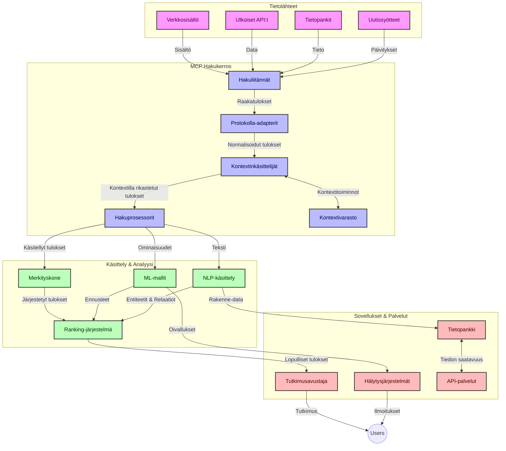
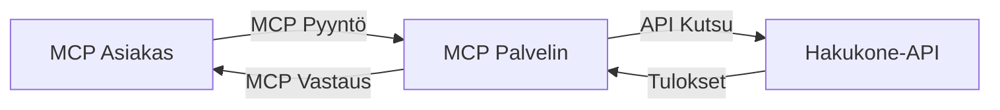
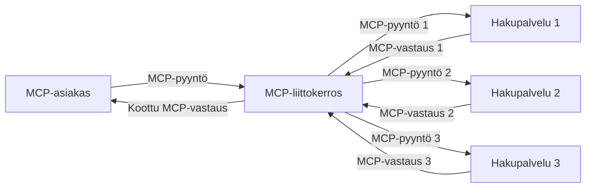
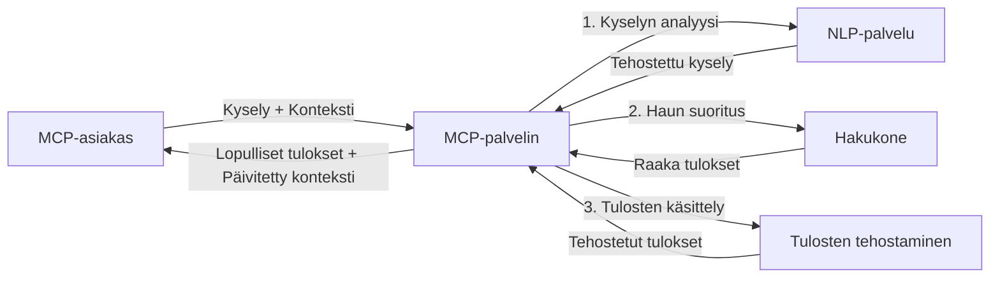

# Mallin kontekstiprotokolla reaaliaikaiseen verkkohakuun

## Yleiskatsaus

Reaaliaikainen verkkohaku on nykyisessä informaatioon perustuvassa ympäristössä välttämätöntä, kun sovellusten täytyy saada välitöntä pääsyä ajantasaiseen tietoon internetissä tarjotakseen relevantteja ja oikea-aikaisia vastauksia. Mallin kontekstiprotokolla (MCP) edustaa merkittävää edistystä näiden reaaliaikaisten hakuprosessien optimoinnissa, parantaen haun tehokkuutta, säilyttäen kontekstuaalisen eheytensä ja parantaen järjestelmän kokonaisvaltaista suorituskykyä.

Tämä moduuli tutkii, miten MCP muuttaa reaaliaikaista verkkohakua tarjoamalla standardoidun lähestymistavan kontekstinhallintaan tekoälymallien, hakukoneiden ja sovellusten välillä.

### Mitä opit

Tässä kattavassa oppaassa opit:

- Miten MCP luo saumattoman sillan tekoälymallien ja reaaliaikaisen verkkohakukyvyn välille
- Arkkitehtoniset mallit tehokkaiden ja skaalautuvien hakuratkaisujen toteuttamiseen MCP:n avulla
- Tekniikat hakukontekstin säilyttämiseksi monien kyselyjen ja vuorovaikutusten ajan
- Käytännön koodiesimerkit Pythonilla ja JavaScriptillä eri hakutilanteisiin
- Menetelmät tasapainottaa relevanssia, ajankohtaisuutta ja suorituskykyä MCP-pohjaisissa hakujärjestelmissä

## Johdanto reaaliaikaiseen verkkohakuun

Reaaliaikainen verkkohaku on teknologinen lähestymistapa, joka mahdollistaa jatkuvan web-pohjaisen tiedon kyselyn, käsittelyn ja analysoinnin sitä mukaa kun tieto julkaistaan tai päivitetään, mahdollistaen järjestelmille tuottaa tuoretta ja relevanttia tietoa mahdollisimman vähäisellä viiveellä. Toisin kuin perinteiset hakujärjestelmät, jotka toimivat indeksöidyn, useamman tunnin tai päivän vanhan datan pohjalta, reaaliaikainen haku käsittelee webin elävää dataa tarjoten näkemyksiä ja tietoa, joka heijastaa verkkosisällön nykytilaa.

### Reaaliaikaisen verkkohakukon keskeiset käsitteet:

- **Jatkuva kyselyjen käsittely**: Hakukyselyt käsitellään jatkuvasti päivittyviä tietolähteitä vastaan
- **Ajankohtaisuuden priorisointi**: Järjestelmät on suunniteltu priorisoimaan tuore tieto
- **Relevanssin tasapaino**: Säilytetään tasapaino relevanssin ja ajankohtaisuuden välillä
- **Skaalautuva arkkitehtuuri**: Järjestelmien on kyettävä käsittelemään vaihtelevia kyselykuormia ja datamääriä
- **Kontekstuaalinen ymmärrys**: Käyttäjän kontekstin säilyttäminen hakusessioiden välillä on olennaista merkityksellisten tulosten tuottamiseksi
- **Dynaaminen kyselyjen uudelleenmuodostus**: Kyselyjen mukauttaminen kontekstin ja aiempien tulosten perusteella
- **Monilähteinen integraatio**: Tulosten yhdistäminen useilta hakupalveluntarjoajilta ja verkkolähteistä
- **Semanttinen ymmärrys**: Kyselyjen ja sisällön käsittely merkityksen eikä pelkkien avainsanojen pohjalta
- **Reaaliaikainen järjestäminen**: Tulosten järjestyksen jatkuva säätö, kun uutta tietoa tulee saataville

### Mallin kontekstiprotokolla ja reaaliaikainen verkkohaku

Mallin kontekstiprotokolla (MCP) ratkaisee useita kriittisiä haasteita reaaliaikaisen verkkohakukon ympäristöissä:

1. **Hakukontekstin säilyttäminen**: MCP standardisoi tavan, jolla konteksti ylläpidetään hajautetuissa hakukomponenteissa varmistaen, että tekoälymallit ja käsittelysolmut pääsevät käsiksi relevanttiin kyselyhistoriaan ja käyttäjäasetuksiin.

2. **Tehokas kyselyjen hallinta**: Tarjoamalla jäsenneltyjä mekanismeja kontekstin siirtoon MCP vähentää kontekstin toistamiseen liittyvää kuormitusta jokaisessa hakukierroksessa.

3. **Yhteensopivuus**: MCP luo yhteisen kielen kontekstin jakamiseen erilaisten hakuteknologioiden ja tekoälymallien välillä mahdollistaen joustavampia ja laajennettavampia arkkitehtuureja.

4. **Hakua optimoitu konteksti**: MCP:n toteutukset voivat priorisoida, mitkä kontekstielementit ovat tärkeimpiä tehokkaaseen hakuun, optimoiden sekä suorituskykyä että tarkkuutta.

5. **Sopeutuva hakukäsittely**: Oikeanlainen kontekstinhallinta MCP:n kautta mahdollistaa hakujärjestelmien dynaamisen mukauttamisen kehittyvien käyttäjätarpeiden ja tiedonmaisemien mukaan.

Nykyisissä sovelluksissa uutisten aggregoinnista tutkimusavustajiin MCP:n integrointi verkkohakuteknologioihin mahdollistaa älykkäämmän, kontekstiajassa hakevan haun, joka voi tarjota yhä relevantimpia tuloksia käyttäjän vuorovaikutusten jatkuessa.

## Oppimistavoitteet

Tämän oppitunnin jälkeen osaat:

- Ymmärtää reaaliaikaisen verkkohakukon perusteet ja siihen liittyvät haasteet nykysovelluksissa
- Selittää, miten Mallin kontekstiprotokolla (MCP) parantaa reaaliaikaista verkkohakua
- Toteuttaa MCP-pohjaisia hakuratkaisuja suosittujen kehysten ja rajapintojen avulla
- Suunnitella ja ottaa käyttöön skaalautuvia, korkean suorituskyvyn hakurakenteita MCP:n avulla
- Soveltaa MCP-konsepteja erilaisiin käyttötapauksiin, kuten semanttiseen hakuun, tutkimusavustamiseen ja tekoälyllä tehostettuun selaamiseen
- Arvioida MCP-pohjaisten hakuteknologioiden nousevia trendejä ja tulevia innovaatioita
- Kehittää kontekstia ymmärtäviä hakujärjestelmiä, jotka oppivat käyttäjien vuorovaikutuksista
- Integroi verkkohakutoiminnot tekoälyavustajiin käyttämällä standardoituja MCP-protokollia
- Luoda monivaiheisia hakuprosesseja, jotka parantavat tuloksia kontekstin perusteella
- Optimoida haun suorituskyky ylläpitäen samalla kattavaa kontekstin ymmärrystä

### Määritelmä ja merkitys

Reaaliaikainen verkkohaku tarkoittaa jatkuvaa web-pohjaisen tiedon kyselyä, hakua ja toimitusta minimaalisen viiveen kera. Toisin kuin perinteiset hakukoneet, jotka indeksoivat webin säännöllisesti, reaaliaikainen haku pyrkii tuomaan tiedon esiin heti kun se on saatavilla mahdollistaen välittömän pääsyn kaikkein ajantasaisimpaan sisältöön.

Reaaliaikaisen verkkohakukon keskeisiä ominaisuuksia ovat:

- **Tuoreus**: Äskettäin julkaistun sisällön ja päivitysten priorisointi
- **Jatkuva käsittely**: Uuden tiedon jatkuva valvonta
- **Kyselyjen mukauttaminen**: Hakukyselyjen täsmentäminen kontekstin ja palautteen perusteella
- **Välitön toimitus**: Hakutulosten tarjoaminen mahdollisimman nopeasti
- **Kontekstin säilyttäminen**: Parantuneen relevanssin varmistaminen aiempien kyselyiden hyödyntämisen avulla

### Haasteet perinteisessä verkkohakussa

Perinteiset verkkohakulähestymistavat kohtaavat monia rajoituksia, kun niitä sovelletaan reaaliaikaisiin käyttötapauksiin:

1. **Kontekstin sirpaloituminen**: Vaikeus ylläpitää hakukontekstia useiden kyselyiden ajan
2. **Tiedon ajankohtaisuus**: Haasteita pääsyssä ja priorisoinnissa kaikkein uusimpaan tietoon
3. **Integraation monimutkaisuus**: Yhteensopivuusongelmat hakujärjestelmien ja sovellusten välillä
4. **Viiveongelmat**: Haun kattavuuden ja vasteaikavaatimusten tasapainottaminen
5. **Relevanssin hienosäätö**: Tarkkuuden ja relevanssin varmistaminen ajankohtaisuuden priorisoinnista huolimatta

## Mallin kontekstiprotokollan (MCP) ymmärtäminen hakukonteksteissa

### Mikä on MCP hakukonteksteissa?

Mallin kontekstiprotokolla (MCP) on standardoitu viestintäprotokolla, joka suunniteltiin helpottamaan tehokasta vuorovaikutusta tekoälymallien ja sovellusten välillä. Reaaliaikaisen verkkohakukon yhteydessä MCP tarjoaa kehyksen:

- Hakukontekstin säilyttämiseen koko kyselyketjun ajan
- Hakukyselyjen ja tulosten formaattien standardisointiin
- Hakuparametrien ja tulosten siirron optimointiin
- Mallin ja hakukoneen välisen viestinnän parantamiseen

### Keskeiset komponentit ja arkkitehtuuri

MCP-arkkitehtuuri reaaliaikaisessa verkkohakussa koostuu useista keskeisistä osista:

1. **Kyselykontekstin käsittelijät**: Hallinnoivat ja ylläpitävät hakukontekstia useiden kyselyiden ajan
2. **Hakuprosessorit**: Käsittelevät saapuvat hakupyynnöt kontekstia hyödyntäen
3. **Protokollasovittimet**: Muuntavat eri hakujen rajapintojen välillä säilyttäen kontekstin
4. **Kontekstivarasto**: Tallentaa ja hakee tehokkaasti hakuhistorian ja käyttäjäasetukset
5. **Hakuyhdistimet**: Yhdistävät erilaisiin hakukoneisiin ja web-API:hin



### Miten MCP parantaa reaaliaikaista verkkohakua

MCP ratkaisee perinteisen verkkohakukon haasteet seuraavasti:

- **Kontekstuaalinen jatkuvuus**: Ylläpitää suhteita kyselyjen välillä koko hakusession ajan
- **Optimoitu tiedonsiirto**: Vähentää hakuparametrien päällekkäisyyttä älykkään kontekstinhallinnan avulla
- **Standardoidut rajapinnat**: Tarjoaa yhtenäiset API:t hakukomponenteille
- **Vähentynyt viive**: Minimoi käsittelykuormaa tehokkaalla kontekstinhallinnalla
- **Parannettu relevanssi**: Parantaa hakutulosten relevanssia säilyttämällä käyttäjän aikomuksen usean kyselyn läpi

## Integraatio ja toteutus

Reaaliaikaisten verkkohakujärjestelmien suunnittelu ja toteutus vaatii huolellista arkkitehtuuria, joka ylläpitää sekä suorituskykyä että kontekstuaalista eheyttä. Mallin kontekstiprotokolla tarjoaa standardoidun lähestymistavan tekoälymallien ja hakuteknologioiden integrointiin, mahdollistaen kehittyneemmät ja kontekstia hyödyntävät hakuputket.

### Yleiskatsaus MCP:n integrointiin hakurakenteissa

MCP:n toteuttaminen reaaliaikaisessa verkkohakukassa sisältää useita tärkeitä näkökohtia:

1. **Hakukontekstin sarjallistaminen**: MCP tarjoaa tehokkaita mekanismeja kontekstuaalisen tiedon koodaamiseen hakupyynnöissä varmistaen, että olennainen konteksti seuraa kyselyä koko käsittelyputken ajan. Tämä sisältää standardoidut, hakua varten optimoidut sarjallistamisformaatit.

2. **Tilan säilyttävä hakukäsittely**: MCP mahdollistaa älykkäämmän, tilaa säilyttävän käsittelyn ylläpitämällä yhdenmukaista kontekstiesitystä hakukierrosten välillä. Erityisen arvokas monivaiheisissa hakuputkissa, joissa kontekstin täsmennys parantaa tuloksia.

3. **Kyselyjen laajentaminen ja täsmentäminen**: MCP:n toteutukset hakujärjestelmissä voivat helpottaa kehittynyttä kyselyjen laajentamista ja täsmentämistä kertyneen kontekstin pohjalta, mahdollistaen yhä relevantimpia tuloksia hakusession edetessä.

4. **Tulosten välimuisti ja priorisointi**: Standardoimalla kontekstinkäsittely MCP auttaa hallitsemaan tulosvälimuistia ja priorisointia antaen komponenteille mahdollisuuden sopeutua kehittyvän hakukontekstin mukaan.

5. **Haun federaatio ja aggregaatio**: MCP mahdollistaa kehittyneempää hakujärjestelmien federaatiota useiden taustajärjestelmien välillä tarjoamalla jäsenneltyjä hakukontekstin esityksiä, jotka tukevat merkityksellisempää tulosten yhdistämistä eri lähteistä.

MCP:n käyttöönotto eri hakuteknologioissa muodostaa yhtenäisen lähestymistavan kontekstinhallintaan, vähentäen tarvetta räätälöidylle integraatiokoodille samalla kun parantaa järjestelmän kykyä ylläpitää merkityksellistä kontekstia kyselyjen muuttuessa.

### MCP eri verkkohakutoteutuksissa

Nämä esimerkit perustuvat nykyiseen MCP-spesifikaatioon, joka keskittyy JSON-RPC -pohjaiseen protokollaan, jossa on erilaiset siirtomekanismit. Koodi osoittaa, miten voit toteuttaa räätälöidyn haun integroiden samalla täydellisesti MCP-protokollaan.


<details>
<summary>Python-toteutus yleisellä hakurajapinnalla</summary>

```python
import asyncio
import json
import aiohttp
from typing import Dict, Any, Optional, List
from contextlib import asynccontextmanager
from collections.abc import AsyncIterator

# Tuodaan vakio MCP-kirjastot
from mcp.client.session import ClientSession
from mcp.client.streamable_http import streamablehttp_client
from mcp.types import TextContent, CreateMessageRequestParams, CreateMessageResult
from mcp.server.fastmcp import FastMCP

# Luodaan FastMCP-palvelin verkkohakua varten
search_server = FastMCP("WebSearch")

# Luokka verkkohakutoimintojen käsittelyyn
class WebSearchHandler:
    def __init__(self, api_endpoint: str, api_key: str):
        self.api_endpoint = api_endpoint
        self.api_key = api_key
        self.session = None
        
    async def initialize(self):
        """Initialize the HTTP session"""
        self.session = aiohttp.ClientSession(
            headers={"Authorization": f"Bearer {self.api_key}"}
        )
    
    async def close(self):
        """Close the HTTP session"""
        if self.session:
            await self.session.close()
            
    async def perform_search(self, query: str, max_results: int = 5, 
                           include_domains: List[str] = None, 
                           exclude_domains: List[str] = None,
                           time_period: str = "any") -> Dict[str, Any]:
        """Perform web search using the search API"""
        # Rakennetaan hakuparametrit
        search_params = {
            "q": query,
            "limit": max_results,
            "time": time_period
        }
        
        if include_domains:
            search_params["site"] = ",".join(include_domains)
            
        if exclude_domains:
            search_params["exclude_site"] = ",".join(exclude_domains)
        
        # Suoritetaan hakupyyntö
        try:
            async with self.session.get(
                self.api_endpoint,
                params=search_params
            ) as response:
                if response.status != 200:
                    error_text = await response.text()
                    raise Exception(f"Search API error: {response.status} - {error_text}")
                
                search_data = await response.json()
                
                # Muunnetaan API-kohtainen vastaus yleiseen muotoon
                results = []
                for item in search_data.get("results", []):
                    results.append({
                        "title": item.get("title", ""),
                        "url": item.get("url", ""),
                        "snippet": item.get("snippet", ""),
                        "date": item.get("published_date", ""),
                        "source": item.get("source", "")
                    })
                
                return {
                    "query": query,
                    "totalResults": len(results),
                    "results": results
                }
        except Exception as e:
            print(f"Search API request error: {e}")
            raise

# Alustetaan hakukäsittelijä
search_handler = WebSearchHandler(
    api_endpoint="https://api.search-service.example/search",
    api_key="your-api-key-here"
)

# Määritetään elinkaari hakukäsittelijän hallitsemiseksi
@asyncio.asynccontextmanager
async def app_lifespan(server: FastMCP):
    """Manage application lifecycle"""
    await search_handler.initialize()
    try:
        yield {"search_handler": search_handler}
    finally:
        await search_handler.close()

# Asetetaan palvelimen elinkaari
search_server = FastMCP("WebSearch", lifespan=app_lifespan)

# Rekisteröidään verkkohakutyökalu
@search_server.tool()
async def web_search(query: str, max_results: int = 5, 
                   include_domains: List[str] = None,
                   exclude_domains: List[str] = None,
                   time_period: str = "any") -> Dict[str, Any]:
    """
    Search the web for information
    
    Args:
        query: The search query
        max_results: Maximum number of results to return (default: 5)
        include_domains: List of domains to include in search results
        exclude_domains: List of domains to exclude from search results
        time_period: Time period for results ("day", "week", "month", "any")
        
    Returns:
        Dictionary containing search results
    """
    ctx = search_server.get_context()
    search_handler = ctx.request_context.lifespan_context["search_handler"]
    
    results = await search_handler.perform_search(
        query=query,
        max_results=max_results,
        include_domains=include_domains,
        exclude_domains=exclude_domains,
        time_period=time_period
    )
    
    return results

# Esimerkki asiakkaan käytöstä
async def client_example():
    # Yhdistetään hakupalvelimeen Streamable HTTP -kuljetuksella
    async with streamablehttp_client("http://localhost:8000/mcp") as (read, write, _):
        async with ClientSession(read, write) as session:
            # Alustetaan yhteys
            await session.initialize()
            
            # Kutsutaan web_search-työkalua
            search_results = await session.call_tool(
                "web_search", 
                {
                    "query": "latest developments in AI and Model Context Protocol",
                    "max_results": 5,
                    "time_period": "day",
                    "include_domains": ["github.com", "microsoft.com"]
                }
            )
            
            print(f"Search results: {search_results}")

# Palvelimen suoritusesimerkki
if __name__ == "__main__":
    # Ajetaan palvelin Streamable HTTP -kuljetuksella
    search_server.run(transport="streamable-http")
```
</details> 

<details>
<summary>JavaScript-toteutus selainpohjaisella haulla</summary>


```javascript
// MCP-palvelimen toteutus verkkohakuun
import { McpServer, ResourceTemplate } from '@modelcontextprotocol/sdk/server/mcp.js';
import { StreamableHTTPServerTransport } from '@modelcontextprotocol/sdk/server/streamableHttp.js';
import { z } from 'zod';

// Luo MCP-palvelin verkkohakua varten
const searchServer = new McpServer({
    name: "BrowserSearch",
    description: "A server that provides web search capabilities"
});

// Hakupalvelun luokka
class SearchService {
    constructor(searchApiUrl, apiKey) {
        this.searchApiUrl = searchApiUrl;
        this.apiKey = apiKey;
    }

    async performSearch(parameters) {
        const {
            query = '',
            maxResults = 5,
            includeDomains = [],
            excludeDomains = [],
            timePeriod = 'any'
        } = parameters;
        
        // Rakenna hakusivun URL parametreineen
        const url = new URL(this.searchApiUrl);
        url.searchParams.append('q', query);
        url.searchParams.append('limit', maxResults);
        url.searchParams.append('time', timePeriod);
        
        if (includeDomains.length > 0) {
            url.searchParams.append('site', includeDomains.join(','));
        }
        
        if (excludeDomains.length > 0) {
            url.searchParams.append('exclude_site', excludeDomains.join(','));
        }
        
        try {
            const response = await fetch(url.toString(), {
                method: 'GET',
                headers: {
                    'Authorization': `Bearer ${this.apiKey}`,
                    'Content-Type': 'application/json'
                }
            });
            
            if (!response.ok) {
                const errorText = await response.text();
                throw new Error(`Search API error: ${response.status} - ${errorText}`);
            }
            
            const searchData = await response.json();
            
            // Muunna API-spesifinen vastaus standardimuotoon
            const results = searchData.results?.map(item => ({
                title: item.title || '',
                url: item.url || '',
                snippet: item.snippet || '',
                date: item.published_date || '',
                source: item.source || ''
            })) || [];
            
            return {
                query,
                totalResults: results.length,
                results
            };
        } catch (error) {
            console.error('Search API request error:', error);
            throw error;
        }
    }
}

// Alusta hakupalvelu
const searchService = new SearchService(
    'https://api.search-service.example/search',
    'your-api-key-here'
);

// Määritä kontekstin tarjoaja palvelimelle
searchServer.setContextProvider(() => {
    return {
        searchService
    };
});

// Rekisteröi verkkohakutyökalu
searchServer.tool({
    name: 'web_search',
    description: 'Search the web for information',
    parameters: {
        type: 'object',
        properties: {
            query: {
                type: 'string',
                description: 'The search query'
            },
            maxResults: {
                type: 'integer',
                description: 'Maximum number of results to return',
                default: 5
            },
            includeDomains: {
                type: 'array',
                items: { type: 'string' },
                description: 'List of domains to include in search results'
            },
            excludeDomains: {
                type: 'array',
                items: { type: 'string' },
                description: 'List of domains to exclude from search results'
            },
            timePeriod: {
                type: 'string',
                description: 'Time period for results',
                enum: ['day', 'week', 'month', 'any'],
                default: 'any'
            }
        },
        required: ['query']
    },
    handler: async (params, context) => {
        const { searchService } = context;
        return await searchService.performSearch(params);
    }
});

// Esimerkkiasiakaskoodi hakupalvelimeen yhdistämiseen
import { Client } from '@modelcontextprotocol/sdk/client/index.js';
import { StreamableHTTPClientTransport } from '@modelcontextprotocol/sdk/client/streamableHttp.js';

async function connectToSearchServer() {
    // Yhdistä hakupalvelimeen
    const transport = new StreamableHTTPClientTransport(
        new URL('http://localhost:8000/mcp')
    );
    
    const client = new Client({
        name: 'search-client',
        version: '1.0.0'
    });
    
    await client.connect(transport);
    
    // Suorita hakutyökalu
    const searchResults = await client.callTool({
        name: 'web_search',
        arguments: {
            query: 'Model Context Protocol implementation examples',
            maxResults: 10,
            timePeriod: 'week',
            includeDomains: ['github.com', 'docs.microsoft.com']
        }
    });
    
    console.log('Search results:', searchResults);
    
    // Siivoa
    await client.disconnect();
}

// Käynnistä palvelin
const transport = new StreamableHTTPServerTransport();
await searchServer.connect(transport);
console.log('Search server running at http://localhost:8000/mcp');

// Eri prosessissa tai palvelimen käynnistämisen jälkeen
// connectToSearchServer().catch(console.error);
```
</details> 


## Koodiesimerkkien vastuuvapauslauseke

> **Tärkeä huomautus**: Alla olevat koodiesimerkit demonstroivat Mallin kontekstiprotokollan (MCP) integrointia verkkohakutoiminnallisuuteen. Vaikka ne noudattavat virallisten MCP SDK:iden malleja ja rakenteita, niitä on yksinkertaistettu opetustarkoituksiin.
> 
> Näissä esimerkeissä esitellään:
> 
> 1. **Python-toteutus**: FastMCP-palvelin, joka tarjoaa verkkohakutyökalun ja yhdistyy ulkopuoliseen hakupalvelun API:in. Tämä esimerkki osoittaa asianmukaisen elinkaaren hallinnan, kontekstinkäsittelyn ja työkalun toteutuksen noudattaen [virallisen MCP Python SDK:n](https://github.com/modelcontextprotocol/python-sdk) malleja. Palvelin hyödyntää suositeltua Streamable HTTP -siirtotekniikkaa, joka on syrjäyttänyt vanhemman SSE-siirron tuotantokäytössä.
> 
> 2. **JavaScript-toteutus**: TypeScript/JavaScript-toteutus FastMCP-kuviolla [virallisen MCP TypeScript SDK:n](https://github.com/modelcontextprotocol/typescript-sdk) pohjalta luodakseen hakupalvelimen, jossa on asianmukaiset työkalumääritelmät ja asiakasyhteydet. Se noudattaa viimeisimpiä suosituksia istunnon hallinnassa ja kontekstin säilyttämisessä.
> 
> Nämä esimerkit vaatisivat tuotantokäyttöön lisäkäsittelyä virhetilanteisiin, autentikointia sekä erillistä API-integraatiokoodia. Näytetyt hakupalvelujen rajapinnat (`https://api.search-service.example/search`) ovat paikkamerkkejä ja ne tulisi korvata todellisilla hakupalvelun osoitteilla.
> 
> Täydellisten toteutustietojen ja ajantasaisimpien lähestymistapojen osalta,
> tutustu [viralliseen MCP-määritykseen](https://modelcontextprotocol.io/specification/2026-07-28/)
> ja SDK-dokumentaatioon.

## Keskeiset käsitteet

### Mallin kontekstiprotokolla (MCP) -kehys

Pohjimmiltaan Mallin kontekstiprotokolla tarjoaa standardoidun tavan tekoälymallien, sovellusten ja palveluiden kontekstin vaihtoon. Reaaliaikaisessa verkkohakussa tämä kehys on välttämätön yhtenäisten, monikierrosaikaisten hakukokemusten luomiseksi. Keskeisiä osia ovat:

1. **Asiakas-palvelin-arkkitehtuuri**: MCP määrittää selkeän eron hakuklienttien (pyytäjien) ja hakupalvelinten (tarjoajien) välillä mahdollistaen joustavat käyttöönotot.

2. **JSON-RPC-viestintä**: Protokolla käyttää JSON-RPC:tä viestien vaihdossa, tehden siitä yhteensopivan web-teknologioiden kanssa ja helpon toteuttaa eri alustoilla.

3. **Kontekstinhallinta**: MCP määrittelee jäsennellyt menetelmät hakukontekstin ylläpitoon, päivitykseen ja hyödyntämiseen useiden vuorovaikutusten aikana.

4. **Työkalumääritelmät**: Hakuominaisuudet avataan standardoituina työkaluina, joilla on selkeästi määritellyt parametrit ja paluuarvot.

5. **Suoratoistotuki**: Protokolla tukee tulosten suoratoistoa, mikä on välttämätöntä reaaliaikaisessa haussa, jossa tulokset voivat saapua asteittain.

### Verkkohakujen integraatiomallit

MCP:tä integroidessa verkkohakuun esiintyy useita kuvioita:

#### 1. Suora hakupalveluntarjoajien integraatio



Tässä mallissa MCP-palvelin kommunikoi suoraan yhden tai useamman hakupalvelun rajapinnan kanssa, muuntaen MCP-kutsut API-kohtaisiksi pyynnöiksi ja muotoillen vastaukset MCP-vastauksiksi.

#### 2. Federatiivinen haku kontekstin säilytyksellä



Tämä malli jakaa hakukyselyt useille MCP-yhteensopiville hakupalveluntarjoajille, jotka saattavat erikoistua eri sisältötyyppeihin tai hakutoimintoihin säilyttäen yhtenäisen kontekstin.

#### 3. Kontekstia hyödyntävä hakuketju



Tässä mallissa hakuprosessi jaetaan useaan vaiheeseen, ja kontekstia rikastetaan jokaisessa vaiheessa tulosten asteittaisen parantamisen mahdollistamiseksi.

### Hakukontekstin komponentit

MCP-pohjaisessa verkkohakussa konteksti sisältää tyypillisesti:

- **Kyselyhistoria**: Aiemmat kyselyt sessiossa
- **Käyttäjäasetukset**: Kieli, alue, turvallisen haun asetukset
- **Vuorovaikutushistoria**: Mitkä tulokset klikattiin, aika jonka käytettiin tuloksiin
- **Hakuparametrit**: Suodattimet, lajittelujärjestykset ja muut hakumuokkaajat
- **Alaosaaminen**: Hakualaan liittyvä konteksti
- **Aikakonteksti**: Aikaperusteiset relevanssitekijät
- **Lähteiden mieltymykset**: Luotetut tai suosittu tiedonlähteet

## Käyttötapaukset ja sovellukset

### Tutkimus ja tiedonkeruu

MCP parantaa tutkimusprosessia:

- Säilyttämällä tutkimuksen kontekstin hakusessioiden välillä
- Mahdollistamalla kehittyneemmät ja kontekstuaalisesti relevantit kyselyt
- Tukemalla monilähteistä hakufederaatiota
- Helpottamalla tiedon poimintaa hakutuloksista

### Reaaliaikainen uutis- ja trendiseuranta

MCP-pohjainen haku tarjoaa etuja uutisseurannassa:

- Lähes reaaliaikainen nousevien uutisaiheiden löytäminen
- Relevantin tiedon kontekstuaalinen suodatus
- Aiheiden ja yksilöiden seuranta useista lähteistä
- Personoidut uutisilmoitukset käyttäjän kontekstin pohjalta

### Tekoälyllä tehostettu selaus ja tutkimus

MCP avaa uusia mahdollisuuksia tekoälyllä tehostettuun selaamiseen:

- Kontekstuaaliset hakuehdotukset nykyisen selaustoiminnan perusteella
- Verkkohakujen saumatonta integraatiota LLM-pohjaisiin avustajiin
- Monikierroksinen hakutulosten täsmentäminen säilyttäen kontekstin
- Parannetut faktantarkastus- ja tiedon varmistusmahdollisuudet

## Tulevaisuuden trendit ja innovaatiot

### MCP:n kehitys verkkohakussa

Tulevaisuuteen katsoen odotamme MCP:n kehittyvän seuraavien haasteiden ja tarpeiden ratkaisemiseksi:


- **Monimodaalinen haku**: Teksti-, kuva-, ääni- ja videotietohaku yhdistettynä säilytettyyn kontekstiin
- **Hajautettu haku**: Hajautettujen ja federoitujen hakuekosysteemien tuki
- **Haun yksityisyys**: Kontekstitietoiset yksityisyyttä suojaavat hakumenetelmät
- **Hakukyselyjen ymmärtäminen**: Syvä semanttinen luonnollisen kielen hakukyselyjen jäsentäminen

### Mahdolliset teknologian edistysaskeleet

Nousevat teknologiat, jotka muovaavat MCP-haun tulevaisuutta:

1. **Neuraaliset hakukomponentit**: Upotuksiin perustuvat MCP-hausta optimoidut järjestelmät
2. **Personoitu hakukonteksti**: Yksilöllisten käyttäjähaumallien oppiminen ajan mittaan
3. **Tietografien integrointi**: Kontekstuaalista hakua tehostavat toimialakohtaiset tietografit
4. **Ristimodaalinen konteksti**: Kontekstin ylläpito eri hakumodaalit ylittävän

## Käytännön harjoituksia

### Harjoitus 1: Perus MCP-hakuputken pystyttäminen

Tässä harjoituksessa opit:
- Määrittämään perustason MCP-hakuympäristön
- Toteuttamaan kontekstinkäsittelijät verkkohakua varten
- Testaamaan ja validoimaan kontekstin säilymistä hakukierrosten välillä

### Harjoitus 2: Tutkimusavustajan rakentaminen MCP-haulla

Luo kokonaisvaltainen sovellus, joka:
- Käsittelee luonnollisen kielen tutkimuskysymyksiä
- Suorittaa kontekstuaalisia verkkohakuja
- Yhdistää tietoa useista lähteistä
- Esittää järjestetyt tutkimustulokset

### Harjoitus 3: Monilähteisen hakufederoinnin toteuttaminen MCP:llä

Edistynyt harjoitus kattaa:
- Kontekstin mukaisen kyselyn jakelun useille hakukoneille
- Tulosten järjestyksen ja yhdistämisen
- Kontekstuaalisen hakutulosten päällekkäisyyksien poiston
- Lähdekohtaisen metadataan käsittelyn

## Lisäresurssit

- [Model Context Protocol Specification](https://modelcontextprotocol.io/specification/2026-07-28/) - Virallinen MCP-määrittely ja yksityiskohtainen protokolladokumentaatio
- [Model Context Protocol Documentation](https://modelcontextprotocol.io/) - Yksityiskohtaiset esittelyt ja toteutusoppaat
- [MCP Python SDK](https://github.com/modelcontextprotocol/python-sdk) - Virallinen MCP-protokollan Python-toteutus
- [MCP TypeScript SDK](https://github.com/modelcontextprotocol/typescript-sdk) - Virallinen MCP-protokollan TypeScript-toteutus
- [MCP Reference Servers](https://github.com/modelcontextprotocol/servers) - MCP-palvelinten referenssitoteutukset
- [Bing Web Search API Documentation](https://learn.microsoft.com/en-us/bing/search-apis/bing-web-search/overview) - Microsoftin verkkohaku API
- [Google Custom Search JSON API](https://developers.google.com/custom-search/v1/overview) - Googlen ohjelmoitava hakukone
- [SerpAPI Documentation](https://serpapi.com/search-api) - Hakukoneen tulossivun API
- [Meilisearch Documentation](https://www.meilisearch.com/docs) - Avoimen lähdekoodin hakukone
- [Elasticsearch Documentation](https://www.elastic.co/guide/index.html) - Hajautettu haku- ja analytiikkamoottori
- [LangChain Documentation](https://python.langchain.com/docs/get_started/introduction) - Sovellusten rakentaminen LLM:ien avulla

## Oppimistulokset

Tämän moduulin suorittamalla osaat:

- Ymmärtää reaaliaikaisen verkkohakujen perusteet ja haasteet
- Selittää, kuinka Model Context Protocol (MCP) parantaa reaaliaikaisten verkkohakujen ominaisuuksia
- Toteuttaa MCP-pohjaisia hakuratkaisuja suosituilla kehyksillä ja API:illa
- Suunnitella ja ottaa käyttöön skaalautuvia, korkeasuorituskykyisiä hakujärjestelmiä MCP:llä
- Soveltaa MCP-konsepteja monenlaisiin käyttötapauksiin, kuten semanttiseen hakuun, tutkimusavustukseen ja tekoälyn tukemaan selaamiseen
- Arvioida MCP-pohjaisen haun nousevia trendejä ja tulevaisuuden innovaatioita


### Luotettavuus ja turvallisuus

MCP-pohjaisia verkkohakuratkaisuja toteuttaessa muista nämä tärkeät MCP-määrittelyn periaatteet:

1. **Käyttäjän suostumus ja kontrolli**: Käyttäjien on annettava nimenomainen suostumus ja ymmärrettävä kaikki tiedon käyttö ja toimet. Tämä on erityisen tärkeää verkkohakutoteutuksissa, jotka voivat käyttää ulkoisia tietolähteitä.

2. **Tietosuoja**: Huolehdi hakukyselyjen ja tulosten asianmukaisesta käsittelystä, erityisesti jos ne voivat sisältää arkaluonteisia tietoja. Toteuta sopivat pääsynhallintatoimet suojellaksesi käyttäjätietoja.

3. **Työkalujen turvallisuus**: Toteuta asianmukainen valtuutus ja validointi hakutyökaluille, sillä ne voivat edustaa turvallisuusriskiä suorittamalla mielivaltaista koodia. Työkalun käyttäytymisen kuvaukset tulee pitää epäluotettavina, elleivät ne tule luotettavalta palvelimelta.

4. **Selkeä dokumentointi**: Tarjoa selkeää dokumentaatiota MCP-pohjaisen hakutoteutuksen kyvykkyyksistä, rajoituksista ja turvallisuusnäkökohtista, noudattaen MCP-määrittelyn toteutusohjeita.

5. **Vahvat suostumusprosessit**: Rakenna vahvat suostumus- ja valtuutusprosessit, jotka selkeästi kuvaavat, mitä kukin työkalu tekee ennen sen käyttöönottoa, erityisesti työkaluissa, jotka käsittelevät ulkoisia verkkoresursseja.

MCP:n turvallisuus- ja luottamusnäkökohtien täydelliset tiedot löytyvät
[virallisesta dokumentaatiosta](https://modelcontextprotocol.io/specification/2026-07-28/basic/security_best_practices).

## Mitä seuraavaksi

- [5.12 Entra ID -todennus Model Context Protocol -palvelimille](../mcp-security-entra/README.md)

---

<!-- CO-OP TRANSLATOR DISCLAIMER START -->
**Vastuuvapauslauseke**:
Tämä asiakirja on käännetty käyttämällä tekoälypohjaista käännöspalvelua [Co-op Translator](https://github.com/Azure/co-op-translator). Vaikka pyrimme tarkkuuteen, otathan huomioon, että automaattiset käännökset saattavat sisältää virheitä tai epätarkkuuksia. Alkuperäinen asiakirja sen alkuperäiskielellä on virallinen lähde. Tärkeissä asioissa suositellaan ammattimaista ihmiskäännöstä. Emme ole vastuussa tämän käännöksen käytöstä aiheutuvista väärinymmärryksistä tai tulkinnoista.
<!-- CO-OP TRANSLATOR DISCLAIMER END -->