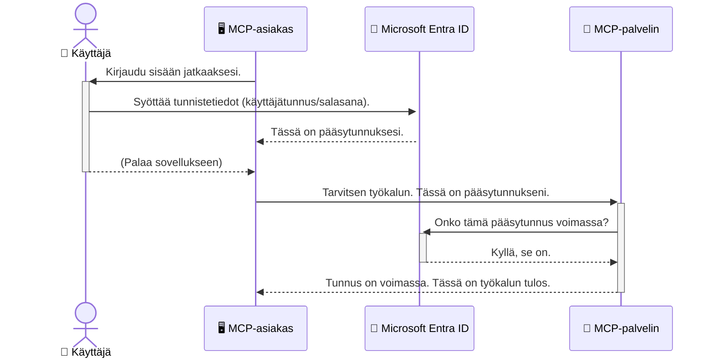

# AI-työnkulkujen suojaaminen: Entra ID -todennus Mallikontekstiprotokollan palvelimille

> [!NOTE]
> Tässä oppitunnissa esitetty etäpalvelimen koodi suojaa perinteiset `/sse` ja `/message`
> päätepisteet ja kohdistuu MCP:hen `2025-11-25`. Säilytä sen identiteetin ja
> tunnistetarkistuskäytännöt, mutta käytä uusin toteutuksin `2026-07-28`-yhteensopivaa Streamable HTTP -kuljetusta.


## Johdanto
Mallikontekstiprotokollan (MCP) palvelimesi suojaaminen on yhtä tärkeää kuin kotisi etuoven lukitseminen. MCP-palvelimen jättäminen avoimeksi altistaa työkalusi ja tietosi luvatonta pääsyä varten, mikä voi johtaa turvallisuusongelmiin. Microsoft Entra ID tarjoaa vahvan pilvipohjaisen identiteetin ja pääsynhallinnan ratkaisun, joka auttaa varmistamaan, että vain valtuutetut käyttäjät ja sovellukset voivat käyttää MCP-palvelintasi. Tässä osiossa opit suojaamaan AI-työnkulkuja Entra ID -todennuksen avulla.

## Oppimistavoitteet
Tämän osion lopuksi osaat:

- Ymmärtää MCP-palvelimien suojaamisen tärkeyden.
- Selittää Microsoft Entra ID:n ja OAuth 2.0 -todennuksen perusteet.
- Tunnistaa julkisen ja luottamuksellisen asiakkaan erot.
- Toteuttaa Entra ID -todennus sekä paikallisissa (julkinen asiakas) että etäisissä (luottamuksellinen asiakas) MCP-palvelintilanteissa.
- Soveltaa tietoturvan parhaita käytäntöjä AI-työnkulkuja kehitettäessä.

## Turvallisuus ja MCP

Aivan kuten et jättäisi kotisi etuovea lukitsematta, et myöskään saisi jättää MCP-palvelintasi kaikkien saavutettavaksi. AI-työnkulkujen suojaaminen on olennaista, jotta voit rakentaa vankkoja, luotettavia ja turvallisia sovelluksia. Tässä luvussa tutustut Microsoft Entra ID:n käyttämiseen MCP-palvelimien suojaamiseen, varmistaen, että vain valtuutetut käyttäjät ja sovellukset voivat käyttää työkaluja ja tietojasi.

## Miksi turvallisuus on tärkeää MCP-palvelimille

Kuvittele, että MCP-palvelimessasi on työkalu, joka voi lähettää sähköposteja tai käyttää asiakastietokantaa. Suojaamaton palvelin tarkoittaisi, että kuka tahansa voisi käyttää tuota työkalua, mikä johtaisi luvatonta tietojen käyttöä, roskapostiin tai muihin haitallisiin toimintoihin.

Todentamisen avulla varmistat, että jokainen pyyntö palvelimellesi on tarkistettu, vahvistaen pyynnön esittäjän identiteetin. Tämä on ensimmäinen ja kriittisin askel AI-työnkulkujen suojaamisessa.

## Johdatus Microsoft Entra ID:hen

[**Microsoft Entra ID**](https://adoption.microsoft.com/microsoft-security/entra/) on pilvipohjainen identiteetin ja pääsynhallinnan palvelu. Voit ajatella sitä universaalina turvallisuusvartijana sovelluksillesi. Se hoitaa monimutkaisen käyttäjien tunnistamisen (todennuksen) ja sen määrittämisen, mitä he saavat tehdä (valtuutuksen).

Entra ID:n avulla voit:

- Mahdollistaa käyttäjien turvallisen kirjautumisen.
- Suojata rajapinnat (API:t) ja palvelut.
- Hallita pääsypolitiikkoja keskitetyltä paikalta.

MCP-palvelimille Entra ID tarjoaa vahvan ja laajalti luotetun ratkaisun hallita, kuka pääsee käsiksi palvelimesi toimintoihin.

---

## Taikaa: Miten Entra ID -todennus toimii

Entra ID käyttää avoimia standardeja kuten **OAuth 2.0** todentamisen hallintaan. Vaikka yksityiskohdat voivat olla monimutkaisia, peruskonsepti on yksinkertainen ja sen voi ymmärtää vertauskuvan avulla.

### Pehmeä johdatus OAuth 2.0:aan: Parkkimiesavain

Ajattele OAuth 2.0:aa kuin parkkeerauspalvelua autollesi. Kun saavuit ravintolaan, et anna parkkimiehelle pääavaintasi. Sen sijaan annat **parkkimiesavaimen**, jossa on rajatut oikeudet—se voi käynnistää auton ja lukita ovet, mutta ei avata takaluukkua tai hansikaslokeroa.

Tässä vertauksessa:

- **Sinä** olet **Käyttäjä**.
- **Autosi** on **MCP-palvelin** arvokkaine työkalujensa ja tietoineen.
- **Parkkimies** on **Microsoft Entra ID**.
- **Parkkipaikan valvoja** on **MCP-asiakas** (sovellus, joka yrittää käyttää palvelinta).
- **Parkkimiesavain** on **Pääsytunnus**.

Pääsytunnus on turvallinen tekstijono, jonka MCP-asiakas saa Entran ID:ltä kirjautumisesi jälkeen. Asiakas esittää tämän tunnuksen palvelimelle jokaisessa pyynnössä. Palvelin voi varmistaa tunnuksen aitouden ja sen, että asiakkaalla on tarvittavat oikeudet, ilman että se käsittelee varsinaisia tunnistetietojasi (kuten salasanaasi).

### Todennusprosessi

Näin prosessi toimii käytännössä:



### Microsoft Authentication Library (MSAL) esittely

Ennen kuin sukelletaan koodiin, on tärkeää esitellä keskeinen osa, jonka näet esimerkeissä: **Microsoft Authentication Library (MSAL)**.

MSAL on Microsoftin kehittämä kirjasto, joka helpottaa kehittäjien työtä todentamisen käsittelyssä. Sen sijaan, että kirjoittaisit kaiken monimutkaisen koodin turvatunnusten käsittelemiseen, kirjautumisten hallintaan ja sessioiden uusimiseen, MSAL hoitaa nämä raskaammat tehtävät.

MSAL:n käyttöä suositellaan, koska:

- **Se on turvallinen:** Se toteuttaa alan standardit protokollat ja tietoturvan parhaat käytännöt vähentäen haavoittuvuuksia koodissasi.
- **Se yksinkertaistaa kehitystä:** Se piilottaa OAuth 2.0:n ja OpenID Connectin monimutkaisuuden, mahdollistaen vahvan todentamisen lisäämisen sovellukseesi vain muutamalla koodirivillä.
- **Sitä ylläpidetään:** Microsoft ylläpitää aktiivisesti MSAL:ia ja päivittää sitä uusien turvallisuusuhkien ja alustamuutosten vuoksi.

MSAL tukee monia kieliä ja sovelluskehyksiä, mukaan lukien .NET, JavaScript/TypeScript, Python, Java, Go sekä mobiilialustat kuten iOS ja Android. Tämä tarkoittaa, että voit käyttää samoja yhtenäisiä todentamismalleja koko teknologia-alustallasi.

Lisätietoja MSAL:ista löytyy virallisesta [MSAL-kuvausdokumentaatiosta](https://learn.microsoft.com/entra/identity-platform/msal-overview).

---

## MCP-palvelimen suojaaminen Entra ID:n avulla: vaiheittainen opas

Käydään nyt läpi kuinka suojata paikallinen MCP-palvelin (joka kommunikoi `stdio`-yhteyden kautta) käyttäen Entra ID:tä. Tämä esimerkki käyttää **julkista asiakasta**, joka sopii sovelluksille käyttäjän koneella, kuten työpöytäsovellukselle tai paikalliselle kehityspalvelimelle.

### Tilanne 1: Paikallisen MCP-palvelimen suojaaminen (julkisella asiakkaalla)

Tässä esimerkissä tarkastellaan paikallisesti toimivaa MCP-palvelinta, joka kommunikoi `stdio`-yhteydellä ja käyttää Entra ID:tä käyttäjän todentamiseen ennen työkalujen käyttöä. Palvelimella on yksittäinen työkalu, joka hakee käyttäjän profiilitiedot Microsoft Graph API:sta.

#### 1. Sovelluksen rekisteröinti Entra ID:ssä

Ennen koodin kirjoittamista sinun tulee rekisteröidä sovelluksesi Microsoft Entra ID:ssä. Tämä kertoo Entra ID:lle sovelluksestasi ja antaa sille luvan käyttää todennuspalvelua.

1. Siirry **[Microsoft Entra -portaaliin](https://entra.microsoft.com/)**.
2. Mene kohtaan **Sovellusrekisteröinnit** ja klikkaa **Uusi rekisteröinti**.
3. Anna sovelluksellesi nimi (esim. "Oma paikallinen MCP-palvelin").
4. Valitse **Tuetut tilityypit** -kohdassa **Vain tämän organisaation hakemiston tilit**.
5. Tässä esimerkissä voit jättää **Uudelleenohjaus-URI:n** tyhjäksi.
6. Klikkaa **Rekisteröi**.

Rekisteröinnin jälkeen merkkaa ylös **Sovellus (asiakas) -ID** ja **Hakemisto (vuokraaja) -ID**, joita tarvitset koodissa.

#### 2. Koodi: Keskeiset osat

Tarkastellaan koodin keskeisiä kohtia, jotka käsittelevät todennusta. Täydellinen koodi tälle esimerkille löytyy [Entra ID - Local - WAM](https://github.com/Azure-Samples/mcp-auth-servers/tree/main/src/entra-id-local-wam) -kansiosta [mcp-auth-servers GitHub-repositoriossa](https://github.com/Azure-Samples/mcp-auth-servers).

**`AuthenticationService.cs`**

Tämä luokka vastaa vuorovaikutuksesta Entra ID:n kanssa.

- **`CreateAsync`**: Metodi alustaa MSAL:in (Microsoft Authentication Library) `PublicClientApplication`-instanssin. Se konfiguroidaan sovelluksesi `clientId`:llä ja `tenantId`:llä.
- **`WithBroker`**: Mahdollistaa brokerin käytön (esim. Windows Web Account Manager), joka tarjoaa turvallisemman ja saumattomamman yksittäisen kirjautumisen kokemuksen.
- **`AcquireTokenAsync`**: Tämä on ydintoiminto. Se yrittää ensin hakea tunnuksen hiljaisesti (eli käyttäjän ei tarvitse kirjautua uudelleen, jos voimassa oleva istunto jo on). Jos hiljaista tunnusta ei saada, se kehottaa käyttäjää kirjautumaan vuorovaikutteisesti.

```csharp
// Simplified for clarity
public static async Task<AuthenticationService> CreateAsync(ILogger<AuthenticationService> logger)
{
    var msalClient = PublicClientApplicationBuilder
        .Create(_clientId) // Your Application (client) ID
        .WithAuthority(AadAuthorityAudience.AzureAdMyOrg)
        .WithTenantId(_tenantId) // Your Directory (tenant) ID
        .WithBroker(new BrokerOptions(BrokerOptions.OperatingSystems.Windows))
        .Build();

    // ... cache registration ...

    return new AuthenticationService(logger, msalClient);
}

public async Task<string> AcquireTokenAsync()
{
    try
    {
        // Try silent authentication first
        var accounts = await _msalClient.GetAccountsAsync();
        var account = accounts.FirstOrDefault();

        AuthenticationResult? result = null;

        if (account != null)
        {
            result = await _msalClient.AcquireTokenSilent(_scopes, account).ExecuteAsync();
        }
        else
        {
            // If no account, or silent fails, go interactive
            result = await _msalClient.AcquireTokenInteractive(_scopes).ExecuteAsync();
        }

        return result.AccessToken;
    }
    catch (Exception ex)
    {
        _logger.LogError(ex, "An error occurred while acquiring the token.");
        throw; // Optionally rethrow the exception for higher-level handling
    }
}
```

**`Program.cs`**

Tässä määritetään MCP-palvelin ja liitetään todennuspalvelu.

- **`AddSingleton<AuthenticationService>`**: Rekisteröi `AuthenticationService` riippuvuuksien injektiokonttiin, jolloin sovelluksen muut osat (kuten työkalu) voivat käyttää sitä.
- **`GetUserDetailsFromGraph`-työkalu**: Tämä työkalu tarvitsee `AuthenticationService`-instanssin. Ennen minkään teon aloittamista se kutsuu `authService.AcquireTokenAsync()` saadakseen voimassa olevan pääsytunnuksen. Todennuksen onnistuttua se käyttää tunnusta kutsuakseen Microsoft Graph API:ta ja hakee käyttäjän tiedot.

```csharp
// Simplified for clarity
[McpServerTool(Name = "GetUserDetailsFromGraph")]
public static async Task<string> GetUserDetailsFromGraph(
    AuthenticationService authService)
{
    try
    {
        // This will trigger the authentication flow
        var accessToken = await authService.AcquireTokenAsync();

        // Use the token to create a GraphServiceClient
        var graphClient = new GraphServiceClient(
            new BaseBearerTokenAuthenticationProvider(new TokenProvider(authService)));

        var user = await graphClient.Me.GetAsync();

        return System.Text.Json.JsonSerializer.Serialize(user);
    }
    catch (Exception ex)
    {
        return $"Error: {ex.Message}";
    }
}
```

#### 3. Kuinka kaikki toimii yhdessä

1. Kun MCP-asiakas yrittää käyttää `GetUserDetailsFromGraph` -työkalua, työkalu kutsuu ensin `AcquireTokenAsync`-metodia.
2. `AcquireTokenAsync` saa MSAL-kirjaston tarkastamaan voimassa olevaa tunnusta.
3. Jos tunnusta ei löydy, MSAL brokerin kautta kehottaa käyttäjää kirjautumaan sisään Entra ID -tilillään.
4. Käyttäjän kirjautuessa sisään Entra ID antaa pääsytunnuksen.
5. Työkalu saa tunnuksen ja käyttää sitä tehdäkseen suojatun kutsun Microsoft Graph API:in.
6. Käyttäjän tiedot palautetaan MCP-asiakkaalle.

Tämä prosessi varmistaa, että vain todennetut käyttäjät voivat käyttää työkaluja, mikä suojaa paikallista MCP-palvelintasi tehokkaasti.

### Tilanne 2: Etä-MCP-palvelimen suojaaminen (luottamuksellisella asiakkaalla)

Kun MCP-palvelimesi toimii etäkoneella (kuten pilvipalvelimella) ja kommunikoi esimerkiksi HTTP Streaming -protokollalla, vaatimukset ovat erilaiset. Tässä tapauksessa sinun tulisi käyttää **luottamuksellista asiakasta** ja **Authorization Code Flow** -menetelmää. Tämä on turvallisempi tapa, koska sovelluksen salaisuudet eivät koskaan paljastu selaimelle.

Tämä esimerkki käyttää TypeScript-pohjaista MCP-palvelinta, joka käyttää Express.js:ää HTTP-pyyntöjen käsittelyyn.

#### 1. Sovelluksen rekisteröinti Entra ID:ssä

Rekisteröinti Entra ID:ssä on samanlainen kuin julkisella asiakkaalla, mutta yhdellä keskeisellä erolla: sinun täytyy luoda **asiakassalaisuus**.

1. Siirry **[Microsoft Entra -portaaliin](https://entra.microsoft.com/)**.
2. Sovelluksesi rekisteröinnissä mene kohtaan **Varmenteet & salaisuudet**.
3. Klikkaa **Uusi asiakassalaisuus**, anna sille kuvaus ja klikkaa **Lisää**.
4. **Tärkeää:** Kopioi salaisuuden arvo heti. Et näe sitä enää uudestaan.
5. Sinun täytyy myös määrittää **Uudelleenohjaus-URI**. Mene kohtaan **Todennus**, klikkaa **Lisää alusta**, valitse **Web** ja syötä sovelluksen uudelleenohjaus-URI (esim. `http://localhost:3001/auth/callback`).

> **⚠️ Tärkeä tietoturvamuistutus:** Tuotantosovelluksissa Microsoft suosittelee vahvasti salaisuudettomia todennusmenetelmiä, kuten **Managed Identity** tai **Workload Identity Federation**, sen sijaan että käytät asiakassalaisuuksia. Asiakassalaisuudet ovat tietoturvariski, koska ne voivat paljastua tai vaarantua. Hallitut identiteetit tarjoavat turvallisemman ratkaisun poistamalla tarpeen tallentaa tunnistetietoja koodiin tai asetuksiin.
>
> Lisätietoja hallituista identiteeteistä ja niiden toteuttamisesta löytyy [Managed identities for Azure resources overview](https://learn.microsoft.com/entra/identity/managed-identities-azure-resources/overview) -sivulta.

#### 2. Koodi: Keskeiset osat

Tämä esimerkki käyttää istuntopohjaista lähestymistapaa. Käyttäjän tunnistautuessa palvelin tallentaa pääsytunnuksen ja päivitystunnuksen istuntoon ja antaa käyttäjälle istuntotunnuksen. Tätä istuntotunnusta käytetään sitten jatkopyynnöissä. Täydellinen koodi tälle esimerkille löytyy [Entra ID - Confidential client](https://github.com/Azure-Samples/mcp-auth-servers/tree/main/src/entra-id-cca-session) -kansiosta [mcp-auth-servers GitHub-repositoriossa](https://github.com/Azure-Samples/mcp-auth-servers).

**`Server.ts`**

Tässä tiedostossa määritetään Express-palvelin ja MCP-kuljetuskerros.

- **`requireBearerAuth`**: Tämä on middleware, joka suojaa `/sse` ja `/message` -päätepisteet. Se tarkistaa pyynnön `Authorization`-otsakkeesta voimassa olevan kantajatunnuksen.
- **`EntraIdServerAuthProvider`**: Tämä on mukautettu luokka, joka toteuttaa `McpServerAuthorizationProvider`-rajapinnan. Se hallitsee OAuth 2.0 -prosessin.
- **`/auth/callback`**: Tämä päätepiste käsittelee uudelleenohjauksen Entra ID:ltä käyttäjän tunnistautumisen jälkeen. Se vaihtaa valtuutuskoodin pääsytunnukseen ja päivitystunnukseen.

```typescript
// Yksinkertaistettu selkeyden vuoksi
const app = express();
const { server } = createServer();
const provider = new EntraIdServerAuthProvider();

// Suojaa SSE-päätepiste
app.get("/sse", requireBearerAuth({
  provider,
  requiredScopes: ["User.Read"]
}), async (req, res) => {
  // ... muodosta yhteys kuljetukseen ...
});

// Suojaa viestipäätepiste
app.post("/message", requireBearerAuth({
  provider,
  requiredScopes: ["User.Read"]
}), async (req, res) => {
  // ... käsittele viesti ...
});

// Käsittele OAuth 2.0:n takaisinsoitto
app.get("/auth/callback", (req, res) => {
  provider.handleCallback(req.query.code, req.query.state)
    .then(result => {
      // ... käsittele onnistuminen tai epäonnistuminen ...
    });
});
```

**`Tools.ts`**

Tämä tiedosto määrittelee MCP-palvelimen tarjoamat työkalut. `getUserDetails`-työkalu on samanlainen kuin edellisessä esimerkissä, mutta se hakee pääsytunnuksen istunnosta.

```typescript
// Yksinkertaistettu selkeyden vuoksi
server.setRequestHandler(CallToolRequestSchema, async (request) => {
  const { name } = request.params;
  const context = request.params?.context as { token?: string } | undefined;
  const sessionToken = context?.token;

  if (name === ToolName.GET_USER_DETAILS) {
    if (!sessionToken) {
      throw new AuthenticationError("Authentication token is missing or invalid. Ensure the token is provided in the request context.");
    }

    // Hae Entra ID -tunnus istuntovarastosta
    const tokenData = tokenStore.getToken(sessionToken);
    const entraIdToken = tokenData.accessToken;

    const graphClient = Client.init({
      authProvider: (done) => {
        done(null, entraIdToken);
      }
    });

    const user = await graphClient.api('/me').get();

    // ... palauta käyttäjätiedot ...
  }
});
```

**`auth/EntraIdServerAuthProvider.ts`**

Tämä luokka käsittelee logiikan:

- Käyttäjän uudelleenohjauksen Entra ID:n kirjautumissivulle.
- Valtuutuskoodin vaihtamisen pääsytunnukseen.
- Tunnusten tallentamisen `tokenStore`-varastoon.
- Pääsytunnuksen uusimisen kun se vanhenee.


#### 3. Kuinka Kaikki Toimii Yhdessä

1. Kun käyttäjä yrittää ensimmäistä kertaa muodostaa yhteyden MCP-palvelimeen, `requireBearerAuth`-välikerroin havaitsee, ettei käyttäjällä ole voimassa olevaa istuntoa, ja ohjaa hänet Entra ID -kirjautumissivulle.
2. Käyttäjä kirjautuu sisään Entra ID -tilillään.
3. Entra ID ohjaa käyttäjän takaisin `/auth/callback`-päätepisteeseen valtuutuskoodin kanssa.
4. Palvelin vaihtaa koodin käyttöoikeustunnukseen ja uudistustunnukseen, tallentaa ne ja luo istuntotunnuksen, joka lähetetään asiakkaalle.
5. Asiakas voi nyt käyttää tätä istuntotunnusta `Authorization`-otsikossa kaikissa tulevissa pyynnöissä MCP-palvelimelle.
6. Kun `getUserDetails`-työkalua kutsutaan, se käyttää istuntotunnusta hakeakseen Entra ID:n käyttöoikeustunnuksen ja sitten kutsuu Microsoft Graph -rajapintaa.

Tämä prosessi on monimutkaisempi kuin julkisen asiakkaan prosessi, mutta se on välttämätön internetiin suuntautuville päätepisteille. Koska etäiset MCP-palvelimet ovat saavutettavissa julkisessa internetissä, ne tarvitsevat vahvempia suojaustoimia estääkseen luvattoman käytön ja mahdolliset hyökkäykset.


## Turvallisuuden Parhaat Käytännöt

- **Käytä aina HTTPS-yhteyttä**: Salaa asiakas- ja palvelinyhteydet suojataksesi tunnuksia sieppauksilta.
- **Ota käyttöön roolipohjainen käyttöoikeuksien hallinta (RBAC)**: Älä pelkästään tarkista *onko* käyttäjä todennettu; tarkista *mitä* hän on valtuutettu tekemään. Voit määritellä rooleja Entra ID:ssä ja tarkistaa ne MCP-palvelimella.
- **Valvo ja tarkasta tapahtumia**: Kirjaa kaikki todennus tapahtumat, jotta voit havaita ja reagoida epäilyttäviin toimintoihin.
- **Hallitse rajoituksia ja virityksiä**: Microsoft Graph ja muut rajapinnat käyttävät rajoituksia väärinkäytösten estämiseksi. Toteuta eksponentiaalinen takaisinotto ja uudelleenyritykset MCP-palvelimessasi käsittelemään tyylikkäästi HTTP 429 (Liian monta pyyntöä) -vastauksia. Harkitse usein käytettyjen tietojen välimuistia API-kutsujen vähentämiseksi.
- **Suojaa tunnusten tallennus**: Tallenna käyttöoikeus- ja uudistustunnukset turvallisesti. Paikallisissa sovelluksissa käytä järjestelmän suojausmekanismeja. Palvelinsovelluksissa harkitse salattua tallennusta tai turvallisia avainhallintapalveluita kuten Azure Key Vault.
- **Käsittele tunnuksen vanheneminen**: Käyttöoikeustunnuksilla on rajattu elinikä. Toteuta automaattinen tunnusten uudistus uudistustunnusten avulla sujuvan käyttäjäkokemuksen ylläpitämiseksi ilman uudelleentodennusta.
- **Harkitse Azure API Managementin käyttöä**: Vaikka turvallisuuden toteuttaminen suoraan MCP-palvelimessasi antaa yksityiskohtaisen hallinnan, API-portit kuten Azure API Management voivat hoitaa monia turvallisuusasioita automaattisesti, kuten todennuksen, valtuutuksen, rajoitukset ja valvonnan. Ne tarjoavat keskitetyn suojauskerroksen asiakkaidesi ja MCP-palvelimiesi välille. Lisätietoja APIm käytöstä MCP:n kanssa löydät artikkelistamme [Azure API Management Your Auth Gateway For MCP Servers](https://techcommunity.microsoft.com/blog/integrationsonazureblog/azure-api-management-your-auth-gateway-for-mcp-servers/4402690).


## Keskeiset Opit

- MCP-palvelimesi suojaaminen on ratkaisevan tärkeää tietojesi ja työkalujesi turvaamiseksi.
- Microsoft Entra ID tarjoaa vahvan ja skaalautuvan ratkaisun todennukseen ja valtuutukseen.
- Käytä **julkista asiakasta** paikallisissa sovelluksissa ja **luottamuksellista asiakasta** etäpalvelimissa.
- **Valtuutuskoodivirtaus** on turvallisin vaihtoehto web-sovelluksille.


## Harjoitus

1. Mieti MCP-palvelinta, jonka voisit rakentaa. Olisiko se paikallinen vai etäpalvelin?
2. Vastauksesi perusteella, käyttäisitkö julkista vai luottamuksellista asiakasta?
3. Mitä käyttöoikeutta MCP-palvelimesi pyytäisi toimiakseen Microsoft Graphia vastaan?


## Käytännön harjoitukset

### Harjoitus 1: Rekisteröi Sovellus Entra ID:ssä
Siirry Microsoft Entra -portaaliin.
Rekisteröi uusi sovellus MCP-palvelimellesi.
Tallenna Sovellus (asiakas) ID ja Hakemisto (vuokraaja) ID.

### Harjoitus 2: Turvaa Paikallinen MCP-palvelin (Julkinen Asiakas)
- Seuraa koodi-esimerkkiä integroidaksesi MSAL:n (Microsoft Authentication Library) käyttäjien todennukseen.
- Testaa todennusvirtaus kutsumalla MCP-työkalua, joka hakee käyttäjätiedot Microsoft Graphista.

### Harjoitus 3: Turvaa Etäinen MCP-palvelin (Luottamuksellinen Asiakas)
- Rekisteröi luottamuksellinen asiakas Entra ID:ssä ja luo asiakassalaisuus.
- Konfiguroi Express.js MCP-palvelimesi käyttämään valtuutuskoodivirtausta.
- Testaa suojatut päätepisteet ja varmista tunnuspohjainen käyttö.

### Harjoitus 4: Ota Käyttöön Turvallisuuden Parhaat Käytännöt
- Ota HTTPS käyttöön paikallisessa tai etäpalvelimessasi.
- Toteuta roolipohjainen käyttöoikeuksien hallinta (RBAC) palvelimen logiikkaan.
- Lisää tunnusten vanhenemisen käsittely ja turvallinen tunnusten tallennus.

## Resurssit

1. **MSAL:n yleiskatsausdokumentaatio**  
   Opi, kuinka Microsoft Authentication Library (MSAL) mahdollistaa turvallisen tunnusten haun eri alustoilla:  
   [MSAL Overview on Microsoft Learn](https://learn.microsoft.com/en-gb/entra/msal/overview)

2. **Azure-Samples/mcp-auth-servers GitHub-repositorio**  
   MCP-palvelinten referenssitoteutukset, jotka demonstroivat todennusvirtoja:  
   [Azure-Samples/mcp-auth-servers on GitHub](https://github.com/Azure-Samples/mcp-auth-servers)

3. **Hallittujen tunnusten yleiskatsaus Azure-resursseille**  
   Ymmärrä, miten voit poistaa salaisuudet käyttämällä järjestelmän tai käyttäjän määrittämiä hallittuja tunnuksia:  
   [Managed Identities Overview on Microsoft Learn](https://learn.microsoft.com/en-us/entra/identity/managed-identities-azure-resources/)

4. **Azure API Management: Todennusporttisi MCP-palvelimille**  
   Syväsukellus APIM:n käyttöön turvallisena OAuth2-porttina MCP-palvelimille:  
   [Azure API Management Your Auth Gateway For MCP Servers](https://techcommunity.microsoft.com/blog/integrationsonazureblog/azure-api-management-your-auth-gateway-for-mcp-servers/4402690)

5. **Microsoft Graph -käyttöoikeuksien viite**  
   Kattava luettelo valtuutetuista ja sovellusluvista Microsoft Graphille:  
   [Microsoft Graph Permissions Reference](https://learn.microsoft.com/zh-tw/graph/permissions-reference)


## Oppimistulokset
Tämän osion suorittamisen jälkeen osaat:

- Selittää, miksi todennus on ratkaisevan tärkeää MCP-palvelimille ja tekoälytyönkulkuihin.
- Asettaa ja konfiguroida Entra ID -todennus paikallisiin ja etäisiin MCP-palvelinympäristöihin.
- Valita sopivan asiakastyypin (julkinen tai luottamuksellinen) palvelimesi käyttötapauksen mukaan.
- Toteuttaa turvallisia ohjelmointikäytäntöjä, mukaan lukien tunnusten tallennus ja roolipohjainen valtuutus.
- Suojata MCP-palvelimesi ja sen työkalut luottamattomalta käytöltä itsevarmasti.

## Mitä seuraavaksi

- [5.13 Model Context Protocol (MCP) Integraatio Microsoft Foundryn kanssa](../mcp-foundry-agent-integration/README.md)

---

<!-- CO-OP TRANSLATOR DISCLAIMER START -->
**Vastuuvapauslauseke**:
Tämä asiakirja on käännetty käyttämällä tekoälypohjaista käännöspalvelua [Co-op Translator](https://github.com/Azure/co-op-translator). Vaikka pyrimme tarkkuuteen, otathan huomioon, että automaattiset käännökset saattavat sisältää virheitä tai epätarkkuuksia. Alkuperäinen asiakirja sen alkuperäiskielellä on virallinen lähde. Tärkeissä asioissa suositellaan ammattimaista ihmiskäännöstä. Emme ole vastuussa tämän käännöksen käytöstä aiheutuvista väärinymmärryksistä tai tulkinnoista.
<!-- CO-OP TRANSLATOR DISCLAIMER END -->