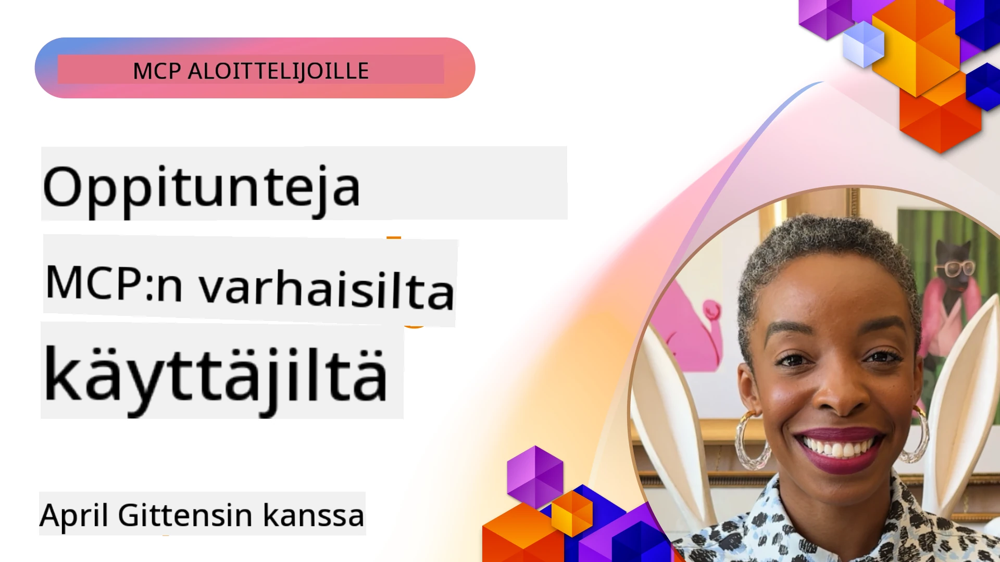

# 🌟 Oppitunnit varhaisilta käyttäjiltä

[](https://youtu.be/jds7dSmNptE)

_(Napsauta yllä olevaa kuvaa nähdäksesi videon tästä oppitunnista)_

## 🎯 Mitä tämä moduuli käsittelee

Tässä moduulissa tutkitaan, miten todelliset organisaatiot ja kehittäjät hyödyntävät Model Context Protocolia (MCP) todellisten haasteiden ratkaisemiseksi ja innovaation edistämiseksi. Yksityiskohtaisten tapaustutkimusten, käytännön projektien ja konkreettisten esimerkkien avulla opit, miten MCP mahdollistaa turvallisen, skaalautuvan tekoälyn integroinnin yhdistäen kielimallit, työkalut ja yritystiedot.

### 📚 Katso MCP käytännössä

Haluatko nähdä näiden periaatteiden soveltamista tuotantovalmiisiin työkaluihin? Tutustu [**10 Microsoftin MCP-palvelimeen, jotka mullistavat kehittäjien tuottavuuden**](microsoft-mcp-servers.md), jotka esittelevät aitoja Microsoftin MCP-palvelimia, joita voit käyttää jo tänään.

## Yleiskatsaus

Tämä oppitunti tutkii, miten varhaiset käyttäjät ovat hyödyntäneet Model Context Protocolia (MCP) ratkaistakseen todellisia haasteita ja edistääkseen innovaatiota eri toimialoilla. Yksityiskohtaisten tapaustutkimusten ja käytännön projektien avulla näet, miten MCP mahdollistaa standardoidun, turvallisen ja skaalautuvan tekoälyn integroinnin – yhdistäen laajat kielimallit, työkalut ja yritystiedot yhtenäiseen kehykseen. Saat käytännön kokemusta MCP-pohjaisten ratkaisujen suunnittelusta ja rakentamisesta, opit todetuista toteutusmalleista ja löydät parhaita käytäntöjä MCP:n käyttöönottoon tuotantoympäristöissä. Oppitunti korostaa myös nousevia trendejä, tulevia suuntauksia ja avoimen lähdekoodin resursseja, jotka auttavat pysymään MCP-teknologian ja sen kehittyvän ekosysteemin kärjessä.

## Oppimistavoitteet

- Analysoida todellisia MCP-toteutuksia eri toimialoilta
- Suunnitella ja rakentaa kokonaisia MCP-pohjaisia sovelluksia
- Tutkia nousevia trendejä ja tulevia suuntauksia MCP-teknologiassa
- Soveltaa parhaita käytäntöjä todellisissa kehitystilanteissa

## Todelliset MCP-toteutukset

### Tapaustutkimus 1: Yrityksen asiakastuen automaatio

Monikansallinen yritys otti käyttöön MCP-pohjaisen ratkaisun AI-käyttöliittymien standardoimiseksi asiakastukijärjestelmissään. Tämä mahdollisti:

- Yhdenmukaisen käyttöliittymän luomisen useille LLM-toimittajille
- Johdonmukaisen kehotusten hallinnan ylläpitämisen osastojen välillä
- Vahvojen turvallisuus- ja vaatimustenmukaisuusvalvontojen toteuttamisen
- Helpon vaihdon eri tekoälymallien välillä tarpeiden mukaan

**Tekninen toteutus:**

```python
# Python MCP -palvelimen toteutus asiakastukea varten
import logging
import asyncio
from modelcontextprotocol import create_server, ServerConfig
from modelcontextprotocol.server import MCPServer
from modelcontextprotocol.transports import create_http_transport
from modelcontextprotocol.resources import ResourceDefinition
from modelcontextprotocol.prompts import PromptDefinition
from modelcontextprotocol.tool import ToolDefinition

# Määritä lokitus
logging.basicConfig(level=logging.INFO)

async def main():
    # Luo palvelimen kokoonpano
    config = ServerConfig(
        name="Enterprise Customer Support Server",
        version="1.0.0",
        description="MCP server for handling customer support inquiries"
    )
    
    # Alusta MCP-palvelin
    server = create_server(config)
    
    # Rekisteröi tietopohjan resurssit
    server.resources.register(
        ResourceDefinition(
            name="customer_kb",
            description="Customer knowledge base documentation"
        ),
        lambda params: get_customer_documentation(params)
    )
    
    # Rekisteröi kehotemallit
    server.prompts.register(
        PromptDefinition(
            name="support_template",
            description="Templates for customer support responses"
        ),
        lambda params: get_support_templates(params)
    )
    
    # Rekisteröi tukityökalut
    server.tools.register(
        ToolDefinition(
            name="ticketing",
            description="Create and update support tickets"
        ),
        handle_ticketing_operations
    )
    
    # Käynnistä palvelin HTTP-siirrolla
    transport = create_http_transport(port=8080)
    await server.run(transport)

if __name__ == "__main__":
    asyncio.run(main())
```

**Tulokset:** Mallikustannusten 30 % pieneneminen, vastausjohdonmukaisuuden 45 % parantuminen ja parannettu vaatimustenmukaisuus globaalissa toiminnassa.

### Tapaustutkimus 2: Terveydenhuollon diagnoosiassistentti

Terveydenhuollon tarjoaja kehitti MCP-infrastruktuurin useiden erikoistuneiden lääketieteellisten tekoälymallien integroimiseksi samalla varmistaen, että arkaluonteiset potilastiedot pysyvät suojattuina:

- Saumaton vaihto yleisten ja erikoistuneiden lääketieteellisten mallien välillä
- Tiukat yksityisyydensuojan kontrollit ja tarkastuspolut
- Integrointi olemassa oleviin Elektronisiin terveystietojärjestelmiin (EHR)
- Johdonmukainen kehotustekniikka lääketieteelliselle terminologialle

**Tekninen toteutus:**

```csharp
// C# MCP host application implementation in healthcare application
using Microsoft.Extensions.DependencyInjection;
using ModelContextProtocol.SDK.Client;
using ModelContextProtocol.SDK.Security;
using ModelContextProtocol.SDK.Resources;

public class DiagnosticAssistant
{
    private readonly MCPHostClient _mcpClient;
    private readonly PatientContext _patientContext;
    
    public DiagnosticAssistant(PatientContext patientContext)
    {
        _patientContext = patientContext;
        
        // Configure MCP client with healthcare-specific settings
        var clientOptions = new ClientOptions
        {
            Name = "Healthcare Diagnostic Assistant",
            Version = "1.0.0",
            Security = new SecurityOptions
            {
                Encryption = EncryptionLevel.Medical,
                AuditEnabled = true
            }
        };
        
        _mcpClient = new MCPHostClientBuilder()
            .WithOptions(clientOptions)
            .WithTransport(new HttpTransport("https://healthcare-mcp.example.org"))
            .WithAuthentication(new HIPAACompliantAuthProvider())
            .Build();
    }
    
    public async Task<DiagnosticSuggestion> GetDiagnosticAssistance(
        string symptoms, string patientHistory)
    {
        // Create request with appropriate resources and tool access
        var resourceRequest = new ResourceRequest
        {
            Name = "patient_records",
            Parameters = new Dictionary<string, object>
            {
                ["patientId"] = _patientContext.PatientId,
                ["requestingProvider"] = _patientContext.ProviderId
            }
        };
        
        // Request diagnostic assistance using appropriate prompt
        var response = await _mcpClient.SendPromptRequestAsync(
            promptName: "diagnostic_assistance",
            parameters: new Dictionary<string, object>
            {
                ["symptoms"] = symptoms,
                patientHistory = patientHistory,
                relevantGuidelines = _patientContext.GetRelevantGuidelines()
            });
            
        return DiagnosticSuggestion.FromMCPResponse(response);
    }
}
```

**Tulokset:** Parannetut diagnoosiehdotukset lääkäreille täysin HIPAA-vaatimusten mukaisesti ja merkittävä kontekstinvaihdon väheneminen eri järjestelmien välillä.

### Tapaustutkimus 3: Rahoituspalveluiden riskianalyysi

Rahoituslaitos otti käyttöön MCP:n standardoidakseen riskianalyysiprosessinsa eri osastoilla:

- Loivat yhdenmukaisen käyttöliittymän luottoriskin, petostentorjunnan ja sijoitusriskimallien hallintaan
- Toteuttivat tiukat käyttöoikeusvalvonnat ja mallien versiohallinnan
- Varmistivat kaikkien tekoälysuositusten auditoitavuuden
- Ylläpitivät johdonmukaista tietomuotoa eri järjestelmien kesken

**Tekninen toteutus:**

```java
// Java MCP -palvelin taloudelliseen riskinarviointiin
import org.mcp.server.*;
import org.mcp.security.*;

public class FinancialRiskMCPServer {
    public static void main(String[] args) {
        // Luo MCP-palvelin taloudellisten säädösten noudattamista varten
        MCPServer server = new MCPServerBuilder()
            .withModelProviders(
                new ModelProvider("risk-assessment-primary", new AzureOpenAIProvider()),
                new ModelProvider("risk-assessment-audit", new LocalLlamaProvider())
            )
            .withPromptTemplateDirectory("./compliance/templates")
            .withAccessControls(new SOCCompliantAccessControl())
            .withDataEncryption(EncryptionStandard.FINANCIAL_GRADE)
            .withVersionControl(true)
            .withAuditLogging(new DatabaseAuditLogger())
            .build();
            
        server.addRequestValidator(new FinancialDataValidator());
        server.addResponseFilter(new PII_RedactionFilter());
        
        server.start(9000);
        
        System.out.println("Financial Risk MCP Server running on port 9000");
    }
}
```

**Tulokset:** Parannettu säädösten noudattaminen, 40 % nopeammat mallien käyttöönottoajat ja parannettu riskinarvioinnin johdonmukaisuus osastojen välillä.

### Tapaustutkimus 4: Microsoft Playwright MCP -palvelin selainautomaatiolle

Microsoft kehitti [Playwright MCP -palvelimen](https://github.com/microsoft/playwright-mcp) mahdollistamaan turvallisen ja standardoidun selainautomaatioiden toteutuksen Model Context Protocolin avulla. Tämä tuotantovalmis palvelin sallii tekoälyagenttien ja LLM:ien vuorovaikutuksen verkkoselaimien kanssa hallitusti, auditoitavasti ja laajennettavasti – mahdollistaen automatisoidut verkkotestaukset, tiedonkeruun ja kokonaisvaltaiset työnkulut.

> **🎯 Tuotantovalmiit työkalut**
> 
> Tämä tapaustutkimus esittelee aito MCP-palvelimen, jota voit käyttää jo tänään! Lue lisää Playwright MCP -palvelimesta ja muista 9 tuotantovalmiista Microsoftin MCP-palvelimesta oppaassamme [**Microsoft MCP Servers Guide**](microsoft-mcp-servers.md#8--playwright-mcp-server).

**Keskeiset ominaisuudet:**
- Altistaa selainautomaatiotoiminnot (navigointi, lomakkeiden täyttö, kuvakaappausten ottaminen jne.) MCP-työkaluina
- Toteuttaa tiukat käyttöoikeusvalvonnat ja hiekkalaatikkoympäristön luvattomien toimien estämiseksi
- Tarjoaa yksityiskohtaiset tarkastuslokit kaikista selainkäyttöliittymän vuorovaikutuksista
- Tukee integraatiota Azure OpenAI:n ja muiden LLM-toimittajien kanssa agenttivetoiseen automaatioon
- Toimii GitHub Copilotin Coding Agentin verkkoselaustoimintojen voimanlähteenä

**Tekninen toteutus:**

```typescript
// TypeScript: Rekisteröidään Playwrightin selaimen automaatiotyökalut MCP-palvelimessa
import { createServer, ToolDefinition } from 'modelcontextprotocol';
import { launch } from 'playwright';

const server = createServer({
  name: 'Playwright MCP Server',
  version: '1.0.0',
  description: 'MCP server for browser automation using Playwright'
});

// Rekisteröi työkalu, joka navigoi URL-osoitteeseen ja ottaa kuvakaappauksen
server.tools.register(
  new ToolDefinition({
    name: 'navigate_and_screenshot',
    description: 'Navigate to a URL and capture a screenshot',
    parameters: {
      url: { type: 'string', description: 'The URL to visit' }
    }
  }),
  async ({ url }) => {
    const browser = await launch();
    const page = await browser.newPage();
    await page.goto(url);
    const screenshot = await page.screenshot();
    await browser.close();
    return { screenshot };
  }
);

// Käynnistä MCP-palvelin
server.listen(8080);
```

**Tulokset:**

- Mahdollisti turvallisen, ohjelmallisen selainautomaation tekoälyagenteille ja LLM:ille
- Vähensi manuaalisen testauksen tarvetta ja paransi verkkosovellusten testikattavuutta
- Tarjosi uudelleenkäytettävän, laajennettavan kehyksen selainpohjaisten työkalujen integrointiin yritysympäristöissä
- Tukee GitHub Copilotin verkkoselaustoimintoja

**Viitteet:**

- [Playwright MCP Server GitHub Repository](https://github.com/microsoft/playwright-mcp)
- [Microsoft AI and Automation Solutions](https://azure.microsoft.com/en-us/products/ai-services/)

### Tapaustutkimus 5: Azure MCP – Yritysluokan Model Context Protocol palveluna

Azure MCP Server ([https://aka.ms/azmcp](https://aka.ms/azmcp)) on Microsoftin hallinnoima, yritysluokan toteutus Model Context Protocolista, suunniteltu tarjoamaan skaalautuvia, turvallisia ja vaatimustenmukaisia MCP-palvelinominaisuuksia pilvipalveluna. Azure MCP mahdollistaa organisaatioiden nopean MCP-palvelimien käyttöönoton, hallinnan ja integroinnin Azure AI:n, datan ja turvallisuuspalveluiden kanssa, vähentäen operatiivista taakkaa ja nopeuttaen tekoälyn käyttöönottoa.

> **🎯 Tuotantovalmiit työkalut**
> 
> Tämä on aito MCP-palvelin, jonka voit ottaa käyttöön heti! Lue lisää Microsoft Foundry MCP Serveristä oppaassamme [**Microsoft MCP Servers Guide**](microsoft-mcp-servers.md).


- Täysin hallinnoitu MCP-palvelinem hosting automaattisella skaalaamisella, valvonnalla ja turvallisuudella
- Natiivinen integraatio Azure OpenAI:n, Azure AI Searchin ja muiden Azure-palveluiden kanssa
- Yritystason tunnistus ja valtuutus Microsoft Entra ID:n kautta
- Tuki räätälöidyille työkaluille, kehotuspohjille ja resurssiliittimille
- Vaatimustenmukaisuus yritysturvallisuus- ja sääntelyvaatimuksissa

**Tekninen toteutus:**

```yaml
# Example: Azure MCP server deployment configuration (YAML)
apiVersion: mcp.microsoft.com/v1
kind: McpServer
metadata:
  name: enterprise-mcp-server
spec:
  modelProviders:
    - name: azure-openai
      type: AzureOpenAI
      endpoint: https://<your-openai-resource>.openai.azure.com/
      apiKeySecret: <your-azure-keyvault-secret>
  tools:
    - name: document_search
      type: AzureAISearch
      endpoint: https://<your-search-resource>.search.windows.net/
      apiKeySecret: <your-azure-keyvault-secret>
  authentication:
    type: EntraID
    tenantId: <your-tenant-id>
  monitoring:
    enabled: true
    logAnalyticsWorkspace: <your-log-analytics-id>
```

**Tulokset:**  
- Lyhensi yrityksen tekoälyprojektien aikaan pääsyn tarjoamalla käyttövalmiin, vaatimustenmukaisen MCP-palvelinalustan
- Yksinkertaisti LLM:ien, työkalujen ja yritysdatalähteiden integrointia
- Paransi turvallisuutta, havaittavuutta ja operatiivista tehokkuutta MCP-kuormissa
- Paransi koodin laatua Azure SDK:n parhailla käytännöillä ja nykyisillä tunnistamismalleilla

**Viitteet:**  
- [Azure MCP Documentation](https://aka.ms/azmcp)
- [Azure MCP Server GitHub Repository](https://github.com/Azure/azure-mcp)
- [Azure AI Services](https://azure.microsoft.com/en-us/products/ai-services/)
- [Microsoft MCP Center](https://mcp.azure.com)

## Tapaustutkimus 6: NLWeb 
MCP (Model Context Protocol) on nouseva protokolla chatbotien ja tekoälyassistenttien työkalujen kanssa vuorovaikutukseen. Jokainen NLWeb-instanssi on myös MCP-palvelin, joka tukee yhtä ydintoimintoa, ask, jota käytetään esittämään verkkosivustolle kysymys luonnollisella kielellä. Palautettu vastaus hyödyntää schema.orgia, laajasti käytettyä sanastoa verkkotietojen kuvaamiseen. Vapaasti sanottuna MCP on NLWeb kuten Http on HTML:lle. NLWeb yhdistää protokollat, Schema.org-muodot ja esimerkkikoodit auttaakseen sivustoja luomaan nopeasti nämä päätepisteet, hyödyttäen sekä ihmisiä keskustelevien käyttöliittymien kautta että koneita luonnollisessa agenttien välisessä vuorovaikutuksessa.

NLWeb:ssä on kaksi erillistä komponenttia.
- Protokolla, joka on hyvin yksinkertainen aloittaa, luonnollisen kielen rajapinta sivustolle sekä muoto, joka hyödyntää jsonia ja schema.orgia palautetun vastauksen esittämiseen. Katso REST API:n dokumentaatio lisätiedoista.
- Yksinkertainen toteutus (1), joka hyödyntää olemassa olevaa merkintää sellaisilla sivustoilla, jotka voidaan abstrahoida listaksi kohteita (tuotteet, reseptit, nähtävyydet, arvostelut jne.). Yhdessä joukko käyttäjärajapinnan widgettejä, sivustot voivat helposti tarjota keskustelevia käyttöliittymiä sisältöjensä esittämiseen. Katso Life of a chat query -dokumentaatiosta lisätietoa toiminnasta.
 
**Viitteet:**  
- [Azure MCP Documentation](https://aka.ms/azmcp)
- [NLWeb](https://github.com/microsoft/NlWeb)

### Tapaustutkimus 7: Microsoft Foundry MCP Server – Yritystason tekoälyagenttien integrointi

Microsoft Foundry MCP -palvelimet osoittavat, miten MCP:tä voidaan käyttää tekoälyagenttien ja työnkulkujen orkestrointiin ja hallintaan yritysympäristöissä. Integroimalla MCP Microsoft Foundryn kanssa organisaatiot voivat standardoida agenttien vuorovaikutukset, hyödyntää Foundryn työnkulkuhallintaa ja varmistaa turvalliset, skaalautuvat käyttöönotot.

> **🎯 Tuotantovalmiit työkalut**
> 
> Tämä on aito MCP-palvelin, jonka voit käyttää jo tänään! Lue lisää Microsoft Foundry MCP Serveristä oppaassamme [**Microsoft MCP Servers Guide**](microsoft-mcp-servers.md#9--microsoft-foundry-mcp-server).

**Keskeiset ominaisuudet:**
- Kattava pääsy Azuren tekoälyekosysteemiin, mukaan lukien malliluettelot ja käyttöönoton hallinta
- Tietopohjainen indeksointi Azure AI Searchin avulla RAG-sovelluksissa
- Työkalut tekoälymallien suorituskyvyn arviointiin ja laadunvarmistukseen
- Integrointi Microsoft Foundry Catalogin ja Labsin huippututkimusmalleihin
- Agenttien hallinta- ja arviointikyvykkyydet tuotantotilanteisiin

**Tulokset:**
- Nopea prototypointi ja vahva tekoälyagenttien työnkulkujen valvonta
- Saumaton integraatio Azure AI -palvelujen kanssa edistyneitä skenaarioita varten
- Yhtenäinen käyttöliittymä agenttiputkien rakentamiseen, käyttöönottoon ja valvontaan
- Parannettu turvallisuus, vaatimustenmukaisuus ja operatiivinen tehokkuus yrityksissä
- Kiihdytetty tekoälyn käyttöönotto säilyttäen hallinnan monimutkaisissa agenttivetoisissa prosesseissa

**Viitteet:**
- [Microsoft Foundry MCP Server GitHub Repository](https://github.com/azure-ai-foundry/mcp-foundry)
- [Integrating Azure AI Agents with MCP (Microsoft Foundry Blog)](https://devblogs.microsoft.com/foundry/integrating-azure-ai-agents-mcp/)

### Tapaustutkimus 8: Foundry MCP Playground – Kokeilu ja prototypointi

Foundry MCP Playground tarjoaa käyttövalmiin ympäristön MCP-palvelimien ja Microsoft Foundryn integraatioiden kokeiluun. Kehittäjät voivat nopeasti luoda prototyyppejä, testata ja arvioida tekoälymalleja ja agenttien työnkulkuja hyödyntäen Microsoft Foundryn Catalogin ja Labsin resursseja. Leikkikenttä yksinkertaistaa käyttöönottoa, tarjoaa esimerkkiprojekteja ja tukee yhteistyössä kehittämistä, mikä tekee parhaiden käytäntöjen ja uusien skenaarioiden tutkimisesta helppoa ilman monimutkaista infrastruktuuria. Helppokäyttöisyys alentaa kynnystä, mikä edistää innovaatioita ja yhteisön panoksia MCP- ja Microsoft Foundryn ekosysteemissä.

**Viitteet:**

- [Foundry MCP Playground GitHub Repository](https://github.com/azure-ai-foundry/foundry-mcp-playground)

### Tapaustutkimus 9: Microsoft Learn Docs MCP Server – Tekoälyn voiman käyttämä dokumentaatiopalvelu

Microsoft Learn Docs MCP Server on pilvipalvelu, joka tarjoaa tekoälyavustajille reaaliaikaisen pääsyn viralliseen Microsoftin dokumentaatioon Model Context Protocolin kautta. Tämä tuotantovalmis palvelin yhdistää laajan Microsoft Learn -ekosysteemin ja mahdollistaa semanttisen haun kaikista virallisista Microsoftin lähteistä.

> **🎯 Tuotantovalmiit työkalut**
> 
> Tämä on aito MCP-palvelin, jota voit käyttää jo tänään! Lue lisää Microsoft Learn Docs MCP Serveristä oppaassamme [**Microsoft MCP Servers Guide**](microsoft-mcp-servers.md#1--microsoft-learn-docs-mcp-server).

**Keskeiset ominaisuudet:**
- Reaaliaikainen pääsy viralliseen Microsoftin dokumentaatioon, Azure-dokumentaatioon ja Microsoft 365 -dokumentaatioon
- Edistyneet semanttiset hakutoiminnot, jotka ymmärtävät kontekstin ja tarkoituksen
- Aina ajan tasalla olevat tiedot Microsoft Learn -sisällön julkaisemisen myötä
- Laaja kattavuus Microsoft Learnista, Azure-dokumentaatioista ja Microsoft 365 -lähteistä
- Palauttaa jopa 10 korkealaatuista sisältöosaa artikkelin otsikoilla ja URL-osoitteilla

**Miksi tämä on kriittistä:**
- Ratkaisee "vanhentuneet tekoälytiedot" -ongelman Microsoftin teknologioissa
- Varmistaa tekoälyavustajien pääsyn uusimpiin .NET-, C#-, Azure- ja Microsoft 365 -ominaisuuksiin
- Tarjoaa auktoriteettisen, alkuperäisen tiedon tarkkaa koodin generointia varten
- Välttämätön kehittäjille, jotka työskentelevät nopeasti kehittyvien Microsoft-teknologioiden parissa

**Tulokset:**
- Merkittävästi parantunut tekoälyn tuottaman koodin tarkkuus Microsoft-teknologioissa
- Vähentynyt aika dokumentaation ja parhaiden käytäntöjen etsimiseen
- Parantunut kehittäjien tuottavuus kontekstitietoisen dokumentaation haun avulla
- Saumaton integraatio kehitystyönkulkuihin ilman IDE:n vaihtamista

**Viitteet:**
- [Microsoft Learn Docs MCP Server GitHub Repository](https://github.com/MicrosoftDocs/mcp)
- [Microsoft Learn Documentation](https://learn.microsoft.com/)

## Käytännön projektit

### Projekti 1: Rakenna monitoimittajapalvelin MCP:llä

**Tavoite:** Luo MCP-palvelin, joka voi ohjata pyynnöt useiden tekoälymallitoimittajien välillä tiettyjen kriteerien perusteella.

**Vaatimukset:**

- Tuki vähintään kolmelle eri mallitoimittajalle (esim. OpenAI, Anthropic, paikalliset mallit)
- Reititysmekanismin toteuttaminen pyynnön metatietojen perusteella
- Luoda konfigurointijärjestelmä toimittajien valtuustietojen hallintaan
- Lisätä välimuisti suorituskyvyn ja kustannusten optimointiin
- Rakentaa yksinkertainen hallintapaneeli käytön seurantaan

**Toteutusvaiheet:**

1. Perusta MCP-palvelimen perusinfrastruktuuri
2. Toteuta toimittajakohtaiset adapterit jokaiselle tekoälymallipalvelulle
3. Luo reitityslogiikka pyynnön ominaisuuksien perusteella
4. Lisää välimuistivaihtoehdot yleisille pyynnöille
5. Kehitä valvontapaneeli
6. Testaa erilaisilla pyyntökuvioilla

**Teknologiat:** Valitse Python (tai .NET/Java/Python mieltymyksesi mukaan), Redis välimuistia varten ja yksinkertainen verkkokehys hallintapaneelia varten.

### Projekti 2: Yrityksen kehotusten hallintajärjestelmä

**Tavoite:** Kehitä MCP-pohjainen järjestelmä, jolla hallitaan, versioidaan ja otetaan käyttöön kehotuspohjia organisaation laajuisesti.

**Vaatimukset:**


- Luo keskitetty varasto kehotemalleille
- Toteuta versiointi- ja hyväksyntätyönkulut
- Rakenna mallin testausominaisuudet esimerkkisyötteillä
- Kehitä roolipohjaiset käyttöoikeudet
- Luo API mallien hakua ja käyttöönottoa varten

**Toteutusvaiheet:**

1. Suunnittele tietokantakaavio mallien tallennusta varten
2. Luo ydintehtävät mallin CRUD-operaatioille
3. Toteuta versiointijärjestelmä
4. Rakenna hyväksyntätyönkulku
5. Kehitä testauskehys
6. Luo yksinkertainen verkkokäyttöliittymä hallintaa varten
7. Integroi MCP-palvelimen kanssa

**Teknologiat:** Valitsemasi backend-kehys, SQL- tai NoSQL-tietokanta ja frontend-kehys hallintaliittymälle.

### Projekti 3: MCP-pohjainen sisällöntuotantoalusta

**Tavoite:** Rakenna sisällöntuotantoalusta, joka hyödyntää MCP:tä tarjotakseen yhtenäiset tulokset eri sisältötyypeille.

**Vaatimukset:**

- Tue useita sisältömuotoja (blogikirjoitukset, sosiaalinen media, markkinointitekstit)
- Toteuta mallipohjainen generointi muokkausvaihtoehdoilla
- Luo sisällön tarkastus- ja palautteenantojärjestelmä
- Seuraa sisällön suorituskykymittareita
- Tue sisällön versionhallintaa ja iterointia

**Toteutusvaiheet:**

1. Perusta MCP-asiakasinfrastruktuuri
2. Luo malleja eri sisältötyypeille
3. Rakenna sisällöntuotantoputki
4. Toteuta tarkastusjärjestelmä
5. Kehitä mittausten seuranta
6. Luo käyttölittymä mallien hallintaan ja sisällöntuotantoon

**Teknologiat:** Valitsemasi ohjelmointikieli, web-kehys ja tietokantajärjestelmä.

## MCP-teknologian tulevaisuuden suuntaviivat

### Nousevat suuntaukset

1. **Monimodaalinen MCP**
   - MCP:n laajentaminen standardoimaan vuorovaikutukset kuvan, äänen ja videon mallien kanssa
   - Ristiinmodaalisen päättelyn kyvykkyyksien kehittäminen
   - Standardoidut kehotemuodot eri modaalisuuksille

2. **Hajautettu MCP-infrastruktuuri**
   - Jakautuneet MCP-verkot, jotka voivat jakaa resursseja organisaatioiden välillä
   - Standardoidut protokollat turvalliseen mallien jakamiseen
   - Yksityisyyttä suojaavat laskentatekniikat

3. **MCP-markkinapaikat**
   - Ekosysteemit MCP-mallien ja laajennusten jakamiseksi ja kaupallistamiseksi
   - Laadunvarmistus- ja sertifiointiprosessit
   - Integraatiot mallimarkkinapaikkoihin

4. **MCP reunalaskennassa (Edge Computing)**
   - MCP-standardien sovittaminen resurssirajoitteisille reunalaitteille
   - Optimoidut protokollat matalan kaistanleveyden ympäristöihin
   - Erikoistuneet MCP-toteutukset IoT-ekosysteemeille

5. **Sääntelykehykset**
   - MCP-laajennusten kehitys sääntelyn noudattamiseksi
   - Standardoidut tarkastuspolut ja selitettävyyden rajapinnat
   - Integraatio nouseviin tekoälyn hallintakehyksiin

### MCP-ratkaisut Microsoftilta

Microsoft ja Azure ovat kehittäneet useita avoimen lähdekoodin arkistoja, jotka auttavat kehittäjiä toteuttamaan MCP:tä eri tilanteissa:

#### Microsoft Organization

1. [playwright-mcp](https://github.com/microsoft/playwright-mcp) - Playwright MCP -palvelin selainautomaatiota ja testausta varten
2. [files-mcp-server](https://github.com/microsoft/files-mcp-server) - OneDrive MCP -palvelimen toteutus paikallista testausta ja yhteisön panostusta varten
3. [NLWeb](https://github.com/microsoft/NlWeb) - NLWeb on kokoelma avoimia protokollia ja niihin liittyviä työkaluja. Sen pääpaino on perustason rakentamisessa tekoälysovelluksiin verkossa

#### Azure-Samples Organization

1. [mcp](https://github.com/Azure-Samples/mcp) - Linkkejä esimerkkeihin, työkaluihin ja resursseihin MCP-palvelinten rakentamiseen ja integrointiin Azurella useilla kielillä
2. [mcp-auth-servers](https://github.com/Azure-Samples/mcp-auth-servers) - Malli MCP-palvelimista, joissa näytetään autentikaatio nykyisellä Model Context Protocol -määrityksellä
3. [remote-mcp-functions](https://github.com/Azure-Samples/remote-mcp-functions) - Kotisivu etä-MCP-palvelintoteutuksille Azure Functionsissä ja linkit kielikohtaisiin arkistoihin
4. [remote-mcp-functions-python](https://github.com/Azure-Samples/remote-mcp-functions-python) - Pikakäynnistyspohja räätälöityjen etä-MCP-palvelimien rakentamiseen ja käyttöönottoon Azure Functionsillä Pythonilla
5. [remote-mcp-functions-dotnet](https://github.com/Azure-Samples/remote-mcp-functions-dotnet) - Pikakäynnistyspohja räätälöityjen etä-MCP-palvelimien rakentamiseen ja käyttöönottoon Azure Functionsillä .NET/C#-kielellä
6. [remote-mcp-functions-typescript](https://github.com/Azure-Samples/remote-mcp-functions-typescript) - Pikakäynnistyspohja räätälöityjen etä-MCP-palvelimien rakentamiseen ja käyttöönottoon Azure Functionsillä TypeScriptillä
7. [remote-mcp-apim-functions-python](https://github.com/Azure-Samples/remote-mcp-apim-functions-python) - Azure API Management tekoälyporttina etä-MCP-palvelimiin Pythonilla
8. [AI-Gateway](https://github.com/Azure-Samples/AI-Gateway) - APIM ❤️ tekoälykokeilut, mukaan lukien MCP-ominaisuudet, yhdistäen Azure OpenAI ja AI Foundryn

Nämä arkistot tarjoavat erilaisia toteutuksia, mallipohjia ja resursseja Model Context Protocolin käyttöön eri ohjelmointikielillä ja Azure-palveluissa. Ne kattavat monia käyttötapauksia peruspalvelinten toteutuksista autentikointiin, pilvikäyttöönottoon ja yritysintegrointeihin.

#### MCP Resurssi-hakemisto

Virallisessa Microsoft MCP -arkistossa sijaitseva [MCP Resources -hakemisto](https://github.com/microsoft/mcp/tree/main/Resources) tarjoaa valikoidun kokoelman esimerkkiresursseja, kehotemalleja ja työkalumääritelmiä Model Context Protocol -palvelimien käyttöön. Tämä hakemisto on suunniteltu auttamaan kehittäjiä aloittamaan nopeasti MCP:n kanssa tarjoamalla uudelleen käytettäviä rakennuspalikoita ja parhaita käytäntöjä:

- **Kehotemallit:** Valmiita kehotemalleja yleisiin tekoälytehtäviin ja tilanteisiin, joita voi mukauttaa omiin MCP-palvelintoteutuksiin.
- **Työkalumääritelmät:** Esimerkkityökaluskeemat ja metatiedot, jotka standardisoivat työkalujen integraatiota ja kutsumista eri MCP-palvelimissa.
- **Resurssinäytteet:** Esimerkkiresurssimääritelmiä yhdistämiseen tietolähteisiin, rajapintoihin ja ulkoisiin palveluihin MCP-kehyksessä.
- **Referenssitoteutukset:** Käytännön esimerkkejä, jotka näyttävät miten resurssit, kehotteet ja työkalut järjestetään reaalimaailman MCP-projekteissa.

Nämä resurssit nopeuttavat kehitystä, edistävät standardointia ja varmistavat parhaiden käytäntöjen noudattamista MCP-pohjaisten ratkaisujen rakentamisessa ja käyttöönotossa.

#### MCP Resurssi-hakemisto

- [MCP Resources (esimerkkikehotteet, työkalut ja resurssimääritelmät)](https://github.com/microsoft/mcp/tree/main/Resources)

### Tutkimusmahdollisuudet

- Tehokkaat kehotteiden optimointitekniikat MCP-kehyksissä
- Turvamallit monivuokraajamallien MCP-käyttöönotossa
- Suorituskyvyn vertailuanalyysit eri MCP-toteutusten välillä
- Formaali varmennusmenetelmät MCP-palvelimille

## Yhteenveto

Model Context Protocol (MCP) muokkaa nopeasti standardoitua, turvallista ja yhteentoimivaa tekoälyn integrointia eri toimialoilla. Tämässä oppitunnissa tapaustutkimusten ja käytännön projektien kautta olet nähnyt kuinka varhaiset käyttäjät—including Microsoft ja Azure—hyödyntävät MCP:tä todellisten haasteiden ratkaisemiseen, tekoälyn omaksumisen nopeuttamiseen sekä vaatimustenmukaisuuden, turvallisuuden ja skaalautuvuuden varmistamiseen. MCP:n modulaarinen lähestymistapa mahdollistaa organisaatioille suurten kielimallien, työkalujen ja yritystietojen yhdistämisen yhtenäisessä, tarkastettavassa kehyksessä. Kun MCP kehittyy edelleen, yhteisössä mukana pysyminen, avoimen lähdekoodin resurssien tutkiminen ja parhaiden käytäntöjen noudattaminen ovat avainasemassa kestävien, tulevaisuuteen valmiiden tekoälyratkaisujen rakentamisessa.

## Lisäresurssit

- [MCP Foundry GitHub -arkisto](https://github.com/azure-ai-foundry/mcp-foundry)
- [Foundry MCP Playground](https://github.com/azure-ai-foundry/foundry-mcp-playground)
- [Azure AI -agenttien integrointi MCP:n kanssa (Microsoft Foundry Blog)](https://devblogs.microsoft.com/foundry/integrating-azure-ai-agents-mcp/)
- [MCP GitHub -arkisto (Microsoft)](https://github.com/microsoft/mcp)
- [MCP Resources -hakemisto (esimerkkikehotteet, työkalut ja resurssit)](https://github.com/microsoft/mcp/tree/main/Resources)
- [MCP-yhteisö & dokumentaatio](https://modelcontextprotocol.io/introduction)
- [MCP-määritys (2026-07-28)](https://modelcontextprotocol.io/specification/2026-07-28/)
- [Azure MCP -dokumentaatio](https://aka.ms/azmcp)
- [OWASP MCP Top 10](https://microsoft.github.io/mcp-azure-security-guide/mcp/) - Turvallisuuden parhaat käytännöt
- [Playwright MCP -palvelimen GitHub-arkisto](https://github.com/microsoft/playwright-mcp)
- [Files MCP -palvelin (OneDrive)](https://github.com/microsoft/files-mcp-server)
- [Azure-Samples MCP](https://github.com/Azure-Samples/mcp)
- [MCP Auth Servers (Azure-Samples)](https://github.com/Azure-Samples/mcp-auth-servers)
- [Remote MCP Functions (Azure-Samples)](https://github.com/Azure-Samples/remote-mcp-functions)
- [Remote MCP Functions Python (Azure-Samples)](https://github.com/Azure-Samples/remote-mcp-functions-python)
- [Remote MCP Functions .NET (Azure-Samples)](https://github.com/Azure-Samples/remote-mcp-functions-dotnet)
- [Remote MCP Functions TypeScript (Azure-Samples)](https://github.com/Azure-Samples/remote-mcp-functions-typescript)
- [Remote MCP APIM Functions Python (Azure-Samples)](https://github.com/Azure-Samples/remote-mcp-apim-functions-python)
- [AI-Gateway (Azure-Samples)](https://github.com/Azure-Samples/AI-Gateway)
- [Microsoftin tekoäly- ja automaatioratkaisut](https://azure.microsoft.com/en-us/products/ai-services/)

## Harjoitukset

1. Analysoi yksi tapaustutkimus ja ehdota vaihtoehtoinen toteutustapa.
2. Valitse yksi projektidea ja laadi yksityiskohtainen tekninen erittely.
3. Tutki yksi toimiala, jota ei ole käsitelty tapaustutkimuksissa, ja hahmottele kuinka MCP voisi ratkaista sen erityishaasteita.
4. Tutki yksi tulevaisuuden suuntauksista ja luo konsepti uudelle MCP-laajennukselle sen tukemiseksi.

## Mitä seuraavaksi

Tutustu lisää: [Microsoft MCP Servers](./microsoft-mcp-servers.md)

Jatka: [Moduuli 8: Parhaat käytännöt](../08-BestPractices/README.md)

---

<!-- CO-OP TRANSLATOR DISCLAIMER START -->
**Vastuuvapauslauseke**:
Tämä asiakirja on käännetty käyttämällä tekoälypohjaista käännöspalvelua [Co-op Translator](https://github.com/Azure/co-op-translator). Vaikka pyrimme tarkkuuteen, otathan huomioon, että automaattiset käännökset saattavat sisältää virheitä tai epätarkkuuksia. Alkuperäinen asiakirja sen alkuperäiskielellä on virallinen lähde. Tärkeissä asioissa suositellaan ammattimaista ihmiskäännöstä. Emme ole vastuussa tämän käännöksen käytöstä aiheutuvista väärinymmärryksistä tai tulkinnoista.
<!-- CO-OP TRANSLATOR DISCLAIMER END -->