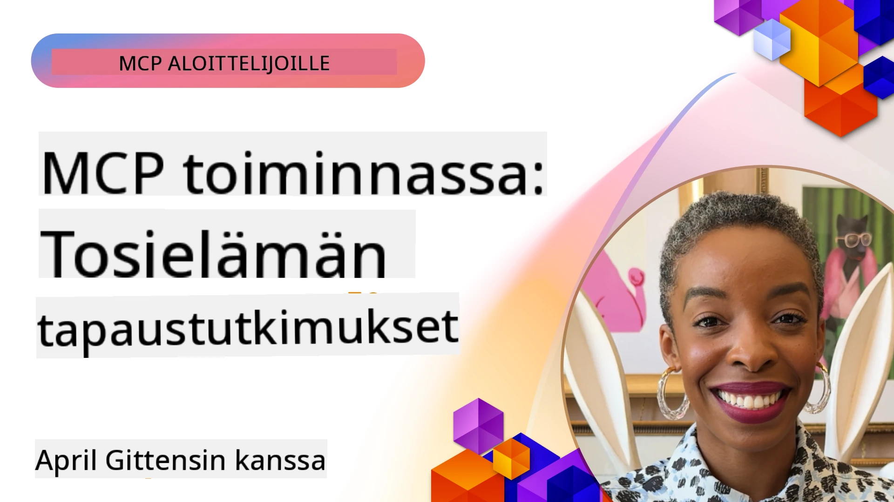

# MCP käytännössä: Todellisia tapaustutkimuksia

_(Napsauta yllä olevaa kuvaa nähdäksesi videon tästä oppitunnista)_

Model Context Protocol (MCP) muuttaa sitä, miten tekoälysovellukset ovat vuorovaikutuksessa datan, työkalujen ja palveluiden kanssa. Tässä osassa esitellään todellisia tapaustutkimuksia, jotka demonstroivat MCP:n käytännön sovelluksia erilaisissa yritystilanteissa.

## Yleiskatsaus

Tässä osassa esitellään konkreettisia esimerkkejä MCP:n toteutuksista, korostaen sitä, miten organisaatiot hyödyntävät tätä protokollaa ratkaistakseen monimutkaisia liiketoiminnan haasteita. Tarkastelemalla näitä tapaustutkimuksia saat oivalluksia MCP:n monipuolisuudesta, skaalautuvuudesta ja käytännön hyödyistä todellisissa tilanteissa.

## Keskeiset oppimistavoitteet

Tutkimalla näitä tapaustutkimuksia:

- Ymmärrät, miten MCP:tä voidaan soveltaa tiettyjen liiketoiminnan ongelmien ratkaisuun
- Opit erilaisista integraatiokuvioista ja arkkitehtonisista lähestymistavoista
- Tunnistat parhaat käytännöt MCP:n toteuttamiseksi yritysympäristöissä
- Saat näkemyksiä haasteista ja ratkaisuista, jotka on kohdattu todellisissa käyttöönotossa
- Löydät mahdollisuuksia soveltaa samanlaisia kuvioita omissa projekteissasi

## Esitellyt tapaustutkimukset

### 1. [Azure AI Travel Agents – Viittausratkaisu](./travelagentsample.md)

Tämä tapaustutkimus tarkastelee Microsoftin kattavaa viittausratkaisua, joka näyttää, miten rakentaa moniedustajaisten, tekoälyllä toimivien matkasuunnittelu-sovellusten MCP:n, Azure OpenAI:n ja Azure AI Searchin avulla. Projekti esittelee:

- Moniedustajien orkestroinnin MCP:n kautta
- Yritysdata-integraation Azure AI Searchin avulla
- Turvallisen ja skaalautuvan arkkitehtuurin Azure-palveluilla
- Laajennettavat työkalut uudelleenkäytettävien MCP-komponenttien kanssa
- Vuorovaikutteinen käyttäjäkokemus Azure OpenAI:n voimin

Arkkitehtuuri ja toteutuksen yksityiskohdat tarjoavat arvokkaita näkemyksiä monimutkaisten moniedustajajärjestelmien rakentamisesta MCP:n koordinointikerroksena.

### 2. [Azure DevOps -kohteiden päivitys YouTube-datan avulla](./UpdateADOItemsFromYT.md)

Tämä tapaustutkimus näyttää käytännön sovelluksen MCP:stä työnkulkujen automaatiossa. Se esittää miten MCP-työkaluja voi käyttää:

- Datan poimimiseen verkkopalveluista (YouTube)
- Työkohteiden päivittämiseen Azure DevOps -järjestelmissä
- Toistettavien automaatiotyönkulkujen luomiseen
- Datan integrointiin eri järjestelmien välillä

Esimerkki havainnollistaa, miten jopa suhteellisen yksinkertaiset MCP-toteutukset voivat tuoda merkittäviä tehokkuusetuja automatisoimalla rutiinitehtäviä ja parantamalla datan yhdenmukaisuutta järjestelmien välillä.

### 3. [Reaaliaikainen dokumentaation hakeminen MCP:llä](./docs-mcp/README.md)

Tämä tapaustutkimus opastaa Python-konsoliasiakkaan yhdistämisessä Model Context Protocol (MCP) -palvelimeen reaaliaikaisen, kontekstitietoisen Microsoftin dokumentaation hakemiseksi ja kirjaamiseksi. Opit:

- Yhdistämään MCP-palvelimeen Python-asiakkaalla ja virallisella MCP SDK:lla
- Käyttämään striimaavia HTTP-asiakkaita tehokkaaseen reaaliaikaiseen datanhakuun
- Kutsumaan dokumentointityökaluja palvelimella ja kirjaamaan vastaukset suoraan konsoliin
- Integroimaan ajantasaisen Microsoft-dokumentaation työnkulkuusi ilman terminaalista poistumista

Luvussa on käytännön harjoitustehtävä, minimaalinen toimiva koodinäyte ja linkkejä lisäresursseihin syvällisempää oppimista varten. Katso koko läpikäynti ja koodi linkitetystä luvusta ymmärtääksesi, miten MCP voi muuttaa dokumentaation saatavuutta ja kehittäjien tuottavuutta konsolipohjaisissa ympäristöissä.

### 4. [Interaktiivinen opintosuunnitelman generaattori MCP:llä -verkkosovellus](./docs-mcp/README.md)

Tämä tapaustutkimus näyttää, miten rakentaa interaktiivinen verkkosovellus Chainlitin ja Model Context Protocolin (MCP) avulla henkilökohtaisten opintosuunnitelmien luomiseksi mille tahansa aiheelle. Käyttäjät voivat määrittää aiheen (esim. "AI-900 -sertifiointi") ja opiskeluajan (esim. 8 viikkoa), ja sovellus antaa viikko kerrallaan suositellun sisällön erittelyn. Chainlit mahdollistaa keskustelupohjaisen chat-käyttöliittymän, tehden kokemuksesta mukaansatempaavan ja mukautuvan.

- Vuorovaikutteinen verkkosovellus Chainlitin voimin
- Käyttäjälähtöiset kehotteet aiheen ja keston määrittämiseen
- Viikkokohtaiset sisältösuositukset MCP:n avulla
- Reaaliaikaiset, mukautuvat vastaukset chat-käyttöliittymässä

Projekti havainnollistaa, miten keskusteluäly ja MCP voidaan yhdistää luomaan dynaamisia, käyttäjälähtöisiä opetusvälineitä nykyaikaisessa verkkoympäristössä.

### 5. [Sisäänrakennetut dokumentit MCP-palvelimella VS Codessa](./docs-mcp/README.md)

Tämä tapaustutkimus näyttää, miten voit tuoda Microsoft Learn -dokumentit suoraan VS Code -ympäristöön MCP-palvelimen avulla – ei enää selaimen välilehtien vaihto! Näet, miten:

- Etsiä ja lukea dokumentteja välittömästi VS Codessa MCP-paneelin tai komentopalettin avulla
- Viitata dokumentaatioon ja lisätä linkkejä suoraan README- tai kurssin markdown-tiedostoihin
- Käyttää GitHub Copilotia ja MCP:tä saumattomasti tekoälyllä toteutettuihin dokumentaatio- ja koodityönkulkuihin
- Varmistaa ja parantaa dokumentaatiota reaaliaikaisella palautteella ja Microsoftin tarjoamalla tarkkuudella
- Integroi MCP GitHub-työnkulkuihin jatkuvaa dokumentaation validointia varten

Toteutus sisältää:

- Esimerkkikonfiguraatio `.vscode/mcp.json` helppoon käyttöönottoon
- Kuvakaappauspohjaiset läpikäynnit editorin sisäisestä kokemuksesta
- Vinkkejä Copilotin ja MCP:n yhdistämiseen optimaalisen tuottavuuden saavuttamiseksi

Tämä tilanne on ihanteellinen kurssin kirjoittajille, dokumentaatiokirjoittajille ja kehittäjille, jotka haluavat pysyä keskittyneinä editorissaan työskennellessään dokumenttien, Copilotin ja validointityökalujen kanssa – kaikki MCP:n voimalla.

### 6. [APIM MCP -palvelimen luominen](./apimsample.md)

Tämä tapaustutkimus tarjoaa askel askeleelta -ohjeet MCP-palvelimen luomiseksi Azure API Managementin (APIM) avulla. Se kattaa:

- MCP-palvelimen perustamisen Azure API Managementiin
- API-toimintojen altistamisen MCP-työkaluina
- Politiikoiden määrittämisen nopeuden rajoittamiseksi ja turvallisuuden varmistamiseksi
- MCP-palvelimen testaamisen Visual Studio Coden ja GitHub Copilotin avulla

Tämä esimerkki havainnollistaa, miten hyödyntää Azuren mahdollisuuksia luodaksesi vankan MCP-palvelimen, jota voi käyttää erilaisissa sovelluksissa, parantaen tekoälyjärjestelmien integraatiota yritysten rajapintojen kanssa.

### 7. [GitHub MCP -rekisteri — Agenttien integraation nopeuttaminen](https://github.com/mcp)

Tämä tapaustutkimus tarkastelee GitHubin MCP-rekisteriä, joka käynnistettiin syyskuussa 2025, ja jonka tavoitteena on ratkaista tekoälyekosysteemin keskeinen haaste: hajautuneet Model Context Protocol (MCP) -palvelimien löytyminen ja käyttöönotto.

#### Yleiskatsaus
**MCP-rekisteri** ratkaisee kasvavan ongelman, jossa MCP-palvelimet ovat hajallaan eri arkistoissa ja rekistereissä, mikä aiemmin teki integroinnista hidasta ja virhealtista. Nämä palvelimet mahdollistavat tekoälyagenttien vuorovaikutuksen ulkoisten järjestelmien, kuten rajapintojen, tietokantojen ja dokumentaatiolähteiden kanssa.

#### Ongelman määritelmä
Agenttityönkulkuja rakentavat kehittäjät kohtasivat useita haasteita:
- **Huono löydettävyys** MCP-palvelimille eri alustoilla
- **Turhat käyttöönottoon liittyvät kysymykset** hajallaan foorumeilla ja dokumentaatiossa
- **Turvallisuusriskit** varmennamattomista ja epäluotettavista lähteistä
- **Laadun ja yhteensopivuuden standardoinnin puute** palvelimissa

#### Ratkaisuarkkitehtuuri
GitHubin MCP-rekisteri keskittää luotetut MCP-palvelimet seuraavin keskeisin ominaisuuksin:
- **Yhdellä klikkauksella asennus** VS Coden kautta sujuvaan käyttöönottoon
- **Signaali-kohina-lajittelu** tähtien, aktiivisuuden ja yhteisön vahvistusten mukaan
- **Suora integraatio** GitHub Copilotin ja muiden MCP-yhteensopivien työkalujen kanssa
- **Avoin kontribuutiomalli**, joka mahdollistaa sekä yhteisön että yrityskumppaneiden panokset

#### Liiketoiminnan vaikutus
Rekisteri on tuottanut mitattavissa olevia parannuksia:
- **Nopeampi käyttöönotto** kehittäjille kuten Microsoft Learn MCP Server, joka striimaa virallista dokumentaatiota suoraan agenteille
- **Parantunut tuottavuus** erikoistuneiden palvelimien kuten `github-mcp-server` avulla, mahdollistaen luonnolliskielisen GitHub-automaatio (PR:n luonti, CI:n uudelleenkäynnistys, koodin skannaus)
- **Vahvempi ekosysteemin luottamus** kuratoitujen listojen ja läpinäkyvien konfiguraatiostandardien kautta

#### Strateginen arvo
Agenttien elinkaaren hallintaan ja toistettaviin työnkulkuihin erikoistuneille MCP-rekisteri tarjoaa:
- **Modulaariset agenttien käyttöönotto** -mahdollisuudet standardoitujen komponenttien avulla
- **Rekisteripohjaiset arviointiputket** yhdenmukaisiin testeihin ja validointiin
- **Työkalujen välinen yhteentoimivuus** erilaisten tekoälyalustojen integraatioon

Tämä tapaustutkimus osoittaa, että MCP-rekisteri ei ole vain hakemisto – se on perustavanlaatuinen alusta skaalautuvaan, todellisen maailman mallien integrointiin ja agenttipohjaisten järjestelmien käyttöönottoon.

### 8. [Julkaisu sosiaalisiin verkostoihin agentin kautta](./publora-social-publishing.md)

Tämä tapaustutkimus käy läpi **kirjoitusoikeudet omaavan etä-MCP-palvelimen** – sellaisen, jonka työkalut tekevät peruuttamattomia toimia käyttäjän puolesta – käyttäen esimerkkinä sosiaalisen median julkaisemista. Agentti luonnostelee julkaisun, ihminen hyväksyy sen ja palvelin aikatauluttaa sen verkostoihin.

Mielenkiintoinen osa ovat julkaisemiseen liittyvät suunnittelurajoitteet, jotka koskevat mitä tahansa palvelinta, joka kirjoittaa eikä vain lue:

- **Avoin löytyminen, todennettu suoritus** — `tools/list` vastataan ilman tunnuksia, jotta rekisterit ja asiakkaat voivat tutkia, kun taas jokainen `tools/call` vaatii tokenin ja muuten palauttaa `401` ja `WWW-Authenticate`-otsikon
- **OAuth-rekisteröinti ilman erillistä tapaa** — dynaaminen asiakasrekisteröinti tänään, Client ID Metadata Documentsin suuntaan, johon `2026-07-28` määrittely tähtää
- **Työkalumuistiinpanot** (`readOnlyHint`, `destructiveHint`, `idempotentHint`), joita asiakkaat käyttävät päätöksissä mitä vahvistetaan — vihjeitä, ei pakkoa, ja jotain, mitä liitännäishakemistolta nyt vaaditaan tarkastelussa
- **Keksimättömät tunnisteet**, jotta harhainen arvo epäonnistuu selkeästi eikä toimi uskottavalta näyttävän sijaan
- **Idempotenssiavaimet julkaisutyökaluissa**, joten agentin suorituskerroinyritykset eivät johda kaksoisjulkaisuihin
- **Ei-toiminnallinen (no-op) kohde työkalumallissa**, joka käyttää koko kirjoituspolun eikä julkaise mitään, arvioijille ja jatkuvan integraation käyttöön

Luku päättyy lyhyeen tarkistuslistaan, jota voit soveltaa rakennettavaasi palvelimeen.

## Yhteenveto

Nämä kahdeksan kattavaa tapaustutkimusta osoittavat Model Context Protocolin poikkeuksellisen monipuolisuuden ja käytännön sovellukset erilaisissa todellisissa tilanteissa. Monimutkaisista moniedustajaisista matkasuunnittelujärjestelmistä ja yritysrajapintojen hallinnasta sujuviin dokumentaatiotyönkulkuihin ja mullistavaan GitHub MCP -rekisteriin nämä esimerkit näyttävät, miten MCP tarjoaa standardoidun ja skaalautuvan tavan yhdistää tekoälyjärjestelmät tarvitsemiinsa työkaluihin, dataan ja palveluihin tuottaakseen poikkeuksellista arvoa.

Tapaustutkimukset kattavat MCP:n toteutuksen monia ulottuvuuksia:
- **Yritysintegraatio**: Azure API Management ja Azure DevOps -automaatio
- **Moniedustajien orkestrointi**: matkasuunnittelu koordinoitujen tekoälyagenttien avulla
- **Kehittäjien tuottavuus**: VS Code -integraatio ja reaaliaikainen dokumentaatio
- **Ekosysteemin kehitys**: GitHub MCP -rekisteri perustana
- **Koulutussovellukset**: interaktiiviset opintosuunnitelman generointityökalut ja keskustelu-liittymät

Näiden toteutusten tutkiminen antaa sinulle keskeisiä oivalluksia:
- **Arkkitehtoniset kuviot** eri kokoihin ja käyttötarkoituksiin
- **Toteutusstrategiat**, jotka tasapainottavat toiminnallisuutta ja ylläpidettävyyttä
- **Turvallisuus ja skaalautuvuus** tuotantokäyttöön
- **Parhaat käytännöt** MCP-palvelimen kehitykseen ja asiakasintegraatioon
- **Ekosysteemiajattelu** yhdistettyjen tekoälyratkaisujen rakentamiseen

Nämä esimerkit yhdessä osoittavat, että MCP ei ole pelkästään teoreettinen kehys, vaan kypsä, tuotantovalmiiksi suunniteltu protokolla, joka mahdollistaa käytännön ratkaisut monimutkaisiin liiketoiminnan haasteisiin. Rakensitpa yksinkertaisia automaatiotyökaluja tai monimutkaisia moniedustajajärjestelmiä, tässä esitellyt kuviot ja lähestymistavat tarjoavat vankan perustan omille MCP-projekteillesi.

## Lisäresurssit

- [Azure AI Travel Agents GitHub -arkisto](https://github.com/Azure-Samples/azure-ai-travel-agents)
- [Azure DevOps MCP -työkalu](https://github.com/microsoft/azure-devops-mcp)
- [Playwright MCP -työkalu](https://github.com/microsoft/playwright-mcp)
- [Microsoft Docs MCP -palvelin](https://github.com/MicrosoftDocs/mcp)
- [GitHub MCP -rekisteri — agenttien integraation nopeuttaminen](https://github.com/mcp)
- [MCP-yhteisön esimerkit](https://github.com/microsoft/mcp)

## Mitä seuraavaksi

- Edellinen: [Moduuli 8: Parhaat käytännöt](../08-BestPractices/README.md)
- Seuraava: [Moduuli 10: AI-työnkulkujen virtaviivaistaminen: MCP-palvelimen rakentaminen AI Toolkitillä](../10-StreamliningAIWorkflowsBuildingAnMCPServerWithAIToolkit/README.md)

---

<!-- CO-OP TRANSLATOR DISCLAIMER START -->
**Vastuuvapauslauseke**:
Tämä asiakirja on käännetty käyttämällä tekoälypohjaista käännöspalvelua [Co-op Translator](https://github.com/Azure/co-op-translator). Vaikka pyrimme tarkkuuteen, otathan huomioon, että automaattiset käännökset saattavat sisältää virheitä tai epätarkkuuksia. Alkuperäinen asiakirja sen alkuperäiskielellä on virallinen lähde. Tärkeissä asioissa suositellaan ammattimaista ihmiskäännöstä. Emme ole vastuussa tämän käännöksen käytöstä aiheutuvista väärinymmärryksistä tai tulkinnoista.
<!-- CO-OP TRANSLATOR DISCLAIMER END -->