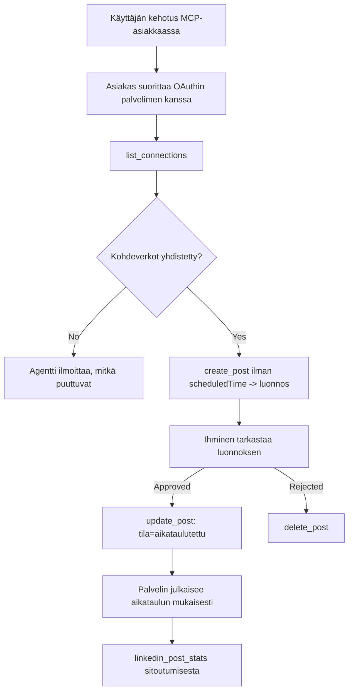

# Tapaustutkimus: Julkaiseminen sosiaalisiin verkostoihin agentin kautta etä-MCP-palvelimella

> **Vastuuvapauslauseke:** Useat palvelut ja avoimen lähdekoodin projektit voivat julkaista sosiaalisissa verkostoissa, ja tiimi voisi myös integroida kunkin verkoston API:n suoraan. Alla oleva skenaario toimii yhtenä esimerkkinä siitä, miten **kirjoitusoikeudellinen etä-MCP-palvelin** voidaan suunnitella ja hyödyntää. Publora on kaupallinen palvelu, jossa on ilmainen taso; tässä kuvattuja malleja sovelletaan mihin tahansa MCP-palvelimeen, joka suorittaa peruuttamattomia toimintoja käyttäjän puolesta.

## Yleiskatsaus

Agentit ovat hyviä luonnostelemaan sisältöä, mutta heikkoja toimittamaan sitä. Malli voi kirjoittaa julkaisuilmoituksen sekunneissa, ja sen jälkeen työ pysähtyy: julkaiseminen tarkoittaa API:a jokaista verkostoa varten, OAuth-sovellusta jokaiselle verkostolle ja eri joukkoa mediarajoja kullekin. Useimmat tiimit ratkaisevat tämän kopioimalla tekstin selaimeen käsin.

Tämä tapaustutkimus tarkastelee, miten tuo viimeinen vaihe suljetaan yhden etä-MCP-palvelimen avulla, ja – hyödyllisempänä kenelle tahansa, joka rakentaa sellaista – kirjoitusoikeudellisen palvelimen suunnittelupäätöksiä. Datan lukeminen on armollista. Julkaiseminen ei ole: väärä työkalukutsu näkyy yleisölle eikä sitä voi peruuttaa.

## Skenaario

Pieni kehittäjäsuhdetiimi laatii viestejä agentin sisällä (Claude, VS Code, Cursor – asiakasohjelman merkitys ei ole olennaista). He haluavat agentin:

- nähdä, mitkä sosiaaliset tilit tiimi on yhdistänyt,
- luonnostella julkaisun ja pitää sen luonnoksena ihmisen hyväksyttäväksi,
- liittää kuvan,
- ajoittaa sen useisiin verkostoihin valittuun aikaan,
- ja myöhemmin raportoida, miten se suoriutui.

Aivan olennaista on, että he haluavat agentin *ei pystyvän* julkaisemaan vahingossa samalla kun he edelleen kokeilevat.

## Käytetyt työkalut

- [Publora MCP Server](https://github.com/publora/mcp-server) — etä-MCP-palvelin (`streamable-http`), joka tarjoaa julkaisu-, ajoitus-, media- ja LinkedIn-analytiikkatyökaluja. Rekisteröity viralliseen MCP-rekisteriin nimellä `com.publora/mcp-server`.

## Vaihe vaiheelta työnkulku

1. **Yhdistä palvelin.** OAuthia tukevat asiakkaat suorittavat valtuutuskoodiprosessin PKCE:n kanssa palvelimen omalla suostumusnäytöllä; ne, jotka eivät tue, kuten päättömän komentorivin työkalut, käyttävät Publora API-avainta otsikossa. Molemmat polut ovat tuettuja, ja kumpi saadaan, riippuu asiakkaasta, ei palvelimesta.
2. **Listaa yhteydet.** Agentti kutsuu `list_connections` ja saa yhdistetyt tilit tunnisteineen.
3. **Laadi luonnos.** Agentti kutsuu `create_post` *ilman* ajastettua aikaa. Julkaisu tallennetaan luonnoksena — mitään ei julkaista.
4. **Liitä media.** Julkiset kuvan URL-osoitteet annetaan samassa kutsussa; palvelin lataa ja validoi ne.
5. **Ajoita.** Kun ihminen hyväksyy, `update_post` asettaa tilaksi ajoitetun ISO 8601 -aikamuodossa.
6. **Mittaa.** LinkedInin osalta `linkedin_post_stats` palauttaa sitoutumisen julkaisemisen jälkeen.

## Esimerkkiprompti

```text
Which social accounts do I have connected?
Draft a post announcing our new changelog page, attach the screenshot at
https://example.com/changelog.png, and keep it as a draft — do not publish it.
Once I approve, schedule it to LinkedIn and Bluesky for tomorrow at 09:00 UTC.
```

## Mermaid-kaaviokuvaus



## Tekninen toteutus

Alla olevat opit ovat tämän tapaustutkimuksen siirrettävissä oleva osa.

### Avoin löydettävyys, todennettu suoritus

`tools/list` tarjotaan ilman tunnistautumista; jokainen `tools/call` vaatii tokenin ja muuten palauttaa `401` vastauksen `WWW-Authenticate`-otsikolla, joka osoittaa suojatun resurssin metatietoihin. (Palvelin vastaa myös tunnistautumattomaan `initialize`-kutsuun, mikä on olennaista vain protokollaversioille ennen `2026-07-28`; tuo päivitys poisti kädenpuristuksen kokonaan.)

Tämä jako on käytännössä tärkeä. Rekisterit, luettelot ja asiakkaat voivat tutkia työkalupintaa – nimet, skeemat, annotaatiot – pitämättä salaisuutta, mutta mitään ei voi *suorittaa* nimettömänä. Palvelin, joka vaatii tokenin `initialize`-kutsulle, on käytännössä näkymätön työkaluille; palvelin, joka sallii nimettömän `tools/call`-kutsun, on riski.

### Rekisteröinti: dynaaminen asiakasrekisteröinti ja mitä se korvaa

Palvelin ilmoittaa `/.well-known/oauth-protected-resource` ja `/.well-known/oauth-authorization-server` osoitteet, ja tukee valtuutuskoodin virtausta PKCE:n (`S256`) kanssa, päivitystokeja ja **dynaamista asiakasrekisteröintiä**.

Dynaaminen rekisteröinti poistaa manuaalisen vaiheen: ilman sitä jokainen asiakas tarvitsee ennalta myönnetyn `client_id`:n, mikä tarkoittaa kanavan ulkopuolella tapahtuvaa pyyntöä myyjälle jokaiselle uudelle asiakkaalle.

Pidä tämä yhteensopivuuskäyttäytymisenä, älä kopioitavana suunnitteluna. `2026-07-28` version määrittely poistaa dynaamisen rekisteröinnin ja suosii Client ID Metadata Documents -menetelmää, jossa asiakas isännöi metatietodokumenttia vakaassa HTTPS-URL:ssa ja tuo URL *on* `client_id`. DCR toimii edelleen toistaiseksi, mutta tänään rakennettava palvelin sollte suunnitella CIMD:tä varten ja pitää DCR:n vain vanhemmille asiakkaille.

### Työkalun annotaatiot eivät ole koristeita

Jokaisella työkalulla on `title` ja soveltuvat vihjeet: `readOnlyHint`, `destructiveHint`, `idempotentHint`, `openWorldHint`.

Kaksi syytä panostaa niihin. Ensinnäkin asiakkaat käyttävät vihjeitä päättääkseen, mitä varmistaa käyttäjältä — asiakas voi käynnistää lukuoikeuksilla varman haun ja pysähtyä hyväksymään ennen poistamista. Määrittely korostaa, että annotaatiot ovat epäluotettavia vihjeitä, eivät valtuutusmekanismeja: ne muovaavat, mitä asiakas tarjoaa tehdä, mutta eivät estä mitään palvelimella, ja palvelimen on edelleen noudatettava omia sääntöjään. Toiseksi tärkeimmät liitinluettelot *vaativat* nykyään niitä arviointia varten; palvelin, jonka työkaluista puuttuu otsikot ja vihjeet, palautetaan takaisin riippumatta siitä, miten hyvin se toimii.

### Tee tunnisteista keksimättömiä

Alustatunnisteet ovat epämääräisiä merkkijonoja, jotka `list_connections` palauttaa, ja skeemakuvaus sanoo nimenomaisesti, että ne pitää kopioida sanasta sanaan, ei koskaan arvata. Palvelin hylkää kaiken muun.

Mallit arvaavat sujuvasti. Minkä tahansa kirjoitusoikeudellisen palvelimen pitäisi olettaa, että tunniste lopulta keksitään ja pitää estää se polku äänekkäästi ja varhain sen sijaan, että toimisi todennäköiseltä näyttävällä arvolla.

### Fehler ennen julkaisua, toimiva virheilmoitus

Jotkin verkostot eivät hyväksy pelkästään tekstiä ja vaativat kuvan tai videon. Tämä validoidaan, kun julkaisu ajoitetaan, ja virhe ilmoittaa alustan ja puuttuvan vaatimuksen.

Agentti voi toipua "Instagram vaatii median – liitä kuva tai video" -virheestä ilman ylimääräistä kierrosta. Se ei voi toipua geneerisestä `400`-virheestä.

### Tee uudelleenkäytöstä turvallista

Kaksi työtä tekemään sisältöä, `create_post` ja `update_post`, hyväksyvät idempotenssiavaimen: sen uudelleenkäyttö identtisen pyynnön kanssa toistaa alkuperäisen vastauksen sen sijaan, että luo toisen julkaisun. Agentin suoritusympäristöt yrittävät uudelleen aikakatkaisuissa; ilman idempotenssia hidas vastaus tuottaa kaksoisjulkaisun. Muut kirjoitustyökalut – poistot, mediatyöt, LinkedIn-reaktiot ja kommentit – eivät hyväksy avainta, joten siellä uudelleenkäyttö ei ole automaattisesti turvallista. Kannattaa tietää, mitkä omista muuttumisistasi ovat suojattuja ja mitkä eivät.

### Tarjoa testi, joka ei julkaise mitään

Palvelin hyväksyy varatun kohteen, `publora-playground`, joka validoidaan ja tunnustetaan kuin oikea kohde ja sitten hylätään — mitään ei päästä elävälle tilille. Se on kuvattu itse työkaluskeemassa, jonka mikä tahansa asiakas voi lukea ilman tunnistautumista: `platforms`-kenttä `create_post` näyttää sen "yhteystestikohteena, joka ei vaadi oikeaa yhteyttä – julkaisu tunnustetaan ja hylätään, mitään ei julkaista". Käytä sitä antamalla se yksittäisenä kohteena: `platforms: ["publora-playground"]`.

Tämä osoittautui yhdeksi hyödyllisimmistä yksityiskohdista koko pinnalla. Liitinluetteloiden tarkastajat, kontribuuttorit ja CI voivat testata koko kirjoituspolun alusta loppuun ilman vaaraa oikealle yleisölle. Mikä tahansa peruuttamattomia toimintoja sisältävä MCP-palvelin hyötyy dokumentoidusta ei-tekevän kohteesta.

## Tulokset ja vaikutukset

- Julkaisu siirtyi selaimesta samaan keskusteluun, jossa sisältö kirjoitetaan, ja luonnos ensin -tapa pitää ihmisen mukana. Ole tarkka, mitä se tarkoittaa: luonnos on sopimus, ei raja. Sama tunniste voi ajoittaa tai julkaista, joten kuka tahansa, joka tarvitsee todellisen hyväksymisportin, on valvottava sitä työkalun pinnan ulkopuolella – erilliset tunnisteet tai poliittinen taso palvelimen edessä.
- Verkostokohtaiset erot – mediat vaatimukset, ketjutus, vastausohjaukset – käsitellään kerran palvelimella sen sijaan, että jokainen agentti käsittelisi niitä erikseen.
- Sama palvelin tukee useita MCP-asiakkaita ilman asiakaskohtaista työtä, koska löydettävyys on avointa ja rekisteröinti dynaamista.
- Edellä kuvatut suunnittelurajoitteet muotoutuivat yhtä lailla liitinluetteloiden arviointien kuin käyttäjien vaikutuksesta: annotaatiot, OAuth ja turvallinen testikohde olivat kukin vähintään yhden vaatimuksia.

## Viitteet

- [Publora MCP Server (lähdekoodi)](https://github.com/publora/mcp-server)
- [Publora API ja MCP-dokumentaatio](https://docs.publora.com)
- [MCP-rekisteri-entry: `com.publora/mcp-server`](https://registry.modelcontextprotocol.io/v0/servers?search=com.publora/mcp-server)
- [MCP-määrittely – Valtuutus](https://modelcontextprotocol.io/specification/draft/basic/authorization)
- [MCP-määrittely – Työkaluannotaatiot](https://modelcontextprotocol.io/docs/concepts/tools)

## Mitä seuraavaksi

- Ota rakentamasi MCP-palvelin ja tarkista kolme helpointa parannusta tässä: annotaatiot jokaisessa työkalussa, idempotenssiavain jokaisessa kirjoituksessa ja dokumentoitu ei-tekevän kohde.
- Kokeile avointa löydettävyyden jakoa: kutsu `tools/list` julkiselle etäpalvelimelle ilman tunnistautumista, sitten kutsu työkalua ja tutki `401` haaste.
- Pohdi, mitä "kumoa" tarkoittaa omalla alueellasi. Julkaisussa on luonnokset ja poisto; jos toiminnollasi ei ole vastaavaa, vahvistus kuuluu työkalun suunnitteluun, ei kehotteeseen.

---

<!-- CO-OP TRANSLATOR DISCLAIMER START -->
**Vastuuvapauslauseke**:
Tämä asiakirja on käännetty käyttämällä tekoälypohjaista käännöspalvelua [Co-op Translator](https://github.com/Azure/co-op-translator). Vaikka pyrimme tarkkuuteen, otathan huomioon, että automaattiset käännökset saattavat sisältää virheitä tai epätarkkuuksia. Alkuperäinen asiakirja sen alkuperäiskielellä on virallinen lähde. Tärkeissä asioissa suositellaan ammattimaista ihmiskäännöstä. Emme ole vastuussa tämän käännöksen käytöstä aiheutuvista väärinymmärryksistä tai tulkinnoista.
<!-- CO-OP TRANSLATOR DISCLAIMER END -->