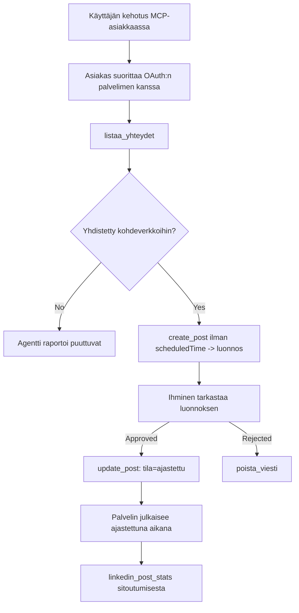

# Tapaustutkimus: Julkaiseminen sosiaalisiin verkostoihin agentilta etä-MCP-palvelimen kautta

> **Vastuuvapauslauseke:** Useat palvelut ja avoimen lähdekoodin projektit voivat julkaista sosiaalisissa verkostoissa, ja tiimi voi myös integroida kunkin verkoston API:n suoraan. Alla oleva tilannekuvaus esitetään yhtenä toimivana esimerkkinä siitä, miten **kirjoitusoikeuksin varustettu etä-MCP-palvelin** voidaan suunnitella ja hyödyntää. Publora on kaupallinen palvelu, jolla on ilmainen taso; tässä kuvattuja malleja sovelletaan mihin tahansa MCP-palvelimeen, joka suorittaa peruuttamattomia toimintoja käyttäjän puolesta.

## Yleiskatsaus

Agentit ovat hyviä luonnostelemaan sisältöä mutta huonoja sen toimittamisessa. Malli voi kirjoittaa tiedoteilmoituksen sekunneissa, ja sitten työ loppuu: julkaiseminen tarkoittaa API:a per verkosto, OAuth-sovellusta per verkosto ja erilaista mediakäytäntöä jokaiselle. Useimmat tiimit ratkaisevat tämän kopioimalla tekstin käsin selaimeen.

Tämä tapaustutkimus tarkastelee, miten tuo viimeinen vaihe hoidetaan yhdellä etä-MCP-palvelimella, ja — hyödyllisemmin kenelle tahansa sellaisen rakentajalle — mitkä suunnittelupäätökset **kirjoitusoikeuksin** varustetun palvelimen pitää saada oikein. Datan lukeminen on armollista. Julkaiseminen ei ole: väärä työkalukutsu näkyy yleisölle eikä sitä voi peruuttaa.

## Tilanne

Pieni kehittäjäsuhdetiimi luonnostelee julkaisuja agentissa (Claude, VS Code, Cursor – asiakasohjelmalla ei ole merkitystä). He haluavat agentin:

- näyttävän, mitkä sosiaalisen median tilit tiimillä on yhdistettynä,
- luonnostelemaan julkaisun ja pitämään sen luonnoksena ihmisen hyväksyttäväksi,
- liittämään kuvan,
- aikatauluttamaan sen useille verkostoille valittuun aikaan,
- ja myöhemmin raportoimaan siitä, miten se suoriutui.

Oleellisesti he haluavat, että agentti *ei pysty* julkaisemaan vahingossa samalla, kun he vielä kokeilevat.

## Käytetyt työkalut

- [Publora MCP Server](https://github.com/publora/mcp-server) — etä-MCP-palvelin (`streamable-http`), joka tarjoaa julkaisu-, aikataulu-, media- ja LinkedIn-analytiikkatyökaluja. Rekisteröity virallisessa MCP-rekisterissä nimellä `com.publora/mcp-server`.

## Vaiheittainen työnkulku

1. **Yhdistä palvelimeen.** OAuthia puhuvat asiakkaat suorittavat valtuutuskoodin PKCE-virran palvelimen omalla suostumusnäytöllä; asiakkaat, kuten käyttöliittymättömät CLI:t, käyttävät Publoran API-avainta otsikossa. Molemmat polut ovat tuettuja, ja kumpi saat, riippuu asiakkaasta, ei palvelimesta.
2. **Listaa yhteydet.** Agentti kutsuu `list_connections` ja saa yhdistetyt tilit tunnuksineen.
3. **Laadi.** Agentti kutsuu `create_post` *ilman* aikataulutettua aikaa. Julkaisu tallennetaan luonnoksena – mitään ei julkaista.
4. **Liitä media.** Julkiset kuvalinkit välitetään samassa kutsussa; palvelin lataa ja validoi ne.
5. **Aikatauluta.** Kun ihminen hyväksyy, `update_post` asettaa tilan aikataulutetuksi ISO 8601 -aikamerkinnällä.
6. **Mittaa.** LinkedIniä varten `linkedin_post_stats` palauttaa sitoutumisen julkaisun ollessa live-tilassa.

## Esimerkkipyyntö

```text
Which social accounts do I have connected?
Draft a post announcing our new changelog page, attach the screenshot at
https://example.com/changelog.png, and keep it as a draft — do not publish it.
Once I approve, schedule it to LinkedIn and Bluesky for tomorrow at 09:00 UTC.
```

## Mermaid-kaavio



## Tekninen toteutus

Alla olevat opit ovat tämän tapaustutkimuksen siirrettävä osa.

### Avoin haku, todennettu suoritus

`tools/list` tarjotaan ilman tunnistautumista; jokaista `tools/call`-kutsua varten tarvitaan token,
ja muuten se palauttaa `401` ja `WWW-Authenticate`-otsikon, joka osoittaa

suojatun resurssin metadata. Palvelimen vanha päätepiste vastaa myös
todennuksettomaan `initialize`-kutsuun protokollaversioiden ennen
`2026-07-28` asiakkaille; nykyiset asiakkaat eivät käytä kyseistä kädenpuristusta.

Tämä palvelinkohtainen jako sallii rekisterien, luetteloiden ja asiakkaiden tarkastella työkalujen
nimiä, skeemoja ja merkintöjä ilman salaisuutta samalla kun estetään anonyymi
suoritus. Avoin löydettävyys on käyttöönoton valinta, ei MCP-vaatimus; suojatussa käyttöönotossa saatetaan myös vaatia valtuutus `tools/list`-pyyntöön.


### Rekisteröinti: dynaaminen asiakasrekisteröinti ja sen korvaaja

Palvelin mainostaa `/.well-known/oauth-protected-resource` ja `/.well-known/oauth-authorization-server` -osoitteita, ja tukee valtuutuskoodivirtausta PKCE:n (`S256`), virkistystunnisteita ja **dynaamista asiakasrekisteröintiä**.

Dynaaminen rekisteröinti poisti manuaalisen vaiheen vanhoilta asiakkailta: ilman sitä
jokaisella asiakkaalla piti olla toimittajalta etukäteen myönnetty `client_id`.

Käsittele tätä yhteensopivuuskäyttäytymisenä ennemmin kuin mallina kopioitavaksi. Määrittelyn päivitetty versio `2026-07-28` poistaa käytöstä dynaamisen asiakasrekisteröinnin ja suosii Client ID Metadata Documents -ratkaisua, jossa asiakas ylläpitää metadokumenttia vakaan HTTPS-URL-osoitteen alla, ja tuo URL *on* `client_id`. DCR toimii toistaiseksi, mutta juhlakäyttöön rakennettavan palvelimen tulisi suunnitella CIMD:n mukaan ja säilyttää DCR vain vanhemmille asiakkaille.

### Työkalujen merkinnät eivät ole pelkkää koristelua

Jokaisella työkalulla on `title` ja sovellettavat vihjeet: `readOnlyHint`, `destructiveHint`, `idempotentHint`, `openWorldHint`.

Kaksi syytä panostaa niihin. Ensinnäkin asiakkaat käyttävät vihjeitä päättääkseen, mitä vahvistaa käyttäjältä — asiakas voi suorittaa automaattisesti lukuoikeuden sisältävän haun ja pyytää vahvistusta ennen poistoa. Määrittely on selkeä: merkinnät ovat epäluotettavia vihjeitä, eivät valtuutusmekanismi; ne ohjaavat mitä asiakas tarjoaa tehdä, ne eivät estä mitään palvelimella, ja palvelimen on silti noudatettava omia sääntöjään. Toiseksi suuret liitännäishakemistot nyt *vaativat* niitä arviointia varten; palvelin, jonka työkaluilla ei ole otsikoita ja vihjeitä, palautetaan takaisin riippumatta siitä, miten hyvin se toimii.

### Tee tunnisteista keksimättömiä

Alustan tunnisteet ovat läpinäkymättömiä merkkijonoja, jotka palautetaan `list_connections`-kutsusta, ja skeeman kuvaus sanoo suoraan, että ne täytyy kopioida sellaisenaan eikä niitä saa arvailla. Palvelin hylkää kaiken muun.

Mallit ovat sujuvia arvaajia. Jokaisen kirjoitusoikeudellisen palvelimen pitäisi olettaa, että tunniste lopulta keksitään ja aiheuttaa polun epäonnistumisen äänekkäästi ja aikaisin ennemmin kuin toimia uskottavalta näyttävän arvon perusteella.

### Epäonnistu ennen julkaisua, toiminnallisen viestin kera

Jotkut verkostot kieltäytyvät tekstipohjaisista julkaisuista ja vaativat kuvan tai videon. Tämä tarkistetaan, kun julkaisu ajastetaan, ja virhe ilmoittaa alustan ja puuttuvan vaatimuksen.

Agentti voi toipua "Instagram vaatii mediaa — liitä kuva tai video" -virheestä ilman lisäpyyntöä. Se ei pysty toipumaan yleisestä `400`-virheestä.

### Tee uudelleenyrituksista turvallisia

Kaksi sisältöä luovaa työkalua, `create_post` ja `update_post`, hyväksyvät idempotenssiavaimen: sen uudelleenkäyttö samanlaisella pyynnöllä toistaa alkuperäisen vastauksen luomatta toista julkaisua. Agenttikonsolit yrittävät uudelleen ajastinvirheissä; ilman idempotenssia hidas vastaus muuttuu kaksoisjulkaisuksi. Muut kirjoitustyökalut — poistot, median vaiheet, LinkedInin reaktiot ja kommentit — eivät ota sitä vastaan, joten uudelleenyrittäminen ei ole automaattisesti turvallista. On hyvä tietää, mitkä omat muutokset ovat suojattuja ja mitkä eivät.


### Tarjoa tapa testata, joka ei julkaise mitään


Palvelin hyväksyy varatun kohteen, `publora-playground`, joka validoidaan ja tunnustetaan kuten todellinen kohde ja sitten hylätään — mikään ei saavuta elävää tiliä. Se on kuvattu itse työkalun skeemassa, jonka mikä tahansa asiakas voi lukea ilman tunnuksia: `create_post`-kentän `platforms` kuvaa sitä "yhteystestikohteena, joka ei vaadi todellista yhteyttä — viesti tunnustetaan ja hylätään, mitään ei julkaista". Kutsu se välittämällä se ainoana tietona: `platforms: ["publora-playground"]`.

Tämä osoittautui yhdeksi hyödyllisimmistä koko käyttöliittymän yksityiskohdista. Liittimien hakemistolistojen arvioijat, kontribuuttorit ja jatkuvan integraation järjestelmät voivat testata koko kirjoituspolun päästä päähän ilman riskiä oikealle yleisölle. Mikä tahansa MCP-palvelin, jolla on peruuttamattomia toimintoja, hyötyy dokumentoidusta ei-toiminta-kohteesta.

## Tulokset ja vaikutus

- Julkaisuvaihe siirtyi selaimesta samaan keskusteluun, jossa sisältö kirjoitetaan, ja luonnoskeskeinen tapa pitää ihmisen osallistuneena. Ole tarkka siitä, mitä se on: luonnos on käytäntö, ei rajapinnoite. Sama tunniste voi aikatauluttaa tai julkaista, joten jokaisen, joka tarvitsee todellisen hyväksymisportin, on valvottava sitä työkalun ulkopuolella — erilliset tunnukset tai politiikkakerros palvelimen edessä.
- Verkkojen väliset erot — media-vaatimukset, ketjutus, vastausohjaukset — käsitellään palvelimessa kerralla sen sijaan, että joka agentti tekisi sen itse.
- Sama palvelin tukee useita MCP-asiakkaita ilman ennalta annettuja tunnuksia.
    Nykyiset asiakkaat voivat käyttää Client ID Metadata -dokumentteja; DCR toimii edelleen varajärjestelmänä
    vanhemmille asiakkaille.
- Suunnittelurajoitteet yllä muotoutuivat yhtä lailla liitinhakemiston arvostelujen kuin käyttäjien toimesta: annotaatiot, OAuth ja turvallinen testikohde olivat kukin vähintään yhden vaatimus.

## Viitteet

- [Publora MCP Server (lähde)](https://github.com/publora/mcp-server)
- [Publora API- ja MCP-dokumentaatio](https://docs.publora.com)
- [MCP-hakemiston merkintä: `com.publora/mcp-server`](https://registry.modelcontextprotocol.io/v0/servers?search=com.publora/mcp-server)
- [MCP-specifikaatio — Valtuutus](https://modelcontextprotocol.io/specification/2026-07-28/basic/authorization)
- [MCP-specifikaatio — Työkalujen annotaatiot](https://modelcontextprotocol.io/docs/concepts/tools)

## Mitä seuraavaksi

- Ota rakentamasi MCP-palvelin ja tarkista kolme halvinta parannusta tässä: annotaatiot jokaiseen työkaluun, idempotenssiavain jokaiseen kirjoitusoperaatioon ja dokumentoitu ei-toiminta-kohde.
- Kokeile avointa löytäminen -erottelua: kutsu `tools/list` julkiselle etäpalvelimelle ilman tunnuksia, kutsu sitten työkalua ja tarkastele `401`-haastetta.
- Pohdi, mitä "kumoa" tarkoittaa omalla alallasi. Julkaisemisessa on luonnokset ja poistot; jos toimillasi ei ole vastaavaa, vahvistus kuuluu työkalun suunnitteluun, ei kehotteeseen.

---

<!-- CO-OP TRANSLATOR DISCLAIMER START -->
**Vastuuvapauslauseke**:
Tämä asiakirja on käännetty käyttämällä tekoälypohjaista käännöspalvelua [Co-op Translator](https://github.com/Azure/co-op-translator). Vaikka pyrimme tarkkuuteen, otathan huomioon, että automaattiset käännökset saattavat sisältää virheitä tai epätarkkuuksia. Alkuperäinen asiakirja sen alkuperäiskielellä on virallinen lähde. Tärkeissä asioissa suositellaan ammattimaista ihmiskäännöstä. Emme ole vastuussa tämän käännöksen käytöstä aiheutuvista väärinymmärryksistä tai tulkinnoista.
<!-- CO-OP TRANSLATOR DISCLAIMER END -->